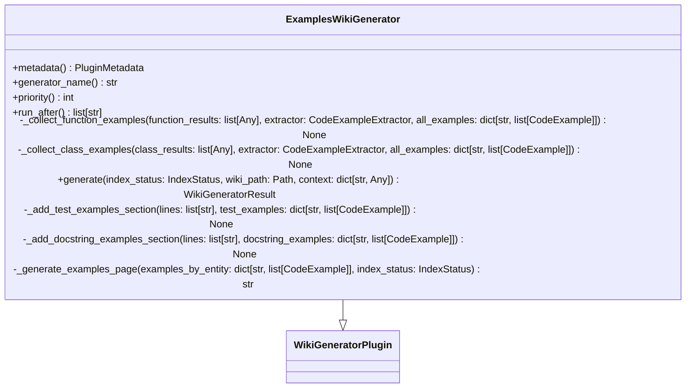

# File: `src/local_deepwiki/generators/examples/plugin.py`

## File Overview

This file implements the `ExamplesWikiGenerator` plugin, which is responsible for generating a centralized "Code Examples" wiki page by extracting usage examples from test files and docstrings across the codebase. The plugin integrates with the local-deepwiki system's wiki generation pipeline, serving as a utility for enriching documentation with real-world usage patterns.

The plugin's primary function is to [collect](../../web/routes_chat.md) code examples for functions and classes, categorize them into test-based and docstring-based examples, and format them into a structured Markdown page.

## Key Concepts

### Plugin Architecture
The `ExamplesWikiGenerator` class inherits from [`WikiGeneratorPlugin`](../../plugins/base.md), adhering to the plugin interface defined in `local_deepwiki.plugins.base`. This design allows the generator to be seamlessly integrated into the wiki generation workflow, respecting priorities and execution order.

### Example Extraction Strategy
The plugin uses a two-pronged approach to example collection:
1. **Test-based examples**: Extracted using [`CodeExampleExtractor`](extractor.md) from test files.
2. **Docstring examples**: Parsed from function/class docstrings using [`parse_docstring_examples`](docstring.md).

This dual strategy ensures comprehensive coverage of usage patterns, combining formal test cases with inline documentation examples.

### Asynchronous Processing
The plugin leverages `asyncio` for asynchronous search and example extraction operations, enabling efficient handling of vector store queries and parallel processing of multiple entities.

### Markdown Formatting
The final output is formatted using [`format_code_examples_markdown`](extractor.md) from the extractor module, ensuring consistent presentation of code snippets with appropriate syntax highlighting and descriptive text.

## Integration

This file is part of the `local_deepwiki.generators.examples` module and is designed to work within the broader local-deepwiki ecosystem.

### Usage in CLI
The plugin is used by the `ExamplesWikiGenerator` class, which is called by:
- `test_code_examples`
- `test_examples_plugin`

### External Dependencies
- **[`CodeExampleExtractor`](extractor.md)**: Core component for extracting examples from the codebase.
- **[`parse_docstring_examples`](docstring.md)**: Utility for parsing docstrings into structured examples.
- **[`format_code_examples_markdown`](extractor.md)**: Utility for formatting examples into Markdown.
- **[`WikiGeneratorPlugin`](../../plugins/base.md)**: Base class for defining wiki generation plugins.
- **[`IndexStatus`](../../models/wiki.md)**: Provides repository context for example extraction.
- **[`WikiPage`](../../export/streaming.md)**: Represents the generated wiki page structure.

### Integration Points
The plugin integrates with:
- The `local_deepwiki.plugins.base` system to register itself as a generator.
- The vector store for querying function and class definitions.
- The [`WikiGeneratorResult`](../../plugins/base.md) interface to return generated pages.

## Design Notes

### Prioritization and Execution Order
The plugin sets its priority to `50`, indicating it runs after main generators but before cross-linking. This ensures that examples are generated after core documentation is created but before any linking logic is applied.

### Filtering Logic
The plugin applies filtering logic to avoid processing:
- Functions/classes with names shorter than 3 characters.
- Test functions (starting with `test_`).
- Private functions/classes (starting with `_`).

This filtering prevents noise in the examples page and ensures only meaningful examples are included.

### Error Handling
The plugin implements robust error handling:
- Graceful degradation if `vector_store` is missing from context.
- Exception handling during example extraction, with logging for debugging.
- Checks for empty results to avoid generating empty pages.

### Asynchronous Event Loop Management
The `get_examples_for_api_page` function includes logic to detect if an event loop is already running, avoiding the creation of a new loop in environments where one is already active. This ensures compatibility with various execution contexts.

### Content Organization
The generated examples page is structured into two sections:
1. **Examples from Tests**: Shows real-world usage patterns.
2. **Examples from Documentation**: Displays docstring examples with expected outputs.

This organization helps users quickly find relevant examples based on their source.

## API Reference

### class `ExamplesWikiGenerator`

**Inherits from:** [`WikiGeneratorPlugin`](../../plugins/base.md)

Generate Examples sections for API documentation.  This plugin: 1. Scans all function and class chunks for docstring examples 2. Searches test files for usage examples 3. Generates a comprehensive Examples page 4. Optionally adds examples to individual API doc pages

**Methods:**


<details>
<summary>View Source (lines 33-265) | <a href="https://github.com/UrbanDiver/local-deepwiki-mcp/blob/main/src/local_deepwiki/generators/examples/plugin.py#L33-L265">GitHub</a></summary>

```python
class ExamplesWikiGenerator(WikiGeneratorPlugin):
    # Methods: metadata, generator_name, priority, run_after, _collect_function_examples, _collect_class_examples, generate, _add_test_examples_section, _add_docstring_examples_section, _generate_examples_page
```

</details>

#### `metadata`

```python
def metadata() -> PluginMetadata
```

Get plugin metadata.


<details>
<summary>View Source (lines 44-51) | <a href="https://github.com/UrbanDiver/local-deepwiki-mcp/blob/main/src/local_deepwiki/generators/examples/plugin.py#L44-L51">GitHub</a></summary>

```python
def metadata(self) -> PluginMetadata:
        """Get plugin metadata."""
        return PluginMetadata(
            name="examples-generator",
            version="1.0.0",
            description="Generate code examples from tests and docstrings",
            author="local-deepwiki",
        )
```

</details>

#### `generator_name`

```python
def generator_name() -> str
```

Get the generator name.


<details>
<summary>View Source (lines 54-56) | <a href="https://github.com/UrbanDiver/local-deepwiki-mcp/blob/main/src/local_deepwiki/generators/examples/plugin.py#L54-L56">GitHub</a></summary>

```python
def generator_name(self) -> str:
        """Get the generator name."""
        return "examples"
```

</details>

#### `priority`

```python
def priority() -> int
```

Run after main generators but before cross-linking.


<details>
<summary>View Source (lines 59-61) | <a href="https://github.com/UrbanDiver/local-deepwiki-mcp/blob/main/src/local_deepwiki/generators/examples/plugin.py#L59-L61">GitHub</a></summary>

```python
def priority(self) -> int:
        """Run after main generators but before cross-linking."""
        return 50
```

</details>

#### `run_after`

```python
def run_after() -> list[str]
```

Run after the api_docs generator if present.


<details>
<summary>View Source (lines 64-66) | <a href="https://github.com/UrbanDiver/local-deepwiki-mcp/blob/main/src/local_deepwiki/generators/examples/plugin.py#L64-L66">GitHub</a></summary>

```python
def run_after(self) -> list[str]:
        """Run after the api_docs generator if present."""
        return []
```

</details>

#### `generate`

```python
async def generate(index_status: IndexStatus, wiki_path: Path, context: dict[str, Any]) -> WikiGeneratorResult
```

Generate wiki pages with code examples.


| Parameter | Type | Default | Description |
|-----------|------|---------|-------------|
| `index_status` | `IndexStatus` | - | The repository index status. |
| `wiki_path` | `Path` | - | Path to the wiki output directory. |
| `context` | `dict[str, Any]` | - | Context dictionary with vector_store, llm, config, existing_pages. |


---


<details>
<summary>View Source (lines 120-176) | <a href="https://github.com/UrbanDiver/local-deepwiki-mcp/blob/main/src/local_deepwiki/generators/examples/plugin.py#L120-L176">GitHub</a></summary>

```python
async def generate(
        self,
        index_status: IndexStatus,
        wiki_path: Path,
        context: dict[str, Any],
    ) -> WikiGeneratorResult:
        """Generate wiki pages with code examples.

        Args:
            index_status: The repository index status.
            wiki_path: Path to the wiki output directory.
            context: Context dictionary with vector_store, llm, config, existing_pages.

        Returns:
            WikiGeneratorResult with generated examples page.
        """
        vector_store = context.get("vector_store")
        if vector_store is None:
            logger.debug("No vector_store in context, skipping examples generation")
            return WikiGeneratorResult(pages=[])

        repo_path = Path(index_status.repo_path)
        extractor = CodeExampleExtractor(vector_store, repo_path)
        all_examples: dict[str, list[CodeExample]] = {}

        try:
            function_results = await vector_store.search(
                query="function definition", limit=100, chunk_type="function"
            )
            class_results = await vector_store.search(
                query="class definition", limit=50, chunk_type="class"
            )
            await self._collect_function_examples(
                function_results, extractor, all_examples
            )
            await self._collect_class_examples(class_results, extractor, all_examples)
        except Exception as e:  # noqa: BLE001 — plugin isolation
            logger.debug("Error extracting examples: %s", e)
            return WikiGeneratorResult(pages=[])

        if not all_examples:
            logger.debug("No examples found in codebase")
            return WikiGeneratorResult(pages=[])

        content = self._generate_examples_page(all_examples, index_status)
        page = WikiPage(
            path="examples.md",
            title="Code Examples",
            content=content,
            generated_at=time.time(),
        )

        logger.info("Generated examples page with %s entities", len(all_examples))
        return WikiGeneratorResult(
            pages=[page],
            metadata={"total_entities": len(all_examples)},
        )
```

</details>

### Functions

#### `get_examples_for_api_page`

```python
def get_examples_for_api_page(entity_name: str, extractor: CodeExampleExtractor, docstring: str | None = None) -> str
```

Get formatted examples section for an API documentation page.  This is a helper function for integrating examples into existing API documentation pages.


| Parameter | Type | Default | Description |
|-----------|------|---------|-------------|
| `entity_name` | `str` | - | Name of the function/class. |
| `extractor` | `CodeExampleExtractor` | - | CodeExampleExtractor instance. |
| `docstring` | `str | None` | `None` | Optional docstring to extract examples from. |

**Returns:** `str`


<details>
<summary>View Source (lines 268-316) | <a href="https://github.com/UrbanDiver/local-deepwiki-mcp/blob/main/src/local_deepwiki/generators/examples/plugin.py#L268-L316">GitHub</a></summary>

```python
def get_examples_for_api_page(
    entity_name: str,
    extractor: CodeExampleExtractor,
    docstring: str | None = None,
) -> str:
    """Get formatted examples section for an API documentation page.

    This is a helper function for integrating examples into existing
    API documentation pages.

    Args:
        entity_name: Name of the function/class.
        extractor: CodeExampleExtractor instance.
        docstring: Optional docstring to extract examples from.

    Returns:
        Markdown string with examples section, or empty string.
    """
    import asyncio

    examples: list[CodeExample] = []

    # Get examples from extractor (runs async)
    try:
        asyncio.get_running_loop()
        logger.debug("Event loop already running, skipping async example extraction")
    except RuntimeError:
        loop = asyncio.new_event_loop()
        try:
            extracted = loop.run_until_complete(
                extractor.extract_examples_for_function(entity_name, max_examples=3)
            )
            examples.extend(extracted)
        except (RuntimeError, OSError, ValueError, TypeError) as e:
            logger.debug("Failed to extract examples for %s: %s", entity_name, e)
        finally:
            loop.close()

    # Add docstring examples
    if docstring:
        doc_examples = parse_docstring_examples(docstring)
        examples.extend(
            dataclasses.replace(ex, entity_name=entity_name) for ex in doc_examples
        )

    if not examples:
        return ""

    return format_code_examples_markdown(examples, max_examples=3)
```

</details>

## Class Diagram



## Call Graph

```mermaid
flowchart TD
    N0[CodeExampleExtractor]
    N1[ExamplesWikiGenerator._coll...]
    N2[ExamplesWikiGenerator._coll...]
    N3[ExamplesWikiGenerator._gene...]
    N4[ExamplesWikiGenerator.generate]
    N5[ExamplesWikiGenerator.metadata]
    N6[Path]
    N7[PluginMetadata]
    N8[WikiGeneratorResult]
    N9[WikiPage]
    N10[_add_docstring_examples_sec...]
    N11[_add_test_examples_section]
    N12[_collect_class_examples]
    N13[_collect_function_examples]
    N14[_generate_examples_page]
    N15[extract_examples_for_class]
    N16[extract_examples_for_function]
    N17[format_code_examples_markdown]
    N18[get_examples_for_api_page]
    N19[get_running_loop]
    N20[new_event_loop]
    N21[parse_docstring_examples]
    N22[run_until_complete]
    N23[search]
    N24[setdefault]
    N25[time]
    N18 --> N19
    N18 --> N20
    N18 --> N22
    N18 --> N16
    N18 --> N21
    N18 --> N17
    N5 --> N7
    N2 --> N16
    N2 --> N21
    N1 --> N15
    N1 --> N21
    N4 --> N8
    N4 --> N6
    N4 --> N0
    N4 --> N23
    N4 --> N13
    N4 --> N12
    N4 --> N14
    N4 --> N9
    N4 --> N25
    N3 --> N24
    N3 --> N11
    N3 --> N10
    classDef func fill:#e1f5fe
    class N0,N6,N7,N8,N9,N10,N11,N12,N13,N14,N15,N16,N17,N18,N19,N20,N21,N22,N23,N24,N25 func
    classDef method fill:#fff3e0
    class N1,N2,N3,N4,N5 method
```



## Used By

Functions and methods in this file and their callers:

- **[`CodeExampleExtractor`](extractor.md)**: called by `ExamplesWikiGenerator.generate`
- **`Path`**: called by `ExamplesWikiGenerator.generate`
- **[`PluginMetadata`](../../plugins/base.md)**: called by `ExamplesWikiGenerator.metadata`
- **[`WikiGeneratorResult`](../../plugins/base.md)**: called by `ExamplesWikiGenerator.generate`
- **[`WikiPage`](../../export/streaming.md)**: called by `ExamplesWikiGenerator.generate`
- **`_add_docstring_examples_section`**: called by `ExamplesWikiGenerator._generate_examples_page`
- **`_add_test_examples_section`**: called by `ExamplesWikiGenerator._generate_examples_page`
- **`_collect_class_examples`**: called by `ExamplesWikiGenerator.generate`
- **`_collect_function_examples`**: called by `ExamplesWikiGenerator.generate`
- **`_generate_examples_page`**: called by `ExamplesWikiGenerator.generate`
- **`extract_examples_for_class`**: called by `ExamplesWikiGenerator._collect_class_examples`
- **`extract_examples_for_function`**: called by `ExamplesWikiGenerator._collect_function_examples`, `get_examples_for_api_page`
- **[`format_code_examples_markdown`](extractor.md)**: called by `get_examples_for_api_page`
- **`get_running_loop`**: called by `get_examples_for_api_page`
- **`new_event_loop`**: called by `get_examples_for_api_page`
- **[`parse_docstring_examples`](docstring.md)**: called by `ExamplesWikiGenerator._collect_class_examples`, `ExamplesWikiGenerator._collect_function_examples`, `get_examples_for_api_page`
- **`run_until_complete`**: called by `get_examples_for_api_page`
- **`search`**: called by `ExamplesWikiGenerator.generate`
- **`setdefault`**: called by `ExamplesWikiGenerator._generate_examples_page`
- **`time`**: called by `ExamplesWikiGenerator.generate`

## Usage Examples

*Examples extracted from test files*

### Test handling ImportError for importlib.metadata (lines 291-292)

From `test_plugin_registry.py::TestLoadFromEntryPoints::test_load_from_entry_points_import_error`:

```python
"importlib.metadata.entry_points",
    side_effect=ImportError("No module"),
):
    loaded = registry.load_from_entry_points()
    # Should handle import error gracefully
    assert loaded == 0
```

### Test discover_plugins with custom directory (lines 319-320)

From `test_plugin_registry.py::TestDiscoverPlugins::test_discover_plugins_custom_dir`:

```python
custom_dir = tmp_path / "custom_plugins"
custom_dir.mkdir()

plugin_file = custom_dir / "custom.py"
plugin_file.write_text("x = 1")

with patch.object(registry, "load_from_entry_points", return_value=0):
    loaded = registry.discover_plugins(custom_dir=custom_dir)
    assert loaded >= 1
```

### Test Python 3.10+ entry_points interface

From `test_plugin_registry.py::TestEntryPointCompatibility::test_python310_entry_points_interface`:

```python
from importlib.metadata import entry_points

# Just verify the interface exists and doesn't crash
eps = entry_points(group="nonexistent_group_for_testing")
assert len(list(eps)) == 0
```


## Last Modified

| Entity | Type | Author | Date | Commit |
|--------|------|--------|------|--------|
| `ExamplesWikiGenerator` | class | Brian Breidenbach | 2 days ago | `8b8f36f` refactor: decompose CC > 15... |
| `_collect_function_examples` | method | Brian Breidenbach | 2 days ago | `8b8f36f` refactor: decompose CC > 15... |
| `_collect_class_examples` | method | Brian Breidenbach | 2 days ago | `8b8f36f` refactor: decompose CC > 15... |
| `generate` | method | Brian Breidenbach | 2 days ago | `8b8f36f` refactor: decompose CC > 15... |
| `_add_test_examples_section` | method | Brian Breidenbach | 2 days ago | `8b8f36f` refactor: decompose CC > 15... |
| `_add_docstring_examples_section` | method | Brian Breidenbach | 2 days ago | `8b8f36f` refactor: decompose CC > 15... |
| `_generate_examples_page` | method | Brian Breidenbach | 2 days ago | `8b8f36f` refactor: decompose CC > 15... |
| `get_examples_for_api_page` | function | Brian Breidenbach | 1 week ago | `fd8bb32` fix: code quality — consoli... |
| `metadata` | method | Brian Breidenbach | Jan 26, 2026 | `a64166a` Add seven medium-priority e... |
| `generator_name` | method | Brian Breidenbach | Jan 26, 2026 | `a64166a` Add seven medium-priority e... |
| `priority` | method | Brian Breidenbach | Jan 26, 2026 | `a64166a` Add seven medium-priority e... |
| `run_after` | method | Brian Breidenbach | Jan 26, 2026 | `a64166a` Add seven medium-priority e... |

## Additional Source Code

Source code for functions and methods not listed in the API Reference above.

#### `_collect_function_examples`

<details>
<summary>View Source (lines 68-92) | <a href="https://github.com/UrbanDiver/local-deepwiki-mcp/blob/main/src/local_deepwiki/generators/examples/plugin.py#L68-L92">GitHub</a></summary>

```python
async def _collect_function_examples(
        self,
        function_results: list[Any],
        extractor: CodeExampleExtractor,
        all_examples: dict[str, list[CodeExample]],
    ) -> None:
        """Collect examples for function chunks, updating *all_examples* in-place."""
        for result in function_results:
            chunk = result.chunk
            if not chunk.name or len(chunk.name) <= 2:
                continue
            if chunk.name.startswith(("test_", "_")):
                continue

            examples = await extractor.extract_examples_for_function(
                chunk.name, max_examples=2
            )
            if chunk.docstring:
                doc_examples = parse_docstring_examples(chunk.docstring)
                examples.extend(
                    dataclasses.replace(ex, entity_name=chunk.name)
                    for ex in doc_examples
                )
            if examples:
                all_examples[chunk.name] = examples[:3]
```

</details>


#### `_collect_class_examples`

<details>
<summary>View Source (lines 94-118) | <a href="https://github.com/UrbanDiver/local-deepwiki-mcp/blob/main/src/local_deepwiki/generators/examples/plugin.py#L94-L118">GitHub</a></summary>

```python
async def _collect_class_examples(
        self,
        class_results: list[Any],
        extractor: CodeExampleExtractor,
        all_examples: dict[str, list[CodeExample]],
    ) -> None:
        """Collect examples for class chunks, updating *all_examples* in-place."""
        for result in class_results:
            chunk = result.chunk
            if not chunk.name or len(chunk.name) <= 2:
                continue
            if chunk.name.startswith("_"):
                continue

            examples = await extractor.extract_examples_for_class(
                chunk.name, max_examples=2
            )
            if chunk.docstring:
                doc_examples = parse_docstring_examples(chunk.docstring)
                examples.extend(
                    dataclasses.replace(ex, entity_name=chunk.name)
                    for ex in doc_examples
                )
            if examples:
                all_examples[chunk.name] = examples[:3]
```

</details>


#### `_add_test_examples_section`

<details>
<summary>View Source (lines 179-200) | <a href="https://github.com/UrbanDiver/local-deepwiki-mcp/blob/main/src/local_deepwiki/generators/examples/plugin.py#L179-L200">GitHub</a></summary>

```python
def _add_test_examples_section(
        lines: list[str],
        test_examples: dict[str, list[CodeExample]],
    ) -> None:
        """Append the 'Examples from Tests' section to *lines* in-place."""
        lines.extend(
            [
                "## Examples from Tests",
                "",
                "Real-world usage patterns extracted from test files.",
                "",
            ]
        )
        for entity_name in sorted(test_examples):
            lines.append(f"### `{entity_name}`\n")
            for ex in test_examples[entity_name][:2]:
                if ex.description:
                    lines.append(f"*{ex.description}*\n")
                if ex.test_file:
                    lines.append(f"From `{ex.test_file}`:\n")
                lang = ex.language or "python"
                lines.append(f"```{lang}\n{ex.code}\n```\n")
```

</details>


#### `_add_docstring_examples_section`

<details>
<summary>View Source (lines 203-224) | <a href="https://github.com/UrbanDiver/local-deepwiki-mcp/blob/main/src/local_deepwiki/generators/examples/plugin.py#L203-L224">GitHub</a></summary>

```python
def _add_docstring_examples_section(
        lines: list[str],
        docstring_examples: dict[str, list[CodeExample]],
    ) -> None:
        """Append the 'Examples from Documentation' section to *lines* in-place."""
        lines.extend(
            [
                "## Examples from Documentation",
                "",
                "Examples extracted from docstrings.",
                "",
            ]
        )
        for entity_name in sorted(docstring_examples):
            lines.append(f"### `{entity_name}`\n")
            for ex in docstring_examples[entity_name][:2]:
                if ex.description:
                    lines.append(f"*{ex.description}*\n")
                lang = ex.language or "python"
                lines.append(f"```{lang}\n{ex.code}\n```\n")
                if ex.expected_output:
                    lines.append(f"Output:\n```\n{ex.expected_output}\n```\n")
```

</details>


#### `_generate_examples_page`

<details>
<summary>View Source (lines 227-265) | <a href="https://github.com/UrbanDiver/local-deepwiki-mcp/blob/main/src/local_deepwiki/generators/examples/plugin.py#L227-L265">GitHub</a></summary>

```python
def _generate_examples_page(
        examples_by_entity: dict[str, list[CodeExample]],
        index_status: IndexStatus,
    ) -> str:
        """Generate the examples page content.

        Args:
            examples_by_entity: Mapping of entity name to examples.
            index_status: Index status for repo info.

        Returns:
            Markdown content for the examples page.
        """
        lines = [
            "# Code Examples",
            "",
            "This page contains usage examples extracted from test files and docstrings.",
            "",
            f"**Total entities with examples:** {len(examples_by_entity)}",
            "",
        ]

        test_examples: dict[str, list[CodeExample]] = {}
        docstring_examples: dict[str, list[CodeExample]] = {}
        for entity_name, examples in examples_by_entity.items():
            for ex in examples:
                if ex.source == "test":
                    test_examples.setdefault(entity_name, []).append(ex)
                else:
                    docstring_examples.setdefault(entity_name, []).append(ex)

        if test_examples:
            ExamplesWikiGenerator._add_test_examples_section(lines, test_examples)
        if docstring_examples:
            ExamplesWikiGenerator._add_docstring_examples_section(
                lines, docstring_examples
            )

        return "\n".join(lines)
```

</details>

## Relevant Source Files

- `src/local_deepwiki/generators/examples/plugin.py:33-265`
