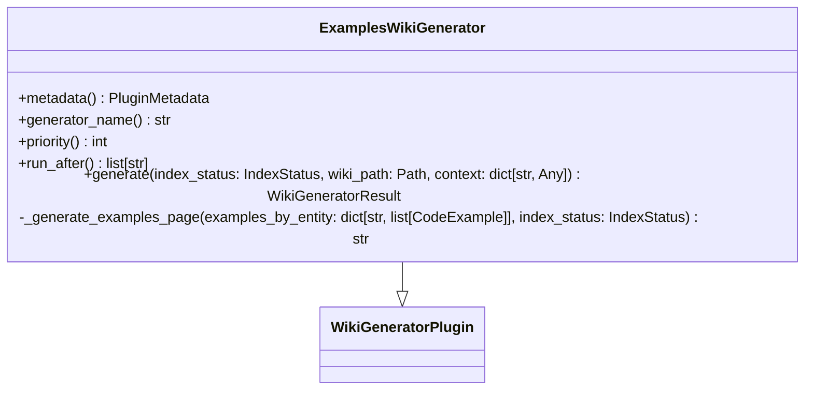

# File Overview

This file, `src/local_deepwiki/generators/examples_plugin.py`, defines the `ExamplesWikiGenerator` plugin responsible for generating code examples from test files and docstrings. It integrates with the wiki generation pipeline to produce an examples page summarizing usage examples extracted from the codebase.

## Key Dependencies

- `time`: Standard library for time-related operations.
- `pathlib.Path`: For handling file paths.
- `typing.Any`: For flexible typing.
- `local_deepwiki.generators.test_examples`: Provides utilities for extracting and formatting code examples.
- `local_deepwiki.logging`: For logging.
- `local_deepwiki.models`: Includes [`ChunkType`](../models.md), [`IndexStatus`](../models.md), and [`WikiPage`](../export/streaming.md) models.
- `local_deepwiki.plugins.base`: Provides base classes for plugins including [`PluginMetadata`](../plugins/base.md), [`WikiGeneratorPlugin`](../plugins/base.md), and [`WikiGeneratorResult`](../plugins/base.md).
- `asyncio`: For asynchronous operations.

## Integration

This file is used by:
- `ExamplesWikiGenerator` class, which is called by `test_code_examples` and `test_examples_plugin` tests.

## Related Files

- `src/local_deepwiki/core/__init__.py`
- `src/local_deepwiki/generators/source_refs.py`
- `src/local_deepwiki/plugins/base.py`
- `tests/__init__.py`
- `tests/test_plugins.py`

# Classes

## ExamplesWikiGenerator

The `ExamplesWikiGenerator` class is a plugin for generating wiki pages containing code examples extracted from tests and docstrings.

### Methods

#### metadata

```python
def metadata(self) -> PluginMetadata
```

- **Purpose**: Returns metadata about the plugin.
- **Returns**: A [`PluginMetadata`](../plugins/base.md) object containing the plugin's name, version, description, and author.

#### generator_name

```python
def generator_name(self) -> str
```

- **Purpose**: Returns the name of the generator.
- **Returns**: A string `"examples"`.

#### priority

```python
def priority(self) -> int
```

- **Purpose**: Defines the execution priority of the plugin.
- **Returns**: An integer `50`, indicating it runs after [main](../export/pdf.md) generators but before cross-linking.

#### run_after

```python
def run_after(self) -> list[str]
```

- **Purpose**: Specifies which plugins this one should run after.
- **Returns**: An empty list `[]`, meaning it runs independently.

#### generate

```python
async def generate(
    self,
    index_status: IndexStatus,
    wiki_path: Path,
    context: dict[str, Any],
) -> WikiGeneratorResult
```

- **Purpose**: Asynchronously generates a wiki page with code examples.
- **Parameters**:
  - `index_status`: The repository index status.
  - `wiki_path`: Path to the wiki output directory.
  - `context`: Dictionary containing `vector_store`, `llm`, `config`, and `existing_pages`.
- **Returns**: A [`WikiGeneratorResult`](../plugins/base.md) object with the generated examples page.

#### _generate_examples_page

```python
def _generate_examples_page(
    self,
    examples_by_entity: dict[str, list[CodeExample]],
    index_status: IndexStatus,
) -> str
```

- **Purpose**: Generates the markdown content for the examples page.
- **Parameters**:
  - `examples_by_entity`: Mapping of entity names to lists of [`CodeExample`](test_examples.md).
  - `index_status`: Index status for repository information.
- **Returns**: A markdown-formatted string representing the examples page.

# Functions

## get_examples_for_api_page

```python
def get_examples_for_api_page(
    entity_name: str,
    extractor: CodeExampleExtractor,
    docstring: str | None = None,
) -> str
```

- **Purpose**: Helper function to retrieve and format a markdown examples section for an API documentation page.
- **Parameters**:
  - `entity_name`: Name of the function or class.
  - `extractor`: Instance of [`CodeExampleExtractor`](test_examples.md) to extract examples.
  - `docstring`: Optional docstring to extract examples from.
- **Returns**: A markdown string with the examples section or an empty string if no examples are found.

## API Reference

### class `ExamplesWikiGenerator`

**Inherits from:** [`WikiGeneratorPlugin`](../plugins/base.md)

Generate Examples sections for API documentation.  This plugin: 1. Scans all function and class chunks for docstring examples 2. Searches test files for usage examples 3. Generates a comprehensive Examples page 4. Optionally adds examples to individual API doc pages

**Methods:**


<details>
<summary>View Source (lines 30-260) | <a href="https://github.com/UrbanDiver/local-deepwiki-mcp/blob/[main](../export/pdf.md)/src/local_deepwiki/generators/examples_plugin.py#L30-L260">GitHub</a></summary>

```python
class ExamplesWikiGenerator(WikiGeneratorPlugin):
    # Methods: metadata, generator_name, priority, run_after, generate, _generate_examples_page
```

</details>

#### `metadata`

```python
def metadata() -> PluginMetadata
```

Get plugin metadata.


<details>
<summary>View Source (lines 41-48) | <a href="https://github.com/UrbanDiver/local-deepwiki-mcp/blob/[main](../export/pdf.md)/src/local_deepwiki/generators/examples_plugin.py#L41-L48">GitHub</a></summary>

```python
def metadata(self) -> PluginMetadata:
        """Get plugin metadata."""
        return PluginMetadata(
            name="examples-generator",
            version="1.0.0",
            description="Generate code examples from tests and docstrings",
            author="local-deepwiki",
        )
```

</details>

#### `generator_name`

```python
def generator_name() -> str
```

Get the generator name.


<details>
<summary>View Source (lines 51-53) | <a href="https://github.com/UrbanDiver/local-deepwiki-mcp/blob/[main](../export/pdf.md)/src/local_deepwiki/generators/examples_plugin.py#L51-L53">GitHub</a></summary>

```python
def generator_name(self) -> str:
        """Get the generator name."""
        return "examples"
```

</details>

#### `priority`

```python
def priority() -> int
```

Run after [main](../export/pdf.md) generators but before cross-linking.


<details>
<summary>View Source (lines 56-58) | <a href="https://github.com/UrbanDiver/local-deepwiki-mcp/blob/[main](../export/pdf.md)/src/local_deepwiki/generators/examples_plugin.py#L56-L58">GitHub</a></summary>

```python
def priority(self) -> int:
        """Run after main generators but before cross-linking."""
        return 50
```

</details>

#### `run_after`

```python
def run_after() -> list[str]
```

Run after the api_docs generator if present.


<details>
<summary>View Source (lines 61-63) | <a href="https://github.com/UrbanDiver/local-deepwiki-mcp/blob/[main](../export/pdf.md)/src/local_deepwiki/generators/examples_plugin.py#L61-L63">GitHub</a></summary>

```python
def run_after(self) -> list[str]:
        """Run after the api_docs generator if present."""
        return []
```

</details>

#### `generate`

```python
async def generate(index_status: IndexStatus, wiki_path: Path, context: dict[str, Any]) -> WikiGeneratorResult
```

Generate wiki pages with code examples.


| [Parameter](api_docs.md) | Type | Default | Description |
|-----------|------|---------|-------------|
| `index_status` | [`IndexStatus`](../models.md) | - | The repository index status. |
| `wiki_path` | `Path` | - | Path to the wiki output directory. |
| `context` | `dict[str, Any]` | - | Context dictionary with vector_store, llm, config, existing_pages. |


---


<details>
<summary>View Source (lines 65-179) | <a href="https://github.com/UrbanDiver/local-deepwiki-mcp/blob/[main](../export/pdf.md)/src/local_deepwiki/generators/examples_plugin.py#L65-L179">GitHub</a></summary>

```python
async def generate(
        self,
        index_status: IndexStatus,
        wiki_path: Path,
        context: dict[str, Any],
    ) -> WikiGeneratorResult:
        """Generate wiki pages with code examples.

        Args:
            index_status: The repository index status.
            wiki_path: Path to the wiki output directory.
            context: Context dictionary with vector_store, llm, config, existing_pages.

        Returns:
            WikiGeneratorResult with generated examples page.
        """
        vector_store = context.get("vector_store")
        if vector_store is None:
            logger.warning("No vector_store in context, skipping examples generation")
            return WikiGeneratorResult(pages=[])

        repo_path = Path(index_status.repo_path)

        # Create the extractor
        extractor = CodeExampleExtractor(vector_store, repo_path)

        # Collect examples from all documented entities
        all_examples: dict[str, list[CodeExample]] = {}

        # Get all function and class chunks
        try:
            # Search for functions and classes
            function_results = await vector_store.search(
                query="function definition",
                limit=100,
                chunk_type="function",
            )
            class_results = await vector_store.search(
                query="class definition",
                limit=50,
                chunk_type="class",
            )

            # Extract examples for functions
            for result in function_results:
                chunk = result.chunk
                if not chunk.name or len(chunk.name) <= 2:
                    continue

                # Skip test functions and private functions
                if chunk.name.startswith(("test_", "_")):
                    continue

                # Get examples for this function
                examples = await extractor.extract_examples_for_function(
                    chunk.name, max_examples=2
                )

                # Also extract from docstring directly
                if chunk.docstring:
                    doc_examples = parse_docstring_examples(chunk.docstring)
                    for ex in doc_examples:
                        ex.entity_name = chunk.name
                    examples.extend(doc_examples)

                if examples:
                    all_examples[chunk.name] = examples[:3]  # Limit per entity

            # Extract examples for classes
            for result in class_results:
                chunk = result.chunk
                if not chunk.name or len(chunk.name) <= 2:
                    continue

                # Skip private classes
                if chunk.name.startswith("_"):
                    continue

                examples = await extractor.extract_examples_for_class(
                    chunk.name, max_examples=2
                )

                if chunk.docstring:
                    doc_examples = parse_docstring_examples(chunk.docstring)
                    for ex in doc_examples:
                        ex.entity_name = chunk.name
                    examples.extend(doc_examples)

                if examples:
                    all_examples[chunk.name] = examples[:3]

        except Exception as e:
            logger.warning(f"Error extracting examples: {e}")
            return WikiGeneratorResult(pages=[])

        if not all_examples:
            logger.debug("No examples found in codebase")
            return WikiGeneratorResult(pages=[])

        # Generate the examples page
        content = self._generate_examples_page(all_examples, index_status)

        page = WikiPage(
            path="examples.md",
            title="Code Examples",
            content=content,
            generated_at=time.time(),
        )

        logger.info(f"Generated examples page with {len(all_examples)} entities")

        return WikiGeneratorResult(
            pages=[page],
            metadata={"total_entities": len(all_examples)},
        )
```

</details>

### Functions

#### `get_examples_for_api_page`

```python
def get_examples_for_api_page(entity_name: str, extractor: CodeExampleExtractor, docstring: str | None = None) -> str
```

Get formatted examples section for an API documentation page.  This is a helper function for integrating examples into existing API documentation pages.


| [Parameter](api_docs.md) | Type | Default | Description |
|-----------|------|---------|-------------|
| `entity_name` | `str` | - | Name of the function/class. |
| `extractor` | [`CodeExampleExtractor`](test_examples.md) | - | [CodeExampleExtractor](test_examples.md) instance. |
| `docstring` | `str | None` | `None` | Optional docstring to extract examples from. |

**Returns:** `str`


<details>
<summary>View Source (lines 263-310) | <a href="https://github.com/UrbanDiver/local-deepwiki-mcp/blob/[main](../export/pdf.md)/src/local_deepwiki/generators/examples_plugin.py#L263-L310">GitHub</a></summary>

```python
def get_examples_for_api_page(
    entity_name: str,
    extractor: CodeExampleExtractor,
    docstring: str | None = None,
) -> str:
    """Get formatted examples section for an API documentation page.

    This is a helper function for integrating examples into existing
    API documentation pages.

    Args:
        entity_name: Name of the function/class.
        extractor: CodeExampleExtractor instance.
        docstring: Optional docstring to extract examples from.

    Returns:
        Markdown string with examples section, or empty string.
    """
    import asyncio

    examples: list[CodeExample] = []

    # Get examples from extractor (runs async)
    try:
        loop = asyncio.get_event_loop()
        if loop.is_running():
            # Can't use run_until_complete in running loop
            # Return docstring examples only
            pass
        else:
            extracted = loop.run_until_complete(
                extractor.extract_examples_for_function(entity_name, max_examples=3)
            )
            examples.extend(extracted)
    except Exception:
        pass

    # Add docstring examples
    if docstring:
        doc_examples = parse_docstring_examples(docstring)
        for ex in doc_examples:
            ex.entity_name = entity_name
        examples.extend(doc_examples)

    if not examples:
        return ""

    return format_code_examples_markdown(examples, max_examples=3)
```

</details>

## Class Diagram



## Call Graph

```mermaid
flowchart TD
    N0[CodeExampleExtractor]
    N1[ExamplesWikiGenerator._gene...]
    N2[ExamplesWikiGenerator.generate]
    N3[ExamplesWikiGenerator.metadata]
    N4[Path]
    N5[PluginMetadata]
    N6[WikiGeneratorResult]
    N7[WikiPage]
    N8[_generate_examples_page]
    N9[extract_examples_for_class]
    N10[extract_examples_for_function]
    N11[format_code_examples_markdown]
    N12[get_event_loop]
    N13[get_examples_for_api_page]
    N14[is_running]
    N15[parse_docstring_examples]
    N16[run_until_complete]
    N17[search]
    N18[setdefault]
    N19[time]
    N13 --> N12
    N13 --> N14
    N13 --> N16
    N13 --> N10
    N13 --> N15
    N13 --> N11
    N3 --> N5
    N2 --> N6
    N2 --> N4
    N2 --> N0
    N2 --> N17
    N2 --> N10
    N2 --> N15
    N2 --> N9
    N2 --> N8
    N2 --> N7
    N2 --> N19
    N1 --> N18
    classDef func fill:#e1f5fe
    class N0,N4,N5,N6,N7,N8,N9,N10,N11,N12,N13,N14,N15,N16,N17,N18,N19 func
    classDef method fill:#fff3e0
    class N1,N2,N3 method
```



## Used By

Functions and methods in this file and their callers:

- **[`CodeExampleExtractor`](test_examples.md)**: called by `ExamplesWikiGenerator.generate`
- **`Path`**: called by `ExamplesWikiGenerator.generate`
- **[`PluginMetadata`](../plugins/base.md)**: called by `ExamplesWikiGenerator.metadata`
- **[`WikiGeneratorResult`](../plugins/base.md)**: called by `ExamplesWikiGenerator.generate`
- **[`WikiPage`](../export/streaming.md)**: called by `ExamplesWikiGenerator.generate`
- **`_generate_examples_page`**: called by `ExamplesWikiGenerator.generate`
- **`extract_examples_for_class`**: called by `ExamplesWikiGenerator.generate`
- **`extract_examples_for_function`**: called by `ExamplesWikiGenerator.generate`, `get_examples_for_api_page`
- **[`format_code_examples_markdown`](test_examples.md)**: called by `get_examples_for_api_page`
- **`get_event_loop`**: called by `get_examples_for_api_page`
- **`is_running`**: called by `get_examples_for_api_page`
- **[`parse_docstring_examples`](test_examples.md)**: called by `ExamplesWikiGenerator.generate`, `get_examples_for_api_page`
- **`run_until_complete`**: called by `get_examples_for_api_page`
- **`search`**: called by `ExamplesWikiGenerator.generate`
- **`setdefault`**: called by `ExamplesWikiGenerator._generate_examples_page`
- **`time`**: called by `ExamplesWikiGenerator.generate`

## Usage Examples

*Examples extracted from test files*

### Test plugin metadata is correct

From `test_examples_plugin.py::TestExamplesWikiGeneratorMetadata::test_metadata`:

```python
generator = ExamplesWikiGenerator()
metadata = generator.metadata

assert metadata.name == "examples-generator"
assert metadata.version == "1.0.0"
```

### Test plugin metadata is correct

From `test_examples_plugin.py::TestExamplesWikiGeneratorMetadata::test_metadata`:

```python
generator = ExamplesWikiGenerator()
metadata = generator.metadata

assert metadata.name == "examples-generator"
assert metadata.version == "1.0.0"
assert metadata.author == "local-deepwiki"
assert "code examples" in metadata.description.lower()
```

### Test generator_name property

From `test_examples_plugin.py::TestExamplesWikiGeneratorMetadata::test_generator_name`:

```python
generator = ExamplesWikiGenerator()
assert generator.generator_name == "examples"
```

### Test generator_name property

From `test_examples_plugin.py::TestExamplesWikiGeneratorMetadata::test_generator_name`:

```python
generator = ExamplesWikiGenerator()
assert generator.generator_name == "examples"
```

### Test priority property

From `test_examples_plugin.py::TestExamplesWikiGeneratorMetadata::test_priority`:

```python
generator = ExamplesWikiGenerator()
assert generator.priority == 50
```


## Last Modified

| Entity | Type | Author | Date | Commit |
|--------|------|--------|------|--------|
| `ExamplesWikiGenerator` | class | Brian Breidenbach | 1 week ago | `a64166a` Add seven medium-priority e... |
| `metadata` | method | Brian Breidenbach | 1 week ago | `a64166a` Add seven medium-priority e... |
| `generator_name` | method | Brian Breidenbach | 1 week ago | `a64166a` Add seven medium-priority e... |
| `priority` | method | Brian Breidenbach | 1 week ago | `a64166a` Add seven medium-priority e... |
| `run_after` | method | Brian Breidenbach | 1 week ago | `a64166a` Add seven medium-priority e... |
| `generate` | method | Brian Breidenbach | 1 week ago | `a64166a` Add seven medium-priority e... |
| `_generate_examples_page` | method | Brian Breidenbach | 1 week ago | `a64166a` Add seven medium-priority e... |
| `get_examples_for_api_page` | function | Brian Breidenbach | 1 week ago | `a64166a` Add seven medium-priority e... |

## Additional Source Code

Source code for functions and methods not listed in the API Reference above.

#### `_generate_examples_page`

<details>
<summary>View Source (lines 181-260) | <a href="https://github.com/UrbanDiver/local-deepwiki-mcp/blob/[main](../export/pdf.md)/src/local_deepwiki/generators/examples_plugin.py#L181-L260">GitHub</a></summary>

```python
def _generate_examples_page(
        self,
        examples_by_entity: dict[str, list[CodeExample]],
        index_status: IndexStatus,
    ) -> str:
        """Generate the examples page content.

        Args:
            examples_by_entity: Mapping of entity name to examples.
            index_status: Index status for repo info.

        Returns:
            Markdown content for the examples page.
        """
        lines = [
            "# Code Examples",
            "",
            "This page contains usage examples extracted from test files and docstrings.",
            "",
            f"**Total entities with examples:** {len(examples_by_entity)}",
            "",
        ]

        # Group by source (test vs docstring)
        test_examples: dict[str, list[CodeExample]] = {}
        docstring_examples: dict[str, list[CodeExample]] = {}

        for entity_name, examples in examples_by_entity.items():
            for ex in examples:
                if ex.source == "test":
                    test_examples.setdefault(entity_name, []).append(ex)
                else:
                    docstring_examples.setdefault(entity_name, []).append(ex)

        # Section for test examples
        if test_examples:
            lines.extend([
                "## Examples from Tests",
                "",
                "Real-world usage patterns extracted from test files.",
                "",
            ])

            for entity_name in sorted(test_examples.keys()):
                examples = test_examples[entity_name]
                lines.append(f"### `{entity_name}`\n")

                for ex in examples[:2]:
                    if ex.description:
                        lines.append(f"*{ex.description}*\n")
                    if ex.test_file:
                        lines.append(f"From `{ex.test_file}`:\n")

                    lang = ex.language or "python"
                    lines.append(f"```{lang}\n{ex.code}\n```\n")

        # Section for docstring examples
        if docstring_examples:
            lines.extend([
                "## Examples from Documentation",
                "",
                "Examples extracted from docstrings.",
                "",
            ])

            for entity_name in sorted(docstring_examples.keys()):
                examples = docstring_examples[entity_name]
                lines.append(f"### `{entity_name}`\n")

                for ex in examples[:2]:
                    if ex.description:
                        lines.append(f"*{ex.description}*\n")

                    lang = ex.language or "python"
                    lines.append(f"```{lang}\n{ex.code}\n```\n")

                    if ex.expected_output:
                        lines.append(f"Output:\n```\n{ex.expected_output}\n```\n")

        return "\n".join(lines)
```

</details>

## Relevant Source Files

- `src/local_deepwiki/generators/examples_plugin.py:30-260`
