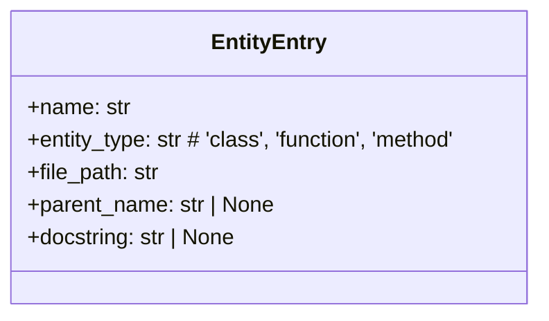
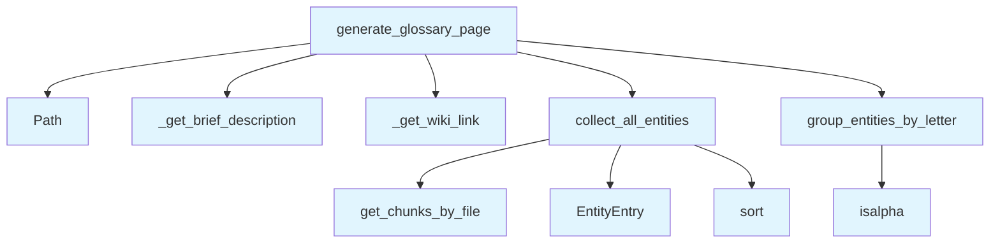

# Glossary Generator

## File Overview

The `glossary.py` module provides functionality for generating glossary pages from entities stored in a vector database. It collects entities, groups them alphabetically, and creates formatted glossary documentation with wiki-style links and descriptions.

## Classes

### EntityEntry

```python
@dataclass
class EntityEntry:
```

A data class that represents an entry in the glossary. This class uses the `@dataclass` [decorator](../providers/base.md) to automatically generate initialization and other standard methods for storing entity information.

## Functions

### collect_all_entities

```python
def collect_all_entities(vector_store: VectorStore) -> list[EntityEntry]:
```

Collects all entities from the provided vector store and returns them as a list of EntityEntry objects.

**Parameters:**
- `vector_store` ([VectorStore](../core/vectorstore.md)): The vector store instance to query for entities

**Returns:**
- `list[EntityEntry]`: A list of all entities found in the vector store

### group_entities_by_letter

```python
def group_entities_by_letter(entities: list[EntityEntry]) -> dict:
```

Groups a list of entities alphabetically by their first letter for organized display in the glossary.

**Parameters:**
- `entities` (list[EntityEntry]): List of entity entries to group

**Returns:**
- `dict`: Dictionary with letters as keys and lists of entities as values

### _get_wiki_link

```python
def _get_wiki_link(...) -> str:
```

A private helper function that generates wiki-style links for entities. The exact parameters are not visible in the provided code summary.

**Returns:**
- `str`: A formatted wiki link string

### _get_brief_description

```python
def _get_brief_description(...) -> str:
```

A private helper function that generates brief descriptions for entities. The exact parameters are not visible in the provided code summary.

**Returns:**
- `str`: A brief description string for the entity

### generate_glossary_page

```python
def generate_glossary_page(...) -> str:
```

The [main](../export/pdf.md) function that generates a complete glossary page. This function likely orchestrates the collection, grouping, and formatting of entities into a final glossary document. The exact parameters are not visible in the provided code summary.

**Returns:**
- `str`: The complete glossary page content as a string

## Usage Examples

```python
from local_deepwiki.generators.glossary import collect_all_entities, group_entities_by_letter, generate_glossary_page
from local_deepwiki.core.vectorstore import VectorStore

# Initialize vector store
vector_store = VectorStore()

# Collect all entities
entities = collect_all_entities(vector_store)

# Group entities alphabetically
grouped_entities = group_entities_by_letter(entities)

# Generate complete glossary page
glossary_content = generate_glossary_page(...)
```

## Related Components

This module integrates with several other components:

- **[VectorStore](../core/vectorstore.md)**: Used to query and retrieve entity information from the vector database
- **[ChunkType](../models.md)**: Referenced from the models module, likely used to filter or categorize different types of content chunks
- **[IndexStatus](../models.md)**: Also from the models module, potentially used to track the indexing status of entities

The module follows a clear separation of concerns with data collection, organization, and presentation functions working together to create comprehensive glossary documentation.

## API Reference

### class `EntityEntry`

An entry in the glossary.

---


<details>
<summary>View Source (lines 11-18) | <a href="https://github.com/UrbanDiver/local-deepwiki-mcp/blob/feature/wiki-enhancements-round2/src/local_deepwiki/generators/glossary.py#L11-L18">GitHub</a></summary>

```python
class EntityEntry:
    """An entry in the glossary."""

    name: str
    entity_type: str  # 'class', 'function', 'method'
    file_path: str
    parent_name: str | None = None
    docstring: str | None = None
```

</details>

### Functions

#### `collect_all_entities`

```python
async def collect_all_entities(index_status: IndexStatus, vector_store: VectorStore) -> list[EntityEntry]
```

Collect all classes, functions, and methods from the codebase.


| [Parameter](api_docs.md) | Type | Default | Description |
|-----------|------|---------|-------------|
| `index_status` | [`IndexStatus`](../models.md) | - | Index status with file information. |
| `vector_store` | [`VectorStore`](../core/vectorstore.md) | - | Vector store with code chunks. |

**Returns:** `list[EntityEntry]`


<details>
<summary>View Source (lines 21-71) | <a href="https://github.com/UrbanDiver/local-deepwiki-mcp/blob/feature/wiki-enhancements-round2/src/local_deepwiki/generators/glossary.py#L21-L71">GitHub</a></summary>

```python
async def collect_all_entities(
    index_status: IndexStatus,
    vector_store: VectorStore,
) -> list[EntityEntry]:
    """Collect all classes, functions, and methods from the codebase.

    Args:
        index_status: Index status with file information.
        vector_store: Vector store with code chunks.

    Returns:
        List of EntityEntry objects sorted alphabetically by name.
    """
    entities: list[EntityEntry] = []

    for file_info in index_status.files:
        chunks = await vector_store.get_chunks_by_file(file_info.path)

        for chunk in chunks:
            if chunk.chunk_type == ChunkType.CLASS:
                entities.append(
                    EntityEntry(
                        name=chunk.name or "Unknown",
                        entity_type="class",
                        file_path=file_info.path,
                        docstring=chunk.docstring,
                    )
                )
            elif chunk.chunk_type == ChunkType.FUNCTION:
                entities.append(
                    EntityEntry(
                        name=chunk.name or "Unknown",
                        entity_type="function",
                        file_path=file_info.path,
                        docstring=chunk.docstring,
                    )
                )
            elif chunk.chunk_type == ChunkType.METHOD:
                entities.append(
                    EntityEntry(
                        name=chunk.name or "Unknown",
                        entity_type="method",
                        file_path=file_info.path,
                        parent_name=chunk.parent_name,
                        docstring=chunk.docstring,
                    )
                )

    # Sort alphabetically by name (case-insensitive)
    entities.sort(key=lambda e: e.name.lower())
    return entities
```

</details>

#### `group_entities_by_letter`

```python
def group_entities_by_letter(entities: list[EntityEntry]) -> dict[str, list[EntityEntry]]
```

Group entities by their first letter.


| [Parameter](api_docs.md) | Type | Default | Description |
|-----------|------|---------|-------------|
| `entities` | `list[EntityEntry]` | - | List of entities (should be pre-sorted). |

**Returns:** `dict[str, list[EntityEntry]]`


<details>
<summary>View Source (lines 74-94) | <a href="https://github.com/UrbanDiver/local-deepwiki-mcp/blob/feature/wiki-enhancements-round2/src/local_deepwiki/generators/glossary.py#L74-L94">GitHub</a></summary>

```python
def group_entities_by_letter(entities: list[EntityEntry]) -> dict[str, list[EntityEntry]]:
    """Group entities by their first letter.

    Args:
        entities: List of entities (should be pre-sorted).

    Returns:
        Dictionary mapping letter to list of entities.
    """
    grouped: dict[str, list[EntityEntry]] = {}

    for entity in entities:
        first_char = entity.name[0].upper() if entity.name else "#"
        if not first_char.isalpha():
            first_char = "#"  # Group non-alphabetic under #

        if first_char not in grouped:
            grouped[first_char] = []
        grouped[first_char].append(entity)

    return grouped
```

</details>

#### `generate_glossary_page`

```python
async def generate_glossary_page(index_status: IndexStatus, vector_store: VectorStore) -> str | None
```

Generate the glossary/index page content.


| [Parameter](api_docs.md) | Type | Default | Description |
|-----------|------|---------|-------------|
| `index_status` | [`IndexStatus`](../models.md) | - | Index status with file information. |
| `vector_store` | [`VectorStore`](../core/vectorstore.md) | - | Vector store with code chunks. |

**Returns:** `str | None`


<details>
<summary>View Source (lines 139-226) | <a href="https://github.com/UrbanDiver/local-deepwiki-mcp/blob/feature/wiki-enhancements-round2/src/local_deepwiki/generators/glossary.py#L139-L226">GitHub</a></summary>

```python
async def generate_glossary_page(
    index_status: IndexStatus,
    vector_store: VectorStore,
) -> str | None:
    """Generate the glossary/index page content.

    Args:
        index_status: Index status with file information.
        vector_store: Vector store with code chunks.

    Returns:
        Markdown content for the glossary page, or None if no entities found.
    """
    entities = await collect_all_entities(index_status, vector_store)

    if not entities:
        return None

    lines = [
        "# Glossary",
        "",
        "Alphabetical index of all classes, functions, and methods in the codebase.",
        "",
    ]

    # Add quick navigation
    grouped = group_entities_by_letter(entities)
    letters = sorted(grouped.keys())

    # Letter navigation bar
    nav_links = " | ".join(f"[{letter}](#{letter.lower()})" for letter in letters)
    lines.append(f"**Quick Navigation:** {nav_links}")
    lines.append("")

    # Summary stats
    class_count = sum(1 for e in entities if e.entity_type == "class")
    func_count = sum(1 for e in entities if e.entity_type == "function")
    method_count = sum(1 for e in entities if e.entity_type == "method")

    lines.append(
        f"**Total:** {len(entities)} entities "
        f"({class_count} classes, {func_count} functions, {method_count} methods)"
    )
    lines.append("")
    lines.append("---")
    lines.append("")

    # Generate sections for each letter
    for letter in letters:
        lines.append(f"## {letter}")
        lines.append("")

        for entity in grouped[letter]:
            # Build the display name
            if entity.entity_type == "method" and entity.parent_name:
                display_name = f"{entity.parent_name}.{entity.name}"
            else:
                display_name = entity.name

            # Get wiki link
            wiki_link = _get_wiki_link(entity.file_path)
            file_name = Path(entity.file_path).name

            # Type badge
            type_badge = {
                "class": "🔷",
                "function": "🔹",
                "method": "▪️",
            }.get(entity.entity_type, "")

            # Brief description
            desc = _get_brief_description(entity.docstring)
            desc_part = f" - {desc}" if desc else ""

            lines.append(
                f"- {type_badge} **[`{display_name}`]({wiki_link})** "
                f"({entity.entity_type}, `{file_name}`){desc_part}"
            )

        lines.append("")

    # Add legend
    lines.append("---")
    lines.append("")
    lines.append("**Legend:** 🔷 Class | 🔹 Function | ▪️ Method")
    lines.append("")

    return "\n".join(lines)
```

</details>

## Class Diagram



## Call Graph



## Used By

Functions and methods in this file and their callers:

- **`EntityEntry`**: called by `collect_all_entities`
- **`Path`**: called by `generate_glossary_page`
- **`_get_brief_description`**: called by `generate_glossary_page`
- **`_get_wiki_link`**: called by `generate_glossary_page`
- **`collect_all_entities`**: called by `generate_glossary_page`
- **`get_chunks_by_file`**: called by `collect_all_entities`
- **`group_entities_by_letter`**: called by `generate_glossary_page`
- **`isalpha`**: called by `group_entities_by_letter`
- **`sort`**: called by `collect_all_entities`

## Usage Examples

*Examples extracted from test files*

### Test creating a function entry

From `test_glossary.py::test_creates_function_entry`:

```python
entry = EntityEntry(
    name="my_function",
    entity_type="function",
    file_path="src/module.py",
)
assert entry.name == "my_function"
```

### Test creating a method entry with parent class

From `test_glossary.py::test_creates_method_entry_with_parent`:

```python
entry = EntityEntry(
    name="my_method",
    entity_type="method",
    file_path="src/module.py",
    parent_name="MyClass",
    docstring="A method docstring.",
)
assert entry.parent_name == "MyClass"
```

### Test that entities are grouped by first letter

From `test_glossary.py::test_groups_alphabetically`:

```python
grouped = group_entities_by_letter(entities)
assert "A" in grouped
```

### Test that grouping is case-insensitive

From `test_glossary.py::test_case_insensitive_grouping`:

```python
grouped = group_entities_by_letter(entities)
assert "A" in grouped
```

### Test simple file path conversion

From `test_glossary.py::test_simple_path`:

```python
result = _get_wiki_link("src/module.py")
assert result == "files/src/module.md"
```


## Additional Source Code

Source code for functions and methods not listed in the API Reference above.

#### `_get_wiki_link`

<details>
<summary>View Source (lines 97-108) | <a href="https://github.com/UrbanDiver/local-deepwiki-mcp/blob/feature/wiki-enhancements-round2/src/local_deepwiki/generators/glossary.py#L97-L108">GitHub</a></summary>

```python
def _get_wiki_link(file_path: str) -> str:
    """Convert a source file path to a wiki link.

    Args:
        file_path: Source file path like 'src/module/file.py'.

    Returns:
        Wiki link like 'files/src/module/file.md'.
    """
    # Replace .py extension with .md and prepend files/
    wiki_path = file_path.replace(".py", ".md")
    return f"files/{wiki_path}"
```

</details>


#### `_get_brief_description`

<details>
<summary>View Source (lines 111-136) | <a href="https://github.com/UrbanDiver/local-deepwiki-mcp/blob/feature/wiki-enhancements-round2/src/local_deepwiki/generators/glossary.py#L111-L136">GitHub</a></summary>

```python
def _get_brief_description(docstring: str | None, max_length: int = 60) -> str:
    """Extract a brief description from a docstring.

    Args:
        docstring: Full docstring or None.
        max_length: Maximum length of the description.

    Returns:
        Brief description string.
    """
    if not docstring:
        return ""

    # Get first line
    first_line = docstring.split("\n")[0].strip()

    # Remove common prefixes
    for prefix in ["Args:", "Returns:", "Raises:", "Example:", "Note:"]:
        if first_line.startswith(prefix):
            return ""

    # Truncate if needed
    if len(first_line) > max_length:
        return first_line[: max_length - 3] + "..."

    return first_line
```

</details>

## Relevant Source Files

- `src/local_deepwiki/generators/glossary.py:11-18`

## See Also

- [vectorstore](../core/vectorstore.md) - dependency
- [models](../models.md) - dependency
- [coverage](coverage.md) - shares 4 dependencies
- [inheritance](inheritance.md) - shares 4 dependencies
- [crosslinks](crosslinks.md) - shares 3 dependencies
