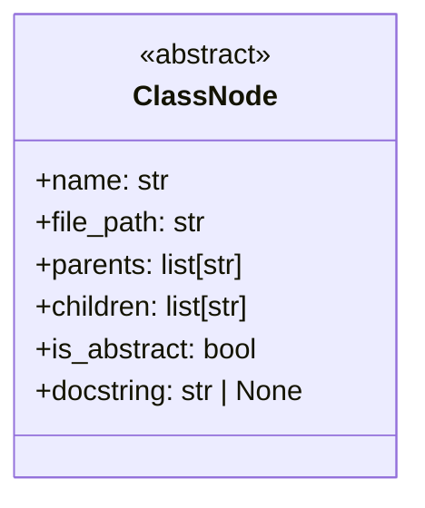
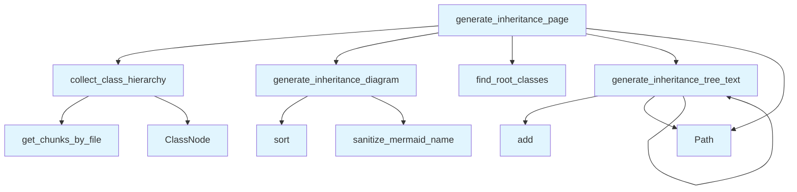

# Inheritance Module

## File Overview

The inheritance module provides functionality for analyzing and generating documentation about class inheritance hierarchies in Python codebases. It extracts class relationships from a vector store, builds inheritance trees, and generates both visual diagrams and textual representations of class hierarchies.

## Classes

### ClassNode

A data class that represents a node in a class inheritance hierarchy.

**Fields:**
- Contains dataclass fields for representing class information and relationships
- Uses the `field` [decorator](../providers/base.md) for complex field initialization

## Functions

### collect_class_hierarchy

Collects and analyzes class hierarchy information from the codebase.

**Purpose:** Extracts class inheritance relationships and builds a comprehensive view of the class structure.

### find_root_classes

Identifies root classes in the inheritance hierarchy.

**Purpose:** Finds classes that serve as base classes or have no parent classes, which are used as starting points for hierarchy traversal.

### generate_inheritance_diagram

Creates a visual representation of class inheritance relationships.

**Purpose:** Generates diagram markup (likely Mermaid format based on the [sanitize_mermaid_name](diagrams.md) import) showing class hierarchies.

### generate_inheritance_tree_text

Produces a textual representation of the inheritance tree.

**Purpose:** Creates a text-based tree structure showing class relationships in a readable format.

### generate_inheritance_page

Generates a complete documentation page for class inheritance.

**Purpose:** Combines visual diagrams and textual representations into a comprehensive inheritance documentation page.

## Usage Examples

```python
from local_deepwiki.generators.inheritance import (
    ClassNode,
    collect_class_hierarchy,
    find_root_classes,
    generate_inheritance_diagram,
    generate_inheritance_tree_text,
    generate_inheritance_page
)

# Create a class node
node = ClassNode()

# Collect class hierarchy from vector store
hierarchy = collect_class_hierarchy()

# Find root classes in the hierarchy
roots = find_root_classes()

# Generate visual diagram
diagram = generate_inheritance_diagram()

# Generate text representation
tree_text = generate_inheritance_tree_text()

# Generate complete inheritance page
page = generate_inheritance_page()
```

## Related Components

This module integrates with several other components:

- **[VectorStore](../core/vectorstore.md)**: Used to retrieve class information and relationships from the indexed codebase
- **Diagrams module**: Utilizes the [sanitize_mermaid_name](diagrams.md) function for generating clean diagram node names
- **Models**: Works with [ChunkType](../models.md) and [IndexStatus](../models.md) enums for handling different types of code chunks and their indexing states

The module is part of the local_deepwiki generators package, which appears to be responsible for creating different types of documentation from analyzed codebases.

## API Reference

### class `ClassNode`

A class in the inheritance tree.

---


<details>
<summary>View Source (lines 12-20) | <a href="https://github.com/UrbanDiver/local-deepwiki-mcp/blob/[main](../export/pdf.md)/src/local_deepwiki/generators/inheritance.py#L12-L20">GitHub</a></summary>

```python
class ClassNode:
    """A class in the inheritance tree."""

    name: str
    file_path: str
    parents: list[str] = field(default_factory=list)
    children: list[str] = field(default_factory=list)
    is_abstract: bool = False
    docstring: str | None = None
```

</details>

### Functions

#### `collect_class_hierarchy`

```python
async def collect_class_hierarchy(index_status: IndexStatus, vector_store: VectorStore) -> dict[str, ClassNode]
```

Collect all classes and their inheritance relationships.


| [Parameter](api_docs.md) | Type | Default | Description |
|-----------|------|---------|-------------|
| `index_status` | [`IndexStatus`](../models.md) | - | Index status with file information. |
| `vector_store` | [`VectorStore`](../core/vectorstore.md) | - | Vector store with code chunks. |

**Returns:** `dict[str, ClassNode]`


<details>
<summary>View Source (lines 23-81) | <a href="https://github.com/UrbanDiver/local-deepwiki-mcp/blob/[main](../export/pdf.md)/src/local_deepwiki/generators/inheritance.py#L23-L81">GitHub</a></summary>

```python
async def collect_class_hierarchy(
    index_status: IndexStatus,
    vector_store: VectorStore,
) -> dict[str, ClassNode]:
    """Collect all classes and their inheritance relationships.

    Args:
        index_status: Index status with file information.
        vector_store: Vector store with code chunks.

    Returns:
        Dictionary mapping class name to ClassNode.
    """
    classes: dict[str, ClassNode] = {}

    # Iterate through all indexed files
    for file_info in index_status.files:
        chunks = await vector_store.get_chunks_by_file(file_info.path)

        for chunk in chunks:
            if chunk.chunk_type != ChunkType.CLASS:
                continue

            class_name = chunk.name
            if not class_name:
                continue

            # Extract parent classes from metadata
            parent_classes = chunk.metadata.get("parent_classes", [])

            # Check if abstract
            is_abstract = (
                "ABC" in str(parent_classes)
                or "@abstractmethod" in chunk.content
                or "abstract" in chunk.content.lower()[:100]
            )

            # Create or update class node
            if class_name not in classes:
                classes[class_name] = ClassNode(
                    name=class_name,
                    file_path=file_info.path,
                    parents=parent_classes,
                    is_abstract=is_abstract,
                    docstring=chunk.docstring,
                )
            else:
                # Merge if same class appears in multiple files (shouldn't happen often)
                existing = classes[class_name]
                existing.parents = list(set(existing.parents + parent_classes))

    # Build children relationships (reverse of parents)
    for class_name, class_node in classes.items():
        for parent in class_node.parents:
            if parent in classes:
                if class_name not in classes[parent].children:
                    classes[parent].children.append(class_name)

    return classes
```

</details>

#### `find_root_classes`

```python
def find_root_classes(classes: dict[str, ClassNode]) -> list[str]
```

Find classes that have no parents (root of inheritance trees).


| [Parameter](api_docs.md) | Type | Default | Description |
|-----------|------|---------|-------------|
| `classes` | `dict[str, ClassNode]` | - | Dictionary of class nodes. |

**Returns:** `list[str]`


<details>
<summary>View Source (lines 84-99) | <a href="https://github.com/UrbanDiver/local-deepwiki-mcp/blob/[main](../export/pdf.md)/src/local_deepwiki/generators/inheritance.py#L84-L99">GitHub</a></summary>

```python
def find_root_classes(classes: dict[str, ClassNode]) -> list[str]:
    """Find classes that have no parents (root of inheritance trees).

    Args:
        classes: Dictionary of class nodes.

    Returns:
        List of root class names, sorted alphabetically.
    """
    roots = []
    for class_name, class_node in classes.items():
        # A class is a root if it has no parents in our codebase
        has_internal_parent = any(p in classes for p in class_node.parents)
        if not has_internal_parent and class_node.children:
            roots.append(class_name)
    return sorted(roots)
```

</details>

#### `generate_inheritance_diagram`

```python
def generate_inheritance_diagram(classes: dict[str, ClassNode], max_classes: int = 50) -> str | None
```

Generate a Mermaid class diagram showing inheritance relationships.


| [Parameter](api_docs.md) | Type | Default | Description |
|-----------|------|---------|-------------|
| `classes` | `dict[str, ClassNode]` | - | Dictionary of class nodes. |
| `max_classes` | `int` | `50` | Maximum number of classes to include. |

**Returns:** `str | None`


<details>
<summary>View Source (lines 102-171) | <a href="https://github.com/UrbanDiver/local-deepwiki-mcp/blob/[main](../export/pdf.md)/src/local_deepwiki/generators/inheritance.py#L102-L171">GitHub</a></summary>

```python
def generate_inheritance_diagram(
    classes: dict[str, ClassNode],
    max_classes: int = 50,
) -> str | None:
    """Generate a Mermaid class diagram showing inheritance relationships.

    Args:
        classes: Dictionary of class nodes.
        max_classes: Maximum number of classes to include.

    Returns:
        Mermaid diagram string or None if no inheritance found.
    """
    # Filter to classes that have inheritance relationships
    classes_with_inheritance = {
        name: node
        for name, node in classes.items()
        if node.parents or node.children
    }

    if not classes_with_inheritance:
        return None

    # If too many, prioritize classes with most relationships
    if len(classes_with_inheritance) > max_classes:
        scored = [
            (name, len(node.parents) + len(node.children))
            for name, node in classes_with_inheritance.items()
        ]
        scored.sort(key=lambda x: x[1], reverse=True)
        keep_names = {name for name, _ in scored[:max_classes]}
        classes_with_inheritance = {
            name: node
            for name, node in classes_with_inheritance.items()
            if name in keep_names
        }

    lines = ["```mermaid", "classDiagram"]

    # Add class definitions
    for class_name in sorted(classes_with_inheritance.keys()):
        node = classes_with_inheritance[class_name]
        safe_name = [sanitize_mermaid_name](diagrams.md)(class_name)

        if node.is_abstract:
            lines.append(f"    class {safe_name} {{")
            lines.append("        <<abstract>>")
            lines.append("    }")
        else:
            lines.append(f"    class {safe_name}")

    # Add inheritance relationships
    for class_name, node in sorted(classes_with_inheritance.items()):
        safe_child = [sanitize_mermaid_name](diagrams.md)(class_name)
        for parent in node.parents:
            # Only add if parent is in our diagram
            if parent in classes_with_inheritance:
                safe_parent = [sanitize_mermaid_name](diagrams.md)(parent)
                lines.append(f"    {safe_child} --|> {safe_parent}")

    lines.append("```")

    # Check if we actually have any relationships
    has_relationships = any(
        "-->" in line or "--|>" in line for line in lines
    )
    if not has_relationships:
        return None

    return "\n".join(lines)
```

</details>

#### `generate_inheritance_tree_text`

```python
def generate_inheritance_tree_text(classes: dict[str, ClassNode], root_class: str, indent: int = 0, visited: set[str] | None = None) -> list[str]
```

Generate a text-based inheritance tree starting from a root class.


| [Parameter](api_docs.md) | Type | Default | Description |
|-----------|------|---------|-------------|
| `classes` | `dict[str, ClassNode]` | - | Dictionary of class nodes. |
| `root_class` | `str` | - | The root class to start from. |
| `indent` | `int` | `0` | Current indentation level. |
| `visited` | `set[str] | None` | `None` | Set of visited classes to avoid cycles. |

**Returns:** `list[str]`


<details>
<summary>View Source (lines 174-226) | <a href="https://github.com/UrbanDiver/local-deepwiki-mcp/blob/[main](../export/pdf.md)/src/local_deepwiki/generators/inheritance.py#L174-L226">GitHub</a></summary>

```python
def generate_inheritance_tree_text(
    classes: dict[str, ClassNode],
    root_class: str,
    indent: int = 0,
    visited: set[str] | None = None,
) -> list[str]:
    """Generate a text-based inheritance tree starting from a root class.

    Args:
        classes: Dictionary of class nodes.
        root_class: The root class to start from.
        indent: Current indentation level.
        visited: Set of visited classes to avoid cycles.

    Returns:
        List of formatted tree lines.
    """
    if visited is None:
        visited = set()

    if root_class in visited:
        return []

    visited.add(root_class)
    lines = []

    node = classes.get(root_class)
    if not node:
        return []

    prefix = "  " * indent
    marker = "- " if indent == 0 else "└─ " if indent > 0 else ""

    # Format: ClassName (file.py) - brief description
    file_name = Path(node.file_path).name
    desc = ""
    if node.docstring:
        first_line = node.docstring.split("\n")[0].strip()
        if len(first_line) > 60:
            first_line = first_line[:57] + "..."
        desc = f" - {first_line}"

    abstract_marker = " (abstract)" if node.is_abstract else ""
    lines.append(f"{prefix}{marker}**{root_class}**{abstract_marker} `{file_name}`{desc}")

    # Recursively add children
    for child in sorted(node.children):
        child_lines = generate_inheritance_tree_text(
            classes, child, indent + 1, visited
        )
        lines.extend(child_lines)

    return lines
```

</details>

#### `generate_inheritance_page`

```python
async def generate_inheritance_page(index_status: IndexStatus, vector_store: VectorStore) -> str | None
```

Generate the inheritance documentation page content.


| [Parameter](api_docs.md) | Type | Default | Description |
|-----------|------|---------|-------------|
| `index_status` | [`IndexStatus`](../models.md) | - | Index status with file information. |
| `vector_store` | [`VectorStore`](../core/vectorstore.md) | - | Vector store with code chunks. |

**Returns:** `str | None`


<details>
<summary>View Source (lines 229-299) | <a href="https://github.com/UrbanDiver/local-deepwiki-mcp/blob/[main](../export/pdf.md)/src/local_deepwiki/generators/inheritance.py#L229-L299">GitHub</a></summary>

```python
async def generate_inheritance_page(
    index_status: IndexStatus,
    vector_store: VectorStore,
) -> str | None:
    """Generate the inheritance documentation page content.

    Args:
        index_status: Index status with file information.
        vector_store: Vector store with code chunks.

    Returns:
        Markdown content for the inheritance page, or None if no inheritance found.
    """
    classes = await collect_class_hierarchy(index_status, vector_store)

    if not classes:
        return None

    # Filter to classes with inheritance
    classes_with_inheritance = {
        name: node
        for name, node in classes.items()
        if node.parents or node.children
    }

    if not classes_with_inheritance:
        return None

    lines = [
        "# Class Inheritance",
        "",
        "This page shows the class inheritance hierarchies in the codebase.",
        "",
    ]

    # Generate diagram
    diagram = generate_inheritance_diagram(classes)
    if diagram:
        lines.append("## Inheritance Diagram")
        lines.append("")
        lines.append(diagram)
        lines.append("")

    # Find root classes and generate trees
    roots = find_root_classes(classes)

    if roots:
        lines.append("## Inheritance Trees")
        lines.append("")

        for root in roots:
            tree_lines = generate_inheritance_tree_text(classes, root)
            if tree_lines:
                lines.extend(tree_lines)
                lines.append("")

    # List all classes with their parents
    lines.append("## All Classes")
    lines.append("")
    lines.append("| Class | Inherits From | File |")
    lines.append("|-------|---------------|------|")

    for class_name in sorted(classes_with_inheritance.keys()):
        node = classes_with_inheritance[class_name]
        parents_str = ", ".join(f"`{p}`" for p in node.parents) if node.parents else "-"
        file_link = f"[{Path(node.file_path).name}](files/{node.file_path.replace('.py', '.md')})"
        lines.append(f"| `{class_name}` | {parents_str} | {file_link} |")

    lines.append("")

    return "\n".join(lines)
```

</details>

## Class Diagram



## Call Graph



## Used By

Functions and methods in this file and their callers:

- **`ClassNode`**: called by `collect_class_hierarchy`
- **`Path`**: called by `generate_inheritance_page`, `generate_inheritance_tree_text`
- **`add`**: called by `generate_inheritance_tree_text`
- **`collect_class_hierarchy`**: called by `generate_inheritance_page`
- **`find_root_classes`**: called by `generate_inheritance_page`
- **`generate_inheritance_diagram`**: called by `generate_inheritance_page`
- **`generate_inheritance_tree_text`**: called by `generate_inheritance_page`, `generate_inheritance_tree_text`
- **`get_chunks_by_file`**: called by `collect_class_hierarchy`
- **[`sanitize_mermaid_name`](diagrams.md)**: called by `generate_inheritance_diagram`
- **`sort`**: called by `generate_inheritance_diagram`

## Usage Examples

*Examples extracted from test files*

### Test creating a basic class node

From `test_inheritance.py::TestClassNode::test_creates_basic_node`:

```python
node = ClassNode(name="MyClass", file_path="src/myclass.py")
assert node.name == "MyClass"
assert node.file_path == "src/myclass.py"
assert node.parents == []
assert node.children == []
assert node.is_abstract is False
```

### Test creating a node with parent classes

From `test_inheritance.py::TestClassNode::test_creates_node_with_inheritance`:

```python
node = ClassNode(
    name="ChildClass",
    file_path="src/child.py",
    parents=["BaseClass", "Mixin"],
    is_abstract=True,
)
assert node.parents == ["BaseClass", "Mixin"]
assert node.is_abstract is True
```

### Test finding root classes that have children

From `test_inheritance.py::TestFindRootClasses::test_finds_root_with_children`:

```python
classes = {
    "Base": ClassNode("Base", "base.py", [], ["Child1", "Child2"]),
    "Child1": ClassNode("Child1", "child1.py", ["Base"], []),
    "Child2": ClassNode("Child2", "child2.py", ["Base"], []),
}
roots = find_root_classes(classes)
assert roots == ["Base"]
```

### Test that classes with no parents but no children are excluded

From `test_inheritance.py::TestFindRootClasses::test_excludes_root_without_children`:

```python
classes = {
    "Standalone": ClassNode("Standalone", "standalone.py", [], []),
    "Base": ClassNode("Base", "base.py", [], ["Child"]),
    "Child": ClassNode("Child", "child.py", ["Base"], []),
}
roots = find_root_classes(classes)
assert "Standalone" not in roots
assert "Base" in roots
```

### Test returns None for empty classes

From `test_inheritance.py::TestGenerateInheritanceDiagram::test_returns_none_for_empty`:

```python
assert generate_inheritance_diagram({}) is None
```


## Last Modified

| Entity | Type | Author | Date | Commit |
|--------|------|--------|------|--------|
| `ClassNode` | class | Brian Breidenbach | today | `8d2ab68` Add inheritance trees, glos... |
| `collect_class_hierarchy` | function | Brian Breidenbach | today | `8d2ab68` Add inheritance trees, glos... |
| `find_root_classes` | function | Brian Breidenbach | today | `8d2ab68` Add inheritance trees, glos... |
| `generate_inheritance_diagram` | function | Brian Breidenbach | today | `8d2ab68` Add inheritance trees, glos... |
| `generate_inheritance_tree_text` | function | Brian Breidenbach | today | `8d2ab68` Add inheritance trees, glos... |
| `generate_inheritance_page` | function | Brian Breidenbach | today | `8d2ab68` Add inheritance trees, glos... |

## Relevant Source Files

- `src/local_deepwiki/generators/inheritance.py:12-20`

## See Also

- [models](../models.md) - dependency
- [diagrams](diagrams.md) - dependency
- [vectorstore](../core/vectorstore.md) - dependency
- [glossary](glossary.md) - shares 4 dependencies
- [coverage](coverage.md) - shares 4 dependencies
