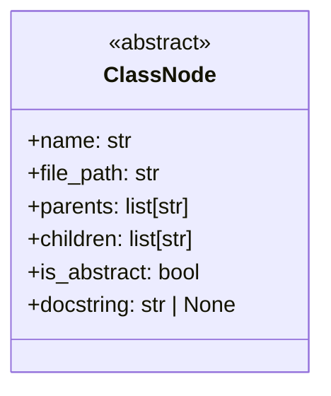
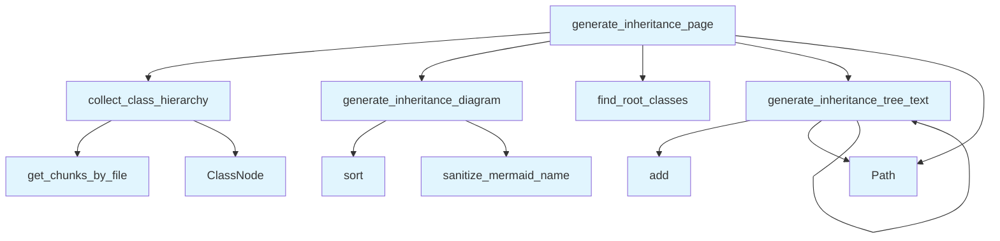

# inheritance.py

## File Overview

This module provides functionality for analyzing and visualizing class inheritance hierarchies in Python codebases. It extracts class relationships from a vector store, builds inheritance trees, and generates both textual and diagram representations of the class hierarchy.

## Classes

### ClassNode

A dataclass that represents a node in the class inheritance tree.

```python
@dataclass
class ClassNode:
```

The ClassNode class uses the `@dataclass` [decorator](../providers/base.md) and includes a `field()` for one of its attributes, indicating it stores information about classes and their relationships in the inheritance hierarchy.

## Functions

### collect_class_hierarchy

Collects and analyzes the class hierarchy from the vector store.

```python
def collect_class_hierarchy(vector_store: VectorStore) -> dict
```

**Parameters:**
- `vector_store`: A [VectorStore](../core/vectorstore.md) instance containing the codebase data

**Returns:**
- `dict`: A dictionary containing the collected class hierarchy information

### find_root_classes

Identifies root classes (classes with no parent classes) in the hierarchy.

```python
def find_root_classes(class_hierarchy: dict) -> list
```

**Parameters:**
- `class_hierarchy`: A dictionary containing class hierarchy information

**Returns:**
- `list`: A list of root classes in the hierarchy

### generate_inheritance_diagram

Generates a Mermaid diagram representation of the class inheritance hierarchy.

```python
def generate_inheritance_diagram(class_hierarchy: dict) -> str
```

**Parameters:**
- `class_hierarchy`: A dictionary containing class hierarchy information

**Returns:**
- `str`: A Mermaid diagram string representing the inheritance relationships

### generate_inheritance_tree_text

Generates a text-based tree representation of the class inheritance hierarchy.

```python
def generate_inheritance_tree_text(class_hierarchy: dict) -> str
```

**Parameters:**
- `class_hierarchy`: A dictionary containing class hierarchy information

**Returns:**
- `str`: A text-based tree representation of the inheritance hierarchy

### generate_inheritance_page

Generates a complete inheritance documentation page combining both diagram and text representations.

```python
def generate_inheritance_page(vector_store: VectorStore) -> str
```

**Parameters:**
- `vector_store`: A [VectorStore](../core/vectorstore.md) instance containing the codebase data

**Returns:**
- `str`: A complete inheritance page with both diagram and text representations

## Usage Examples

### Basic Inheritance Analysis

```python
from local_deepwiki.core.vectorstore import VectorStore
from local_deepwiki.generators.inheritance import (
    collect_class_hierarchy,
    generate_inheritance_page
)

# Initialize vector store
vector_store = VectorStore()

# Collect class hierarchy
hierarchy = collect_class_hierarchy(vector_store)

# Generate complete inheritance page
page_content = generate_inheritance_page(vector_store)
```

### Working with Class Hierarchy Data

```python
from local_deepwiki.generators.inheritance import (
    collect_class_hierarchy,
    find_root_classes,
    generate_inheritance_diagram,
    generate_inheritance_tree_text
)

# Collect hierarchy
hierarchy = collect_class_hierarchy(vector_store)

# Find root classes
roots = find_root_classes(hierarchy)

# Generate different representations
diagram = generate_inheritance_diagram(hierarchy)
tree_text = generate_inheritance_tree_text(hierarchy)
```

## Related Components

This module works with several other components from the codebase:

- **[VectorStore](../core/vectorstore.md)**: Used to query and retrieve class information from the indexed codebase
- **[ChunkType](../models.md)**: Enum that likely defines different types of code chunks, used for filtering class-related content
- **[IndexStatus](../models.md)**: Enum that tracks the indexing status of code elements
- **[sanitize_mermaid_name](diagrams.md)**: Utility function from the diagrams module for cleaning names used in Mermaid diagrams

The module integrates with the broader documentation generation system by providing specialized inheritance visualization capabilities that complement other diagram and analysis tools.

## API Reference

### class `ClassNode`

A class in the inheritance tree.

---


<details>
<summary>View Source (lines 12-20) | <a href="https://github.com/UrbanDiver/local-deepwiki-mcp/blob/feature/better-search/src/local_deepwiki/generators/inheritance.py#L12-L20">GitHub</a></summary>

```python
class ClassNode:
    """A class in the inheritance tree."""

    name: str
    file_path: str
    parents: list[str] = field(default_factory=list)
    children: list[str] = field(default_factory=list)
    is_abstract: bool = False
    docstring: str | None = None
```

</details>

### Functions

#### `collect_class_hierarchy`

```python
async def collect_class_hierarchy(index_status: IndexStatus, vector_store: VectorStore) -> dict[str, ClassNode]
```

Collect all classes and their inheritance relationships.


| [Parameter](api_docs.md) | Type | Default | Description |
|-----------|------|---------|-------------|
| `index_status` | [`IndexStatus`](../models.md) | - | Index status with file information. |
| `vector_store` | [`VectorStore`](../core/vectorstore.md) | - | Vector store with code chunks. |

**Returns:** `dict[str, ClassNode]`


<details>
<summary>View Source (lines 23-81) | <a href="https://github.com/UrbanDiver/local-deepwiki-mcp/blob/feature/better-search/src/local_deepwiki/generators/inheritance.py#L23-L81">GitHub</a></summary>

```python
async def collect_class_hierarchy(
    index_status: IndexStatus,
    vector_store: VectorStore,
) -> dict[str, ClassNode]:
    """Collect all classes and their inheritance relationships.

    Args:
        index_status: Index status with file information.
        vector_store: Vector store with code chunks.

    Returns:
        Dictionary mapping class name to ClassNode.
    """
    classes: dict[str, ClassNode] = {}

    # Iterate through all indexed files
    for file_info in index_status.files:
        chunks = await vector_store.get_chunks_by_file(file_info.path)

        for chunk in chunks:
            if chunk.chunk_type != ChunkType.CLASS:
                continue

            class_name = chunk.name
            if not class_name:
                continue

            # Extract parent classes from metadata
            parent_classes = chunk.metadata.get("parent_classes", [])

            # Check if abstract
            is_abstract = (
                "ABC" in str(parent_classes)
                or "@abstractmethod" in chunk.content
                or "abstract" in chunk.content.lower()[:100]
            )

            # Create or update class node
            if class_name not in classes:
                classes[class_name] = ClassNode(
                    name=class_name,
                    file_path=file_info.path,
                    parents=parent_classes,
                    is_abstract=is_abstract,
                    docstring=chunk.docstring,
                )
            else:
                # Merge if same class appears in multiple files (shouldn't happen often)
                existing = classes[class_name]
                existing.parents = list(set(existing.parents + parent_classes))

    # Build children relationships (reverse of parents)
    for class_name, class_node in classes.items():
        for parent in class_node.parents:
            if parent in classes:
                if class_name not in classes[parent].children:
                    classes[parent].children.append(class_name)

    return classes
```

</details>

#### `find_root_classes`

```python
def find_root_classes(classes: dict[str, ClassNode]) -> list[str]
```

Find classes that have no parents (root of inheritance trees).


| [Parameter](api_docs.md) | Type | Default | Description |
|-----------|------|---------|-------------|
| `classes` | `dict[str, ClassNode]` | - | Dictionary of class nodes. |

**Returns:** `list[str]`


<details>
<summary>View Source (lines 84-99) | <a href="https://github.com/UrbanDiver/local-deepwiki-mcp/blob/feature/better-search/src/local_deepwiki/generators/inheritance.py#L84-L99">GitHub</a></summary>

```python
def find_root_classes(classes: dict[str, ClassNode]) -> list[str]:
    """Find classes that have no parents (root of inheritance trees).

    Args:
        classes: Dictionary of class nodes.

    Returns:
        List of root class names, sorted alphabetically.
    """
    roots = []
    for class_name, class_node in classes.items():
        # A class is a root if it has no parents in our codebase
        has_internal_parent = any(p in classes for p in class_node.parents)
        if not has_internal_parent and class_node.children:
            roots.append(class_name)
    return sorted(roots)
```

</details>

#### `generate_inheritance_diagram`

```python
def generate_inheritance_diagram(classes: dict[str, ClassNode], max_classes: int = 50) -> str | None
```

Generate a Mermaid class diagram showing inheritance relationships.


| [Parameter](api_docs.md) | Type | Default | Description |
|-----------|------|---------|-------------|
| `classes` | `dict[str, ClassNode]` | - | Dictionary of class nodes. |
| `max_classes` | `int` | `50` | Maximum number of classes to include. |

**Returns:** `str | None`


<details>
<summary>View Source (lines 102-171) | <a href="https://github.com/UrbanDiver/local-deepwiki-mcp/blob/feature/better-search/src/local_deepwiki/generators/inheritance.py#L102-L171">GitHub</a></summary>

```python
def generate_inheritance_diagram(
    classes: dict[str, ClassNode],
    max_classes: int = 50,
) -> str | None:
    """Generate a Mermaid class diagram showing inheritance relationships.

    Args:
        classes: Dictionary of class nodes.
        max_classes: Maximum number of classes to include.

    Returns:
        Mermaid diagram string or None if no inheritance found.
    """
    # Filter to classes that have inheritance relationships
    classes_with_inheritance = {
        name: node
        for name, node in classes.items()
        if node.parents or node.children
    }

    if not classes_with_inheritance:
        return None

    # If too many, prioritize classes with most relationships
    if len(classes_with_inheritance) > max_classes:
        scored = [
            (name, len(node.parents) + len(node.children))
            for name, node in classes_with_inheritance.items()
        ]
        scored.sort(key=lambda x: x[1], reverse=True)
        keep_names = {name for name, _ in scored[:max_classes]}
        classes_with_inheritance = {
            name: node
            for name, node in classes_with_inheritance.items()
            if name in keep_names
        }

    lines = ["```mermaid", "classDiagram"]

    # Add class definitions
    for class_name in sorted(classes_with_inheritance.keys()):
        node = classes_with_inheritance[class_name]
        safe_name = [sanitize_mermaid_name](diagrams.md)(class_name)

        if node.is_abstract:
            lines.append(f"    class {safe_name} {{")
            lines.append("        <<abstract>>")
            lines.append("    }")
        else:
            lines.append(f"    class {safe_name}")

    # Add inheritance relationships
    for class_name, node in sorted(classes_with_inheritance.items()):
        safe_child = [sanitize_mermaid_name](diagrams.md)(class_name)
        for parent in node.parents:
            # Only add if parent is in our diagram
            if parent in classes_with_inheritance:
                safe_parent = [sanitize_mermaid_name](diagrams.md)(parent)
                lines.append(f"    {safe_child} --|> {safe_parent}")

    lines.append("```")

    # Check if we actually have any relationships
    has_relationships = any(
        "-->" in line or "--|>" in line for line in lines
    )
    if not has_relationships:
        return None

    return "\n".join(lines)
```

</details>

#### `generate_inheritance_tree_text`

```python
def generate_inheritance_tree_text(classes: dict[str, ClassNode], root_class: str, indent: int = 0, visited: set[str] | None = None) -> list[str]
```

Generate a text-based inheritance tree starting from a root class.


| [Parameter](api_docs.md) | Type | Default | Description |
|-----------|------|---------|-------------|
| `classes` | `dict[str, ClassNode]` | - | Dictionary of class nodes. |
| `root_class` | `str` | - | The root class to start from. |
| `indent` | `int` | `0` | Current indentation level. |
| `visited` | `set[str] | None` | `None` | Set of visited classes to avoid cycles. |

**Returns:** `list[str]`


<details>
<summary>View Source (lines 174-226) | <a href="https://github.com/UrbanDiver/local-deepwiki-mcp/blob/feature/better-search/src/local_deepwiki/generators/inheritance.py#L174-L226">GitHub</a></summary>

```python
def generate_inheritance_tree_text(
    classes: dict[str, ClassNode],
    root_class: str,
    indent: int = 0,
    visited: set[str] | None = None,
) -> list[str]:
    """Generate a text-based inheritance tree starting from a root class.

    Args:
        classes: Dictionary of class nodes.
        root_class: The root class to start from.
        indent: Current indentation level.
        visited: Set of visited classes to avoid cycles.

    Returns:
        List of formatted tree lines.
    """
    if visited is None:
        visited = set()

    if root_class in visited:
        return []

    visited.add(root_class)
    lines = []

    node = classes.get(root_class)
    if not node:
        return []

    prefix = "  " * indent
    marker = "- " if indent == 0 else "└─ " if indent > 0 else ""

    # Format: ClassName (file.py) - brief description
    file_name = Path(node.file_path).name
    desc = ""
    if node.docstring:
        first_line = node.docstring.split("\n")[0].strip()
        if len(first_line) > 60:
            first_line = first_line[:57] + "..."
        desc = f" - {first_line}"

    abstract_marker = " (abstract)" if node.is_abstract else ""
    lines.append(f"{prefix}{marker}**{root_class}**{abstract_marker} `{file_name}`{desc}")

    # Recursively add children
    for child in sorted(node.children):
        child_lines = generate_inheritance_tree_text(
            classes, child, indent + 1, visited
        )
        lines.extend(child_lines)

    return lines
```

</details>

#### `generate_inheritance_page`

```python
async def generate_inheritance_page(index_status: IndexStatus, vector_store: VectorStore) -> str | None
```

Generate the inheritance documentation page content.


| [Parameter](api_docs.md) | Type | Default | Description |
|-----------|------|---------|-------------|
| `index_status` | [`IndexStatus`](../models.md) | - | Index status with file information. |
| `vector_store` | [`VectorStore`](../core/vectorstore.md) | - | Vector store with code chunks. |

**Returns:** `str | None`


<details>
<summary>View Source (lines 229-299) | <a href="https://github.com/UrbanDiver/local-deepwiki-mcp/blob/feature/better-search/src/local_deepwiki/generators/inheritance.py#L229-L299">GitHub</a></summary>

```python
async def generate_inheritance_page(
    index_status: IndexStatus,
    vector_store: VectorStore,
) -> str | None:
    """Generate the inheritance documentation page content.

    Args:
        index_status: Index status with file information.
        vector_store: Vector store with code chunks.

    Returns:
        Markdown content for the inheritance page, or None if no inheritance found.
    """
    classes = await collect_class_hierarchy(index_status, vector_store)

    if not classes:
        return None

    # Filter to classes with inheritance
    classes_with_inheritance = {
        name: node
        for name, node in classes.items()
        if node.parents or node.children
    }

    if not classes_with_inheritance:
        return None

    lines = [
        "# Class Inheritance",
        "",
        "This page shows the class inheritance hierarchies in the codebase.",
        "",
    ]

    # Generate diagram
    diagram = generate_inheritance_diagram(classes)
    if diagram:
        lines.append("## Inheritance Diagram")
        lines.append("")
        lines.append(diagram)
        lines.append("")

    # Find root classes and generate trees
    roots = find_root_classes(classes)

    if roots:
        lines.append("## Inheritance Trees")
        lines.append("")

        for root in roots:
            tree_lines = generate_inheritance_tree_text(classes, root)
            if tree_lines:
                lines.extend(tree_lines)
                lines.append("")

    # List all classes with their parents
    lines.append("## All Classes")
    lines.append("")
    lines.append("| Class | Inherits From | File |")
    lines.append("|-------|---------------|------|")

    for class_name in sorted(classes_with_inheritance.keys()):
        node = classes_with_inheritance[class_name]
        parents_str = ", ".join(f"`{p}`" for p in node.parents) if node.parents else "-"
        file_link = f"[{Path(node.file_path).name}](files/{node.file_path.replace('.py', '.md')})"
        lines.append(f"| `{class_name}` | {parents_str} | {file_link} |")

    lines.append("")

    return "\n".join(lines)
```

</details>

## Class Diagram



## Call Graph



## Used By

Functions and methods in this file and their callers:

- **`ClassNode`**: called by `collect_class_hierarchy`
- **`Path`**: called by `generate_inheritance_page`, `generate_inheritance_tree_text`
- **`add`**: called by `generate_inheritance_tree_text`
- **`collect_class_hierarchy`**: called by `generate_inheritance_page`
- **`find_root_classes`**: called by `generate_inheritance_page`
- **`generate_inheritance_diagram`**: called by `generate_inheritance_page`
- **`generate_inheritance_tree_text`**: called by `generate_inheritance_page`, `generate_inheritance_tree_text`
- **`get_chunks_by_file`**: called by `collect_class_hierarchy`
- **[`sanitize_mermaid_name`](diagrams.md)**: called by `generate_inheritance_diagram`
- **`sort`**: called by `generate_inheritance_diagram`

## Usage Examples

*Examples extracted from test files*

### Test creating a basic class node

From `test_inheritance.py::test_creates_basic_node`:

```python
node = ClassNode(name="MyClass", file_path="src/myclass.py")
assert node.name == "MyClass"
```

### Test creating a node with parent classes

From `test_inheritance.py::test_creates_node_with_inheritance`:

```python
node = ClassNode(
    name="ChildClass",
    file_path="src/child.py",
    parents=["BaseClass", "Mixin"],
    is_abstract=True,
)
assert node.parents == ["BaseClass", "Mixin"]
```

### Test finding root classes that have children

From `test_inheritance.py::test_finds_root_with_children`:

```python
roots = find_root_classes(classes)
assert roots == ["Base"]
```

### Test that classes with no parents but no children are excluded

From `test_inheritance.py::test_excludes_root_without_children`:

```python
roots = find_root_classes(classes)
assert "Standalone" not in roots
```

### Test returns None for empty classes

From `test_inheritance.py::test_returns_none_for_empty`:

```python
assert generate_inheritance_diagram({}) is None
```

## Relevant Source Files

- `src/local_deepwiki/generators/inheritance.py:12-20`

## See Also

- [wiki](wiki.md) - uses this
- [models](../models.md) - dependency
- [vectorstore](../core/vectorstore.md) - dependency
- [diagrams](diagrams.md) - dependency
- [glossary](glossary.md) - shares 4 dependencies
