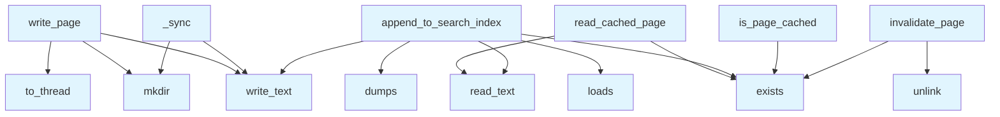

# File: `src/local_deepwiki/generators/lazy_cache.py`

## File Overview

This file provides helper functions for managing a lazy page cache used by [`LazyPageGenerator`](lazy_generator.md). It encapsulates the logic for reading from and writing to disk, as well as maintaining a JSON-based search index. The module is designed to support efficient, on-demand generation and retrieval of wiki pages, avoiding redundant processing by caching results.

The functions in this file are not intended to be used directly by external callers; instead, they are imported and invoked by the [`LazyPageGenerator`](lazy_generator.md) class, which orchestrates the caching and generation workflow.

## Key Concepts

### Page Caching Strategy
The core abstraction is a disk-based cache for wiki pages. This enables the system to avoid regenerating pages that have already been processed, improving performance and reducing load.

- **Lazy Evaluation**: Pages are only generated when first requested and cached.
- **Cache Invalidation**: Pages can be explicitly removed from the cache to force regeneration.

### Asynchronous I/O
The `write_page` function is asynchronous, using `asyncio.to_thread` to perform disk I/O operations in a thread pool. This design allows non-blocking writes while keeping the core generation logic responsive.

### Search Index Maintenance
The `append_to_search_index` function maintains a JSON array of page metadata, which supports client-side search capabilities. This index is updated each time a new page is written, ensuring search results are always current.

## Integration

This module is used internally by [`LazyPageGenerator`](lazy_generator.md), which is responsible for orchestrating the page generation process. It is not directly imported or called by other modules in the codebase outside of this relationship.

The functions are designed to be lightweight and perform specific, well-defined tasks:
- `read_cached_page` and `is_page_cached` provide read access to the cache.
- `write_page` and `invalidate_page` manage write and invalidation operations.
- `append_to_search_index` maintains the search index, supporting the client-side search feature.

Dependencies include:
- `asyncio` for asynchronous execution
- `json` for managing the search index
- `pathlib.Path` for filesystem path manipulation
- [`WikiPage`](../export/streaming.md) model for representing pages

## Design Notes

### Asynchronous Write Handling
The `write_page` function uses `asyncio.to_thread` to offload synchronous I/O to a thread pool. This ensures that the event loop remains unblocked during file writes, which is critical for performance in an async context.

### Search Index Robustness
The `append_to_search_index` function includes error handling for cases where the index file is corrupted or inaccessible. In such cases, it resets the index to an empty list, ensuring that the system can continue to operate.

### Cache Invalidation
The `invalidate_page` function returns a boolean indicating whether the file was deleted. This allows callers to distinguish between a successful invalidation and a no-op (when the file did not exist), which is useful for logging or debugging.

### Thread Safety
The `_sync` helper function is used internally by `write_page` to perform synchronous operations. This design avoids exposing thread-related complexity to the async interface while ensuring that file I/O is handled safely.

## API Reference

### Functions

#### `read_cached_page`

```python
def read_cached_page(wiki_path: Path, page_path: str) -> str | None
```

Return cached page content from disk, or None if not yet generated.


| Parameter | Type | Default | Description |
|-----------|------|---------|-------------|
| `wiki_path` | `Path` | - | Root directory of the wiki on disk. |
| `page_path` | `str` | - | Relative path of the page within the wiki (e.g. ``index.md``). |

**Returns:** `str | None`


<details>
<summary>View Source (lines 20-33) | <a href="https://github.com/UrbanDiver/local-deepwiki-mcp/blob/main/src/local_deepwiki/generators/lazy_cache.py#L20-L33">GitHub</a></summary>

```python
def read_cached_page(wiki_path: Path, page_path: str) -> str | None:
    """Return cached page content from disk, or None if not yet generated.

    Args:
        wiki_path: Root directory of the wiki on disk.
        page_path: Relative path of the page within the wiki (e.g. ``index.md``).

    Returns:
        The file's text content if it exists on disk, or ``None``.
    """
    full = wiki_path / page_path
    if full.exists():
        return full.read_text()
    return None
```

</details>

#### `write_page`

```python
async def write_page(wiki_path: Path, page: "WikiPage") -> None
```

Write a generated wiki page to disk, creating parent directories as needed.


| Parameter | Type | Default | Description |
|-----------|------|---------|-------------|
| `wiki_path` | `Path` | - | Root directory of the wiki on disk. |
| `page` | `"WikiPage"` | - | The ``WikiPage`` to persist. |

**Returns:** `None`


<details>
<summary>View Source (lines 36-49) | <a href="https://github.com/UrbanDiver/local-deepwiki-mcp/blob/main/src/local_deepwiki/generators/lazy_cache.py#L36-L49">GitHub</a></summary>

```python
async def write_page(wiki_path: Path, page: "WikiPage") -> None:
    """Write a generated wiki page to disk, creating parent directories as needed.

    Args:
        wiki_path: Root directory of the wiki on disk.
        page: The ``WikiPage`` to persist.
    """
    page_path = wiki_path / page.path

    def _sync() -> None:
        page_path.parent.mkdir(parents=True, exist_ok=True)
        page_path.write_text(page.content)

    await asyncio.to_thread(_sync)
```

</details>

#### `append_to_search_index`

```python
def append_to_search_index(wiki_path: Path, page: "WikiPage") -> None
```

Append a page entry to the JSON search index for client-side search.  The search index is a JSON array stored at ``wiki_path/search_index.json``. Each entry contains the page path, title, and a short summary snippet.


| Parameter | Type | Default | Description |
|-----------|------|---------|-------------|
| `wiki_path` | `Path` | - | Root directory of the wiki on disk. |
| `page` | `"WikiPage"` | - | The ``WikiPage`` to add to the index. |

**Returns:** `None`


<details>
<summary>View Source (lines 52-74) | <a href="https://github.com/UrbanDiver/local-deepwiki-mcp/blob/main/src/local_deepwiki/generators/lazy_cache.py#L52-L74">GitHub</a></summary>

```python
def append_to_search_index(wiki_path: Path, page: "WikiPage") -> None:
    """Append a page entry to the JSON search index for client-side search.

    The search index is a JSON array stored at ``wiki_path/search_index.json``.
    Each entry contains the page path, title, and a short summary snippet.

    Args:
        wiki_path: Root directory of the wiki on disk.
        page: The ``WikiPage`` to add to the index.
    """
    idx_path = wiki_path / "search_index.json"
    try:
        entries = json.loads(idx_path.read_text()) if idx_path.exists() else []
    except (json.JSONDecodeError, OSError):
        entries = []
    entries.append(
        {
            "path": page.path,
            "title": page.title,
            "summary": page.content[:200],
        }
    )
    idx_path.write_text(json.dumps(entries))
```

</details>

#### `is_page_cached`

```python
def is_page_cached(wiki_path: Path, page_path: str) -> bool
```

Return True if a cached copy of the page exists on disk.


| Parameter | Type | Default | Description |
|-----------|------|---------|-------------|
| `wiki_path` | `Path` | - | Root directory of the wiki on disk. |
| `page_path` | `str` | - | Relative path of the page within the wiki. |

**Returns:** `bool`


<details>
<summary>View Source (lines 77-87) | <a href="https://github.com/UrbanDiver/local-deepwiki-mcp/blob/main/src/local_deepwiki/generators/lazy_cache.py#L77-L87">GitHub</a></summary>

```python
def is_page_cached(wiki_path: Path, page_path: str) -> bool:
    """Return True if a cached copy of the page exists on disk.

    Args:
        wiki_path: Root directory of the wiki on disk.
        page_path: Relative path of the page within the wiki.

    Returns:
        True if the page file exists on disk.
    """
    return (wiki_path / page_path).exists()
```

</details>

#### `invalidate_page`

```python
def invalidate_page(wiki_path: Path, page_path: str) -> bool
```

Remove a cached page from disk, forcing regeneration on next access.


| Parameter | Type | Default | Description |
|-----------|------|---------|-------------|
| `wiki_path` | `Path` | - | Root directory of the wiki on disk. |
| `page_path` | `str` | - | Relative path of the page within the wiki. |

**Returns:** `bool`


<details>
<summary>View Source (lines 90-104) | <a href="https://github.com/UrbanDiver/local-deepwiki-mcp/blob/main/src/local_deepwiki/generators/lazy_cache.py#L90-L104">GitHub</a></summary>

```python
def invalidate_page(wiki_path: Path, page_path: str) -> bool:
    """Remove a cached page from disk, forcing regeneration on next access.

    Args:
        wiki_path: Root directory of the wiki on disk.
        page_path: Relative path of the page within the wiki.

    Returns:
        True if the file was deleted, False if it did not exist.
    """
    full = wiki_path / page_path
    if full.exists():
        full.unlink()
        return True
    return False
```

</details>

## Call Graph



## Used By

Functions and methods in this file and their callers:

- **`dumps`**: called by `append_to_search_index`
- **`exists`**: called by `append_to_search_index`, `invalidate_page`, `is_page_cached`, `read_cached_page`
- **`loads`**: called by `append_to_search_index`
- **`mkdir`**: called by `_sync`, `write_page`
- **`read_text`**: called by `append_to_search_index`, `read_cached_page`
- **`to_thread`**: called by `write_page`
- **`unlink`**: called by `invalidate_page`
- **`write_text`**: called by `_sync`, `append_to_search_index`, `write_page`

## Last Modified

| Entity | Type | Author | Date | Commit |
|--------|------|--------|------|--------|
| `read_cached_page` | function | Brian Breidenbach | 1 week ago | `fcd1b97` refactor: split RepositoryI... |
| `write_page` | function | Brian Breidenbach | 1 week ago | `fcd1b97` refactor: split RepositoryI... |
| `_sync` | function | Brian Breidenbach | 1 week ago | `fcd1b97` refactor: split RepositoryI... |
| `append_to_search_index` | function | Brian Breidenbach | 1 week ago | `fcd1b97` refactor: split RepositoryI... |
| `is_page_cached` | function | Brian Breidenbach | 1 week ago | `fcd1b97` refactor: split RepositoryI... |
| `invalidate_page` | function | Brian Breidenbach | 1 week ago | `fcd1b97` refactor: split RepositoryI... |

## Additional Source Code

Source code for functions and methods not listed in the API Reference above.

#### `_sync`

<details>
<summary>View Source (lines 45-47) | <a href="https://github.com/UrbanDiver/local-deepwiki-mcp/blob/main/src/local_deepwiki/generators/lazy_cache.py#L45-L47">GitHub</a></summary>

```python
def _sync() -> None:
        page_path.parent.mkdir(parents=True, exist_ok=True)
        page_path.write_text(page.content)
```

</details>

## Relevant Source Files

- `src/local_deepwiki/generators/lazy_cache.py:20-33`
