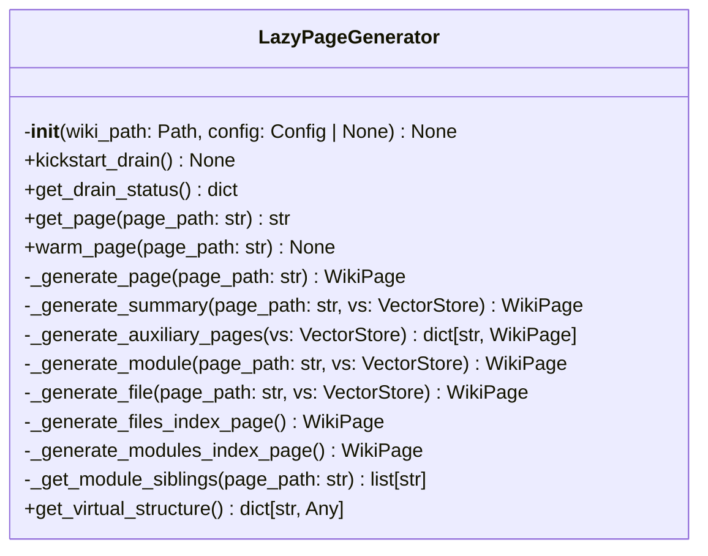

# File: `src/local_deepwiki/generators/lazy_generator.py`

## File Overview

This file implements the `LazyPageGenerator` class, which is responsible for generating wiki pages on-demand rather than all at once. It provides a lazy evaluation approach to wiki generation, where pages are only generated when first accessed. This is particularly useful for large codebases where generating all documentation upfront would be inefficient.

The `LazyPageGenerator` integrates with a caching system (`lazy_cache`) to store generated pages and a prefetching system (`prefetch`) to pre-generate pages in the background. It also uses a [`LazyResourceManager`](lazy_resources.md) to manage resources like LLMs, vector stores, and cross-linkers.

## Key Concepts

### Lazy Evaluation
The core design principle is lazy evaluation, where pages are generated only when requested. This is implemented through:
- `get_page()`: The main entry point that checks cache, generates on demand, and caches results.
- `_in_flight` dictionary: Tracks pages currently being generated to avoid duplicate work.
- `read_cached_page()` and `write_page()`: Interface to the caching layer.

### Page Routing and Generation
The generator routes page requests to specific generation functions based on the page path:
- Summary pages (`index.md`, `architecture.md`, etc.) are handled by `_generate_summary()`.
- Auxiliary pages (glossary, coverage, etc.) are handled by `_generate_auxiliary_pages()`.
- Module documentation is handled by `_generate_module()`.
- File documentation is handled by `_generate_file()`.
- Index pages for modules and files are generated by `_generate_modules_index_page()` and `_generate_files_index_page()`.

### Prefetching
To improve responsiveness, the generator supports background prefetching:
- Enabled via `wiki.prefetch_workers` configuration.
- Uses [`PrefetchQueue`](prefetch.md) to enqueue predictions for cross-links and siblings.
- The prefetch queue is started in `__init__()` if enabled.

### Resource Management
Resources like LLMs, vector stores, and cross-linkers are managed through [`LazyResourceManager`](lazy_resources.md). This abstraction ensures resources are only loaded when needed, improving startup time and memory usage.

## Integration

This file is central to the wiki generation pipeline and integrates with:
- `lazy_cache`: For caching and search index updates.
- `lazy_resources`: For managing LLMs, vector stores, and other resources.
- `wiki.files`, `wiki.modules`, `wiki.pages`: For generating specific types of pages.
- [`PrefetchQueue`](prefetch.md): For background page generation.
- [`WikiPipelineContext`](wiki/context.md), [`FileDocContext`](wiki/files.md): For passing context to page generators.
- [`VectorStore`](../core/vectorstore/store.md): For vector-based search and retrieval.

The `LazyPageGenerator` is instantiated and reused via the `get_lazy_generator()` function, which ensures a single generator per wiki path. This shared state allows for efficient resource reuse and consistent caching.

## Design Notes

### Caching Isolation
The generator isolates page generation failures by propagating exceptions to waiting futures (`get_page()`). This ensures that one failing page generation doesn't block other requests.

### Prefetching Strategy
Prefetching is enabled only when [`GenerationMode`](../config/models_wiki.md) is not `EAGER` and `prefetch_workers` > 0. This prevents prefetching during full rebuilds, which could interfere with the generation process.

### Cross-Link Handling
Cross-links are extracted using `_extract_cross_link_targets()` and used for prefetching. This allows the system to anticipate and generate related pages in the background.

### Virtual Structure
The `get_virtual_structure()` method provides a way to inspect the expected page tree without generating any pages. This is useful for UIs or status reporting.

### Error Handling
- Background tasks (e.g., prefetching) use `_log_task_exception()` to log errors without propagating them.
- Page generation failures are logged and re-raised to the caller, ensuring proper error propagation.
- Dependency graph generation is wrapped in a try-except to avoid blocking auxiliary page generation.

### Resource Loading
Resources are lazily loaded using [`LazyResourceManager`](lazy_resources.md). This prevents loading unused components during initialization, improving startup performance.

## API Reference

### class `LazyPageGenerator`

On-demand wiki page generator.  Generates individual pages when first read, caches to disk, and optionally enqueues related pages for background prefetch.

**Methods:**


<details>
<summary>View Source (lines 60-477) | <a href="https://github.com/UrbanDiver/local-deepwiki-mcp/blob/main/src/local_deepwiki/generators/lazy_generator.py#L60-L477">GitHub</a></summary>

```python
class LazyPageGenerator:
    # Methods: __init__, kickstart_drain, get_drain_status, get_page, warm_page, _generate_page, _generate_summary, _generate_auxiliary_pages, _generate_module, _generate_file, _generate_files_index_page, _generate_modules_index_page, _get_module_siblings, get_virtual_structure
```

</details>

#### `__init__`

```python
def __init__(wiki_path: Path, config: Config | None = None) -> None
```

Initialize the lazy generator with wiki output path and optional config.


| Parameter | Type | Default | Description |
|-----------|------|---------|-------------|
| `wiki_path` | `Path` | - | - |
| `config` | `Config | None` | `None` | - |


<details>
<summary>View Source (lines 67-91) | <a href="https://github.com/UrbanDiver/local-deepwiki-mcp/blob/main/src/local_deepwiki/generators/lazy_generator.py#L67-L91">GitHub</a></summary>

```python
def __init__(self, wiki_path: Path, config: Config | None = None) -> None:
        """Initialize the lazy generator with wiki output path and optional config."""
        self._wiki_path = wiki_path
        self._config = config or get_config()
        self._resources = LazyResourceManager(wiki_path, self._config)

        self._auxiliary_cache: dict[str, WikiPage] | None = None
        self._in_flight: dict[str, asyncio.Future[str]] = {}
        self._prefetch: Any = None

        wiki_cfg = self._config.wiki
        if (
            wiki_cfg.generation_mode != GenerationMode.EAGER
            and wiki_cfg.prefetch_workers > 0
        ):
            from local_deepwiki.generators.prefetch import PrefetchQueue

            self._prefetch = PrefetchQueue(
                generator=self,
                max_workers=wiki_cfg.prefetch_workers,
                max_queue=wiki_cfg.prefetch_max_queue,
                drain_enabled=wiki_cfg.prefetch_drain,
                drain_idle_seconds=wiki_cfg.drain_idle_seconds,
            )
            self._prefetch.start()
```

</details>

#### `kickstart_drain`

```python
def kickstart_drain() -> None
```

Immediately trigger prefetch drain mode if enabled.


<details>
<summary>View Source (lines 93-96) | <a href="https://github.com/UrbanDiver/local-deepwiki-mcp/blob/main/src/local_deepwiki/generators/lazy_generator.py#L93-L96">GitHub</a></summary>

```python
def kickstart_drain(self) -> None:
        """Immediately trigger prefetch drain mode if enabled."""
        if self._prefetch is not None:
            self._prefetch.kickstart_drain()
```

</details>

#### `get_drain_status`

```python
def get_drain_status() -> dict
```

Return the current drain status as a serializable dict.


<details>
<summary>View Source (lines 98-102) | <a href="https://github.com/UrbanDiver/local-deepwiki-mcp/blob/main/src/local_deepwiki/generators/lazy_generator.py#L98-L102">GitHub</a></summary>

```python
def get_drain_status(self) -> dict:
        """Return the current drain status as a serializable dict."""
        if self._prefetch is not None:
            return self._prefetch.drain_status.to_dict()
        return {"enabled": False, "state": "disabled"}
```

</details>

#### `get_page`

```python
async def get_page(page_path: str) -> str
```

Get a wiki page, generating it on demand if needed.


| Parameter | Type | Default | Description |
|-----------|------|---------|-------------|
| `page_path` | `str` | - | - |


<details>
<summary>View Source (lines 104-137) | <a href="https://github.com/UrbanDiver/local-deepwiki-mcp/blob/main/src/local_deepwiki/generators/lazy_generator.py#L104-L137">GitHub</a></summary>

```python
async def get_page(self, page_path: str) -> str:
        """Get a wiki page, generating it on demand if needed."""
        cached = read_cached_page(self._wiki_path, page_path)
        if cached is not None:
            return cached

        if page_path in self._in_flight:
            return await self._in_flight[page_path]

        fut: asyncio.Future[str] = asyncio.get_running_loop().create_future()
        self._in_flight[page_path] = fut
        try:
            page = await self._generate_page(page_path)
            linker = await self._resources.get_cross_linker()
            page = linker.add_links(page)
            await write_page(self._wiki_path, page)
            append_to_search_index(self._wiki_path, page)
            content = page.content
            fut.set_result(content)

            if self._prefetch is not None:
                cross_links = _extract_cross_link_targets(content)
                siblings = self._get_module_siblings(page_path)
                task = asyncio.create_task(
                    self._prefetch.enqueue_predictions(page_path, cross_links, siblings)
                )
                task.add_done_callback(_log_task_exception)

            return content
        except Exception as exc:  # noqa: BLE001 — lazy generation isolation: propagate to waiting future
            fut.set_exception(exc)
            raise
        finally:
            self._in_flight.pop(page_path, None)
```

</details>

#### `warm_page`

```python
async def warm_page(page_path: str) -> None
```

Generate a page in the background (no return).


| Parameter | Type | Default | Description |
|-----------|------|---------|-------------|
| `page_path` | `str` | - | - |


<details>
<summary>View Source (lines 139-144) | <a href="https://github.com/UrbanDiver/local-deepwiki-mcp/blob/main/src/local_deepwiki/generators/lazy_generator.py#L139-L144">GitHub</a></summary>

```python
async def warm_page(self, page_path: str) -> None:
        """Generate a page in the background (no return)."""
        try:
            await self.get_page(page_path)
        except Exception:  # noqa: BLE001 — background warm-up must not propagate errors
            logger.debug("Warm failed for %s", page_path, exc_info=True)
```

</details>

#### `get_virtual_structure`

```python
def get_virtual_structure() -> dict[str, Any]
```

Return the full page tree without generating any pages.


---


<details>
<summary>View Source (lines 430-477) | <a href="https://github.com/UrbanDiver/local-deepwiki-mcp/blob/main/src/local_deepwiki/generators/lazy_generator.py#L430-L477">GitHub</a></summary>

```python
def get_virtual_structure(self) -> dict[str, Any]:
        """Return the full page tree without generating any pages."""
        idx = self._resources.get_index_status()
        sig = filter_significant_files(idx.files, self._config.wiki.max_file_docs)

        pages: list[dict[str, str]] = []

        for s_page in [
            "index.md",
            "architecture.md",
            "dependencies.md",
            "changelog.md",
        ]:
            pages.append({"path": s_page, "title": s_page.replace(".md", "").title()})

        for aux in sorted(AUXILIARY_PAGES):
            pages.append(
                {"path": aux, "title": aux.replace(".md", "").replace("-", " ").title()}
            )

        dirs: dict[str, list[str]] = {}
        for f in idx.files:
            parts = Path(f.path).parts
            d = parts[0] if len(parts) > 1 else "root"
            dirs.setdefault(d, []).append(f.path)
        for d, files in dirs.items():
            if len(files) >= 2:
                pages.append({"path": f"modules/{d}.md", "title": f"Module: {d}"})
        if dirs:
            pages.append({"path": "modules/index.md", "title": "Modules"})

        for f in sig:
            wp = file_path_to_wiki_path(f.path)
            pages.append({"path": wp, "title": f.path})
        pages.append({"path": "files/index.md", "title": "Source Files"})

        structure: dict[str, Any] = {"pages": [], "sections": {}}
        for page in sorted(pages, key=lambda p: p["path"]):
            parts = Path(page["path"]).parts
            if len(parts) == 1:
                structure["pages"].append(page)
            else:
                section = parts[0]
                structure.setdefault("sections", {}).setdefault(section, []).append(
                    page
                )

        return structure
```

</details>

### Functions

#### `get_active_generators`

```python
def get_active_generators() -> dict[str, LazyPageGenerator]
```

Return the active lazy generator instances (keyed by resolved wiki path).

**Returns:** `dict[str, LazyPageGenerator]`


<details>
<summary>View Source (lines 493-495) | <a href="https://github.com/UrbanDiver/local-deepwiki-mcp/blob/main/src/local_deepwiki/generators/lazy_generator.py#L493-L495">GitHub</a></summary>

```python
def get_active_generators() -> dict[str, LazyPageGenerator]:
    """Return the active lazy generator instances (keyed by resolved wiki path)."""
    return _lazy_generators
```

</details>

#### `get_lazy_generator`

```python
def get_lazy_generator(wiki_path: Path, config: Config | None = None) -> LazyPageGenerator
```

Return a shared LazyPageGenerator for the given wiki path, creating one if needed.


| Parameter | Type | Default | Description |
|-----------|------|---------|-------------|
| `wiki_path` | `Path` | - | - |
| `config` | `Config | None` | `None` | - |

**Returns:** `LazyPageGenerator`


<details>
<summary>View Source (lines 498-505) | <a href="https://github.com/UrbanDiver/local-deepwiki-mcp/blob/main/src/local_deepwiki/generators/lazy_generator.py#L498-L505">GitHub</a></summary>

```python
def get_lazy_generator(
    wiki_path: Path, config: Config | None = None
) -> LazyPageGenerator:
    """Return a shared LazyPageGenerator for the given wiki path, creating one if needed."""
    key = str(wiki_path.resolve())
    if key not in _lazy_generators:
        _lazy_generators[key] = LazyPageGenerator(wiki_path, config or get_config())
    return _lazy_generators[key]
```

</details>

## Class Diagram



## Call Graph

```mermaid
flowchart TD
    N0[FileNotFoundError]
    N1[LazyPageGenerator.__init__]
    N2[LazyPageGenerator._generate...]
    N3[LazyPageGenerator._generate...]
    N4[LazyPageGenerator._generate...]
    N5[LazyPageGenerator._generate...]
    N6[LazyPageGenerator._generate...]
    N7[LazyPageGenerator._generate...]
    N8[LazyPageGenerator._generate...]
    N9[LazyPageGenerator._get_modu...]
    N10[LazyPageGenerator.get_page]
    N11[LazyPageGenerator.get_virtu...]
    N12[Path]
    N13[WikiPage]
    N14[WikiPipelineContext]
    N15[WikiStatusManager]
    N16[_extract_cross_link_targets]
    N17[_log_task_exception]
    N18[exists]
    N19[get_config]
    N20[get_index_status]
    N21[get_lazy_generator]
    N22[get_llm]
    N23[get_repo_path]
    N24[get_system_prompt]
    N25[read_text]
    N26[relative_to]
    N27[rglob]
    N28[time]
    N29[write_page]
    N21 --> N19
    N1 --> N19
    N10 --> N29
    N10 --> N16
    N7 --> N0
    N8 --> N20
    N8 --> N22
    N8 --> N24
    N8 --> N23
    N8 --> N14
    N8 --> N15
    N8 --> N13
    N8 --> N28
    N8 --> N0
    N2 --> N20
    N2 --> N13
    N2 --> N28
    N2 --> N29
    N5 --> N12
    N5 --> N20
    N5 --> N0
    N5 --> N22
    N5 --> N24
    N5 --> N23
    N5 --> N14
    N3 --> N0
    N3 --> N20
    N3 --> N22
    N3 --> N24
    N3 --> N15
    N4 --> N18
    N4 --> N27
    N4 --> N26
    N4 --> N25
    N4 --> N13
    N4 --> N28
    N6 --> N18
    N6 --> N25
    N6 --> N13
    N6 --> N28
    N9 --> N12
    N9 --> N27
    N9 --> N26
    N11 --> N20
    N11 --> N12
    classDef func fill:#e1f5fe
    class N0,N12,N13,N14,N15,N16,N17,N18,N19,N20,N21,N22,N23,N24,N25,N26,N27,N28,N29 func
    classDef method fill:#fff3e0
    class N1,N2,N3,N4,N5,N6,N7,N8,N9,N10,N11 method
```



## Used By

Functions and methods in this file and their callers:

- **[`FileDocContext`](wiki/files.md)**: called by `LazyPageGenerator._generate_file`
- **`FileNotFoundError`**: called by `LazyPageGenerator._generate_file`, `LazyPageGenerator._generate_module`, `LazyPageGenerator._generate_page`, `LazyPageGenerator._generate_summary`
- **`LazyPageGenerator`**: called by `get_lazy_generator`
- **[`LazyResourceManager`](lazy_resources.md)**: called by `LazyPageGenerator.__init__`
- **`Path`**: called by `LazyPageGenerator._generate_module`, `LazyPageGenerator._get_module_siblings`, `LazyPageGenerator.get_virtual_structure`
- **[`PrefetchQueue`](prefetch.md)**: called by `LazyPageGenerator.__init__`
- **[`WikiPage`](../export/streaming.md)**: called by `LazyPageGenerator._generate_auxiliary_pages`, `LazyPageGenerator._generate_files_index_page`, `LazyPageGenerator._generate_modules_index_page`, `LazyPageGenerator._generate_summary`
- **[`WikiPipelineContext`](wiki/context.md)**: called by `LazyPageGenerator._generate_module`, `LazyPageGenerator._generate_summary`
- **[`WikiStatusManager`](wiki/status.md)**: called by `LazyPageGenerator._generate_file`, `LazyPageGenerator._generate_summary`
- **`_extract_cross_link_targets`**: called by `LazyPageGenerator.get_page`
- **`_generate_auxiliary_pages`**: called by `LazyPageGenerator._generate_page`
- **`_generate_file`**: called by `LazyPageGenerator._generate_page`
- **`_generate_files_index`**: called by `LazyPageGenerator._generate_files_index_page`
- **`_generate_files_index_page`**: called by `LazyPageGenerator._generate_page`
- **`_generate_module`**: called by `LazyPageGenerator._generate_page`
- **`_generate_modules_index`**: called by `LazyPageGenerator._generate_modules_index_page`
- **`_generate_modules_index_page`**: called by `LazyPageGenerator._generate_module`
- **`_generate_page`**: called by `LazyPageGenerator.get_page`
- **`_generate_summary`**: called by `LazyPageGenerator._generate_page`
- **`_get_module_siblings`**: called by `LazyPageGenerator.get_page`
- **`add_done_callback`**: called by `LazyPageGenerator.get_page`
- **`add_links`**: called by `LazyPageGenerator.get_page`
- **[`append_to_search_index`](lazy_cache.md)**: called by `LazyPageGenerator.get_page`
- **`cancelled`**: called by `_log_task_exception`
- **`create_future`**: called by `LazyPageGenerator.get_page`
- **`create_task`**: called by `LazyPageGenerator.get_page`
- **`enqueue_predictions`**: called by `LazyPageGenerator.get_page`
- **`exception`**: called by `_log_task_exception`
- **`exists`**: called by `LazyPageGenerator._generate_files_index_page`, `LazyPageGenerator._generate_modules_index_page`
- **[`file_path_to_wiki_path`](wiki/utils.md)**: called by `LazyPageGenerator.get_virtual_structure`
- **[`filter_significant_files`](wiki/files.md)**: called by `LazyPageGenerator.get_virtual_structure`
- **`findall`**: called by `_extract_cross_link_targets`
- **[`generate_architecture_page`](wiki/pages.md)**: called by `LazyPageGenerator._generate_summary`
- **[`generate_changelog_page`](wiki/pages.md)**: called by `LazyPageGenerator._generate_summary`
- **[`generate_coverage_page`](analysis/coverage.md)**: called by `LazyPageGenerator._generate_auxiliary_pages`
- **[`generate_dependencies_page`](wiki/pages.md)**: called by `LazyPageGenerator._generate_summary`
- **[`generate_dependency_graph_page`](analysis/dependency_graph.md)**: called by `LazyPageGenerator._generate_auxiliary_pages`
- **[`generate_glossary_page`](analysis/glossary.md)**: called by `LazyPageGenerator._generate_auxiliary_pages`
- **[`generate_inheritance_page`](analysis/inheritance.md)**: called by `LazyPageGenerator._generate_auxiliary_pages`
- **[`generate_overview_page`](wiki/pages.md)**: called by `LazyPageGenerator._generate_summary`
- **[`generate_single_file_doc`](wiki/files.md)**: called by `LazyPageGenerator._generate_file`
- **[`generate_single_module_doc`](wiki/modules.md)**: called by `LazyPageGenerator._generate_module`
- **[`get_cached_manifest`](manifest.md)**: called by `LazyPageGenerator._generate_summary`
- **[`get_config`](../config/loader.md)**: called by `LazyPageGenerator.__init__`, `get_lazy_generator`
- **`get_cross_linker`**: called by `LazyPageGenerator.get_page`
- **`get_entity_registry`**: called by `LazyPageGenerator._generate_file`
- **`get_index_status`**: called by `LazyPageGenerator._generate_auxiliary_pages`, `LazyPageGenerator._generate_file`, `LazyPageGenerator._generate_module`, `LazyPageGenerator._generate_summary`, `LazyPageGenerator.get_virtual_structure`
- **`get_llm`**: called by `LazyPageGenerator._generate_file`, `LazyPageGenerator._generate_module`, `LazyPageGenerator._generate_summary`
- **`get_page`**: called by `LazyPageGenerator.warm_page`
- **`get_repo_path`**: called by `LazyPageGenerator._generate_module`, `LazyPageGenerator._generate_summary`
- **`get_running_loop`**: called by `LazyPageGenerator.get_page`
- **`get_system_prompt`**: called by `LazyPageGenerator._generate_file`, `LazyPageGenerator._generate_module`, `LazyPageGenerator._generate_summary`
- **`get_vector_store`**: called by `LazyPageGenerator._generate_page`
- **`get_wiki_to_file`**: called by `LazyPageGenerator._generate_file`
- **`glob`**: called by `LazyPageGenerator._generate_modules_index_page`
- **`is_dir`**: called by `LazyPageGenerator._get_module_siblings`
- **`kickstart_drain`**: called by `LazyPageGenerator.kickstart_drain`
- **`lstrip`**: called by `LazyPageGenerator._generate_files_index_page`, `LazyPageGenerator._generate_modules_index_page`
- **[`read_cached_page`](lazy_cache.md)**: called by `LazyPageGenerator.get_page`
- **`read_text`**: called by `LazyPageGenerator._generate_files_index_page`, `LazyPageGenerator._generate_modules_index_page`
- **`relative_to`**: called by `LazyPageGenerator._generate_files_index_page`, `LazyPageGenerator._get_module_siblings`
- **`resolve`**: called by `get_lazy_generator`
- **`rglob`**: called by `LazyPageGenerator._generate_files_index_page`, `LazyPageGenerator._get_module_siblings`
- **`set_exception`**: called by `LazyPageGenerator.get_page`
- **`set_result`**: called by `LazyPageGenerator.get_page`
- **`setdefault`**: called by `LazyPageGenerator.get_virtual_structure`
- **`start`**: called by `LazyPageGenerator.__init__`
- **`sub`**: called by `_extract_cross_link_targets`
- **`time`**: called by `LazyPageGenerator._generate_auxiliary_pages`, `LazyPageGenerator._generate_files_index_page`, `LazyPageGenerator._generate_modules_index_page`, `LazyPageGenerator._generate_summary`
- **`title`**: called by `LazyPageGenerator.get_virtual_structure`
- **`to_dict`**: called by `LazyPageGenerator.get_drain_status`
- **[`write_page`](lazy_cache.md)**: called by `LazyPageGenerator._generate_auxiliary_pages`, `LazyPageGenerator.get_page`

## Usage Examples

*Examples extracted from test files*

### Example: `get_page`

From `test_lazy_generator.py::TestLazyPageGenerator::test_get_page_returns_cached`:

```python
wiki = _make_wiki_dir(tmp_path)
        gen = _make_generator(wiki)
        (wiki / "index.md").write_text("# Cached content")

        content = await gen.get_page("index.md")
        assert content == "# Cached content"
```

### Example: `get_page`

From `test_lazy_generator.py::TestLazyPageGenerator::test_get_page_propagates_errors`:

```python
wiki = _make_wiki_dir(tmp_path)
        gen = _make_generator(wiki)

        gen._generate_page = AsyncMock(side_effect=RuntimeError("generation failed"))

        with pytest.raises(RuntimeError, match="generation failed"):
            await gen.get_page("index.md")

        assert "index.md" not in gen._in_flight
```

### Example: `_generate_page`

From `test_lazy_generator.py::TestLazyPageGenerator::test_get_page_propagates_errors`:

```python
gen._generate_page = AsyncMock(side_effect=RuntimeError("generation failed"))

with pytest.raises(RuntimeError, match="generation failed"):
    await gen.get_page("index.md")

assert "index.md" not in gen._in_flight
```

### Example: `get_virtual_structure`

From `test_lazy_generator.py::TestLazyPageGenerator::test_get_virtual_structure_with_index`:

```python
wiki = _make_wiki_dir(tmp_path)
        gen = _make_generator(wiki)

        structure = gen.get_virtual_structure()

        assert "pages" in structure
        assert "sections" in structure
        page_paths = {p["path"] for p in structure["pages"]}
        assert "index.md" in page_paths
        assert "architecture.md" in page_paths
```

### Example: `get_virtual_structure`

From `test_lazy_generator.py::TestLazyPageGenerator::test_get_virtual_structure_without_index`:

```python
wiki = tmp_path / ".deepwiki"
        wiki.mkdir()
        gen = _make_generator(wiki)

        with pytest.raises(Exception):
            gen.get_virtual_structure()
```


## Last Modified

| Entity | Type | Author | Date | Commit |
|--------|------|--------|------|--------|
| `LazyPageGenerator` | class | Brian Breidenbach | yesterday | `f69b56c` refactor: introduce WikiPip... |
| `_generate_module` | method | Brian Breidenbach | yesterday | `f69b56c` refactor: introduce WikiPip... |
| `__init__` | method | Brian Breidenbach | 1 week ago | `5f53cf9` refactor: extract LazyResou... |
| `get_page` | method | Brian Breidenbach | 1 week ago | `5f53cf9` refactor: extract LazyResou... |
| `_generate_page` | method | Brian Breidenbach | 1 week ago | `5f53cf9` refactor: extract LazyResou... |
| `_generate_summary` | method | Brian Breidenbach | 1 week ago | `5f53cf9` refactor: extract LazyResou... |
| `_generate_auxiliary_pages` | method | Brian Breidenbach | 1 week ago | `5f53cf9` refactor: extract LazyResou... |
| `_generate_file` | method | Brian Breidenbach | 1 week ago | `5f53cf9` refactor: extract LazyResou... |
| `get_virtual_structure` | method | Brian Breidenbach | 1 week ago | `5f53cf9` refactor: extract LazyResou... |
| `kickstart_drain` | method | Brian Breidenbach | 2 weeks ago | `821d70f` docs: add docstrings to Laz... |
| `get_drain_status` | method | Brian Breidenbach | 2 weeks ago | `821d70f` docs: add docstrings to Laz... |
| `_generate_files_index_page` | method | Brian Breidenbach | 2 weeks ago | `821d70f` docs: add docstrings to Laz... |
| `_generate_modules_index_page` | method | Brian Breidenbach | 2 weeks ago | `821d70f` docs: add docstrings to Laz... |
| `_get_module_siblings` | method | Brian Breidenbach | 2 weeks ago | `821d70f` docs: add docstrings to Laz... |
| `get_lazy_generator` | function | Brian Breidenbach | 2 weeks ago | `821d70f` docs: add docstrings to Laz... |
| `warm_page` | method | Brian Breidenbach | Feb 23, 2026 | `c6fe2bd` refactor: split oversized m... |
| `_log_task_exception` | function | Brian Breidenbach | Feb 20, 2026 | `8182b15` refactor: Pythonic API impr... |
| `_extract_cross_link_targets` | function | Brian Breidenbach | Feb 14, 2026 | `45d649a` feat: lazy wiki generation ... |
| `get_active_generators` | function | Brian Breidenbach | Feb 14, 2026 | `45d649a` feat: lazy wiki generation ... |

## Additional Source Code

Source code for functions and methods not listed in the API Reference above.

#### `_log_task_exception`

<details>
<summary>View Source (lines 54-57) | <a href="https://github.com/UrbanDiver/local-deepwiki-mcp/blob/main/src/local_deepwiki/generators/lazy_generator.py#L54-L57">GitHub</a></summary>

```python
def _log_task_exception(task: asyncio.Task[Any]) -> None:
    """Log exceptions from fire-and-forget background tasks."""
    if not task.cancelled() and task.exception() is not None:
        logger.warning("Background task failed: %s", task.exception())
```

</details>


#### `_generate_page`

<details>
<summary>View Source (lines 146-167) | <a href="https://github.com/UrbanDiver/local-deepwiki-mcp/blob/main/src/local_deepwiki/generators/lazy_generator.py#L146-L167">GitHub</a></summary>

```python
async def _generate_page(self, page_path: str) -> WikiPage:
        """Route to the correct generator based on page path."""
        vs = await self._resources.get_vector_store()

        if page_path in SUMMARY_PAGES:
            return await self._generate_summary(page_path, vs)

        if page_path in AUXILIARY_PAGES:
            pages = await self._generate_auxiliary_pages(vs)
            if page_path in pages:
                return pages[page_path]
            raise FileNotFoundError(f"Auxiliary page not generated: {page_path}")

        if page_path.startswith("modules/"):
            return await self._generate_module(page_path, vs)

        if page_path.startswith("files/"):
            if page_path == "files/index.md":
                return self._generate_files_index_page()
            return await self._generate_file(page_path, vs)

        raise FileNotFoundError(f"Unknown page type: {page_path}")
```

</details>


#### `_generate_summary`

<details>
<summary>View Source (lines 169-216) | <a href="https://github.com/UrbanDiver/local-deepwiki-mcp/blob/main/src/local_deepwiki/generators/lazy_generator.py#L169-L216">GitHub</a></summary>

```python
async def _generate_summary(self, page_path: str, vs: VectorStore) -> WikiPage:
        """Generate a top-level summary page (overview, architecture, dependencies, or changelog)."""
        idx = self._resources.get_index_status()
        llm = self._resources.get_llm()
        prompt = self._resources.get_system_prompt()
        repo_path = self._resources.get_repo_path()

        from local_deepwiki.generators.manifest import get_cached_manifest
        from local_deepwiki.generators.wiki.context import WikiPipelineContext
        from local_deepwiki.generators.wiki.status import WikiStatusManager

        manifest = get_cached_manifest(repo_path, cache_dir=self._wiki_path)

        ctx = WikiPipelineContext(
            index_status=idx,
            vector_store=vs,
            llm=llm,
            system_prompt=prompt,
            repo_path=repo_path,
            wiki_path=self._wiki_path,
            config=self._config,
            wiki_config=self._config.wiki,
            manifest=manifest,
            status_manager=WikiStatusManager(self._wiki_path),
            full_rebuild=False,
            max_chunk_content_chars=self._config.wiki.max_chunk_content_chars,
        )

        if page_path == "index.md":
            return await generate_overview_page(ctx)
        elif page_path == "architecture.md":
            return await generate_architecture_page(ctx)
        elif page_path == "dependencies.md":
            page, _ = await generate_dependencies_page(
                ctx, import_search_limit=self._config.wiki.import_search_limit
            )
            return page
        elif page_path == "changelog.md":
            changelog_page = await generate_changelog_page(repo_path)
            if changelog_page is None:
                return WikiPage(
                    path="changelog.md",
                    title="Changelog",
                    content="# Changelog\n\nNo git history available.",
                    generated_at=time.time(),
                )
            return changelog_page
        raise FileNotFoundError(f"Unknown summary page: {page_path}")
```

</details>


#### `_generate_auxiliary_pages`

<details>
<summary>View Source (lines 218-283) | <a href="https://github.com/UrbanDiver/local-deepwiki-mcp/blob/main/src/local_deepwiki/generators/lazy_generator.py#L218-L283">GitHub</a></summary>

```python
async def _generate_auxiliary_pages(self, vs: VectorStore) -> dict[str, WikiPage]:
        """Generate and cache all auxiliary pages (glossary, inheritance, coverage, dependency graph)."""
        if self._auxiliary_cache is not None:
            return self._auxiliary_cache

        from local_deepwiki.generators.analysis.coverage import generate_coverage_page
        from local_deepwiki.generators.analysis.dependency_graph import (
            generate_dependency_graph_page,
        )
        from local_deepwiki.generators.analysis.glossary import generate_glossary_page
        from local_deepwiki.generators.analysis.inheritance import (
            generate_inheritance_page,
        )

        idx = self._resources.get_index_status()
        pages: dict[str, WikiPage] = {}

        glossary_content = await generate_glossary_page(idx, vs)
        if glossary_content:
            pages["glossary.md"] = WikiPage(
                path="glossary.md",
                title="Glossary",
                content=glossary_content,
                generated_at=time.time(),
            )

        inheritance_content = await generate_inheritance_page(idx, vs)
        if inheritance_content:
            pages["inheritance.md"] = WikiPage(
                path="inheritance.md",
                title="Class Inheritance",
                content=inheritance_content,
                generated_at=time.time(),
            )

        coverage_content = await generate_coverage_page(idx, vs)
        if coverage_content:
            pages["coverage.md"] = WikiPage(
                path="coverage.md",
                title="Documentation Coverage",
                content=coverage_content,
                generated_at=time.time(),
            )

        try:
            dep_content = await generate_dependency_graph_page(
                index_status=idx,
                vector_store=vs,
                show_external=True,
                max_external=10,
                wiki_base_path="files/",
            )
            if dep_content:
                pages["dependency-graph.md"] = WikiPage(
                    path="dependency-graph.md",
                    title="Dependency Graph",
                    content=dep_content,
                    generated_at=time.time(),
                )
        except Exception:  # noqa: BLE001 — generator isolation: dependency graph failure must not block auxiliary pages
            logger.debug("Dependency graph generation failed", exc_info=True)

        self._auxiliary_cache = pages
        for page in pages.values():
            await write_page(self._wiki_path, page)
        return pages
```

</details>


#### `_generate_module`

<details>
<summary>View Source (lines 285-321) | <a href="https://github.com/UrbanDiver/local-deepwiki-mcp/blob/main/src/local_deepwiki/generators/lazy_generator.py#L285-L321">GitHub</a></summary>

```python
async def _generate_module(self, page_path: str, vs: VectorStore) -> WikiPage:
        """Generate a module documentation page or the modules index."""
        if page_path == "modules/index.md":
            return self._generate_modules_index_page()

        dir_name = Path(page_path).stem
        idx = self._resources.get_index_status()
        files = [
            f.path
            for f in idx.files
            if len(Path(f.path).parts) > 1 and Path(f.path).parts[0] == dir_name
        ]
        if not files:
            raise FileNotFoundError(f"No files for module: {dir_name}")

        from local_deepwiki.generators.wiki.context import WikiPipelineContext

        llm = self._resources.get_llm()
        prompt = self._resources.get_system_prompt()
        repo_path = self._resources.get_repo_path()
        ctx = WikiPipelineContext(
            index_status=idx,
            vector_store=vs,
            llm=llm,
            system_prompt=prompt,
            repo_path=repo_path or Path("."),
            wiki_path=self._wiki_path,
            config=self._config,
            wiki_config=self._config.wiki,
            manifest=None,
            status_manager=None,  # type: ignore[arg-type]
            full_rebuild=False,
        )
        page = await generate_single_module_doc(dir_name, files, ctx)
        if page is None:
            raise FileNotFoundError(f"Module generation failed: {dir_name}")
        return page
```

</details>


#### `_generate_file`

<details>
<summary>View Source (lines 323-354) | <a href="https://github.com/UrbanDiver/local-deepwiki-mcp/blob/main/src/local_deepwiki/generators/lazy_generator.py#L323-L354">GitHub</a></summary>

```python
async def _generate_file(self, page_path: str, vs: VectorStore) -> WikiPage:
        """Generate a single file documentation page from its source FileInfo."""
        w2f = self._resources.get_wiki_to_file()
        file_info = w2f.get(page_path)
        if file_info is None:
            raise FileNotFoundError(f"No source file for wiki page: {page_path}")

        idx = self._resources.get_index_status()
        llm = self._resources.get_llm()
        prompt = self._resources.get_system_prompt()
        registry = await self._resources.get_entity_registry()

        from local_deepwiki.generators.wiki.status import WikiStatusManager

        status_mgr = WikiStatusManager(self._wiki_path)
        status_mgr.file_hashes = {f.path: f.hash for f in idx.files}

        ctx = FileDocContext(
            index_status=idx,
            vector_store=vs,
            llm=llm,
            system_prompt=prompt,
            status_manager=status_mgr,
            entity_registry=registry,
            config=self._config,
            full_rebuild=True,
        )

        page, _was_skipped = await generate_single_file_doc(file_info, ctx)
        if page is None:
            raise FileNotFoundError(f"File generation produced no content: {page_path}")
        return page
```

</details>


#### `_generate_files_index_page`

<details>
<summary>View Source (lines 356-384) | <a href="https://github.com/UrbanDiver/local-deepwiki-mcp/blob/main/src/local_deepwiki/generators/lazy_generator.py#L356-L384">GitHub</a></summary>

```python
def _generate_files_index_page(self) -> WikiPage:
        """Build the files/index.md page listing all existing file documentation pages."""
        existing_pages = []
        files_dir = self._wiki_path / "files"
        if files_dir.exists():
            for md in files_dir.rglob("*.md"):
                if md.name == "index.md":
                    continue
                rel = str(md.relative_to(self._wiki_path))
                first_line = md.read_text().split("\n", 1)[0]
                title = (
                    first_line.lstrip("#").strip()
                    if first_line.startswith("#")
                    else rel
                )
                existing_pages.append(
                    WikiPage(
                        path=rel,
                        title=title,
                        content="",
                        generated_at=0,
                    )
                )
        return WikiPage(
            path="files/index.md",
            title="Source Files",
            content=_generate_files_index(existing_pages),
            generated_at=time.time(),
        )
```

</details>


#### `_generate_modules_index_page`

<details>
<summary>View Source (lines 386-413) | <a href="https://github.com/UrbanDiver/local-deepwiki-mcp/blob/main/src/local_deepwiki/generators/lazy_generator.py#L386-L413">GitHub</a></summary>

```python
def _generate_modules_index_page(self) -> WikiPage:
        """Build the modules/index.md page listing all existing module documentation pages."""
        existing = []
        mods_dir = self._wiki_path / "modules"
        if mods_dir.exists():
            for md in mods_dir.glob("*.md"):
                if md.name == "index.md":
                    continue
                first_line = md.read_text().split("\n", 1)[0]
                title = (
                    first_line.lstrip("#").strip()
                    if first_line.startswith("#")
                    else md.stem
                )
                existing.append(
                    WikiPage(
                        path=f"modules/{md.name}",
                        title=title,
                        content="",
                        generated_at=0,
                    )
                )
        return WikiPage(
            path="modules/index.md",
            title="Modules",
            content=_generate_modules_index(existing),
            generated_at=time.time(),
        )
```

</details>


#### `_get_module_siblings`

<details>
<summary>View Source (lines 415-428) | <a href="https://github.com/UrbanDiver/local-deepwiki-mcp/blob/main/src/local_deepwiki/generators/lazy_generator.py#L415-L428">GitHub</a></summary>

```python
def _get_module_siblings(self, page_path: str) -> list[str]:
        """Return wiki paths of sibling pages in the same section directory."""
        parts = Path(page_path).parts
        if len(parts) < 2:
            return []
        parent = parts[0]
        result = []
        parent_dir = self._wiki_path / parent
        if parent_dir.is_dir():
            for md in parent_dir.rglob("*.md"):
                rel = str(md.relative_to(self._wiki_path))
                if rel != page_path and rel.endswith(".md"):
                    result.append(rel)
        return result
```

</details>


#### `_extract_cross_link_targets`

<details>
<summary>View Source (lines 480-487) | <a href="https://github.com/UrbanDiver/local-deepwiki-mcp/blob/main/src/local_deepwiki/generators/lazy_generator.py#L480-L487">GitHub</a></summary>

```python
def _extract_cross_link_targets(content: str) -> list[str]:
    """Extract wiki page paths from markdown links in content."""
    raw = re.findall(r"\[.*?\]\(([^)]*\.md)\)", content)
    result = []
    for p in raw:
        normalized = re.sub(r"^(\.\./)+", "", p)
        result.append(normalized)
    return result
```

</details>

## Relevant Source Files

- `src/local_deepwiki/generators/lazy_generator.py:60-477`
