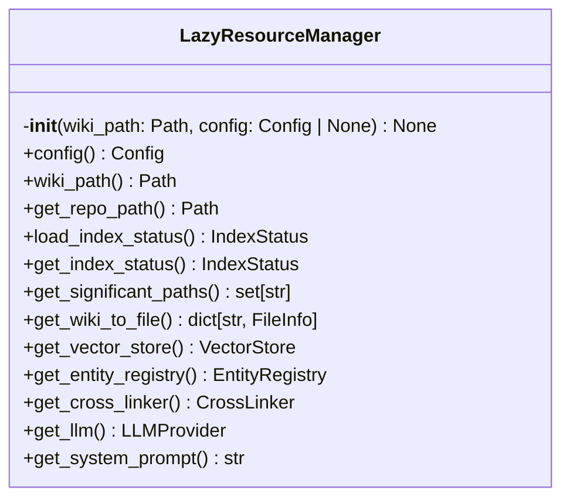

# File: `src/local_deepwiki/generators/lazy_resources.py`

## File Overview

This file implements a `LazyResourceManager` class that provides lazy-loaded access to resources required for wiki page generation. These resources include the vector store, LLM provider, entity registry, cross-linker, and index status, among others.

The purpose of this file is to defer the initialization of expensive resources until they are actually needed. This improves performance and memory usage, particularly in scenarios where not all resources are required for a given operation. The `LazyResourceManager` is used by components like [`LazyPageGenerator`](lazy_generator.md) and is integral to the lazy generation pipeline.

## Key Concepts

### Lazy Loading Pattern

The core abstraction in this file is the lazy loading of resources. This pattern is used to avoid initializing expensive components (like vector stores or LLM providers) at startup, instead initializing them only when first accessed. This is especially beneficial in CLI tools or batch processes where only subsets of functionality may be used.

### Resource Caching

The `LazyResourceManager` caches initialized resources in instance variables to ensure that each resource is created only once per instance. This avoids redundant operations and maintains consistency across multiple calls to the same getter method.

### Configuration and Index Status Integration

The resource manager relies heavily on configuration ([`Config`](../config/models.md)) and index status ([`IndexStatus`](../models/wiki.md)) to determine paths, providers, and settings. This tight coupling ensures that the lazy resources are correctly initialized with the context of the current repository and wiki setup.

## Integration

### Usage within the Codebase

This file is used by:
- [`LazyPageGenerator`](lazy_generator.md) (via `lazy_generator`)
- `test_lazy_generator` (test suite)

It is imported and used in the context of wiki generation, where resources like vector stores and LLMs are needed to process and link files.

### Dependencies

This file imports:
- [`Config`](../config/models.md) and [`get_config`](../config/loader.md) for configuration access
- [`VectorStore`](../core/vectorstore/store.md) for vector database operations
- [`CrossLinker`](crosslinks.md), [`EntityRegistry`](crosslinks.md), and [`build_entity_registry_from_store`](crosslinks.md) for entity linking
- [`filter_significant_files`](wiki/files.md) for filtering files based on configuration
- [`file_path_to_wiki_path`](wiki/utils.md) for path conversion
- [`get_logger`](../logging.md) for logging
- [`FileInfo`](../models/chunks.md) and [`IndexStatus`](../models/wiki.md) for metadata handling
- [`LLMProvider`](../providers/base.md) for language model access
- `get_embedding_provider` and `get_cached_llm_provider` for provider instantiation
- [`PromptManager`](../prompts.md) for system prompt building

These dependencies are central to the wiki generation pipeline and provide the tools necessary to manage and process documentation.

### Related Files

This file integrates with:
- CLI modules like `check_cli.py`, `main.py`, `status_cli.py` for command-line interaction
- Other generators like `analysis/api_docs.py` for additional processing
- Vector store and LLM provider implementations in `core.vectorstore`, `providers.embeddings`, and `providers.llm`

## Design Notes

### Resource Initialization

Resources such as the vector store and LLM provider are initialized asynchronously, allowing for better integration with async workflows and ensuring that expensive operations like embedding initialization are deferred.

### Persistence of Entity Registry

The `get_entity_registry` method checks for an existing `entity_registry.json` file. If it exists, it loads it; otherwise, it builds the registry from the vector store and saves it. This allows for faster subsequent runs by reusing previously computed entity mappings.

### System Prompt Construction

The `get_system_prompt` method uses [`PromptManager`](../prompts.md) to build a system prompt specific to the current repository and LLM provider. This ensures that prompts are tailored to the context and provider being used, enhancing generation quality.

### Error Handling

The `get_llm` method raises a `RuntimeError` if the vector store is not initialized before the LLM is requested. This enforces initialization order and prevents silent failures.

### Caching Strategy

All resources are cached in instance variables, ensuring that:
- Resources are only initialized once
- The same instance of a resource is returned on subsequent calls
- Memory usage is optimized by avoiding duplicate object creation

This caching strategy is consistent across all resource getters and aligns with the lazy loading principle.

## API Reference

### class `LazyResourceManager`

Manages lazy-loaded resources for wiki page generation.  Centralizes lazy initialization of vector store, LLM provider, entity registry, cross-linker, index status, and derived mappings.

**Methods:**


<details>
<summary>View Source (lines 31-151) | <a href="https://github.com/UrbanDiver/local-deepwiki-mcp/blob/main/src/local_deepwiki/generators/lazy_resources.py#L31-L151">GitHub</a></summary>

```python
class LazyResourceManager:
    # Methods: __init__, config, wiki_path, get_repo_path, load_index_status, get_index_status, get_significant_paths, get_wiki_to_file, get_vector_store, get_entity_registry, get_cross_linker, get_llm, get_system_prompt
```

</details>

#### `__init__`

```python
def __init__(wiki_path: Path, config: Config | None = None) -> None
```


| Parameter | Type | Default | Description |
|-----------|------|---------|-------------|
| `wiki_path` | `Path` | - | - |
| `config` | `Config | None` | `None` | - |


<details>
<summary>View Source (lines 38-47) | <a href="https://github.com/UrbanDiver/local-deepwiki-mcp/blob/main/src/local_deepwiki/generators/lazy_resources.py#L38-L47">GitHub</a></summary>

```python
def __init__(self, wiki_path: Path, config: Config | None = None) -> None:
        self._wiki_path = wiki_path
        self._config = config or get_config()
        self._repo_path: Path | None = None
        self._vector_store: VectorStore | None = None
        self._entity_registry: EntityRegistry | None = None
        self._cross_linker: CrossLinker | None = None
        self._index_status: IndexStatus | None = None
        self._wiki_to_file: dict[str, FileInfo] | None = None
        self._significant_paths: set[str] | None = None
```

</details>

#### `config`

```python
def config() -> Config
```

Return the configuration object.


<details>
<summary>View Source (lines 50-52) | <a href="https://github.com/UrbanDiver/local-deepwiki-mcp/blob/main/src/local_deepwiki/generators/lazy_resources.py#L50-L52">GitHub</a></summary>

```python
def config(self) -> Config:
        """Return the configuration object."""
        return self._config
```

</details>

#### `wiki_path`

```python
def wiki_path() -> Path
```

Return the wiki output path.


<details>
<summary>View Source (lines 55-57) | <a href="https://github.com/UrbanDiver/local-deepwiki-mcp/blob/main/src/local_deepwiki/generators/lazy_resources.py#L55-L57">GitHub</a></summary>

```python
def wiki_path(self) -> Path:
        """Return the wiki output path."""
        return self._wiki_path
```

</details>

#### `get_repo_path`

```python
def get_repo_path() -> Path
```

Return the repository path, loading from index status if needed.


<details>
<summary>View Source (lines 59-64) | <a href="https://github.com/UrbanDiver/local-deepwiki-mcp/blob/main/src/local_deepwiki/generators/lazy_resources.py#L59-L64">GitHub</a></summary>

```python
def get_repo_path(self) -> Path:
        """Return the repository path, loading from index status if needed."""
        if self._repo_path is None:
            idx = self.load_index_status()
            self._repo_path = Path(idx.repo_path)
        return self._repo_path
```

</details>

#### `load_index_status`

```python
def load_index_status() -> IndexStatus
```

Load and cache [IndexStatus](../models/wiki.md) from the wiki's index_status.json file.


<details>
<summary>View Source (lines 66-74) | <a href="https://github.com/UrbanDiver/local-deepwiki-mcp/blob/main/src/local_deepwiki/generators/lazy_resources.py#L66-L74">GitHub</a></summary>

```python
def load_index_status(self) -> IndexStatus:
        """Load and cache IndexStatus from the wiki's index_status.json file."""
        if self._index_status is not None:
            return self._index_status
        status_path = self._wiki_path / "index_status.json"
        data = json.loads(status_path.read_text())
        self._index_status = IndexStatus.model_validate(data)
        self._repo_path = Path(self._index_status.repo_path)
        return self._index_status
```

</details>

#### `get_index_status`

```python
def get_index_status() -> IndexStatus
```

Return cached [IndexStatus](../models/wiki.md), loading from disk on first call.


<details>
<summary>View Source (lines 76-78) | <a href="https://github.com/UrbanDiver/local-deepwiki-mcp/blob/main/src/local_deepwiki/generators/lazy_resources.py#L76-L78">GitHub</a></summary>

```python
def get_index_status(self) -> IndexStatus:
        """Return cached IndexStatus, loading from disk on first call."""
        return self.load_index_status()
```

</details>

#### `get_significant_paths`

```python
def get_significant_paths() -> set[str]
```

Return the set of file paths significant enough for individual wiki pages.


<details>
<summary>View Source (lines 80-88) | <a href="https://github.com/UrbanDiver/local-deepwiki-mcp/blob/main/src/local_deepwiki/generators/lazy_resources.py#L80-L88">GitHub</a></summary>

```python
def get_significant_paths(self) -> set[str]:
        """Return the set of file paths significant enough for individual wiki pages."""
        if self._significant_paths is None:
            idx = self.get_index_status()
            significant = filter_significant_files(
                idx.files, self._config.wiki.max_file_docs
            )
            self._significant_paths = {f.path for f in significant}
        return self._significant_paths
```

</details>

#### `get_wiki_to_file`

```python
def get_wiki_to_file() -> dict[str, FileInfo]
```

Return a mapping from wiki page paths to their source [FileInfo](../models/chunks.md).


<details>
<summary>View Source (lines 90-95) | <a href="https://github.com/UrbanDiver/local-deepwiki-mcp/blob/main/src/local_deepwiki/generators/lazy_resources.py#L90-L95">GitHub</a></summary>

```python
def get_wiki_to_file(self) -> dict[str, FileInfo]:
        """Return a mapping from wiki page paths to their source FileInfo."""
        if self._wiki_to_file is None:
            idx = self.get_index_status()
            self._wiki_to_file = {file_path_to_wiki_path(f.path): f for f in idx.files}
        return self._wiki_to_file
```

</details>

#### `get_vector_store`

```python
async def get_vector_store() -> VectorStore
```

Return the vector store, lazily initializing the embedding provider.


<details>
<summary>View Source (lines 97-107) | <a href="https://github.com/UrbanDiver/local-deepwiki-mcp/blob/main/src/local_deepwiki/generators/lazy_resources.py#L97-L107">GitHub</a></summary>

```python
async def get_vector_store(self) -> VectorStore:
        """Return the vector store, lazily initializing the embedding provider."""
        if self._vector_store is None:
            from local_deepwiki.core.vectorstore import VectorStore as VS
            from local_deepwiki.providers.embeddings import get_embedding_provider

            repo_path = self.get_repo_path()
            db_path = self._config.get_vector_db_path(repo_path)
            embedding_provider = get_embedding_provider(self._config.embedding)
            self._vector_store = VS(db_path, embedding_provider)
        return self._vector_store
```

</details>

#### `get_entity_registry`

```python
async def get_entity_registry() -> EntityRegistry
```

Load the entity registry from disk or build it from the vector store.


<details>
<summary>View Source (lines 109-123) | <a href="https://github.com/UrbanDiver/local-deepwiki-mcp/blob/main/src/local_deepwiki/generators/lazy_resources.py#L109-L123">GitHub</a></summary>

```python
async def get_entity_registry(self) -> EntityRegistry:
        """Load the entity registry from disk or build it from the vector store."""
        if self._entity_registry is None:
            reg_path = self._wiki_path / "entity_registry.json"
            if reg_path.exists():
                self._entity_registry = EntityRegistry.load(reg_path)
            else:
                logger.info("Building entity registry from vector store")
                vs = await self.get_vector_store()
                sig = self.get_significant_paths()
                self._entity_registry = build_entity_registry_from_store(
                    vs.get_all_chunks(), sig
                )
                self._entity_registry.save(reg_path)
        return self._entity_registry
```

</details>

#### `get_cross_linker`

```python
async def get_cross_linker() -> CrossLinker
```

Return the cross-linker, initializing from the entity registry if needed.


<details>
<summary>View Source (lines 125-129) | <a href="https://github.com/UrbanDiver/local-deepwiki-mcp/blob/main/src/local_deepwiki/generators/lazy_resources.py#L125-L129">GitHub</a></summary>

```python
async def get_cross_linker(self) -> CrossLinker:
        """Return the cross-linker, initializing from the entity registry if needed."""
        if self._cross_linker is None:
            self._cross_linker = CrossLinker(await self.get_entity_registry())
        return self._cross_linker
```

</details>

#### `get_llm`

```python
def get_llm() -> LLMProvider
```

Return a cache-wrapped LLM provider for wiki generation.


<details>
<summary>View Source (lines 131-144) | <a href="https://github.com/UrbanDiver/local-deepwiki-mcp/blob/main/src/local_deepwiki/generators/lazy_resources.py#L131-L144">GitHub</a></summary>

```python
def get_llm(self) -> LLMProvider:
        """Return a cache-wrapped LLM provider for wiki generation."""
        from local_deepwiki.providers.llm import get_cached_llm_provider

        vs = self._vector_store
        if vs is None:
            raise RuntimeError("Vector store must be initialized before LLM")
        cache_path = self._wiki_path / "llm_cache.lance"
        return get_cached_llm_provider(
            cache_path=cache_path,
            embedding_provider=vs.embedding_provider,
            cache_config=self._config.llm_cache,
            llm_config=self._config.llm,
        )
```

</details>

#### `get_system_prompt`

```python
def get_system_prompt() -> str
```

Build the wiki generation system prompt for the current repository.


<details>
<summary>View Source (lines 146-151) | <a href="https://github.com/UrbanDiver/local-deepwiki-mcp/blob/main/src/local_deepwiki/generators/lazy_resources.py#L146-L151">GitHub</a></summary>

```python
def get_system_prompt(self) -> str:
        """Build the wiki generation system prompt for the current repository."""
        from local_deepwiki.prompts import PromptManager

        pm = PromptManager(custom_dir=None, repo_path=self.get_repo_path())
        return pm.get_wiki_system_prompt(provider=self._config.llm.provider)
```

</details>

## Class Diagram



## Call Graph

```mermaid
flowchart TD
    N0[LazyResourceManager.__init__]
    N1[LazyResourceManager.get_cro...]
    N2[LazyResourceManager.get_ent...]
    N3[LazyResourceManager.get_ind...]
    N4[LazyResourceManager.get_llm]
    N5[LazyResourceManager.get_rep...]
    N6[LazyResourceManager.get_sig...]
    N7[LazyResourceManager.get_sys...]
    N8[LazyResourceManager.get_vec...]
    N9[LazyResourceManager.get_wik...]
    N10[LazyResourceManager.load_in...]
    N11[Path]
    N12[VS]
    N13[build_entity_registry_from_...]
    N14[exists]
    N15[file_path_to_wiki_path]
    N16[filter_significant_files]
    N17[get_all_chunks]
    N18[get_config]
    N19[get_embedding_provider]
    N20[get_index_status]
    N21[get_repo_path]
    N22[get_significant_paths]
    N23[get_vector_db_path]
    N24[get_vector_store]
    N25[load]
    N26[load_index_status]
    N27[loads]
    N28[model_validate]
    N29[read_text]
    N0 --> N18
    N5 --> N26
    N5 --> N11
    N10 --> N27
    N10 --> N29
    N10 --> N28
    N10 --> N11
    N3 --> N26
    N6 --> N20
    N6 --> N16
    N9 --> N20
    N9 --> N15
    N8 --> N21
    N8 --> N23
    N8 --> N19
    N8 --> N12
    N2 --> N14
    N2 --> N25
    N2 --> N24
    N2 --> N22
    N2 --> N13
    N2 --> N17
    N7 --> N21
    classDef func fill:#e1f5fe
    class N11,N12,N13,N14,N15,N16,N17,N18,N19,N20,N21,N22,N23,N24,N25,N26,N27,N28,N29 func
    classDef method fill:#fff3e0
    class N0,N1,N2,N3,N4,N5,N6,N7,N8,N9,N10 method
```



## Used By

Functions and methods in this file and their callers:

- **[`CrossLinker`](crosslinks.md)**: called by `LazyResourceManager.get_cross_linker`
- **`Path`**: called by `LazyResourceManager.get_repo_path`, `LazyResourceManager.load_index_status`
- **[`PromptManager`](../prompts.md)**: called by `LazyResourceManager.get_system_prompt`
- **`RuntimeError`**: called by `LazyResourceManager.get_llm`
- **`VS`**: called by `LazyResourceManager.get_vector_store`
- **[`build_entity_registry_from_store`](crosslinks.md)**: called by `LazyResourceManager.get_entity_registry`
- **`exists`**: called by `LazyResourceManager.get_entity_registry`
- **[`file_path_to_wiki_path`](wiki/utils.md)**: called by `LazyResourceManager.get_wiki_to_file`
- **[`filter_significant_files`](wiki/files.md)**: called by `LazyResourceManager.get_significant_paths`
- **`get_all_chunks`**: called by `LazyResourceManager.get_entity_registry`
- **`get_cached_llm_provider`**: called by `LazyResourceManager.get_llm`
- **[`get_config`](../config/loader.md)**: called by `LazyResourceManager.__init__`
- **`get_embedding_provider`**: called by `LazyResourceManager.get_vector_store`
- **`get_entity_registry`**: called by `LazyResourceManager.get_cross_linker`
- **`get_index_status`**: called by `LazyResourceManager.get_significant_paths`, `LazyResourceManager.get_wiki_to_file`
- **`get_repo_path`**: called by `LazyResourceManager.get_system_prompt`, `LazyResourceManager.get_vector_store`
- **`get_significant_paths`**: called by `LazyResourceManager.get_entity_registry`
- **`get_vector_db_path`**: called by `LazyResourceManager.get_vector_store`
- **`get_vector_store`**: called by `LazyResourceManager.get_entity_registry`
- **`get_wiki_system_prompt`**: called by `LazyResourceManager.get_system_prompt`
- **`load`**: called by `LazyResourceManager.get_entity_registry`
- **`load_index_status`**: called by `LazyResourceManager.get_index_status`, `LazyResourceManager.get_repo_path`
- **`loads`**: called by `LazyResourceManager.load_index_status`
- **`model_validate`**: called by `LazyResourceManager.load_index_status`
- **`read_text`**: called by `LazyResourceManager.load_index_status`
- **`save`**: called by `LazyResourceManager.get_entity_registry`

## Last Modified

| Entity | Type | Author | Date | Commit |
|--------|------|--------|------|--------|
| `LazyResourceManager` | class | Brian Breidenbach | 1 week ago | `5f53cf9` refactor: extract LazyResou... |
| `__init__` | method | Brian Breidenbach | 1 week ago | `5f53cf9` refactor: extract LazyResou... |
| `config` | method | Brian Breidenbach | 1 week ago | `5f53cf9` refactor: extract LazyResou... |
| `wiki_path` | method | Brian Breidenbach | 1 week ago | `5f53cf9` refactor: extract LazyResou... |
| `get_repo_path` | method | Brian Breidenbach | 1 week ago | `5f53cf9` refactor: extract LazyResou... |
| `load_index_status` | method | Brian Breidenbach | 1 week ago | `5f53cf9` refactor: extract LazyResou... |
| `get_index_status` | method | Brian Breidenbach | 1 week ago | `5f53cf9` refactor: extract LazyResou... |
| `get_significant_paths` | method | Brian Breidenbach | 1 week ago | `5f53cf9` refactor: extract LazyResou... |
| `get_wiki_to_file` | method | Brian Breidenbach | 1 week ago | `5f53cf9` refactor: extract LazyResou... |
| `get_vector_store` | method | Brian Breidenbach | 1 week ago | `5f53cf9` refactor: extract LazyResou... |
| `get_entity_registry` | method | Brian Breidenbach | 1 week ago | `5f53cf9` refactor: extract LazyResou... |
| `get_cross_linker` | method | Brian Breidenbach | 1 week ago | `5f53cf9` refactor: extract LazyResou... |
| `get_llm` | method | Brian Breidenbach | 1 week ago | `5f53cf9` refactor: extract LazyResou... |
| `get_system_prompt` | method | Brian Breidenbach | 1 week ago | `5f53cf9` refactor: extract LazyResou... |

## Relevant Source Files

- `src/local_deepwiki/generators/lazy_resources.py:31-151`
