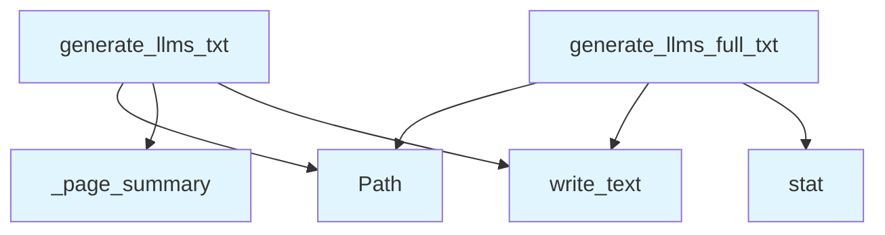

# File: `src/local_deepwiki/generators/llms_txt.py`

## File Overview

This module is responsible for generating two specific text files — `llms.txt` and `llms-full.txt` — that are designed to be consumed by LLM (Large [Language](../models/foundation.md) Model) agents for project orientation and documentation discovery.

The `llms.txt` file provides a concise, structured summary of the project's documentation pages and code statistics, following the [llmstxt.org](https://llmstxt.org) specification. The `llms-full.txt` file, on the other hand, concatenates the full content of all documentation pages with page separators, also per the llmstxt.org specification.

These files are intended to be used by LLM agents to quickly understand the structure and content of a project’s documentation, facilitating tasks like code understanding, summarization, and navigation.

## Key Concepts

### `llms.txt` Format

The `llms.txt` file is a structured, human-readable summary of the project's documentation and code statistics. It is designed to be lightweight and machine-parseable by LLMs. The format includes:

- Project title and description
- A list of documentation pages, sorted in a logical order (index, architecture, modules, files, others)
- Code statistics like total files, languages, chunks, and wiki pages

This format is useful for LLM agents to quickly get a high-level overview of the project.

### `llms-full.txt` Format

The `llms-full.txt` file is a single concatenated document containing all the project's documentation pages, separated by `---` lines. This format is useful for LLM agents that need full context or want to perform tasks like summarization or code explanation over the entire documentation set.

### Sorting Logic

The `_sort_key` function defines a logical ordering for documentation pages:

1. `index.md` (priority 0)
2. `architecture.md` (priority 1)
3. Pages under `modules/` (priority 2)
4. Pages under `files/` (priority 3)
5. All other pages (priority 4)

This prioritization ensures that the most important or foundational documentation is presented first, improving LLM orientation.

### Page Summary Extraction

The `_page_summary` function extracts a short summary from a page's content by taking the first non-heading, non-empty line. This ensures that a meaningful, concise description is provided for each page in the `llms.txt` file.

## Integration

This file is part of the `local_deepwiki` project and integrates with:

- **Models**: It uses [`WikiPage`](../export/streaming.md) and [`IndexStatus`](../models/wiki.md) models to understand the structure and metadata of the documentation and codebase.
- **Logging**: It uses [`get_logger`](../logging.md) to log the successful generation of the `llms.txt` and `llms-full.txt` files.
- **External Usage**: It is used by test functions (`test_llms_txt`) via `_sort_key` and `_page_summary`.

This module is likely used as part of a larger documentation generation pipeline, possibly integrated into CLI tools or analysis services, as suggested by related files like `src/local_deepwiki/cli/main.py` and `src/local_deepwiki/generators/wiki/pages.py`.

## Design Notes

### Why Two Formats?

The decision to generate two files (`llms.txt` and `llms-full.txt`) allows flexibility in how LLM agents consume the documentation:

- `llms.txt` is for quick overviews and metadata-driven tasks.
- `llms-full.txt` is for full-text processing and deep understanding tasks.

### Sorting Strategy

The sorting strategy in `_sort_key` is designed to guide LLM agents to the most relevant documentation first. It prioritizes foundational documents like `index.md` and `architecture.md`, followed by structured content (`modules/`, `files/`), and finally general documentation.

### Summary Extraction

The `_page_summary` function avoids using headings or separators to extract a meaningful summary, which ensures that the summary is readable and relevant. If no suitable line is found, it falls back to the page title or path, ensuring that a summary is always provided.

### Fallbacks for Project Metadata

The code includes fallback logic for project name and description:

- If a manifest is provided, it uses the project name and description from it.
- If no description is available, it falls back to the repository directory name.
- If no manifest is present, it defaults to `"Project"` and constructs a description from the repo name.

This ensures that even in minimal or edge-case environments, the LLM-friendly files are still generated with meaningful content.

### Encoding and File Output

The generated files are written with UTF-8 encoding, ensuring compatibility with international characters and consistent behavior across platforms.

### Logging

The module uses structured logging to track the generation of each file, including the number of pages and file size, which is helpful for debugging and monitoring in larger systems.

## API Reference

### Functions

#### `generate_llms_txt`

```python
def generate_llms_txt(pages: list[WikiPage], index_status: IndexStatus, wiki_path: Path, manifest: dict | None = None) -> Path
```

Generate an llms.txt file summarizing the wiki for LLM agents.


| Parameter | Type | Default | Description |
|-----------|------|---------|-------------|
| `pages` | `list[WikiPage]` | - | List of generated wiki pages. |
| `index_status` | `IndexStatus` | - | Index status with repo metadata. |
| `wiki_path` | `Path` | - | Path to the wiki output directory. |
| `manifest` | `dict | None` | `None` | Optional parsed project manifest dict (name, description, etc.). |

**Returns:** `Path`


<details>
<summary>View Source (lines 44-106) | <a href="https://github.com/UrbanDiver/local-deepwiki-mcp/blob/main/src/local_deepwiki/generators/llms_txt.py#L44-L106">GitHub</a></summary>

```python
def generate_llms_txt(
    pages: list[WikiPage],
    index_status: IndexStatus,
    wiki_path: Path,
    manifest: dict | None = None,
) -> Path:
    """Generate an llms.txt file summarizing the wiki for LLM agents.

    Args:
        pages: List of generated wiki pages.
        index_status: Index status with repo metadata.
        wiki_path: Path to the wiki output directory.
        manifest: Optional parsed project manifest dict (name, description, etc.).

    Returns:
        Path to the written llms.txt file.
    """
    # Determine project name and description
    project_name = "Project"
    description = ""

    if manifest:
        project_name = manifest.get("name", project_name)
        description = manifest.get("description", "")

    if not description:
        # Fall back to repo directory name
        repo_path = Path(index_status.repo_path)
        project_name = project_name if project_name != "Project" else repo_path.name
        description = f"Documentation for {project_name}"

    lines: list[str] = []
    lines.append(f"# {project_name}")
    lines.append(f"> {description}")
    lines.append("")

    # Documentation pages
    sorted_pages = sorted(pages, key=_sort_key)
    if sorted_pages:
        lines.append("## Documentation Pages")
        for page in sorted_pages:
            # Use title and path
            title = page.title or page.path
            lines.append(f"- [{title}]({page.path}): {_page_summary(page)}")
        lines.append("")

    # Code statistics
    lines.append("## Code Statistics")
    lines.append(f"- Files indexed: {index_status.total_files}")

    if index_status.languages:
        lang_list = ", ".join(sorted(index_status.languages.keys()))
        lines.append(f"- Languages: {lang_list}")

    lines.append(f"- Code chunks: {index_status.total_chunks}")
    lines.append(f"- Wiki pages: {len(pages)}")
    lines.append("")

    output_path = wiki_path / "llms.txt"
    output_path.write_text("\n".join(lines), encoding="utf-8")
    logger.info("Generated llms.txt at %s (%d pages)", output_path, len(pages))

    return output_path
```

</details>

#### `generate_llms_full_txt`

```python
def generate_llms_full_txt(pages: list[WikiPage], index_status: IndexStatus, wiki_path: Path, manifest: dict | None = None) -> Path
```

Generate an llms-full.txt file with full wiki content concatenated.  Per the llmstxt.org specification, llms-full.txt provides the complete documentation content in a single file, with ``---`` separators between pages.


| Parameter | Type | Default | Description |
|-----------|------|---------|-------------|
| `pages` | `list[WikiPage]` | - | List of generated wiki pages. |
| `index_status` | `IndexStatus` | - | Index status with repo metadata. |
| `wiki_path` | `Path` | - | Path to the wiki output directory. |
| `manifest` | `dict | None` | `None` | Optional parsed project manifest dict. |

**Returns:** `Path`


<details>
<summary>View Source (lines 109-152) | <a href="https://github.com/UrbanDiver/local-deepwiki-mcp/blob/main/src/local_deepwiki/generators/llms_txt.py#L109-L152">GitHub</a></summary>

```python
def generate_llms_full_txt(
    pages: list[WikiPage],
    index_status: IndexStatus,
    wiki_path: Path,
    manifest: dict | None = None,
) -> Path:
    """Generate an llms-full.txt file with full wiki content concatenated.

    Per the llmstxt.org specification, llms-full.txt provides the complete
    documentation content in a single file, with ``---`` separators between
    pages.

    Args:
        pages: List of generated wiki pages.
        index_status: Index status with repo metadata.
        wiki_path: Path to the wiki output directory.
        manifest: Optional parsed project manifest dict.

    Returns:
        Path to the written llms-full.txt file.
    """
    project_name = "Project"
    if manifest:
        project_name = manifest.get("name", project_name)
    if project_name == "Project":
        project_name = Path(index_status.repo_path).name

    parts: list[str] = [f"# {project_name} — Full Documentation\n"]

    sorted_pages = sorted(pages, key=_sort_key)
    for page in sorted_pages:
        parts.append(f"---\n\n## {page.title or page.path}\n")
        parts.append(page.content.strip())
        parts.append("")

    output_path = wiki_path / "llms-full.txt"
    output_path.write_text("\n".join(parts), encoding="utf-8")
    logger.info(
        "Generated llms-full.txt at %s (%d pages, %d bytes)",
        output_path,
        len(pages),
        output_path.stat().st_size,
    )
    return output_path
```

</details>

## Call Graph



## Used By

Functions and methods in this file and their callers:

- **`Path`**: called by `generate_llms_full_txt`, `generate_llms_txt`
- **`_page_summary`**: called by `generate_llms_txt`
- **`stat`**: called by `generate_llms_full_txt`
- **`write_text`**: called by `generate_llms_full_txt`, `generate_llms_txt`

## Usage Examples

*Examples extracted from test files*

### Example: `llms_txt`

From `test_llms_txt.py::TestGenerateLlmsTxt::test_basic_output`:

```python
wiki_path = tmp_path / ".deepwiki"
        wiki_path.mkdir()

        pages = [
            _make_page("index.md", "My Project"),
            _make_page("modules/core.md", "Core Module"),
        ]
        index_status = _make_index_status()

        result = generate_llms_txt(pages, index_status, wiki_path)

        assert result == wiki_path / "llms.txt"
        assert result.exists()

        content = result.read_text()
        assert content.startswith("# ")
        assert "## Documentation Pages" in content
        assert "## Code Statistics" in content
        assert "Files indexed: 10" in content
        assert "Wiki pages: 2" in content
```

### Example: `generate_llms_txt`

From `test_llms_txt.py::TestGenerateLlmsTxt::test_basic_output`:

```python
wiki_path = tmp_path / ".deepwiki"
        wiki_path.mkdir()

        pages = [
            _make_page("index.md", "My Project"),
            _make_page("modules/core.md", "Core Module"),
        ]
        index_status = _make_index_status()

        result = generate_llms_txt(pages, index_status, wiki_path)

        assert result == wiki_path / "llms.txt"
        assert result.exists()

        content = result.read_text()
        assert content.startswith("# ")
        assert "## Documentation Pages" in content
        assert "## Code Statistics" in content
        assert "Files indexed: 10" in content
        assert "Wiki pages: 2" in content
```

### Example: `generate_llms_txt`

From `test_llms_txt.py::TestGenerateLlmsTxt::test_with_manifest`:

```python
result = generate_llms_txt(pages, index_status, wiki_path, manifest=manifest)
content = result.read_text()

assert "# awesome-project" in content
assert "> An awesome project" in content
```

### Example: `_sort_key`

From `test_llms_txt.py::TestSortKey::test_index_first`:

```python
page = _make_page("index.md", "Index")
        assert _sort_key(page) == (0, "index.md")
```

### Example: `_sort_key`

From `test_llms_txt.py::TestSortKey::test_architecture_second`:

```python
page = _make_page("architecture.md", "Arch")
        assert _sort_key(page) == (1, "architecture.md")
```


## Last Modified

| Entity | Type | Author | Date | Commit |
|--------|------|--------|------|--------|
| `generate_llms_full_txt` | function | Brian Breidenbach | Feb 14, 2026 | `2732638` feat: agent UX improvements... |
| `_sort_key` | function | Brian Breidenbach | Feb 12, 2026 | `df695d3` feat: add MCP Resources, ag... |
| `generate_llms_txt` | function | Brian Breidenbach | Feb 12, 2026 | `df695d3` feat: add MCP Resources, ag... |
| `_page_summary` | function | Brian Breidenbach | Feb 12, 2026 | `df695d3` feat: add MCP Resources, ag... |

## Additional Source Code

Source code for functions and methods not listed in the API Reference above.

#### `_sort_key`

<details>
<summary>View Source (lines 23-41) | <a href="https://github.com/UrbanDiver/local-deepwiki-mcp/blob/main/src/local_deepwiki/generators/llms_txt.py#L23-L41">GitHub</a></summary>

```python
def _sort_key(page: WikiPage) -> tuple[int, str]:
    """Sort pages: index first, architecture, then modules/, files/, rest.

    Args:
        page: A wiki page.

    Returns:
        Tuple for sort ordering.
    """
    path = page.path
    if path == "index.md":
        return (0, path)
    if path == "architecture.md":
        return (1, path)
    if path.startswith("modules/"):
        return (2, path)
    if path.startswith("files/"):
        return (3, path)
    return (4, path)
```

</details>


#### `_page_summary`

<details>
<summary>View Source (lines 155-173) | <a href="https://github.com/UrbanDiver/local-deepwiki-mcp/blob/main/src/local_deepwiki/generators/llms_txt.py#L155-L173">GitHub</a></summary>

```python
def _page_summary(page: WikiPage) -> str:
    """Extract a brief summary from a page's content.

    Takes the first non-heading, non-empty line as a summary.

    Args:
        page: The wiki page.

    Returns:
        A short summary string.
    """
    for line in page.content.split("\n"):
        stripped = line.strip()
        if stripped and not stripped.startswith("#") and not stripped.startswith("---"):
            # Truncate to reasonable length
            if len(stripped) > 120:
                return stripped[:117] + "..."
            return stripped
    return page.title or page.path
```

</details>

## Relevant Source Files

- `src/local_deepwiki/generators/llms_txt.py:23-41`
