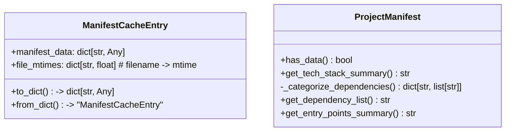

# manifest.py

## File Overview

The manifest module provides functionality for parsing and caching project metadata from various package manifest files. It supports multiple languages and build systems, extracting information like project name, version, dependencies, and other metadata. The module includes intelligent caching to avoid re-parsing when manifest files haven't changed.

## Classes

### ManifestCacheEntry

A dataclass that stores cached manifest data along with file modification times for cache validation.

**Attributes:**
- `manifest_data`: Dictionary containing the parsed manifest information
- `file_mtimes`: Dictionary mapping filename to modification time for cache validation

**Methods:**
- `to_dict()`: Converts the cache entry to a dictionary for JSON serialization
- `from_dict(data)`: Class method that creates a ManifestCacheEntry from a dictionary

### ProjectManifest

The [main](../export/html.md) class representing parsed project metadata from various manifest files.

**Attributes:**
Based on the code shown, this class contains fields for project information like name, version, description, language, dependencies, and other metadata.

**Methods:**
- `has_data()`: Checks if the manifest contains any meaningful data
- `get_tech_stack_summary()`: Returns a summary of the technology stack
- `_categorize_dependencies()`: Internal method for categorizing dependencies
- `get_dependency_list()`: Returns a list of dependencies
- `get_entry_points_summary()`: Returns a summary of entry points

## Functions

### Cache Management

#### `get_cached_manifest(repo_path, cache_dir=None)`

Gets project manifest using cache if available and valid. This is the recommended entry point for manifest parsing as it provides caching benefits.

**Parameters:**
- `repo_path`: Path to the repository root
- `cache_dir`: Optional directory for cache storage (defaults to `repo_path/.deepwiki`)

**Returns:**
- ProjectManifest with extracted metadata

#### `_load_manifest_cache(cache_path)`

Loads manifest cache from disk.

**Parameters:**
- `cache_path`: Path to the cache file

**Returns:**
- ManifestCacheEntry or None if not found/invalid

#### `_save_manifest_cache(cache_path, entry)`

Saves manifest cache to disk.

**Parameters:**
- `cache_path`: Path to the cache file
- `entry`: The ManifestCacheEntry to save

#### `_is_cache_valid(cache_entry, current_mtimes)`

Checks if cached manifest is still valid by comparing file modification times.

**Parameters:**
- `cache_entry`: The cached manifest entry
- `current_mtimes`: Current modification times of manifest files

**Returns:**
- True if cache is valid, False if any file has changed

#### `_get_manifest_mtimes(repo_path)`

Gets modification times for all manifest files.

**Parameters:**
- `repo_path`: Path to the repository root

**Returns:**
- Dictionary mapping filename to modification time (0 if file doesn't exist)

### Manifest Parsing

#### `parse_manifest(repo_path)`

Parses all recognized package manifests in a repository. For incremental updates, prefer `get_cached_manifest()` which avoids re-parsing when manifest files haven't changed.

**Parameters:**
- `repo_path`: Path to the repository root

**Returns:**
- ProjectManifest with extracted metadata

### Format-Specific Parsers

#### `_parse_pyproject_toml(filepath, manifest)`

Parses `pyproject.toml` files for Python projects.

**Parameters:**
- `filepath`: Path to the pyproject.toml file
- `manifest`: ProjectManifest instance to populate

#### `_parse_setup_py(filepath, manifest)`

Parses legacy `setup.py` files for Python projects.

**Parameters:**
- `filepath`: Path to the setup.py file
- `manifest`: ProjectManifest instance to populate

#### `_parse_requirements_txt(filepath, manifest)`

Parses `requirements.txt` files for Python dependencies.

**Parameters:**
- `filepath`: Path to the requirements.txt file
- `manifest`: ProjectManifest instance to populate

#### `_parse_build_gradle(filepath, manifest)`

Parses `build.gradle` files for Java/Kotlin Gradle projects.

**Parameters:**
- `filepath`: Path to the build.gradle file
- `manifest`: ProjectManifest instance to populate

### Utility Functions

#### `_manifest_to_dict(manifest)`

Converts ProjectManifest to dictionary for caching.

**Parameters:**
- `manifest`: ProjectManifest instance to convert

**Returns:**
- Dictionary representation of the manifest

#### `_manifest_from_dict(data)`

Creates ProjectManifest from dictionary.

**Parameters:**
- `data`: Dictionary containing manifest data

**Returns:**
- ProjectManifest instance

#### `_parse_python_dep(line)`

Parses a Python dependency line (referenced in `_parse_requirements_txt`).

**Parameters:**
- `line`: Dependency specification line

**Returns:**
- Tuple of (name, version)

## Usage Examples

### Basic Manifest Parsing

```python
from pathlib import Path
from local_deepwiki.generators.manifest import get_cached_manifest

# Parse project manifest with caching
repo_path = Path("/path/to/project")
manifest = get_cached_manifest(repo_path)

# Access manifest data
print(f"Project: {manifest.name}")
print(f"Version: {manifest.version}")
print(f"Language: {manifest.language}")
```

### Cache Management

```python
from pathlib import Path
from local_deepwiki.generators.manifest import parse_manifest

# Parse without caching (always fresh)
repo_path = Path("/path/to/project")
manifest = parse_manifest(repo_path)
```

### Working with Cache Entries

```python
from local_deepwiki.generators.manifest import ManifestCacheEntry

# Create cache entry
entry = ManifestCacheEntry(
    manifest_data={"name": "example", "version": "1.0.0"},
    file_mtimes={"pyproject.toml": 1234567890.0}
)

# Serialize for storage
cache_dict = entry.to_dict()

# Deserialize from storage
restored_entry = ManifestCacheEntry.from_dict(cache_dict)
```

## Related Components

The module integrates with:
- `local_deepwiki.logging` for logging functionality
- JSON for cache serialization
- `tomllib`/`tomli` for TOML parsing
- Standard library modules like `pathlib`, `re`, and `dataclasses`

The parsed ProjectManifest objects are likely used by other components in the deepwiki system for generating documentation and understanding project structure.

## API Reference

### class `ManifestCacheEntry`

Cache entry storing manifest data and file modification times.

**Methods:**

#### `to_dict`

```python
def to_dict() -> dict[str, Any]
```

Convert to dictionary for JSON serialization.

#### `from_dict`

```python
def from_dict(data: dict[str, Any]) -> "ManifestCacheEntry"
```

Create from dictionary.


| [Parameter](api_docs.md) | Type | Default | Description |
|-----------|------|---------|-------------|
| `data` | `dict[str, Any]` | - | - |


### class `ProjectManifest`

Extracted project metadata from package manifests.

**Methods:**

#### `has_data`

```python
def has_data() -> bool
```

Check if any meaningful data was extracted.

#### `get_tech_stack_summary`

```python
def get_tech_stack_summary() -> str
```

Generate a factual tech stack summary.

#### `get_dependency_list`

```python
def get_dependency_list() -> str
```

Get a formatted list of all dependencies.

#### `get_entry_points_summary`

```python
def get_entry_points_summary() -> str
```

Get a summary of entry points and scripts.


---

### Functions

#### `get_cached_manifest`

```python
def get_cached_manifest(repo_path: Path, cache_dir: Path | None = None) -> ProjectManifest
```

Get project manifest, using cache if available and valid.  This function checks if a cached manifest exists and is still valid (no manifest files have been modified). If valid, returns cached data. Otherwise, parses fresh and updates the cache.


| [Parameter](api_docs.md) | Type | Default | Description |
|-----------|------|---------|-------------|
| `repo_path` | `Path` | - | Path to the repository root. |
| `cache_dir` | `Path | None` | `None` | Directory for cache storage (defaults to repo_path/.deepwiki). |

**Returns:** `ProjectManifest`


#### `parse_manifest`

```python
def parse_manifest(repo_path: Path) -> ProjectManifest
```

Parse all recognized package manifests in a repository.  Note: For incremental updates, prefer get_cached_manifest() which avoids re-parsing when manifest files haven't changed.


| [Parameter](api_docs.md) | Type | Default | Description |
|-----------|------|---------|-------------|
| `repo_path` | `Path` | - | Path to the repository root. |

**Returns:** `ProjectManifest`


#### `find`

```python
def find(path: str) -> Any
```


| [Parameter](api_docs.md) | Type | Default | Description |
|-----------|------|---------|-------------|
| `path` | `str` | - | - |

**Returns:** `Any`


#### `get_directory_tree`

```python
def get_directory_tree(repo_path: Path, max_depth: int = 3, max_items: int = 50) -> str
```

Generate a directory tree structure for the repository.


| [Parameter](api_docs.md) | Type | Default | Description |
|-----------|------|---------|-------------|
| `repo_path` | `Path` | - | Path to repository root. |
| `max_depth` | `int` | `3` | Maximum depth to traverse. |
| `max_items` | `int` | `50` | Maximum total items to include. |

**Returns:** `str`


#### `should_skip`

```python
def should_skip(name: str) -> bool
```


| [Parameter](api_docs.md) | Type | Default | Description |
|-----------|------|---------|-------------|
| `name` | `str` | - | - |

**Returns:** `bool`


#### `traverse`

```python
def traverse(path: Path, prefix: str, depth: int) -> None
```


| [Parameter](api_docs.md) | Type | Default | Description |
|-----------|------|---------|-------------|
| `path` | `Path` | - | - |
| `prefix` | `str` | - | - |
| `depth` | `int` | - | - |

**Returns:** `None`


## Class Diagram



## Call Graph

```mermaid
flowchart TD
    N0[ProjectManifest]
    N1[_get_manifest_mtimes]
    N2[_load_manifest_cache]
    N3[_manifest_from_dict]
    N4[_parse_build_gradle]
    N5[_parse_cargo_toml]
    N6[_parse_gemfile]
    N7[_parse_go_mod]
    N8[_parse_package_json]
    N9[_parse_pom_xml]
    N10[_parse_pyproject_toml]
    N11[_parse_python_dep]
    N12[_parse_requirements_txt]
    N13[_parse_setup_py]
    N14[_save_manifest_cache]
    N15[compile]
    N16[exists]
    N17[finditer]
    N18[get_cached_manifest]
    N19[get_directory_tree]
    N20[group]
    N21[is_file]
    N22[iterdir]
    N23[loads]
    N24[parse_manifest]
    N25[read_text]
    N26[search]
    N27[should_skip]
    N28[splitlines]
    N29[traverse]
    N1 --> N16
    N2 --> N16
    N3 --> N0
    N18 --> N1
    N18 --> N2
    N18 --> N3
    N18 --> N24
    N18 --> N14
    N24 --> N0
    N24 --> N16
    N10 --> N25
    N10 --> N23
    N10 --> N11
    N11 --> N20
    N13 --> N25
    N13 --> N26
    N13 --> N20
    N13 --> N17
    N13 --> N11
    N12 --> N25
    N12 --> N28
    N12 --> N11
    N8 --> N25
    N8 --> N23
    N5 --> N25
    N5 --> N23
    N7 --> N25
    N7 --> N26
    N7 --> N20
    N7 --> N28
    N4 --> N25
    N4 --> N15
    N4 --> N17
    N4 --> N20
    N6 --> N25
    N6 --> N15
    N6 --> N17
    N6 --> N20
    N19 --> N22
    N19 --> N21
    N19 --> N27
    N19 --> N29
    N29 --> N22
    N29 --> N21
    N29 --> N27
    N29 --> N29
    classDef func fill:#e1f5fe
    class N0,N1,N2,N3,N4,N5,N6,N7,N8,N9,N10,N11,N12,N13,N14,N15,N16,N17,N18,N19,N20,N21,N22,N23,N24,N25,N26,N27,N28,N29 func
```



## Usage Examples

*Examples extracted from test files*

### Empty manifest has no data

From `test_manifest.py::test_has_data_empty`:

```python
manifest = ProjectManifest()
assert not manifest.has_data()
```

### Empty manifest has no data

From `test_manifest.py::test_has_data_empty`:

```python
manifest = ProjectManifest()
assert not manifest.has_data()
```

### Empty manifest has no data

From `test_manifest.py::test_has_data_empty`:

```python
assert not manifest.has_data()
```

### Manifest with name has data

From `test_manifest.py::test_has_data_with_name`:

```python
manifest = ProjectManifest(name="test-project")
assert manifest.has_data()
```

### Manifest with name has data

From `test_manifest.py::test_has_data_with_name`:

```python
manifest = ProjectManifest(name="test-project")
assert manifest.has_data()
```

## Relevant Source Files

- `src/local_deepwiki/generators/manifest.py:33-52`

## See Also

- [wiki](wiki.md) - uses this
- [test_manifest](../../../tests/test_manifest.md) - uses this
