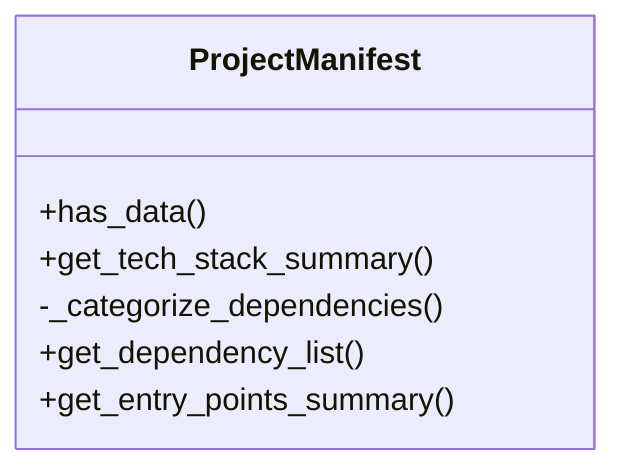

# File Overview

This file, `src/local_deepwiki/generators/manifest.py`, provides functionality to parse various package manifest files from different programming languages. It extracts metadata such as project name, version, dependencies, and language information from files like `pyproject.toml`, `setup.py`, `package.json`, `Cargo.toml`, `go.mod`, `pom.xml`, and others.

The [main](../web/app.md) entry point is the `parse_manifest` function which tries different parsers in order of preference to extract project information.

# Classes

## ProjectManifest

The `ProjectManifest` class represents the parsed metadata from a project's manifest files.

### Methods

#### has_data

```python
def has_data(self) -> bool:
```

Check if any meaningful data was extracted.

#### get_tech_stack_summary

```python
def get_tech_stack_summary(self) -> str:
```

Generate a factual tech stack summary.

#### _categorize_dependencies

```python
def _categorize_dependencies(self) -> dict[str, list[str]]:
```

Categorize dependencies into groups (e.g., framework, database, testing).

#### get_dependency_list

```python
def get_dependency_list(self) -> list[tuple[str, str]]:
```

Get a list of all dependencies as (name, version) tuples.

#### get_entry_points_summary

```python
def get_entry_points_summary(self) -> str:
```

Generate a summary of entry points.

# Functions

## parse_manifest

```python
def parse_manifest(repo_path: Path) -> ProjectManifest:
```

Parse all recognized package manifests in a repository.

**Parameters:**

- `repo_path`: Path to the repository root.

**Returns:**

- `ProjectManifest` with extracted metadata.

## _parse_pyproject_toml

```python
def _parse_pyproject_toml(filepath: Path, manifest: ProjectManifest) -> None:
```

Parse `pyproject.toml` (Python).

**Parameters:**

- `filepath`: Path to the `pyproject.toml` file.
- `manifest`: The `ProjectManifest` object to populate.

## _parse_setup_py

```python
def _parse_setup_py(filepath: Path, manifest: ProjectManifest) -> None:
```

Parse `setup.py` (Python legacy).

**Parameters:**

- `filepath`: Path to the `setup.py` file.
- `manifest`: The `ProjectManifest` object to populate.

## _parse_requirements_txt

```python
def _parse_requirements_txt(filepath: Path, manifest: ProjectManifest) -> None:
```

Parse `requirements.txt` (Python).

**Parameters:**

- `filepath`: Path to the `requirements.txt` file.
- `manifest`: The `ProjectManifest` object to populate.

## _parse_package_json

```python
def _parse_package_json(filepath: Path, manifest: ProjectManifest) -> None:
```

Parse `package.json` (Node.js).

**Parameters:**

- `filepath`: Path to the `package.json` file.
- `manifest`: The `ProjectManifest` object to populate.

## _parse_cargo_toml

```python
def _parse_cargo_toml(filepath: Path, manifest: ProjectManifest) -> None:
```

Parse `Cargo.toml` (Rust).

**Parameters:**

- `filepath`: Path to the `Cargo.toml` file.
- `manifest`: The `ProjectManifest` object to populate.

## _parse_go_mod

```python
def _parse_go_mod(filepath: Path, manifest: ProjectManifest) -> None:
```

Parse `go.mod` (Go).

**Parameters:**

- `filepath`: Path to the `go.mod` file.
- `manifest`: The `ProjectManifest` object to populate.

## _parse_pom_xml

```python
def _parse_pom_xml(filepath: Path, manifest: ProjectManifest) -> None:
```

Parse `pom.xml` (Java/Maven).

**Parameters:**

- `filepath`: Path to the `pom.xml` file.
- `manifest`: The `ProjectManifest` object to populate.

## _parse_build_gradle

```python
def _parse_build_gradle(filepath: Path, manifest: ProjectManifest) -> None:
```

Parse `build.gradle` (Java/Kotlin Gradle).

**Parameters:**

- `filepath`: Path to the `build.gradle` file.
- `manifest`: The `ProjectManifest` object to populate.

## _parse_gemfile

```python
def _parse_gemfile(filepath: Path, manifest: ProjectManifest) -> None:
```

Parse `Gemfile` (Ruby).

**Parameters:**

- `filepath`: Path to the `Gemfile` file.
- `manifest`: The `ProjectManifest` object to populate.

## _parse_python_dep

```python
def _parse_python_dep(line: str) -> tuple[str, str]:
```

Parse a line from a Python dependency file.

**Parameters:**

- `line`: A line from a requirements file.

**Returns:**

- Tuple of (dependency name, version).

## find

```python
def find(path: str) -> Any:
```

Helper function to find elements in XML.

**Parameters:**

- `path`: XPath-like path to find.

**Returns:**

- The found element or None.

## get_directory_tree

```python
def get_directory_tree(repo_path: Path) -> list[dict]:
```

Get directory tree structure.

**Parameters:**

- `repo_path`: Path to the repository root.

**Returns:**

- List of dictionaries representing the directory structure.

## should_skip

```python
def should_skip(filepath: Path) -> bool:
```

Check if a file should be skipped.

**Parameters:**

- `filepath`: Path to the file.

**Returns:**

- True if the file should be skipped, False otherwise.

## traverse

```python
def traverse(repo_path: Path, callback: callable) -> None:
```

Traverse the repository and apply a callback to each file.

**Parameters:**

- `repo_path`: Path to the repository root.
- `callback`: Function to call for each file.

# Usage Examples

### Parse a Repository

```python
from pathlib import Path
from manifest import parse_manifest

repo_path = Path("/path/to/repo")
manifest = parse_manifest(repo_path)
print(manifest.get_tech_stack_summary())
```

### Get Dependency List

```python
from pathlib import Path
from manifest import parse_manifest

repo_path = Path("/path/to/repo")
manifest = parse_manifest(repo_path)
deps = manifest.get_dependency_list()
for name, version in deps:
    print(f"{name}: {version}")
```

# Related Components

This file works with:

- `pathlib.Path` for file system operations
- `json` and `tomllib`/`tomli` for parsing structured data
- `xml.etree.ElementTree` for parsing XML files like `pom.xml`
- Regular expressions for pattern matching in text files
- The `ProjectManifest` class for representing parsed data

## API Reference

### class `ProjectManifest`

Extracted project metadata from package manifests.

**Methods:**

#### `has_data`

```python
def has_data() -> bool
```

Check if any meaningful data was extracted.

#### `get_tech_stack_summary`

```python
def get_tech_stack_summary() -> str
```

Generate a factual tech stack summary.

#### `get_dependency_list`

```python
def get_dependency_list() -> str
```

Get a formatted list of all dependencies.

#### `get_entry_points_summary`

```python
def get_entry_points_summary() -> str
```

Get a summary of entry points and scripts.


---

### Functions

#### `parse_manifest`

```python
def parse_manifest(repo_path: Path) -> ProjectManifest
```

Parse all recognized package manifests in a repository.


| [Parameter](api_docs.md) | Type | Default | Description |
|-----------|------|---------|-------------|
| `repo_path` | `Path` | - | Path to the repository root. |

**Returns:** `ProjectManifest`


#### `find`

```python
def find(path: str) -> Any
```


| [Parameter](api_docs.md) | Type | Default | Description |
|-----------|------|---------|-------------|
| `path` | `str` | - | - |

**Returns:** `Any`


#### `get_directory_tree`

```python
def get_directory_tree(repo_path: Path, max_depth: int = 3, max_items: int = 50) -> str
```

Generate a directory tree structure for the repository.


| [Parameter](api_docs.md) | Type | Default | Description |
|-----------|------|---------|-------------|
| `repo_path` | `Path` | - | Path to repository root. |
| `max_depth` | `int` | `3` | Maximum depth to traverse. |
| `max_items` | `int` | `50` | Maximum total items to include. |

**Returns:** `str`


#### `should_skip`

```python
def should_skip(name: str) -> bool
```


| [Parameter](api_docs.md) | Type | Default | Description |
|-----------|------|---------|-------------|
| `name` | `str` | - | - |

**Returns:** `bool`


#### `traverse`

```python
def traverse(path: Path, prefix: str, depth: int) -> None
```


| [Parameter](api_docs.md) | Type | Default | Description |
|-----------|------|---------|-------------|
| `path` | `Path` | - | - |
| `prefix` | `str` | - | - |
| `depth` | `int` | - | - |

**Returns:** `None`


## Class Diagram



## Call Graph

```mermaid
flowchart TD
    N0[ProjectManifest]
    N1[_parse_build_gradle]
    N2[_parse_cargo_toml]
    N3[_parse_gemfile]
    N4[_parse_go_mod]
    N5[_parse_package_json]
    N6[_parse_pom_xml]
    N7[_parse_pyproject_toml]
    N8[_parse_python_dep]
    N9[_parse_requirements_txt]
    N10[_parse_setup_py]
    N11[compile]
    N12[exists]
    N13[finditer]
    N14[get_directory_tree]
    N15[getroot]
    N16[group]
    N17[is_dir]
    N18[is_file]
    N19[iterdir]
    N20[loads]
    N21[match]
    N22[parse]
    N23[parse_manifest]
    N24[parser]
    N25[read_text]
    N26[search]
    N27[should_skip]
    N28[splitlines]
    N29[traverse]
    N23 --> N0
    N23 --> N12
    N23 --> N24
    N7 --> N25
    N7 --> N20
    N7 --> N8
    N8 --> N21
    N8 --> N16
    N10 --> N25
    N10 --> N26
    N10 --> N16
    N10 --> N13
    N10 --> N8
    N9 --> N25
    N9 --> N28
    N9 --> N8
    N5 --> N25
    N5 --> N20
    N2 --> N25
    N2 --> N20
    N4 --> N25
    N4 --> N26
    N4 --> N16
    N4 --> N28
    N6 --> N22
    N6 --> N15
    N1 --> N25
    N1 --> N11
    N1 --> N13
    N1 --> N16
    N3 --> N25
    N3 --> N11
    N3 --> N13
    N3 --> N16
    N14 --> N19
    N14 --> N18
    N14 --> N27
    N14 --> N17
    N14 --> N29
    N29 --> N19
    N29 --> N18
    N29 --> N27
    N29 --> N17
    N29 --> N29
    classDef func fill:#e1f5fe
    class N0,N1,N2,N3,N4,N5,N6,N7,N8,N9,N10,N11,N12,N13,N14,N15,N16,N17,N18,N19,N20,N21,N22,N23,N24,N25,N26,N27,N28,N29 func
```



## Relevant Source Files

- `src/local_deepwiki/generators/manifest.py`

## See Also

- [wiki](wiki.md) - uses this
- [crosslinks](crosslinks.md) - shares 3 dependencies
