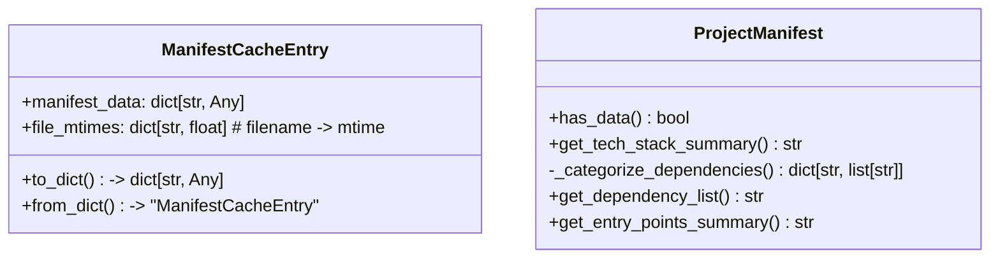

# Manifest Parser Module

The manifest module provides functionality for parsing and caching project manifest files from various package managers and build systems. It extracts metadata like project name, version, dependencies, and other configuration details from files such as `pyproject.toml`, `setup.py`, `package.json`, and `build.gradle`.

## Classes

### ProjectManifest

A dataclass that stores extracted project metadata from manifest files.

**Key Attributes:**
- `name`: Project name
- `version`: Project version
- `description`: Project description
- `language`: Programming language
- `language_version`: Version of the programming language
- `dependencies`: Runtime dependencies dictionary
- `dev_dependencies`: Development dependencies dictionary
- `entry_points`: Entry points configuration
- `scripts`: Available scripts
- `repository`: Repository URL
- `license`: License information

**Key Methods:**
- `has_data()`: Check if manifest contains any data
- `get_tech_stack_summary()`: Get summary of technology stack
- `get_dependency_list()`: Get list of dependencies
- `get_entry_points_summary()`: Get summary of entry points

### ManifestCacheEntry

A dataclass for storing cached manifest data along with file modification times to enable cache validation.

**Attributes:**
- `manifest_data`: Dictionary containing the manifest data
- `file_mtimes`: Dictionary mapping filenames to modification times

**Methods:**
- `to_dict()`: Convert to dictionary for JSON serialization
- `from_dict(data)`: Create instance from dictionary (class method)

## Functions

### Core Functions

#### `parse_manifest(repo_path: Path) -> ProjectManifest`

Parse all recognized package manifests in a repository without using cache.

**Parameters:**
- `repo_path`: Path to the repository root

**Returns:**
- ProjectManifest with extracted metadata

#### `get_cached_manifest(repo_path: Path, cache_dir: Path | None = None) -> ProjectManifest`

Get project manifest using cache if available and valid. Checks if cached manifest exists and is still valid by comparing file modification times.

**Parameters:**
- `repo_path`: Path to the repository root
- `cache_dir`: Directory for cache storage (defaults to `repo_path/.deepwiki`)

**Returns:**
- ProjectManifest with extracted metadata

### Cache Management Functions

#### `_load_manifest_cache(cache_path: Path) -> ManifestCacheEntry | None`

Load manifest cache from disk.

**Parameters:**
- `cache_path`: Path to the cache file

**Returns:**
- ManifestCacheEntry or None if not found/invalid

#### `_save_manifest_cache(cache_path: Path, entry: ManifestCacheEntry) -> None`

Save manifest cache to disk.

**Parameters:**
- `cache_path`: Path to the cache file
- `entry`: The cache entry to save

#### `_is_cache_valid(cache_entry: ManifestCacheEntry, current_mtimes: dict[str, float]) -> bool`

Check if cached manifest is still valid by comparing file modification times.

**Parameters:**
- `cache_entry`: The cached manifest entry
- `current_mtimes`: Current modification times of manifest files

**Returns:**
- True if cache is valid, False if any file has changed

#### `_get_manifest_mtimes(repo_path: Path) -> dict[str, float]`

Get modification times for all manifest files.

**Parameters:**
- `repo_path`: Path to the repository root

**Returns:**
- Dictionary mapping filename to modification time (0 if file doesn't exist)

### Data Conversion Functions

#### `_manifest_to_dict(manifest: ProjectManifest) -> dict[str, Any]`

Convert ProjectManifest to dictionary for caching.

**Parameters:**
- `manifest`: ProjectManifest instance to convert

**Returns:**
- Dictionary representation of the manifest

#### `_manifest_from_dict(data: dict[str, Any]) -> ProjectManifest`

Create ProjectManifest from dictionary.

**Parameters:**
- `data`: Dictionary containing manifest data

**Returns:**
- ProjectManifest instance

### Parser Functions

#### `_parse_pyproject_toml(filepath: Path, manifest: ProjectManifest) -> None`

Parse `pyproject.toml` file for Python projects. Extracts project metadata including name, version, description, and dependencies.

#### `_parse_setup_py(filepath: Path, manifest: ProjectManifest) -> None`

Parse legacy `setup.py` file for Python projects using regex patterns to extract metadata.

#### `_parse_requirements_txt(filepath: Path, manifest: ProjectManifest) -> None`

Parse `requirements.txt` file for Python dependencies.

#### `_parse_build_gradle(filepath: Path, manifest: ProjectManifest) -> None`

Parse `build.gradle` files for Java/Kotlin Gradle projects. Detects language based on content and file extension.

## Usage Examples

### Basic Manifest Parsing

```python
from pathlib import Path
from local_deepwiki.generators.manifest import parse_manifest

# Parse manifest files directly
repo_path = Path("/path/to/repository")
manifest = parse_manifest(repo_path)

print(f"Project: {manifest.name}")
print(f"Version: {manifest.version}")
print(f"Language: {manifest.language}")
```

### Using Cached Manifest

```python
from pathlib import Path
from local_deepwiki.generators.manifest import get_cached_manifest

# Use cached parsing for better performance
repo_path = Path("/path/to/repository")
manifest = get_cached_manifest(repo_path)

# Check if manifest has data
if manifest.has_data():
    print("Found project metadata")
    dependencies = manifest.get_dependency_list()
    print(f"Dependencies: {dependencies}")
```

### Working with Cache Entries

```python
from pathlib import Path
from local_deepwiki.generators.manifest import ManifestCacheEntry, _manifest_to_dict

# Create cache entry
manifest_dict = _manifest_to_dict(manifest)
file_mtimes = {"pyproject.toml": 1234567890.0}
cache_entry = ManifestCacheEntry(
    manifest_data=manifest_dict,
    file_mtimes=file_mtimes
)

# Serialize for storage
cache_dict = cache_entry.to_dict()
```

## Related Components

This module works with:
- **Logger**: Uses `get_logger` from `local_deepwiki.logging` for debug and warning messages
- **File System**: Extensively uses `pathlib.Path` for file operations
- **JSON**: Uses standard `json` module for cache serialization
- **TOML Libraries**: Uses `tomllib` (Python 3.11+) or `tomli` fallback for parsing TOML files

The module supports multiple manifest file formats and provides efficient caching to avoid re-parsing unchanged files during incremental operations.

## API Reference

### class `ManifestCacheEntry`

Cache entry storing manifest data and file modification times.

**Methods:**

#### `to_dict`

```python
def to_dict() -> dict[str, Any]
```

Convert to dictionary for JSON serialization.

#### `from_dict`

```python
def from_dict(data: dict[str, Any]) -> "ManifestCacheEntry"
```

Create from dictionary.


| Parameter | Type | Default | Description |
|-----------|------|---------|-------------|
| `data` | `dict[str, Any]` | - | - |


### class `ProjectManifest`

Extracted project metadata from package manifests.

**Methods:**

#### `has_data`

```python
def has_data() -> bool
```

Check if any meaningful data was extracted.

#### `get_tech_stack_summary`

```python
def get_tech_stack_summary() -> str
```

Generate a factual tech stack summary.

#### `get_dependency_list`

```python
def get_dependency_list() -> str
```

Get a formatted list of all dependencies.

#### `get_entry_points_summary`

```python
def get_entry_points_summary() -> str
```

Get a summary of entry points and scripts.


---

### Functions

#### `get_cached_manifest`

```python
def get_cached_manifest(repo_path: Path, cache_dir: Path | None = None) -> ProjectManifest
```

Get project manifest, using cache if available and valid.  This function checks if a cached manifest exists and is still valid (no manifest files have been modified). If valid, returns cached data. Otherwise, parses fresh and updates the cache.


| Parameter | Type | Default | Description |
|-----------|------|---------|-------------|
| `repo_path` | `Path` | - | Path to the repository root. |
| `cache_dir` | `Path | None` | `None` | Directory for cache storage (defaults to repo_path/.deepwiki). |

**Returns:** `ProjectManifest`


#### `parse_manifest`

```python
def parse_manifest(repo_path: Path) -> ProjectManifest
```

Parse all recognized package manifests in a repository.  Note: For incremental updates, prefer get_cached_manifest() which avoids re-parsing when manifest files haven't changed.


| Parameter | Type | Default | Description |
|-----------|------|---------|-------------|
| `repo_path` | `Path` | - | Path to the repository root. |

**Returns:** `ProjectManifest`


#### `find`

```python
def find(path: str) -> Any
```


| Parameter | Type | Default | Description |
|-----------|------|---------|-------------|
| `path` | `str` | - | - |

**Returns:** `Any`


#### `get_directory_tree`

```python
def get_directory_tree(repo_path: Path, max_depth: int = 3, max_items: int = 50) -> str
```

Generate a directory tree structure for the repository.


| Parameter | Type | Default | Description |
|-----------|------|---------|-------------|
| `repo_path` | `Path` | - | Path to repository root. |
| `max_depth` | `int` | `3` | Maximum depth to traverse. |
| `max_items` | `int` | `50` | Maximum total items to include. |

**Returns:** `str`


#### `should_skip`

```python
def should_skip(name: str) -> bool
```


| Parameter | Type | Default | Description |
|-----------|------|---------|-------------|
| `name` | `str` | - | - |

**Returns:** `bool`


#### `traverse`

```python
def traverse(path: Path, prefix: str, depth: int) -> None
```


| Parameter | Type | Default | Description |
|-----------|------|---------|-------------|
| `path` | `Path` | - | - |
| `prefix` | `str` | - | - |
| `depth` | `int` | - | - |

**Returns:** `None`


## Class Diagram



## Call Graph

```mermaid
flowchart TD
    N0[ProjectManifest]
    N1[_get_manifest_mtimes]
    N2[_load_manifest_cache]
    N3[_manifest_from_dict]
    N4[_parse_build_gradle]
    N5[_parse_cargo_toml]
    N6[_parse_gemfile]
    N7[_parse_go_mod]
    N8[_parse_package_json]
    N9[_parse_pom_xml]
    N10[_parse_pyproject_toml]
    N11[_parse_python_dep]
    N12[_parse_requirements_txt]
    N13[_parse_setup_py]
    N14[_save_manifest_cache]
    N15[compile]
    N16[exists]
    N17[finditer]
    N18[get_cached_manifest]
    N19[get_directory_tree]
    N20[group]
    N21[is_file]
    N22[iterdir]
    N23[loads]
    N24[parse_manifest]
    N25[read_text]
    N26[search]
    N27[should_skip]
    N28[splitlines]
    N29[traverse]
    N1 --> N16
    N2 --> N16
    N3 --> N0
    N18 --> N1
    N18 --> N2
    N18 --> N3
    N18 --> N24
    N18 --> N14
    N24 --> N0
    N24 --> N16
    N10 --> N25
    N10 --> N23
    N10 --> N11
    N11 --> N20
    N13 --> N25
    N13 --> N26
    N13 --> N20
    N13 --> N17
    N13 --> N11
    N12 --> N25
    N12 --> N28
    N12 --> N11
    N8 --> N25
    N8 --> N23
    N5 --> N25
    N5 --> N23
    N7 --> N25
    N7 --> N26
    N7 --> N20
    N7 --> N28
    N4 --> N25
    N4 --> N15
    N4 --> N17
    N4 --> N20
    N6 --> N25
    N6 --> N15
    N6 --> N17
    N6 --> N20
    N19 --> N22
    N19 --> N21
    N19 --> N27
    N19 --> N29
    N29 --> N22
    N29 --> N21
    N29 --> N27
    N29 --> N29
    classDef func fill:#e1f5fe
    class N0,N1,N2,N3,N4,N5,N6,N7,N8,N9,N10,N11,N12,N13,N14,N15,N16,N17,N18,N19,N20,N21,N22,N23,N24,N25,N26,N27,N28,N29 func
```



## Relevant Source Files

- `src/local_deepwiki/generators/manifest.py:33-52`

## See Also

- [test_manifest](../../../tests/test_manifest.md) - uses this
- [wiki](wiki.md) - uses this
