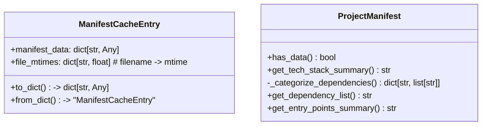

# Manifest Generator Module

## File Overview

The `manifest.py` module provides functionality for parsing and caching project manifest information from various file formats. It handles project metadata extraction from Python projects (pyproject.toml, setup.py, requirements.txt) and Node.js projects (package.json), with built-in caching mechanisms to improve performance.

## Classes

### ManifestCacheEntry

A dataclass that represents a cached manifest entry, storing both the manifest data and metadata for cache validation.

### ProjectManifest

A dataclass that contains parsed project manifest information including dependencies, metadata, and project structure details.

## Functions

### Cache Management Functions

**_get_manifest_mtimes**
Retrieves modification times for manifest files to determine if cache is still valid.

**_is_cache_valid**
Validates whether the cached manifest data is still current by comparing file modification times.

**_load_manifest_cache**
Loads cached manifest data from disk storage.

**_save_manifest_cache**
Persists manifest data to cache storage for future use.

### Serialization Functions

**_manifest_to_dict**
Converts a ProjectManifest object to a dictionary format suitable for serialization.

**_manifest_from_dict**
Reconstructs a ProjectManifest object from a dictionary representation.

### Main Interface Functions

**get_cached_manifest**
Primary function that retrieves manifest data, using cache when valid or parsing fresh when needed.

**parse_manifest**
Parses project manifest files and returns a ProjectManifest object with extracted information.

### Format-Specific Parsers

**_parse_pyproject_toml**
Parses Python project configuration from pyproject.toml files using the `tomllib` library.

**_parse_python_dep**
Extracts and normalizes Python dependency information.

**_parse_setup_py**
Processes setup.py files to extract project metadata and dependencies.

**_parse_requirements_txt**
Parses requirements.txt files for Python dependency lists.

**_parse_package_json**
Handles Node.js package.json files for JavaScript/TypeScript project information.

## Usage Examples

```python
from local_deepwiki.generators.manifest import get_cached_manifest, parse_manifest
from pathlib import Path

# Get cached manifest (preferred method)
project_path = Path("./my_project")
manifest = get_cached_manifest(project_path)

# Parse manifest directly
manifest = parse_manifest(project_path)

# Access manifest data
print(f"Project dependencies: {manifest.dependencies}")
print(f"Project metadata: {manifest.metadata}")
```

## Related Components

This module integrates with:

- **local_deepwiki.logging**: Uses the logging system via `get_logger` for operation tracking
- **pathlib.Path**: Extensively uses Path objects for file system operations
- **tomllib/tomli**: Handles TOML file parsing for Python project configurations
- **json**: Processes JSON files for Node.js projects and cache serialization

The module serves as a foundational component for project analysis, providing standardized manifest information that other parts of the deepwiki system can consume for documentation generation and project understanding.

## API Reference

### class `ManifestCacheEntry`

Cache entry storing manifest data and file modification times.

**Methods:**

#### `to_dict`

```python
def to_dict() -> dict[str, Any]
```

Convert to dictionary for JSON serialization.

#### `from_dict`

```python
def from_dict(data: dict[str, Any]) -> "ManifestCacheEntry"
```

Create from dictionary.


| [Parameter](api_docs.md) | Type | Default | Description |
|-----------|------|---------|-------------|
| `data` | `dict[str, Any]` | - | - |


### class `ProjectManifest`

Extracted project metadata from package manifests.

**Methods:**

#### `has_data`

```python
def has_data() -> bool
```

Check if any meaningful data was extracted.

#### `get_tech_stack_summary`

```python
def get_tech_stack_summary() -> str
```

Generate a factual tech stack summary.

#### `get_dependency_list`

```python
def get_dependency_list() -> str
```

Get a formatted list of all dependencies.

#### `get_entry_points_summary`

```python
def get_entry_points_summary() -> str
```

Get a summary of entry points and scripts.


---

### Functions

#### `get_cached_manifest`

```python
def get_cached_manifest(repo_path: Path, cache_dir: Path | None = None) -> ProjectManifest
```

Get project manifest, using cache if available and valid.  This function checks if a cached manifest exists and is still valid (no manifest files have been modified). If valid, returns cached data. Otherwise, parses fresh and updates the cache.


| [Parameter](api_docs.md) | Type | Default | Description |
|-----------|------|---------|-------------|
| `repo_path` | `Path` | - | Path to the repository root. |
| `cache_dir` | `Path | None` | `None` | Directory for cache storage (defaults to repo_path/.deepwiki). |

**Returns:** `ProjectManifest`


#### `parse_manifest`

```python
def parse_manifest(repo_path: Path) -> ProjectManifest
```

Parse all recognized package manifests in a repository.  Note: For incremental updates, prefer get_cached_manifest() which avoids re-parsing when manifest files haven't changed.


| [Parameter](api_docs.md) | Type | Default | Description |
|-----------|------|---------|-------------|
| `repo_path` | `Path` | - | Path to the repository root. |

**Returns:** `ProjectManifest`


#### `find`

```python
def find(path: str) -> Any
```


| [Parameter](api_docs.md) | Type | Default | Description |
|-----------|------|---------|-------------|
| `path` | `str` | - | - |

**Returns:** `Any`


#### `get_directory_tree`

```python
def get_directory_tree(repo_path: Path, max_depth: int = 3, max_items: int = 50) -> str
```

Generate a directory tree structure for the repository.


| [Parameter](api_docs.md) | Type | Default | Description |
|-----------|------|---------|-------------|
| `repo_path` | `Path` | - | Path to repository root. |
| `max_depth` | `int` | `3` | Maximum depth to traverse. |
| `max_items` | `int` | `50` | Maximum total items to include. |

**Returns:** `str`


#### `should_skip`

```python
def should_skip(name: str) -> bool
```


| [Parameter](api_docs.md) | Type | Default | Description |
|-----------|------|---------|-------------|
| `name` | `str` | - | - |

**Returns:** `bool`


#### `traverse`

```python
def traverse(path: Path, prefix: str, depth: int) -> None
```


| [Parameter](api_docs.md) | Type | Default | Description |
|-----------|------|---------|-------------|
| `path` | `Path` | - | - |
| `prefix` | `str` | - | - |
| `depth` | `int` | - | - |

**Returns:** `None`


## Class Diagram



## Call Graph

```mermaid
flowchart TD
    N0[ProjectManifest]
    N1[_get_manifest_mtimes]
    N2[_load_manifest_cache]
    N3[_manifest_from_dict]
    N4[_parse_build_gradle]
    N5[_parse_cargo_toml]
    N6[_parse_gemfile]
    N7[_parse_go_mod]
    N8[_parse_package_json]
    N9[_parse_pom_xml]
    N10[_parse_pyproject_toml]
    N11[_parse_python_dep]
    N12[_parse_requirements_txt]
    N13[_parse_setup_py]
    N14[_save_manifest_cache]
    N15[compile]
    N16[exists]
    N17[finditer]
    N18[get_cached_manifest]
    N19[get_directory_tree]
    N20[group]
    N21[is_file]
    N22[iterdir]
    N23[loads]
    N24[parse_manifest]
    N25[read_text]
    N26[search]
    N27[should_skip]
    N28[splitlines]
    N29[traverse]
    N1 --> N16
    N2 --> N16
    N3 --> N0
    N18 --> N1
    N18 --> N2
    N18 --> N3
    N18 --> N24
    N18 --> N14
    N24 --> N0
    N24 --> N16
    N10 --> N25
    N10 --> N23
    N10 --> N11
    N11 --> N20
    N13 --> N25
    N13 --> N26
    N13 --> N20
    N13 --> N17
    N13 --> N11
    N12 --> N25
    N12 --> N28
    N12 --> N11
    N8 --> N25
    N8 --> N23
    N5 --> N25
    N5 --> N23
    N7 --> N25
    N7 --> N26
    N7 --> N20
    N7 --> N28
    N4 --> N25
    N4 --> N15
    N4 --> N17
    N4 --> N20
    N6 --> N25
    N6 --> N15
    N6 --> N17
    N6 --> N20
    N19 --> N22
    N19 --> N21
    N19 --> N27
    N19 --> N29
    N29 --> N22
    N29 --> N21
    N29 --> N27
    N29 --> N29
    classDef func fill:#e1f5fe
    class N0,N1,N2,N3,N4,N5,N6,N7,N8,N9,N10,N11,N12,N13,N14,N15,N16,N17,N18,N19,N20,N21,N22,N23,N24,N25,N26,N27,N28,N29 func
```



## Relevant Source Files

- `src/local_deepwiki/generators/manifest.py:33-52`

## See Also

- [test_manifest](../../../tests/test_manifest.md) - uses this
- [diagrams](diagrams.md) - shares 4 dependencies
- [vectorstore](../core/vectorstore.md) - shares 4 dependencies
