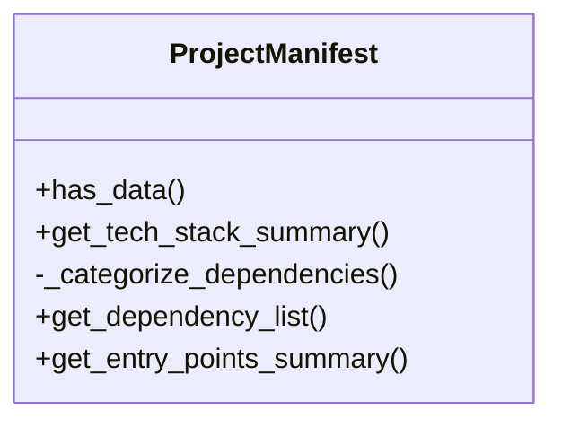

# File Overview

This file, `src/local_deepwiki/generators/manifest.py`, provides functionality for parsing various project manifest files to extract metadata about software projects. It supports parsing of manifests from multiple languages including Python, Node.js, Rust, Go, Java, Kotlin, and Ruby. The parsed data is stored in a `ProjectManifest` object, which serves as a standardized representation of project metadata.

# Classes

## ProjectManifest

The `ProjectManifest` class is used to store metadata extracted from project manifest files. It holds information such as project name, version, language, dependencies, and other relevant data.

### Methods

- **has_data()**
  - Checks if any meaningful data was extracted.
  - Returns: `bool`

- **get_tech_stack_summary()**
  - (Not fully shown in the provided code)

- **_categorize_dependencies()**
  - (Not fully shown in the provided code)

- **get_dependency_list()**
  - (Not fully shown in the provided code)

- **get_entry_points_summary()**
  - (Not fully shown in the provided code)

# Functions

## parse_manifest

Parses all recognized package manifests in a repository.

- **Parameters**:
  - `repo_path`: `Path` - Path to the repository root.

- **Returns**:
  - `ProjectManifest` with extracted metadata.

## _parse_pyproject_toml

Parses `pyproject.toml` (Python).

- **Parameters**:
  - `filepath`: `Path` - Path to the `pyproject.toml` file.
  - `manifest`: `ProjectManifest` - The manifest object to populate.

## _parse_setup_py

Parses `setup.py` (Python legacy).

- **Parameters**:
  - `filepath`: `Path` - Path to the `setup.py` file.
  - `manifest`: `ProjectManifest` - The manifest object to populate.

## _parse_requirements_txt

Parses `requirements.txt` (Python).

- **Parameters**:
  - `filepath`: `Path` - Path to the `requirements.txt` file.
  - `manifest`: `ProjectManifest` - The manifest object to populate.

## _parse_package_json

Parses `package.json` (Node.js).

- **Parameters**:
  - `filepath`: `Path` - Path to the `package.json` file.
  - `manifest`: `ProjectManifest` - The manifest object to populate.

## _parse_cargo_toml

Parses `Cargo.toml` (Rust).

- **Parameters**:
  - `filepath`: `Path` - Path to the `Cargo.toml` file.
  - `manifest`: `ProjectManifest` - The manifest object to populate.

## _parse_go_mod

Parses `go.mod` (Go).

- **Parameters**:
  - `filepath`: `Path` - Path to the `go.mod` file.
  - `manifest`: `ProjectManifest` - The manifest object to populate.

## _parse_pom_xml

Parses `pom.xml` (Java/Maven).

- **Parameters**:
  - `filepath`: `Path` - Path to the `pom.xml` file.
  - `manifest`: `ProjectManifest` - The manifest object to populate.

## _parse_build_gradle

Parses `build.gradle` (Java/Kotlin Gradle).

- **Parameters**:
  - `filepath`: `Path` - Path to the `build.gradle` file.
  - `manifest`: `ProjectManifest` - The manifest object to populate.

## _parse_gemfile

Parses `Gemfile` (Ruby).

- **Parameters**:
  - `filepath`: `Path` - Path to the `Gemfile` file.
  - `manifest`: `ProjectManifest` - The manifest object to populate.

## find

(Not fully shown in the provided code)

## get_directory_tree

(Not fully shown in the provided code)

## should_skip

(Not fully shown in the provided code)

## traverse

(Not fully shown in the provided code)

# Usage Examples

To parse a repository's manifest files and extract metadata:

```python
from pathlib import Path
from manifest import parse_manifest

repo_path = Path("/path/to/repo")
manifest = parse_manifest(repo_path)
```

This will attempt to parse various manifest files in the repository and populate the `ProjectManifest` object with extracted data.

# Related Components

This file imports and uses the following components:

- `json` - For parsing `package.json`
- `re` - For regular expression matching in various parsers
- `dataclasses` - For the `ProjectManifest` class
- `pathlib.Path` - For handling file paths
- `typing.Any` - For type hints
- `tomllib` and `tomli` - For parsing TOML files like `pyproject.toml` and `Cargo.toml`
- `xml.etree.ElementTree` - For parsing XML files like `pom.xml`

## API Reference

### class `ProjectManifest`

Extracted project metadata from package manifests.

**Methods:**

#### `has_data`

```python
def has_data() -> bool
```

Check if any meaningful data was extracted.

#### `get_tech_stack_summary`

```python
def get_tech_stack_summary() -> str
```

Generate a factual tech stack summary.

#### `get_dependency_list`

```python
def get_dependency_list() -> str
```

Get a formatted list of all dependencies.

#### `get_entry_points_summary`

```python
def get_entry_points_summary() -> str
```

Get a summary of entry points and scripts.


---

### Functions

#### `parse_manifest`

```python
def parse_manifest(repo_path: Path) -> ProjectManifest
```

Parse all recognized package manifests in a repository.


| [Parameter](api_docs.md) | Type | Default | Description |
|-----------|------|---------|-------------|
| `repo_path` | `Path` | - | Path to the repository root. |

**Returns:** `ProjectManifest`


#### `find`

```python
def find(path: str) -> Any
```


| [Parameter](api_docs.md) | Type | Default | Description |
|-----------|------|---------|-------------|
| `path` | `str` | - | - |

**Returns:** `Any`


#### `get_directory_tree`

```python
def get_directory_tree(repo_path: Path, max_depth: int = 3, max_items: int = 50) -> str
```

Generate a directory tree structure for the repository.


| [Parameter](api_docs.md) | Type | Default | Description |
|-----------|------|---------|-------------|
| `repo_path` | `Path` | - | Path to repository root. |
| `max_depth` | `int` | `3` | Maximum depth to traverse. |
| `max_items` | `int` | `50` | Maximum total items to include. |

**Returns:** `str`


#### `should_skip`

```python
def should_skip(name: str) -> bool
```


| [Parameter](api_docs.md) | Type | Default | Description |
|-----------|------|---------|-------------|
| `name` | `str` | - | - |

**Returns:** `bool`


#### `traverse`

```python
def traverse(path: Path, prefix: str, depth: int) -> None
```


| [Parameter](api_docs.md) | Type | Default | Description |
|-----------|------|---------|-------------|
| `path` | `Path` | - | - |
| `prefix` | `str` | - | - |
| `depth` | `int` | - | - |

**Returns:** `None`


## Class Diagram



## Call Graph

```mermaid
flowchart TD
    N0[ProjectManifest]
    N1[_parse_build_gradle]
    N2[_parse_cargo_toml]
    N3[_parse_gemfile]
    N4[_parse_go_mod]
    N5[_parse_package_json]
    N6[_parse_pom_xml]
    N7[_parse_pyproject_toml]
    N8[_parse_python_dep]
    N9[_parse_requirements_txt]
    N10[_parse_setup_py]
    N11[compile]
    N12[exists]
    N13[finditer]
    N14[get_directory_tree]
    N15[getroot]
    N16[group]
    N17[is_dir]
    N18[is_file]
    N19[iterdir]
    N20[loads]
    N21[match]
    N22[parse]
    N23[parse_manifest]
    N24[parser]
    N25[read_text]
    N26[search]
    N27[should_skip]
    N28[splitlines]
    N29[traverse]
    N23 --> N0
    N23 --> N12
    N23 --> N24
    N7 --> N25
    N7 --> N20
    N7 --> N8
    N8 --> N21
    N8 --> N16
    N10 --> N25
    N10 --> N26
    N10 --> N16
    N10 --> N13
    N10 --> N8
    N9 --> N25
    N9 --> N28
    N9 --> N8
    N5 --> N25
    N5 --> N20
    N2 --> N25
    N2 --> N20
    N4 --> N25
    N4 --> N26
    N4 --> N16
    N4 --> N28
    N6 --> N22
    N6 --> N15
    N1 --> N25
    N1 --> N11
    N1 --> N13
    N1 --> N16
    N3 --> N25
    N3 --> N11
    N3 --> N13
    N3 --> N16
    N14 --> N19
    N14 --> N18
    N14 --> N27
    N14 --> N17
    N14 --> N29
    N29 --> N19
    N29 --> N18
    N29 --> N27
    N29 --> N17
    N29 --> N29
    classDef func fill:#e1f5fe
    class N0,N1,N2,N3,N4,N5,N6,N7,N8,N9,N10,N11,N12,N13,N14,N15,N16,N17,N18,N19,N20,N21,N22,N23,N24,N25,N26,N27,N28,N29 func
```



## Relevant Source Files

- `src/local_deepwiki/generators/manifest.py:15-138`

## See Also

- [wiki](wiki.md) - uses this
- [diagrams](diagrams.md) - shares 4 dependencies
