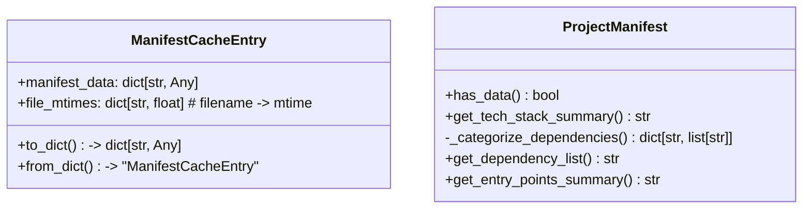

# manifest.py

## File Overview

This module provides functionality for parsing and caching project manifest files from various package managers and build systems. It extracts project metadata like dependencies, version information, and entry points from files such as `pyproject.toml`, `setup.py`, `requirements.txt`, `package.json`, and `build.gradle`.

The module implements a caching mechanism to avoid re-parsing manifest files when they haven't changed, improving performance for incremental operations.

## Classes

### ProjectManifest

A data class that stores project metadata extracted from various manifest files.

**Attributes:**
- `name`: Project name
- `version`: Project version
- `description`: Project description  
- `language`: Programming language
- `language_version`: Version of the programming language
- `dependencies`: Runtime dependencies dictionary
- `dev_dependencies`: Development dependencies dictionary
- `entry_points`: Entry points dictionary
- `scripts`: Scripts dictionary
- `repository`: Repository URL
- `license`: License information

**Methods:**
- `has_data()`: Check if the manifest contains any data
- `get_tech_stack_summary()`: Get a summary of the technology stack
- `_categorize_dependencies()`: Categorize dependencies (internal method)
- `get_dependency_list()`: Get list of dependencies
- `get_entry_points_summary()`: Get summary of entry points

### ManifestCacheEntry

A data class for storing cached manifest data along with file modification times.

**Attributes:**
- `manifest_data`: Dictionary containing the manifest data
- `file_mtimes`: Dictionary mapping filenames to modification times

**Methods:**
- `to_dict()`: Convert to dictionary for JSON serialization
- `from_dict(data)`: Class method to create instance from dictionary

## Functions

### get_cached_manifest

```python
get_cached_manifest(repo_path: Path, cache_dir: Path | None = None) -> ProjectManifest
```

Get project manifest using cache if available and valid. This is the recommended entry point for getting manifest data as it provides caching for performance.

**Parameters:**
- `repo_path`: Path to the repository root
- `cache_dir`: Directory for cache storage (defaults to `repo_path/.deepwiki`)

**Returns:**
- ProjectManifest with extracted metadata

### parse_manifest

```python
parse_manifest(repo_path: Path) -> ProjectManifest
```

Parse all recognized package manifests in a repository without caching. For incremental updates, prefer `get_cached_manifest()`.

**Parameters:**
- `repo_path`: Path to the repository root

**Returns:**
- ProjectManifest with extracted metadata

### _load_manifest_cache

```python
_load_manifest_cache(cache_path: Path) -> ManifestCacheEntry | None
```

Load manifest cache from disk.

**Parameters:**
- `cache_path`: Path to the cache file

**Returns:**
- ManifestCacheEntry or None if not found/invalid

### _save_manifest_cache

```python
_save_manifest_cache(cache_path: Path, entry: ManifestCacheEntry) -> None
```

Save manifest cache to disk.

**Parameters:**
- `cache_path`: Path to the cache file
- `entry`: The cache entry to save

### _is_cache_valid

```python
_is_cache_valid(cache_entry: ManifestCacheEntry, current_mtimes: dict[str, float]) -> bool
```

Check if cached manifest is still valid by comparing file modification times.

**Parameters:**
- `cache_entry`: The cached manifest entry
- `current_mtimes`: Current modification times of manifest files

**Returns:**
- True if cache is valid, False if any file has changed

### _get_manifest_mtimes

```python
_get_manifest_mtimes(repo_path: Path) -> dict[str, float]
```

Get modification times for all manifest files.

**Parameters:**
- `repo_path`: Path to the repository root

**Returns:**
- Dictionary mapping filename to modification time (0 if file doesn't exist)

### _manifest_to_dict

```python
_manifest_to_dict(manifest: ProjectManifest) -> dict[str, Any]
```

Convert ProjectManifest to dictionary for caching.

**Parameters:**
- `manifest`: ProjectManifest instance to convert

**Returns:**
- Dictionary representation of the manifest

### _manifest_from_dict

```python
_manifest_from_dict(data: dict[str, Any]) -> ProjectManifest
```

Create ProjectManifest from dictionary.

**Parameters:**
- `data`: Dictionary containing manifest data

**Returns:**
- ProjectManifest instance

### _parse_setup_py

```python
_parse_setup_py(filepath: Path, manifest: ProjectManifest) -> None
```

Parse `setup.py` files for Python projects (legacy format).

**Parameters:**
- `filepath`: Path to the setup.py file
- `manifest`: ProjectManifest to populate with extracted data

### _parse_build_gradle

```python
_parse_build_gradle(filepath: Path, manifest: ProjectManifest) -> None
```

Parse `build.gradle` files for Java/Kotlin Gradle projects.

**Parameters:**
- `filepath`: Path to the build.gradle file
- `manifest`: ProjectManifest to populate with extracted data

## Usage Examples

### Basic Usage

```python
from pathlib import Path
from local_deepwiki.generators.manifest import get_cached_manifest

# Get manifest with caching (recommended)
repo_path = Path("/path/to/repository")
manifest = get_cached_manifest(repo_path)

print(f"Project: {manifest.name}")
print(f"Version: {manifest.version}")
print(f"Language: {manifest.language}")
```

### Direct Parsing

```python
from local_deepwiki.generators.manifest import parse_manifest

# Parse without caching
manifest = parse_manifest(repo_path)
if manifest.has_data():
    dependencies = manifest.get_dependency_list()
    tech_summary = manifest.get_tech_stack_summary()
```

### Working with Cache

```python
from local_deepwiki.generators.manifest import _load_manifest_cache, _save_manifest_cache

# Load existing cache
cache_path = Path("/path/to/cache.json")
cache_entry = _load_manifest_cache(cache_path)

if cache_entry:
    manifest_data = cache_entry.manifest_data
    file_times = cache_entry.file_mtimes
```

## Related Components

This module integrates with:
- **local_deepwiki.logging**: Uses the logging system via `get_logger()`
- **pathlib.Path**: Extensively uses Path objects for file operations
- **json**: For cache serialization and deserialization
- **tomllib/tomli**: For parsing TOML files like `pyproject.toml`

The module references `MANIFEST_FILES` constant and includes parsers for various file formats, suggesting it works with a broader ecosystem of package managers and build systems.

## API Reference

### class `ManifestCacheEntry`

Cache entry storing manifest data and file modification times.

**Methods:**


<details>
<summary>View Source (lines 33-52) | <a href="https://github.com/UrbanDiver/local-deepwiki-mcp/blob/feature/wiki-enhancements/src/local_deepwiki/generators/manifest.py#L33-L52">GitHub</a></summary>

```python
class ManifestCacheEntry:
    """Cache entry storing manifest data and file modification times."""

    manifest_data: dict[str, Any]
    file_mtimes: dict[str, float]  # filename -> mtime

    def to_dict(self) -> dict[str, Any]:
        """Convert to dictionary for JSON serialization."""
        return {
            "manifest_data": self.manifest_data,
            "file_mtimes": self.file_mtimes,
        }

    @classmethod
    def from_dict(cls, data: dict[str, Any]) -> "ManifestCacheEntry":
        """Create from dictionary."""
        return cls(
            manifest_data=data.get("manifest_data", {}),
            file_mtimes=data.get("file_mtimes", {}),
        )
```

</details>

#### `to_dict`

```python
def to_dict() -> dict[str, Any]
```

Convert to dictionary for JSON serialization.


<details>
<summary>View Source (lines 33-52) | <a href="https://github.com/UrbanDiver/local-deepwiki-mcp/blob/feature/wiki-enhancements/src/local_deepwiki/generators/manifest.py#L33-L52">GitHub</a></summary>

```python
class ManifestCacheEntry:
    """Cache entry storing manifest data and file modification times."""

    manifest_data: dict[str, Any]
    file_mtimes: dict[str, float]  # filename -> mtime

    def to_dict(self) -> dict[str, Any]:
        """Convert to dictionary for JSON serialization."""
        return {
            "manifest_data": self.manifest_data,
            "file_mtimes": self.file_mtimes,
        }

    @classmethod
    def from_dict(cls, data: dict[str, Any]) -> "ManifestCacheEntry":
        """Create from dictionary."""
        return cls(
            manifest_data=data.get("manifest_data", {}),
            file_mtimes=data.get("file_mtimes", {}),
        )
```

</details>

#### `from_dict`

```python
def from_dict(data: dict[str, Any]) -> "ManifestCacheEntry"
```

Create from dictionary.


| [Parameter](api_docs.md) | Type | Default | Description |
|-----------|------|---------|-------------|
| `data` | `dict[str, Any]` | - | - |


<details>
<summary>View Source (lines 33-52) | <a href="https://github.com/UrbanDiver/local-deepwiki-mcp/blob/feature/wiki-enhancements/src/local_deepwiki/generators/manifest.py#L33-L52">GitHub</a></summary>

```python
class ManifestCacheEntry:
    """Cache entry storing manifest data and file modification times."""

    manifest_data: dict[str, Any]
    file_mtimes: dict[str, float]  # filename -> mtime

    def to_dict(self) -> dict[str, Any]:
        """Convert to dictionary for JSON serialization."""
        return {
            "manifest_data": self.manifest_data,
            "file_mtimes": self.file_mtimes,
        }

    @classmethod
    def from_dict(cls, data: dict[str, Any]) -> "ManifestCacheEntry":
        """Create from dictionary."""
        return cls(
            manifest_data=data.get("manifest_data", {}),
            file_mtimes=data.get("file_mtimes", {}),
        )
```

</details>

### class `ProjectManifest`

Extracted project metadata from package manifests.

**Methods:**


<details>
<summary>View Source (lines 56-205) | <a href="https://github.com/UrbanDiver/local-deepwiki-mcp/blob/feature/wiki-enhancements/src/local_deepwiki/generators/manifest.py#L56-L205">GitHub</a></summary>

```python
class ProjectManifest:
    # Methods: has_data, get_tech_stack_summary, _categorize_dependencies, get_dependency_list, get_entry_points_summary
```

</details>

#### `has_data`

```python
def has_data() -> bool
```

Check if any meaningful data was extracted.


<details>
<summary>View Source (lines 81-83) | <a href="https://github.com/UrbanDiver/local-deepwiki-mcp/blob/feature/wiki-enhancements/src/local_deepwiki/generators/manifest.py#L81-L83">GitHub</a></summary>

```python
def has_data(self) -> bool:
        """Check if any meaningful data was extracted."""
        return bool(self.name or self.dependencies or self.dev_dependencies or self.entry_points)
```

</details>

#### `get_tech_stack_summary`

```python
def get_tech_stack_summary() -> str
```

Generate a factual tech stack summary.


<details>
<summary>View Source (lines 85-102) | <a href="https://github.com/UrbanDiver/local-deepwiki-mcp/blob/feature/wiki-enhancements/src/local_deepwiki/generators/manifest.py#L85-L102">GitHub</a></summary>

```python
def get_tech_stack_summary(self) -> str:
        """Generate a factual tech stack summary."""
        lines = []

        if self.language:
            version_str = f" {self.language_version}" if self.language_version else ""
            lines.append(f"- **{self.language}{version_str}**")

        # Group dependencies by category (infer from common packages)
        categorized = self._categorize_dependencies()
        for category, deps in categorized.items():
            if deps:
                dep_list = ", ".join(sorted(deps)[:5])
                if len(deps) > 5:
                    dep_list += f" (+{len(deps) - 5} more)"
                lines.append(f"- **{category}**: {dep_list}")

        return "\n".join(lines) if lines else "No package manifest found."
```

</details>

#### `get_dependency_list`

```python
def get_dependency_list() -> str
```

Get a formatted list of all dependencies.


<details>
<summary>View Source (lines 171-187) | <a href="https://github.com/UrbanDiver/local-deepwiki-mcp/blob/feature/wiki-enhancements/src/local_deepwiki/generators/manifest.py#L171-L187">GitHub</a></summary>

```python
def get_dependency_list(self) -> str:
        """Get a formatted list of all dependencies."""
        lines = []

        if self.dependencies:
            lines.append("### Dependencies\n")
            for name, version in sorted(self.dependencies.items()):
                version_str = f" ({version})" if version and version != "*" else ""
                lines.append(f"- {name}{version_str}")

        if self.dev_dependencies:
            lines.append("\n### Dev Dependencies\n")
            for name, version in sorted(self.dev_dependencies.items()):
                version_str = f" ({version})" if version and version != "*" else ""
                lines.append(f"- {name}{version_str}")

        return "\n".join(lines) if lines else ""
```

</details>

#### `get_entry_points_summary`

```python
def get_entry_points_summary() -> str
```

Get a summary of entry points and scripts.


---


<details>
<summary>View Source (lines 189-205) | <a href="https://github.com/UrbanDiver/local-deepwiki-mcp/blob/feature/wiki-enhancements/src/local_deepwiki/generators/manifest.py#L189-L205">GitHub</a></summary>

```python
def get_entry_points_summary(self) -> str:
        """Get a summary of entry points and scripts."""
        lines = []

        if self.entry_points:
            lines.append("### CLI Commands\n")
            for name, target in sorted(self.entry_points.items()):
                lines.append(f"- `{name}` → {target}")

        if self.scripts:
            lines.append("\n### Scripts\n")
            for name, cmd in sorted(self.scripts.items()):
                # Truncate long commands
                cmd_display = cmd if len(cmd) < 60 else cmd[:57] + "..."
                lines.append(f"- `{name}`: {cmd_display}")

        return "\n".join(lines) if lines else ""
```

</details>

### Functions

#### `get_cached_manifest`

```python
def get_cached_manifest(repo_path: Path, cache_dir: Path | None = None) -> ProjectManifest
```

Get project manifest, using cache if available and valid.  This function checks if a cached manifest exists and is still valid (no manifest files have been modified). If valid, returns cached data. Otherwise, parses fresh and updates the cache.


| [Parameter](api_docs.md) | Type | Default | Description |
|-----------|------|---------|-------------|
| `repo_path` | `Path` | - | Path to the repository root. |
| `cache_dir` | `Path | None` | `None` | Directory for cache storage (defaults to repo_path/.deepwiki). |

**Returns:** `ProjectManifest`


<details>
<summary>View Source (lines 339-378) | <a href="https://github.com/UrbanDiver/local-deepwiki-mcp/blob/feature/wiki-enhancements/src/local_deepwiki/generators/manifest.py#L339-L378">GitHub</a></summary>

```python
def get_cached_manifest(repo_path: Path, cache_dir: Path | None = None) -> ProjectManifest:
    """Get project manifest, using cache if available and valid.

    This function checks if a cached manifest exists and is still valid
    (no manifest files have been modified). If valid, returns cached data.
    Otherwise, parses fresh and updates the cache.

    Args:
        repo_path: Path to the repository root.
        cache_dir: Directory for cache storage (defaults to repo_path/.deepwiki).

    Returns:
        ProjectManifest with extracted metadata.
    """
    if cache_dir is None:
        cache_dir = repo_path / ".deepwiki"

    cache_path = cache_dir / "manifest_cache.json"

    # Get current modification times
    current_mtimes = _get_manifest_mtimes(repo_path)

    # Try to use cache
    cache_entry = _load_manifest_cache(cache_path)
    if cache_entry is not None and _is_cache_valid(cache_entry, current_mtimes):
        logger.debug("Using cached manifest data")
        return _manifest_from_dict(cache_entry.manifest_data)

    # Parse fresh
    logger.debug("Parsing manifest files (cache miss or invalid)")
    manifest = parse_manifest(repo_path)

    # Save to cache
    new_entry = ManifestCacheEntry(
        manifest_data=_manifest_to_dict(manifest),
        file_mtimes=current_mtimes,
    )
    _save_manifest_cache(cache_path, new_entry)

    return manifest
```

</details>

#### `parse_manifest`

```python
def parse_manifest(repo_path: Path) -> ProjectManifest
```

Parse all recognized package manifests in a repository.  Note: For incremental updates, prefer get_cached_manifest() which avoids re-parsing when manifest files haven't changed.


| [Parameter](api_docs.md) | Type | Default | Description |
|-----------|------|---------|-------------|
| `repo_path` | `Path` | - | Path to the repository root. |

**Returns:** `ProjectManifest`


<details>
<summary>View Source (lines 381-421) | <a href="https://github.com/UrbanDiver/local-deepwiki-mcp/blob/feature/wiki-enhancements/src/local_deepwiki/generators/manifest.py#L381-L421">GitHub</a></summary>

```python
def parse_manifest(repo_path: Path) -> ProjectManifest:
    """Parse all recognized package manifests in a repository.

    Note: For incremental updates, prefer get_cached_manifest() which
    avoids re-parsing when manifest files haven't changed.

    Args:
        repo_path: Path to the repository root.

    Returns:
        ProjectManifest with extracted metadata.
    """
    manifest = ProjectManifest()

    # Try each parser in order of preference
    parsers = [
        ("pyproject.toml", _parse_pyproject_toml),
        ("setup.py", _parse_setup_py),
        ("requirements.txt", _parse_requirements_txt),
        ("package.json", _parse_package_json),
        ("Cargo.toml", _parse_cargo_toml),
        ("go.mod", _parse_go_mod),
        ("pom.xml", _parse_pom_xml),
        ("build.gradle", _parse_build_gradle),
        ("Gemfile", _parse_gemfile),
    ]

    for filename, parser in parsers:
        filepath = repo_path / filename
        if filepath.exists():
            try:
                parser(filepath, manifest)
                manifest.manifest_files.append(filename)
            except (OSError, ValueError, KeyError, TypeError) as e:
                # OSError: File read issues
                # ValueError: Invalid file content or format
                # KeyError/TypeError: Missing or invalid fields
                # Skip files that fail to parse but log the issue
                logger.warning(f"Failed to parse manifest file {filename}: {e}")

    return manifest
```

</details>

#### `find`

```python
def find(path: str) -> Any
```


| [Parameter](api_docs.md) | Type | Default | Description |
|-----------|------|---------|-------------|
| `path` | `str` | - | - |

**Returns:** `Any`


<details>
<summary>View Source (lines 674-678) | <a href="https://github.com/UrbanDiver/local-deepwiki-mcp/blob/feature/wiki-enhancements/src/local_deepwiki/generators/manifest.py#L674-L678">GitHub</a></summary>

```python
def find(path: str) -> Any:
        result = root.find(path, ns)
        if result is None:
            result = root.find(path.replace("m:", ""))
        return result
```

</details>

#### `get_directory_tree`

```python
def get_directory_tree(repo_path: Path, max_depth: int = 3, max_items: int = 50) -> str
```

Generate a directory tree structure for the repository.


| [Parameter](api_docs.md) | Type | Default | Description |
|-----------|------|---------|-------------|
| `repo_path` | `Path` | - | Path to repository root. |
| `max_depth` | `int` | `3` | Maximum depth to traverse. |
| `max_items` | `int` | `50` | Maximum total items to include. |

**Returns:** `str`


<details>
<summary>View Source (lines 758-838) | <a href="https://github.com/UrbanDiver/local-deepwiki-mcp/blob/feature/wiki-enhancements/src/local_deepwiki/generators/manifest.py#L758-L838">GitHub</a></summary>

```python
def get_directory_tree(repo_path: Path, max_depth: int = 3, max_items: int = 50) -> str:
    """Generate a directory tree structure for the repository.

    Args:
        repo_path: Path to repository root.
        max_depth: Maximum depth to traverse.
        max_items: Maximum total items to include.

    Returns:
        Formatted directory tree string.
    """
    lines = []
    items_shown = 0

    # Common directories/files to skip
    skip = {
        ".git",
        ".hg",
        ".svn",
        "node_modules",
        "__pycache__",
        ".pytest_cache",
        ".venv",
        "venv",
        ".env",
        ".idea",
        ".vscode",
        "dist",
        "build",
        "target",
        ".egg-info",
        "*.egg",
        ".tox",
        ".nox",
        ".mypy_cache",
        ".ruff_cache",
    }

    def should_skip(name: str) -> bool:
        if name in skip:
            return True
        if name.startswith("."):
            return True
        return False

    def traverse(path: Path, prefix: str, depth: int) -> None:
        nonlocal items_shown

        if depth > max_depth or items_shown >= max_items:
            return

        try:
            items = sorted(path.iterdir(), key=lambda x: (x.is_file(), x.name))
        except PermissionError:
            return

        # Filter items
        items = [i for i in items if not should_skip(i.name)]

        for i, item in enumerate(items):
            if items_shown >= max_items:
                lines.append(f"{prefix}...")
                return

            is_last = i == len(items) - 1
            connector = "└── " if is_last else "├── "
            new_prefix = prefix + ("    " if is_last else "│   ")

            if item.is_dir():
                lines.append(f"{prefix}{connector}{item.name}/")
                items_shown += 1
                traverse(item, new_prefix, depth + 1)
            else:
                lines.append(f"{prefix}{connector}{item.name}")
                items_shown += 1

    lines.append(f"{repo_path.name}/")
    items_shown += 1
    traverse(repo_path, "", 1)

    return "\n".join(lines)
```

</details>

#### `should_skip`

```python
def should_skip(name: str) -> bool
```


| [Parameter](api_docs.md) | Type | Default | Description |
|-----------|------|---------|-------------|
| `name` | `str` | - | - |

**Returns:** `bool`


<details>
<summary>View Source (lines 796-801) | <a href="https://github.com/UrbanDiver/local-deepwiki-mcp/blob/feature/wiki-enhancements/src/local_deepwiki/generators/manifest.py#L796-L801">GitHub</a></summary>

```python
def should_skip(name: str) -> bool:
        if name in skip:
            return True
        if name.startswith("."):
            return True
        return False
```

</details>

#### `traverse`

```python
def traverse(path: Path, prefix: str, depth: int) -> None
```


| [Parameter](api_docs.md) | Type | Default | Description |
|-----------|------|---------|-------------|
| `path` | `Path` | - | - |
| `prefix` | `str` | - | - |
| `depth` | `int` | - | - |

**Returns:** `None`


<details>
<summary>View Source (lines 803-832) | <a href="https://github.com/UrbanDiver/local-deepwiki-mcp/blob/feature/wiki-enhancements/src/local_deepwiki/generators/manifest.py#L803-L832">GitHub</a></summary>

```python
def traverse(path: Path, prefix: str, depth: int) -> None:
        nonlocal items_shown

        if depth > max_depth or items_shown >= max_items:
            return

        try:
            items = sorted(path.iterdir(), key=lambda x: (x.is_file(), x.name))
        except PermissionError:
            return

        # Filter items
        items = [i for i in items if not should_skip(i.name)]

        for i, item in enumerate(items):
            if items_shown >= max_items:
                lines.append(f"{prefix}...")
                return

            is_last = i == len(items) - 1
            connector = "└── " if is_last else "├── "
            new_prefix = prefix + ("    " if is_last else "│   ")

            if item.is_dir():
                lines.append(f"{prefix}{connector}{item.name}/")
                items_shown += 1
                traverse(item, new_prefix, depth + 1)
            else:
                lines.append(f"{prefix}{connector}{item.name}")
                items_shown += 1
```

</details>

## Class Diagram



## Call Graph

```mermaid
flowchart TD
    N0[ProjectManifest]
    N1[_get_manifest_mtimes]
    N2[_load_manifest_cache]
    N3[_manifest_from_dict]
    N4[_parse_build_gradle]
    N5[_parse_cargo_toml]
    N6[_parse_gemfile]
    N7[_parse_go_mod]
    N8[_parse_package_json]
    N9[_parse_pom_xml]
    N10[_parse_pyproject_toml]
    N11[_parse_python_dep]
    N12[_parse_requirements_txt]
    N13[_parse_setup_py]
    N14[_save_manifest_cache]
    N15[compile]
    N16[exists]
    N17[finditer]
    N18[get_cached_manifest]
    N19[get_directory_tree]
    N20[group]
    N21[is_file]
    N22[iterdir]
    N23[loads]
    N24[parse_manifest]
    N25[read_text]
    N26[search]
    N27[should_skip]
    N28[splitlines]
    N29[traverse]
    N1 --> N16
    N2 --> N16
    N3 --> N0
    N18 --> N1
    N18 --> N2
    N18 --> N3
    N18 --> N24
    N18 --> N14
    N24 --> N0
    N24 --> N16
    N10 --> N25
    N10 --> N23
    N10 --> N11
    N11 --> N20
    N13 --> N25
    N13 --> N26
    N13 --> N20
    N13 --> N17
    N13 --> N11
    N12 --> N25
    N12 --> N28
    N12 --> N11
    N8 --> N25
    N8 --> N23
    N5 --> N25
    N5 --> N23
    N7 --> N25
    N7 --> N26
    N7 --> N20
    N7 --> N28
    N4 --> N25
    N4 --> N15
    N4 --> N17
    N4 --> N20
    N6 --> N25
    N6 --> N15
    N6 --> N17
    N6 --> N20
    N19 --> N22
    N19 --> N21
    N19 --> N27
    N19 --> N29
    N29 --> N22
    N29 --> N21
    N29 --> N27
    N29 --> N29
    classDef func fill:#e1f5fe
    class N0,N1,N2,N3,N4,N5,N6,N7,N8,N9,N10,N11,N12,N13,N14,N15,N16,N17,N18,N19,N20,N21,N22,N23,N24,N25,N26,N27,N28,N29 func
```



## Used By

Functions and methods in this file and their callers:

- **`ManifestCacheEntry`**: called by `get_cached_manifest`
- **`ProjectManifest`**: called by `_manifest_from_dict`, `parse_manifest`
- **`_categorize_dependencies`**: called by `ProjectManifest.get_tech_stack_summary`
- **`_get_manifest_mtimes`**: called by `get_cached_manifest`
- **`_is_cache_valid`**: called by `get_cached_manifest`
- **`_load_manifest_cache`**: called by `get_cached_manifest`
- **`_manifest_from_dict`**: called by `get_cached_manifest`
- **`_manifest_to_dict`**: called by `get_cached_manifest`
- **`_parse_python_dep`**: called by `_parse_pyproject_toml`, `_parse_requirements_txt`, `_parse_setup_py`
- **`_save_manifest_cache`**: called by `get_cached_manifest`
- **`cls`**: called by `ManifestCacheEntry.from_dict`
- **`compile`**: called by `_parse_build_gradle`, `_parse_gemfile`
- **`dump`**: called by `_save_manifest_cache`
- **`exists`**: called by `_get_manifest_mtimes`, `_load_manifest_cache`, `parse_manifest`
- **`findall`**: called by `_parse_pom_xml`
- **`finditer`**: called by `_parse_build_gradle`, `_parse_gemfile`, `_parse_setup_py`
- **`from_dict`**: called by `_load_manifest_cache`
- **`getroot`**: called by `_parse_pom_xml`
- **`group`**: called by `_parse_build_gradle`, `_parse_gemfile`, `_parse_go_mod`, `_parse_python_dep`, `_parse_setup_py`
- **`is_dir`**: called by `get_directory_tree`, `traverse`
- **`is_file`**: called by `get_directory_tree`, `traverse`
- **`iterdir`**: called by `get_directory_tree`, `traverse`
- **`load`**: called by `_load_manifest_cache`
- **`loads`**: called by `_parse_cargo_toml`, `_parse_package_json`, `_parse_pyproject_toml`
- **`match`**: called by `_parse_python_dep`
- **`mkdir`**: called by `_save_manifest_cache`
- **`parse`**: called by `_parse_pom_xml`
- **`parse_manifest`**: called by `get_cached_manifest`
- **`parser`**: called by `parse_manifest`
- **`read_text`**: called by `_parse_build_gradle`, `_parse_cargo_toml`, `_parse_gemfile`, `_parse_go_mod`, `_parse_package_json`, `_parse_pyproject_toml`, `_parse_requirements_txt`, `_parse_setup_py`
- **`search`**: called by `_parse_go_mod`, `_parse_setup_py`
- **`should_skip`**: called by `get_directory_tree`, `traverse`
- **`splitlines`**: called by `_parse_go_mod`, `_parse_requirements_txt`
- **`stat`**: called by `_get_manifest_mtimes`
- **`to_dict`**: called by `_save_manifest_cache`
- **`traverse`**: called by `get_directory_tree`, `traverse`

## Usage Examples

*Examples extracted from test files*

### Empty manifest has no data

From `test_manifest.py::test_has_data_empty`:

```python
manifest = ProjectManifest()
assert not manifest.has_data()
```

### Empty manifest has no data

From `test_manifest.py::test_has_data_empty`:

```python
manifest = ProjectManifest()
assert not manifest.has_data()
```

### Empty manifest has no data

From `test_manifest.py::test_has_data_empty`:

```python
assert not manifest.has_data()
```

### Manifest with name has data

From `test_manifest.py::test_has_data_with_name`:

```python
manifest = ProjectManifest(name="test-project")
assert manifest.has_data()
```

### Manifest with name has data

From `test_manifest.py::test_has_data_with_name`:

```python
manifest = ProjectManifest(name="test-project")
assert manifest.has_data()
```


## Additional Source Code

Source code for functions and methods not listed in the API Reference above.

#### `_categorize_dependencies`

<details>
<summary>View Source (lines 104-169) | <a href="https://github.com/UrbanDiver/local-deepwiki-mcp/blob/feature/wiki-enhancements/src/local_deepwiki/generators/manifest.py#L104-L169">GitHub</a></summary>

```python
def _categorize_dependencies(self) -> dict[str, list[str]]:
        """Categorize dependencies by their purpose."""
        categories: dict[str, list[str]] = {
            "Web Framework": [],
            "Database": [],
            "Testing": [],
            "CLI": [],
            "AI/ML": [],
            "Other": [],
        }

        # Known package categories
        web_frameworks = {
            "flask",
            "fastapi",
            "django",
            "starlette",
            "aiohttp",
            "tornado",
            "express",
            "koa",
            "hapi",
        }
        databases = {
            "sqlalchemy",
            "pymongo",
            "redis",
            "lancedb",
            "chromadb",
            "psycopg2",
            "mysql",
            "sqlite",
            "prisma",
            "typeorm",
            "sequelize",
        }
        testing = {"pytest", "unittest", "nose", "jest", "mocha", "vitest"}
        cli = {"click", "typer", "argparse", "commander", "yargs"}
        ai_ml = {
            "openai",
            "anthropic",
            "langchain",
            "transformers",
            "torch",
            "tensorflow",
            "sentence-transformers",
            "ollama",
        }

        for dep in self.dependencies:
            dep_lower = dep.lower().replace("-", "").replace("_", "")
            if any(fw in dep_lower for fw in web_frameworks):
                categories["Web Framework"].append(dep)
            elif any(db in dep_lower for db in databases):
                categories["Database"].append(dep)
            elif any(t in dep_lower for t in testing):
                categories["Testing"].append(dep)
            elif any(c in dep_lower for c in cli):
                categories["CLI"].append(dep)
            elif any(ai in dep_lower for ai in ai_ml):
                categories["AI/ML"].append(dep)
            else:
                categories["Other"].append(dep)

        # Remove empty categories
        return {k: v for k, v in categories.items() if v}
```

</details>


#### `_get_manifest_mtimes`

<details>
<summary>View Source (lines 208-226) | <a href="https://github.com/UrbanDiver/local-deepwiki-mcp/blob/feature/wiki-enhancements/src/local_deepwiki/generators/manifest.py#L208-L226">GitHub</a></summary>

```python
def _get_manifest_mtimes(repo_path: Path) -> dict[str, float]:
    """Get modification times for all manifest files.

    Args:
        repo_path: Path to the repository root.

    Returns:
        Dictionary mapping filename to modification time (0 if file doesn't exist).
    """
    mtimes = {}
    for filename in MANIFEST_FILES:
        filepath = repo_path / filename
        if filepath.exists():
            try:
                mtimes[filename] = filepath.stat().st_mtime
            except OSError as e:
                logger.debug(f"Could not get mtime for {filename}: {e}")
                mtimes[filename] = 0
    return mtimes
```

</details>


#### `_is_cache_valid`

<details>
<summary>View Source (lines 229-256) | <a href="https://github.com/UrbanDiver/local-deepwiki-mcp/blob/feature/wiki-enhancements/src/local_deepwiki/generators/manifest.py#L229-L256">GitHub</a></summary>

```python
def _is_cache_valid(cache_entry: ManifestCacheEntry, current_mtimes: dict[str, float]) -> bool:
    """Check if cached manifest is still valid.

    Args:
        cache_entry: The cached manifest entry.
        current_mtimes: Current modification times of manifest files.

    Returns:
        True if cache is valid, False if any file has changed.
    """
    # Check if same set of files exist
    cached_files = set(cache_entry.file_mtimes.keys())
    current_files = set(current_mtimes.keys())

    if cached_files != current_files:
        logger.debug(
            f"Manifest cache invalid: file set changed ({cached_files} vs {current_files})"
        )
        return False

    # Check if any file has been modified
    for filename, cached_mtime in cache_entry.file_mtimes.items():
        current_mtime = current_mtimes.get(filename, 0)
        if cached_mtime != current_mtime:
            logger.debug(f"Manifest cache invalid: {filename} modified")
            return False

    return True
```

</details>


#### `_load_manifest_cache`

<details>
<summary>View Source (lines 259-280) | <a href="https://github.com/UrbanDiver/local-deepwiki-mcp/blob/feature/wiki-enhancements/src/local_deepwiki/generators/manifest.py#L259-L280">GitHub</a></summary>

```python
def _load_manifest_cache(cache_path: Path) -> ManifestCacheEntry | None:
    """Load manifest cache from disk.

    Args:
        cache_path: Path to the cache file.

    Returns:
        ManifestCacheEntry or None if not found/invalid.
    """
    if not cache_path.exists():
        return None

    try:
        with open(cache_path) as f:
            data = json.load(f)
        return ManifestCacheEntry.from_dict(data)
    except (json.JSONDecodeError, OSError, KeyError, TypeError) as e:
        # json.JSONDecodeError: Corrupted or invalid JSON
        # OSError: File read issues
        # KeyError/TypeError: Invalid cache structure
        logger.debug(f"Could not load manifest cache: {e}")
        return None
```

</details>


#### `_save_manifest_cache`

<details>
<summary>View Source (lines 283-298) | <a href="https://github.com/UrbanDiver/local-deepwiki-mcp/blob/feature/wiki-enhancements/src/local_deepwiki/generators/manifest.py#L283-L298">GitHub</a></summary>

```python
def _save_manifest_cache(cache_path: Path, entry: ManifestCacheEntry) -> None:
    """Save manifest cache to disk.

    Args:
        cache_path: Path to the cache file.
        entry: The cache entry to save.
    """
    try:
        cache_path.parent.mkdir(parents=True, exist_ok=True)
        with open(cache_path, "w") as f:
            json.dump(entry.to_dict(), f, indent=2)
        logger.debug(f"Saved manifest cache to {cache_path}")
    except (OSError, TypeError) as e:
        # OSError: File write or directory creation issues
        # TypeError: Unserializable data in cache entry
        logger.warning(f"Could not save manifest cache: {e}")
```

</details>


#### `_manifest_to_dict`

<details>
<summary>View Source (lines 301-317) | <a href="https://github.com/UrbanDiver/local-deepwiki-mcp/blob/feature/wiki-enhancements/src/local_deepwiki/generators/manifest.py#L301-L317">GitHub</a></summary>

```python
def _manifest_to_dict(manifest: "ProjectManifest") -> dict[str, Any]:
    """Convert ProjectManifest to dictionary for caching."""
    return {
        "name": manifest.name,
        "version": manifest.version,
        "description": manifest.description,
        "language": manifest.language,
        "language_version": manifest.language_version,
        "dependencies": manifest.dependencies,
        "dev_dependencies": manifest.dev_dependencies,
        "entry_points": manifest.entry_points,
        "scripts": manifest.scripts,
        "repository": manifest.repository,
        "license": manifest.license,
        "authors": manifest.authors,
        "manifest_files": manifest.manifest_files,
    }
```

</details>


#### `_manifest_from_dict`

<details>
<summary>View Source (lines 320-336) | <a href="https://github.com/UrbanDiver/local-deepwiki-mcp/blob/feature/wiki-enhancements/src/local_deepwiki/generators/manifest.py#L320-L336">GitHub</a></summary>

```python
def _manifest_from_dict(data: dict[str, Any]) -> "ProjectManifest":
    """Create ProjectManifest from dictionary."""
    return ProjectManifest(
        name=data.get("name"),
        version=data.get("version"),
        description=data.get("description"),
        language=data.get("language"),
        language_version=data.get("language_version"),
        dependencies=data.get("dependencies", {}),
        dev_dependencies=data.get("dev_dependencies", {}),
        entry_points=data.get("entry_points", {}),
        scripts=data.get("scripts", {}),
        repository=data.get("repository"),
        license=data.get("license"),
        authors=data.get("authors", []),
        manifest_files=data.get("manifest_files", []),
    )
```

</details>


#### `_parse_pyproject_toml`

<details>
<summary>View Source (lines 424-490) | <a href="https://github.com/UrbanDiver/local-deepwiki-mcp/blob/feature/wiki-enhancements/src/local_deepwiki/generators/manifest.py#L424-L490">GitHub</a></summary>

```python
def _parse_pyproject_toml(filepath: Path, manifest: ProjectManifest) -> None:
    """Parse pyproject.toml (Python)."""
    try:
        import tomllib
    except ImportError:
        import tomli as tomllib  # type: ignore

    content = filepath.read_text()
    data = tomllib.loads(content)

    manifest.language = "Python"

    # Project metadata
    project = data.get("project", {})
    manifest.name = project.get("name")
    manifest.version = project.get("version")
    manifest.description = project.get("description")
    manifest.license = (
        project.get("license", {}).get("text")
        if isinstance(project.get("license"), dict)
        else project.get("license")
    )

    # Python version
    requires_python = project.get("requires-python")
    if requires_python:
        manifest.language_version = requires_python

    # Authors
    authors = project.get("authors", [])
    manifest.authors = [
        str(a.get("name") or a.get("email") or "") for a in authors if isinstance(a, dict)
    ]

    # Dependencies
    deps = project.get("dependencies", [])
    for dep in deps:
        name, version = _parse_python_dep(dep)
        manifest.dependencies[name] = version

    # Optional/dev dependencies
    optional = project.get("optional-dependencies", {})
    for group, deps in optional.items():
        for dep in deps:
            name, version = _parse_python_dep(dep)
            manifest.dev_dependencies[name] = version

    # Entry points / scripts
    scripts = project.get("scripts", {})
    manifest.entry_points.update(scripts)

    # Also check [tool.poetry] for Poetry projects
    poetry = data.get("tool", {}).get("poetry", {})
    if poetry:
        if not manifest.name:
            manifest.name = poetry.get("name")
        if not manifest.description:
            manifest.description = poetry.get("description")

        for name, spec in poetry.get("dependencies", {}).items():
            if name.lower() != "python":
                version = spec if isinstance(spec, str) else spec.get("version", "*")
                manifest.dependencies[name] = version

        for name, spec in poetry.get("dev-dependencies", {}).items():
            version = spec if isinstance(spec, str) else spec.get("version", "*")
            manifest.dev_dependencies[name] = version
```

</details>


#### `_parse_python_dep`

<details>
<summary>View Source (lines 493-499) | <a href="https://github.com/UrbanDiver/local-deepwiki-mcp/blob/feature/wiki-enhancements/src/local_deepwiki/generators/manifest.py#L493-L499">GitHub</a></summary>

```python
def _parse_python_dep(dep: str) -> tuple[str, str]:
    """Parse a Python dependency string like 'requests>=2.0'."""
    # Match: package_name followed by optional version specifier
    match = re.match(r"^([a-zA-Z0-9_-]+)\s*(.*)$", dep.strip())
    if match:
        return match.group(1), match.group(2).strip() or "*"
    return dep, "*"
```

</details>


#### `_parse_setup_py`

<details>
<summary>View Source (lines 502-524) | <a href="https://github.com/UrbanDiver/local-deepwiki-mcp/blob/feature/wiki-enhancements/src/local_deepwiki/generators/manifest.py#L502-L524">GitHub</a></summary>

```python
def _parse_setup_py(filepath: Path, manifest: ProjectManifest) -> None:
    """Parse setup.py (Python legacy)."""
    content = filepath.read_text()
    manifest.language = "Python"

    # Extract name
    name_match = re.search(r'name\s*=\s*["\']([^"\']+)["\']', content)
    if name_match and not manifest.name:
        manifest.name = name_match.group(1)

    # Extract version
    version_match = re.search(r'version\s*=\s*["\']([^"\']+)["\']', content)
    if version_match and not manifest.version:
        manifest.version = version_match.group(1)

    # Extract install_requires
    requires_match = re.search(r"install_requires\s*=\s*\[(.*?)\]", content, re.DOTALL)
    if requires_match:
        deps_str = requires_match.group(1)
        for dep_match in re.finditer(r'["\']([^"\']+)["\']', deps_str):
            name, version = _parse_python_dep(dep_match.group(1))
            if name not in manifest.dependencies:
                manifest.dependencies[name] = version
```

</details>


#### `_parse_requirements_txt`

<details>
<summary>View Source (lines 527-540) | <a href="https://github.com/UrbanDiver/local-deepwiki-mcp/blob/feature/wiki-enhancements/src/local_deepwiki/generators/manifest.py#L527-L540">GitHub</a></summary>

```python
def _parse_requirements_txt(filepath: Path, manifest: ProjectManifest) -> None:
    """Parse requirements.txt (Python)."""
    content = filepath.read_text()
    manifest.language = "Python"

    for line in content.splitlines():
        line = line.strip()
        # Skip comments and empty lines
        if not line or line.startswith("#") or line.startswith("-"):
            continue

        name, version = _parse_python_dep(line)
        if name and name not in manifest.dependencies:
            manifest.dependencies[name] = version
```

</details>


#### `_parse_package_json`

<details>
<summary>View Source (lines 543-591) | <a href="https://github.com/UrbanDiver/local-deepwiki-mcp/blob/feature/wiki-enhancements/src/local_deepwiki/generators/manifest.py#L543-L591">GitHub</a></summary>

```python
def _parse_package_json(filepath: Path, manifest: ProjectManifest) -> None:
    """Parse package.json (Node.js)."""
    content = filepath.read_text()
    data = json.loads(content)

    # Determine if TypeScript or JavaScript
    deps = data.get("dependencies", {})
    dev_deps = data.get("devDependencies", {})
    all_deps = {**deps, **dev_deps}

    if "typescript" in all_deps:
        manifest.language = "TypeScript"
    else:
        manifest.language = "JavaScript"

    # Check for Node version in engines
    engines = data.get("engines", {})
    if "node" in engines:
        manifest.language_version = f"Node {engines['node']}"

    manifest.name = data.get("name")
    manifest.version = data.get("version")
    manifest.description = data.get("description")
    manifest.license = data.get("license")
    manifest.repository = (
        data.get("repository", {}).get("url")
        if isinstance(data.get("repository"), dict)
        else data.get("repository")
    )

    # Dependencies
    for name, version in deps.items():
        manifest.dependencies[name] = version

    for name, version in dev_deps.items():
        manifest.dev_dependencies[name] = version

    # Scripts
    manifest.scripts.update(data.get("scripts", {}))

    # Main entry point
    if data.get("main"):
        manifest.entry_points["main"] = data["main"]
    if data.get("bin"):
        bin_entry = data["bin"]
        if isinstance(bin_entry, str):
            manifest.entry_points[manifest.name or "bin"] = bin_entry
        elif isinstance(bin_entry, dict):
            manifest.entry_points.update(bin_entry)
```

</details>


#### `_parse_cargo_toml`

<details>
<summary>View Source (lines 594-632) | <a href="https://github.com/UrbanDiver/local-deepwiki-mcp/blob/feature/wiki-enhancements/src/local_deepwiki/generators/manifest.py#L594-L632">GitHub</a></summary>

```python
def _parse_cargo_toml(filepath: Path, manifest: ProjectManifest) -> None:
    """Parse Cargo.toml (Rust)."""
    try:
        import tomllib
    except ImportError:
        import tomli as tomllib  # type: ignore

    content = filepath.read_text()
    data = tomllib.loads(content)

    manifest.language = "Rust"

    package = data.get("package", {})
    manifest.name = package.get("name")
    manifest.version = package.get("version")
    manifest.description = package.get("description")
    manifest.license = package.get("license")

    # Rust edition as version
    if package.get("edition"):
        manifest.language_version = f"Edition {package['edition']}"

    # Dependencies
    for name, spec in data.get("dependencies", {}).items():
        if isinstance(spec, str):
            manifest.dependencies[name] = spec
        elif isinstance(spec, dict):
            manifest.dependencies[name] = spec.get("version", "*")

    for name, spec in data.get("dev-dependencies", {}).items():
        if isinstance(spec, str):
            manifest.dev_dependencies[name] = spec
        elif isinstance(spec, dict):
            manifest.dev_dependencies[name] = spec.get("version", "*")

    # Binary targets
    for bin_target in data.get("bin", []):
        if bin_target.get("name"):
            manifest.entry_points[bin_target["name"]] = bin_target.get("path", "")
```

</details>


#### `_parse_go_mod`

<details>
<summary>View Source (lines 635-660) | <a href="https://github.com/UrbanDiver/local-deepwiki-mcp/blob/feature/wiki-enhancements/src/local_deepwiki/generators/manifest.py#L635-L660">GitHub</a></summary>

```python
def _parse_go_mod(filepath: Path, manifest: ProjectManifest) -> None:
    """Parse go.mod (Go)."""
    content = filepath.read_text()
    manifest.language = "Go"

    # Module name
    module_match = re.search(r"^module\s+(\S+)", content, re.MULTILINE)
    if module_match:
        manifest.name = module_match.group(1).split("/")[-1]

    # Go version
    go_match = re.search(r"^go\s+(\S+)", content, re.MULTILINE)
    if go_match:
        manifest.language_version = go_match.group(1)

    # Dependencies (require block)
    require_block = re.search(r"require\s*\((.*?)\)", content, re.DOTALL)
    if require_block:
        for line in require_block.group(1).splitlines():
            line = line.strip()
            if line and not line.startswith("//"):
                parts = line.split()
                if len(parts) >= 2:
                    name = parts[0].split("/")[-1]  # Use last part of module path
                    version = parts[1]
                    manifest.dependencies[name] = version
```

</details>


#### `_parse_pom_xml`

<details>
<summary>View Source (lines 663-713) | <a href="https://github.com/UrbanDiver/local-deepwiki-mcp/blob/feature/wiki-enhancements/src/local_deepwiki/generators/manifest.py#L663-L713">GitHub</a></summary>

```python
def _parse_pom_xml(filepath: Path, manifest: ProjectManifest) -> None:
    """Parse pom.xml (Java/Maven)."""
    import xml.etree.ElementTree as ET

    tree = ET.parse(filepath)
    root = tree.getroot()

    # Handle namespace
    ns = {"m": "http://maven.apache.org/POM/4.0.0"}

    # Try with and without namespace
    def find(path: str) -> Any:
        result = root.find(path, ns)
        if result is None:
            result = root.find(path.replace("m:", ""))
        return result

    manifest.language = "Java"

    artifact_id = find("m:artifactId")
    if artifact_id is not None:
        manifest.name = artifact_id.text

    version = find("m:version")
    if version is not None:
        manifest.version = version.text

    description = find("m:description")
    if description is not None:
        manifest.description = description.text

    # Java version from properties
    java_version = find("m:properties/m:java.version")
    if java_version is not None:
        manifest.language_version = java_version.text

    # Dependencies
    deps = root.findall(".//m:dependency", ns) or root.findall(".//dependency")
    for dep in deps:
        artifact = dep.find("m:artifactId", ns) or dep.find("artifactId")
        version = dep.find("m:version", ns) or dep.find("version")
        scope = dep.find("m:scope", ns) or dep.find("scope")

        if artifact is not None and artifact.text:
            version_text = version.text if version is not None else "*"
            scope_text = scope.text if scope is not None else ""

            if scope_text == "test":
                manifest.dev_dependencies[artifact.text] = version_text or "*"
            else:
                manifest.dependencies[artifact.text] = version_text or "*"
```

</details>


#### `_parse_build_gradle`

<details>
<summary>View Source (lines 716-741) | <a href="https://github.com/UrbanDiver/local-deepwiki-mcp/blob/feature/wiki-enhancements/src/local_deepwiki/generators/manifest.py#L716-L741">GitHub</a></summary>

```python
def _parse_build_gradle(filepath: Path, manifest: ProjectManifest) -> None:
    """Parse build.gradle (Java/Kotlin Gradle)."""
    content = filepath.read_text()

    # Detect Kotlin vs Java
    if "kotlin" in content.lower() or filepath.suffix == ".kts":
        manifest.language = "Kotlin"
    else:
        manifest.language = "Java"

    # Extract dependencies
    # Match: implementation 'group:artifact:version' or implementation "group:artifact:version"
    dep_pattern = re.compile(
        r'(?:implementation|api|compile)\s*[(\s]*["\']([^"\']+):([^"\']+):([^"\']+)["\']'
    )
    for match in dep_pattern.finditer(content):
        artifact, version = match.group(2), match.group(3)
        manifest.dependencies[artifact] = version

    # Test dependencies
    test_pattern = re.compile(
        r'(?:testImplementation|testCompile)\s*[(\s]*["\']([^"\']+):([^"\']+):([^"\']+)["\']'
    )
    for match in test_pattern.finditer(content):
        artifact, version = match.group(2), match.group(3)
        manifest.dev_dependencies[artifact] = version
```

</details>


#### `_parse_gemfile`

<details>
<summary>View Source (lines 744-755) | <a href="https://github.com/UrbanDiver/local-deepwiki-mcp/blob/feature/wiki-enhancements/src/local_deepwiki/generators/manifest.py#L744-L755">GitHub</a></summary>

```python
def _parse_gemfile(filepath: Path, manifest: ProjectManifest) -> None:
    """Parse Gemfile (Ruby)."""
    content = filepath.read_text()
    manifest.language = "Ruby"

    # Extract gem dependencies
    # Match: gem 'name' or gem "name", "version"
    gem_pattern = re.compile(r'gem\s+["\']([^"\']+)["\'](?:\s*,\s*["\']([^"\']+)["\'])?')
    for match in gem_pattern.finditer(content):
        name = match.group(1)
        version = match.group(2) or "*"
        manifest.dependencies[name] = version
```

</details>

## Relevant Source Files

- `src/local_deepwiki/generators/manifest.py:33-52`
