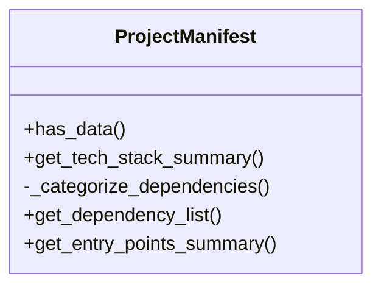

# Manifest Parser Documentation

## File Overview

The `manifest.py` file is responsible for parsing various package manifest files across different programming languages to extract project metadata and dependencies. It serves as a core component in the local_deepwiki system for understanding project structure and technology stack. This file works alongside other components like the [WikiGenerator](wiki.md) to provide contextual information about code repositories.

## Classes

### ProjectManifest

The ProjectManifest class represents the parsed metadata and dependencies from a project's manifest files. It stores information such as project name, version, language, dependencies, and other relevant metadata.

#### Key Methods

- **has_data()**: Checks if any meaningful data was extracted from the manifest
- **get_tech_stack_summary()**: Generates a factual summary of the project's technology stack
- **_categorize_dependencies()**: Internal method to group dependencies by category
- **get_dependency_list()**: Returns a formatted list of dependencies
- **get_entry_points_summary()**: Generates a summary of entry points

## Functions

### parse_manifest

Parses all recognized package manifests in a repository and returns a ProjectManifest object with extracted metadata.

**Parameters:**
- repo_path (Path): Path to the repository root

**Returns:**
- ProjectManifest: Object containing extracted metadata

### _parse_pyproject_toml

Parses pyproject.toml files (Python) to extract project metadata and dependencies.

**Parameters:**
- filepath (Path): Path to the pyproject.toml file
- manifest (ProjectManifest): Manifest object to populate with data

### _parse_setup_py

Parses setup.py files (Python legacy) to extract project metadata.

**Parameters:**
- filepath (Path): Path to the setup.py file
- manifest (ProjectManifest): Manifest object to populate with data

### _parse_requirements_txt

Parses requirements.txt files (Python) to extract dependencies.

**Parameters:**
- filepath (Path): Path to the requirements.txt file
- manifest (ProjectManifest): Manifest object to populate with data

### _parse_package_json

Parses package.json files (Node.js) to extract project metadata and dependencies.

**Parameters:**
- filepath (Path): Path to the package.json file
- manifest (ProjectManifest): Manifest object to populate with data

### _parse_cargo_toml

Parses Cargo.toml files (Rust) to extract project metadata and dependencies.

**Parameters:**
- filepath (Path): Path to the Cargo.toml file
- manifest (ProjectManifest): Manifest object to populate with data

### _parse_go_mod

Parses go.mod files (Go) to extract project metadata and dependencies.

**Parameters:**
- filepath (Path): Path to the go.mod file
- manifest (ProjectManifest): Manifest object to populate with data

### _parse_pom_xml

Parses pom.xml files (Java/Maven) to extract project metadata and dependencies.

**Parameters:**
- filepath (Path): Path to the pom.xml file
- manifest (ProjectManifest): Manifest object to populate with data

### _parse_build_gradle

Parses build.gradle files (Java/Kotlin Gradle) to extract project metadata and dependencies.

**Parameters:**
- filepath (Path): Path to the build.gradle file
- manifest (ProjectManifest): Manifest object to populate with data

### _parse_gemfile

Parses Gemfile files (Ruby) to extract project metadata and dependencies.

**Parameters:**
- filepath (Path): Path to the Gemfile file
- manifest (ProjectManifest): Manifest object to populate with data

### _parse_python_dep

Parses a single Python dependency line to extract name and version.

**Parameters:**
- line (str): Dependency line from requirements.txt

**Returns:**
- tuple: (name, version) of the dependency

### find

Helper function to search for elements in XML with namespace support.

**Parameters:**
- path (str): XML path to search for

**Returns:**
- Element: Found XML element or None

### get_directory_tree

Returns a tree structure of files and directories.

**Parameters:**
- root_path (Path): Root path to start tree traversal

**Returns:**
- dict: Directory tree structure

### should_skip

Determines whether a file or directory should be skipped during traversal.

**Parameters:**
- path (Path): Path to check

**Returns:**
- bool: True if path should be skipped

### traverse

Recursively traverses a directory structure.

**Parameters:**
- root_path (Path): Root path to traverse
- skip_func (callable): Function to determine if path should be skipped

**Returns:**
- list: List of file paths

## Usage Examples

### Basic Usage

```python
from pathlib import Path
from local_deepwiki.generators.manifest import parse_manifest

# Parse a repository
repo_path = Path("/path/to/repo")
manifest = parse_manifest(repo_path)

# Access parsed data
print(f"Project: {manifest.name}")
print(f"Language: {manifest.language}")
print(f"Dependencies: {manifest.dependencies}")
```

### Parsing Specific Manifest

```python
from pathlib import Path
from local_deepwiki.generators.manifest import _parse_pyproject_toml, ProjectManifest

# Parse a specific manifest file
manifest = ProjectManifest()
filepath = Path("pyproject.toml")
_parse_pyproject_toml(filepath, manifest)

print(f"Name: {manifest.name}")
print(f"Version: {manifest.version}")
```

### Getting Tech Stack Summary

```python
from pathlib import Path
from local_deepwiki.generators.manifest import parse_manifest

# Parse manifest and get tech stack summary
repo_path = Path("/path/to/repo")
manifest = parse_manifest(repo_path)
summary = manifest.get_tech_stack_summary()
print(summary)
```

## Related Components

This module works with the [WikiGenerator](wiki.md) to provide contextual information about code repositories. It integrates with the [CodeChunker](../core/chunker.md) to understand project structure and dependencies when generating documentation. The ProjectManifest class serves as a data container that is used throughout the local_deepwiki system for project analysis and documentation generation.

## API Reference

### class `ProjectManifest`

Extracted project metadata from package manifests.

**Methods:**

#### `has_data`

```python
def has_data() -> bool
```

Check if any meaningful data was extracted.

#### `get_tech_stack_summary`

```python
def get_tech_stack_summary() -> str
```

Generate a factual tech stack summary.

#### `get_dependency_list`

```python
def get_dependency_list() -> str
```

Get a formatted list of all dependencies.

#### `get_entry_points_summary`

```python
def get_entry_points_summary() -> str
```

Get a summary of entry points and scripts.


---

### Functions

#### `parse_manifest`

```python
def parse_manifest(repo_path: Path) -> ProjectManifest
```

Parse all recognized package manifests in a repository.


| [Parameter](api_docs.md) | Type | Default | Description |
|-----------|------|---------|-------------|
| `repo_path` | `Path` | - | Path to the repository root. |

**Returns:** `ProjectManifest`


#### `find`

```python
def find(path: str) -> Any
```


| [Parameter](api_docs.md) | Type | Default | Description |
|-----------|------|---------|-------------|
| `path` | `str` | - | - |

**Returns:** `Any`


#### `get_directory_tree`

```python
def get_directory_tree(repo_path: Path, max_depth: int = 3, max_items: int = 50) -> str
```

Generate a directory tree structure for the repository.


| [Parameter](api_docs.md) | Type | Default | Description |
|-----------|------|---------|-------------|
| `repo_path` | `Path` | - | Path to repository root. |
| `max_depth` | `int` | `3` | Maximum depth to traverse. |
| `max_items` | `int` | `50` | Maximum total items to include. |

**Returns:** `str`


#### `should_skip`

```python
def should_skip(name: str) -> bool
```


| [Parameter](api_docs.md) | Type | Default | Description |
|-----------|------|---------|-------------|
| `name` | `str` | - | - |

**Returns:** `bool`


#### `traverse`

```python
def traverse(path: Path, prefix: str, depth: int) -> None
```


| [Parameter](api_docs.md) | Type | Default | Description |
|-----------|------|---------|-------------|
| `path` | `Path` | - | - |
| `prefix` | `str` | - | - |
| `depth` | `int` | - | - |

**Returns:** `None`


## Class Diagram



## Call Graph

```mermaid
flowchart TD
    N0[ProjectManifest]
    N1[_parse_build_gradle]
    N2[_parse_cargo_toml]
    N3[_parse_gemfile]
    N4[_parse_go_mod]
    N5[_parse_package_json]
    N6[_parse_pom_xml]
    N7[_parse_pyproject_toml]
    N8[_parse_python_dep]
    N9[_parse_requirements_txt]
    N10[_parse_setup_py]
    N11[compile]
    N12[exists]
    N13[finditer]
    N14[get_directory_tree]
    N15[getroot]
    N16[group]
    N17[is_dir]
    N18[is_file]
    N19[iterdir]
    N20[loads]
    N21[match]
    N22[parse]
    N23[parse_manifest]
    N24[parser]
    N25[read_text]
    N26[search]
    N27[should_skip]
    N28[splitlines]
    N29[traverse]
    N23 --> N0
    N23 --> N12
    N23 --> N24
    N7 --> N25
    N7 --> N20
    N7 --> N8
    N8 --> N21
    N8 --> N16
    N10 --> N25
    N10 --> N26
    N10 --> N16
    N10 --> N13
    N10 --> N8
    N9 --> N25
    N9 --> N28
    N9 --> N8
    N5 --> N25
    N5 --> N20
    N2 --> N25
    N2 --> N20
    N4 --> N25
    N4 --> N26
    N4 --> N16
    N4 --> N28
    N6 --> N22
    N6 --> N15
    N1 --> N25
    N1 --> N11
    N1 --> N13
    N1 --> N16
    N3 --> N25
    N3 --> N11
    N3 --> N13
    N3 --> N16
    N14 --> N19
    N14 --> N18
    N14 --> N27
    N14 --> N17
    N14 --> N29
    N29 --> N19
    N29 --> N18
    N29 --> N27
    N29 --> N17
    N29 --> N29
    classDef func fill:#e1f5fe
    class N0,N1,N2,N3,N4,N5,N6,N7,N8,N9,N10,N11,N12,N13,N14,N15,N16,N17,N18,N19,N20,N21,N22,N23,N24,N25,N26,N27,N28,N29 func
```



## See Also

- [wiki](wiki.md) - uses this
- [test_manifest](../../../tests/test_manifest.md) - uses this
- [crosslinks](crosslinks.md) - shares 3 dependencies
- [see_also](see_also.md) - shares 3 dependencies
