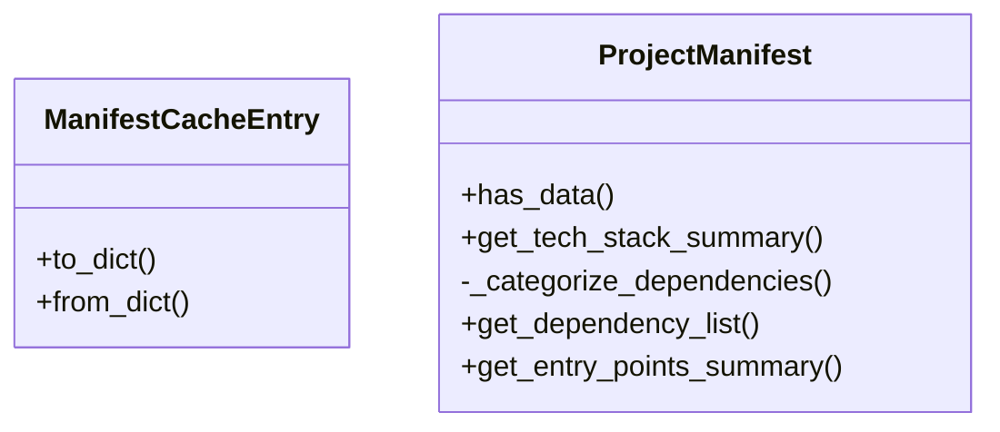

# File Overview

This file provides functionality for parsing and managing project manifests, including support for various manifest formats like `pyproject.toml`, `setup.py`, `requirements.txt`, and `package.json`. It also includes caching mechanisms to improve performance when repeatedly loading manifests.

# Classes

## ManifestCacheEntry

A dataclass representing a cached manifest entry with the following fields:
- `path`: The path to the manifest file
- `mtime`: The last modification time of the manifest file
- `manifest`: The parsed manifest data

## ProjectManifest

A dataclass representing a project manifest with the following fields:
- `name`: The name of the project
- `version`: The version of the project
- `description`: A description of the project
- `dependencies`: A list of dependencies
- `dev_dependencies`: A list of development dependencies
- `license`: The license of the project
- `authors`: A list of authors
- `homepage`: The homepage URL of the project
- `repository`: The repository URL of the project
- `keywords`: A list of keywords
- `readme`: The path to the README file
- `pyproject_toml`: The path to the pyproject.toml file
- `setup_py`: The path to the setup.py file
- `requirements_txt`: The path to the requirements.txt file
- `package_json`: The path to the package.json file
- `metadata`: A dictionary of additional metadata

# Functions

## _get_manifest_mtimes

Retrieves modification times for a list of manifest files.

**Parameters:**
- `manifest_paths`: A list of paths to manifest files

**Returns:**
- A dictionary mapping manifest paths to their modification times

## _is_cache_valid

Checks if the cache is valid based on modification times.

**Parameters:**
- `cache`: A `ManifestCacheEntry` object
- `manifest_paths`: A list of paths to manifest files

**Returns:**
- A boolean indicating whether the cache is valid

## _load_manifest_cache

Loads the manifest cache from a file.

**Parameters:**
- `cache_file`: The path to the cache file

**Returns:**
- A dictionary representing the loaded cache

## _save_manifest_cache

Saves the manifest cache to a file.

**Parameters:**
- `cache_file`: The path to the cache file
- `cache`: A dictionary representing the cache to be saved

## _manifest_to_dict

Converts a `ProjectManifest` object to a dictionary.

**Parameters:**
- `manifest`: A `ProjectManifest` object

**Returns:**
- A dictionary representation of the manifest

## _manifest_from_dict

Converts a dictionary to a `ProjectManifest` object.

**Parameters:**
- `data`: A dictionary representing a manifest

**Returns:**
- A `ProjectManifest` object

## get_cached_manifest

Retrieves a manifest from the cache or parses it if the cache is invalid.

**Parameters:**
- `manifest_paths`: A list of paths to manifest files
- `cache_file`: The path to the cache file

**Returns:**
- A `ProjectManifest` object

## parse_manifest

Parses a list of manifest files and returns a `ProjectManifest` object.

**Parameters:**
- `manifest_paths`: A list of paths to manifest files

**Returns:**
- A `ProjectManifest` object

## _parse_pyproject_toml

Parses a `pyproject.toml` file and extracts project metadata.

**Parameters:**
- `path`: The path to the `pyproject.toml` file

**Returns:**
- A dictionary containing the parsed metadata

## _parse_python_dep

Parses a Python dependency string.

**Parameters:**
- `dep`: A string representing a Python dependency

**Returns:**
- A dictionary containing the dependency's name and version

## _parse_setup_py

Parses a `setup.py` file and extracts project metadata.

**Parameters:**
- `path`: The path to the `setup.py` file

**Returns:**
- A dictionary containing the parsed metadata

## _parse_requirements_txt

Parses a `requirements.txt` file and extracts dependencies.

**Parameters:**
- `path`: The path to the `requirements.txt` file

**Returns:**
- A list of dependencies

## _parse_package_json

Parses a `package.json` file and extracts project metadata.

**Parameters:**
- `path`: The path to the `package.json` file

**Returns:**
- A dictionary containing the parsed metadata

## _parse_project_manifest

Parses a project manifest file and returns a dictionary of metadata.

**Parameters:**
- `path`: The path to the manifest file
- `manifest_type`: The type of the manifest file

**Returns:**
- A dictionary containing the parsed metadata

# Usage Examples

To parse a manifest file:

```python
manifest = parse_manifest(["pyproject.toml"])
```

To get a manifest from cache:

```python
manifest = get_cached_manifest(["pyproject.toml"], "cache.json")
```

To parse a `pyproject.toml` file:

```python
metadata = _parse_pyproject_toml("pyproject.toml")
```

To parse a `setup.py` file:

```python
metadata = _parse_setup_py("setup.py")
```

To parse a `requirements.txt` file:

```python
dependencies = _parse_requirements_txt("requirements.txt")
```

To parse a `package.json` file:

```python
metadata = _parse_package_json("package.json")
```

# Related Components

This file imports and uses:
- `json` and `tomli` for parsing TOML files
- `pathlib.Path` for handling file paths
- `dataclasses.dataclass` for defining structured data
- `local_deepwiki.logging.get_logger` for logging
- `typing.Any` for type annotations

It also references:
- `ManifestCacheEntry` and `ProjectManifest` dataclasses
- The `get_logger` function for logging
- The `tomli` library for TOML parsing

## API Reference

### class `ManifestCacheEntry`

Cache entry storing manifest data and file modification times.

**Methods:**

#### `to_dict`

```python
def to_dict() -> dict[str, Any]
```

Convert to dictionary for JSON serialization.

#### `from_dict`

```python
def from_dict(data: dict[str, Any]) -> "ManifestCacheEntry"
```

Create from dictionary.


| [Parameter](api_docs.md) | Type | Default | Description |
|-----------|------|---------|-------------|
| `data` | `dict[str, Any]` | - | - |


### class `ProjectManifest`

Extracted project metadata from package manifests.

**Methods:**

#### `has_data`

```python
def has_data() -> bool
```

Check if any meaningful data was extracted.

#### `get_tech_stack_summary`

```python
def get_tech_stack_summary() -> str
```

Generate a factual tech stack summary.

#### `get_dependency_list`

```python
def get_dependency_list() -> str
```

Get a formatted list of all dependencies.

#### `get_entry_points_summary`

```python
def get_entry_points_summary() -> str
```

Get a summary of entry points and scripts.


---

### Functions

#### `get_cached_manifest`

```python
def get_cached_manifest(repo_path: Path, cache_dir: Path | None = None) -> ProjectManifest
```

Get project manifest, using cache if available and valid.  This function checks if a cached manifest exists and is still valid (no manifest files have been modified). If valid, returns cached data. Otherwise, parses fresh and updates the cache.


| [Parameter](api_docs.md) | Type | Default | Description |
|-----------|------|---------|-------------|
| `repo_path` | `Path` | - | Path to the repository root. |
| `cache_dir` | `Path | None` | `None` | Directory for cache storage (defaults to repo_path/.deepwiki). |

**Returns:** `ProjectManifest`


#### `parse_manifest`

```python
def parse_manifest(repo_path: Path) -> ProjectManifest
```

Parse all recognized package manifests in a repository.  Note: For incremental updates, prefer get_cached_manifest() which avoids re-parsing when manifest files haven't changed.


| [Parameter](api_docs.md) | Type | Default | Description |
|-----------|------|---------|-------------|
| `repo_path` | `Path` | - | Path to the repository root. |

**Returns:** `ProjectManifest`


#### `find`

```python
def find(path: str) -> Any
```


| [Parameter](api_docs.md) | Type | Default | Description |
|-----------|------|---------|-------------|
| `path` | `str` | - | - |

**Returns:** `Any`


#### `get_directory_tree`

```python
def get_directory_tree(repo_path: Path, max_depth: int = 3, max_items: int = 50) -> str
```

Generate a directory tree structure for the repository.


| [Parameter](api_docs.md) | Type | Default | Description |
|-----------|------|---------|-------------|
| `repo_path` | `Path` | - | Path to repository root. |
| `max_depth` | `int` | `3` | Maximum depth to traverse. |
| `max_items` | `int` | `50` | Maximum total items to include. |

**Returns:** `str`


#### `should_skip`

```python
def should_skip(name: str) -> bool
```


| [Parameter](api_docs.md) | Type | Default | Description |
|-----------|------|---------|-------------|
| `name` | `str` | - | - |

**Returns:** `bool`


#### `traverse`

```python
def traverse(path: Path, prefix: str, depth: int) -> None
```


| [Parameter](api_docs.md) | Type | Default | Description |
|-----------|------|---------|-------------|
| `path` | `Path` | - | - |
| `prefix` | `str` | - | - |
| `depth` | `int` | - | - |

**Returns:** `None`


## Class Diagram



## Call Graph

```mermaid
flowchart TD
    N0[ProjectManifest]
    N1[_get_manifest_mtimes]
    N2[_load_manifest_cache]
    N3[_manifest_from_dict]
    N4[_parse_build_gradle]
    N5[_parse_cargo_toml]
    N6[_parse_gemfile]
    N7[_parse_go_mod]
    N8[_parse_package_json]
    N9[_parse_pom_xml]
    N10[_parse_pyproject_toml]
    N11[_parse_python_dep]
    N12[_parse_requirements_txt]
    N13[_parse_setup_py]
    N14[_save_manifest_cache]
    N15[compile]
    N16[exists]
    N17[finditer]
    N18[get_cached_manifest]
    N19[get_directory_tree]
    N20[group]
    N21[is_file]
    N22[iterdir]
    N23[loads]
    N24[parse_manifest]
    N25[read_text]
    N26[search]
    N27[should_skip]
    N28[splitlines]
    N29[traverse]
    N1 --> N16
    N2 --> N16
    N3 --> N0
    N18 --> N1
    N18 --> N2
    N18 --> N3
    N18 --> N24
    N18 --> N14
    N24 --> N0
    N24 --> N16
    N10 --> N25
    N10 --> N23
    N10 --> N11
    N11 --> N20
    N13 --> N25
    N13 --> N26
    N13 --> N20
    N13 --> N17
    N13 --> N11
    N12 --> N25
    N12 --> N28
    N12 --> N11
    N8 --> N25
    N8 --> N23
    N5 --> N25
    N5 --> N23
    N7 --> N25
    N7 --> N26
    N7 --> N20
    N7 --> N28
    N4 --> N25
    N4 --> N15
    N4 --> N17
    N4 --> N20
    N6 --> N25
    N6 --> N15
    N6 --> N17
    N6 --> N20
    N19 --> N22
    N19 --> N21
    N19 --> N27
    N19 --> N29
    N29 --> N22
    N29 --> N21
    N29 --> N27
    N29 --> N29
    classDef func fill:#e1f5fe
    class N0,N1,N2,N3,N4,N5,N6,N7,N8,N9,N10,N11,N12,N13,N14,N15,N16,N17,N18,N19,N20,N21,N22,N23,N24,N25,N26,N27,N28,N29 func
```



## Relevant Source Files

- `src/local_deepwiki/generators/manifest.py:33-52`

## See Also

- [test_manifest](../../../tests/test_manifest.md) - uses this
- [diagrams](diagrams.md) - shares 4 dependencies
- [vectorstore](../core/vectorstore.md) - shares 4 dependencies
