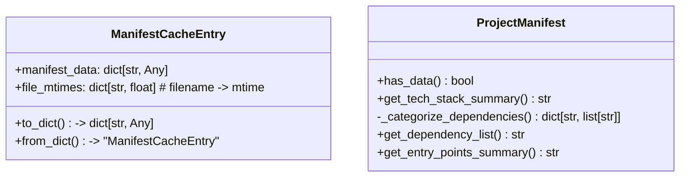

# Manifest Parser Module

This module provides functionality for parsing project manifests from various package management files and caching the results for performance optimization. It supports multiple programming languages and their respective manifest formats.

## File Overview

The manifest module handles the extraction and caching of project metadata from various manifest files including `pyproject.toml`, `setup.py`, `requirements.txt`, `package.json`, and `build.gradle`. It implements a caching system to avoid re-parsing unchanged files and provides a unified interface for accessing project information across different languages and build systems.

## Classes

### ManifestCacheEntry

A dataclass that stores cached manifest data along with file modification times for cache validation.

**Attributes:**
- `manifest_data`: Dictionary containing the parsed manifest information
- `file_mtimes`: Dictionary mapping filenames to their modification times

**Methods:**
- `to_dict()`: Converts the cache entry to a dictionary for JSON serialization
- `from_dict(data)`: Class method that creates a ManifestCacheEntry from a dictionary

### ProjectManifest

A dataclass representing parsed project metadata with support for multiple programming languages.

**Attributes:**
- `name`: Project name
- `version`: Project version
- `description`: Project description
- `language`: Programming language (e.g., "Python", "Java", "Kotlin")
- `language_version`: Version of the programming language
- `dependencies`: Dictionary of runtime dependencies
- `dev_dependencies`: Dictionary of development dependencies
- `entry_points`: Dictionary of entry points/console scripts
- `scripts`: Dictionary of project scripts
- `repository`: Repository URL
- `license`: Project license information

**Methods:**
- `has_data()`: Returns True if the manifest contains any parsed data
- `get_tech_stack_summary()`: Returns a summary of the technology stack
- `get_dependency_list()`: Returns a list of all dependencies
- `get_entry_points_summary()`: Returns a summary of entry points

## Functions

### get_cached_manifest

```python
def get_cached_manifest(repo_path: Path, cache_dir: Path | None = None) -> ProjectManifest
```

Gets project manifest using cache if available and valid. This is the primary function for retrieving manifest data with performance optimization.

**Parameters:**
- `repo_path`: Path to the repository root
- `cache_dir`: Optional directory for cache storage (defaults to `repo_path/.deepwiki`)

**Returns:**
- ProjectManifest with extracted metadata

### parse_manifest

```python
def parse_manifest(repo_path: Path) -> ProjectManifest
```

Parses all recognized package manifests in a repository without using cache. For incremental updates, prefer get_cached_manifest.

**Parameters:**
- `repo_path`: Path to the repository root

**Returns:**
- ProjectManifest with extracted metadata

### Cache Management Functions

#### _load_manifest_cache

```python
def _load_manifest_cache(cache_path: Path) -> ManifestCacheEntry | None
```

Loads manifest cache from disk, returning None if the cache file doesn't exist or is invalid.

#### _save_manifest_cache

```python
def _save_manifest_cache(cache_path: Path, entry: ManifestCacheEntry) -> None
```

Saves manifest cache to disk, creating parent directories as needed.

#### _is_cache_valid

```python
def _is_cache_valid(cache_entry: ManifestCacheEntry, current_mtimes: dict[str, float]) -> bool
```

Validates cached manifest by comparing file modification times.

### Utility Functions

#### _get_manifest_mtimes

```python
def _get_manifest_mtimes(repo_path: Path) -> dict[str, float]
```

Gets modification times for all manifest files in the repository.

#### _manifest_to_dict and _manifest_from_dict

```python
def _manifest_to_dict(manifest: ProjectManifest) -> dict[str, Any]
def _manifest_from_dict(data: dict[str, Any]) -> ProjectManifest
```

Conversion functions for serializing and deserializing ProjectManifest objects.

### Parser Functions

#### _parse_pyproject_toml

```python
def _parse_pyproject_toml(filepath: Path, manifest: ProjectManifest) -> None
```

Parses Python `pyproject.toml` files, extracting project metadata, dependencies, and build configuration.

#### _parse_setup_py

```python
def _parse_setup_py(filepath: Path, manifest: ProjectManifest) -> None
```

Parses legacy Python `setup.py` files using regular expressions to extract project information.

#### _parse_requirements_txt

```python
def _parse_requirements_txt(filepath: Path, manifest: ProjectManifest) -> None
```

Parses Python `requirements.txt` files to extract dependency information.

#### _parse_build_gradle

```python
def _parse_build_gradle(filepath: Path, manifest: ProjectManifest) -> None
```

Parses Gradle build files for Java/Kotlin projects, detecting the language and extracting dependencies.

## Usage Examples

### Basic Usage

```python
from pathlib import Path
from local_deepwiki.generators.manifest import get_cached_manifest

# Get cached manifest (recommended)
repo_path = Path("/path/to/repository")
manifest = get_cached_manifest(repo_path)

print(f"Project: {manifest.name}")
print(f"Language: {manifest.language}")
print(f"Dependencies: {list(manifest.dependencies.keys())}")
```

### Direct Parsing

```python
from local_deepwiki.generators.manifest import parse_manifest

# Parse without cache
manifest = parse_manifest(repo_path)
if manifest.has_data():
    tech_summary = manifest.get_tech_stack_summary()
    print(f"Tech stack: {tech_summary}")
```

### Custom Cache Directory

```python
cache_dir = Path("/custom/cache/location")
manifest = get_cached_manifest(repo_path, cache_dir=cache_dir)
```

## Related Components

This module integrates with:
- `local_deepwiki.logging`: Uses the logging system for debug and warning messages
- Standard library modules: `json`, `pathlib`, `re`, `dataclasses`
- External dependencies: `tomllib`/`tomli` for TOML parsing

The module is designed to work with the broader deepwiki documentation generation system, providing project metadata that can be used by other generators and components.

## API Reference

### class `ManifestCacheEntry`

Cache entry storing manifest data and file modification times.

**Methods:**

#### `to_dict`

```python
def to_dict() -> dict[str, Any]
```

Convert to dictionary for JSON serialization.

#### `from_dict`

```python
def from_dict(data: dict[str, Any]) -> "ManifestCacheEntry"
```

Create from dictionary.


| [Parameter](api_docs.md) | Type | Default | Description |
|-----------|------|---------|-------------|
| `data` | `dict[str, Any]` | - | - |


### class `ProjectManifest`

Extracted project metadata from package manifests.

**Methods:**

#### `has_data`

```python
def has_data() -> bool
```

Check if any meaningful data was extracted.

#### `get_tech_stack_summary`

```python
def get_tech_stack_summary() -> str
```

Generate a factual tech stack summary.

#### `get_dependency_list`

```python
def get_dependency_list() -> str
```

Get a formatted list of all dependencies.

#### `get_entry_points_summary`

```python
def get_entry_points_summary() -> str
```

Get a summary of entry points and scripts.


---

### Functions

#### `get_cached_manifest`

```python
def get_cached_manifest(repo_path: Path, cache_dir: Path | None = None) -> ProjectManifest
```

Get project manifest, using cache if available and valid.  This function checks if a cached manifest exists and is still valid (no manifest files have been modified). If valid, returns cached data. Otherwise, parses fresh and updates the cache.


| [Parameter](api_docs.md) | Type | Default | Description |
|-----------|------|---------|-------------|
| `repo_path` | `Path` | - | Path to the repository root. |
| `cache_dir` | `Path | None` | `None` | Directory for cache storage (defaults to repo_path/.deepwiki). |

**Returns:** `ProjectManifest`


#### `parse_manifest`

```python
def parse_manifest(repo_path: Path) -> ProjectManifest
```

Parse all recognized package manifests in a repository.  Note: For incremental updates, prefer get_cached_manifest() which avoids re-parsing when manifest files haven't changed.


| [Parameter](api_docs.md) | Type | Default | Description |
|-----------|------|---------|-------------|
| `repo_path` | `Path` | - | Path to the repository root. |

**Returns:** `ProjectManifest`


#### `find`

```python
def find(path: str) -> Any
```


| [Parameter](api_docs.md) | Type | Default | Description |
|-----------|------|---------|-------------|
| `path` | `str` | - | - |

**Returns:** `Any`


#### `get_directory_tree`

```python
def get_directory_tree(repo_path: Path, max_depth: int = 3, max_items: int = 50) -> str
```

Generate a directory tree structure for the repository.


| [Parameter](api_docs.md) | Type | Default | Description |
|-----------|------|---------|-------------|
| `repo_path` | `Path` | - | Path to repository root. |
| `max_depth` | `int` | `3` | Maximum depth to traverse. |
| `max_items` | `int` | `50` | Maximum total items to include. |

**Returns:** `str`


#### `should_skip`

```python
def should_skip(name: str) -> bool
```


| [Parameter](api_docs.md) | Type | Default | Description |
|-----------|------|---------|-------------|
| `name` | `str` | - | - |

**Returns:** `bool`


#### `traverse`

```python
def traverse(path: Path, prefix: str, depth: int) -> None
```


| [Parameter](api_docs.md) | Type | Default | Description |
|-----------|------|---------|-------------|
| `path` | `Path` | - | - |
| `prefix` | `str` | - | - |
| `depth` | `int` | - | - |

**Returns:** `None`


## Class Diagram



## Call Graph

```mermaid
flowchart TD
    N0[ProjectManifest]
    N1[_get_manifest_mtimes]
    N2[_load_manifest_cache]
    N3[_manifest_from_dict]
    N4[_parse_build_gradle]
    N5[_parse_cargo_toml]
    N6[_parse_gemfile]
    N7[_parse_go_mod]
    N8[_parse_package_json]
    N9[_parse_pom_xml]
    N10[_parse_pyproject_toml]
    N11[_parse_python_dep]
    N12[_parse_requirements_txt]
    N13[_parse_setup_py]
    N14[_save_manifest_cache]
    N15[compile]
    N16[exists]
    N17[finditer]
    N18[get_cached_manifest]
    N19[get_directory_tree]
    N20[group]
    N21[is_file]
    N22[iterdir]
    N23[loads]
    N24[parse_manifest]
    N25[read_text]
    N26[search]
    N27[should_skip]
    N28[splitlines]
    N29[traverse]
    N1 --> N16
    N2 --> N16
    N3 --> N0
    N18 --> N1
    N18 --> N2
    N18 --> N3
    N18 --> N24
    N18 --> N14
    N24 --> N0
    N24 --> N16
    N10 --> N25
    N10 --> N23
    N10 --> N11
    N11 --> N20
    N13 --> N25
    N13 --> N26
    N13 --> N20
    N13 --> N17
    N13 --> N11
    N12 --> N25
    N12 --> N28
    N12 --> N11
    N8 --> N25
    N8 --> N23
    N5 --> N25
    N5 --> N23
    N7 --> N25
    N7 --> N26
    N7 --> N20
    N7 --> N28
    N4 --> N25
    N4 --> N15
    N4 --> N17
    N4 --> N20
    N6 --> N25
    N6 --> N15
    N6 --> N17
    N6 --> N20
    N19 --> N22
    N19 --> N21
    N19 --> N27
    N19 --> N29
    N29 --> N22
    N29 --> N21
    N29 --> N27
    N29 --> N29
    classDef func fill:#e1f5fe
    class N0,N1,N2,N3,N4,N5,N6,N7,N8,N9,N10,N11,N12,N13,N14,N15,N16,N17,N18,N19,N20,N21,N22,N23,N24,N25,N26,N27,N28,N29 func
```



## Usage Examples

*Examples extracted from test files*

### Empty manifest has no data

From `test_manifest.py::test_has_data_empty`:

```python
manifest = ProjectManifest()
assert not manifest.has_data()
```

### Empty manifest has no data

From `test_manifest.py::test_has_data_empty`:

```python
manifest = ProjectManifest()
assert not manifest.has_data()
```

### Empty manifest has no data

From `test_manifest.py::test_has_data_empty`:

```python
assert not manifest.has_data()
```

### Manifest with name has data

From `test_manifest.py::test_has_data_with_name`:

```python
manifest = ProjectManifest(name="test-project")
assert manifest.has_data()
```

### Manifest with name has data

From `test_manifest.py::test_has_data_with_name`:

```python
manifest = ProjectManifest(name="test-project")
assert manifest.has_data()
```

## Relevant Source Files

- `src/local_deepwiki/generators/manifest.py:33-52`
