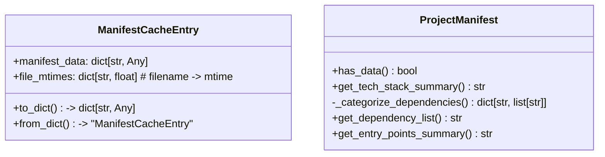

# File: `src/local_deepwiki/generators/manifest.py`

## File Overview

This file provides functionality to parse project manifest files and extract metadata about a project's dependencies, entry points, and other technical details. It serves as a core component for understanding project structure and technology stack, which is essential for grounding LLM-based documentation generation and reducing hallucinations.

The module is designed to work with various package manifest formats (e.g., `package.json`, `requirements.txt`, `pyproject.toml`) and uses a caching mechanism to avoid re-parsing when manifest files haven't changed.

## Key Concepts

### Manifest Parsing Strategy

The system employs a **parser prioritization strategy** to determine which manifest file to parse first. This is implemented by iterating through a predefined list of parsers in order of preference. The `parse_manifest` function attempts to parse each supported manifest file, and upon success, adds it to the list of parsed manifest files. This approach allows for flexibility in multi-language projects where multiple manifest files may be present.

### Caching Mechanism

To optimize performance, this module implements a **cache invalidation system** using file modification times. The `get_cached_manifest` function checks if a cached manifest exists and whether any of the manifest files have been modified since the cache was created. If the cache is still valid, it returns the cached data; otherwise, it re-parses the manifests and updates the cache.

The cache uses a `ManifestCacheEntry` object that stores both the parsed manifest data and a mapping of file paths to their modification times (`file_mtimes`). This ensures that the cache is invalidated not only when files change but also when files are added or removed.

### Dependency Categorization

Dependencies are categorized into meaningful groups (e.g., Web Framework, Database, Testing) using heuristics based on known package names. This categorization supports generating a concise and informative tech stack summary via the `get_tech_stack_summary` method.

## Integration

This module integrates with the broader `local_deepwiki` codebase as part of the documentation generation pipeline. It is used by CLI tools such as `check_cli.py`, `status_cli.py`, and `main.py`, and is directly imported by `manifest_parsers.py` which contains the actual parsing logic for individual manifest formats.

The `ProjectManifest` class is consumed by components like `onboarding` and `manifest_parsers`, and its methods like `get_tech_stack_summary` and `get_dependency_list` are used to format output for users or LLM prompts. The caching logic is used by `check_cli` and test suites via `get_cached_manifest`.

It relies on `dir_tree.py` for directory traversal and file listing, and imports various parser functions from `manifest_parsers.py` to extract data from different manifest formats.

## Design Notes

### Why Use Caching?

Caching is crucial for performance, especially in large repositories where manifest parsing can be computationally expensive. By caching results and checking modification times, we avoid unnecessary re-parsing while ensuring that changes to manifests are properly reflected.

### Why Use `dataclass` for `ManifestCacheEntry`?

`ManifestCacheEntry` is implemented as a `dataclass` to simplify serialization and deserialization logic. It cleanly separates the cached manifest data from file modification times, which is required for cache validation.

### Handling Parser Failures

When a manifest parser fails (e.g., due to malformed content), the system logs a warning and continues processing other manifest files. This robustness ensures that one corrupted manifest does not prevent extraction of information from others.

### Why Not Use `__slots__`?

The `ProjectManifest` class does not use `__slots__` because it is designed to be flexible and extensible, with many optional fields. Using `__slots__` would make it harder to dynamically add new fields or support future manifest formats.

### File Path Handling

All file paths are handled using `pathlib.Path`, which provides cross-platform compatibility and simplifies path manipulation. This is especially important when working with Git repositories across different operating systems.

### JSON Serialization

The module uses standard Python `json` for serializing and deserializing cache entries and manifest data. This choice provides simplicity and broad compatibility, though it requires careful handling of non-serializable types (e.g., `Path` objects are not JSON serializable, so they are excluded from the cache).

## API Reference

### class `ManifestCacheEntry`

Cache entry storing manifest data and file modification times.

**Methods:**


<details>
<summary>View Source (lines 54-73) | <a href="https://github.com/UrbanDiver/local-deepwiki-mcp/blob/main/src/local_deepwiki/generators/manifest.py#L54-L73">GitHub</a></summary>

```python
class ManifestCacheEntry:
    """Cache entry storing manifest data and file modification times."""

    manifest_data: dict[str, Any]
    file_mtimes: dict[str, float]  # filename -> mtime

    def to_dict(self) -> dict[str, Any]:
        """Convert to dictionary for JSON serialization."""
        return {
            "manifest_data": self.manifest_data,
            "file_mtimes": self.file_mtimes,
        }

    @classmethod
    def from_dict(cls, data: dict[str, Any]) -> "ManifestCacheEntry":
        """Create from dictionary."""
        return cls(
            manifest_data=data.get("manifest_data", {}),
            file_mtimes=data.get("file_mtimes", {}),
        )
```

</details>

#### `to_dict`

```python
def to_dict() -> dict[str, Any]
```

Convert to dictionary for JSON serialization.


<details>
<summary>View Source (lines 54-73) | <a href="https://github.com/UrbanDiver/local-deepwiki-mcp/blob/main/src/local_deepwiki/generators/manifest.py#L54-L73">GitHub</a></summary>

```python
class ManifestCacheEntry:
    """Cache entry storing manifest data and file modification times."""

    manifest_data: dict[str, Any]
    file_mtimes: dict[str, float]  # filename -> mtime

    def to_dict(self) -> dict[str, Any]:
        """Convert to dictionary for JSON serialization."""
        return {
            "manifest_data": self.manifest_data,
            "file_mtimes": self.file_mtimes,
        }

    @classmethod
    def from_dict(cls, data: dict[str, Any]) -> "ManifestCacheEntry":
        """Create from dictionary."""
        return cls(
            manifest_data=data.get("manifest_data", {}),
            file_mtimes=data.get("file_mtimes", {}),
        )
```

</details>

#### `from_dict`

```python
def from_dict(data: dict[str, Any]) -> "ManifestCacheEntry"
```

Create from dictionary.


| Parameter | Type | Default | Description |
|-----------|------|---------|-------------|
| `data` | `dict[str, Any]` | - | - |


<details>
<summary>View Source (lines 54-73) | <a href="https://github.com/UrbanDiver/local-deepwiki-mcp/blob/main/src/local_deepwiki/generators/manifest.py#L54-L73">GitHub</a></summary>

```python
class ManifestCacheEntry:
    """Cache entry storing manifest data and file modification times."""

    manifest_data: dict[str, Any]
    file_mtimes: dict[str, float]  # filename -> mtime

    def to_dict(self) -> dict[str, Any]:
        """Convert to dictionary for JSON serialization."""
        return {
            "manifest_data": self.manifest_data,
            "file_mtimes": self.file_mtimes,
        }

    @classmethod
    def from_dict(cls, data: dict[str, Any]) -> "ManifestCacheEntry":
        """Create from dictionary."""
        return cls(
            manifest_data=data.get("manifest_data", {}),
            file_mtimes=data.get("file_mtimes", {}),
        )
```

</details>

### class `ProjectManifest`

Extracted project metadata from package manifests.

**Methods:**


<details>
<summary>View Source (lines 77-228) | <a href="https://github.com/UrbanDiver/local-deepwiki-mcp/blob/main/src/local_deepwiki/generators/manifest.py#L77-L228">GitHub</a></summary>

```python
class ProjectManifest:
    # Methods: has_data, get_tech_stack_summary, _categorize_dependencies, get_dependency_list, get_entry_points_summary
```

</details>

#### `has_data`

```python
def has_data() -> bool
```

Check if any meaningful data was extracted.


<details>
<summary>View Source (lines 102-106) | <a href="https://github.com/UrbanDiver/local-deepwiki-mcp/blob/main/src/local_deepwiki/generators/manifest.py#L102-L106">GitHub</a></summary>

```python
def has_data(self) -> bool:
        """Check if any meaningful data was extracted."""
        return bool(
            self.name or self.dependencies or self.dev_dependencies or self.entry_points
        )
```

</details>

#### `get_tech_stack_summary`

```python
def get_tech_stack_summary() -> str
```

Generate a factual tech stack summary.


<details>
<summary>View Source (lines 108-125) | <a href="https://github.com/UrbanDiver/local-deepwiki-mcp/blob/main/src/local_deepwiki/generators/manifest.py#L108-L125">GitHub</a></summary>

```python
def get_tech_stack_summary(self) -> str:
        """Generate a factual tech stack summary."""
        lines = []

        if self.language:
            version_str = f" {self.language_version}" if self.language_version else ""
            lines.append(f"- **{self.language}{version_str}**")

        # Group dependencies by category (infer from common packages)
        categorized = self._categorize_dependencies()
        for category, deps in categorized.items():
            if deps:
                dep_list = ", ".join(sorted(deps)[:5])
                if len(deps) > 5:
                    dep_list += f" (+{len(deps) - 5} more)"
                lines.append(f"- **{category}**: {dep_list}")

        return "\n".join(lines) if lines else "No package manifest found."
```

</details>

#### `get_dependency_list`

```python
def get_dependency_list() -> str
```

Get a formatted list of all dependencies.


<details>
<summary>View Source (lines 194-210) | <a href="https://github.com/UrbanDiver/local-deepwiki-mcp/blob/main/src/local_deepwiki/generators/manifest.py#L194-L210">GitHub</a></summary>

```python
def get_dependency_list(self) -> str:
        """Get a formatted list of all dependencies."""
        lines = []

        if self.dependencies:
            lines.append("### Dependencies\n")
            for name, version in sorted(self.dependencies.items()):
                version_str = f" ({version})" if version and version != "*" else ""
                lines.append(f"- {name}{version_str}")

        if self.dev_dependencies:
            lines.append("\n### Dev Dependencies\n")
            for name, version in sorted(self.dev_dependencies.items()):
                version_str = f" ({version})" if version and version != "*" else ""
                lines.append(f"- {name}{version_str}")

        return "\n".join(lines) if lines else ""
```

</details>

#### `get_entry_points_summary`

```python
def get_entry_points_summary() -> str
```

Get a summary of entry points and scripts.


---


<details>
<summary>View Source (lines 212-228) | <a href="https://github.com/UrbanDiver/local-deepwiki-mcp/blob/main/src/local_deepwiki/generators/manifest.py#L212-L228">GitHub</a></summary>

```python
def get_entry_points_summary(self) -> str:
        """Get a summary of entry points and scripts."""
        lines = []

        if self.entry_points:
            lines.append("### CLI Commands\n")
            for name, target in sorted(self.entry_points.items()):
                lines.append(f"- `{name}` → {target}")

        if self.scripts:
            lines.append("\n### Scripts\n")
            for name, cmd in sorted(self.scripts.items()):
                # Truncate long commands
                cmd_display = cmd if len(cmd) < 60 else cmd[:57] + "..."
                lines.append(f"- `{name}`: {cmd_display}")

        return "\n".join(lines) if lines else ""
```

</details>

### Functions

#### `get_cached_manifest`

```python
def get_cached_manifest(repo_path: Path, cache_dir: Path | None = None) -> ProjectManifest
```

Get project manifest, using cache if available and valid.  This function checks if a cached manifest exists and is still valid (no manifest files have been modified). If valid, returns cached data. Otherwise, parses fresh and updates the cache.


| Parameter | Type | Default | Description |
|-----------|------|---------|-------------|
| `repo_path` | `Path` | - | Path to the repository root. |
| `cache_dir` | `Path | None` | `None` | Directory for cache storage (defaults to repo_path/.deepwiki). |

**Returns:** `ProjectManifest`


<details>
<summary>View Source (lines 366-407) | <a href="https://github.com/UrbanDiver/local-deepwiki-mcp/blob/main/src/local_deepwiki/generators/manifest.py#L366-L407">GitHub</a></summary>

```python
def get_cached_manifest(
    repo_path: Path, cache_dir: Path | None = None
) -> ProjectManifest:
    """Get project manifest, using cache if available and valid.

    This function checks if a cached manifest exists and is still valid
    (no manifest files have been modified). If valid, returns cached data.
    Otherwise, parses fresh and updates the cache.

    Args:
        repo_path: Path to the repository root.
        cache_dir: Directory for cache storage (defaults to repo_path/.deepwiki).

    Returns:
        ProjectManifest with extracted metadata.
    """
    if cache_dir is None:
        cache_dir = repo_path / ".deepwiki"

    cache_path = cache_dir / "manifest_cache.json"

    # Get current modification times
    current_mtimes = _get_manifest_mtimes(repo_path)

    # Try to use cache
    cache_entry = _load_manifest_cache(cache_path)
    if cache_entry is not None and _is_cache_valid(cache_entry, current_mtimes):
        logger.debug("Using cached manifest data")
        return _manifest_from_dict(cache_entry.manifest_data)

    # Parse fresh
    logger.debug("Parsing manifest files (cache miss or invalid)")
    manifest = parse_manifest(repo_path)

    # Save to cache
    new_entry = ManifestCacheEntry(
        manifest_data=_manifest_to_dict(manifest),
        file_mtimes=current_mtimes,
    )
    _save_manifest_cache(cache_path, new_entry)

    return manifest
```

</details>

#### `parse_manifest`

```python
def parse_manifest(repo_path: Path) -> ProjectManifest
```

Parse all recognized package manifests in a repository.  Note: For incremental updates, prefer get_cached_manifest() which avoids re-parsing when manifest files haven't changed.


| Parameter | Type | Default | Description |
|-----------|------|---------|-------------|
| `repo_path` | `Path` | - | Path to the repository root. |

**Returns:** `ProjectManifest`


<details>
<summary>View Source (lines 410-450) | <a href="https://github.com/UrbanDiver/local-deepwiki-mcp/blob/main/src/local_deepwiki/generators/manifest.py#L410-L450">GitHub</a></summary>

```python
def parse_manifest(repo_path: Path) -> ProjectManifest:
    """Parse all recognized package manifests in a repository.

    Note: For incremental updates, prefer get_cached_manifest() which
    avoids re-parsing when manifest files haven't changed.

    Args:
        repo_path: Path to the repository root.

    Returns:
        ProjectManifest with extracted metadata.
    """
    manifest = ProjectManifest()

    # Try each parser in order of preference
    parsers = [
        ("pyproject.toml", _parse_pyproject_toml),
        ("setup.py", _parse_setup_py),
        ("requirements.txt", _parse_requirements_txt),
        ("package.json", _parse_package_json),
        ("Cargo.toml", _parse_cargo_toml),
        ("go.mod", _parse_go_mod),
        ("pom.xml", _parse_pom_xml),
        ("build.gradle", _parse_build_gradle),
        ("Gemfile", _parse_gemfile),
    ]

    for filename, parser in parsers:
        filepath = repo_path / filename
        if filepath.exists():
            try:
                parser(filepath, manifest)
                manifest.manifest_files.append(filename)
            except (OSError, ValueError, KeyError, TypeError) as e:
                # OSError: File read issues
                # ValueError: Invalid file content or format
                # KeyError/TypeError: Missing or invalid fields
                # Skip files that fail to parse but log the issue
                logger.warning("Failed to parse manifest file %s: %s", filename, e)

    return manifest
```

</details>

## Class Diagram


```mermaid
classDiagram
    class ManifestCacheEntry {
        +manifest_data: dict[str, Any]
        +file_mtimes: dict[str, float]  # filename -> mtime
        +to_dict() -> dict[str, Any]
        +from_dict() -> "ManifestCacheEntry"
    }
    class ProjectManifest {
        +has_data() bool
        +get_tech_stack_summary() str
        -_categorize_dependencies() dict[str, list[str]]
        +get_dependency_list() str
        +get_entry_points_summary() str
    }
```

## Call Graph


```mermaid
flowchart TD
    N0[ManifestCacheEntry]
    N1[ManifestCacheEntry.from_dict]
    N2[ProjectManifest]
    N3[ProjectManifest.get_tech_st...]
    N4[_categorize_dependencies]
    N5[_get_manifest_mtimes]
    N6[_is_cache_valid]
    N7[_load_manifest_cache]
    N8[_manifest_from_dict]
    N9[_manifest_to_dict]
    N10[_save_manifest_cache]
    N11[cls]
    N12[dump]
    N13[exists]
    N14[from_dict]
    N15[get_cached_manifest]
    N16[load]
    N17[mkdir]
    N18[parse_manifest]
    N19[parser]
    N20[stat]
    N21[to_dict]
    N5 --> N13
    N5 --> N20
    N7 --> N13
    N7 --> N16
    N7 --> N14
    N10 --> N17
    N10 --> N12
    N10 --> N21
    N8 --> N2
    N15 --> N5
    N15 --> N7
    N15 --> N6
    N15 --> N8
    N15 --> N18
    N15 --> N0
    N15 --> N9
    N15 --> N10
    N18 --> N2
    N18 --> N13
    N18 --> N19
    N1 --> N11
    N3 --> N4
    classDef func fill:#e1f5fe
    class N0,N2,N4,N5,N6,N7,N8,N9,N10,N11,N12,N13,N14,N15,N16,N17,N18,N19,N20,N21 func
    classDef method fill:#fff3e0
    class N1,N3 method
```

## Used By

Functions and methods in this file and their callers:

- **`ManifestCacheEntry`**: called by `get_cached_manifest`
- **`ProjectManifest`**: called by `_manifest_from_dict`, `parse_manifest`
- **`_categorize_dependencies`**: called by `ProjectManifest.get_tech_stack_summary`
- **`_get_manifest_mtimes`**: called by `get_cached_manifest`
- **`_is_cache_valid`**: called by `get_cached_manifest`
- **`_load_manifest_cache`**: called by `get_cached_manifest`
- **`_manifest_from_dict`**: called by `get_cached_manifest`
- **`_manifest_to_dict`**: called by `get_cached_manifest`
- **`_save_manifest_cache`**: called by `get_cached_manifest`
- **`cls`**: called by `ManifestCacheEntry.from_dict`
- **`dump`**: called by `_save_manifest_cache`
- **`exists`**: called by `_get_manifest_mtimes`, `_load_manifest_cache`, `parse_manifest`
- **`from_dict`**: called by `_load_manifest_cache`
- **`load`**: called by `_load_manifest_cache`
- **`mkdir`**: called by `_save_manifest_cache`
- **`parse_manifest`**: called by `get_cached_manifest`
- **`parser`**: called by `parse_manifest`
- **`stat`**: called by `_get_manifest_mtimes`
- **`to_dict`**: called by `_save_manifest_cache`

## Usage Examples

*Examples extracted from test files*

### Empty manifest has no data

From `test_manifest.py::TestProjectManifest::test_has_data_empty`:

```python
manifest = ProjectManifest()
assert not manifest.has_data()
```

### Empty manifest has no data

From `test_manifest.py::TestProjectManifest::test_has_data_empty`:

```python
manifest = ProjectManifest()
assert not manifest.has_data()
```

### Empty manifest has no data

From `test_manifest.py::TestProjectManifest::test_has_data_empty`:

```python
manifest = ProjectManifest()
assert not manifest.has_data()
```

### Manifest with name has data

From `test_manifest.py::TestProjectManifest::test_has_data_with_name`:

```python
manifest = ProjectManifest(name="test-project")
assert manifest.has_data()
```

### Manifest with name has data

From `test_manifest.py::TestProjectManifest::test_has_data_with_name`:

```python
manifest = ProjectManifest(name="test-project")
assert manifest.has_data()
```


## Last Modified

| Entity | Type | Author | Date | Commit |
|--------|------|--------|------|--------|
| `_is_cache_valid` | function | Brian Breidenbach | Feb 20, 2026 | `b807417` refactor: high-priority Pyt... |
| `_get_manifest_mtimes` | function | Brian Breidenbach | Feb 11, 2026 | `ba96da1` fix: publication plan P0-P2... |
| `_load_manifest_cache` | function | Brian Breidenbach | Feb 11, 2026 | `ba96da1` fix: publication plan P0-P2... |
| `_save_manifest_cache` | function | Brian Breidenbach | Feb 11, 2026 | `ba96da1` fix: publication plan P0-P2... |
| `parse_manifest` | function | Brian Breidenbach | Feb 11, 2026 | `ba96da1` fix: publication plan P0-P2... |
| `ProjectManifest` | class | Brian Breidenbach | Feb 09, 2026 | `c79a754` fix: improve type safety ac... |
| `has_data` | method | Brian Breidenbach | Feb 09, 2026 | `c79a754` fix: improve type safety ac... |
| `get_cached_manifest` | function | Brian Breidenbach | Feb 09, 2026 | `c79a754` fix: improve type safety ac... |
| `ManifestCacheEntry` | class | Brian Breidenbach | Jan 13, 2026 | `c568951` Add input validation, type ... |
| `_categorize_dependencies` | method | Brian Breidenbach | Jan 13, 2026 | `c568951` Add input validation, type ... |
| `_manifest_to_dict` | function | Brian Breidenbach | Jan 13, 2026 | `c568951` Add input validation, type ... |
| `_manifest_from_dict` | function | Brian Breidenbach | Jan 13, 2026 | `c568951` Add input validation, type ... |
| `get_tech_stack_summary` | method | Brian Breidenbach | Jan 12, 2026 | `d159315` Add manifest parsing to red... |
| `get_dependency_list` | method | Brian Breidenbach | Jan 12, 2026 | `d159315` Add manifest parsing to red... |
| `get_entry_points_summary` | method | Brian Breidenbach | Jan 12, 2026 | `d159315` Add manifest parsing to red... |

## Additional Source Code

Source code for functions and methods not listed in the API Reference above.

#### `_categorize_dependencies`

<details>
<summary>View Source (lines 127-192) | <a href="https://github.com/UrbanDiver/local-deepwiki-mcp/blob/main/src/local_deepwiki/generators/manifest.py#L127-L192">GitHub</a></summary>

```python
def _categorize_dependencies(self) -> dict[str, list[str]]:
        """Categorize dependencies by their purpose."""
        categories: dict[str, list[str]] = {
            "Web Framework": [],
            "Database": [],
            "Testing": [],
            "CLI": [],
            "AI/ML": [],
            "Other": [],
        }

        # Known package categories
        web_frameworks = {
            "flask",
            "fastapi",
            "django",
            "starlette",
            "aiohttp",
            "tornado",
            "express",
            "koa",
            "hapi",
        }
        databases = {
            "sqlalchemy",
            "pymongo",
            "redis",
            "lancedb",
            "chromadb",
            "psycopg2",
            "mysql",
            "sqlite",
            "prisma",
            "typeorm",
            "sequelize",
        }
        testing = {"pytest", "unittest", "nose", "jest", "mocha", "vitest"}
        cli = {"click", "typer", "argparse", "commander", "yargs"}
        ai_ml = {
            "openai",
            "anthropic",
            "langchain",
            "transformers",
            "torch",
            "tensorflow",
            "sentence-transformers",
            "ollama",
        }

        for dep in self.dependencies:
            dep_lower = dep.lower().replace("-", "").replace("_", "")
            if any(fw in dep_lower for fw in web_frameworks):
                categories["Web Framework"].append(dep)
            elif any(db in dep_lower for db in databases):
                categories["Database"].append(dep)
            elif any(t in dep_lower for t in testing):
                categories["Testing"].append(dep)
            elif any(c in dep_lower for c in cli):
                categories["CLI"].append(dep)
            elif any(ai in dep_lower for ai in ai_ml):
                categories["AI/ML"].append(dep)
            else:
                categories["Other"].append(dep)

        # Remove empty categories
        return {k: v for k, v in categories.items() if v}
```

</details>


#### `_get_manifest_mtimes`

<details>
<summary>View Source (lines 231-249) | <a href="https://github.com/UrbanDiver/local-deepwiki-mcp/blob/main/src/local_deepwiki/generators/manifest.py#L231-L249">GitHub</a></summary>

```python
def _get_manifest_mtimes(repo_path: Path) -> dict[str, float]:
    """Get modification times for all manifest files.

    Args:
        repo_path: Path to the repository root.

    Returns:
        Dictionary mapping filename to modification time (0 if file doesn't exist).
    """
    mtimes = {}
    for filename in MANIFEST_FILES:
        filepath = repo_path / filename
        if filepath.exists():
            try:
                mtimes[filename] = filepath.stat().st_mtime
            except OSError as e:
                logger.debug("Could not get mtime for %s: %s", filename, e)
                mtimes[filename] = 0
    return mtimes
```

</details>


#### `_is_cache_valid`

<details>
<summary>View Source (lines 252-283) | <a href="https://github.com/UrbanDiver/local-deepwiki-mcp/blob/main/src/local_deepwiki/generators/manifest.py#L252-L283">GitHub</a></summary>

```python
def _is_cache_valid(
    cache_entry: ManifestCacheEntry, current_mtimes: dict[str, float]
) -> bool:
    """Check if cached manifest is still valid.

    Args:
        cache_entry: The cached manifest entry.
        current_mtimes: Current modification times of manifest files.

    Returns:
        True if cache is valid, False if any file has changed.
    """
    # Check if same set of files exist
    cached_files = set(cache_entry.file_mtimes.keys())
    current_files = set(current_mtimes.keys())

    if cached_files != current_files:
        logger.debug(
            "Manifest cache invalid: file set changed (%s vs %s)",
            cached_files,
            current_files,
        )
        return False

    # Check if any file has been modified
    for filename, cached_mtime in cache_entry.file_mtimes.items():
        current_mtime = current_mtimes.get(filename, 0)
        if cached_mtime != current_mtime:
            logger.debug("Manifest cache invalid: %s modified", filename)
            return False

    return True
```

</details>


#### `_load_manifest_cache`

<details>
<summary>View Source (lines 286-307) | <a href="https://github.com/UrbanDiver/local-deepwiki-mcp/blob/main/src/local_deepwiki/generators/manifest.py#L286-L307">GitHub</a></summary>

```python
def _load_manifest_cache(cache_path: Path) -> ManifestCacheEntry | None:
    """Load manifest cache from disk.

    Args:
        cache_path: Path to the cache file.

    Returns:
        ManifestCacheEntry or None if not found/invalid.
    """
    if not cache_path.exists():
        return None

    try:
        with open(cache_path) as f:
            data = json.load(f)
        return ManifestCacheEntry.from_dict(data)
    except (json.JSONDecodeError, OSError, KeyError, TypeError) as e:
        # json.JSONDecodeError: Corrupted or invalid JSON
        # OSError: File read issues
        # KeyError/TypeError: Invalid cache structure
        logger.debug("Could not load manifest cache: %s", e)
        return None
```

</details>


#### `_save_manifest_cache`

<details>
<summary>View Source (lines 310-325) | <a href="https://github.com/UrbanDiver/local-deepwiki-mcp/blob/main/src/local_deepwiki/generators/manifest.py#L310-L325">GitHub</a></summary>

```python
def _save_manifest_cache(cache_path: Path, entry: ManifestCacheEntry) -> None:
    """Save manifest cache to disk.

    Args:
        cache_path: Path to the cache file.
        entry: The cache entry to save.
    """
    try:
        cache_path.parent.mkdir(parents=True, exist_ok=True)
        with open(cache_path, "w") as f:
            json.dump(entry.to_dict(), f, indent=2)
        logger.debug("Saved manifest cache to %s", cache_path)
    except (OSError, TypeError) as e:
        # OSError: File write or directory creation issues
        # TypeError: Unserializable data in cache entry
        logger.warning("Could not save manifest cache: %s", e)
```

</details>


#### `_manifest_to_dict`

<details>
<summary>View Source (lines 328-344) | <a href="https://github.com/UrbanDiver/local-deepwiki-mcp/blob/main/src/local_deepwiki/generators/manifest.py#L328-L344">GitHub</a></summary>

```python
def _manifest_to_dict(manifest: "ProjectManifest") -> dict[str, Any]:
    """Convert ProjectManifest to dictionary for caching."""
    return {
        "name": manifest.name,
        "version": manifest.version,
        "description": manifest.description,
        "language": manifest.language,
        "language_version": manifest.language_version,
        "dependencies": manifest.dependencies,
        "dev_dependencies": manifest.dev_dependencies,
        "entry_points": manifest.entry_points,
        "scripts": manifest.scripts,
        "repository": manifest.repository,
        "license": manifest.license,
        "authors": manifest.authors,
        "manifest_files": manifest.manifest_files,
    }
```

</details>


#### `_manifest_from_dict`

<details>
<summary>View Source (lines 347-363) | <a href="https://github.com/UrbanDiver/local-deepwiki-mcp/blob/main/src/local_deepwiki/generators/manifest.py#L347-L363">GitHub</a></summary>

```python
def _manifest_from_dict(data: dict[str, Any]) -> "ProjectManifest":
    """Create ProjectManifest from dictionary."""
    return ProjectManifest(
        name=data.get("name"),
        version=data.get("version"),
        description=data.get("description"),
        language=data.get("language"),
        language_version=data.get("language_version"),
        dependencies=data.get("dependencies", {}),
        dev_dependencies=data.get("dev_dependencies", {}),
        entry_points=data.get("entry_points", {}),
        scripts=data.get("scripts", {}),
        repository=data.get("repository"),
        license=data.get("license"),
        authors=data.get("authors", []),
        manifest_files=data.get("manifest_files", []),
    )
```

</details>

## Relevant Source Files

- `src/local_deepwiki/generators/manifest.py:54-73`
