# File: `src/local_deepwiki/generators/manifest_parsers.py`

## File Overview

This file provides language-specific parsers for various project manifest formats. Its primary responsibility is to extract metadata from package manifests and populate a [`ProjectManifest`](manifest.md) object with that information. This allows the tool to understand project structure, dependencies, and metadata regardless of the language or build system used.

The parsers support a wide range of formats including Python's `pyproject.toml`, `setup.py`, and `requirements.txt`; Node.js's `package.json`; Rust's `Cargo.toml`; Go's `go.mod`; Java's `pom.xml` and Gradle's `build.gradle`; and Ruby's `Gemfile`.

## Key Concepts

### Manifest Abstraction
The core abstraction used throughout this file is the [`ProjectManifest`](manifest.md) class. It serves as a unified representation of project metadata across different languages and formats. This design choice allows downstream components like the CLI or core logic to work with a consistent interface regardless of how the project was originally defined.

### Parsing Strategy
Each parser function follows a consistent pattern:
1. Read and parse the file content.
2. Extract relevant fields (name, version, dependencies, etc.).
3. Populate the [`ProjectManifest`](manifest.md) object with extracted values.

For formats like `pyproject.toml` and `Cargo.toml`, which support multiple sections (e.g., `[project]` and `[tool.poetry]`), parsers use helper functions (`_populate_pyproject_standard`, `_populate_pyproject_poetry`) to handle different sections cleanly.

### Regular Expression Usage
Regular expressions are used extensively for parsing text-based formats such as `setup.py`, `requirements.txt`, `go.mod`, `build.gradle`, and `Gemfile`. These patterns are tailored to match specific dependency formats, such as `package>=1.0` or `gem 'name', 'version'`, ensuring accurate extraction of package names and versions.

### XML Handling
For XML-based formats like `pom.xml`, the file uses `xml.etree.ElementTree` with namespace-aware element finding. The `_pom_find` helper function ensures compatibility with both namespaced and non-namespaced elements, improving robustness when parsing Maven POM files.

## Integration

This file is part of the `local_deepwiki.generators` module and integrates deeply with the manifest generation pipeline. It is used by:
- The [`ProjectManifest`](manifest.md) class to parse various manifest files
- Test files (`test_manifest.py`) to validate parsing logic
- CLI modules (`check_cli.py`, `main.py`, etc.) to analyze projects

The parsers are invoked from higher-level functions within the manifest generation logic, enabling the tool to automatically detect and parse project metadata from common project files.

## Design Notes

### Handling Ambiguous Metadata
In cases where metadata can come from multiple sources (e.g., `pyproject.toml` and `setup.py`), the parsers prioritize values that are not already set. For example, in `_populate_pyproject_standard`, if `manifest.name` is already set, it won't overwrite it from the `project` table.

### Dependency Parsing Robustness
The `_parse_python_dep` function handles version specifiers robustly by using regex to separate package names from version constraints. It defaults to `*` for version if no specifier is present, which is a common convention in package management.

### Language Detection Heuristics
Some parsers use heuristics to detect the language:
- `package.json` detects TypeScript by checking for `"typescript"` in dependencies.
- `build.gradle` detects Kotlin by looking for `kotlin` in the content or file extension.

### Namespace Handling in XML
For `pom.xml`, the `_pom_find` helper attempts to find elements using a namespace prefix (`m:`) first, falling back to bare paths. This ensures compatibility with different XML configurations and improves parsing robustness.

### Duplicate Dependency Handling
When parsing dependencies, parsers avoid overwriting existing entries unless necessary (e.g., only setting `manifest.dependencies[name]` if `name` is not already present). This prevents incorrect data from overriding valid data.

### TOML Parsing
Both `pyproject.toml` and `Cargo.toml` use the `tomllib` module for parsing. The parsers explicitly import `tomllib` locally to avoid potential import conflicts or issues in environments where it might not be available.

### Regex Pattern Compilation
Regular expressions are compiled once per function rather than repeatedly in loops, improving performance and readability for repeated matching operations.

## Call Graph

```mermaid
flowchart TD
    N0[_parse_build_gradle]
    N1[_parse_cargo_toml]
    N2[_parse_gemfile]
    N3[_parse_go_mod]
    N4[_parse_package_json]
    N5[_parse_pom_xml]
    N6[_parse_pyproject_license]
    N7[_parse_pyproject_toml]
    N8[_parse_python_dep]
    N9[_parse_requirements_txt]
    N10[_parse_setup_py]
    N11[_pom_find]
    N12[_pom_find_text]
    N13[_pom_parse_dependencies]
    N14[_pom_set_text_field]
    N15[_populate_pyproject_poetry]
    N16[_populate_pyproject_standard]
    N17[compile]
    N18[findall]
    N19[finditer]
    N20[getroot]
    N21[group]
    N22[loads]
    N23[match]
    N24[parse]
    N25[read_text]
    N26[search]
    N27[splitlines]
    N16 --> N6
    N16 --> N8
    N7 --> N25
    N7 --> N22
    N7 --> N16
    N7 --> N15
    N8 --> N23
    N8 --> N21
    N10 --> N25
    N10 --> N26
    N10 --> N21
    N10 --> N19
    N10 --> N8
    N9 --> N25
    N9 --> N27
    N9 --> N8
    N4 --> N25
    N4 --> N22
    N1 --> N25
    N1 --> N22
    N3 --> N25
    N3 --> N26
    N3 --> N21
    N3 --> N27
    N14 --> N11
    N13 --> N18
    N13 --> N12
    N5 --> N24
    N5 --> N20
    N5 --> N14
    N5 --> N13
    N0 --> N25
    N0 --> N17
    N0 --> N19
    N0 --> N21
    N2 --> N25
    N2 --> N17
    N2 --> N19
    N2 --> N21
    classDef func fill:#e1f5fe
    class N0,N1,N2,N3,N4,N5,N6,N7,N8,N9,N10,N11,N12,N13,N14,N15,N16,N17,N18,N19,N20,N21,N22,N23,N24,N25,N26,N27 func
```



## Used By

Functions and methods in this file and their callers:

- **`_parse_pyproject_license`**: called by `_populate_pyproject_standard`
- **`_parse_python_dep`**: called by `_parse_requirements_txt`, `_parse_setup_py`, `_populate_pyproject_standard`
- **`_pom_find`**: called by `_pom_set_text_field`
- **`_pom_find_text`**: called by `_pom_parse_dependencies`
- **`_pom_parse_dependencies`**: called by `_parse_pom_xml`
- **`_pom_set_text_field`**: called by `_parse_pom_xml`
- **`_populate_pyproject_poetry`**: called by `_parse_pyproject_toml`
- **`_populate_pyproject_standard`**: called by `_parse_pyproject_toml`
- **`compile`**: called by `_parse_build_gradle`, `_parse_gemfile`
- **`findall`**: called by `_pom_parse_dependencies`
- **`finditer`**: called by `_parse_build_gradle`, `_parse_gemfile`, `_parse_setup_py`
- **`getroot`**: called by `_parse_pom_xml`
- **`group`**: called by `_parse_build_gradle`, `_parse_gemfile`, `_parse_go_mod`, `_parse_python_dep`, `_parse_setup_py`
- **`loads`**: called by `_parse_cargo_toml`, `_parse_package_json`, `_parse_pyproject_toml`
- **`match`**: called by `_parse_python_dep`
- **`parse`**: called by `_parse_pom_xml`
- **`read_text`**: called by `_parse_build_gradle`, `_parse_cargo_toml`, `_parse_gemfile`, `_parse_go_mod`, `_parse_package_json`, `_parse_pyproject_toml`, `_parse_requirements_txt`, `_parse_setup_py`
- **`search`**: called by `_parse_go_mod`, `_parse_setup_py`
- **`splitlines`**: called by `_parse_go_mod`, `_parse_requirements_txt`

## Last Modified

| Entity | Type | Author | Date | Commit |
|--------|------|--------|------|--------|
| `_parse_pyproject_license` | function | Brian Breidenbach | 2 days ago | `8b8f36f` refactor: decompose CC > 15... |
| `_populate_pyproject_standard` | function | Brian Breidenbach | 2 days ago | `8b8f36f` refactor: decompose CC > 15... |
| `_populate_pyproject_poetry` | function | Brian Breidenbach | 2 days ago | `8b8f36f` refactor: decompose CC > 15... |
| `_parse_pyproject_toml` | function | Brian Breidenbach | 2 days ago | `8b8f36f` refactor: decompose CC > 15... |
| `_pom_find_text` | function | Brian Breidenbach | 2 days ago | `8b8f36f` refactor: decompose CC > 15... |
| `_pom_parse_dependencies` | function | Brian Breidenbach | 2 days ago | `8b8f36f` refactor: decompose CC > 15... |
| `_pom_find` | function | Brian Breidenbach | 1 week ago | `81ea80e` refactor: reduce _parse_pom... |
| `_pom_set_text_field` | function | Brian Breidenbach | 1 week ago | `81ea80e` refactor: reduce _parse_pom... |
| `_parse_pom_xml` | function | Brian Breidenbach | 1 week ago | `81ea80e` refactor: reduce _parse_pom... |
| `_parse_python_dep` | function | Brian Breidenbach | Feb 21, 2026 | `aad50cb` refactor: split 9 files (80... |
| `_parse_setup_py` | function | Brian Breidenbach | Feb 21, 2026 | `aad50cb` refactor: split 9 files (80... |
| `_parse_requirements_txt` | function | Brian Breidenbach | Feb 21, 2026 | `aad50cb` refactor: split 9 files (80... |
| `_parse_package_json` | function | Brian Breidenbach | Feb 21, 2026 | `aad50cb` refactor: split 9 files (80... |
| `_parse_cargo_toml` | function | Brian Breidenbach | Feb 21, 2026 | `aad50cb` refactor: split 9 files (80... |
| `_parse_go_mod` | function | Brian Breidenbach | Feb 21, 2026 | `aad50cb` refactor: split 9 files (80... |
| `_parse_build_gradle` | function | Brian Breidenbach | Feb 21, 2026 | `aad50cb` refactor: split 9 files (80... |
| `_parse_gemfile` | function | Brian Breidenbach | Feb 21, 2026 | `aad50cb` refactor: split 9 files (80... |

## Additional Source Code

Source code for functions and methods not listed in the API Reference above.

#### `_parse_pyproject_license`

<details>
<summary>View Source (lines 18-23) | <a href="https://github.com/UrbanDiver/local-deepwiki-mcp/blob/main/src/local_deepwiki/generators/manifest_parsers.py#L18-L23">GitHub</a></summary>

```python
def _parse_pyproject_license(project: dict[str, Any]) -> str | None:
    """Extract license from project metadata dict."""
    lic = project.get("license")
    if isinstance(lic, dict):
        return lic.get("text")
    return lic
```

</details>


#### `_populate_pyproject_standard`

<details>
<summary>View Source (lines 26-57) | <a href="https://github.com/UrbanDiver/local-deepwiki-mcp/blob/main/src/local_deepwiki/generators/manifest_parsers.py#L26-L57">GitHub</a></summary>

```python
def _populate_pyproject_standard(
    data: dict[str, Any],
    manifest: "ProjectManifest",
) -> None:
    """Populate manifest from [project] table of pyproject.toml."""
    project = data.get("project", {})
    manifest.name = project.get("name")
    manifest.version = project.get("version")
    manifest.description = project.get("description")
    manifest.license = _parse_pyproject_license(project)

    requires_python = project.get("requires-python")
    if requires_python:
        manifest.language_version = requires_python

    authors = project.get("authors", [])
    manifest.authors = [
        str(a.get("name") or a.get("email") or "")
        for a in authors
        if isinstance(a, dict)
    ]

    for dep in project.get("dependencies", []):
        name, version = _parse_python_dep(dep)
        manifest.dependencies[name] = version

    for _group, group_deps in project.get("optional-dependencies", {}).items():
        for dep in group_deps:
            name, version = _parse_python_dep(dep)
            manifest.dev_dependencies[name] = version

    manifest.entry_points.update(project.get("scripts", {}))
```

</details>


#### `_populate_pyproject_poetry`

<details>
<summary>View Source (lines 60-81) | <a href="https://github.com/UrbanDiver/local-deepwiki-mcp/blob/main/src/local_deepwiki/generators/manifest_parsers.py#L60-L81">GitHub</a></summary>

```python
def _populate_pyproject_poetry(
    data: dict[str, Any],
    manifest: "ProjectManifest",
) -> None:
    """Populate manifest from [tool.poetry] table if present."""
    poetry = data.get("tool", {}).get("poetry", {})
    if not poetry:
        return

    if not manifest.name:
        manifest.name = poetry.get("name")
    if not manifest.description:
        manifest.description = poetry.get("description")

    for name, spec in poetry.get("dependencies", {}).items():
        if name.lower() != "python":
            version = spec if isinstance(spec, str) else spec.get("version", "*")
            manifest.dependencies[name] = version

    for name, spec in poetry.get("dev-dependencies", {}).items():
        version = spec if isinstance(spec, str) else spec.get("version", "*")
        manifest.dev_dependencies[name] = version
```

</details>


#### `_parse_pyproject_toml`

<details>
<summary>View Source (lines 84-93) | <a href="https://github.com/UrbanDiver/local-deepwiki-mcp/blob/main/src/local_deepwiki/generators/manifest_parsers.py#L84-L93">GitHub</a></summary>

```python
def _parse_pyproject_toml(filepath: Path, manifest: "ProjectManifest") -> None:
    """Parse pyproject.toml (Python)."""
    import tomllib

    content = filepath.read_text()
    data = tomllib.loads(content)

    manifest.language = "Python"
    _populate_pyproject_standard(data, manifest)
    _populate_pyproject_poetry(data, manifest)
```

</details>


#### `_parse_python_dep`

<details>
<summary>View Source (lines 96-102) | <a href="https://github.com/UrbanDiver/local-deepwiki-mcp/blob/main/src/local_deepwiki/generators/manifest_parsers.py#L96-L102">GitHub</a></summary>

```python
def _parse_python_dep(dep: str) -> tuple[str, str]:
    """Parse a Python dependency string like 'requests>=2.0'."""
    # Match: package_name followed by optional version specifier
    match = re.match(r"^([a-zA-Z0-9_-]+)\s*(.*)$", dep.strip())
    if match:
        return match.group(1), match.group(2).strip() or "*"
    return dep, "*"
```

</details>


#### `_parse_setup_py`

<details>
<summary>View Source (lines 105-127) | <a href="https://github.com/UrbanDiver/local-deepwiki-mcp/blob/main/src/local_deepwiki/generators/manifest_parsers.py#L105-L127">GitHub</a></summary>

```python
def _parse_setup_py(filepath: Path, manifest: ProjectManifest) -> None:
    """Parse setup.py (Python legacy)."""
    content = filepath.read_text()
    manifest.language = "Python"

    # Extract name
    name_match = re.search(r'name\s*=\s*["\']([^"\']+)["\']', content)
    if name_match and not manifest.name:
        manifest.name = name_match.group(1)

    # Extract version
    version_match = re.search(r'version\s*=\s*["\']([^"\']+)["\']', content)
    if version_match and not manifest.version:
        manifest.version = version_match.group(1)

    # Extract install_requires
    requires_match = re.search(r"install_requires\s*=\s*\[(.*?)\]", content, re.DOTALL)
    if requires_match:
        deps_str = requires_match.group(1)
        for dep_match in re.finditer(r'["\']([^"\']+)["\']', deps_str):
            name, version = _parse_python_dep(dep_match.group(1))
            if name not in manifest.dependencies:
                manifest.dependencies[name] = version
```

</details>


#### `_parse_requirements_txt`

<details>
<summary>View Source (lines 130-143) | <a href="https://github.com/UrbanDiver/local-deepwiki-mcp/blob/main/src/local_deepwiki/generators/manifest_parsers.py#L130-L143">GitHub</a></summary>

```python
def _parse_requirements_txt(filepath: Path, manifest: ProjectManifest) -> None:
    """Parse requirements.txt (Python)."""
    content = filepath.read_text()
    manifest.language = "Python"

    for line in content.splitlines():
        line = line.strip()
        # Skip comments and empty lines
        if not line or line.startswith("#") or line.startswith("-"):
            continue

        name, version = _parse_python_dep(line)
        if name and name not in manifest.dependencies:
            manifest.dependencies[name] = version
```

</details>


#### `_parse_package_json`

<details>
<summary>View Source (lines 146-194) | <a href="https://github.com/UrbanDiver/local-deepwiki-mcp/blob/main/src/local_deepwiki/generators/manifest_parsers.py#L146-L194">GitHub</a></summary>

```python
def _parse_package_json(filepath: Path, manifest: ProjectManifest) -> None:
    """Parse package.json (Node.js)."""
    content = filepath.read_text()
    data = json.loads(content)

    # Determine if TypeScript or JavaScript
    deps = data.get("dependencies", {})
    dev_deps = data.get("devDependencies", {})
    all_deps = {**deps, **dev_deps}

    if "typescript" in all_deps:
        manifest.language = "TypeScript"
    else:
        manifest.language = "JavaScript"

    # Check for Node version in engines
    engines = data.get("engines", {})
    if "node" in engines:
        manifest.language_version = f"Node {engines['node']}"

    manifest.name = data.get("name")
    manifest.version = data.get("version")
    manifest.description = data.get("description")
    manifest.license = data.get("license")
    manifest.repository = (
        data.get("repository", {}).get("url")
        if isinstance(data.get("repository"), dict)
        else data.get("repository")
    )

    # Dependencies
    for name, version in deps.items():
        manifest.dependencies[name] = version

    for name, version in dev_deps.items():
        manifest.dev_dependencies[name] = version

    # Scripts
    manifest.scripts.update(data.get("scripts", {}))

    # Main entry point
    if data.get("main"):
        manifest.entry_points["main"] = data["main"]
    if data.get("bin"):
        bin_entry = data["bin"]
        if isinstance(bin_entry, str):
            manifest.entry_points[manifest.name or "bin"] = bin_entry
        elif isinstance(bin_entry, dict):
            manifest.entry_points.update(bin_entry)
```

</details>


#### `_parse_cargo_toml`

<details>
<summary>View Source (lines 197-232) | <a href="https://github.com/UrbanDiver/local-deepwiki-mcp/blob/main/src/local_deepwiki/generators/manifest_parsers.py#L197-L232">GitHub</a></summary>

```python
def _parse_cargo_toml(filepath: Path, manifest: ProjectManifest) -> None:
    """Parse Cargo.toml (Rust)."""
    import tomllib

    content = filepath.read_text()
    data = tomllib.loads(content)

    manifest.language = "Rust"

    package = data.get("package", {})
    manifest.name = package.get("name")
    manifest.version = package.get("version")
    manifest.description = package.get("description")
    manifest.license = package.get("license")

    # Rust edition as version
    if package.get("edition"):
        manifest.language_version = f"Edition {package['edition']}"

    # Dependencies
    for name, spec in data.get("dependencies", {}).items():
        if isinstance(spec, str):
            manifest.dependencies[name] = spec
        elif isinstance(spec, dict):
            manifest.dependencies[name] = spec.get("version", "*")

    for name, spec in data.get("dev-dependencies", {}).items():
        if isinstance(spec, str):
            manifest.dev_dependencies[name] = spec
        elif isinstance(spec, dict):
            manifest.dev_dependencies[name] = spec.get("version", "*")

    # Binary targets
    for bin_target in data.get("bin", []):
        if bin_target.get("name"):
            manifest.entry_points[bin_target["name"]] = bin_target.get("path", "")
```

</details>


#### `_parse_go_mod`

<details>
<summary>View Source (lines 235-260) | <a href="https://github.com/UrbanDiver/local-deepwiki-mcp/blob/main/src/local_deepwiki/generators/manifest_parsers.py#L235-L260">GitHub</a></summary>

```python
def _parse_go_mod(filepath: Path, manifest: ProjectManifest) -> None:
    """Parse go.mod (Go)."""
    content = filepath.read_text()
    manifest.language = "Go"

    # Module name
    module_match = re.search(r"^module\s+(\S+)", content, re.MULTILINE)
    if module_match:
        manifest.name = module_match.group(1).split("/")[-1]

    # Go version
    go_match = re.search(r"^go\s+(\S+)", content, re.MULTILINE)
    if go_match:
        manifest.language_version = go_match.group(1)

    # Dependencies (require block)
    require_block = re.search(r"require\s*\((.*?)\)", content, re.DOTALL)
    if require_block:
        for line in require_block.group(1).splitlines():
            line = line.strip()
            if line and not line.startswith("//"):
                parts = line.split()
                if len(parts) >= 2:
                    name = parts[0].split("/")[-1]  # Use last part of module path
                    version = parts[1]
                    manifest.dependencies[name] = version
```

</details>


#### `_pom_find`

<details>
<summary>View Source (lines 263-268) | <a href="https://github.com/UrbanDiver/local-deepwiki-mcp/blob/main/src/local_deepwiki/generators/manifest_parsers.py#L263-L268">GitHub</a></summary>

```python
def _pom_find(root: Any, path: str, ns: dict[str, str]) -> Any:
    """Find an XML element trying namespaced path first, then bare path."""
    result = root.find(path, ns)
    if result is None:
        result = root.find(path.replace("m:", ""))
    return result
```

</details>


#### `_pom_set_text_field`

<details>
<summary>View Source (lines 271-281) | <a href="https://github.com/UrbanDiver/local-deepwiki-mcp/blob/main/src/local_deepwiki/generators/manifest_parsers.py#L271-L281">GitHub</a></summary>

```python
def _pom_set_text_field(
    root: Any,
    xpath: str,
    ns: dict[str, str],
    manifest: "ProjectManifest",
    attr: str,
) -> None:
    """Set a manifest attribute from an XML element's text, if found."""
    elem = _pom_find(root, xpath, ns)
    if elem is not None and elem.text:
        setattr(manifest, attr, elem.text)
```

</details>


#### `_pom_find_text`

<details>
<summary>View Source (lines 284-287) | <a href="https://github.com/UrbanDiver/local-deepwiki-mcp/blob/main/src/local_deepwiki/generators/manifest_parsers.py#L284-L287">GitHub</a></summary>

```python
def _pom_find_text(dep: Any, tag: str, ns: dict[str, str]) -> str:
    """Return text of a POM XML element by tag, trying namespace then bare."""
    elem = dep.find(f"m:{tag}", ns) or dep.find(tag)
    return elem.text if elem is not None and elem.text else ""
```

</details>


#### `_pom_parse_dependencies`

<details>
<summary>View Source (lines 290-304) | <a href="https://github.com/UrbanDiver/local-deepwiki-mcp/blob/main/src/local_deepwiki/generators/manifest_parsers.py#L290-L304">GitHub</a></summary>

```python
def _pom_parse_dependencies(
    root: Any, ns: dict[str, str], manifest: "ProjectManifest"
) -> None:
    """Parse Maven dependency elements into manifest dependencies."""
    deps = root.findall(".//m:dependency", ns) or root.findall(".//dependency")
    for dep in deps:
        artifact_text = _pom_find_text(dep, "artifactId", ns)
        if not artifact_text:
            continue
        version_text = _pom_find_text(dep, "version", ns) or "*"
        scope_text = _pom_find_text(dep, "scope", ns)
        target = (
            manifest.dev_dependencies if scope_text == "test" else manifest.dependencies
        )
        target[artifact_text] = version_text
```

</details>


#### `_parse_pom_xml`

<details>
<summary>View Source (lines 307-325) | <a href="https://github.com/UrbanDiver/local-deepwiki-mcp/blob/main/src/local_deepwiki/generators/manifest_parsers.py#L307-L325">GitHub</a></summary>

```python
def _parse_pom_xml(filepath: Path, manifest: ProjectManifest) -> None:
    """Parse pom.xml (Java/Maven)."""
    import xml.etree.ElementTree as ET

    tree = ET.parse(filepath)
    root = tree.getroot()

    ns: dict[str, str] = {"m": "http://maven.apache.org/POM/4.0.0"}

    manifest.language = "Java"

    _pom_set_text_field(root, "m:artifactId", ns, manifest, "name")
    _pom_set_text_field(root, "m:version", ns, manifest, "version")
    _pom_set_text_field(root, "m:description", ns, manifest, "description")
    _pom_set_text_field(
        root, "m:properties/m:java.version", ns, manifest, "language_version"
    )

    _pom_parse_dependencies(root, ns, manifest)
```

</details>


#### `_parse_build_gradle`

<details>
<summary>View Source (lines 328-353) | <a href="https://github.com/UrbanDiver/local-deepwiki-mcp/blob/main/src/local_deepwiki/generators/manifest_parsers.py#L328-L353">GitHub</a></summary>

```python
def _parse_build_gradle(filepath: Path, manifest: ProjectManifest) -> None:
    """Parse build.gradle (Java/Kotlin Gradle)."""
    content = filepath.read_text()

    # Detect Kotlin vs Java
    if "kotlin" in content.lower() or filepath.suffix == ".kts":
        manifest.language = "Kotlin"
    else:
        manifest.language = "Java"

    # Extract dependencies
    # Match: implementation 'group:artifact:version' or implementation "group:artifact:version"
    dep_pattern = re.compile(
        r'(?:implementation|api|compile)\s*[(\s]*["\']([^"\']+):([^"\']+):([^"\']+)["\']'
    )
    for match in dep_pattern.finditer(content):
        artifact, version = match.group(2), match.group(3)
        manifest.dependencies[artifact] = version

    # Test dependencies
    test_pattern = re.compile(
        r'(?:testImplementation|testCompile)\s*[(\s]*["\']([^"\']+):([^"\']+):([^"\']+)["\']'
    )
    for match in test_pattern.finditer(content):
        artifact, version = match.group(2), match.group(3)
        manifest.dev_dependencies[artifact] = version
```

</details>


#### `_parse_gemfile`

<details>
<summary>View Source (lines 356-369) | <a href="https://github.com/UrbanDiver/local-deepwiki-mcp/blob/main/src/local_deepwiki/generators/manifest_parsers.py#L356-L369">GitHub</a></summary>

```python
def _parse_gemfile(filepath: Path, manifest: ProjectManifest) -> None:
    """Parse Gemfile (Ruby)."""
    content = filepath.read_text()
    manifest.language = "Ruby"

    # Extract gem dependencies
    # Match: gem 'name' or gem "name", "version"
    gem_pattern = re.compile(
        r'gem\s+["\']([^"\']+)["\'](?:\s*,\s*["\']([^"\']+)["\'])?'
    )
    for match in gem_pattern.finditer(content):
        name = match.group(1)
        version = match.group(2) or "*"
        manifest.dependencies[name] = version
```

</details>

## Relevant Source Files

- `src/local_deepwiki/generators/manifest_parsers.py:18-23`
