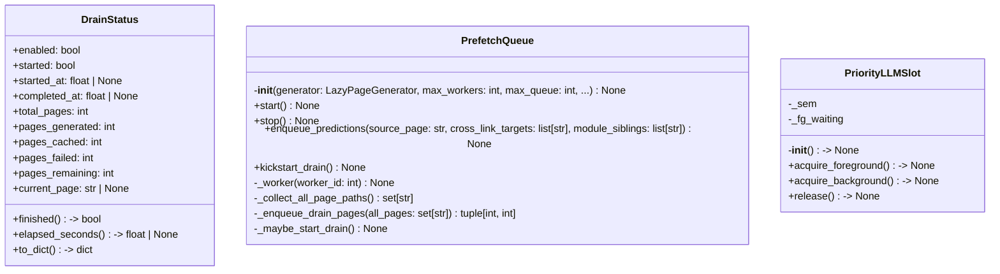

# File: `src/local_deepwiki/generators/prefetch.py`

## File Overview

This file implements a background prefetching system for generating pages in a lazy-loaded documentation structure. It is designed to improve responsiveness by pre-generating pages that are likely to be accessed next, while managing concurrency and handling a drain mode for background caching of all pages.

The core of the system is the `PrefetchQueue` class, which coordinates background workers that consume a priority-based queue of pages to generate. It integrates with [`LazyPageGenerator`](lazy_generator.md) to perform actual page generation and caching.

## Key Concepts

### Priority-Based Page Prefetching

The prefetching system uses a priority queue to determine which pages to generate next. Pages are assigned priorities based on how likely they are to be accessed. For example, cross-linked pages are given a higher priority (2) than sibling pages (3), ensuring more important pages are generated first.

### Background Worker Management

The system uses a fixed number of background tasks (`_worker`) to process the queue. These workers are responsible for dequeuing pages, generating them via `LazyPageGenerator.warm_page`, and updating the state of the prefetching system. This approach isolates failures in one worker from affecting others, using `try...except` blocks around generation calls.

### Drain Mode for Background Caching

The system supports a "drain" mode that is triggered after an idle period. When enabled, this mode enqueues all uncached pages for background generation. This is useful for ensuring all documentation is cached ahead of time, improving performance during peak usage or for offline access.

### LLM Slot Prioritization

The `PriorityLLMSlot` class wraps an `asyncio.Semaphore` to provide foreground and background priority for LLM access. Foreground requests (like immediate page generation) are given priority to avoid yielding to background tasks, ensuring responsive behavior for interactive use.

## Integration

This file is part of the `local_deepwiki.generators` module and is designed to work with [`LazyPageGenerator`](lazy_generator.md) to provide a seamless experience for generating and caching documentation pages. It is used by `test_prefetch` via the `PrefetchQueue` class.

The `PrefetchQueue` is initialized with a [`LazyPageGenerator`](lazy_generator.md) instance, which it uses to generate pages and check for cached content. It also integrates with the logging system via [`get_logger`](../logging.md).

This prefetching system is a key component in improving the responsiveness of documentation generation, especially in systems where pages are lazily loaded. It's used in conjunction with other modules like `local_deepwiki.core.rate_limiter` to manage resource usage.

## Design Notes

### Why `asyncio.PriorityQueue`?

The system uses `asyncio.PriorityQueue` to manage page generation priorities. This allows for fine-grained control over which pages are generated first, balancing between performance and user experience.

### Why Isolated Worker Failures?

Failures in one worker do not crash the entire prefetching system. Each worker has a `try...except` block around the page generation logic. This design choice ensures that a single page generation failure doesn't block the entire queue, improving system resilience.

### Why Not Use `asyncio.Queue`?

A regular `asyncio.Queue` would not support prioritization, which is essential for the prefetching logic. The system needs to prioritize pages based on likelihood of access, so a priority queue is the correct abstraction.

### Why Separate `DrainStatus`?

The `DrainStatus` class provides a structured way to track the state of the drain mode, including progress, errors, and timing. It also provides a `to_dict()` method for serialization, which is useful for exposing the status over APIs or logs.

### Why `PriorityLLMSlot`?

The `PriorityLLMSlot` class wraps a semaphore to ensure that foreground requests (like immediate page generation) do not get blocked by background tasks. This is important for maintaining responsiveness in interactive environments.

### Why `kickstart_drain`?

The `kickstart_drain` method allows for immediate initiation of the drain mode, bypassing the idle timeout. This is useful in scenarios where the system knows that it's safe to start draining immediately, such as after a major update or when a user explicitly requests a full cache.

### Why Not Cancel on `enqueue_predictions`?

The system does not cancel the drain task immediately upon new predictions. Instead, it waits for the idle timeout to elapse. This prevents unnecessary restarts of the drain process if the system is actively generating pages, ensuring that the drain is only triggered when the system is idle.

## API Reference

### class `DrainStatus`

Observable drain state.

**Methods:**


<details>
<summary>View Source (lines 19-69) | <a href="https://github.com/UrbanDiver/local-deepwiki-mcp/blob/main/src/local_deepwiki/generators/prefetch.py#L19-L69">GitHub</a></summary>

```python
class DrainStatus:
    """Observable drain state."""

    enabled: bool = False
    started: bool = False
    started_at: float | None = None
    completed_at: float | None = None
    total_pages: int = 0
    pages_generated: int = 0
    pages_cached: int = 0
    pages_failed: int = 0
    pages_remaining: int = 0
    current_page: str | None = None
    errors: list[str] = field(default_factory=list)

    @property
    def finished(self) -> bool:
        """Return True if drain has started and no pages remain to generate."""
        return self.started and self.pages_remaining == 0

    @property
    def elapsed_seconds(self) -> float | None:
        """Return seconds elapsed since drain started, or None if not started."""
        if self.started_at is None:
            return None
        end = self.completed_at or time.time()
        return round(end - self.started_at, 1)

    def to_dict(self) -> dict:
        """Serialize drain status to a dict suitable for JSON responses."""
        return {
            "enabled": self.enabled,
            "state": (
                "finished"
                if self.finished
                else "draining"
                if self.started
                else "waiting"
                if self.enabled
                else "disabled"
            ),
            "started_at": self.started_at,
            "elapsed_seconds": self.elapsed_seconds,
            "total_pages": self.total_pages,
            "pages_generated": self.pages_generated,
            "pages_cached": self.pages_cached,
            "pages_failed": self.pages_failed,
            "pages_remaining": self.pages_remaining,
            "current_page": self.current_page,
            "errors": self.errors[-5:] if self.errors else [],
        }
```

</details>

#### `finished`

```python
def finished() -> bool
```

Return True if drain has started and no pages remain to generate.


<details>
<summary>View Source (lines 19-69) | <a href="https://github.com/UrbanDiver/local-deepwiki-mcp/blob/main/src/local_deepwiki/generators/prefetch.py#L19-L69">GitHub</a></summary>

```python
class DrainStatus:
    """Observable drain state."""

    enabled: bool = False
    started: bool = False
    started_at: float | None = None
    completed_at: float | None = None
    total_pages: int = 0
    pages_generated: int = 0
    pages_cached: int = 0
    pages_failed: int = 0
    pages_remaining: int = 0
    current_page: str | None = None
    errors: list[str] = field(default_factory=list)

    @property
    def finished(self) -> bool:
        """Return True if drain has started and no pages remain to generate."""
        return self.started and self.pages_remaining == 0

    @property
    def elapsed_seconds(self) -> float | None:
        """Return seconds elapsed since drain started, or None if not started."""
        if self.started_at is None:
            return None
        end = self.completed_at or time.time()
        return round(end - self.started_at, 1)

    def to_dict(self) -> dict:
        """Serialize drain status to a dict suitable for JSON responses."""
        return {
            "enabled": self.enabled,
            "state": (
                "finished"
                if self.finished
                else "draining"
                if self.started
                else "waiting"
                if self.enabled
                else "disabled"
            ),
            "started_at": self.started_at,
            "elapsed_seconds": self.elapsed_seconds,
            "total_pages": self.total_pages,
            "pages_generated": self.pages_generated,
            "pages_cached": self.pages_cached,
            "pages_failed": self.pages_failed,
            "pages_remaining": self.pages_remaining,
            "current_page": self.current_page,
            "errors": self.errors[-5:] if self.errors else [],
        }
```

</details>

#### `elapsed_seconds`

```python
def elapsed_seconds() -> float | None
```

Return seconds elapsed since drain started, or None if not started.


<details>
<summary>View Source (lines 19-69) | <a href="https://github.com/UrbanDiver/local-deepwiki-mcp/blob/main/src/local_deepwiki/generators/prefetch.py#L19-L69">GitHub</a></summary>

```python
class DrainStatus:
    """Observable drain state."""

    enabled: bool = False
    started: bool = False
    started_at: float | None = None
    completed_at: float | None = None
    total_pages: int = 0
    pages_generated: int = 0
    pages_cached: int = 0
    pages_failed: int = 0
    pages_remaining: int = 0
    current_page: str | None = None
    errors: list[str] = field(default_factory=list)

    @property
    def finished(self) -> bool:
        """Return True if drain has started and no pages remain to generate."""
        return self.started and self.pages_remaining == 0

    @property
    def elapsed_seconds(self) -> float | None:
        """Return seconds elapsed since drain started, or None if not started."""
        if self.started_at is None:
            return None
        end = self.completed_at or time.time()
        return round(end - self.started_at, 1)

    def to_dict(self) -> dict:
        """Serialize drain status to a dict suitable for JSON responses."""
        return {
            "enabled": self.enabled,
            "state": (
                "finished"
                if self.finished
                else "draining"
                if self.started
                else "waiting"
                if self.enabled
                else "disabled"
            ),
            "started_at": self.started_at,
            "elapsed_seconds": self.elapsed_seconds,
            "total_pages": self.total_pages,
            "pages_generated": self.pages_generated,
            "pages_cached": self.pages_cached,
            "pages_failed": self.pages_failed,
            "pages_remaining": self.pages_remaining,
            "current_page": self.current_page,
            "errors": self.errors[-5:] if self.errors else [],
        }
```

</details>

#### `to_dict`

```python
def to_dict() -> dict
```

Serialize drain status to a dict suitable for JSON responses.


<details>
<summary>View Source (lines 19-69) | <a href="https://github.com/UrbanDiver/local-deepwiki-mcp/blob/main/src/local_deepwiki/generators/prefetch.py#L19-L69">GitHub</a></summary>

```python
class DrainStatus:
    """Observable drain state."""

    enabled: bool = False
    started: bool = False
    started_at: float | None = None
    completed_at: float | None = None
    total_pages: int = 0
    pages_generated: int = 0
    pages_cached: int = 0
    pages_failed: int = 0
    pages_remaining: int = 0
    current_page: str | None = None
    errors: list[str] = field(default_factory=list)

    @property
    def finished(self) -> bool:
        """Return True if drain has started and no pages remain to generate."""
        return self.started and self.pages_remaining == 0

    @property
    def elapsed_seconds(self) -> float | None:
        """Return seconds elapsed since drain started, or None if not started."""
        if self.started_at is None:
            return None
        end = self.completed_at or time.time()
        return round(end - self.started_at, 1)

    def to_dict(self) -> dict:
        """Serialize drain status to a dict suitable for JSON responses."""
        return {
            "enabled": self.enabled,
            "state": (
                "finished"
                if self.finished
                else "draining"
                if self.started
                else "waiting"
                if self.enabled
                else "disabled"
            ),
            "started_at": self.started_at,
            "elapsed_seconds": self.elapsed_seconds,
            "total_pages": self.total_pages,
            "pages_generated": self.pages_generated,
            "pages_cached": self.pages_cached,
            "pages_failed": self.pages_failed,
            "pages_remaining": self.pages_remaining,
            "current_page": self.current_page,
            "errors": self.errors[-5:] if self.errors else [],
        }
```

</details>

### class `PriorityLLMSlot`

Wraps an asyncio.Semaphore with foreground/background priority.

**Methods:**


<details>
<summary>View Source (lines 72-96) | <a href="https://github.com/UrbanDiver/local-deepwiki-mcp/blob/main/src/local_deepwiki/generators/prefetch.py#L72-L96">GitHub</a></summary>

```python
class PriorityLLMSlot:
    """Wraps an asyncio.Semaphore with foreground/background priority."""

    def __init__(self, semaphore: asyncio.Semaphore) -> None:
        """Initialize with an asyncio semaphore for concurrency limiting."""
        self._sem = semaphore
        self._fg_waiting = 0

    async def acquire_foreground(self) -> None:
        """Acquire the LLM slot with foreground priority (never yields to background)."""
        self._fg_waiting += 1
        try:
            await self._sem.acquire()
        finally:
            self._fg_waiting -= 1

    async def acquire_background(self) -> None:
        """Acquire the LLM slot, waiting until no foreground requests are pending."""
        while self._fg_waiting > 0:
            await asyncio.sleep(0.05)
        await self._sem.acquire()

    def release(self) -> None:
        """Release the LLM slot back to the semaphore."""
        self._sem.release()
```

</details>

#### `__init__`

```python
def __init__(semaphore: asyncio.Semaphore) -> None
```

Initialize with an asyncio semaphore for concurrency limiting.


| Parameter | Type | Default | Description |
|-----------|------|---------|-------------|
| `semaphore` | `asyncio.Semaphore` | - | - |


<details>
<summary>View Source (lines 72-96) | <a href="https://github.com/UrbanDiver/local-deepwiki-mcp/blob/main/src/local_deepwiki/generators/prefetch.py#L72-L96">GitHub</a></summary>

```python
class PriorityLLMSlot:
    """Wraps an asyncio.Semaphore with foreground/background priority."""

    def __init__(self, semaphore: asyncio.Semaphore) -> None:
        """Initialize with an asyncio semaphore for concurrency limiting."""
        self._sem = semaphore
        self._fg_waiting = 0

    async def acquire_foreground(self) -> None:
        """Acquire the LLM slot with foreground priority (never yields to background)."""
        self._fg_waiting += 1
        try:
            await self._sem.acquire()
        finally:
            self._fg_waiting -= 1

    async def acquire_background(self) -> None:
        """Acquire the LLM slot, waiting until no foreground requests are pending."""
        while self._fg_waiting > 0:
            await asyncio.sleep(0.05)
        await self._sem.acquire()

    def release(self) -> None:
        """Release the LLM slot back to the semaphore."""
        self._sem.release()
```

</details>

#### `acquire_foreground`

```python
async def acquire_foreground() -> None
```

Acquire the LLM slot with foreground priority (never yields to background).


<details>
<summary>View Source (lines 72-96) | <a href="https://github.com/UrbanDiver/local-deepwiki-mcp/blob/main/src/local_deepwiki/generators/prefetch.py#L72-L96">GitHub</a></summary>

```python
class PriorityLLMSlot:
    """Wraps an asyncio.Semaphore with foreground/background priority."""

    def __init__(self, semaphore: asyncio.Semaphore) -> None:
        """Initialize with an asyncio semaphore for concurrency limiting."""
        self._sem = semaphore
        self._fg_waiting = 0

    async def acquire_foreground(self) -> None:
        """Acquire the LLM slot with foreground priority (never yields to background)."""
        self._fg_waiting += 1
        try:
            await self._sem.acquire()
        finally:
            self._fg_waiting -= 1

    async def acquire_background(self) -> None:
        """Acquire the LLM slot, waiting until no foreground requests are pending."""
        while self._fg_waiting > 0:
            await asyncio.sleep(0.05)
        await self._sem.acquire()

    def release(self) -> None:
        """Release the LLM slot back to the semaphore."""
        self._sem.release()
```

</details>

#### `acquire_background`

```python
async def acquire_background() -> None
```

Acquire the LLM slot, waiting until no foreground requests are pending.


<details>
<summary>View Source (lines 72-96) | <a href="https://github.com/UrbanDiver/local-deepwiki-mcp/blob/main/src/local_deepwiki/generators/prefetch.py#L72-L96">GitHub</a></summary>

```python
class PriorityLLMSlot:
    """Wraps an asyncio.Semaphore with foreground/background priority."""

    def __init__(self, semaphore: asyncio.Semaphore) -> None:
        """Initialize with an asyncio semaphore for concurrency limiting."""
        self._sem = semaphore
        self._fg_waiting = 0

    async def acquire_foreground(self) -> None:
        """Acquire the LLM slot with foreground priority (never yields to background)."""
        self._fg_waiting += 1
        try:
            await self._sem.acquire()
        finally:
            self._fg_waiting -= 1

    async def acquire_background(self) -> None:
        """Acquire the LLM slot, waiting until no foreground requests are pending."""
        while self._fg_waiting > 0:
            await asyncio.sleep(0.05)
        await self._sem.acquire()

    def release(self) -> None:
        """Release the LLM slot back to the semaphore."""
        self._sem.release()
```

</details>

#### `release`

```python
def release() -> None
```

Release the LLM slot back to the semaphore.


<details>
<summary>View Source (lines 72-96) | <a href="https://github.com/UrbanDiver/local-deepwiki-mcp/blob/main/src/local_deepwiki/generators/prefetch.py#L72-L96">GitHub</a></summary>

```python
class PriorityLLMSlot:
    """Wraps an asyncio.Semaphore with foreground/background priority."""

    def __init__(self, semaphore: asyncio.Semaphore) -> None:
        """Initialize with an asyncio semaphore for concurrency limiting."""
        self._sem = semaphore
        self._fg_waiting = 0

    async def acquire_foreground(self) -> None:
        """Acquire the LLM slot with foreground priority (never yields to background)."""
        self._fg_waiting += 1
        try:
            await self._sem.acquire()
        finally:
            self._fg_waiting -= 1

    async def acquire_background(self) -> None:
        """Acquire the LLM slot, waiting until no foreground requests are pending."""
        while self._fg_waiting > 0:
            await asyncio.sleep(0.05)
        await self._sem.acquire()

    def release(self) -> None:
        """Release the LLM slot back to the semaphore."""
        self._sem.release()
```

</details>

### class `PrefetchQueue`

Background page generator driven by prediction signals.

**Methods:**


<details>
<summary>View Source (lines 99-305) | <a href="https://github.com/UrbanDiver/local-deepwiki-mcp/blob/main/src/local_deepwiki/generators/prefetch.py#L99-L305">GitHub</a></summary>

```python
class PrefetchQueue:
    # Methods: __init__, start, stop, enqueue_predictions, kickstart_drain, _worker, _collect_all_page_paths, _enqueue_drain_pages, _maybe_start_drain
```

</details>

#### `__init__`

```python
def __init__(generator: LazyPageGenerator, max_workers: int = 2, max_queue: int = 20, drain_enabled: bool = False, drain_idle_seconds: int = 30) -> None
```

Initialize the prefetch queue with worker count, queue size, and drain settings.


| Parameter | Type | Default | Description |
|-----------|------|---------|-------------|
| `generator` | `LazyPageGenerator` | - | - |
| `max_workers` | `int` | `2` | - |
| `max_queue` | `int` | `20` | - |
| `drain_enabled` | `bool` | `False` | - |
| `drain_idle_seconds` | `int` | `30` | - |


<details>
<summary>View Source (lines 102-125) | <a href="https://github.com/UrbanDiver/local-deepwiki-mcp/blob/main/src/local_deepwiki/generators/prefetch.py#L102-L125">GitHub</a></summary>

```python
def __init__(
        self,
        generator: LazyPageGenerator,
        max_workers: int = 2,
        max_queue: int = 20,
        drain_enabled: bool = False,
        drain_idle_seconds: int = 30,
    ) -> None:
        """Initialize the prefetch queue with worker count, queue size, and drain settings."""
        self._generator = generator
        self._queue: asyncio.PriorityQueue[tuple[int, str]] = asyncio.PriorityQueue(
            maxsize=max_queue
        )
        self._in_flight: set[str] = set()
        self._generated: set[str] = set()
        self._workers: list[asyncio.Task[None]] = []
        self._max_workers = max_workers
        self._started = False

        self._drain_enabled = drain_enabled
        self._drain_idle_seconds = drain_idle_seconds
        self._drain_started = False
        self._drain_task: asyncio.Task[None] | None = None
        self.drain_status = DrainStatus(enabled=drain_enabled)
```

</details>

#### `start`

```python
def start() -> None
```

Spawn background worker tasks to consume the prefetch queue.


<details>
<summary>View Source (lines 127-133) | <a href="https://github.com/UrbanDiver/local-deepwiki-mcp/blob/main/src/local_deepwiki/generators/prefetch.py#L127-L133">GitHub</a></summary>

```python
def start(self) -> None:
        """Spawn background worker tasks to consume the prefetch queue."""
        if self._started:
            return
        self._started = True
        for i in range(self._max_workers):
            self._workers.append(asyncio.create_task(self._worker(i)))
```

</details>

#### `stop`

```python
async def stop() -> None
```

Cancel all worker tasks and drain task, then wait for cleanup.


<details>
<summary>View Source (lines 135-143) | <a href="https://github.com/UrbanDiver/local-deepwiki-mcp/blob/main/src/local_deepwiki/generators/prefetch.py#L135-L143">GitHub</a></summary>

```python
async def stop(self) -> None:
        """Cancel all worker tasks and drain task, then wait for cleanup."""
        self._started = False
        if self._drain_task:
            self._drain_task.cancel()
        for w in self._workers:
            w.cancel()
        await asyncio.gather(*self._workers, return_exceptions=True)
        self._workers.clear()
```

</details>

#### `enqueue_predictions`

```python
async def enqueue_predictions(source_page: str, cross_link_targets: list[str], module_siblings: list[str]) -> None
```

Enqueue predicted next pages based on cross-links and sibling proximity.


| Parameter | Type | Default | Description |
|-----------|------|---------|-------------|
| `source_page` | `str` | - | - |
| `cross_link_targets` | `list[str]` | - | - |
| `module_siblings` | `list[str]` | - | - |


<details>
<summary>View Source (lines 145-172) | <a href="https://github.com/UrbanDiver/local-deepwiki-mcp/blob/main/src/local_deepwiki/generators/prefetch.py#L145-L172">GitHub</a></summary>

```python
async def enqueue_predictions(
        self,
        source_page: str,
        cross_link_targets: list[str],
        module_siblings: list[str],
    ) -> None:
        """Enqueue predicted next pages based on cross-links and sibling proximity."""
        scored: list[tuple[int, str]] = []
        for target in cross_link_targets:
            scored.append((2, target))
        for sibling in module_siblings:
            scored.append((3, sibling))

        for priority, page_path in scored:
            if page_path in self._generated or page_path in self._in_flight:
                continue
            if self._queue.full():
                break
            try:
                self._queue.put_nowait((priority, page_path))
            except asyncio.QueueFull:
                break

        if self._drain_enabled:
            if self._drain_task:
                self._drain_task.cancel()
            self._drain_started = False
            self._drain_task = asyncio.create_task(self._maybe_start_drain())
```

</details>

#### `kickstart_drain`

```python
def kickstart_drain() -> None
```

Immediately schedule drain mode without waiting for the idle timeout.


<details>
<summary>View Source (lines 174-180) | <a href="https://github.com/UrbanDiver/local-deepwiki-mcp/blob/main/src/local_deepwiki/generators/prefetch.py#L174-L180">GitHub</a></summary>

```python
def kickstart_drain(self) -> None:
        """Immediately schedule drain mode without waiting for the idle timeout."""
        if not self._drain_enabled or self._drain_started:
            return
        if self._drain_task:
            self._drain_task.cancel()
        self._drain_task = asyncio.create_task(self._maybe_start_drain())
```

</details>

## Class Diagram



## Call Graph

```mermaid
flowchart TD
    N0[DrainStatus]
    N1[DrainStatus.elapsed_seconds]
    N2[PrefetchQueue.__init__]
    N3[PrefetchQueue._collect_all_...]
    N4[PrefetchQueue._enqueue_drai...]
    N5[PrefetchQueue._maybe_start_...]
    N6[PrefetchQueue._worker]
    N7[PrefetchQueue.enqueue_predi...]
    N8[PrefetchQueue.kickstart_drain]
    N9[PrefetchQueue.start]
    N10[PrefetchQueue.stop]
    N11[PriorityLLMSlot.acquire_bac...]
    N12[PriorityLLMSlot.acquire_for...]
    N13[PriorityLLMSlot.release]
    N14[PriorityQueue]
    N15[_maybe_start_drain]
    N16[_worker]
    N17[acquire]
    N18[add]
    N19[cancel]
    N20[create_task]
    N21[full]
    N22[gather]
    N23[put_nowait]
    N24[release]
    N25[sleep]
    N26[task_done]
    N27[time]
    N28[wait_for]
    N29[warm_page]
    N1 --> N27
    N12 --> N17
    N11 --> N25
    N11 --> N17
    N13 --> N24
    N2 --> N14
    N2 --> N0
    N9 --> N20
    N9 --> N16
    N10 --> N19
    N10 --> N22
    N7 --> N21
    N7 --> N23
    N7 --> N19
    N7 --> N20
    N7 --> N15
    N8 --> N19
    N8 --> N20
    N8 --> N15
    N6 --> N28
    N6 --> N26
    N6 --> N18
    N6 --> N29
    N3 --> N18
    N4 --> N18
    N4 --> N21
    N4 --> N23
    N5 --> N25
    N5 --> N27
    classDef func fill:#e1f5fe
    class N0,N14,N15,N16,N17,N18,N19,N20,N21,N22,N23,N24,N25,N26,N27,N28,N29 func
    classDef method fill:#fff3e0
    class N1,N2,N3,N4,N5,N6,N7,N8,N9,N10,N11,N12,N13 method
```



## Used By

Functions and methods in this file and their callers:

- **`DrainStatus`**: called by `PrefetchQueue.__init__`
- **`PriorityQueue`**: called by `PrefetchQueue.__init__`
- **`_collect_all_page_paths`**: called by `PrefetchQueue._maybe_start_drain`
- **`_enqueue_drain_pages`**: called by `PrefetchQueue._maybe_start_drain`
- **`_maybe_start_drain`**: called by `PrefetchQueue.enqueue_predictions`, `PrefetchQueue.kickstart_drain`
- **`_read_cached`**: called by `PrefetchQueue._enqueue_drain_pages`
- **`_worker`**: called by `PrefetchQueue.start`
- **`acquire`**: called by `PriorityLLMSlot.acquire_background`, `PriorityLLMSlot.acquire_foreground`
- **`add`**: called by `PrefetchQueue._collect_all_page_paths`, `PrefetchQueue._enqueue_drain_pages`, `PrefetchQueue._worker`
- **`cancel`**: called by `PrefetchQueue.enqueue_predictions`, `PrefetchQueue.kickstart_drain`, `PrefetchQueue.stop`
- **`create_task`**: called by `PrefetchQueue.enqueue_predictions`, `PrefetchQueue.kickstart_drain`, `PrefetchQueue.start`
- **`discard`**: called by `PrefetchQueue._worker`
- **`empty`**: called by `PrefetchQueue._maybe_start_drain`
- **`full`**: called by `PrefetchQueue._enqueue_drain_pages`, `PrefetchQueue.enqueue_predictions`
- **`gather`**: called by `PrefetchQueue.stop`
- **`get_nowait`**: called by `PrefetchQueue._enqueue_drain_pages`
- **`get_virtual_structure`**: called by `PrefetchQueue._collect_all_page_paths`
- **`put_nowait`**: called by `PrefetchQueue._enqueue_drain_pages`, `PrefetchQueue.enqueue_predictions`
- **`release`**: called by `PriorityLLMSlot.release`
- **`sleep`**: called by `PrefetchQueue._maybe_start_drain`, `PriorityLLMSlot.acquire_background`
- **`task_done`**: called by `PrefetchQueue._worker`
- **`time`**: called by `DrainStatus.elapsed_seconds`, `PrefetchQueue._maybe_start_drain`
- **`wait_for`**: called by `PrefetchQueue._worker`
- **`warm_page`**: called by `PrefetchQueue._worker`

## Usage Examples

*Examples extracted from test files*

### Example: `DrainStatus`

From `test_prefetch.py::TestDrainStatus::test_initial_state`:

```python
ds = DrainStatus()
        assert ds.enabled is False
        assert ds.started is False
        assert ds.total_pages == 0
        assert ds.pages_remaining == 0
        assert ds.current_page is None
```

### Example: `start`

From `test_prefetch.py::TestDrainStatus::test_initial_state`:

```python
ds = DrainStatus()
        assert ds.enabled is False
        assert ds.started is False
        assert ds.total_pages == 0
        assert ds.pages_remaining == 0
        assert ds.current_page is None
```

### Example: `DrainStatus`

From `test_prefetch.py::TestDrainStatus::test_finished_property_not_started`:

```python
ds = DrainStatus(started=False, pages_remaining=0)
        assert ds.finished is False
```

### Example: `start`

From `test_prefetch.py::TestDrainStatus::test_finished_property_not_started`:

```python
ds = DrainStatus(started=False, pages_remaining=0)
        assert ds.finished is False
```

### Example: `PriorityLLMSlot`

From `test_prefetch.py::TestPriorityLLMSlot::test_foreground_acquires_immediately`:

```python
sem = asyncio.Semaphore(1)
        slot = PriorityLLMSlot(sem)

        await slot.acquire_foreground()
        slot.release()
```


## Last Modified

| Entity | Type | Author | Date | Commit |
|--------|------|--------|------|--------|
| `PrefetchQueue` | class | Brian Breidenbach | 2 days ago | `8b8f36f` refactor: decompose CC > 15... |
| `_collect_all_page_paths` | method | Brian Breidenbach | 2 days ago | `8b8f36f` refactor: decompose CC > 15... |
| `_enqueue_drain_pages` | method | Brian Breidenbach | 2 days ago | `8b8f36f` refactor: decompose CC > 15... |
| `_maybe_start_drain` | method | Brian Breidenbach | 2 days ago | `8b8f36f` refactor: decompose CC > 15... |
| `DrainStatus` | class | Brian Breidenbach | 2 weeks ago | `821d70f` docs: add docstrings to Laz... |
| `PriorityLLMSlot` | class | Brian Breidenbach | 2 weeks ago | `821d70f` docs: add docstrings to Laz... |
| `__init__` | method | Brian Breidenbach | 2 weeks ago | `821d70f` docs: add docstrings to Laz... |
| `start` | method | Brian Breidenbach | 2 weeks ago | `821d70f` docs: add docstrings to Laz... |
| `stop` | method | Brian Breidenbach | 2 weeks ago | `821d70f` docs: add docstrings to Laz... |
| `enqueue_predictions` | method | Brian Breidenbach | 2 weeks ago | `821d70f` docs: add docstrings to Laz... |
| `kickstart_drain` | method | Brian Breidenbach | 2 weeks ago | `821d70f` docs: add docstrings to Laz... |
| `_worker` | method | Brian Breidenbach | 2 weeks ago | `821d70f` docs: add docstrings to Laz... |

## Additional Source Code

Source code for functions and methods not listed in the API Reference above.

#### `_worker`

<details>
<summary>View Source (lines 182-235) | <a href="https://github.com/UrbanDiver/local-deepwiki-mcp/blob/main/src/local_deepwiki/generators/prefetch.py#L182-L235">GitHub</a></summary>

```python
async def _worker(self, worker_id: int) -> None:
        """Background worker loop that dequeues and generates pages until stopped."""
        while self._started:
            try:
                priority, page_path = await asyncio.wait_for(
                    self._queue.get(), timeout=5.0
                )
            except (asyncio.TimeoutError, asyncio.CancelledError):
                if not self._started:
                    break
                continue

            if page_path in self._generated:
                self._queue.task_done()
                continue

            self._in_flight.add(page_path)
            self.drain_status.current_page = page_path
            try:
                await self._generator.warm_page(page_path)
                self._generated.add(page_path)
                if self._drain_started:
                    self.drain_status.pages_generated += 1
                    self.drain_status.pages_remaining = max(
                        0, self.drain_status.pages_remaining - 1
                    )
                    if (
                        self.drain_status.pages_generated % 10 == 0
                        or self.drain_status.pages_remaining == 0
                    ):
                        logger.info(
                            "Drain progress: %d/%d generated (%d cached, %d failed)",
                            self.drain_status.pages_generated,
                            self.drain_status.total_pages,
                            self.drain_status.pages_cached,
                            self.drain_status.pages_failed,
                        )
            except Exception as exc:  # noqa: BLE001 — prefetch isolation: worker failure must not crash drain loop
                logger.debug(
                    "Prefetch worker %d failed for %s",
                    worker_id,
                    page_path,
                    exc_info=True,
                )
                if self._drain_started:
                    self.drain_status.pages_failed += 1
                    self.drain_status.pages_remaining = max(
                        0, self.drain_status.pages_remaining - 1
                    )
                    self.drain_status.errors.append(f"{page_path}: {exc}")
            finally:
                self._in_flight.discard(page_path)
                self.drain_status.current_page = None
                self._queue.task_done()
```

</details>


#### `_collect_all_page_paths`

<details>
<summary>View Source (lines 237-246) | <a href="https://github.com/UrbanDiver/local-deepwiki-mcp/blob/main/src/local_deepwiki/generators/prefetch.py#L237-L246">GitHub</a></summary>

```python
def _collect_all_page_paths(self) -> set[str]:
        """Return all page paths from the virtual structure."""
        virtual = self._generator.get_virtual_structure()
        all_pages: set[str] = set()
        for p in virtual.get("pages", []):
            all_pages.add(p["path"])
        for section_pages in virtual.get("sections", {}).values():
            for p in section_pages:
                all_pages.add(p["path"])
        return all_pages
```

</details>


#### `_enqueue_drain_pages`

<details>
<summary>View Source (lines 248-273) | <a href="https://github.com/UrbanDiver/local-deepwiki-mcp/blob/main/src/local_deepwiki/generators/prefetch.py#L248-L273">GitHub</a></summary>

```python
def _enqueue_drain_pages(self, all_pages: set[str]) -> tuple[int, int]:
        """Enqueue uncached pages for background drain generation.

        Returns:
            Tuple of (enqueued_count, cached_count).
        """
        enqueued = 0
        cached = 0
        for page_path in sorted(all_pages):
            if page_path in self._generated:
                continue
            if self._generator._read_cached(page_path) is not None:
                self._generated.add(page_path)
                cached += 1
                continue
            if self._queue.full():
                try:
                    self._queue.get_nowait()
                except asyncio.QueueEmpty:
                    pass
            try:
                self._queue.put_nowait((99, page_path))
                enqueued += 1
            except asyncio.QueueFull:
                break
        return enqueued, cached
```

</details>


#### `_maybe_start_drain`

<details>
<summary>View Source (lines 275-305) | <a href="https://github.com/UrbanDiver/local-deepwiki-mcp/blob/main/src/local_deepwiki/generators/prefetch.py#L275-L305">GitHub</a></summary>

```python
async def _maybe_start_drain(self) -> None:
        """Wait for idle period, then enqueue all uncached pages for background generation."""
        if not self._drain_enabled or self._drain_started:
            return
        logger.info(
            "Drain mode: waiting %ds for idle before backfilling...",
            self._drain_idle_seconds,
        )
        await asyncio.sleep(self._drain_idle_seconds)
        if not self._queue.empty():
            return

        self._drain_started = True
        self.drain_status.started = True
        self.drain_status.started_at = time.time()

        all_pages = self._collect_all_page_paths()
        enqueued, cached = self._enqueue_drain_pages(all_pages)

        self.drain_status.pages_cached = cached
        self.drain_status.total_pages = enqueued + cached
        self.drain_status.pages_remaining = enqueued

        logger.info(
            "Drain started: %d pages to generate, %d already cached",
            enqueued,
            cached,
        )
        if enqueued == 0:
            self.drain_status.completed_at = time.time()
            logger.info("Drain complete: all pages already cached")
```

</details>

## Relevant Source Files

- `src/local_deepwiki/generators/prefetch.py:19-69`
