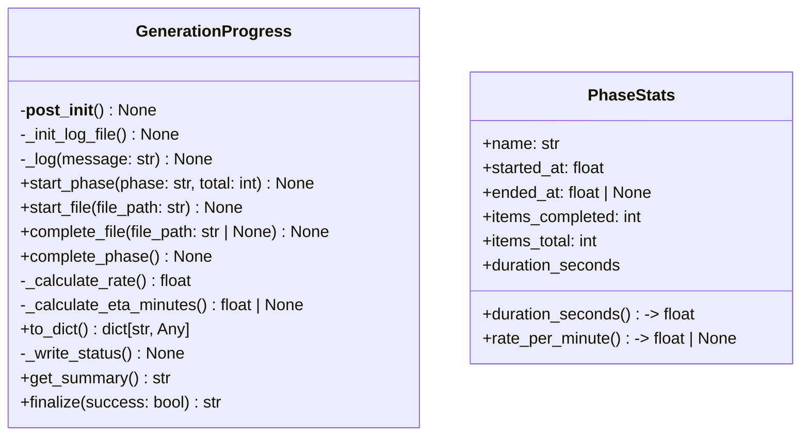

# File Overview

This file defines a `GenerationProgress` class for tracking and logging the progress of a generation process, including phase tracking, file completion statistics, and estimated time of arrival (ETA). It also includes a `PhaseStats` dataclass to store statistics for individual phases.

## Classes

### `PhaseStats`

Statistics for a single generation phase.


<details>
<summary>View Source (lines 33-53) | <a href="https://github.com/UrbanDiver/local-deepwiki-mcp/blob/[main](../export/pdf.md)/src/local_deepwiki/generators/progress_tracker.py#L33-L53">GitHub</a></summary>

```python
class PhaseStats:
    """Statistics for a single generation phase."""

    name: str
    started_at: float
    ended_at: float | None = None
    items_completed: int = 0
    items_total: int = 0

    @property
    def duration_seconds(self) -> float:
        """Get phase duration in seconds."""
        end = self.ended_at or time.time()
        return end - self.started_at

    @property
    def rate_per_minute(self) -> float | None:
        """Get items per minute rate."""
        if self.items_completed == 0 or self.duration_seconds == 0:
            return None
        return (self.items_completed / self.duration_seconds) * 60
```

</details>

#### Fields
- `name`: Name of the phase.
- `started_at`: Timestamp when the phase started.
- `ended_at`: Timestamp when the phase ended (optional).
- `items_completed`: Number of items completed in the phase.
- `items_total`: Total number of items in the phase.

#### Properties
- `duration_seconds`: Returns the duration of the phase in seconds.
- `rate_per_minute`: Returns the rate of items per minute, or `None` if not applicable.

### `GenerationProgress`

Tracks the overall progress of a generation process, including phases, file processing, and logging.


<details>
<summary>View Source (lines 57-331) | <a href="https://github.com/UrbanDiver/local-deepwiki-mcp/blob/[main](../export/pdf.md)/src/local_deepwiki/generators/progress_tracker.py#L57-L331">GitHub</a></summary>

```python
class GenerationProgress:
    # Methods: __post_init__, _init_log_file, _log, start_phase, start_file, complete_file, complete_phase, _calculate_rate, _calculate_eta_minutes, to_dict, _write_status, get_summary, finalize
```

</details>

#### Methods
- `__post_init__`: Initializes the log file.
- `_init_log_file`: Sets up the log file for appending.
- `_log`: Appends a timestamped message to the log file.
- `start_phase`: Starts a new generation phase.
- `start_file`: Marks a file as being processed.
- `complete_file`: Marks a file as completed.
- `complete_phase`: Marks the current phase as complete.
- `_calculate_rate`: Calculates the rate of file completion in files per minute.
- `_calculate_eta_minutes`: Calculates the estimated time remaining in minutes.
- `to_dict`: Converts the progress to a dictionary for JSON serialization.
- `_write_status`: Writes the current status to a JSON file.
- `get_summary`: Returns a summary of the current progress.
- `finalize`: Finalizes the progress tracking and writes final logs.

## Functions

### `_format_duration`

Formats a duration in seconds into a human-readable string.


<details>
<summary>View Source (lines 11-29) | <a href="https://github.com/UrbanDiver/local-deepwiki-mcp/blob/[main](../export/pdf.md)/src/local_deepwiki/generators/progress_tracker.py#L11-L29">GitHub</a></summary>

```python
def _format_duration(seconds: float) -> str:
    """Format seconds into human-readable duration.

    Args:
        seconds: Duration in seconds.

    Returns:
        Formatted string like "1h 23m 45s" or "45.2s".
    """
    if seconds < 60:
        return f"{seconds:.1f}s"
    elif seconds < 3600:
        mins = int(seconds // 60)
        secs = int(seconds % 60)
        return f"{mins}m {secs}s"
    else:
        hours = int(seconds // 3600)
        mins = int((seconds % 3600) // 60)
        return f"{hours}h {mins}m"
```

</details>

#### Parameters
- `seconds`: Duration in seconds.

#### Returns
- A string representation of the duration.

## Integration

This file is used by the [`WikiGenerator`](wiki.md) class and other components of the generation pipeline. It logs progress to a file and updates a status JSON file for real-time monitoring. The `GenerationProgress` class integrates with the [`WikiGenerator`](wiki.md) by tracking the progress of each phase and file during the generation process.

## Usage Examples

### Initializing `GenerationProgress`

```python
progress = GenerationProgress(wiki_path=Path("output/wiki"))
```

### Starting a Phase

```python
progress.start_phase("indexing", total=100)
```

### Starting and Completing a File

```python
progress.start_file("example.py")
progress.complete_file("example.py")
```

### Completing a Phase

```python
progress.complete_phase()
```

### Finalizing Progress

```python
progress.finalize()
```

## API Reference

### class `PhaseStats`

Statistics for a single generation phase.

**Methods:**


<details>
<summary>View Source (lines 33-53) | <a href="https://github.com/UrbanDiver/local-deepwiki-mcp/blob/[main](../export/pdf.md)/src/local_deepwiki/generators/progress_tracker.py#L33-L53">GitHub</a></summary>

```python
class PhaseStats:
    """Statistics for a single generation phase."""

    name: str
    started_at: float
    ended_at: float | None = None
    items_completed: int = 0
    items_total: int = 0

    @property
    def duration_seconds(self) -> float:
        """Get phase duration in seconds."""
        end = self.ended_at or time.time()
        return end - self.started_at

    @property
    def rate_per_minute(self) -> float | None:
        """Get items per minute rate."""
        if self.items_completed == 0 or self.duration_seconds == 0:
            return None
        return (self.items_completed / self.duration_seconds) * 60
```

</details>

#### `duration_seconds`

```python
def duration_seconds() -> float
```

Get phase duration in seconds.


<details>
<summary>View Source (lines 33-53) | <a href="https://github.com/UrbanDiver/local-deepwiki-mcp/blob/[main](../export/pdf.md)/src/local_deepwiki/generators/progress_tracker.py#L33-L53">GitHub</a></summary>

```python
class PhaseStats:
    """Statistics for a single generation phase."""

    name: str
    started_at: float
    ended_at: float | None = None
    items_completed: int = 0
    items_total: int = 0

    @property
    def duration_seconds(self) -> float:
        """Get phase duration in seconds."""
        end = self.ended_at or time.time()
        return end - self.started_at

    @property
    def rate_per_minute(self) -> float | None:
        """Get items per minute rate."""
        if self.items_completed == 0 or self.duration_seconds == 0:
            return None
        return (self.items_completed / self.duration_seconds) * 60
```

</details>

#### `rate_per_minute`

```python
def rate_per_minute() -> float | None
```

Get items per minute rate.


<details>
<summary>View Source (lines 33-53) | <a href="https://github.com/UrbanDiver/local-deepwiki-mcp/blob/[main](../export/pdf.md)/src/local_deepwiki/generators/progress_tracker.py#L33-L53">GitHub</a></summary>

```python
class PhaseStats:
    """Statistics for a single generation phase."""

    name: str
    started_at: float
    ended_at: float | None = None
    items_completed: int = 0
    items_total: int = 0

    @property
    def duration_seconds(self) -> float:
        """Get phase duration in seconds."""
        end = self.ended_at or time.time()
        return end - self.started_at

    @property
    def rate_per_minute(self) -> float | None:
        """Get items per minute rate."""
        if self.items_completed == 0 or self.duration_seconds == 0:
            return None
        return (self.items_completed / self.duration_seconds) * 60
```

</details>

### class `GenerationProgress`

Tracks wiki generation progress with timing statistics.

**Methods:**


<details>
<summary>View Source (lines 57-331) | <a href="https://github.com/UrbanDiver/local-deepwiki-mcp/blob/[main](../export/pdf.md)/src/local_deepwiki/generators/progress_tracker.py#L57-L331">GitHub</a></summary>

```python
class GenerationProgress:
    # Methods: __post_init__, _init_log_file, _log, start_phase, start_file, complete_file, complete_phase, _calculate_rate, _calculate_eta_minutes, to_dict, _write_status, get_summary, finalize
```

</details>

#### `start_phase`

```python
def start_phase(phase: str, total: int = 0) -> None
```

Start a new generation phase.


| [Parameter](api_docs.md) | Type | Default | Description |
|-----------|------|---------|-------------|
| `phase` | `str` | - | Name of the phase (e.g., "indexing", "modules", "file_docs"). |
| `total` | `int` | `0` | Total items to process in this phase. |


<details>
<summary>View Source (lines 105-132) | <a href="https://github.com/UrbanDiver/local-deepwiki-mcp/blob/[main](../export/pdf.md)/src/local_deepwiki/generators/progress_tracker.py#L105-L132">GitHub</a></summary>

```python
def start_phase(self, phase: str, total: int = 0) -> None:
        """Start a new generation phase.

        Args:
            phase: Name of the phase (e.g., "indexing", "modules", "file_docs").
            total: Total items to process in this phase.
        """
        # End previous phase if any
        if self.phase in self._phase_stats:
            self._phase_stats[self.phase].ended_at = time.time()

        self.phase = phase
        self.total_files = total
        self.completed_files = 0
        self.current_file = None
        self.phase_started_at = time.time()
        self._completion_times.clear()
        self._last_completion_time = time.time()

        # Track phase stats
        self._phase_stats[phase] = PhaseStats(
            name=phase,
            started_at=self.phase_started_at,
            items_total=total,
        )

        self._log(f"[{phase}] Started (total: {total})")
        self._write_status()
```

</details>

#### `start_file`

```python
def start_file(file_path: str) -> None
```

Mark a file as being processed.


| [Parameter](api_docs.md) | Type | Default | Description |
|-----------|------|---------|-------------|
| `file_path` | `str` | - | Path to the file being processed. |


<details>
<summary>View Source (lines 134-141) | <a href="https://github.com/UrbanDiver/local-deepwiki-mcp/blob/[main](../export/pdf.md)/src/local_deepwiki/generators/progress_tracker.py#L134-L141">GitHub</a></summary>

```python
def start_file(self, file_path: str) -> None:
        """Mark a file as being processed.

        Args:
            file_path: Path to the file being processed.
        """
        self.current_file = file_path
        self._write_status()
```

</details>

#### `complete_file`

```python
def complete_file(file_path: str | None = None) -> None
```

Mark a file as completed.


| [Parameter](api_docs.md) | Type | Default | Description |
|-----------|------|---------|-------------|
| `file_path` | `str | None` | `None` | Optional path to update current_file display. |


<details>
<summary>View Source (lines 143-172) | <a href="https://github.com/UrbanDiver/local-deepwiki-mcp/blob/[main](../export/pdf.md)/src/local_deepwiki/generators/progress_tracker.py#L143-L172">GitHub</a></summary>

```python
def complete_file(self, file_path: str | None = None) -> None:
        """Mark a file as completed.

        Args:
            file_path: Optional path to update current_file display.
        """
        now = time.time()
        elapsed = now - self._last_completion_time
        self._completion_times.append(elapsed)
        self._last_completion_time = now

        self.completed_files += 1
        if file_path:
            self.current_file = file_path

        # Update phase stats
        if self.phase in self._phase_stats:
            self._phase_stats[self.phase].items_completed = self.completed_files

        # Log completion
        elapsed_str = f"{elapsed:.1f}s" if elapsed < 60 else _format_duration(elapsed)
        rate = self._calculate_rate()
        eta = self._calculate_eta_minutes()
        eta_str = f", ETA: {_format_duration(eta * 60)}" if eta and eta > 0 else ""
        self._log(
            f"[{self.completed_files}/{self.total_files}] "
            f"Completed: {file_path or 'unknown'} ({elapsed_str}, {rate:.1f}/min{eta_str})"
        )

        self._write_status()
```

</details>

#### `complete_phase`

```python
def complete_phase() -> None
```

Mark the current phase as complete.


<details>
<summary>View Source (lines 174-186) | <a href="https://github.com/UrbanDiver/local-deepwiki-mcp/blob/[main](../export/pdf.md)/src/local_deepwiki/generators/progress_tracker.py#L174-L186">GitHub</a></summary>

```python
def complete_phase(self) -> None:
        """Mark the current phase as complete."""
        now = time.time()
        if self.phase in self._phase_stats:
            stats = self._phase_stats[self.phase]
            stats.ended_at = now
            duration = _format_duration(stats.duration_seconds)
            rate = stats.rate_per_minute
            rate_str = f", {rate:.1f}/min" if rate else ""
            self._log(f"[{self.phase}] Complete ({stats.items_completed} items, {duration}{rate_str})")

        self.current_file = None
        self._write_status()
```

</details>

#### `to_dict`

```python
def to_dict() -> dict[str, Any]
```

Convert progress to dictionary for JSON serialization.


<details>
<summary>View Source (lines 209-228) | <a href="https://github.com/UrbanDiver/local-deepwiki-mcp/blob/[main](../export/pdf.md)/src/local_deepwiki/generators/progress_tracker.py#L209-L228">GitHub</a></summary>

```python
def to_dict(self) -> dict[str, Any]:
        """Convert progress to dictionary for JSON serialization."""
        now = time.time()
        elapsed_total = now - self.started_at
        elapsed_phase = now - self.phase_started_at
        rate = self._calculate_rate()
        eta = self._calculate_eta_minutes()

        return {
            "phase": self.phase,
            "completed": self.completed_files,
            "total": self.total_files,
            "percent": round(100 * self.completed_files / self.total_files, 1) if self.total_files > 0 else 0,
            "current_file": self.current_file,
            "rate_per_minute": round(rate, 2) if rate > 0 else None,
            "eta_minutes": round(eta, 1) if eta is not None else None,
            "elapsed_phase_seconds": round(elapsed_phase, 1),
            "elapsed_total_seconds": round(elapsed_total, 1),
            "started_at_iso": time.strftime("%Y-%m-%dT%H:%M:%S", time.localtime(self.started_at)),
        }
```

</details>

#### `get_summary`

```python
def get_summary() -> str
```

Generate a summary of the generation run.


<details>
<summary>View Source (lines 240-277) | <a href="https://github.com/UrbanDiver/local-deepwiki-mcp/blob/[main](../export/pdf.md)/src/local_deepwiki/generators/progress_tracker.py#L240-L277">GitHub</a></summary>

```python
def get_summary(self) -> str:
        """Generate a summary of the generation run.

        Returns:
            Formatted summary string.
        """
        now = time.time()
        total_duration = now - self.started_at

        lines = [
            "",
            "=" * 50,
            "  Wiki Generation Complete",
            "=" * 50,
            f"  Total time: {_format_duration(total_duration)}",
            "",
        ]

        # Phase breakdown
        total_items = 0
        for phase_name, stats in self._phase_stats.items():
            if stats.ended_at is None:
                stats.ended_at = now
            duration = _format_duration(stats.duration_seconds)
            rate = stats.rate_per_minute
            rate_str = f", {rate:.1f}/min" if rate and rate < 1000 else ""
            items_str = f" ({stats.items_completed} pages{rate_str})" if stats.items_completed > 0 else ""
            lines.append(f"  - {phase_name}: {duration}{items_str}")
            total_items += stats.items_completed

        lines.extend([
            "",
            f"  Total pages: {total_items}",
            "=" * 50,
            "",
        ])

        return "\n".join(lines)
```

</details>

#### `finalize`

```python
def finalize(success: bool = True) -> str
```

Mark generation as complete and write final status.


| [Parameter](api_docs.md) | Type | Default | Description |
|-----------|------|---------|-------------|
| `success` | `bool` | `True` | Whether generation completed successfully. |


<details>
<summary>View Source (lines 279-331) | <a href="https://github.com/UrbanDiver/local-deepwiki-mcp/blob/[main](../export/pdf.md)/src/local_deepwiki/generators/progress_tracker.py#L279-L331">GitHub</a></summary>

```python
def finalize(self, success: bool = True) -> str:
        """Mark generation as complete and write final status.

        Args:
            success: Whether generation completed successfully.

        Returns:
            Summary string for display.
        """
        # End current phase
        if self.phase in self._phase_stats:
            self._phase_stats[self.phase].ended_at = time.time()

        self.phase = "complete" if success else "failed"
        self.current_file = None

        # Generate summary
        summary = self.get_summary()

        # Log summary
        for line in summary.strip().split("\n"):
            self._log(line)

        # Write final status
        status = self.to_dict()
        status["success"] = success
        status["completed_at_iso"] = time.strftime("%Y-%m-%dT%H:%M:%S", time.localtime())

        # Add phase stats to final status
        status["phases"] = {
            name: {
                "duration_seconds": round(stats.duration_seconds, 1),
                "items_completed": stats.items_completed,
                "rate_per_minute": round(stats.rate_per_minute, 2) if stats.rate_per_minute else None,
            }
            for name, stats in self._phase_stats.items()
        }

        status_path = self.wiki_path / "generation_status.json"
        try:
            with open(status_path, "w") as f:
                json.dump(status, f, indent=2)
        except OSError:
            pass

        # Close log file
        if self._log_file:
            try:
                self._log_file.close()
            except OSError:
                pass

        return summary
```

</details>

## Class Diagram



## Call Graph

```mermaid
flowchart TD
    N0[GenerationProgress.__post_i...]
    N1[GenerationProgress._calcula...]
    N2[GenerationProgress._init_lo...]
    N3[GenerationProgress._log]
    N4[GenerationProgress._write_s...]
    N5[GenerationProgress.complete...]
    N6[GenerationProgress.complete...]
    N7[GenerationProgress.finalize]
    N8[GenerationProgress.get_summary]
    N9[GenerationProgress.start_file]
    N10[GenerationProgress.start_phase]
    N11[GenerationProgress.to_dict]
    N12[PhaseStats]
    N13[PhaseStats.duration_seconds]
    N14[_calculate_eta_minutes]
    N15[_calculate_rate]
    N16[_format_duration]
    N17[_init_log_file]
    N18[_log]
    N19[_write_status]
    N20[dump]
    N21[get_summary]
    N22[localtime]
    N23[mkdir]
    N24[strftime]
    N25[time]
    N26[to_dict]
    N27[write]
    N13 --> N25
    N0 --> N17
    N2 --> N23
    N2 --> N18
    N3 --> N24
    N3 --> N27
    N10 --> N25
    N10 --> N12
    N10 --> N18
    N10 --> N19
    N9 --> N19
    N5 --> N25
    N5 --> N16
    N5 --> N15
    N5 --> N14
    N5 --> N18
    N5 --> N19
    N6 --> N25
    N6 --> N16
    N6 --> N18
    N6 --> N19
    N1 --> N15
    N11 --> N25
    N11 --> N15
    N11 --> N14
    N11 --> N24
    N11 --> N22
    N4 --> N23
    N4 --> N20
    N4 --> N26
    N8 --> N25
    N8 --> N16
    N7 --> N25
    N7 --> N21
    N7 --> N18
    N7 --> N26
    N7 --> N24
    N7 --> N22
    N7 --> N20
    classDef func fill:#e1f5fe
    class N12,N14,N15,N16,N17,N18,N19,N20,N21,N22,N23,N24,N25,N26,N27 func
    classDef method fill:#fff3e0
    class N0,N1,N2,N3,N4,N5,N6,N7,N8,N9,N10,N11,N13 method
```



## Used By

Functions and methods in this file and their callers:

- **`PhaseStats`**: called by `GenerationProgress.start_phase`
- **`_calculate_eta_minutes`**: called by `GenerationProgress.complete_file`, `GenerationProgress.to_dict`
- **`_calculate_rate`**: called by `GenerationProgress._calculate_eta_minutes`, `GenerationProgress.complete_file`, `GenerationProgress.to_dict`
- **`_format_duration`**: called by `GenerationProgress.complete_file`, `GenerationProgress.complete_phase`, `GenerationProgress.get_summary`
- **`_init_log_file`**: called by `GenerationProgress.__post_init__`
- **`_log`**: called by `GenerationProgress._init_log_file`, `GenerationProgress.complete_file`, `GenerationProgress.complete_phase`, `GenerationProgress.finalize`, `GenerationProgress.start_phase`
- **`_write_status`**: called by `GenerationProgress.complete_file`, `GenerationProgress.complete_phase`, `GenerationProgress.start_file`, `GenerationProgress.start_phase`
- **`dump`**: called by `GenerationProgress._write_status`, `GenerationProgress.finalize`
- **`get_summary`**: called by `GenerationProgress.finalize`
- **`localtime`**: called by `GenerationProgress.finalize`, `GenerationProgress.to_dict`
- **`mkdir`**: called by `GenerationProgress._init_log_file`, `GenerationProgress._write_status`
- **`strftime`**: called by `GenerationProgress._log`, `GenerationProgress.finalize`, `GenerationProgress.to_dict`
- **`time`**: called by `GenerationProgress.complete_file`, `GenerationProgress.complete_phase`, `GenerationProgress.finalize`, `GenerationProgress.get_summary`, `GenerationProgress.start_phase`, `GenerationProgress.to_dict`, `PhaseStats.duration_seconds`
- **`to_dict`**: called by `GenerationProgress._write_status`, `GenerationProgress.finalize`
- **`write`**: called by `GenerationProgress._log`

## Usage Examples

*Examples extracted from test files*

### Test formatting durations under 60 seconds

From `test_progress_tracker.py::TestFormatDuration::test_format_seconds_under_minute`:

```python
assert _format_duration(0.5) == "0.5s"
assert _format_duration(1.0) == "1.0s"
assert _format_duration(45.2) == "45.2s"
assert _format_duration(59.9) == "59.9s"
```

### Test formatting durations between 1-60 minutes

From `test_progress_tracker.py::TestFormatDuration::test_format_minutes_under_hour`:

```python
assert _format_duration(60) == "1m 0s"
assert _format_duration(90) == "1m 30s"
assert _format_duration(125) == "2m 5s"
assert _format_duration(3599) == "59m 59s"
```

### Test creating a PhaseStats instance

From `test_progress_tracker.py::TestPhaseStats::test_phase_stats_creation`:

```python
stats = PhaseStats(
    name="indexing",
    started_at=now,
    items_completed=10,
    items_total=20,
)
assert stats.name == "indexing"
assert stats.started_at == now
```

### Test duration calculation while phase is still in progress

From `test_progress_tracker.py::TestPhaseStats::test_phase_stats_duration_in_progress`:

```python
start = time.time() - 5.0
stats = PhaseStats(name="test", started_at=start)
duration = stats.duration_seconds
assert 4.9 <= duration <= 6.0
```

### Test creating a GenerationProgress instance

From `test_progress_tracker.py::TestGenerationProgress::test_creation`:

```python
progress = GenerationProgress(wiki_path=tmp_path)
assert progress.wiki_path == tmp_path
assert progress.total_files == 0
assert progress.completed_files == 0
assert progress.phase == "initializing"
assert progress.current_file is None
```


## Last Modified

| Entity | Type | Author | Date | Commit |
|--------|------|--------|------|--------|
| `GenerationProgress` | class | Brian Breidenbach | 2 weeks ago | `31cf97a` Fix mypy type errors across... |
| `PhaseStats` | class | Brian Breidenbach | 2 weeks ago | `ac74e3b` Add progress tracking with ... |
| `__post_init__` | method | Brian Breidenbach | 2 weeks ago | `ac74e3b` Add progress tracking with ... |
| `_init_log_file` | method | Brian Breidenbach | 2 weeks ago | `ac74e3b` Add progress tracking with ... |
| `_log` | method | Brian Breidenbach | 2 weeks ago | `ac74e3b` Add progress tracking with ... |
| `start_phase` | method | Brian Breidenbach | 2 weeks ago | `ac74e3b` Add progress tracking with ... |
| `start_file` | method | Brian Breidenbach | 2 weeks ago | `ac74e3b` Add progress tracking with ... |
| `complete_file` | method | Brian Breidenbach | 2 weeks ago | `ac74e3b` Add progress tracking with ... |
| `complete_phase` | method | Brian Breidenbach | 2 weeks ago | `ac74e3b` Add progress tracking with ... |
| `_calculate_rate` | method | Brian Breidenbach | 2 weeks ago | `ac74e3b` Add progress tracking with ... |
| `_calculate_eta_minutes` | method | Brian Breidenbach | 2 weeks ago | `ac74e3b` Add progress tracking with ... |
| `to_dict` | method | Brian Breidenbach | 2 weeks ago | `ac74e3b` Add progress tracking with ... |
| `_write_status` | method | Brian Breidenbach | 2 weeks ago | `ac74e3b` Add progress tracking with ... |
| `get_summary` | method | Brian Breidenbach | 2 weeks ago | `ac74e3b` Add progress tracking with ... |
| `finalize` | method | Brian Breidenbach | 2 weeks ago | `ac74e3b` Add progress tracking with ... |
| `_format_duration` | function | Brian Breidenbach | 2 weeks ago | `ac74e3b` Add progress tracking with ... |

## Additional Source Code

Source code for functions and methods not listed in the API Reference above.

#### `__post_init__`

<details>
<summary>View Source (lines 78-80) | <a href="https://github.com/UrbanDiver/local-deepwiki-mcp/blob/[main](../export/pdf.md)/src/local_deepwiki/generators/progress_tracker.py#L78-L80">GitHub</a></summary>

```python
def __post_init__(self) -> None:
        """Initialize log file."""
        self._init_log_file()
```

</details>


#### `_init_log_file`

<details>
<summary>View Source (lines 82-90) | <a href="https://github.com/UrbanDiver/local-deepwiki-mcp/blob/[main](../export/pdf.md)/src/local_deepwiki/generators/progress_tracker.py#L82-L90">GitHub</a></summary>

```python
def _init_log_file(self) -> None:
        """Initialize the log file for appending."""
        try:
            self.wiki_path.mkdir(parents=True, exist_ok=True)
            log_path = self.wiki_path / "generation.log"
            self._log_file = open(log_path, "a", buffering=1)  # Line buffered
            self._log(f"=== Wiki generation started ===")
        except OSError:
            self._log_file = None
```

</details>


#### `_log`

<details>
<summary>View Source (lines 92-103) | <a href="https://github.com/UrbanDiver/local-deepwiki-mcp/blob/[main](../export/pdf.md)/src/local_deepwiki/generators/progress_tracker.py#L92-L103">GitHub</a></summary>

```python
def _log(self, message: str) -> None:
        """Append a timestamped message to the log file.

        Args:
            message: Message to log.
        """
        if self._log_file:
            try:
                timestamp = time.strftime("%H:%M:%S")
                self._log_file.write(f"{timestamp} {message}\n")
            except OSError:
                pass
```

</details>


#### `_calculate_rate`

<details>
<summary>View Source (lines 188-195) | <a href="https://github.com/UrbanDiver/local-deepwiki-mcp/blob/[main](../export/pdf.md)/src/local_deepwiki/generators/progress_tracker.py#L188-L195">GitHub</a></summary>

```python
def _calculate_rate(self) -> float:
        """Calculate files per minute based on recent completions."""
        if not self._completion_times:
            return 0.0
        avg_time = sum(self._completion_times) / len(self._completion_times)
        if avg_time <= 0:
            return 0.0
        return 60.0 / avg_time  # files per minute
```

</details>


#### `_calculate_eta_minutes`

<details>
<summary>View Source (lines 197-207) | <a href="https://github.com/UrbanDiver/local-deepwiki-mcp/blob/[main](../export/pdf.md)/src/local_deepwiki/generators/progress_tracker.py#L197-L207">GitHub</a></summary>

```python
def _calculate_eta_minutes(self) -> float | None:
        """Calculate estimated time remaining in minutes."""
        remaining = self.total_files - self.completed_files
        if remaining <= 0:
            return 0.0

        rate = self._calculate_rate()
        if rate <= 0:
            return None

        return remaining / rate
```

</details>


#### `_write_status`

<details>
<summary>View Source (lines 230-238) | <a href="https://github.com/UrbanDiver/local-deepwiki-mcp/blob/[main](../export/pdf.md)/src/local_deepwiki/generators/progress_tracker.py#L230-L238">GitHub</a></summary>

```python
def _write_status(self) -> None:
        """Write current status to the status file."""
        status_path = self.wiki_path / "generation_status.json"
        try:
            self.wiki_path.mkdir(parents=True, exist_ok=True)
            with open(status_path, "w") as f:
                json.dump(self.to_dict(), f, indent=2)
        except OSError:
            pass  # Don't fail generation if status write fails
```

</details>

## Relevant Source Files

- `src/local_deepwiki/generators/progress_tracker.py:33-53`
