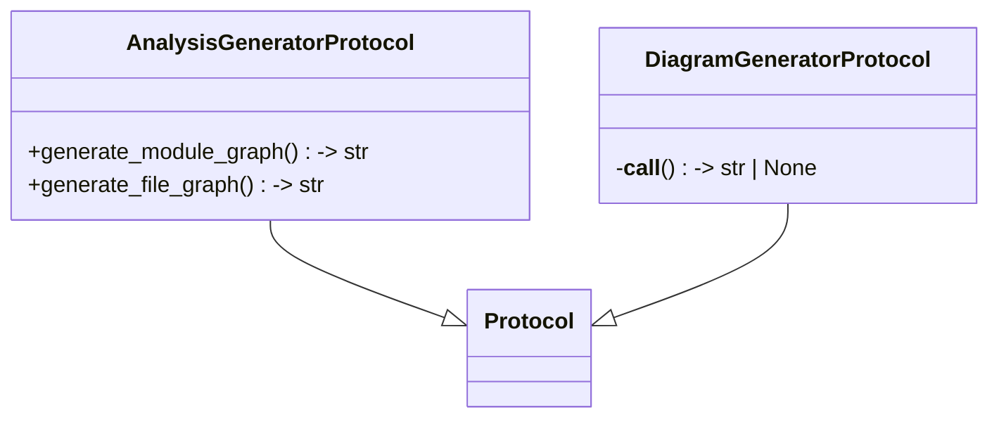

# File: `src/local_deepwiki/generators/protocols.py`

## File Overview

This file defines protocol interfaces for generator components within the `local_deepwiki.generators` package. These protocols serve as structural contracts that define the expected behavior of various generator classes, enabling loose coupling and facilitating testing through substitutable stubs.

The use of `typing.Protocol` with `@runtime_checkable` allows for runtime type checking, which supports diagnostic tools and guards. This design choice raises the abstraction level of the `generators` package and improves overall maintainability and testability by decoupling consumers from concrete implementations.

## Key Concepts

### Structural Typing with Protocols

The core abstraction used here is the `typing.Protocol`. Protocols define a structural interface rather than a behavioral one, allowing any class that implements the required methods to be considered compatible — without needing inheritance. This pattern is used extensively in Python for dependency injection and testing, enabling developers to write more flexible and maintainable code.

By defining `AnalysisGeneratorProtocol` and `DiagramGeneratorProtocol`, this module ensures that different generator implementations can be used interchangeably, provided they conform to the defined interfaces. This improves modularity and allows for easier extension or replacement of functionality.

### Runtime Checkability

Both protocols are marked with `@runtime_checkable`, meaning that `isinstance()` checks can be performed at runtime. This is particularly useful for validation logic and debugging, where it's important to confirm that an object adheres to a given protocol before invoking its methods.

### Design Rationale

These protocols were chosen to support a plugin architecture and improve testability. Since the actual generator implementations may vary (e.g., different graphing strategies or diagram generation styles), using protocols allows the system to remain flexible and robust against changes in implementation details.

## Integration

This file is imported and used by several components in the broader `local_deepwiki` ecosystem:

- **`src/local_deepwiki/cli/config_validator.py`**: Likely uses these protocols to validate that configured generators conform to expected interfaces.
- **`src/local_deepwiki/cli/main.py`**: May depend on these protocols when invoking generator functions in CLI workflows.
- **`src/local_deepwiki/generators/analysis/api_docs.py`**: This file likely implements one or more of the defined protocols to generate documentation or analysis outputs.
- **`src/local_deepwiki/handlers/types.py`**: Could utilize these protocols to define handler interfaces that accept generator inputs.
- **`src/local_deepwiki/plugins/__init__.py`**: Might use these protocols to register and manage plugin generators dynamically.

The [`IndexStatus`](../models/wiki.md) class from `local_deepwiki.core.index_manager` is used as a core input type in the protocols, indicating that these generators are tightly integrated with the indexing system of the application.

## Design Notes

### Why Protocols Instead of Abstract Base Classes (ABCs)

While ABCs could also define interfaces, protocols are preferred here due to their flexibility. Unlike ABCs, protocols do not require inheritance, which reduces coupling and allows for more flexible composition. This is especially important in a plugin-based system where various implementations might not share a common base class.

### Protocol Extensibility

The `DiagramGeneratorProtocol` is defined as a callable, which is a powerful pattern in Python for representing functional interfaces. It allows for a wide variety of diagram generation functions to conform to the same interface, regardless of their internal implementation.

### Parameters and Options

The parameters in `generate_module_graph` and `generate_file_graph` are carefully chosen to support common configuration options like `show_external`, `max_external`, `exclude_tests`, and `wiki_base_path`. These options reflect real-world usage patterns in dependency analysis and help make the API flexible enough to support diverse requirements without overcomplicating it.

### Return Values

Both protocols return `str` or `str | None`. The `None` return in `DiagramGeneratorProtocol` allows for graceful handling when input is insufficient to generate a meaningful diagram, which is a common edge case in code analysis tools.

## API Reference

### class `AnalysisGeneratorProtocol`

**Inherits from:** `Protocol`

Protocol defining the interface for dependency-graph analysis generators.  Components that generate module or file dependency graphs should accept this Protocol so that test stubs can be substituted without subclassing the concrete `[`DependencyGraphGenerator`](analysis/dependency_graph.md)`.

**Methods:**


<details>
<summary>View Source (lines 22-69) | <a href="https://github.com/UrbanDiver/local-deepwiki-mcp/blob/main/src/local_deepwiki/generators/protocols.py#L22-L69">GitHub</a></summary>

```python
class AnalysisGeneratorProtocol(Protocol):
    """Protocol defining the interface for dependency-graph analysis generators.

    Components that generate module or file dependency graphs should
    accept this Protocol so that test stubs can be substituted without
    subclassing the concrete ``DependencyGraphGenerator``.
    """

    async def generate_module_graph(
        self,
        index_status: IndexStatus,
        *,
        show_external: bool = False,
        max_external: int = 10,
        exclude_tests: bool = True,
        wiki_base_path: str = "",
    ) -> str:
        """Generate Mermaid graph of module dependencies.

        Args:
            index_status: Index status with file information.
            show_external: Whether to include external dependencies.
            max_external: Maximum external dependencies to show.
            exclude_tests: Whether to exclude test modules.
            wiki_base_path: Base path for wiki links.

        Returns:
            Mermaid diagram string.
        """
        ...

    async def generate_file_graph(
        self,
        index_status: IndexStatus,
        module_path: str,
        exclude_tests: bool = True,
    ) -> str:
        """Generate Mermaid graph for files within a module.

        Args:
            index_status: Index status with file information.
            module_path: Module/directory path to show files for.
            exclude_tests: Whether to exclude test files.

        Returns:
            Mermaid diagram string.
        """
        ...
```

</details>

#### `generate_module_graph`

```python
async def generate_module_graph(index_status: IndexStatus, show_external: bool = False, max_external: int = 10, exclude_tests: bool = True, wiki_base_path: str = "") -> str
```

Generate Mermaid graph of module dependencies.


| Parameter | Type | Default | Description |
|-----------|------|---------|-------------|
| `index_status` | `IndexStatus` | - | Index status with file information. |
| `show_external` | `bool` | `False` | Whether to include external dependencies. |
| `max_external` | `int` | `10` | Maximum external dependencies to show. |
| `exclude_tests` | `bool` | `True` | Whether to exclude test modules. |
| `wiki_base_path` | `str` | `""` | Base path for wiki links. |


<details>
<summary>View Source (lines 22-69) | <a href="https://github.com/UrbanDiver/local-deepwiki-mcp/blob/main/src/local_deepwiki/generators/protocols.py#L22-L69">GitHub</a></summary>

```python
class AnalysisGeneratorProtocol(Protocol):
    """Protocol defining the interface for dependency-graph analysis generators.

    Components that generate module or file dependency graphs should
    accept this Protocol so that test stubs can be substituted without
    subclassing the concrete ``DependencyGraphGenerator``.
    """

    async def generate_module_graph(
        self,
        index_status: IndexStatus,
        *,
        show_external: bool = False,
        max_external: int = 10,
        exclude_tests: bool = True,
        wiki_base_path: str = "",
    ) -> str:
        """Generate Mermaid graph of module dependencies.

        Args:
            index_status: Index status with file information.
            show_external: Whether to include external dependencies.
            max_external: Maximum external dependencies to show.
            exclude_tests: Whether to exclude test modules.
            wiki_base_path: Base path for wiki links.

        Returns:
            Mermaid diagram string.
        """
        ...

    async def generate_file_graph(
        self,
        index_status: IndexStatus,
        module_path: str,
        exclude_tests: bool = True,
    ) -> str:
        """Generate Mermaid graph for files within a module.

        Args:
            index_status: Index status with file information.
            module_path: Module/directory path to show files for.
            exclude_tests: Whether to exclude test files.

        Returns:
            Mermaid diagram string.
        """
        ...
```

</details>

#### `generate_file_graph`

```python
async def generate_file_graph(index_status: IndexStatus, module_path: str, exclude_tests: bool = True) -> str
```

Generate Mermaid graph for files within a module.


| Parameter | Type | Default | Description |
|-----------|------|---------|-------------|
| `index_status` | `IndexStatus` | - | Index status with file information. |
| `module_path` | `str` | - | Module/directory path to show files for. |
| `exclude_tests` | `bool` | `True` | Whether to exclude test files. |


<details>
<summary>View Source (lines 22-69) | <a href="https://github.com/UrbanDiver/local-deepwiki-mcp/blob/main/src/local_deepwiki/generators/protocols.py#L22-L69">GitHub</a></summary>

```python
class AnalysisGeneratorProtocol(Protocol):
    """Protocol defining the interface for dependency-graph analysis generators.

    Components that generate module or file dependency graphs should
    accept this Protocol so that test stubs can be substituted without
    subclassing the concrete ``DependencyGraphGenerator``.
    """

    async def generate_module_graph(
        self,
        index_status: IndexStatus,
        *,
        show_external: bool = False,
        max_external: int = 10,
        exclude_tests: bool = True,
        wiki_base_path: str = "",
    ) -> str:
        """Generate Mermaid graph of module dependencies.

        Args:
            index_status: Index status with file information.
            show_external: Whether to include external dependencies.
            max_external: Maximum external dependencies to show.
            exclude_tests: Whether to exclude test modules.
            wiki_base_path: Base path for wiki links.

        Returns:
            Mermaid diagram string.
        """
        ...

    async def generate_file_graph(
        self,
        index_status: IndexStatus,
        module_path: str,
        exclude_tests: bool = True,
    ) -> str:
        """Generate Mermaid graph for files within a module.

        Args:
            index_status: Index status with file information.
            module_path: Module/directory path to show files for.
            exclude_tests: Whether to exclude test files.

        Returns:
            Mermaid diagram string.
        """
        ...
```

</details>

### class `DiagramGeneratorProtocol`

**Inherits from:** `Protocol`

Protocol defining the interface for diagram generators.  Any callable that accepts code chunks and returns a Mermaid diagram string satisfies this contract.  This covers the family of `[`generate_class_diagram`](diagrams/class_diagram.md)`, `[`generate_dependency_graph`](diagrams/dependency_diagram.md)`, etc. functions in the ``generators.diagrams`` subpackage.

**Methods:**


<details>
<summary>View Source (lines 73-92) | <a href="https://github.com/UrbanDiver/local-deepwiki-mcp/blob/main/src/local_deepwiki/generators/protocols.py#L73-L92">GitHub</a></summary>

```python
class DiagramGeneratorProtocol(Protocol):
    """Protocol defining the interface for diagram generators.

    Any callable that accepts code chunks and returns a Mermaid diagram
    string satisfies this contract.  This covers the family of
    ``generate_class_diagram``, ``generate_dependency_graph``, etc.
    functions in the ``generators.diagrams`` subpackage.
    """

    def __call__(self, chunks: list, **kwargs: object) -> str | None:
        """Generate a Mermaid diagram from code chunks.

        Args:
            chunks: List of CodeChunk objects to analyze.
            **kwargs: Generator-specific options.

        Returns:
            Mermaid diagram string, or None if the input is insufficient.
        """
        ...
```

</details>

#### `__call__`

```python
def __call__(chunks: list) -> str | None
```

Generate a Mermaid diagram from code chunks.


| Parameter | Type | Default | Description |
|-----------|------|---------|-------------|
| `chunks` | `list` | - | List of CodeChunk objects to analyze. **kwargs: Generator-specific options. |


<details>
<summary>View Source (lines 73-92) | <a href="https://github.com/UrbanDiver/local-deepwiki-mcp/blob/main/src/local_deepwiki/generators/protocols.py#L73-L92">GitHub</a></summary>

```python
class DiagramGeneratorProtocol(Protocol):
    """Protocol defining the interface for diagram generators.

    Any callable that accepts code chunks and returns a Mermaid diagram
    string satisfies this contract.  This covers the family of
    ``generate_class_diagram``, ``generate_dependency_graph``, etc.
    functions in the ``generators.diagrams`` subpackage.
    """

    def __call__(self, chunks: list, **kwargs: object) -> str | None:
        """Generate a Mermaid diagram from code chunks.

        Args:
            chunks: List of CodeChunk objects to analyze.
            **kwargs: Generator-specific options.

        Returns:
            Mermaid diagram string, or None if the input is insufficient.
        """
        ...
```

</details>

## Class Diagram



## Usage Examples

*Examples extracted from test files*

### Example: `protocols`

From `test_protocols.py::TestChunkerProtocol::test_runtime_checkable`:

```python
assert hasattr(ChunkerProtocol, "__protocol_attrs__") or hasattr(
            ChunkerProtocol, "__abstractmethods__"
        )
        # runtime_checkable protocols support isinstance
        assert isinstance(ChunkerProtocol, type)
```

### Example: `AnalysisGeneratorProtocol`

From `test_protocols.py::TestAnalysisGeneratorProtocol::test_runtime_checkable`:

```python
assert isinstance(AnalysisGeneratorProtocol, type)
```

### Example: `AnalysisGeneratorProtocol`

From `test_protocols.py::TestAnalysisGeneratorProtocol::test_minimal_stub_satisfies_protocol`:

```python
class _StubGenerator:
            async def generate_module_graph(
                self,
                index_status: Any,
                *,
                show_external: bool = False,
                max_external: int = 10,
                exclude_tests: bool = True,
                wiki_base_path: str = "",
            ) -> str:
                return ""

            async def generate_file_graph(
                self,
                index_status: Any,
                module_path: str,
                exclude_tests: bool = True,
            ) -> str:
                return ""

        assert isinstance(_StubGenerator(), AnalysisGeneratorProtocol)
```

### Example: `DiagramGeneratorProtocol`

From `test_protocols.py::TestDiagramGeneratorProtocol::test_runtime_checkable`:

```python
assert isinstance(DiagramGeneratorProtocol, type)
```

### Example: `DiagramGeneratorProtocol`

From `test_protocols.py::TestDiagramGeneratorProtocol::test_callable_satisfies_protocol`:

```python
def my_generator(chunks: list, **kwargs: object) -> str | None:
            return None

        assert isinstance(my_generator, DiagramGeneratorProtocol)
```


## Last Modified

| Entity | Type | Author | Date | Commit |
|--------|------|--------|------|--------|
| `AnalysisGeneratorProtocol` | class | Brian Breidenbach | yesterday | `1eef062` refactor: complete Grade A ... |
| `DiagramGeneratorProtocol` | class | Brian Breidenbach | yesterday | `1eef062` refactor: complete Grade A ... |

## Relevant Source Files

- `src/local_deepwiki/generators/protocols.py:22-69`
