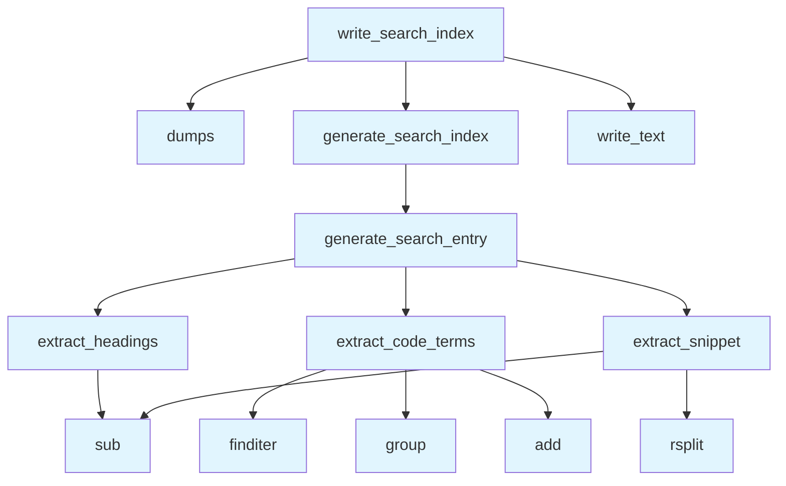

# Search Module

## File Overview

The search module provides functionality for generating search indices from wiki pages. It creates a JSON-based search index that can be used to enable search functionality within the wiki system.

## Functions

### write_search_index

```python
def write_search_index(wiki_path: Path, pages: list[WikiPage]) -> Path
```

Generate and write search index to disk.

**Parameters:**
- `wiki_path` (Path): Path to wiki directory
- `pages` (list[[WikiPage](../models.md)]): List of wiki pages to index

**Returns:**
- Path: Path to the generated search.json file

This function generates a search index from the provided wiki pages and writes it as a JSON file to the wiki directory. The search index is saved as `search.json` in the specified wiki path.

## Usage Examples

### Creating a Search Index

```python
from pathlib import Path
from local_deepwiki.generators.search import write_search_index
from local_deepwiki.models import WikiPage

# Assuming you have a list of WikiPage objects
wiki_directory = Path("./my_wiki")
pages = [...]  # List of WikiPage objects

# Generate and write the search index
index_path = write_search_index(wiki_directory, pages)
print(f"Search index written to: {index_path}")
```

## Related Components

This module works with the following components:

- **[WikiPage](../models.md)**: The core model representing wiki pages, imported from `local_deepwiki.models`
- Uses Python's built-in `json` module for serializing the search index
- Uses `pathlib.Path` for file system operations
- Uses `re` module for text processing operations

The module appears to have additional functions (extract_headings, extract_code_terms, extract_snippet, generate_search_entry, generate_search_index) that support the [main](../export/pdf.md) write_search_index function, though their implementations are not shown in the provided code.

## API Reference

### Functions

#### `extract_headings`

```python
def extract_headings(content: str) -> list[str]
```

Extract all headings from markdown content.


| [Parameter](api_docs.md) | Type | Default | Description |
|-----------|------|---------|-------------|
| `content` | `str` | - | Markdown content. |

**Returns:** `list[str]`


<details>
<summary>View Source (lines 14-33) | <a href="https://github.com/UrbanDiver/local-deepwiki-mcp/blob/feature/wiki-enhancements-round2/src/local_deepwiki/generators/search.py#L14-L33">GitHub</a></summary>

```python
def extract_headings(content: str) -> list[str]:
    """Extract all headings from markdown content.

    Args:
        content: Markdown content.

    Returns:
        List of heading texts (without # prefixes).
    """
    headings = []
    for line in content.split("\n"):
        line = line.strip()
        if line.startswith("#"):
            # Remove # prefix and clean up
            heading = re.sub(r"^#+\s*", "", line)
            # Remove markdown formatting like ** or `
            heading = re.sub(r"[*`]", "", heading)
            if heading:
                headings.append(heading)
    return headings
```

</details>

#### `extract_code_terms`

```python
def extract_code_terms(content: str) -> list[str]
```

Extract code terms (class names, function names) from content.


| [Parameter](api_docs.md) | Type | Default | Description |
|-----------|------|---------|-------------|
| `content` | `str` | - | Markdown content. |

**Returns:** `list[str]`


<details>
<summary>View Source (lines 36-57) | <a href="https://github.com/UrbanDiver/local-deepwiki-mcp/blob/feature/wiki-enhancements-round2/src/local_deepwiki/generators/search.py#L36-L57">GitHub</a></summary>

```python
def extract_code_terms(content: str) -> list[str]:
    """Extract code terms (class names, function names) from content.

    Args:
        content: Markdown content.

    Returns:
        List of code terms found in backticks.
    """
    terms = set()
    # Match inline code: `term`
    for match in re.finditer(r"`([^`]+)`", content):
        term = match.group(1)
        # Skip code that looks like a full statement or has spaces
        if len(term) < 50 and "\n" not in term:
            # Extract the main identifier if it's a qualified name
            parts = term.split(".")
            if parts:
                terms.add(parts[-1])  # Last part of qualified name
            if len(parts) > 1:
                terms.add(term)  # Also add full qualified name
    return list(terms)
```

</details>

#### `extract_snippet`

```python
def extract_snippet(content: str, max_length: int = 200) -> str
```

Extract a text snippet from markdown content.


| [Parameter](api_docs.md) | Type | Default | Description |
|-----------|------|---------|-------------|
| `content` | `str` | - | Markdown content. |
| `max_length` | `int` | `200` | Maximum snippet length. |

**Returns:** `str`


<details>
<summary>View Source (lines 60-84) | <a href="https://github.com/UrbanDiver/local-deepwiki-mcp/blob/feature/wiki-enhancements-round2/src/local_deepwiki/generators/search.py#L60-L84">GitHub</a></summary>

```python
def extract_snippet(content: str, max_length: int = 200) -> str:
    """Extract a text snippet from markdown content.

    Args:
        content: Markdown content.
        max_length: Maximum snippet length.

    Returns:
        Plain text snippet.
    """
    # Remove code blocks
    text = re.sub(r"```[\s\S]*?```", "", content)
    # Remove headings
    text = re.sub(r"^#+\s+.*$", "", text, flags=re.MULTILINE)
    # Remove links but keep text: [text](url) -> text
    text = re.sub(r"\[([^\]]+)\]\([^)]+\)", r"\1", text)
    # Remove markdown formatting
    text = re.sub(r"[*_`]", "", text)
    # Collapse whitespace
    text = " ".join(text.split())

    if len(text) > max_length:
        text = text[:max_length].rsplit(" ", 1)[0] + "..."

    return text.strip()
```

</details>

#### `generate_search_entry`

```python
def generate_search_entry(page: WikiPage) -> dict
```

Generate a search index entry for a wiki page.


| [Parameter](api_docs.md) | Type | Default | Description |
|-----------|------|---------|-------------|
| `page` | [`WikiPage`](../models.md) | - | The wiki page. |

**Returns:** `dict`


<details>
<summary>View Source (lines 87-106) | <a href="https://github.com/UrbanDiver/local-deepwiki-mcp/blob/feature/wiki-enhancements-round2/src/local_deepwiki/generators/search.py#L87-L106">GitHub</a></summary>

```python
def generate_search_entry(page: WikiPage) -> dict:
    """Generate a search index entry for a wiki page.

    Args:
        page: The wiki page.

    Returns:
        Dictionary with searchable fields.
    """
    headings = extract_headings(page.content)
    terms = extract_code_terms(page.content)
    snippet = extract_snippet(page.content)

    return {
        "path": page.path,
        "title": page.title,
        "headings": headings,
        "terms": terms,
        "snippet": snippet,
    }
```

</details>

#### `generate_search_index`

```python
def generate_search_index(pages: list[WikiPage]) -> list[dict]
```

Generate a search index from wiki pages.


| [Parameter](api_docs.md) | Type | Default | Description |
|-----------|------|---------|-------------|
| `pages` | `list[WikiPage]` | - | List of wiki pages. |

**Returns:** `list[dict]`


<details>
<summary>View Source (lines 109-118) | <a href="https://github.com/UrbanDiver/local-deepwiki-mcp/blob/feature/wiki-enhancements-round2/src/local_deepwiki/generators/search.py#L109-L118">GitHub</a></summary>

```python
def generate_search_index(pages: list[WikiPage]) -> list[dict]:
    """Generate a search index from wiki pages.

    Args:
        pages: List of wiki pages.

    Returns:
        List of search entries.
    """
    return [generate_search_entry(page) for page in pages]
```

</details>

#### `write_search_index`

```python
def write_search_index(wiki_path: Path, pages: list[WikiPage]) -> Path
```

Generate and write search index to disk.


| [Parameter](api_docs.md) | Type | Default | Description |
|-----------|------|---------|-------------|
| `wiki_path` | `Path` | - | Path to wiki directory. |
| `pages` | `list[WikiPage]` | - | List of wiki pages. |

**Returns:** `Path`


<details>
<summary>View Source (lines 121-134) | <a href="https://github.com/UrbanDiver/local-deepwiki-mcp/blob/feature/wiki-enhancements-round2/src/local_deepwiki/generators/search.py#L121-L134">GitHub</a></summary>

```python
def write_search_index(wiki_path: Path, pages: list[WikiPage]) -> Path:
    """Generate and write search index to disk.

    Args:
        wiki_path: Path to wiki directory.
        pages: List of wiki pages.

    Returns:
        Path to the generated search.json file.
    """
    index = generate_search_index(pages)
    index_path = wiki_path / "search.json"
    index_path.write_text(json.dumps(index, indent=2))
    return index_path
```

</details>

## Call Graph



## Used By

Functions and methods in this file and their callers:

- **`add`**: called by `extract_code_terms`
- **`dumps`**: called by `write_search_index`
- **`extract_code_terms`**: called by `generate_search_entry`
- **`extract_headings`**: called by `generate_search_entry`
- **`extract_snippet`**: called by `generate_search_entry`
- **`finditer`**: called by `extract_code_terms`
- **`generate_search_entry`**: called by `generate_search_index`
- **`generate_search_index`**: called by `write_search_index`
- **`group`**: called by `extract_code_terms`
- **`rsplit`**: called by `extract_snippet`
- **`sub`**: called by `extract_headings`, `extract_snippet`
- **`write_text`**: called by `write_search_index`

## Usage Examples

*Examples extracted from test files*

### Test extraction of h1 headings

From `test_search.py::test_extracts_h1_headings`:

```python
headings = extract_headings(content)
assert "Main Title" in headings
```

### Test extraction of h1, h2, h3 headings

From `test_search.py::test_extracts_multiple_heading_levels`:

```python
headings = extract_headings(content)
assert len(headings) == 4
```

### Test extraction of simple backticked terms

From `test_search.py::test_extracts_simple_terms`:

```python
terms = extract_code_terms(content)
assert "VectorStore" in terms
```

### Test extraction of qualified names

From `test_search.py::test_extracts_qualified_names`:

```python
terms = extract_code_terms(content)
# Should include both full qualified name and last part
assert "VectorStore" in terms
```

### Test basic snippet extraction

From `test_search.py::test_extracts_plain_text`:

```python
snippet = extract_snippet(content)
assert "simple paragraph" in snippet
```

## Relevant Source Files

- `src/local_deepwiki/generators/search.py:14-33`

## See Also

- [models](../models.md) - dependency
- [crosslinks](crosslinks.md) - shares 3 dependencies
- [see_also](see_also.md) - shares 3 dependencies
- [diagrams](diagrams.md) - shares 3 dependencies
