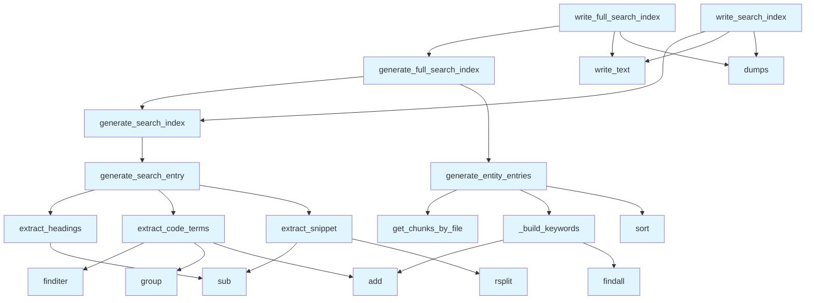

# search.py

## File Overview

This module provides functionality for generating search indexes from wiki pages. It creates JSON-based search indexes that can be used to enable search functionality within the wiki system.

## Functions

### write_search_index

```python
def write_search_index(wiki_path: Path, pages: list[WikiPage]) -> Path
```

Generates and writes a search index to disk using a legacy page-only approach.

**Parameters:**
- `wiki_path`: Path to the wiki directory where the search index will be written
- `pages`: List of [WikiPage](../models.md) objects to include in the search index

**Returns:**
- Path to the generated `search.json` file

**Description:**
This function creates a search index from the provided wiki pages and saves it as a JSON file in the wiki directory. It uses the generate_search_index function internally to build the index data structure.

### Additional Functions

Based on the module structure, this file contains several other functions that work together to build search indexes:

- `extract_headings`: Extracts heading information from content
- `extract_code_terms`: Extracts code-related terms for indexing
- `extract_snippet`: Extracts content snippets for search results
- `generate_search_entry`: Creates individual search entries
- `generate_search_index`: Builds the [main](../export/pdf.md) search index structure
- `generate_entity_entries`: Creates entries for entities in the index
- `_build_keywords`: Internal function for building keyword lists
- `generate_full_search_index`: Creates a comprehensive search index
- `write_full_search_index`: Writes the full search index to disk

## Usage Examples

### Basic Search Index Generation

```python
from pathlib import Path
from local_deepwiki.generators.search import write_search_index

# Generate search index for wiki pages
wiki_directory = Path("./my_wiki")
wiki_pages = [...]  # List of WikiPage objects
search_file_path = write_search_index(wiki_directory, wiki_pages)
print(f"Search index written to: {search_file_path}")
```

## Related Components

This module integrates with several other components:

- **[WikiPage](../models.md)**: The primary data model for wiki pages that are indexed
- **[VectorStore](../core/vectorstore.md)**: Used for vector-based search capabilities
- **[ChunkType](../models.md)**: Enumeration for different types of content chunks
- **[IndexStatus](../models.md)**: Status tracking for indexing operations

The module uses standard Python libraries including `json` for serialization, `re` for regular expressions, and `pathlib` for file system operations.

## API Reference

### Functions

#### `extract_headings`

```python
def extract_headings(content: str) -> list[str]
```

Extract all headings from markdown content.


| [Parameter](api_docs.md) | Type | Default | Description |
|-----------|------|---------|-------------|
| `content` | `str` | - | Markdown content. |

**Returns:** `list[str]`


<details>
<summary>View Source (lines 16-35) | <a href="https://github.com/UrbanDiver/local-deepwiki-mcp/blob/[main](../export/pdf.md)/src/local_deepwiki/generators/search.py#L16-L35">GitHub</a></summary>

```python
def extract_headings(content: str) -> list[str]:
    """Extract all headings from markdown content.

    Args:
        content: Markdown content.

    Returns:
        List of heading texts (without # prefixes).
    """
    headings = []
    for line in content.split("\n"):
        line = line.strip()
        if line.startswith("#"):
            # Remove # prefix and clean up
            heading = re.sub(r"^#+\s*", "", line)
            # Remove markdown formatting like ** or `
            heading = re.sub(r"[*`]", "", heading)
            if heading:
                headings.append(heading)
    return headings
```

</details>

#### `extract_code_terms`

```python
def extract_code_terms(content: str) -> list[str]
```

Extract code terms (class names, function names) from content.


| [Parameter](api_docs.md) | Type | Default | Description |
|-----------|------|---------|-------------|
| `content` | `str` | - | Markdown content. |

**Returns:** `list[str]`


<details>
<summary>View Source (lines 38-59) | <a href="https://github.com/UrbanDiver/local-deepwiki-mcp/blob/[main](../export/pdf.md)/src/local_deepwiki/generators/search.py#L38-L59">GitHub</a></summary>

```python
def extract_code_terms(content: str) -> list[str]:
    """Extract code terms (class names, function names) from content.

    Args:
        content: Markdown content.

    Returns:
        List of code terms found in backticks.
    """
    terms = set()
    # Match inline code: `term`
    for match in re.finditer(r"`([^`]+)`", content):
        term = match.group(1)
        # Skip code that looks like a full statement or has spaces
        if len(term) < 50 and "\n" not in term:
            # Extract the main identifier if it's a qualified name
            parts = term.split(".")
            if parts:
                terms.add(parts[-1])  # Last part of qualified name
            if len(parts) > 1:
                terms.add(term)  # Also add full qualified name
    return list(terms)
```

</details>

#### `extract_snippet`

```python
def extract_snippet(content: str, max_length: int = 200) -> str
```

Extract a text snippet from markdown content.


| [Parameter](api_docs.md) | Type | Default | Description |
|-----------|------|---------|-------------|
| `content` | `str` | - | Markdown content. |
| `max_length` | `int` | `200` | Maximum snippet length. |

**Returns:** `str`


<details>
<summary>View Source (lines 62-86) | <a href="https://github.com/UrbanDiver/local-deepwiki-mcp/blob/[main](../export/pdf.md)/src/local_deepwiki/generators/search.py#L62-L86">GitHub</a></summary>

```python
def extract_snippet(content: str, max_length: int = 200) -> str:
    """Extract a text snippet from markdown content.

    Args:
        content: Markdown content.
        max_length: Maximum snippet length.

    Returns:
        Plain text snippet.
    """
    # Remove code blocks
    text = re.sub(r"```[\s\S]*?```", "", content)
    # Remove headings
    text = re.sub(r"^#+\s+.*$", "", text, flags=re.MULTILINE)
    # Remove links but keep text: [text](url) -> text
    text = re.sub(r"\[([^\]]+)\]\([^)]+\)", r"\1", text)
    # Remove markdown formatting
    text = re.sub(r"[*_`]", "", text)
    # Collapse whitespace
    text = " ".join(text.split())

    if len(text) > max_length:
        text = text[:max_length].rsplit(" ", 1)[0] + "..."

    return text.strip()
```

</details>

#### `generate_search_entry`

```python
def generate_search_entry(page: WikiPage) -> dict
```

Generate a search index entry for a wiki page.


| [Parameter](api_docs.md) | Type | Default | Description |
|-----------|------|---------|-------------|
| `page` | [`WikiPage`](../models.md) | - | The wiki page. |

**Returns:** `dict`


<details>
<summary>View Source (lines 89-108) | <a href="https://github.com/UrbanDiver/local-deepwiki-mcp/blob/[main](../export/pdf.md)/src/local_deepwiki/generators/search.py#L89-L108">GitHub</a></summary>

```python
def generate_search_entry(page: WikiPage) -> dict:
    """Generate a search index entry for a wiki page.

    Args:
        page: The wiki page.

    Returns:
        Dictionary with searchable fields.
    """
    headings = extract_headings(page.content)
    terms = extract_code_terms(page.content)
    snippet = extract_snippet(page.content)

    return {
        "path": page.path,
        "title": page.title,
        "headings": headings,
        "terms": terms,
        "snippet": snippet,
    }
```

</details>

#### `generate_search_index`

```python
def generate_search_index(pages: list[WikiPage]) -> list[dict]
```

Generate a search index from wiki pages.


| [Parameter](api_docs.md) | Type | Default | Description |
|-----------|------|---------|-------------|
| `pages` | `list[WikiPage]` | - | List of wiki pages. |

**Returns:** `list[dict]`


<details>
<summary>View Source (lines 111-120) | <a href="https://github.com/UrbanDiver/local-deepwiki-mcp/blob/[main](../export/pdf.md)/src/local_deepwiki/generators/search.py#L111-L120">GitHub</a></summary>

```python
def generate_search_index(pages: list[WikiPage]) -> list[dict]:
    """Generate a search index from wiki pages.

    Args:
        pages: List of wiki pages.

    Returns:
        List of search entries.
    """
    return [generate_search_entry(page) for page in pages]
```

</details>

#### `generate_entity_entries`

```python
async def generate_entity_entries(index_status: IndexStatus, vector_store: VectorStore) -> list[dict]
```

Generate search entries for individual code entities.  Creates searchable entries for each function, class, and method with type information for filtering.


| [Parameter](api_docs.md) | Type | Default | Description |
|-----------|------|---------|-------------|
| `index_status` | [`IndexStatus`](../models.md) | - | Index status with file information. |
| `vector_store` | [`VectorStore`](../core/vectorstore.md) | - | Vector store with code chunks. |

**Returns:** `list[dict]`


<details>
<summary>View Source (lines 123-204) | <a href="https://github.com/UrbanDiver/local-deepwiki-mcp/blob/[main](../export/pdf.md)/src/local_deepwiki/generators/search.py#L123-L204">GitHub</a></summary>

```python
async def generate_entity_entries(
    index_status: IndexStatus,
    vector_store: VectorStore,
) -> list[dict]:
    """Generate search entries for individual code entities.

    Creates searchable entries for each function, class, and method
    with type information for filtering.

    Args:
        index_status: Index status with file information.
        vector_store: Vector store with code chunks.

    Returns:
        List of entity search entries.
    """
    entries: list[dict] = []

    for file_info in index_status.files:
        chunks = await vector_store.get_chunks_by_file(file_info.path)

        for chunk in chunks:
            if chunk.chunk_type not in (ChunkType.CLASS, ChunkType.FUNCTION, ChunkType.METHOD):
                continue

            # Determine entity type
            entity_type = chunk.chunk_type.value  # 'class', 'function', 'method'

            # Build display name
            if chunk.chunk_type == ChunkType.METHOD and chunk.parent_name:
                display_name = f"{chunk.parent_name}.{chunk.name}"
            else:
                display_name = chunk.name or "Unknown"

            # Extract metadata
            metadata = chunk.metadata or {}
            param_types = metadata.get("parameter_types", {})
            return_type = metadata.get("return_type")
            raises = metadata.get("raises", [])
            is_async = metadata.get("is_async", False)

            # Build signature preview
            signature = ""
            if entity_type != "class":
                params = list(param_types.keys())[:3]
                if len(param_types) > 3:
                    params.append("...")
                signature = f"({', '.join(params)})"
                if return_type:
                    signature += f" → {return_type}"

            # Build brief description from docstring
            description = ""
            if chunk.docstring:
                first_line = chunk.docstring.split("\n")[0].strip()
                if len(first_line) > 80:
                    description = first_line[:77] + "..."
                else:
                    description = first_line

            # Build wiki path
            wiki_path = f"files/{file_info.path}".replace(".py", ".md")

            entry = {
                "type": "entity",
                "entity_type": entity_type,
                "name": chunk.name or "Unknown",
                "display_name": display_name,
                "path": wiki_path,
                "file": file_info.path,
                "signature": signature,
                "description": description,
                "is_async": is_async,
                "raises": raises,
                # Keywords for search matching
                "keywords": _build_keywords(chunk.name, param_types, return_type, raises),
            }
            entries.append(entry)

    # Sort by name for consistent output
    entries.sort(key=lambda e: e["display_name"].lower())
    return entries
```

</details>

#### `generate_full_search_index`

```python
async def generate_full_search_index(pages: list[WikiPage], index_status: IndexStatus | None = None, vector_store: VectorStore | None = None) -> dict
```

Generate a comprehensive search index with pages and entities.


| [Parameter](api_docs.md) | Type | Default | Description |
|-----------|------|---------|-------------|
| `pages` | `list[WikiPage]` | - | List of wiki pages. |
| `index_status` | `IndexStatus | None` | `None` | Optional index status for entity extraction. |
| `vector_store` | `VectorStore | None` | `None` | Optional vector store for entity extraction. |

**Returns:** `dict`


<details>
<summary>View Source (lines 262-290) | <a href="https://github.com/UrbanDiver/local-deepwiki-mcp/blob/[main](../export/pdf.md)/src/local_deepwiki/generators/search.py#L262-L290">GitHub</a></summary>

```python
async def generate_full_search_index(
    pages: list[WikiPage],
    index_status: IndexStatus | None = None,
    vector_store: VectorStore | None = None,
) -> dict:
    """Generate a comprehensive search index with pages and entities.

    Args:
        pages: List of wiki pages.
        index_status: Optional index status for entity extraction.
        vector_store: Optional vector store for entity extraction.

    Returns:
        Dictionary with 'pages' and 'entities' lists.
    """
    page_entries = generate_search_index(pages)

    entity_entries: list[dict] = []
    if index_status and vector_store:
        entity_entries = await generate_entity_entries(index_status, vector_store)

    return {
        "pages": page_entries,
        "entities": entity_entries,
        "meta": {
            "total_pages": len(page_entries),
            "total_entities": len(entity_entries),
        },
    }
```

</details>

#### `write_search_index`

```python
def write_search_index(wiki_path: Path, pages: list[WikiPage]) -> Path
```

Generate and write search index to disk (legacy page-only version).


| [Parameter](api_docs.md) | Type | Default | Description |
|-----------|------|---------|-------------|
| `wiki_path` | `Path` | - | Path to wiki directory. |
| `pages` | `list[WikiPage]` | - | List of wiki pages. |

**Returns:** `Path`


<details>
<summary>View Source (lines 293-306) | <a href="https://github.com/UrbanDiver/local-deepwiki-mcp/blob/[main](../export/pdf.md)/src/local_deepwiki/generators/search.py#L293-L306">GitHub</a></summary>

```python
def write_search_index(wiki_path: Path, pages: list[WikiPage]) -> Path:
    """Generate and write search index to disk (legacy page-only version).

    Args:
        wiki_path: Path to wiki directory.
        pages: List of wiki pages.

    Returns:
        Path to the generated search.json file.
    """
    index = generate_search_index(pages)
    index_path = wiki_path / "search.json"
    index_path.write_text(json.dumps(index, indent=2))
    return index_path
```

</details>

#### `write_full_search_index`

```python
async def write_full_search_index(wiki_path: Path, pages: list[WikiPage], index_status: IndexStatus, vector_store: VectorStore) -> Path
```

Generate and write comprehensive search index to disk.  Includes both page-level and entity-level search entries.


| [Parameter](api_docs.md) | Type | Default | Description |
|-----------|------|---------|-------------|
| `wiki_path` | `Path` | - | Path to wiki directory. |
| `pages` | `list[WikiPage]` | - | List of wiki pages. |
| `index_status` | [`IndexStatus`](../models.md) | - | Index status with file information. |
| `vector_store` | [`VectorStore`](../core/vectorstore.md) | - | Vector store with code chunks. |

**Returns:** `Path`


<details>
<summary>View Source (lines 309-331) | <a href="https://github.com/UrbanDiver/local-deepwiki-mcp/blob/[main](../export/pdf.md)/src/local_deepwiki/generators/search.py#L309-L331">GitHub</a></summary>

```python
async def write_full_search_index(
    wiki_path: Path,
    pages: list[WikiPage],
    index_status: IndexStatus,
    vector_store: VectorStore,
) -> Path:
    """Generate and write comprehensive search index to disk.

    Includes both page-level and entity-level search entries.

    Args:
        wiki_path: Path to wiki directory.
        pages: List of wiki pages.
        index_status: Index status with file information.
        vector_store: Vector store with code chunks.

    Returns:
        Path to the generated search.json file.
    """
    index = await generate_full_search_index(pages, index_status, vector_store)
    index_path = wiki_path / "search.json"
    index_path.write_text(json.dumps(index, indent=2))
    return index_path
```

</details>

## Call Graph



## Used By

Functions and methods in this file and their callers:

- **`_build_keywords`**: called by `generate_entity_entries`
- **`add`**: called by `_build_keywords`, `extract_code_terms`
- **`dumps`**: called by `write_full_search_index`, `write_search_index`
- **`extract_code_terms`**: called by `generate_search_entry`
- **`extract_headings`**: called by `generate_search_entry`
- **`extract_snippet`**: called by `generate_search_entry`
- **`findall`**: called by `_build_keywords`
- **`finditer`**: called by `extract_code_terms`
- **`generate_entity_entries`**: called by `generate_full_search_index`
- **`generate_full_search_index`**: called by `write_full_search_index`
- **`generate_search_entry`**: called by `generate_search_index`
- **`generate_search_index`**: called by `generate_full_search_index`, `write_search_index`
- **`get_chunks_by_file`**: called by `generate_entity_entries`
- **`group`**: called by `extract_code_terms`
- **`rsplit`**: called by `extract_snippet`
- **`sort`**: called by `generate_entity_entries`
- **`sub`**: called by `extract_headings`, `extract_snippet`
- **`write_text`**: called by `write_full_search_index`, `write_search_index`

## Usage Examples

*Examples extracted from test files*

### Test extraction of h1 headings

From `test_search.py::TestExtractHeadings::test_extracts_h1_headings`:

```python
content = "# Main Title\n\nSome content"
headings = extract_headings(content)
assert "Main Title" in headings
```

### Test extraction of h1, h2, h3 headings

From `test_search.py::TestExtractHeadings::test_extracts_multiple_heading_levels`:

```python
content = """# Title
## Section One
### Subsection
## Section Two
"""
        headings = extract_headings(content)
        assert len(headings) == 4
        assert "Title" in headings
        assert "Section One" in headings
        assert "Subsection" in headings
        assert "Section Two" in headings
```

### Test extraction of simple backticked terms

From `test_search.py::TestExtractCodeTerms::test_extracts_simple_terms`:

```python
content = "Use `VectorStore` and `WikiGenerator` for docs."
terms = extract_code_terms(content)
assert "VectorStore" in terms
assert "WikiGenerator" in terms
```

### Test extraction of qualified names

From `test_search.py::TestExtractCodeTerms::test_extracts_qualified_names`:

```python
content = "Import `local_deepwiki.core.VectorStore` from module."
terms = extract_code_terms(content)
# Should include both full qualified name and last part
assert "VectorStore" in terms
assert "local_deepwiki.core.VectorStore" in terms
```

### Test basic snippet extraction

From `test_search.py::TestExtractSnippet::test_extracts_plain_text`:

```python
content = "This is a simple paragraph of text."
snippet = extract_snippet(content)
assert "simple paragraph" in snippet
```


## Last Modified

| Entity | Type | Author | Date | Commit |
|--------|------|--------|------|--------|
| `generate_entity_entries` | function | Brian Breidenbach | today | `553a2ee` Add entity-level search wit... |
| `_build_keywords` | function | Brian Breidenbach | today | `553a2ee` Add entity-level search wit... |
| `generate_full_search_index` | function | Brian Breidenbach | today | `553a2ee` Add entity-level search wit... |
| `write_search_index` | function | Brian Breidenbach | today | `553a2ee` Add entity-level search wit... |
| `write_full_search_index` | function | Brian Breidenbach | today | `553a2ee` Add entity-level search wit... |
| `extract_headings` | function | Brian Breidenbach | 3 days ago | `c568951` Add input validation, type ... |
| `extract_code_terms` | function | Brian Breidenbach | 3 days ago | `c568951` Add input validation, type ... |
| `extract_snippet` | function | Brian Breidenbach | 3 days ago | `c568951` Add input validation, type ... |
| `generate_search_entry` | function | Brian Breidenbach | 3 days ago | `c568951` Add input validation, type ... |
| `generate_search_index` | function | Brian Breidenbach | 5 days ago | `1315c7f` Add wiki improvements: incr... |

## Additional Source Code

Source code for functions and methods not listed in the API Reference above.

#### `_build_keywords`

<details>
<summary>View Source (lines 207-259) | <a href="https://github.com/UrbanDiver/local-deepwiki-mcp/blob/[main](../export/pdf.md)/src/local_deepwiki/generators/search.py#L207-L259">GitHub</a></summary>

```python
def _build_keywords(
    name: str | None,
    param_types: dict[str, str],
    return_type: str | None,
    raises: list[str],
) -> list[str]:
    """Build search keywords from entity metadata.

    Args:
        name: Entity name.
        param_types: Parameter types mapping.
        return_type: Return type string.
        raises: List of exception types.

    Returns:
        List of searchable keywords.
    """
    keywords: set[str] = set()

    # Add name parts (split on underscore and camelCase)
    if name:
        keywords.add(name.lower())
        # Split on underscores
        for part in name.split("_"):
            if len(part) > 2:
                keywords.add(part.lower())
        # Split camelCase
        camel_parts = re.findall(r"[A-Z][a-z]+|[a-z]+", name)
        for part in camel_parts:
            if len(part) > 2:
                keywords.add(part.lower())

    # Add type keywords
    for type_str in param_types.values():
        if type_str:
            # Extract base type (e.g., "list" from "list[str]")
            base_type = re.split(r"[\[\]|,\s]", type_str)[0].lower()
            if base_type:
                keywords.add(base_type)

    if return_type:
        base_return = re.split(r"[\[\]|,\s]", return_type)[0].lower()
        if base_return:
            keywords.add(base_return)

    # Add exception keywords
    for exc in raises:
        keywords.add(exc.lower())
        # Also add without "Error" suffix for easier search
        if exc.endswith("Error"):
            keywords.add(exc[:-5].lower())

    return list(keywords)
```

</details>

## Relevant Source Files

- `src/local_deepwiki/generators/search.py:16-35`

## See Also

- [models](../models.md) - dependency
- [vectorstore](../core/vectorstore.md) - dependency
- [crosslinks](crosslinks.md) - shares 3 dependencies
- [see_also](see_also.md) - shares 3 dependencies
- [diagrams](diagrams.md) - shares 3 dependencies

## See Also

- [vectorstore](../core/vectorstore.md) - dependency
- [crosslinks](crosslinks.md) - shares 3 dependencies
- [see_also](see_also.md) - shares 3 dependencies
- [diagrams](diagrams.md) - shares 3 dependencies
