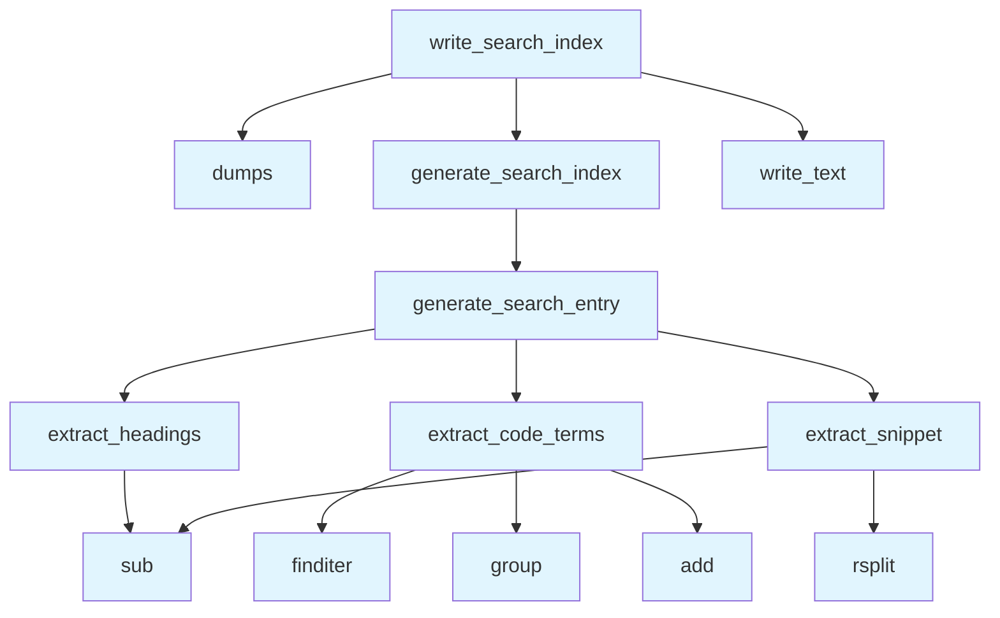

# Search Module

## File Overview

The search module provides functionality for generating search indices from wiki pages. It creates JSON-based search data that can be used to enable search functionality in wikis.

## Functions

### generate_search_index

```python
def generate_search_index(pages: list[WikiPage]) -> list[dict]:
```

Generates a search index from a list of wiki pages.

**Parameters:**
- `pages`: List of [WikiPage](../models.md) objects to index

**Returns:**
- List of search entries as dictionaries

### write_search_index

```python
def write_search_index(wiki_path: Path, pages: list[WikiPage]) -> Path:
```

Generates and writes a search index to disk as a JSON file.

**Parameters:**
- `wiki_path`: Path to the wiki directory where the search index will be saved
- `pages`: List of [WikiPage](../models.md) objects to index

**Returns:**
- Path to the generated `search.json` file

## Usage Examples

### Basic Search Index Generation

```python
from pathlib import Path
from local_deepwiki.generators.search import generate_search_index, write_search_index

# Generate search index in memory
pages = [...]  # List of WikiPage objects
search_entries = generate_search_index(pages)

# Write search index to file
wiki_directory = Path("./wiki")
index_path = write_search_index(wiki_directory, pages)
print(f"Search index written to: {index_path}")
```

## Related Components

This module works with the following components:

- **[WikiPage](../models.md)**: The core page model used to represent wiki pages (imported from `local_deepwiki.models`)

The module also references additional functions that are part of the search functionality:
- `extract_headings`
- `extract_code_terms` 
- `extract_snippet`
- `generate_search_entry`

These functions work together to create comprehensive search entries from wiki page content.

## API Reference

### Functions

#### `extract_headings`

```python
def extract_headings(content: str) -> list[str]
```

Extract all headings from markdown content.


| [Parameter](api_docs.md) | Type | Default | Description |
|-----------|------|---------|-------------|
| `content` | `str` | - | Markdown content. |

**Returns:** `list[str]`


#### `extract_code_terms`

```python
def extract_code_terms(content: str) -> list[str]
```

Extract code terms (class names, function names) from content.


| [Parameter](api_docs.md) | Type | Default | Description |
|-----------|------|---------|-------------|
| `content` | `str` | - | Markdown content. |

**Returns:** `list[str]`


#### `extract_snippet`

```python
def extract_snippet(content: str, max_length: int = 200) -> str
```

Extract a text snippet from markdown content.


| [Parameter](api_docs.md) | Type | Default | Description |
|-----------|------|---------|-------------|
| `content` | `str` | - | Markdown content. |
| `max_length` | `int` | `200` | Maximum snippet length. |

**Returns:** `str`


#### `generate_search_entry`

```python
def generate_search_entry(page: WikiPage) -> dict
```

Generate a search index entry for a wiki page.


| [Parameter](api_docs.md) | Type | Default | Description |
|-----------|------|---------|-------------|
| `page` | [`WikiPage`](../models.md) | - | The wiki page. |

**Returns:** `dict`


#### `generate_search_index`

```python
def generate_search_index(pages: list[WikiPage]) -> list[dict]
```

Generate a search index from wiki pages.


| [Parameter](api_docs.md) | Type | Default | Description |
|-----------|------|---------|-------------|
| `pages` | `list[WikiPage]` | - | List of wiki pages. |

**Returns:** `list[dict]`


#### `write_search_index`

```python
def write_search_index(wiki_path: Path, pages: list[WikiPage]) -> Path
```

Generate and write search index to disk.


| [Parameter](api_docs.md) | Type | Default | Description |
|-----------|------|---------|-------------|
| `wiki_path` | `Path` | - | Path to wiki directory. |
| `pages` | `list[WikiPage]` | - | List of wiki pages. |

**Returns:** `Path`


## Call Graph



## Usage Examples

*Examples extracted from test files*

### Test extraction of h1 headings

From `test_search.py::test_extracts_h1_headings`:

```python
headings = extract_headings(content)
assert "Main Title" in headings
```

### Test extraction of h1, h2, h3 headings

From `test_search.py::test_extracts_multiple_heading_levels`:

```python
headings = extract_headings(content)
assert len(headings) == 4
```

### Test extraction of simple backticked terms

From `test_search.py::test_extracts_simple_terms`:

```python
terms = extract_code_terms(content)
assert "VectorStore" in terms
```

### Test extraction of qualified names

From `test_search.py::test_extracts_qualified_names`:

```python
terms = extract_code_terms(content)
# Should include both full qualified name and last part
assert "VectorStore" in terms
```

### Test basic snippet extraction

From `test_search.py::test_extracts_plain_text`:

```python
snippet = extract_snippet(content)
assert "simple paragraph" in snippet
```

## Relevant Source Files

- `src/local_deepwiki/generators/search.py:14-33`

## See Also

- [models](../models.md) - dependency
- [crosslinks](crosslinks.md) - shares 3 dependencies
- [diagrams](diagrams.md) - shares 3 dependencies
- [see_also](see_also.md) - shares 3 dependencies
