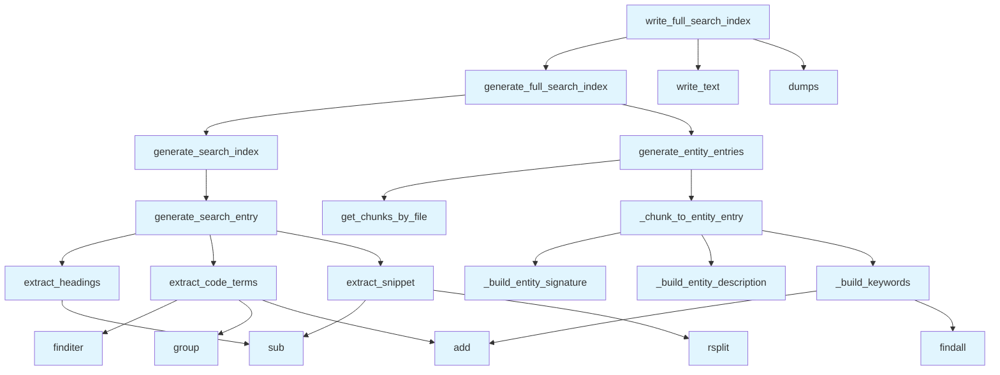

# File: `src/local_deepwiki/generators/search.py`

## File Overview

This module is responsible for generating a JSON search index that enables client-side full-text search across wiki documentation. The index includes both page-level entries (from markdown content) and entity-level entries (from code chunks such as functions, classes, and methods).

The design rationale is to provide a lightweight, client-side search solution that can be used without external dependencies or server-side processing. The search index is generated by parsing wiki pages and code chunks, extracting meaningful content, and structuring it into a searchable format.

## Key Concepts

### Search Index Structure
The search index is structured as a dictionary with two main components:
- `pages`: Page-level entries that include headings, code terms, and snippets for full-text search.
- `entities`: Entity-level entries for code constructs (functions, classes, methods) with metadata such as type information, signatures, and exceptions.

### Content Extraction
Several helper functions are used to extract meaningful content from markdown and code:
- `extract_headings`: Extracts heading text from markdown.
- `extract_code_terms`: Identifies code terms from inline code blocks.
- `extract_snippet`: Generates a plain text snippet for preview.

These functions use regular expressions to parse content, with care taken to avoid extracting overly long or complex code snippets.

### Entity Metadata Handling
Entity-level search entries are built from [`CodeChunk`](../models/chunks.md) objects, which contain metadata such as:
- [Parameter](analysis/api_docs.md) types
- Return types
- Exception types (`raises`)
- Async status

The `_build_keywords` function aggregates these into a searchable list of terms, splitting names and types into meaningful parts.

### Asynchronous Processing
The module uses asynchronous functions (`generate_entity_entries`, `generate_full_search_index`, `write_full_search_index`) to allow for efficient processing of large codebases, particularly when interacting with a [`VectorStore`](../core/vectorstore/store.md) to retrieve code chunks.

## Integration

This module integrates with the following components:

- **[`VectorStore`](../core/vectorstore/store.md)**: Used to retrieve [`CodeChunk`](../models/chunks.md) objects for entity-level search entries. The `generate_entity_entries` function fetches chunks by file path and processes them into structured search entries.
- **[`IndexStatus`](../models/wiki.md)**: Provides information about which files need to be indexed, used in `generate_entity_entries` to iterate over files.
- **[`WikiPage`](../export/streaming.md)**: Represents markdown content that is processed into page-level search entries via `generate_search_index` and `generate_search_entry`.
- **CLI Tools**: The `write_full_search_index` function is used by CLI commands to generate and persist the search index to disk.

The module is called by `test_search`, indicating it is a core part of the system's testing suite, ensuring search functionality works correctly across both pages and code entities.

## Design Notes

### Why JSON?
The search index is stored as JSON to ensure compatibility with client-side JavaScript-based search implementations. It avoids the need for a database or complex server-side logic, enabling simple static file serving.

### Handling Code Terms
The `extract_code_terms` function filters out long or multi-line code snippets to avoid indexing noisy or unhelpful content. It also extracts qualified names (e.g., `module.Class.method`) and their last components for better search coverage.

### Entity Signature Building
The `_build_entity_signature` function provides a concise preview of function signatures, limiting parameters to the first three and truncating long lists. This helps with search result clarity and performance.

### Keyword Generation
The `_build_keywords` function is designed to extract meaningful search terms from entity metadata:
- Names are split by underscores and camelCase for better matching.
- Type information is normalized by extracting base types (e.g., `list[str]` → `list`).
- Exception names are normalized to remove the "Error" suffix for easier discovery.

### Asynchronous Workflow
The use of `async` functions ensures that the search index generation does not block the main thread, particularly when retrieving data from a [`VectorStore`](../core/vectorstore/store.md), which may involve disk or network I/O.

### Edge Cases
- Empty or malformed docstrings are handled gracefully in `_build_entity_description`.
- Long snippets are truncated with an ellipsis (`...`) to prevent oversized index entries.
- Code terms with spaces or full statements are filtered out to avoid indexing non-meaningful content.

## API Reference

### Functions

#### `extract_headings`

```python
def extract_headings(content: str) -> list[str]
```

Extract all headings from markdown content.


| Parameter | Type | Default | Description |
|-----------|------|---------|-------------|
| `content` | `str` | - | Markdown content. |

**Returns:** `list[str]`


<details>
<summary>View Source (lines 18-37) | <a href="https://github.com/UrbanDiver/local-deepwiki-mcp/blob/main/src/local_deepwiki/generators/search.py#L18-L37">GitHub</a></summary>

```python
def extract_headings(content: str) -> list[str]:
    """Extract all headings from markdown content.

    Args:
        content: Markdown content.

    Returns:
        List of heading texts (without # prefixes).
    """
    headings = []
    for line in content.split("\n"):
        line = line.strip()
        if line.startswith("#"):
            # Remove # prefix and clean up
            heading = re.sub(r"^#+\s*", "", line)
            # Remove markdown formatting like ** or `
            heading = re.sub(r"[*`]", "", heading)
            if heading:
                headings.append(heading)
    return headings
```

</details>

#### `extract_code_terms`

```python
def extract_code_terms(content: str) -> list[str]
```

Extract code terms (class names, function names) from content.


| Parameter | Type | Default | Description |
|-----------|------|---------|-------------|
| `content` | `str` | - | Markdown content. |

**Returns:** `list[str]`


<details>
<summary>View Source (lines 40-61) | <a href="https://github.com/UrbanDiver/local-deepwiki-mcp/blob/main/src/local_deepwiki/generators/search.py#L40-L61">GitHub</a></summary>

```python
def extract_code_terms(content: str) -> list[str]:
    """Extract code terms (class names, function names) from content.

    Args:
        content: Markdown content.

    Returns:
        List of code terms found in backticks.
    """
    terms = set()
    # Match inline code: `term`
    for match in re.finditer(r"`([^`]+)`", content):
        term = match.group(1)
        # Skip code that looks like a full statement or has spaces
        if len(term) < 50 and "\n" not in term:
            # Extract the main identifier if it's a qualified name
            parts = term.split(".")
            if parts:
                terms.add(parts[-1])  # Last part of qualified name
            if len(parts) > 1:
                terms.add(term)  # Also add full qualified name
    return list(terms)
```

</details>

#### `extract_snippet`

```python
def extract_snippet(content: str, max_length: int = 200) -> str
```

Extract a text snippet from markdown content.


| Parameter | Type | Default | Description |
|-----------|------|---------|-------------|
| `content` | `str` | - | Markdown content. |
| `max_length` | `int` | `200` | Maximum snippet length. |

**Returns:** `str`


<details>
<summary>View Source (lines 64-88) | <a href="https://github.com/UrbanDiver/local-deepwiki-mcp/blob/main/src/local_deepwiki/generators/search.py#L64-L88">GitHub</a></summary>

```python
def extract_snippet(content: str, max_length: int = 200) -> str:
    """Extract a text snippet from markdown content.

    Args:
        content: Markdown content.
        max_length: Maximum snippet length.

    Returns:
        Plain text snippet.
    """
    # Remove code blocks
    text = re.sub(r"```[\s\S]*?```", "", content)
    # Remove headings
    text = re.sub(r"^#+\s+.*$", "", text, flags=re.MULTILINE)
    # Remove links but keep text: [text](url) -> text
    text = re.sub(r"\[([^\]]+)\]\([^)]+\)", r"\1", text)
    # Remove markdown formatting
    text = re.sub(r"[*_`]", "", text)
    # Collapse whitespace
    text = " ".join(text.split())

    if len(text) > max_length:
        text = text[:max_length].rsplit(" ", 1)[0] + "..."

    return text.strip()
```

</details>

#### `generate_search_entry`

```python
def generate_search_entry(page: WikiPage) -> dict
```

Generate a search index entry for a wiki page.


| Parameter | Type | Default | Description |
|-----------|------|---------|-------------|
| `page` | `WikiPage` | - | The wiki page. |

**Returns:** `dict`


<details>
<summary>View Source (lines 91-110) | <a href="https://github.com/UrbanDiver/local-deepwiki-mcp/blob/main/src/local_deepwiki/generators/search.py#L91-L110">GitHub</a></summary>

```python
def generate_search_entry(page: WikiPage) -> dict:
    """Generate a search index entry for a wiki page.

    Args:
        page: The wiki page.

    Returns:
        Dictionary with searchable fields.
    """
    headings = extract_headings(page.content)
    terms = extract_code_terms(page.content)
    snippet = extract_snippet(page.content)

    return {
        "path": page.path,
        "title": page.title,
        "headings": headings,
        "terms": terms,
        "snippet": snippet,
    }
```

</details>

#### `generate_search_index`

```python
def generate_search_index(pages: list[WikiPage]) -> list[dict]
```

Generate a search index from wiki pages.


| Parameter | Type | Default | Description |
|-----------|------|---------|-------------|
| `pages` | `list[WikiPage]` | - | List of wiki pages. |

**Returns:** `list[dict]`


<details>
<summary>View Source (lines 113-122) | <a href="https://github.com/UrbanDiver/local-deepwiki-mcp/blob/main/src/local_deepwiki/generators/search.py#L113-L122">GitHub</a></summary>

```python
def generate_search_index(pages: list[WikiPage]) -> list[dict]:
    """Generate a search index from wiki pages.

    Args:
        pages: List of wiki pages.

    Returns:
        List of search entries.
    """
    return [generate_search_entry(page) for page in pages]
```

</details>

#### `generate_entity_entries`

```python
async def generate_entity_entries(index_status: IndexStatus, vector_store: VectorStore) -> list[dict]
```

Generate search entries for individual code entities.  Creates searchable entries for each function, class, and method with type information for filtering.


| Parameter | Type | Default | Description |
|-----------|------|---------|-------------|
| `index_status` | `IndexStatus` | - | Index status with file information. |
| `vector_store` | `VectorStore` | - | Vector store with code chunks. |

**Returns:** `list[dict]`


<details>
<summary>View Source (lines 187-212) | <a href="https://github.com/UrbanDiver/local-deepwiki-mcp/blob/main/src/local_deepwiki/generators/search.py#L187-L212">GitHub</a></summary>

```python
async def generate_entity_entries(
    index_status: IndexStatus,
    vector_store: VectorStore,
) -> list[dict]:
    """Generate search entries for individual code entities.

    Creates searchable entries for each function, class, and method
    with type information for filtering.

    Args:
        index_status: Index status with file information.
        vector_store: Vector store with code chunks.

    Returns:
        List of entity search entries.
    """
    entries: list[dict] = []

    for file_info in index_status.files:
        chunks = await vector_store.get_chunks_by_file(file_info.path)
        for chunk in chunks:
            if chunk.chunk_type not in _ENTITY_CHUNK_TYPES:
                continue
            entries.append(_chunk_to_entity_entry(chunk, file_info.path))

    return sorted(entries, key=lambda e: e["display_name"].lower())
```

</details>

#### `generate_full_search_index`

```python
async def generate_full_search_index(pages: list[WikiPage], index_status: IndexStatus | None = None, vector_store: VectorStore | None = None) -> dict
```

Generate a comprehensive search index with pages and entities.


| Parameter | Type | Default | Description |
|-----------|------|---------|-------------|
| `pages` | `list[WikiPage]` | - | List of wiki pages. |
| `index_status` | `IndexStatus | None` | `None` | Optional index status for entity extraction. |
| `vector_store` | `VectorStore | None` | `None` | Optional vector store for entity extraction. |

**Returns:** `dict`


<details>
<summary>View Source (lines 270-298) | <a href="https://github.com/UrbanDiver/local-deepwiki-mcp/blob/main/src/local_deepwiki/generators/search.py#L270-L298">GitHub</a></summary>

```python
async def generate_full_search_index(
    pages: list[WikiPage],
    index_status: IndexStatus | None = None,
    vector_store: VectorStore | None = None,
) -> dict:
    """Generate a comprehensive search index with pages and entities.

    Args:
        pages: List of wiki pages.
        index_status: Optional index status for entity extraction.
        vector_store: Optional vector store for entity extraction.

    Returns:
        Dictionary with 'pages' and 'entities' lists.
    """
    page_entries = generate_search_index(pages)

    entity_entries: list[dict] = []
    if index_status and vector_store:
        entity_entries = await generate_entity_entries(index_status, vector_store)

    return {
        "pages": page_entries,
        "entities": entity_entries,
        "meta": {
            "total_pages": len(page_entries),
            "total_entities": len(entity_entries),
        },
    }
```

</details>

#### `write_full_search_index`

```python
async def write_full_search_index(wiki_path: Path, pages: list[WikiPage], index_status: IndexStatus, vector_store: VectorStore) -> Path
```

Generate and write comprehensive search index to disk.  Includes both page-level and entity-level search entries.


| Parameter | Type | Default | Description |
|-----------|------|---------|-------------|
| `wiki_path` | `Path` | - | Path to wiki directory. |
| `pages` | `list[WikiPage]` | - | List of wiki pages. |
| `index_status` | `IndexStatus` | - | Index status with file information. |
| `vector_store` | `VectorStore` | - | Vector store with code chunks. |

**Returns:** `Path`


<details>
<summary>View Source (lines 301-323) | <a href="https://github.com/UrbanDiver/local-deepwiki-mcp/blob/main/src/local_deepwiki/generators/search.py#L301-L323">GitHub</a></summary>

```python
async def write_full_search_index(
    wiki_path: Path,
    pages: list[WikiPage],
    index_status: IndexStatus,
    vector_store: VectorStore,
) -> Path:
    """Generate and write comprehensive search index to disk.

    Includes both page-level and entity-level search entries.

    Args:
        wiki_path: Path to wiki directory.
        pages: List of wiki pages.
        index_status: Index status with file information.
        vector_store: Vector store with code chunks.

    Returns:
        Path to the generated search.json file.
    """
    index = await generate_full_search_index(pages, index_status, vector_store)
    index_path = wiki_path / "search.json"
    index_path.write_text(json.dumps(index, indent=2))
    return index_path
```

</details>

## Call Graph


```mermaid
flowchart TD
    N0[_build_entity_description]
    N1[_build_entity_signature]
    N2[_build_keywords]
    N3[_chunk_to_entity_entry]
    N4[add]
    N5[dumps]
    N6[extract_code_terms]
    N7[extract_headings]
    N8[extract_snippet]
    N9[findall]
    N10[finditer]
    N11[generate_entity_entries]
    N12[generate_full_search_index]
    N13[generate_search_entry]
    N14[generate_search_index]
    N15[get_chunks_by_file]
    N16[group]
    N17[rsplit]
    N18[sub]
    N19[write_full_search_index]
    N20[write_text]
    N7 --> N18
    N6 --> N10
    N6 --> N16
    N6 --> N4
    N8 --> N18
    N8 --> N17
    N13 --> N7
    N13 --> N6
    N13 --> N8
    N14 --> N13
    N3 --> N1
    N3 --> N0
    N3 --> N2
    N11 --> N15
    N11 --> N3
    N2 --> N4
    N2 --> N9
    N12 --> N14
    N12 --> N11
    N19 --> N12
    N19 --> N20
    N19 --> N5
    classDef func fill:#e1f5fe
    class N0,N1,N2,N3,N4,N5,N6,N7,N8,N9,N10,N11,N12,N13,N14,N15,N16,N17,N18,N19,N20 func
```

## Used By

Functions and methods in this file and their callers:

- **`_build_entity_description`**: called by `_chunk_to_entity_entry`
- **`_build_entity_signature`**: called by `_chunk_to_entity_entry`
- **`_build_keywords`**: called by `_chunk_to_entity_entry`
- **`_chunk_to_entity_entry`**: called by `generate_entity_entries`
- **`add`**: called by `_build_keywords`, `extract_code_terms`
- **`dumps`**: called by `write_full_search_index`
- **`extract_code_terms`**: called by `generate_search_entry`
- **`extract_headings`**: called by `generate_search_entry`
- **`extract_snippet`**: called by `generate_search_entry`
- **`findall`**: called by `_build_keywords`
- **`finditer`**: called by `extract_code_terms`
- **`generate_entity_entries`**: called by `generate_full_search_index`
- **`generate_full_search_index`**: called by `write_full_search_index`
- **`generate_search_entry`**: called by `generate_search_index`
- **`generate_search_index`**: called by `generate_full_search_index`
- **`get_chunks_by_file`**: called by `generate_entity_entries`
- **`group`**: called by `extract_code_terms`
- **`rsplit`**: called by `extract_snippet`
- **`sub`**: called by `extract_headings`, `extract_snippet`
- **`write_text`**: called by `write_full_search_index`

## Usage Examples

*Examples extracted from test files*

### Test extraction of h1 headings

From `test_search.py::TestExtractHeadings::test_extracts_h1_headings`:

```python
content = "# Main Title\n\nSome content"
headings = extract_headings(content)
assert "Main Title" in headings
```

### Test extraction of h1, h2, h3 headings

From `test_search.py::TestExtractHeadings::test_extracts_multiple_heading_levels`:

```python
content = """# Title
## Section One
### Subsection
## Section Two
"""
        headings = extract_headings(content)
        assert len(headings) == 4
        assert "Title" in headings
        assert "Section One" in headings
        assert "Subsection" in headings
        assert "Section Two" in headings
```

### Test extraction of simple backticked terms

From `test_search.py::TestExtractCodeTerms::test_extracts_simple_terms`:

```python
content = "Use `VectorStore` and `WikiGenerator` for docs."
terms = extract_code_terms(content)
assert "VectorStore" in terms
assert "WikiGenerator" in terms
```

### Test extraction of qualified names

From `test_search.py::TestExtractCodeTerms::test_extracts_qualified_names`:

```python
content = "Import `local_deepwiki.core.VectorStore` from module."
terms = extract_code_terms(content)
# Should include both full qualified name and last part
assert "VectorStore" in terms
assert "local_deepwiki.core.VectorStore" in terms
```

### Test basic snippet extraction

From `test_search.py::TestExtractSnippet::test_extracts_plain_text`:

```python
content = "This is a simple paragraph of text."
snippet = extract_snippet(content)
assert "simple paragraph" in snippet
```


## Last Modified

| Entity | Type | Author | Date | Commit |
|--------|------|--------|------|--------|
| `_build_entity_signature` | function | Brian Breidenbach | 2 days ago | `8b8f36f` refactor: decompose CC > 15... |
| `_build_entity_description` | function | Brian Breidenbach | 2 days ago | `8b8f36f` refactor: decompose CC > 15... |
| `_chunk_to_entity_entry` | function | Brian Breidenbach | 2 days ago | `8b8f36f` refactor: decompose CC > 15... |
| `generate_entity_entries` | function | Brian Breidenbach | 2 days ago | `8b8f36f` refactor: decompose CC > 15... |
| `_build_keywords` | function | Brian Breidenbach | Jan 16, 2026 | `553a2ee` Add entity-level search wit... |
| `generate_full_search_index` | function | Brian Breidenbach | Jan 16, 2026 | `553a2ee` Add entity-level search wit... |
| `write_full_search_index` | function | Brian Breidenbach | Jan 16, 2026 | `553a2ee` Add entity-level search wit... |
| `extract_headings` | function | Brian Breidenbach | Jan 13, 2026 | `c568951` Add input validation, type ... |
| `extract_code_terms` | function | Brian Breidenbach | Jan 13, 2026 | `c568951` Add input validation, type ... |
| `extract_snippet` | function | Brian Breidenbach | Jan 13, 2026 | `c568951` Add input validation, type ... |
| `generate_search_entry` | function | Brian Breidenbach | Jan 13, 2026 | `c568951` Add input validation, type ... |
| `generate_search_index` | function | Brian Breidenbach | Jan 11, 2026 | `1315c7f` Add wiki improvements: incr... |

## Additional Source Code

Source code for functions and methods not listed in the API Reference above.

#### `_build_entity_signature`

<details>
<summary>View Source (lines 125-139) | <a href="https://github.com/UrbanDiver/local-deepwiki-mcp/blob/main/src/local_deepwiki/generators/search.py#L125-L139">GitHub</a></summary>

```python
def _build_entity_signature(
    entity_type: str,
    param_types: dict,
    return_type: str | None,
) -> str:
    """Build a short signature preview string for an entity."""
    if entity_type == "class":
        return ""
    params = list(param_types.keys())[:3]
    if len(param_types) > 3:
        params.append("...")
    sig = f"({', '.join(params)})"
    if return_type:
        sig += f" → {return_type}"
    return sig
```

</details>


#### `_build_entity_description`

<details>
<summary>View Source (lines 142-149) | <a href="https://github.com/UrbanDiver/local-deepwiki-mcp/blob/main/src/local_deepwiki/generators/search.py#L142-L149">GitHub</a></summary>

```python
def _build_entity_description(docstring: str | None) -> str:
    """Extract the first line of a docstring as a brief description."""
    if not docstring:
        return ""
    first_line = docstring.split("\n")[0].strip()
    if len(first_line) > 80:
        return first_line[:77] + "..."
    return first_line
```

</details>


#### `_chunk_to_entity_entry`

<details>
<summary>View Source (lines 152-181) | <a href="https://github.com/UrbanDiver/local-deepwiki-mcp/blob/main/src/local_deepwiki/generators/search.py#L152-L181">GitHub</a></summary>

```python
def _chunk_to_entity_entry(chunk: CodeChunk, file_path: str) -> dict:
    """Convert a single code chunk to a search entity entry dict."""
    entity_type = chunk.chunk_type.value  # 'class', 'function', 'method'

    if chunk.chunk_type == ChunkType.METHOD and chunk.parent_name:
        display_name = f"{chunk.parent_name}.{chunk.name}"
    else:
        display_name = chunk.name or "Unknown"

    metadata = chunk.metadata or {}
    param_types = metadata.get("parameter_types", {})
    return_type = metadata.get("return_type")
    raises = metadata.get("raises", [])
    is_async = metadata.get("is_async", False)

    wiki_path = f"files/{file_path}".replace(".py", ".md")

    return {
        "type": "entity",
        "entity_type": entity_type,
        "name": chunk.name or "Unknown",
        "display_name": display_name,
        "path": wiki_path,
        "file": file_path,
        "signature": _build_entity_signature(entity_type, param_types, return_type),
        "description": _build_entity_description(chunk.docstring),
        "is_async": is_async,
        "raises": raises,
        "keywords": _build_keywords(chunk.name, param_types, return_type, raises),
    }
```

</details>


#### `_build_keywords`

<details>
<summary>View Source (lines 215-267) | <a href="https://github.com/UrbanDiver/local-deepwiki-mcp/blob/main/src/local_deepwiki/generators/search.py#L215-L267">GitHub</a></summary>

```python
def _build_keywords(
    name: str | None,
    param_types: dict[str, str],
    return_type: str | None,
    raises: list[str],
) -> list[str]:
    """Build search keywords from entity metadata.

    Args:
        name: Entity name.
        param_types: Parameter types mapping.
        return_type: Return type string.
        raises: List of exception types.

    Returns:
        List of searchable keywords.
    """
    keywords: set[str] = set()

    # Add name parts (split on underscore and camelCase)
    if name:
        keywords.add(name.lower())
        # Split on underscores
        for part in name.split("_"):
            if len(part) > 2:
                keywords.add(part.lower())
        # Split camelCase
        camel_parts = re.findall(r"[A-Z][a-z]+|[a-z]+", name)
        for part in camel_parts:
            if len(part) > 2:
                keywords.add(part.lower())

    # Add type keywords
    for type_str in param_types.values():
        if type_str:
            # Extract base type (e.g., "list" from "list[str]")
            base_type = re.split(r"[\[\]|,\s]", type_str)[0].lower()
            if base_type:
                keywords.add(base_type)

    if return_type:
        base_return = re.split(r"[\[\]|,\s]", return_type)[0].lower()
        if base_return:
            keywords.add(base_return)

    # Add exception keywords
    for exc in raises:
        keywords.add(exc.lower())
        # Also add without "Error" suffix for easier search
        if exc.endswith("Error"):
            keywords.add(exc[:-5].lower())

    return list(keywords)
```

</details>

## Relevant Source Files

- `src/local_deepwiki/generators/search.py:18-37`
