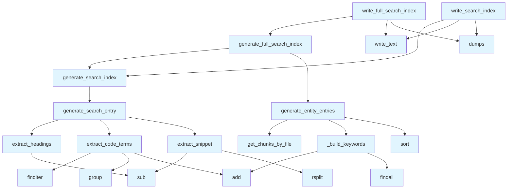

# File Overview

This file, `src/local_deepwiki/generators/search.py`, is responsible for generating search indexes for wiki pages and code entities. It provides functions to extract structured data from markdown content, such as headings, code terms, and snippets, and to assemble them into search-friendly entries. These entries can be used to power search functionality within a local deepwiki setup.

The module integrates with:
- `VectorStore` for accessing code chunks
- `WikiPage` for representing wiki content
- `IndexStatus` for tracking indexing state
- `ChunkType` for categorizing code chunks

It is used by test functions (`test_search`) and likely integrated into CLI or indexing workflows via `src/local_deepwiki/cli/__init__.py` and `src/local_deepwiki/generators/wiki.py`.

---

# Functions

## `extract_headings`

```python
def extract_headings(content: str) -> list[str]
```

Extracts all headings from markdown content.

**Parameters:**
- `content`: Markdown content.

**Returns:**
- List of heading texts (without # prefixes).

## `extract_code_terms`

```python
def extract_code_terms(content: str) -> list[str]
```

Extracts code terms (class names, function names) from content.

**Parameters:**
- `content`: Markdown content.

**Returns:**
- List of code terms found in backticks.

## `extract_snippet`

```python
def extract_snippet(content: str, max_length: int = 200) -> str
```

Extracts a text snippet from markdown content.

**Parameters:**
- `content`: Markdown content.
- `max_length`: Maximum snippet length.

**Returns:**
- Plain text snippet.

## `generate_search_entry`

```python
def generate_search_entry(page: WikiPage) -> dict
```

Generates a search index entry for a wiki page.

**Parameters:**
- `page`: The wiki page.

**Returns:**
- Dictionary with searchable fields (`path`, `title`, `headings`, `terms`, `snippet`).

## `generate_search_index`

```python
def generate_search_index(pages: list[WikiPage]) -> list[dict]
```

Generates a search index from wiki pages.

**Parameters:**
- `pages`: List of wiki pages.

**Returns:**
- List of search entries.

## `generate_entity_entries`

```python
async def generate_entity_entries(index_status: IndexStatus, vector_store: VectorStore) -> list[dict]
```

Generates search entries for individual code entities (functions, classes, methods) with type information.

**Parameters:**
- `index_status`: Index status with file information.
- `vector_store`: Vector store with code chunks.

**Returns:**
- List of entity search entries.

## `_build_keywords`

```python
def _build_keywords(name: str | None, param_types: dict[str, str], return_type: str | None, raises: list[str]) -> list[str]
```

Builds search keywords from entity metadata.

**Parameters:**
- `name`: Entity name.
- `param_types`: Parameter types mapping.
- `return_type`: Return type string.
- `raises`: List of exception types.

**Returns:**
- List of searchable keywords.

## `generate_full_search_index`

```python
async def generate_full_search_index(pages: list[WikiPage], index_status: IndexStatus | None = None, vector_store: VectorStore | None = None) -> dict
```

Generates a comprehensive search index including both page-level and entity-level entries.

**Parameters:**
- `pages`: List of wiki pages.
- `index_status`: Optional index status for entity extraction.
- `vector_store`: Optional vector store for entity extraction.

**Returns:**
- Dictionary with `'pages'` and `'entities'` lists.

## `write_search_index`

```python
def write_search_index(wiki_path: Path, pages: list[WikiPage]) -> Path
```

Generates and writes a search index to disk (legacy page-only version).

**Parameters:**
- `wiki_path`: Path to wiki directory.
- `pages`: List of wiki pages.

**Returns:**
- Path to the generated `search.json` file.

## `write_full_search_index`

```python
async def write_full_search_index(wiki_path: Path, pages: list[WikiPage], index_status: IndexStatus, vector_store: VectorStore) -> Path
```

Generates and writes a comprehensive search index to disk (includes both pages and entities).

**Parameters:**
- `wiki_path`: Path to wiki directory.
- `pages`: List of wiki pages.
- `index_status`: Index status with file information.
- `vector_store`: Vector store with code chunks.

**Returns:**
- Path to the generated `search.json` file.

---

# Integration

This file is part of the `local_deepwiki` package and integrates with:

- **Core components**: It uses `VectorStore` to retrieve code chunks and `WikiPage` to represent wiki content.
- **CLI and indexing workflows**: The `write_search_index` and `write_full_search_index` functions are likely called by CLI commands in `src/local_deepwiki/cli/__init__.py` to generate and persist search indexes.
- **Test suite**: The functions `extract_headings`, `extract_code_terms`, and `extract_snippet` are used by `test_search` in `tests/test_plugins.py`.

---

# Usage Examples

### Generate a search index for wiki pages:

```python
from local_deepwiki.generators.search import generate_search_index
from local_deepwiki.models import WikiPage

pages = [WikiPage(...), WikiPage(...)]
index = generate_search_index(pages)
```

### Write a search index to disk:

```python
from local_deepwiki.generators.search import write_search_index
from pathlib import Path

wiki_path = Path("my_wiki")
index_file = write_search_index(wiki_path, pages)
```

### Generate a full search index (pages + entities):

```python
from local_deepwiki.generators.search import generate_full_search_index
from local_deepwiki.models import IndexStatus
from local_deepwiki.core.vectorstore import VectorStore

index = await generate_full_search_index(pages, index_status, vector_store)
```

### Write a full search index to disk:

```python
from local_deepwiki.generators.search import write_full_search_index
from pathlib import Path

index_file = await write_full_search_index(wiki_path, pages, index_status, vector_store)
```

## API Reference

### Functions

#### `extract_headings`

```python
def extract_headings(content: str) -> list[str]
```

Extract all headings from markdown content.


| Parameter | Type | Default | Description |
|-----------|------|---------|-------------|
| `content` | `str` | - | Markdown content. |

**Returns:** `list[str]`


<details>
<summary>View Source (lines 16-35) | <a href="https://github.com/UrbanDiver/local-deepwiki-mcp/blob/main/src/local_deepwiki/generators/search.py#L16-L35">GitHub</a></summary>

```python
def extract_headings(content: str) -> list[str]:
    """Extract all headings from markdown content.

    Args:
        content: Markdown content.

    Returns:
        List of heading texts (without # prefixes).
    """
    headings = []
    for line in content.split("\n"):
        line = line.strip()
        if line.startswith("#"):
            # Remove # prefix and clean up
            heading = re.sub(r"^#+\s*", "", line)
            # Remove markdown formatting like ** or `
            heading = re.sub(r"[*`]", "", heading)
            if heading:
                headings.append(heading)
    return headings
```

</details>

#### `extract_code_terms`

```python
def extract_code_terms(content: str) -> list[str]
```

Extract code terms (class names, function names) from content.


| Parameter | Type | Default | Description |
|-----------|------|---------|-------------|
| `content` | `str` | - | Markdown content. |

**Returns:** `list[str]`


<details>
<summary>View Source (lines 38-59) | <a href="https://github.com/UrbanDiver/local-deepwiki-mcp/blob/main/src/local_deepwiki/generators/search.py#L38-L59">GitHub</a></summary>

```python
def extract_code_terms(content: str) -> list[str]:
    """Extract code terms (class names, function names) from content.

    Args:
        content: Markdown content.

    Returns:
        List of code terms found in backticks.
    """
    terms = set()
    # Match inline code: `term`
    for match in re.finditer(r"`([^`]+)`", content):
        term = match.group(1)
        # Skip code that looks like a full statement or has spaces
        if len(term) < 50 and "\n" not in term:
            # Extract the main identifier if it's a qualified name
            parts = term.split(".")
            if parts:
                terms.add(parts[-1])  # Last part of qualified name
            if len(parts) > 1:
                terms.add(term)  # Also add full qualified name
    return list(terms)
```

</details>

#### `extract_snippet`

```python
def extract_snippet(content: str, max_length: int = 200) -> str
```

Extract a text snippet from markdown content.


| Parameter | Type | Default | Description |
|-----------|------|---------|-------------|
| `content` | `str` | - | Markdown content. |
| `max_length` | `int` | `200` | Maximum snippet length. |

**Returns:** `str`


<details>
<summary>View Source (lines 62-86) | <a href="https://github.com/UrbanDiver/local-deepwiki-mcp/blob/main/src/local_deepwiki/generators/search.py#L62-L86">GitHub</a></summary>

```python
def extract_snippet(content: str, max_length: int = 200) -> str:
    """Extract a text snippet from markdown content.

    Args:
        content: Markdown content.
        max_length: Maximum snippet length.

    Returns:
        Plain text snippet.
    """
    # Remove code blocks
    text = re.sub(r"```[\s\S]*?```", "", content)
    # Remove headings
    text = re.sub(r"^#+\s+.*$", "", text, flags=re.MULTILINE)
    # Remove links but keep text: [text](url) -> text
    text = re.sub(r"\[([^\]]+)\]\([^)]+\)", r"\1", text)
    # Remove markdown formatting
    text = re.sub(r"[*_`]", "", text)
    # Collapse whitespace
    text = " ".join(text.split())

    if len(text) > max_length:
        text = text[:max_length].rsplit(" ", 1)[0] + "..."

    return text.strip()
```

</details>

#### `generate_search_entry`

```python
def generate_search_entry(page: WikiPage) -> dict
```

Generate a search index entry for a wiki page.


| Parameter | Type | Default | Description |
|-----------|------|---------|-------------|
| `page` | `WikiPage` | - | The wiki page. |

**Returns:** `dict`


<details>
<summary>View Source (lines 89-108) | <a href="https://github.com/UrbanDiver/local-deepwiki-mcp/blob/main/src/local_deepwiki/generators/search.py#L89-L108">GitHub</a></summary>

```python
def generate_search_entry(page: WikiPage) -> dict:
    """Generate a search index entry for a wiki page.

    Args:
        page: The wiki page.

    Returns:
        Dictionary with searchable fields.
    """
    headings = extract_headings(page.content)
    terms = extract_code_terms(page.content)
    snippet = extract_snippet(page.content)

    return {
        "path": page.path,
        "title": page.title,
        "headings": headings,
        "terms": terms,
        "snippet": snippet,
    }
```

</details>

#### `generate_search_index`

```python
def generate_search_index(pages: list[WikiPage]) -> list[dict]
```

Generate a search index from wiki pages.


| Parameter | Type | Default | Description |
|-----------|------|---------|-------------|
| `pages` | `list[WikiPage]` | - | List of wiki pages. |

**Returns:** `list[dict]`


<details>
<summary>View Source (lines 111-120) | <a href="https://github.com/UrbanDiver/local-deepwiki-mcp/blob/main/src/local_deepwiki/generators/search.py#L111-L120">GitHub</a></summary>

```python
def generate_search_index(pages: list[WikiPage]) -> list[dict]:
    """Generate a search index from wiki pages.

    Args:
        pages: List of wiki pages.

    Returns:
        List of search entries.
    """
    return [generate_search_entry(page) for page in pages]
```

</details>

#### `generate_entity_entries`

```python
async def generate_entity_entries(index_status: IndexStatus, vector_store: VectorStore) -> list[dict]
```

Generate search entries for individual code entities.  Creates searchable entries for each function, class, and method with type information for filtering.


| Parameter | Type | Default | Description |
|-----------|------|---------|-------------|
| `index_status` | `IndexStatus` | - | Index status with file information. |
| `vector_store` | `VectorStore` | - | Vector store with code chunks. |

**Returns:** `list[dict]`


<details>
<summary>View Source (lines 123-204) | <a href="https://github.com/UrbanDiver/local-deepwiki-mcp/blob/main/src/local_deepwiki/generators/search.py#L123-L204">GitHub</a></summary>

```python
async def generate_entity_entries(
    index_status: IndexStatus,
    vector_store: VectorStore,
) -> list[dict]:
    """Generate search entries for individual code entities.

    Creates searchable entries for each function, class, and method
    with type information for filtering.

    Args:
        index_status: Index status with file information.
        vector_store: Vector store with code chunks.

    Returns:
        List of entity search entries.
    """
    entries: list[dict] = []

    for file_info in index_status.files:
        chunks = await vector_store.get_chunks_by_file(file_info.path)

        for chunk in chunks:
            if chunk.chunk_type not in (ChunkType.CLASS, ChunkType.FUNCTION, ChunkType.METHOD):
                continue

            # Determine entity type
            entity_type = chunk.chunk_type.value  # 'class', 'function', 'method'

            # Build display name
            if chunk.chunk_type == ChunkType.METHOD and chunk.parent_name:
                display_name = f"{chunk.parent_name}.{chunk.name}"
            else:
                display_name = chunk.name or "Unknown"

            # Extract metadata
            metadata = chunk.metadata or {}
            param_types = metadata.get("parameter_types", {})
            return_type = metadata.get("return_type")
            raises = metadata.get("raises", [])
            is_async = metadata.get("is_async", False)

            # Build signature preview
            signature = ""
            if entity_type != "class":
                params = list(param_types.keys())[:3]
                if len(param_types) > 3:
                    params.append("...")
                signature = f"({', '.join(params)})"
                if return_type:
                    signature += f" → {return_type}"

            # Build brief description from docstring
            description = ""
            if chunk.docstring:
                first_line = chunk.docstring.split("\n")[0].strip()
                if len(first_line) > 80:
                    description = first_line[:77] + "..."
                else:
                    description = first_line

            # Build wiki path
            wiki_path = f"files/{file_info.path}".replace(".py", ".md")

            entry = {
                "type": "entity",
                "entity_type": entity_type,
                "name": chunk.name or "Unknown",
                "display_name": display_name,
                "path": wiki_path,
                "file": file_info.path,
                "signature": signature,
                "description": description,
                "is_async": is_async,
                "raises": raises,
                # Keywords for search matching
                "keywords": _build_keywords(chunk.name, param_types, return_type, raises),
            }
            entries.append(entry)

    # Sort by name for consistent output
    entries.sort(key=lambda e: e["display_name"].lower())
    return entries
```

</details>

#### `generate_full_search_index`

```python
async def generate_full_search_index(pages: list[WikiPage], index_status: IndexStatus | None = None, vector_store: VectorStore | None = None) -> dict
```

Generate a comprehensive search index with pages and entities.


| Parameter | Type | Default | Description |
|-----------|------|---------|-------------|
| `pages` | `list[WikiPage]` | - | List of wiki pages. |
| `index_status` | `IndexStatus | None` | `None` | Optional index status for entity extraction. |
| `vector_store` | `VectorStore | None` | `None` | Optional vector store for entity extraction. |

**Returns:** `dict`


<details>
<summary>View Source (lines 262-290) | <a href="https://github.com/UrbanDiver/local-deepwiki-mcp/blob/main/src/local_deepwiki/generators/search.py#L262-L290">GitHub</a></summary>

```python
async def generate_full_search_index(
    pages: list[WikiPage],
    index_status: IndexStatus | None = None,
    vector_store: VectorStore | None = None,
) -> dict:
    """Generate a comprehensive search index with pages and entities.

    Args:
        pages: List of wiki pages.
        index_status: Optional index status for entity extraction.
        vector_store: Optional vector store for entity extraction.

    Returns:
        Dictionary with 'pages' and 'entities' lists.
    """
    page_entries = generate_search_index(pages)

    entity_entries: list[dict] = []
    if index_status and vector_store:
        entity_entries = await generate_entity_entries(index_status, vector_store)

    return {
        "pages": page_entries,
        "entities": entity_entries,
        "meta": {
            "total_pages": len(page_entries),
            "total_entities": len(entity_entries),
        },
    }
```

</details>

#### `write_search_index`

```python
def write_search_index(wiki_path: Path, pages: list[WikiPage]) -> Path
```

Generate and write search index to disk (legacy page-only version).


| Parameter | Type | Default | Description |
|-----------|------|---------|-------------|
| `wiki_path` | `Path` | - | Path to wiki directory. |
| `pages` | `list[WikiPage]` | - | List of wiki pages. |

**Returns:** `Path`


<details>
<summary>View Source (lines 293-306) | <a href="https://github.com/UrbanDiver/local-deepwiki-mcp/blob/main/src/local_deepwiki/generators/search.py#L293-L306">GitHub</a></summary>

```python
def write_search_index(wiki_path: Path, pages: list[WikiPage]) -> Path:
    """Generate and write search index to disk (legacy page-only version).

    Args:
        wiki_path: Path to wiki directory.
        pages: List of wiki pages.

    Returns:
        Path to the generated search.json file.
    """
    index = generate_search_index(pages)
    index_path = wiki_path / "search.json"
    index_path.write_text(json.dumps(index, indent=2))
    return index_path
```

</details>

#### `write_full_search_index`

```python
async def write_full_search_index(wiki_path: Path, pages: list[WikiPage], index_status: IndexStatus, vector_store: VectorStore) -> Path
```

Generate and write comprehensive search index to disk.  Includes both page-level and entity-level search entries.


| Parameter | Type | Default | Description |
|-----------|------|---------|-------------|
| `wiki_path` | `Path` | - | Path to wiki directory. |
| `pages` | `list[WikiPage]` | - | List of wiki pages. |
| `index_status` | `IndexStatus` | - | Index status with file information. |
| `vector_store` | `VectorStore` | - | Vector store with code chunks. |

**Returns:** `Path`


<details>
<summary>View Source (lines 309-331) | <a href="https://github.com/UrbanDiver/local-deepwiki-mcp/blob/main/src/local_deepwiki/generators/search.py#L309-L331">GitHub</a></summary>

```python
async def write_full_search_index(
    wiki_path: Path,
    pages: list[WikiPage],
    index_status: IndexStatus,
    vector_store: VectorStore,
) -> Path:
    """Generate and write comprehensive search index to disk.

    Includes both page-level and entity-level search entries.

    Args:
        wiki_path: Path to wiki directory.
        pages: List of wiki pages.
        index_status: Index status with file information.
        vector_store: Vector store with code chunks.

    Returns:
        Path to the generated search.json file.
    """
    index = await generate_full_search_index(pages, index_status, vector_store)
    index_path = wiki_path / "search.json"
    index_path.write_text(json.dumps(index, indent=2))
    return index_path
```

</details>

## Call Graph


```mermaid
flowchart TD
    N0[_build_keywords]
    N1[add]
    N2[dumps]
    N3[extract_code_terms]
    N4[extract_headings]
    N5[extract_snippet]
    N6[findall]
    N7[finditer]
    N8[generate_entity_entries]
    N9[generate_full_search_index]
    N10[generate_search_entry]
    N11[generate_search_index]
    N12[get_chunks_by_file]
    N13[group]
    N14[rsplit]
    N15[sort]
    N16[sub]
    N17[write_full_search_index]
    N18[write_search_index]
    N19[write_text]
    N4 --> N16
    N3 --> N7
    N3 --> N13
    N3 --> N1
    N5 --> N16
    N5 --> N14
    N10 --> N4
    N10 --> N3
    N10 --> N5
    N11 --> N10
    N8 --> N12
    N8 --> N0
    N8 --> N15
    N0 --> N1
    N0 --> N6
    N9 --> N11
    N9 --> N8
    N18 --> N11
    N18 --> N19
    N18 --> N2
    N17 --> N9
    N17 --> N19
    N17 --> N2
    classDef func fill:#e1f5fe
    class N0,N1,N2,N3,N4,N5,N6,N7,N8,N9,N10,N11,N12,N13,N14,N15,N16,N17,N18,N19 func
```

## Used By

Functions and methods in this file and their callers:

- **`_build_keywords`**: called by `generate_entity_entries`
- **`add`**: called by `_build_keywords`, `extract_code_terms`
- **`dumps`**: called by `write_full_search_index`, `write_search_index`
- **`extract_code_terms`**: called by `generate_search_entry`
- **`extract_headings`**: called by `generate_search_entry`
- **`extract_snippet`**: called by `generate_search_entry`
- **`findall`**: called by `_build_keywords`
- **`finditer`**: called by `extract_code_terms`
- **`generate_entity_entries`**: called by `generate_full_search_index`
- **`generate_full_search_index`**: called by `write_full_search_index`
- **`generate_search_entry`**: called by `generate_search_index`
- **`generate_search_index`**: called by `generate_full_search_index`, `write_search_index`
- **`get_chunks_by_file`**: called by `generate_entity_entries`
- **`group`**: called by `extract_code_terms`
- **`rsplit`**: called by `extract_snippet`
- **`sort`**: called by `generate_entity_entries`
- **`sub`**: called by `extract_headings`, `extract_snippet`
- **`write_text`**: called by `write_full_search_index`, `write_search_index`

## Usage Examples

*Examples extracted from test files*

### Test extraction of h1 headings

From `test_search.py::TestExtractHeadings::test_extracts_h1_headings`:

```python
content = "# Main Title\n\nSome content"
headings = extract_headings(content)
assert "Main Title" in headings
```

### Test extraction of h1, h2, h3 headings

From `test_search.py::TestExtractHeadings::test_extracts_multiple_heading_levels`:

```python
content = """# Title
## Section One
### Subsection
## Section Two
"""
        headings = extract_headings(content)
        assert len(headings) == 4
        assert "Title" in headings
        assert "Section One" in headings
        assert "Subsection" in headings
        assert "Section Two" in headings
```

### Test extraction of simple backticked terms

From `test_search.py::TestExtractCodeTerms::test_extracts_simple_terms`:

```python
content = "Use `VectorStore` and `WikiGenerator` for docs."
terms = extract_code_terms(content)
assert "VectorStore" in terms
assert "WikiGenerator" in terms
```

### Test extraction of qualified names

From `test_search.py::TestExtractCodeTerms::test_extracts_qualified_names`:

```python
content = "Import `local_deepwiki.core.VectorStore` from module."
terms = extract_code_terms(content)
# Should include both full qualified name and last part
assert "VectorStore" in terms
assert "local_deepwiki.core.VectorStore" in terms
```

### Test basic snippet extraction

From `test_search.py::TestExtractSnippet::test_extracts_plain_text`:

```python
content = "This is a simple paragraph of text."
snippet = extract_snippet(content)
assert "simple paragraph" in snippet
```


## Last Modified

| Entity | Type | Author | Date | Commit |
|--------|------|--------|------|--------|
| `generate_entity_entries` | function | Brian Breidenbach | 3 weeks ago | `553a2ee` Add entity-level search wit... |
| `_build_keywords` | function | Brian Breidenbach | 3 weeks ago | `553a2ee` Add entity-level search wit... |
| `generate_full_search_index` | function | Brian Breidenbach | 3 weeks ago | `553a2ee` Add entity-level search wit... |
| `write_search_index` | function | Brian Breidenbach | 3 weeks ago | `553a2ee` Add entity-level search wit... |
| `write_full_search_index` | function | Brian Breidenbach | 3 weeks ago | `553a2ee` Add entity-level search wit... |
| `extract_headings` | function | Brian Breidenbach | 3 weeks ago | `c568951` Add input validation, type ... |
| `extract_code_terms` | function | Brian Breidenbach | 3 weeks ago | `c568951` Add input validation, type ... |
| `extract_snippet` | function | Brian Breidenbach | 3 weeks ago | `c568951` Add input validation, type ... |
| `generate_search_entry` | function | Brian Breidenbach | 3 weeks ago | `c568951` Add input validation, type ... |
| `generate_search_index` | function | Brian Breidenbach | 3 weeks ago | `1315c7f` Add wiki improvements: incr... |

## Additional Source Code

Source code for functions and methods not listed in the API Reference above.

#### `_build_keywords`

<details>
<summary>View Source (lines 207-259) | <a href="https://github.com/UrbanDiver/local-deepwiki-mcp/blob/main/src/local_deepwiki/generators/search.py#L207-L259">GitHub</a></summary>

```python
def _build_keywords(
    name: str | None,
    param_types: dict[str, str],
    return_type: str | None,
    raises: list[str],
) -> list[str]:
    """Build search keywords from entity metadata.

    Args:
        name: Entity name.
        param_types: Parameter types mapping.
        return_type: Return type string.
        raises: List of exception types.

    Returns:
        List of searchable keywords.
    """
    keywords: set[str] = set()

    # Add name parts (split on underscore and camelCase)
    if name:
        keywords.add(name.lower())
        # Split on underscores
        for part in name.split("_"):
            if len(part) > 2:
                keywords.add(part.lower())
        # Split camelCase
        camel_parts = re.findall(r"[A-Z][a-z]+|[a-z]+", name)
        for part in camel_parts:
            if len(part) > 2:
                keywords.add(part.lower())

    # Add type keywords
    for type_str in param_types.values():
        if type_str:
            # Extract base type (e.g., "list" from "list[str]")
            base_type = re.split(r"[\[\]|,\s]", type_str)[0].lower()
            if base_type:
                keywords.add(base_type)

    if return_type:
        base_return = re.split(r"[\[\]|,\s]", return_type)[0].lower()
        if base_return:
            keywords.add(base_return)

    # Add exception keywords
    for exc in raises:
        keywords.add(exc.lower())
        # Also add without "Error" suffix for easier search
        if exc.endswith("Error"):
            keywords.add(exc[:-5].lower())

    return list(keywords)
```

</details>

