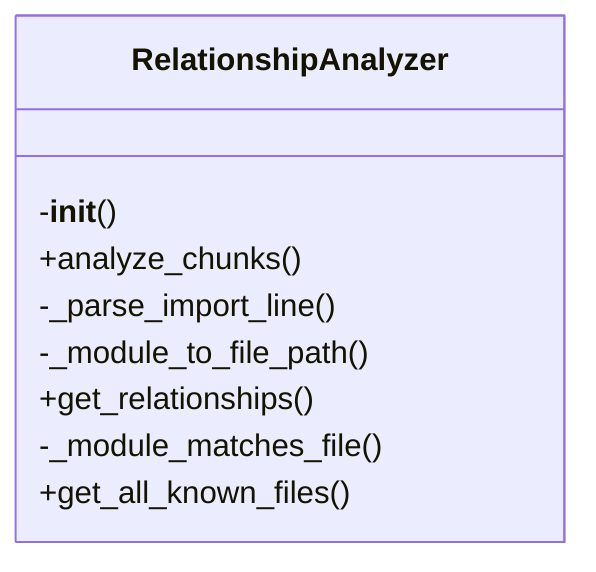
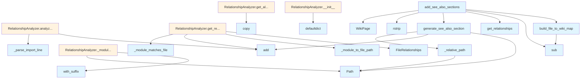

# See Also Generator Module

This module is responsible for generating "See Also" sections in wiki documentation pages. It analyzes code import relationships and creates cross-references between related files, helping users navigate between related documentation.

## File Overview

The see_also.py file provides functionality to automatically generate "See Also" sections in wiki documentation. It analyzes the relationships between source files and their corresponding documentation pages, identifying related files through import statements and creating appropriate cross-references.

This module works with the [WikiPage](../models.md) model and other documentation components to enhance the discoverability of related code and documentation within the local_deepwiki system.

## Classes

### FileRelationships

A dataclass that stores information about file relationships, specifically tracking which files import other files.

**Fields:**
- `imports`: A set of file paths that are imported by the current file
- `imported_by`: A set of file paths that import the current file

### RelationshipAnalyzer

Analyzes code files to determine import relationships between source files.

**Key Methods:**
- `analyze_file(file_path: Path)`: Analyzes a single file and extracts import information
- `analyze_all(pages: list[WikiPage])`: Analyzes all pages and builds a complete relationship map

## Functions

### build_file_to_wiki_map

```python
def build_file_to_wiki_map(pages: list[WikiPage]) -> dict[str, str]:
```

Builds a mapping from source file paths to wiki page paths.

**Parameters:**
- `pages`: List of wiki pages

**Returns:**
- Dictionary mapping source file path to wiki page path

### generate_see_also_section

```python
def generate_see_also_section(
    page: WikiPage,
    file_to_wiki: dict[str, str],
    analyzer: RelationshipAnalyzer,
) -> str:
```

Generates the content for a See Also section based on import relationships.

**Parameters:**
- `page`: The wiki page being processed
- `file_to_wiki`: Mapping from source file paths to wiki paths
- `analyzer`: Relationship analyzer with import data

**Returns:**
- String containing the See Also section content

### _relative_path

```python
def _relative_path(from_path: str, to_path: str) -> str:
```

Calculates the relative path from one file to another.

**Parameters:**
- `from_path`: Source file path
- `to_path`: Target file path

**Returns:**
- Relative path from from_path to to_path

### add_see_also_sections

```python
def add_see_also_sections(
    pages: list[WikiPage],
    analyzer: RelationshipAnalyzer,
) -> list[WikiPage]:
```

Adds See Also sections to wiki pages based on import relationships.

**Parameters:**
- `pages`: List of wiki pages
- `analyzer`: Relationship analyzer with import data

**Returns:**
- List of wiki pages with See Also sections added

## Usage Examples

### Basic Usage

```python
from local_deepwiki.generators.see_also import add_see_also_sections
from local_deepwiki.generators.relationship_analyzer import RelationshipAnalyzer
from local_deepwiki.models import WikiPage

# Assume you have a list of WikiPage objects
pages = [...]  # Your list of wiki pages

# Create relationship analyzer
analyzer = RelationshipAnalyzer()

# Analyze pages
analyzer.analyze_all(pages)

# Add See Also sections
updated_pages = add_see_also_sections(pages, analyzer)
```

### Complete Workflow

```python
from local_deepwiki.generators.see_also import add_see_also_sections
from local_deepwiki.generators.relationship_analyzer import RelationshipAnalyzer
from local_deepwiki.models import WikiPage

# Load your wiki pages
pages: list[WikiPage] = load_wiki_pages()

# Create and run relationship analyzer
analyzer = RelationshipAnalyzer()
analyzer.analyze_all(pages)

# Generate See Also sections
pages_with_see_also = add_see_also_sections(pages, analyzer)

# Save updated pages
save_wiki_pages(pages_with_see_also)
```

## Related Components

This module works with the [WikiPage](../models.md) model to understand documentation structure and the RelationshipAnalyzer class to determine import relationships between source files. It integrates with the overall documentation generation pipeline to enhance cross-referencing capabilities.

## API Reference

### class `FileRelationships`

Relationships for a single file.

### class `RelationshipAnalyzer`

Analyzes import relationships between source files.  This class builds a graph of file dependencies from import chunks, enabling discovery of related files through various relationship types.

**Methods:**

#### `__init__`

```python
def __init__() -> None
```

Initialize an empty relationship analyzer.

#### `analyze_chunks`

```python
def analyze_chunks(chunks: list[CodeChunk]) -> None
```

Analyze import chunks to build relationship graph.


| [Parameter](api_docs.md) | Type | Default | Description |
|-----------|------|---------|-------------|
| `chunks` | `list[CodeChunk]` | - | List of code chunks (should include IMPORT chunks). |

#### `get_relationships`

```python
def get_relationships(file_path: str) -> FileRelationships
```

Get all relationships for a file.


| [Parameter](api_docs.md) | Type | Default | Description |
|-----------|------|---------|-------------|
| `file_path` | `str` | - | Path to the source file. |

#### `get_all_known_files`

```python
def get_all_known_files() -> set[str]
```

Get all known file paths.


---

### Functions

#### `build_file_to_wiki_map`

```python
def build_file_to_wiki_map(pages: list[WikiPage]) -> dict[str, str]
```

Build a mapping from source file paths to wiki page paths.


| [Parameter](api_docs.md) | Type | Default | Description |
|-----------|------|---------|-------------|
| `pages` | `list[WikiPage]` | - | List of wiki pages. |

**Returns:** `dict[str, str]`


#### `generate_see_also_section`

```python
def generate_see_also_section(relationships: FileRelationships, file_to_wiki: dict[str, str], current_wiki_path: str, max_items: int = 5) -> str | None
```

Generate a See Also section for a wiki page.


| [Parameter](api_docs.md) | Type | Default | Description |
|-----------|------|---------|-------------|
| `relationships` | `FileRelationships` | - | The file relationships. |
| `file_to_wiki` | `dict[str, str]` | - | Mapping of source files to wiki paths. |
| `current_wiki_path` | `str` | - | Path of the current wiki page. |
| `max_items` | `int` | `5` | Maximum number of items to include. |

**Returns:** `str | None`


#### `add_see_also_sections`

```python
def add_see_also_sections(pages: list[WikiPage], analyzer: RelationshipAnalyzer) -> list[WikiPage]
```

Add See Also sections to wiki pages.


| [Parameter](api_docs.md) | Type | Default | Description |
|-----------|------|---------|-------------|
| `pages` | `list[WikiPage]` | - | List of wiki pages. |
| `analyzer` | `RelationshipAnalyzer` | - | Relationship analyzer with import data. |

**Returns:** `list[WikiPage]`


## Class Diagram



## Call Graph



## See Also

- [wiki](wiki.md) - uses this
- [test_see_also](../../../tests/test_see_also.md) - uses this
- [models](../models.md) - dependency
- [crosslinks](crosslinks.md) - shares 4 dependencies
- [api_docs](api_docs.md) - shares 4 dependencies
