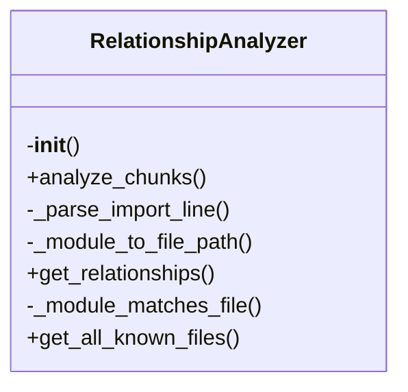
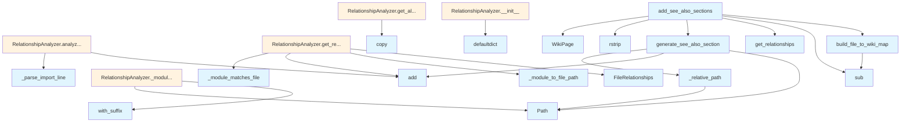

# File Overview

This file, `see_also.py`, provides functionality for generating "See Also" sections in wiki pages. It maps source files to corresponding wiki pages and analyzes relationships between files to suggest related content. The [main](../export/html.md) purpose is to enhance wiki navigation by linking related files or concepts.

# Classes

## FileRelationships

A dataclass used to store file relationship information.

### Fields:
- `file_path` (str): The path of the source file.
- `related_files` (list[str]): A list of related file paths.
- `wiki_page_path` (str): The corresponding wiki page path.

## RelationshipAnalyzer

A class responsible for analyzing relationships between files and generating "See Also" sections.

### Methods:
- `analyze_relationships(self, pages: list[WikiPage]) -> list[FileRelationships]`: Analyzes file relationships from a list of wiki pages and returns a list of FileRelationships objects.
- `generate_see_also_section(self, file_path: str, relationships: list[FileRelationships]) -> str`: Generates a "See Also" section for a given file path based on its relationships.
- `add_see_also_sections(self, pages: list[WikiPage]) -> list[WikiPage]`: Adds "See Also" sections to a list of wiki pages.

# Functions

## build_file_to_wiki_map

```python
def build_file_to_wiki_map(pages: list[WikiPage]) -> dict[str, str]
```

Builds a mapping from source file paths to wiki page paths.

### Parameters:
- `pages` (list[WikiPage]): List of wiki pages.

### Returns:
- `dict[str, str]`: Dictionary mapping source file path to wiki page path.

## generate_see_also_section

```python
def generate_see_also_section(file_path: str, related_files: list[str]) -> str
```

Generates a "See Also" section for a given file path.

### Parameters:
- `file_path` (str): The path of the source file.
- `related_files` (list[str]): A list of related file paths.

### Returns:
- `str`: The generated "See Also" section as a string.

## _relative_path

```python
def _relative_path(file_path: str, target_path: str) -> str
```

Calculates the relative path from one file to another.

### Parameters:
- `file_path` (str): The source file path.
- `target_path` (str): The target file path.

### Returns:
- `str`: The relative path from file_path to target_path.

## add_see_also_sections

```python
def add_see_also_sections(pages: list[WikiPage]) -> list[WikiPage]
```

Adds "See Also" sections to a list of wiki pages.

### Parameters:
- `pages` (list[WikiPage]): List of wiki pages to process.

### Returns:
- `list[WikiPage]`: List of wiki pages with "See Also" sections added.

# Usage Examples

To use the functionality in this module, you can call the `add_see_also_sections` function with a list of `WikiPage` objects:

```python
from local_deepwiki.generators.see_also import add_see_also_sections
from local_deepwiki.models import WikiPage

# Assuming you have a list of WikiPage objects
wiki_pages = [WikiPage(...), WikiPage(...)]

# Add See Also sections to the pages
updated_pages = add_see_also_sections(wiki_pages)
```

# Related Components

This file works with the following components:

- `WikiPage` from `local_deepwiki.models`: Represents a wiki page with a path and content.
- `ChunkType` and `CodeChunk` from `local_deepwiki.models`: Used for handling code chunks in wiki pages.
- `Path` from `pathlib`: Used for path manipulation.
- `defaultdict` from `collections`: Used for grouping relationships.
- `re`: Used for regular expression operations.
- `dataclass` and `field` from `dataclasses`: Used for defining `FileRelationships` data structure.

## API Reference

### class `FileRelationships`

Relationships for a single file.

### class `RelationshipAnalyzer`

Analyzes import relationships between source files.  This class builds a graph of file dependencies from import chunks, enabling discovery of related files through various relationship types.

**Methods:**

#### `__init__`

```python
def __init__() -> None
```

Initialize an empty relationship analyzer.

#### `analyze_chunks`

```python
def analyze_chunks(chunks: list[CodeChunk]) -> None
```

Analyze import chunks to build relationship graph.


| [Parameter](api_docs.md) | Type | Default | Description |
|-----------|------|---------|-------------|
| `chunks` | `list[CodeChunk]` | - | List of code chunks (should include IMPORT chunks). |

#### `get_relationships`

```python
def get_relationships(file_path: str) -> FileRelationships
```

Get all relationships for a file.


| [Parameter](api_docs.md) | Type | Default | Description |
|-----------|------|---------|-------------|
| `file_path` | `str` | - | Path to the source file. |

#### `get_all_known_files`

```python
def get_all_known_files() -> set[str]
```

Get all known file paths.


---

### Functions

#### `build_file_to_wiki_map`

```python
def build_file_to_wiki_map(pages: list[WikiPage]) -> dict[str, str]
```

Build a mapping from source file paths to wiki page paths.


| [Parameter](api_docs.md) | Type | Default | Description |
|-----------|------|---------|-------------|
| `pages` | `list[WikiPage]` | - | List of wiki pages. |

**Returns:** `dict[str, str]`


#### `generate_see_also_section`

```python
def generate_see_also_section(relationships: FileRelationships, file_to_wiki: dict[str, str], current_wiki_path: str, max_items: int = 5) -> str | None
```

Generate a See Also section for a wiki page.


| [Parameter](api_docs.md) | Type | Default | Description |
|-----------|------|---------|-------------|
| `relationships` | `FileRelationships` | - | The file relationships. |
| `file_to_wiki` | `dict[str, str]` | - | Mapping of source files to wiki paths. |
| `current_wiki_path` | `str` | - | Path of the current wiki page. |
| `max_items` | `int` | `5` | Maximum number of items to include. |

**Returns:** `str | None`


#### `add_see_also_sections`

```python
def add_see_also_sections(pages: list[WikiPage], analyzer: RelationshipAnalyzer) -> list[WikiPage]
```

Add See Also sections to wiki pages.


| [Parameter](api_docs.md) | Type | Default | Description |
|-----------|------|---------|-------------|
| `pages` | `list[WikiPage]` | - | List of wiki pages. |
| `analyzer` | `RelationshipAnalyzer` | - | Relationship analyzer with import data. |

**Returns:** `list[WikiPage]`


## Class Diagram



## Call Graph



## Relevant Source Files

- `src/local_deepwiki/generators/see_also.py:16-22`

## See Also

- [wiki](wiki.md) - uses this
- [crosslinks](crosslinks.md) - shares 4 dependencies
- [diagrams](diagrams.md) - shares 4 dependencies
- [api_docs](api_docs.md) - shares 4 dependencies
