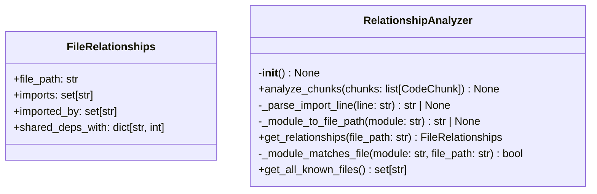
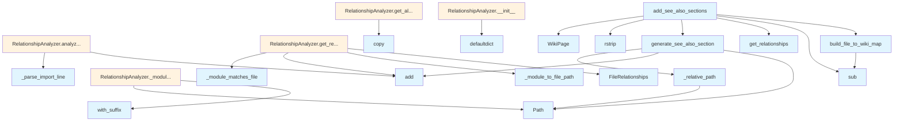

# see_also.py

## File Overview

This module provides functionality for generating "See Also" sections in wiki documentation by analyzing relationships between code files. It identifies connections between files through imports, class usage, and other code relationships to automatically suggest related documentation pages.

## Classes

### FileRelationships

A data class that stores relationship information for a single file, tracking its connections to other files in the codebase.

### RelationshipAnalyzer

Analyzes code files to identify relationships between them, such as imports, class usage, and other code dependencies that can be used to generate cross-references.

## Functions

### build_file_to_wiki_map

```python
def build_file_to_wiki_map(pages: list[WikiPage]) -> dict[str, str]:
```

Builds a mapping from source file paths to their corresponding wiki page paths.

**Parameters:**
- `pages`: List of [WikiPage](../models.md) objects representing the generated documentation pages

**Returns:**
- Dictionary mapping source file paths to wiki page paths

This function processes wiki pages that start with "files/" prefix and converts them back to their original source file paths by removing the prefix and changing the file extension from `.md` to `.py`.

### generate_see_also_section

Generates a "See Also" section for a wiki page based on file relationships analysis.

### _relative_path

A utility function for calculating relative paths between files.

### add_see_also_sections

Processes multiple wiki pages to add "See Also" sections to each one based on the analyzed file relationships.

## Related Components

This module works with the following components from the codebase:

- **[WikiPage](../models.md)**: Used to represent documentation pages and access their metadata
- **[CodeChunk](../models.md)**: Represents chunks of code that are analyzed for relationships  
- **[ChunkType](../models.md)**: Enumeration defining different types of code chunks

The module imports these from `local_deepwiki.models`, indicating it's part of a larger documentation generation system that processes code files into structured wiki documentation.

## Usage Context

This module appears to be part of an automated documentation generation pipeline that:

1. Analyzes source code files for relationships and dependencies
2. Generates wiki pages from the code
3. Enhances the wiki pages with cross-references through "See Also" sections
4. Maps between source file paths and their corresponding documentation pages

The relationship analysis helps create a more connected and navigable documentation structure by automatically identifying related files that users might want to reference.

## API Reference

### class `FileRelationships`

Relationships for a single file.

### class `RelationshipAnalyzer`

Analyzes import relationships between source files.  This class builds a graph of file dependencies from import chunks, enabling discovery of related files through various relationship types.

**Methods:**

#### `__init__`

```python
def __init__() -> None
```

Initialize an empty relationship analyzer.

#### `analyze_chunks`

```python
def analyze_chunks(chunks: list[CodeChunk]) -> None
```

Analyze import chunks to build relationship graph.


| [Parameter](api_docs.md) | Type | Default | Description |
|-----------|------|---------|-------------|
| `chunks` | `list[CodeChunk]` | - | List of code chunks (should include IMPORT chunks). |

#### `get_relationships`

```python
def get_relationships(file_path: str) -> FileRelationships
```

Get all relationships for a file.


| [Parameter](api_docs.md) | Type | Default | Description |
|-----------|------|---------|-------------|
| `file_path` | `str` | - | Path to the source file. |

#### `get_all_known_files`

```python
def get_all_known_files() -> set[str]
```

Get all known file paths.


---

### Functions

#### `build_file_to_wiki_map`

```python
def build_file_to_wiki_map(pages: list[WikiPage]) -> dict[str, str]
```

Build a mapping from source file paths to wiki page paths.


| [Parameter](api_docs.md) | Type | Default | Description |
|-----------|------|---------|-------------|
| `pages` | `list[WikiPage]` | - | List of wiki pages. |

**Returns:** `dict[str, str]`


#### `generate_see_also_section`

```python
def generate_see_also_section(relationships: FileRelationships, file_to_wiki: dict[str, str], current_wiki_path: str, max_items: int = 5) -> str | None
```

Generate a See Also section for a wiki page.


| [Parameter](api_docs.md) | Type | Default | Description |
|-----------|------|---------|-------------|
| `relationships` | `FileRelationships` | - | The file relationships. |
| `file_to_wiki` | `dict[str, str]` | - | Mapping of source files to wiki paths. |
| `current_wiki_path` | `str` | - | Path of the current wiki page. |
| `max_items` | `int` | `5` | Maximum number of items to include. |

**Returns:** `str | None`


#### `add_see_also_sections`

```python
def add_see_also_sections(pages: list[WikiPage], analyzer: RelationshipAnalyzer) -> list[WikiPage]
```

Add See Also sections to wiki pages.


| [Parameter](api_docs.md) | Type | Default | Description |
|-----------|------|---------|-------------|
| `pages` | `list[WikiPage]` | - | List of wiki pages. |
| `analyzer` | `RelationshipAnalyzer` | - | Relationship analyzer with import data. |

**Returns:** `list[WikiPage]`


## Class Diagram



## Call Graph



## Usage Examples

*Examples extracted from test files*

### Test analyzing Python import statements

From `test_see_also.py::test_analyze_python_imports`:

```python
name="imports",
        content="from local_deepwiki.core.chunker import CodeChunker\nfrom local_deepwiki.models import CodeChunk",
        start_line=1,
        end_line=2,
    ),
    CodeChunk(
        id="2",
        file_path="src/local_deepwiki/core/chunker.py",
        language=Language.PYTHON,
        chunk_type=ChunkType.IMPORT,
        name="imports",
        content="from local_deepwiki.models import CodeChunk",
        start_line=1,
        end_line=1,
    ),
]

analyzer.analyze_chunks(chunks)

# Check that files are tracked
known_files = analyzer.get_all_known_files()
assert "src/local_deepwiki/core/indexer.py" in known_files
```

### Test analyzing Python import statements

From `test_see_also.py::test_analyze_python_imports`:

```python
analyzer = RelationshipAnalyzer()
chunks = [
    CodeChunk(
        id="1",
        file_path="src/local_deepwiki/core/indexer.py",
        language=Language.PYTHON,
        chunk_type=ChunkType.IMPORT,
        name="imports",
        content="from local_deepwiki.core.chunker import CodeChunker\nfrom local_deepwiki.models import CodeChunk",
        start_line=1,
        end_line=2,
    ),
    CodeChunk(
        id="2",
        file_path="src/local_deepwiki/core/chunker.py",
        language=Language.PYTHON,
        chunk_type=ChunkType.IMPORT,
        name="imports",
        content="from local_deepwiki.models import CodeChunk",
        start_line=1,
        end_line=1,
    ),
]

analyzer.analyze_chunks(chunks)
```

### Test analyzing Python import statements

From `test_see_also.py::test_analyze_python_imports`:

```python
analyzer.analyze_chunks(chunks)

# Check that files are tracked
known_files = analyzer.get_all_known_files()
assert "src/local_deepwiki/core/indexer.py" in known_files
```

### Test analyzing Python import statements

From `test_see_also.py::test_analyze_python_imports`:

```python
known_files = analyzer.get_all_known_files()
assert "src/local_deepwiki/core/indexer.py" in known_files
```

### Test getting import relationships for a file

From `test_see_also.py::test_get_relationships_imports`:

```python
name="imports",
        content="from local_deepwiki.core.chunker import CodeChunker",
        start_line=1,
        end_line=1,
    ),
    CodeChunk(
        id="2",
        file_path="src/local_deepwiki/core/chunker.py",
        language=Language.PYTHON,
        chunk_type=ChunkType.IMPORT,
        name="imports",
        content="from local_deepwiki.models import CodeChunk",
        start_line=1,
        end_line=1,
    ),
]

analyzer.analyze_chunks(chunks)
relationships = analyzer.get_relationships("src/local_deepwiki/core/indexer.py")

assert isinstance(relationships, FileRelationships)
```

## Relevant Source Files

- `src/local_deepwiki/generators/see_also.py:16-22`

## See Also

- [models](../models.md) - dependency
- [crosslinks](crosslinks.md) - shares 4 dependencies
- [diagrams](diagrams.md) - shares 4 dependencies
- [api_docs](api_docs.md) - shares 4 dependencies
