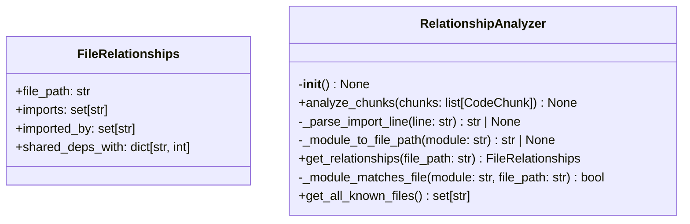
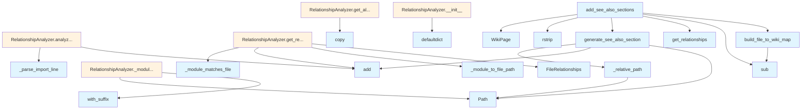

# see_also.py

## File Overview

The `see_also.py` module is responsible for generating "See Also" sections for wiki pages by analyzing relationships between source files. It creates cross-references between related files based on imports, function calls, and other code dependencies to help users navigate between related documentation pages.

## Classes

### FileRelationships

A data class that stores relationship information between files (specific implementation details not visible in the provided code).

### RelationshipAnalyzer

A class responsible for analyzing code relationships between files to determine which files should be cross-referenced in "See Also" sections (specific implementation details not visible in the provided code).

## Functions

### build_file_to_wiki_map

```python
def build_file_to_wiki_map(pages: list[WikiPage]) -> dict[str, str]:
```

Builds a mapping from source file paths to their corresponding wiki page paths.

**Parameters:**
- `pages`: List of [WikiPage](../models.md) objects representing the generated wiki pages

**Returns:**
- Dictionary mapping source file paths (strings) to wiki page paths (strings)

**Description:**
This function processes wiki pages that follow the pattern `files/` prefix and converts between wiki page paths (like `files/src/local_deepwiki/core/chunker.md`) and their corresponding source file paths (like `src/local_deepwiki/core/chunker.py`).

### generate_see_also_section

Generates a "See Also" section for a wiki page based on file relationships (specific signature and implementation not visible in the provided code).

### _relative_path

A utility function for handling relative path calculations (specific signature and implementation not visible in the provided code).

### add_see_also_sections

Adds "See Also" sections to multiple wiki pages (specific signature and implementation not visible in the provided code).

## Usage Examples

```python
from local_deepwiki.generators.see_also import build_file_to_wiki_map
from local_deepwiki.models import WikiPage

# Build file-to-wiki mapping
pages = [...]  # List of WikiPage objects
file_mapping = build_file_to_wiki_map(pages)

# The mapping will contain entries like:
# "src/local_deepwiki/core/chunker.py" -> "files/src/local_deepwiki/core/chunker.md"
```

## Related Components

This module works with the following components from the codebase:

- **[WikiPage](../models.md)**: Core model representing a wiki page, imported from `local_deepwiki.models`
- **[CodeChunk](../models.md)**: Model representing code chunks, imported from `local_deepwiki.models`  
- **[ChunkType](../models.md)**: Enumeration for different types of code chunks, imported from `local_deepwiki.models`

The module uses standard Python libraries including `re` for regular expressions, `collections.defaultdict` for data structures, `dataclasses` for data classes, and `pathlib.Path` for file path handling.

## API Reference

### class `FileRelationships`

Relationships for a single file.


<details>
<summary>View Source (lines 16-22) | <a href="https://github.com/UrbanDiver/local-deepwiki-mcp/blob/feature/wiki-enhancements/src/local_deepwiki/generators/see_also.py#L16-L22">GitHub</a></summary>

```python
class FileRelationships:
    """Relationships for a single file."""

    file_path: str
    imports: set[str] = field(default_factory=set)  # Files this file imports
    imported_by: set[str] = field(default_factory=set)  # Files that import this
    shared_deps_with: dict[str, int] = field(default_factory=dict)  # File -> shared count
```

</details>

### class `RelationshipAnalyzer`

Analyzes import relationships between source files.  This class builds a graph of file dependencies from import chunks, enabling discovery of related files through various relationship types.

**Methods:**


<details>
<summary>View Source (lines 25-182) | <a href="https://github.com/UrbanDiver/local-deepwiki-mcp/blob/feature/wiki-enhancements/src/local_deepwiki/generators/see_also.py#L25-L182">GitHub</a></summary>

```python
class RelationshipAnalyzer:
    # Methods: __init__, analyze_chunks, _parse_import_line, _module_to_file_path, get_relationships, _module_matches_file, get_all_known_files
```

</details>

#### `__init__`

```python
def __init__() -> None
```

Initialize an empty relationship analyzer.


<details>
<summary>View Source (lines 32-39) | <a href="https://github.com/UrbanDiver/local-deepwiki-mcp/blob/feature/wiki-enhancements/src/local_deepwiki/generators/see_also.py#L32-L39">GitHub</a></summary>

```python
def __init__(self) -> None:
        """Initialize an empty relationship analyzer."""
        # Map of file_path -> set of imported module paths
        self._imports: dict[str, set[str]] = defaultdict(set)
        # Map of module_path -> set of files that import it
        self._imported_by: dict[str, set[str]] = defaultdict(set)
        # Set of all known internal file paths
        self._known_files: set[str] = set()
```

</details>

#### `analyze_chunks`

```python
def analyze_chunks(chunks: list[CodeChunk]) -> None
```

Analyze import chunks to build relationship graph.


| [Parameter](api_docs.md) | Type | Default | Description |
|-----------|------|---------|-------------|
| `chunks` | `list[CodeChunk]` | - | List of code chunks (should include IMPORT chunks). |


<details>
<summary>View Source (lines 41-63) | <a href="https://github.com/UrbanDiver/local-deepwiki-mcp/blob/feature/wiki-enhancements/src/local_deepwiki/generators/see_also.py#L41-L63">GitHub</a></summary>

```python
def analyze_chunks(self, chunks: list[CodeChunk]) -> None:
        """Analyze import chunks to build relationship graph.

        Args:
            chunks: List of code chunks (should include IMPORT chunks).
        """
        for chunk in chunks:
            if chunk.chunk_type != ChunkType.IMPORT:
                continue

            file_path = chunk.file_path
            self._known_files.add(file_path)

            # Parse imports from content
            for line in chunk.content.split("\n"):
                line = line.strip()
                if not line:
                    continue

                imported = self._parse_import_line(line)
                if imported:
                    self._imports[file_path].add(imported)
                    self._imported_by[imported].add(file_path)
```

</details>

#### `get_relationships`

```python
def get_relationships(file_path: str) -> FileRelationships
```

Get all relationships for a file.


| [Parameter](api_docs.md) | Type | Default | Description |
|-----------|------|---------|-------------|
| `file_path` | `str` | - | Path to the source file. |


<details>
<summary>View Source (lines 121-155) | <a href="https://github.com/UrbanDiver/local-deepwiki-mcp/blob/feature/wiki-enhancements/src/local_deepwiki/generators/see_also.py#L121-L155">GitHub</a></summary>

```python
def get_relationships(self, file_path: str) -> FileRelationships:
        """Get all relationships for a file.

        Args:
            file_path: Path to the source file.

        Returns:
            FileRelationships object with all relationship data.
        """
        relationships = FileRelationships(file_path=file_path)

        # Get direct imports (files this file imports)
        for module in self._imports.get(file_path, set()):
            imported_file = self._module_to_file_path(module)
            if imported_file and imported_file != file_path:
                relationships.imports.add(imported_file)

        # Get importers (files that import this file)
        for module, importers in self._imported_by.items():
            # Check if module refers to this file
            if self._module_matches_file(module, file_path):
                for importer in importers:
                    if importer != file_path:
                        relationships.imported_by.add(importer)

        # Calculate shared dependencies
        my_imports = self._imports.get(file_path, set())
        for other_file, other_imports in self._imports.items():
            if other_file == file_path:
                continue
            shared = my_imports & other_imports
            if len(shared) >= 2:  # Only count if 2+ shared deps
                relationships.shared_deps_with[other_file] = len(shared)

        return relationships
```

</details>

#### `get_all_known_files`

```python
def get_all_known_files() -> set[str]
```

Get all known file paths.


---


<details>
<summary>View Source (lines 176-182) | <a href="https://github.com/UrbanDiver/local-deepwiki-mcp/blob/feature/wiki-enhancements/src/local_deepwiki/generators/see_also.py#L176-L182">GitHub</a></summary>

```python
def get_all_known_files(self) -> set[str]:
        """Get all known file paths.

        Returns:
            Set of file paths.
        """
        return self._known_files.copy()
```

</details>

### Functions

#### `build_file_to_wiki_map`

```python
def build_file_to_wiki_map(pages: list[WikiPage]) -> dict[str, str]
```

Build a mapping from source file paths to wiki page paths.


| [Parameter](api_docs.md) | Type | Default | Description |
|-----------|------|---------|-------------|
| `pages` | `list[WikiPage]` | - | List of wiki pages. |

**Returns:** `dict[str, str]`


<details>
<summary>View Source (lines 185-205) | <a href="https://github.com/UrbanDiver/local-deepwiki-mcp/blob/feature/wiki-enhancements/src/local_deepwiki/generators/see_also.py#L185-L205">GitHub</a></summary>

```python
def build_file_to_wiki_map(pages: list[WikiPage]) -> dict[str, str]:
    """Build a mapping from source file paths to wiki page paths.

    Args:
        pages: List of wiki pages.

    Returns:
        Dictionary mapping source file path to wiki page path.
    """
    file_to_wiki: dict[str, str] = {}

    for page in pages:
        # Wiki paths like "files/src/local_deepwiki/core/chunker.md"
        # correspond to source files like "src/local_deepwiki/core/chunker.py"
        if page.path.startswith("files/"):
            # Remove "files/" prefix and change .md to .py
            source_path = page.path[6:]  # Remove "files/"
            source_path = re.sub(r"\.md$", ".py", source_path)
            file_to_wiki[source_path] = page.path

    return file_to_wiki
```

</details>

#### `generate_see_also_section`

```python
def generate_see_also_section(relationships: FileRelationships, file_to_wiki: dict[str, str], current_wiki_path: str, max_items: int = 5) -> str | None
```

Generate a See Also section for a wiki page.


| [Parameter](api_docs.md) | Type | Default | Description |
|-----------|------|---------|-------------|
| `relationships` | `FileRelationships` | - | The file relationships. |
| `file_to_wiki` | `dict[str, str]` | - | Mapping of source files to wiki paths. |
| `current_wiki_path` | `str` | - | Path of the current wiki page. |
| `max_items` | `int` | `5` | Maximum number of items to include. |

**Returns:** `str | None`


<details>
<summary>View Source (lines 208-271) | <a href="https://github.com/UrbanDiver/local-deepwiki-mcp/blob/feature/wiki-enhancements/src/local_deepwiki/generators/see_also.py#L208-L271">GitHub</a></summary>

```python
def generate_see_also_section(
    relationships: FileRelationships,
    file_to_wiki: dict[str, str],
    current_wiki_path: str,
    max_items: int = 5,
) -> str | None:
    """Generate a See Also section for a wiki page.

    Args:
        relationships: The file relationships.
        file_to_wiki: Mapping of source files to wiki paths.
        current_wiki_path: Path of the current wiki page.
        max_items: Maximum number of items to include.

    Returns:
        Markdown string for See Also section, or None if no related pages.
    """
    related: list[tuple[str, str, str]] = []  # (wiki_path, title, relationship_type)

    # Add files that import this file
    for file_path in relationships.imported_by:
        wiki_path = file_to_wiki.get(file_path)
        if wiki_path and wiki_path != current_wiki_path:
            title = Path(file_path).stem
            related.append((wiki_path, title, "uses this"))

    # Add files this file imports
    for file_path in relationships.imports:
        wiki_path = file_to_wiki.get(file_path)
        if wiki_path and wiki_path != current_wiki_path:
            title = Path(file_path).stem
            related.append((wiki_path, title, "dependency"))

    # Add files with shared dependencies (sorted by count)
    shared_sorted = sorted(relationships.shared_deps_with.items(), key=lambda x: x[1], reverse=True)
    for file_path, count in shared_sorted[:3]:  # Limit shared deps
        wiki_path = file_to_wiki.get(file_path)
        if wiki_path and wiki_path != current_wiki_path:
            # Check if already added
            if not any(wp == wiki_path for wp, _, _ in related):
                title = Path(file_path).stem
                related.append((wiki_path, title, f"shares {count} dependencies"))

    if not related:
        return None

    # Deduplicate and limit
    seen_paths: set[str] = set()
    unique_related: list[tuple[str, str, str]] = []
    for wiki_path, title, rel_type in related:
        if wiki_path not in seen_paths:
            seen_paths.add(wiki_path)
            unique_related.append((wiki_path, title, rel_type))
            if len(unique_related) >= max_items:
                break

    # Generate markdown
    lines = ["## See Also", ""]
    for wiki_path, title, rel_type in unique_related:
        # Calculate relative path from current page
        rel_path = _relative_path(current_wiki_path, wiki_path)
        lines.append(f"- [{title}]({rel_path}) - {rel_type}")

    return "\n".join(lines)
```

</details>

#### `add_see_also_sections`

```python
def add_see_also_sections(pages: list[WikiPage], analyzer: RelationshipAnalyzer) -> list[WikiPage]
```

Add See Also sections to wiki pages.


| [Parameter](api_docs.md) | Type | Default | Description |
|-----------|------|---------|-------------|
| `pages` | `list[WikiPage]` | - | List of wiki pages. |
| `analyzer` | `RelationshipAnalyzer` | - | Relationship analyzer with import data. |

**Returns:** `list[WikiPage]`


<details>
<summary>View Source (lines 302-353) | <a href="https://github.com/UrbanDiver/local-deepwiki-mcp/blob/feature/wiki-enhancements/src/local_deepwiki/generators/see_also.py#L302-L353">GitHub</a></summary>

```python
def add_see_also_sections(
    pages: list[WikiPage],
    analyzer: RelationshipAnalyzer,
) -> list[WikiPage]:
    """Add See Also sections to wiki pages.

    Args:
        pages: List of wiki pages.
        analyzer: Relationship analyzer with import data.

    Returns:
        List of wiki pages with See Also sections added.
    """
    # Build file to wiki path mapping
    file_to_wiki = build_file_to_wiki_map(pages)

    updated_pages = []
    for page in pages:
        # Only add See Also to file documentation pages
        if not page.path.startswith("files/") or page.path == "files/index.md":
            updated_pages.append(page)
            continue

        # Get source file path from wiki path
        source_path = page.path[6:]  # Remove "files/"
        source_path = re.sub(r"\.md$", ".py", source_path)

        # Get relationships for this file
        relationships = analyzer.get_relationships(source_path)

        # Generate See Also section
        see_also = generate_see_also_section(
            relationships,
            file_to_wiki,
            page.path,
        )

        if see_also:
            # Add See Also section to end of page
            new_content = page.content.rstrip() + "\n\n" + see_also + "\n"
            updated_pages.append(
                WikiPage(
                    path=page.path,
                    title=page.title,
                    content=new_content,
                    generated_at=page.generated_at,
                )
            )
        else:
            updated_pages.append(page)

    return updated_pages
```

</details>

## Class Diagram



## Call Graph



## Used By

Functions and methods in this file and their callers:

- **`FileRelationships`**: called by `RelationshipAnalyzer.get_relationships`
- **`Path`**: called by `RelationshipAnalyzer._module_matches_file`, `_relative_path`, `generate_see_also_section`
- **[`WikiPage`](../models.md)**: called by `add_see_also_sections`
- **`_module_matches_file`**: called by `RelationshipAnalyzer.get_relationships`
- **`_module_to_file_path`**: called by `RelationshipAnalyzer.get_relationships`
- **`_parse_import_line`**: called by `RelationshipAnalyzer.analyze_chunks`
- **`_relative_path`**: called by `generate_see_also_section`
- **`add`**: called by `RelationshipAnalyzer.analyze_chunks`, `RelationshipAnalyzer.get_relationships`, `generate_see_also_section`
- **`build_file_to_wiki_map`**: called by `add_see_also_sections`
- **`copy`**: called by `RelationshipAnalyzer.get_all_known_files`
- **`defaultdict`**: called by `RelationshipAnalyzer.__init__`
- **`generate_see_also_section`**: called by `add_see_also_sections`
- **`get_relationships`**: called by `add_see_also_sections`
- **`rstrip`**: called by `add_see_also_sections`
- **`sub`**: called by `add_see_also_sections`, `build_file_to_wiki_map`
- **`with_suffix`**: called by `RelationshipAnalyzer._module_matches_file`

## Usage Examples

*Examples extracted from test files*

### Test analyzing Python import statements

From `test_see_also.py::test_analyze_python_imports`:

```python
name="imports",
        content="from local_deepwiki.core.chunker import CodeChunker\nfrom local_deepwiki.models import CodeChunk",
        start_line=1,
        end_line=2,
    ),
    CodeChunk(
        id="2",
        file_path="src/local_deepwiki/core/chunker.py",
        language=Language.PYTHON,
        chunk_type=ChunkType.IMPORT,
        name="imports",
        content="from local_deepwiki.models import CodeChunk",
        start_line=1,
        end_line=1,
    ),
]

analyzer.analyze_chunks(chunks)

# Check that files are tracked
known_files = analyzer.get_all_known_files()
assert "src/local_deepwiki/core/indexer.py" in known_files
```

### Test analyzing Python import statements

From `test_see_also.py::test_analyze_python_imports`:

```python
analyzer = RelationshipAnalyzer()
chunks = [
    CodeChunk(
        id="1",
        file_path="src/local_deepwiki/core/indexer.py",
        language=Language.PYTHON,
        chunk_type=ChunkType.IMPORT,
        name="imports",
        content="from local_deepwiki.core.chunker import CodeChunker\nfrom local_deepwiki.models import CodeChunk",
        start_line=1,
        end_line=2,
    ),
    CodeChunk(
        id="2",
        file_path="src/local_deepwiki/core/chunker.py",
        language=Language.PYTHON,
        chunk_type=ChunkType.IMPORT,
        name="imports",
        content="from local_deepwiki.models import CodeChunk",
        start_line=1,
        end_line=1,
    ),
]

analyzer.analyze_chunks(chunks)
```

### Test analyzing Python import statements

From `test_see_also.py::test_analyze_python_imports`:

```python
analyzer.analyze_chunks(chunks)

# Check that files are tracked
known_files = analyzer.get_all_known_files()
assert "src/local_deepwiki/core/indexer.py" in known_files
```

### Test analyzing Python import statements

From `test_see_also.py::test_analyze_python_imports`:

```python
known_files = analyzer.get_all_known_files()
assert "src/local_deepwiki/core/indexer.py" in known_files
```

### Test getting import relationships for a file

From `test_see_also.py::test_get_relationships_imports`:

```python
name="imports",
        content="from local_deepwiki.core.chunker import CodeChunker",
        start_line=1,
        end_line=1,
    ),
    CodeChunk(
        id="2",
        file_path="src/local_deepwiki/core/chunker.py",
        language=Language.PYTHON,
        chunk_type=ChunkType.IMPORT,
        name="imports",
        content="from local_deepwiki.models import CodeChunk",
        start_line=1,
        end_line=1,
    ),
]

analyzer.analyze_chunks(chunks)
relationships = analyzer.get_relationships("src/local_deepwiki/core/indexer.py")

assert isinstance(relationships, FileRelationships)
```


## Additional Source Code

Source code for functions and methods not listed in the API Reference above.

#### `_parse_import_line`

<details>
<summary>View Source (lines 65-93) | <a href="https://github.com/UrbanDiver/local-deepwiki-mcp/blob/feature/wiki-enhancements/src/local_deepwiki/generators/see_also.py#L65-L93">GitHub</a></summary>

```python
def _parse_import_line(self, line: str) -> str | None:
        """Parse a Python import line to extract the imported module.

        Args:
            line: Import statement line.

        Returns:
            Module path that could map to a file, or None.
        """
        module = None

        # Handle: from local_deepwiki.core.chunker import CodeChunker
        if line.startswith("from "):
            parts = line.split()
            if len(parts) >= 2:
                module = parts[1]
        # Handle: import local_deepwiki.core.chunker
        elif line.startswith("import "):
            parts = line.split()
            if len(parts) >= 2:
                module = parts[1].split(",")[0].strip()

        if not module:
            return None

        # Convert module path to potential file path
        # e.g., local_deepwiki.core.chunker -> local_deepwiki/core/chunker
        # We'll return the module as-is and match later
        return module
```

</details>


#### `_module_to_file_path`

<details>
<summary>View Source (lines 95-119) | <a href="https://github.com/UrbanDiver/local-deepwiki-mcp/blob/feature/wiki-enhancements/src/local_deepwiki/generators/see_also.py#L95-L119">GitHub</a></summary>

```python
def _module_to_file_path(self, module: str) -> str | None:
        """Try to find a file path that matches a module name.

        Args:
            module: Module name like 'local_deepwiki.core.chunker'.

        Returns:
            Matching file path or None.
        """
        # Convert module to potential file paths
        parts = module.replace(".", "/")
        candidates = [
            f"{parts}.py",
            f"src/{parts}.py",
        ]

        for candidate in candidates:
            if candidate in self._known_files:
                return candidate
            # Try partial match
            for known in self._known_files:
                if known.endswith(f"/{parts}.py") or known == f"{parts}.py":
                    return known

        return None
```

</details>


#### `_module_matches_file`

<details>
<summary>View Source (lines 157-174) | <a href="https://github.com/UrbanDiver/local-deepwiki-mcp/blob/feature/wiki-enhancements/src/local_deepwiki/generators/see_also.py#L157-L174">GitHub</a></summary>

```python
def _module_matches_file(self, module: str, file_path: str) -> bool:
        """Check if a module name refers to a file path.

        Args:
            module: Module name like 'local_deepwiki.core.chunker'.
            file_path: File path like 'src/local_deepwiki/core/chunker.py'.

        Returns:
            True if they match.
        """
        # Convert file path to module-like format
        path_parts = Path(file_path).with_suffix("").parts
        # Remove 'src' prefix if present
        if path_parts and path_parts[0] == "src":
            path_parts = path_parts[1:]
        path_module = ".".join(path_parts)

        return module == path_module or module.endswith(path_module)
```

</details>


#### `_relative_path`

<details>
<summary>View Source (lines 274-299) | <a href="https://github.com/UrbanDiver/local-deepwiki-mcp/blob/feature/wiki-enhancements/src/local_deepwiki/generators/see_also.py#L274-L299">GitHub</a></summary>

```python
def _relative_path(from_path: str, to_path: str) -> str:
    """Calculate relative path between two wiki pages.

    Args:
        from_path: Path of the source page.
        to_path: Path of the target page.

    Returns:
        Relative path from source to target.
    """
    from_parts = Path(from_path).parts[:-1]  # Directory parts only
    to_parts = Path(to_path).parts

    # Find common prefix
    common_length = 0
    for i in range(min(len(from_parts), len(to_parts) - 1)):
        if from_parts[i] == to_parts[i]:
            common_length = i + 1
        else:
            break

    # Build relative path
    ups = len(from_parts) - common_length
    rel_parts = [".."] * ups + list(to_parts[common_length:])

    return "/".join(rel_parts)
```

</details>

## Relevant Source Files

- `src/local_deepwiki/generators/see_also.py:16-22`

## See Also

- [models](../models.md) - dependency
- [crosslinks](crosslinks.md) - shares 4 dependencies
- [diagrams](diagrams.md) - shares 4 dependencies
- [api_docs](api_docs.md) - shares 4 dependencies
