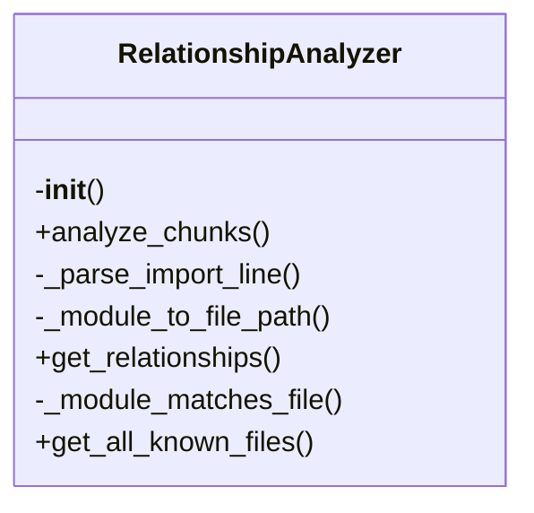
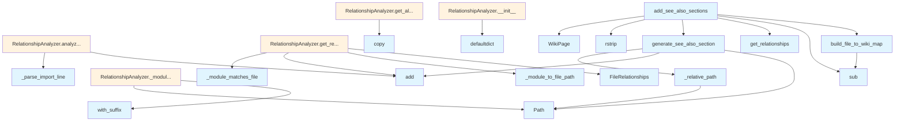

# File Overview

This file, `see_also.py`, is part of the `local_deepwiki` package and provides functionality for generating "See Also" sections in wiki pages. It helps establish relationships between source files and their corresponding wiki documentation by mapping file paths and analyzing dependencies to suggest related content.

The module includes utilities for building mappings from source files to wiki pages, generating see-also content, and adding these sections to wiki pages.

# Classes

## FileRelationships

A dataclass used to store information about file relationships.

### Fields

- `source_file` (str): The path of the source file.
- `wiki_page` (str): The corresponding wiki page path.
- `related_files` (list[str]): A list of related file paths.

## RelationshipAnalyzer

A class responsible for analyzing relationships between source files and wiki pages.

### Methods

- `analyze()` → `dict[str, list[str]]`: Analyzes the relationships and returns a dictionary mapping source files to lists of related files.

# Functions

## build_file_to_wiki_map

```python
def build_file_to_wiki_map(pages: list[WikiPage]) -> dict[str, str]:
```

Builds a mapping from source file paths to wiki page paths.

### Parameters

- `pages` (list[WikiPage]): A list of wiki pages to process.

### Returns

- `dict[str, str]`: A dictionary mapping source file paths to wiki page paths.

## generate_see_also_section

```python
def generate_see_also_section(related_files: list[str]) -> str:
```

Generates a formatted "See Also" section for a wiki page based on a list of related files.

### Parameters

- `related_files` (list[str]): A list of file paths related to the current page.

### Returns

- `str`: A formatted markdown string representing the "See Also" section.

## _relative_path

```python
def _relative_path(file_path: str, base_path: str) -> str:
```

Computes the relative path of a file with respect to a base path.

### Parameters

- `file_path` (str): The absolute or full file path.
- `base_path` (str): The base path to compute the relative path from.

### Returns

- `str`: The relative path of `file_path` with respect to `base_path`.

## add_see_also_sections

```python
def add_see_also_sections(wiki_pages: list[WikiPage], file_to_wiki_map: dict[str, str]) -> None:
```

Adds "See Also" sections to the content of wiki pages based on the file-to-wiki mapping.

### Parameters

- `wiki_pages` (list[WikiPage]): A list of wiki pages to update.
- `file_to_wiki_map` (dict[str, str]): A mapping from source file paths to wiki page paths.

### Returns

- `None`: This function modifies the wiki pages in place.

# Usage Examples

## Building a File-to-Wiki Map

```python
from local_deepwiki.generators.see_also import build_file_to_wiki_map
from local_deepwiki.models import WikiPage

pages = [WikiPage(path="files/src/local_deepwiki/core/chunker.md", content="...")]
file_to_wiki_map = build_file_to_wiki_map(pages)
```

## Generating a See Also Section

```python
from local_deepwiki.generators.see_also import generate_see_also_section

related_files = ["src/local_deepwiki/core/chunker.py", "src/local_deepwiki/core/parser.py"]
section = generate_see_also_section(related_files)
```

## Adding See Also Sections to Wiki Pages

```python
from local_deepwiki.generators.see_also import add_see_also_sections
from local_deepwiki.models import WikiPage

wiki_pages = [WikiPage(path="files/src/local_deepwiki/core/chunker.md", content="...")]
file_to_wiki_map = {"src/local_deepwiki/core/chunker.py": "files/src/local_deepwiki/core/chunker.md"}

add_see_also_sections(wiki_pages, file_to_wiki_map)
```

# Related Components

This module interacts with the following components:

- `WikiPage` from `local_deepwiki.models`: Represents a wiki page with a path and content.
- `ChunkType` and `CodeChunk` from `local_deepwiki.models`: Used for handling code chunks and their types, although not directly used in this file.
- `Path` from `pathlib`: Used for handling file paths.
- `re`: Used for regular expressions, although not directly used in this file.

## API Reference

### class `FileRelationships`

Relationships for a single file.

### class `RelationshipAnalyzer`

Analyzes import relationships between source files.  This class builds a graph of file dependencies from import chunks, enabling discovery of related files through various relationship types.

**Methods:**

#### `__init__`

```python
def __init__() -> None
```

Initialize an empty relationship analyzer.

#### `analyze_chunks`

```python
def analyze_chunks(chunks: list[CodeChunk]) -> None
```

Analyze import chunks to build relationship graph.


| [Parameter](api_docs.md) | Type | Default | Description |
|-----------|------|---------|-------------|
| `chunks` | `list[CodeChunk]` | - | List of code chunks (should include IMPORT chunks). |

#### `get_relationships`

```python
def get_relationships(file_path: str) -> FileRelationships
```

Get all relationships for a file.


| [Parameter](api_docs.md) | Type | Default | Description |
|-----------|------|---------|-------------|
| `file_path` | `str` | - | Path to the source file. |

#### `get_all_known_files`

```python
def get_all_known_files() -> set[str]
```

Get all known file paths.


---

### Functions

#### `build_file_to_wiki_map`

```python
def build_file_to_wiki_map(pages: list[WikiPage]) -> dict[str, str]
```

Build a mapping from source file paths to wiki page paths.


| [Parameter](api_docs.md) | Type | Default | Description |
|-----------|------|---------|-------------|
| `pages` | `list[WikiPage]` | - | List of wiki pages. |

**Returns:** `dict[str, str]`


#### `generate_see_also_section`

```python
def generate_see_also_section(relationships: FileRelationships, file_to_wiki: dict[str, str], current_wiki_path: str, max_items: int = 5) -> str | None
```

Generate a See Also section for a wiki page.


| [Parameter](api_docs.md) | Type | Default | Description |
|-----------|------|---------|-------------|
| `relationships` | `FileRelationships` | - | The file relationships. |
| `file_to_wiki` | `dict[str, str]` | - | Mapping of source files to wiki paths. |
| `current_wiki_path` | `str` | - | Path of the current wiki page. |
| `max_items` | `int` | `5` | Maximum number of items to include. |

**Returns:** `str | None`


#### `add_see_also_sections`

```python
def add_see_also_sections(pages: list[WikiPage], analyzer: RelationshipAnalyzer) -> list[WikiPage]
```

Add See Also sections to wiki pages.


| [Parameter](api_docs.md) | Type | Default | Description |
|-----------|------|---------|-------------|
| `pages` | `list[WikiPage]` | - | List of wiki pages. |
| `analyzer` | `RelationshipAnalyzer` | - | Relationship analyzer with import data. |

**Returns:** `list[WikiPage]`


## Class Diagram



## Call Graph



## Relevant Source Files

- `src/local_deepwiki/generators/see_also.py:16-22`

## See Also

- [wiki](wiki.md) - uses this
- [crosslinks](crosslinks.md) - shares 4 dependencies
- [diagrams](diagrams.md) - shares 4 dependencies
- [api_docs](api_docs.md) - shares 4 dependencies
