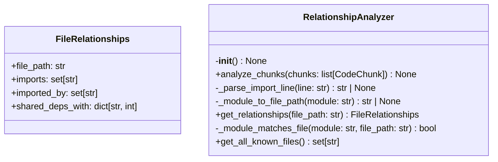
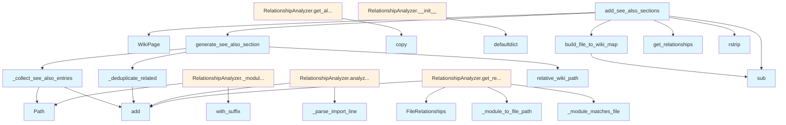

# File: `src/local_deepwiki/generators/see_also.py`

## File Overview

This module is responsible for generating **See Also** sections in wiki documentation pages. It analyzes import relationships between source files to identify related documentation pages, thereby improving discoverability of related content in the generated wiki.

The core functionality is implemented through a `RelationshipAnalyzer` that processes import statements from code chunks and builds a graph of file dependencies. The module then maps these relationships to wiki page paths and generates Markdown content for inclusion in documentation pages.

## Key Concepts

### Import Relationship Analysis

The design centers around the idea that files that import or are imported by a given file are semantically related. This is a common pattern in software documentation to guide users to related components.

The `RelationshipAnalyzer` class encapsulates this logic:
- It parses `import` and `from ... import ...` statements from code chunks.
- It maintains mappings of which files import which modules and vice versa.
- It resolves module names to actual file paths using heuristics.

### Dependency Graph Construction

The module builds a directed dependency graph:
- `imports`: Tracks which files a given file imports.
- `imported_by`: Tracks which files import a given file.
- `shared_deps_with`: Identifies files that share multiple dependencies, suggesting closer semantic relationship.

This graph is used to determine the types of relationships for the See Also section:
1. **Uses this**: Files that import the current file.
2. **Dependency**: Files that the current file imports.
3. **Shares N dependencies**: Files that share multiple imports with the current file.

### Wiki Path Mapping

The `build_file_to_wiki_map` function bridges source code file paths and wiki page paths. It handles the transformation from `.py` source files to `.md` wiki pages by:
- Removing the `files/` prefix from wiki paths.
- Replacing `.md` with `.py` to get the source file path.
- Mapping source paths to wiki paths for cross-referencing.

### Deduplication and Prioritization

The `_collect_see_also_entries` function gathers related items from all relationship types, while `_deduplicate_related` ensures that no duplicate wiki paths are included in the final list. This prevents redundant links and keeps the See Also section clean and useful.

## Integration

This module integrates with the broader codebase by:
- **Consuming** [`CodeChunk`](../models/chunks.md) objects from the code analysis pipeline, specifically looking for `ChunkType.IMPORT` chunks.
- **Producing** updated [`WikiPage`](../export/streaming.md) objects with added See Also sections.
- **Using** the [`relative_wiki_path`](wiki/utils.md) utility for generating correct relative links between wiki pages.
- **Being used by**:
  - `FileRelationships` and `RelationshipAnalyzer` classes, which are part of the test suite (`test_see_also`).
  - `build_file_to_wiki_map`, which is used by `source_refs` and `test_see_also`.

The `add_see_also_sections` function is the main entry point for integrating this logic into the wiki generation pipeline. It is designed to be used as a post-processing step that modifies wiki pages by appending See Also sections.

## Design Notes

### Trade-offs and Edge Cases

- **Module Resolution**: The `_module_to_file_path` method uses heuristics to map module names to file paths. It tries common patterns like `module.submodule` to `module/submodule` and supports both `src/`-prefixed and non-prefixed paths. This approach is pragmatic but may not cover all edge cases in complex Python projects.
  
- **Shared Dependency Counting**: Only files with 2 or more shared dependencies are included in the "shares N dependencies" category. This prevents the See Also section from being cluttered with trivial relationships.

- **Deduplication Strategy**: The deduplication logic prioritizes inclusion order and stops once `max_items` are reached. This ensures the section remains concise and avoids overwhelming the reader with too many links.

- **Wiki Path Handling**: The mapping logic assumes a consistent naming scheme between source files and wiki pages (e.g., `src/module/file.py` → `files/module/file.md`). This is a reasonable assumption for this tool's scope but might not be flexible enough for highly customized projects.

- **Performance Considerations**: The module uses `defaultdict` for efficient lookups and avoids recomputing relationships for each file, assuming the `RelationshipAnalyzer` is reused across pages.

This design prioritizes clarity and usability in documentation generation, focusing on relationships that are meaningful to developers who are reading the documentation.

## API Reference

### class `FileRelationships`

Relationships for a single file.


<details>
<summary>View Source (lines 19-27) | <a href="https://github.com/UrbanDiver/local-deepwiki-mcp/blob/main/src/local_deepwiki/generators/see_also.py#L19-L27">GitHub</a></summary>

```python
class FileRelationships:
    """Relationships for a single file."""

    file_path: str
    imports: set[str] = field(default_factory=set)  # Files this file imports
    imported_by: set[str] = field(default_factory=set)  # Files that import this
    shared_deps_with: dict[str, int] = field(
        default_factory=dict
    )  # File -> shared count
```

</details>

### class `RelationshipAnalyzer`

Analyzes import relationships between source files.  This class builds a graph of file dependencies from import chunks, enabling discovery of related files through various relationship types.

**Methods:**


<details>
<summary>View Source (lines 30-189) | <a href="https://github.com/UrbanDiver/local-deepwiki-mcp/blob/main/src/local_deepwiki/generators/see_also.py#L30-L189">GitHub</a></summary>

```python
class RelationshipAnalyzer:
    # Methods: __init__, analyze_chunks, _parse_import_line, _module_to_file_path, get_relationships, _module_matches_file, get_all_known_files
```

</details>

#### `__init__`

```python
def __init__() -> None
```

Initialize an empty relationship analyzer.


<details>
<summary>View Source (lines 37-44) | <a href="https://github.com/UrbanDiver/local-deepwiki-mcp/blob/main/src/local_deepwiki/generators/see_also.py#L37-L44">GitHub</a></summary>

```python
def __init__(self) -> None:
        """Initialize an empty relationship analyzer."""
        # Map of file_path -> set of imported module paths
        self._imports: dict[str, set[str]] = defaultdict(set)
        # Map of module_path -> set of files that import it
        self._imported_by: dict[str, set[str]] = defaultdict(set)
        # Set of all known internal file paths
        self._known_files: set[str] = set()
```

</details>

#### `analyze_chunks`

```python
def analyze_chunks(chunks: list[CodeChunk]) -> None
```

Analyze import chunks to build relationship graph.


| Parameter | Type | Default | Description |
|-----------|------|---------|-------------|
| `chunks` | `list[CodeChunk]` | - | List of code chunks (should include IMPORT chunks). |


<details>
<summary>View Source (lines 46-68) | <a href="https://github.com/UrbanDiver/local-deepwiki-mcp/blob/main/src/local_deepwiki/generators/see_also.py#L46-L68">GitHub</a></summary>

```python
def analyze_chunks(self, chunks: list[CodeChunk]) -> None:
        """Analyze import chunks to build relationship graph.

        Args:
            chunks: List of code chunks (should include IMPORT chunks).
        """
        for chunk in chunks:
            if chunk.chunk_type != ChunkType.IMPORT:
                continue

            file_path = chunk.file_path
            self._known_files.add(file_path)

            # Parse imports from content
            for line in chunk.content.split("\n"):
                line = line.strip()
                if not line:
                    continue

                imported = self._parse_import_line(line)
                if imported:
                    self._imports[file_path].add(imported)
                    self._imported_by[imported].add(file_path)
```

</details>

#### `get_relationships`

```python
def get_relationships(file_path: str) -> FileRelationships
```

Get all relationships for a file.


| Parameter | Type | Default | Description |
|-----------|------|---------|-------------|
| `file_path` | `str` | - | Path to the source file. |


<details>
<summary>View Source (lines 127-161) | <a href="https://github.com/UrbanDiver/local-deepwiki-mcp/blob/main/src/local_deepwiki/generators/see_also.py#L127-L161">GitHub</a></summary>

```python
def get_relationships(self, file_path: str) -> FileRelationships:
        """Get all relationships for a file.

        Args:
            file_path: Path to the source file.

        Returns:
            FileRelationships object with all relationship data.
        """
        relationships = FileRelationships(file_path=file_path)

        # Get direct imports (files this file imports)
        for module in self._imports.get(file_path, set()):
            imported_file = self._module_to_file_path(module)
            if imported_file and imported_file != file_path:
                relationships.imports.add(imported_file)

        # Get importers (files that import this file)
        for module, importers in self._imported_by.items():
            # Check if module refers to this file
            if self._module_matches_file(module, file_path):
                for importer in importers:
                    if importer != file_path:
                        relationships.imported_by.add(importer)

        # Calculate shared dependencies
        my_imports = self._imports.get(file_path, set())
        for other_file, other_imports in self._imports.items():
            if other_file == file_path:
                continue
            shared = my_imports & other_imports
            if len(shared) >= 2:  # Only count if 2+ shared deps
                relationships.shared_deps_with[other_file] = len(shared)

        return relationships
```

</details>

#### `get_all_known_files`

```python
def get_all_known_files() -> set[str]
```

Get all known file paths.


---


<details>
<summary>View Source (lines 183-189) | <a href="https://github.com/UrbanDiver/local-deepwiki-mcp/blob/main/src/local_deepwiki/generators/see_also.py#L183-L189">GitHub</a></summary>

```python
def get_all_known_files(self) -> set[str]:
        """Get all known file paths.

        Returns:
            Set of file paths.
        """
        return self._known_files.copy()
```

</details>

### Functions

#### `build_file_to_wiki_map`

```python
def build_file_to_wiki_map(pages: list[WikiPage]) -> dict[str, str]
```

Build a mapping from source file paths to wiki page paths.


| Parameter | Type | Default | Description |
|-----------|------|---------|-------------|
| `pages` | `list[WikiPage]` | - | List of wiki pages. |

**Returns:** `dict[str, str]`


<details>
<summary>View Source (lines 192-212) | <a href="https://github.com/UrbanDiver/local-deepwiki-mcp/blob/main/src/local_deepwiki/generators/see_also.py#L192-L212">GitHub</a></summary>

```python
def build_file_to_wiki_map(pages: list[WikiPage]) -> dict[str, str]:
    """Build a mapping from source file paths to wiki page paths.

    Args:
        pages: List of wiki pages.

    Returns:
        Dictionary mapping source file path to wiki page path.
    """
    file_to_wiki: dict[str, str] = {}

    for page in pages:
        # Wiki paths like "files/src/local_deepwiki/core/chunker.md"
        # correspond to source files like "src/local_deepwiki/core/chunker.py"
        if page.path.startswith("files/"):
            # Remove "files/" prefix and change .md to .py
            source_path = page.path[6:]  # Remove "files/"
            source_path = re.sub(r"\.md$", ".py", source_path)
            file_to_wiki[source_path] = page.path

    return file_to_wiki
```

</details>

#### `generate_see_also_section`

```python
def generate_see_also_section(relationships: FileRelationships, file_to_wiki: dict[str, str], current_wiki_path: str, max_items: int = 5) -> str | None
```

Generate a See Also section for a wiki page.


| Parameter | Type | Default | Description |
|-----------|------|---------|-------------|
| `relationships` | `FileRelationships` | - | The file relationships. |
| `file_to_wiki` | `dict[str, str]` | - | Mapping of source files to wiki paths. |
| `current_wiki_path` | `str` | - | Path of the current wiki page. |
| `max_items` | `int` | `5` | Maximum number of items to include. |

**Returns:** `str | None`


<details>
<summary>View Source (lines 268-296) | <a href="https://github.com/UrbanDiver/local-deepwiki-mcp/blob/main/src/local_deepwiki/generators/see_also.py#L268-L296">GitHub</a></summary>

```python
def generate_see_also_section(
    relationships: FileRelationships,
    file_to_wiki: dict[str, str],
    current_wiki_path: str,
    max_items: int = 5,
) -> str | None:
    """Generate a See Also section for a wiki page.

    Args:
        relationships: The file relationships.
        file_to_wiki: Mapping of source files to wiki paths.
        current_wiki_path: Path of the current wiki page.
        max_items: Maximum number of items to include.

    Returns:
        Markdown string for See Also section, or None if no related pages.
    """
    related = _collect_see_also_entries(relationships, file_to_wiki, current_wiki_path)
    if not related:
        return None

    unique_related = _deduplicate_related(related, max_items)

    lines = ["## See Also", ""]
    for wiki_path, title, rel_type in unique_related:
        rel_path = relative_wiki_path(current_wiki_path, wiki_path)
        lines.append(f"- [{title}]({rel_path}) - {rel_type}")

    return "\n".join(lines)
```

</details>

#### `add_see_also_sections`

```python
def add_see_also_sections(pages: list[WikiPage], analyzer: RelationshipAnalyzer) -> list[WikiPage]
```

Add See Also sections to wiki pages.


| Parameter | Type | Default | Description |
|-----------|------|---------|-------------|
| `pages` | `list[WikiPage]` | - | List of wiki pages. |
| `analyzer` | `RelationshipAnalyzer` | - | Relationship analyzer with import data. |

**Returns:** `list[WikiPage]`


<details>
<summary>View Source (lines 299-350) | <a href="https://github.com/UrbanDiver/local-deepwiki-mcp/blob/main/src/local_deepwiki/generators/see_also.py#L299-L350">GitHub</a></summary>

```python
def add_see_also_sections(
    pages: list[WikiPage],
    analyzer: RelationshipAnalyzer,
) -> list[WikiPage]:
    """Add See Also sections to wiki pages.

    Args:
        pages: List of wiki pages.
        analyzer: Relationship analyzer with import data.

    Returns:
        List of wiki pages with See Also sections added.
    """
    # Build file to wiki path mapping
    file_to_wiki = build_file_to_wiki_map(pages)

    updated_pages = []
    for page in pages:
        # Only add See Also to file documentation pages
        if not page.path.startswith("files/") or page.path == "files/index.md":
            updated_pages.append(page)
            continue

        # Get source file path from wiki path
        source_path = page.path[6:]  # Remove "files/"
        source_path = re.sub(r"\.md$", ".py", source_path)

        # Get relationships for this file
        relationships = analyzer.get_relationships(source_path)

        # Generate See Also section
        see_also = generate_see_also_section(
            relationships,
            file_to_wiki,
            page.path,
        )

        if see_also:
            # Add See Also section to end of page
            new_content = page.content.rstrip() + "\n\n" + see_also + "\n"
            updated_pages.append(
                WikiPage(
                    path=page.path,
                    title=page.title,
                    content=new_content,
                    generated_at=page.generated_at,
                )
            )
        else:
            updated_pages.append(page)

    return updated_pages
```

</details>

## Class Diagram


```mermaid
classDiagram
    class FileRelationships {
        +file_path: str
        +imports: set[str]
        +imported_by: set[str]
        +shared_deps_with: dict[str, int]
    }
    class RelationshipAnalyzer {
        -__init__() None
        +analyze_chunks(chunks: list[CodeChunk]) None
        -_parse_import_line(line: str) str | None
        -_module_to_file_path(module: str) str | None
        +get_relationships(file_path: str) FileRelationships
        -_module_matches_file(module: str, file_path: str) bool
        +get_all_known_files() set[str]
    }
```

## Call Graph


```mermaid
flowchart TD
    N0[FileRelationships]
    N1[Path]
    N2[RelationshipAnalyzer.__init__]
    N3[RelationshipAnalyzer._modul...]
    N4[RelationshipAnalyzer.analyz...]
    N5[RelationshipAnalyzer.get_al...]
    N6[RelationshipAnalyzer.get_re...]
    N7[WikiPage]
    N8[_collect_see_also_entries]
    N9[_deduplicate_related]
    N10[_module_matches_file]
    N11[_module_to_file_path]
    N12[_parse_import_line]
    N13[add]
    N14[add_see_also_sections]
    N15[build_file_to_wiki_map]
    N16[copy]
    N17[defaultdict]
    N18[generate_see_also_section]
    N19[get_relationships]
    N20[relative_wiki_path]
    N21[rstrip]
    N22[sub]
    N23[with_suffix]
    N15 --> N22
    N8 --> N1
    N8 --> N13
    N9 --> N13
    N18 --> N8
    N18 --> N9
    N18 --> N20
    N14 --> N15
    N14 --> N22
    N14 --> N19
    N14 --> N18
    N14 --> N21
    N14 --> N7
    N2 --> N17
    N4 --> N13
    N4 --> N12
    N6 --> N0
    N6 --> N11
    N6 --> N13
    N6 --> N10
    N3 --> N23
    N3 --> N1
    N5 --> N16
    classDef func fill:#e1f5fe
    class N0,N1,N7,N8,N9,N10,N11,N12,N13,N14,N15,N16,N17,N18,N19,N20,N21,N22,N23 func
    classDef method fill:#fff3e0
    class N2,N3,N4,N5,N6 method
```

## Used By

Functions and methods in this file and their callers:

- **`FileRelationships`**: called by `RelationshipAnalyzer.get_relationships`
- **`Path`**: called by `RelationshipAnalyzer._module_matches_file`, `_collect_see_also_entries`
- **[`WikiPage`](../export/streaming.md)**: called by `add_see_also_sections`
- **`_collect_see_also_entries`**: called by `generate_see_also_section`
- **`_deduplicate_related`**: called by `generate_see_also_section`
- **`_module_matches_file`**: called by `RelationshipAnalyzer.get_relationships`
- **`_module_to_file_path`**: called by `RelationshipAnalyzer.get_relationships`
- **`_parse_import_line`**: called by `RelationshipAnalyzer.analyze_chunks`
- **`add`**: called by `RelationshipAnalyzer.analyze_chunks`, `RelationshipAnalyzer.get_relationships`, `_collect_see_also_entries`, `_deduplicate_related`
- **`build_file_to_wiki_map`**: called by `add_see_also_sections`
- **`copy`**: called by `RelationshipAnalyzer.get_all_known_files`
- **`defaultdict`**: called by `RelationshipAnalyzer.__init__`
- **`generate_see_also_section`**: called by `add_see_also_sections`
- **`get_relationships`**: called by `add_see_also_sections`
- **[`relative_wiki_path`](wiki/utils.md)**: called by `generate_see_also_section`
- **`rstrip`**: called by `add_see_also_sections`
- **`sub`**: called by `add_see_also_sections`, `build_file_to_wiki_map`
- **`with_suffix`**: called by `RelationshipAnalyzer._module_matches_file`

## Usage Examples

*Examples extracted from test files*

### Test analyzing Python import statements

From `test_see_also.py::TestRelationshipAnalyzer::test_analyze_python_imports`:

```python
name="imports",
        content="from local_deepwiki.core.chunker import CodeChunker\nfrom local_deepwiki.models import CodeChunk",
        start_line=1,
        end_line=2,
    ),
    CodeChunk(
        id="2",
        file_path="src/local_deepwiki/core/chunker.py",
        language=Language.PYTHON,
        chunk_type=ChunkType.IMPORT,
        name="imports",
        content="from local_deepwiki.models import CodeChunk",
        start_line=1,
        end_line=1,
    ),
]

analyzer.analyze_chunks(chunks)

# Check that files are tracked
known_files = analyzer.get_all_known_files()
assert "src/local_deepwiki/core/indexer.py" in known_files
assert "src/local_deepwiki/core/chunker.py" in known_files
```

### Test analyzing Python import statements

From `test_see_also.py::TestRelationshipAnalyzer::test_analyze_python_imports`:

```python
analyzer = RelationshipAnalyzer()
chunks = [
    CodeChunk(
        id="1",
        file_path="src/local_deepwiki/core/indexer.py",
        language=Language.PYTHON,
        chunk_type=ChunkType.IMPORT,
        name="imports",
        content="from local_deepwiki.core.chunker import CodeChunker\nfrom local_deepwiki.models import CodeChunk",
        start_line=1,
        end_line=2,
    ),
    CodeChunk(
        id="2",
        file_path="src/local_deepwiki/core/chunker.py",
        language=Language.PYTHON,
        chunk_type=ChunkType.IMPORT,
        name="imports",
        content="from local_deepwiki.models import CodeChunk",
        start_line=1,
        end_line=1,
    ),
]

analyzer.analyze_chunks(chunks)
```

### Test analyzing Python import statements

From `test_see_also.py::TestRelationshipAnalyzer::test_analyze_python_imports`:

```python
analyzer.analyze_chunks(chunks)

# Check that files are tracked
known_files = analyzer.get_all_known_files()
assert "src/local_deepwiki/core/indexer.py" in known_files
assert "src/local_deepwiki/core/chunker.py" in known_files
```

### Test analyzing Python import statements

From `test_see_also.py::TestRelationshipAnalyzer::test_analyze_python_imports`:

```python
known_files = analyzer.get_all_known_files()
assert "src/local_deepwiki/core/indexer.py" in known_files
assert "src/local_deepwiki/core/chunker.py" in known_files
```

### Test getting import relationships for a file

From `test_see_also.py::TestRelationshipAnalyzer::test_get_relationships_imports`:

```python
name="imports",
        content="from local_deepwiki.core.chunker import CodeChunker",
        start_line=1,
        end_line=1,
    ),
    CodeChunk(
        id="2",
        file_path="src/local_deepwiki/core/chunker.py",
        language=Language.PYTHON,
        chunk_type=ChunkType.IMPORT,
        name="imports",
        content="from local_deepwiki.models import CodeChunk",
        start_line=1,
        end_line=1,
    ),
]

analyzer.analyze_chunks(chunks)
relationships = analyzer.get_relationships("src/local_deepwiki/core/indexer.py")

assert isinstance(relationships, FileRelationships)
assert relationships.file_path == "src/local_deepwiki/core/indexer.py"
```


## Last Modified

| Entity | Type | Author | Date | Commit |
|--------|------|--------|------|--------|
| `_collect_see_also_entries` | function | Brian Breidenbach | 2 days ago | `8b8f36f` refactor: decompose CC > 15... |
| `_deduplicate_related` | function | Brian Breidenbach | 2 days ago | `8b8f36f` refactor: decompose CC > 15... |
| `generate_see_also_section` | function | Brian Breidenbach | 2 days ago | `8b8f36f` refactor: decompose CC > 15... |
| `RelationshipAnalyzer` | class | Brian Breidenbach | Feb 20, 2026 | `6be69f5` refactor: low-priority Pyth... |
| `_parse_import_line` | method | Brian Breidenbach | Feb 20, 2026 | `6be69f5` refactor: low-priority Pyth... |
| `_module_matches_file` | method | Brian Breidenbach | Feb 20, 2026 | `6be69f5` refactor: low-priority Pyth... |
| `FileRelationships` | class | Brian Breidenbach | Feb 20, 2026 | `fdff11b` refactor: apply Pythonic id... |
| `analyze_chunks` | method | Brian Breidenbach | Jan 13, 2026 | `c568951` Add input validation, type ... |
| `_module_to_file_path` | method | Brian Breidenbach | Jan 13, 2026 | `c568951` Add input validation, type ... |
| `build_file_to_wiki_map` | function | Brian Breidenbach | Jan 13, 2026 | `c568951` Add input validation, type ... |
| `add_see_also_sections` | function | Brian Breidenbach | Jan 13, 2026 | `c568951` Add input validation, type ... |
| `__init__` | method | Brian Breidenbach | Jan 11, 2026 | `1315c7f` Add wiki improvements: incr... |
| `get_relationships` | method | Brian Breidenbach | Jan 11, 2026 | `1315c7f` Add wiki improvements: incr... |
| `get_all_known_files` | method | Brian Breidenbach | Jan 11, 2026 | `1315c7f` Add wiki improvements: incr... |

## Additional Source Code

Source code for functions and methods not listed in the API Reference above.

#### `_parse_import_line`

<details>
<summary>View Source (lines 71-99) | <a href="https://github.com/UrbanDiver/local-deepwiki-mcp/blob/main/src/local_deepwiki/generators/see_also.py#L71-L99">GitHub</a></summary>

```python
def _parse_import_line(line: str) -> str | None:
        """Parse a Python import line to extract the imported module.

        Args:
            line: Import statement line.

        Returns:
            Module path that could map to a file, or None.
        """
        module = None

        # Handle: from local_deepwiki.core.chunker import CodeChunker
        if line.startswith("from "):
            parts = line.split()
            if len(parts) >= 2:
                module = parts[1]
        # Handle: import local_deepwiki.core.chunker
        elif line.startswith("import "):
            parts = line.split()
            if len(parts) >= 2:
                module = parts[1].split(",")[0].strip()

        if not module:
            return None

        # Convert module path to potential file path
        # e.g., local_deepwiki.core.chunker -> local_deepwiki/core/chunker
        # We'll return the module as-is and match later
        return module
```

</details>


#### `_module_to_file_path`

<details>
<summary>View Source (lines 101-125) | <a href="https://github.com/UrbanDiver/local-deepwiki-mcp/blob/main/src/local_deepwiki/generators/see_also.py#L101-L125">GitHub</a></summary>

```python
def _module_to_file_path(self, module: str) -> str | None:
        """Try to find a file path that matches a module name.

        Args:
            module: Module name like 'local_deepwiki.core.chunker'.

        Returns:
            Matching file path or None.
        """
        # Convert module to potential file paths
        parts = module.replace(".", "/")
        candidates = [
            f"{parts}.py",
            f"src/{parts}.py",
        ]

        for candidate in candidates:
            if candidate in self._known_files:
                return candidate
            # Try partial match
            for known in self._known_files:
                if known.endswith(f"/{parts}.py") or known == f"{parts}.py":
                    return known

        return None
```

</details>


#### `_module_matches_file`

<details>
<summary>View Source (lines 164-181) | <a href="https://github.com/UrbanDiver/local-deepwiki-mcp/blob/main/src/local_deepwiki/generators/see_also.py#L164-L181">GitHub</a></summary>

```python
def _module_matches_file(module: str, file_path: str) -> bool:
        """Check if a module name refers to a file path.

        Args:
            module: Module name like 'local_deepwiki.core.chunker'.
            file_path: File path like 'src/local_deepwiki/core/chunker.py'.

        Returns:
            True if they match.
        """
        # Convert file path to module-like format
        path_parts = Path(file_path).with_suffix("").parts
        # Remove 'src' prefix if present
        if path_parts and path_parts[0] == "src":
            path_parts = path_parts[1:]
        path_module = ".".join(path_parts)

        return module == path_module or module.endswith(path_module)
```

</details>


#### `_collect_see_also_entries`

<details>
<summary>View Source (lines 215-249) | <a href="https://github.com/UrbanDiver/local-deepwiki-mcp/blob/main/src/local_deepwiki/generators/see_also.py#L215-L249">GitHub</a></summary>

```python
def _collect_see_also_entries(
    relationships: FileRelationships,
    file_to_wiki: dict[str, str],
    current_wiki_path: str,
) -> list[tuple[str, str, str]]:
    """Collect (wiki_path, title, relationship_type) tuples from all relationship types."""
    related: list[tuple[str, str, str]] = []

    for file_path in relationships.imported_by:
        wiki_path = file_to_wiki.get(file_path)
        if wiki_path and wiki_path != current_wiki_path:
            related.append((wiki_path, Path(file_path).stem, "uses this"))

    for file_path in relationships.imports:
        wiki_path = file_to_wiki.get(file_path)
        if wiki_path and wiki_path != current_wiki_path:
            related.append((wiki_path, Path(file_path).stem, "dependency"))

    shared_sorted = sorted(
        relationships.shared_deps_with.items(), key=lambda x: x[1], reverse=True
    )
    seen_wiki_paths = {wp for wp, _, _ in related}
    for file_path, count in shared_sorted[:3]:
        wiki_path = file_to_wiki.get(file_path)
        if (
            wiki_path
            and wiki_path != current_wiki_path
            and wiki_path not in seen_wiki_paths
        ):
            related.append(
                (wiki_path, Path(file_path).stem, f"shares {count} dependencies")
            )
            seen_wiki_paths.add(wiki_path)

    return related
```

</details>


#### `_deduplicate_related`

<details>
<summary>View Source (lines 252-265) | <a href="https://github.com/UrbanDiver/local-deepwiki-mcp/blob/main/src/local_deepwiki/generators/see_also.py#L252-L265">GitHub</a></summary>

```python
def _deduplicate_related(
    related: list[tuple[str, str, str]],
    max_items: int,
) -> list[tuple[str, str, str]]:
    """Deduplicate by wiki_path and truncate to *max_items*."""
    seen: set[str] = set()
    unique: list[tuple[str, str, str]] = []
    for wiki_path, title, rel_type in related:
        if wiki_path not in seen:
            seen.add(wiki_path)
            unique.append((wiki_path, title, rel_type))
            if len(unique) >= max_items:
                break
    return unique
```

</details>

## Relevant Source Files

- `src/local_deepwiki/generators/see_also.py:19-27`
