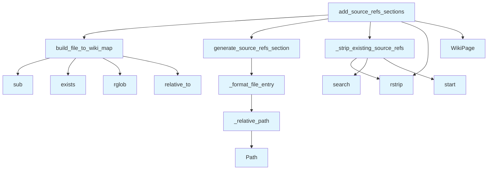

# source_refs.py

## File Overview

This module provides functionality for generating and managing "Relevant Source Files" sections in wiki pages. It builds mappings between source files and wiki pages, formats file references, and adds source reference sections to wiki pages based on their contributing source files.

## Functions

### add_source_refs_sections

```python
def add_source_refs_sections(
    pages: list[WikiPage],
    page_statuses: dict[str, WikiPageStatus],
    wiki_path: Path | None = None,
) -> list[WikiPage]:
```

Add Relevant Source Files sections to wiki pages.

**Parameters:**
- `pages`: List of wiki pages to process
- `page_statuses`: Dictionary mapping page paths to their [WikiPageStatus](../models.md) objects (containing source_files information)
- `wiki_path`: Optional path to wiki directory to [find](manifest.md) existing file pages

**Returns:**
- List of wiki pages with Relevant Source Files sections added

### generate_source_refs_section

```python
def generate_source_refs_section(
    source_files: list[str],
    current_wiki_path: str,
    file_to_wiki: dict[str, str],
    file_line_info: dict[str, dict[str, int]] | None = None,
    max_items: int = 10,
) -> str | None:
```

Generate a Relevant Source Files section for a wiki page.

**Parameters:**
- `source_files`: List of source file paths that contributed to this page
- `current_wiki_path`: Path of the current wiki page
- `file_to_wiki`: Mapping of source files to wiki paths
- `file_line_info`: Optional mapping of file paths to line info dictionaries
- `max_items`: Maximum number of items to include in the section

**Returns:**
- Generated Relevant Source Files section as a string, or None if no content

### build_file_to_wiki_map

```python
def build_file_to_wiki_map(...)
```

Builds a mapping between source files and their corresponding wiki pages.

### _relative_path

```python
def _relative_path(...)
```

Helper function for generating relative paths between files.

### _format_file_entry

```python
def _format_file_entry(...)
```

Helper function for formatting individual file entries in the source references section.

### _strip_existing_source_refs

```python
def _strip_existing_source_refs(...)
```

Helper function for removing existing source reference sections from wiki content.

## Usage Examples

### Adding Source References to Wiki Pages

```python
from local_deepwiki.generators.source_refs import add_source_refs_sections
from local_deepwiki.models import WikiPage, WikiPageStatus
from pathlib import Path

# Prepare wiki pages and their statuses
pages = [wiki_page1, wiki_page2]
page_statuses = {
    "page1.md": WikiPageStatus(...),
    "page2.md": WikiPageStatus(...)
}

# Add source reference sections
updated_pages = add_source_refs_sections(
    pages=pages,
    page_statuses=page_statuses,
    wiki_path=Path("wiki/")
)
```

### Generating a Source References Section

```python
from local_deepwiki.generators.source_refs import generate_source_refs_section

# Generate source references for a specific page
source_files = ["src/main.py", "src/utils.py"]
file_to_wiki = {"src/main.py": "main.md", "src/utils.py": "utils.md"}

section = generate_source_refs_section(
    source_files=source_files,
    current_wiki_path="overview.md",
    file_to_wiki=file_to_wiki,
    max_items=10
)
```

## Related Components

This module works with:
- [WikiPage](../models.md): Represents individual wiki pages with content and metadata
- [WikiPageStatus](../models.md): Contains status information including source_files that contributed to a page
- Path: Used for file system path operations

The module uses regular expressions for content manipulation and integrates with the broader wiki generation system to maintain references between source code and documentation.

## API Reference

### Functions

#### `build_file_to_wiki_map`

```python
def build_file_to_wiki_map(pages: list[WikiPage], wiki_path: Path | None = None) -> dict[str, str]
```

Build a mapping from source file paths to wiki page paths.


| [Parameter](api_docs.md) | Type | Default | Description |
|-----------|------|---------|-------------|
| `pages` | `list[WikiPage]` | - | List of wiki pages. |
| `wiki_path` | `Path | None` | `None` | Optional path to wiki directory to scan for existing pages. |

**Returns:** `dict[str, str]`


#### `generate_source_refs_section`

```python
def generate_source_refs_section(source_files: list[str], current_wiki_path: str, file_to_wiki: dict[str, str], file_line_info: dict[str, dict[str, int]] | None = None, max_items: int = 10) -> str | None
```

Generate a Relevant Source Files section for a wiki page.


| [Parameter](api_docs.md) | Type | Default | Description |
|-----------|------|---------|-------------|
| `source_files` | `list[str]` | - | List of source file paths that contributed to this page. |
| `current_wiki_path` | `str` | - | Path of the current wiki page. |
| `file_to_wiki` | `dict[str, str]` | - | Mapping of source files to wiki paths. |
| `file_line_info` | `dict[str, dict[str, int]] | None` | `None` | Optional mapping of file paths to line info dicts. |
| `max_items` | `int` | `10` | Maximum number of files to list. |

**Returns:** `str | None`


#### `add_source_refs_sections`

```python
def add_source_refs_sections(pages: list[WikiPage], page_statuses: dict[str, WikiPageStatus], wiki_path: Path | None = None) -> list[WikiPage]
```

Add Relevant Source Files sections to wiki pages.


| [Parameter](api_docs.md) | Type | Default | Description |
|-----------|------|---------|-------------|
| `pages` | `list[WikiPage]` | - | List of wiki pages. |
| `page_statuses` | `dict[str, WikiPageStatus]` | - | Dictionary mapping page paths to their status (with source_files). |
| `wiki_path` | `Path | None` | `None` | Optional path to wiki directory to [find](manifest.md) existing file pages. |

**Returns:** `list[WikiPage]`


## Call Graph



## Usage Examples

*Examples extracted from test files*

### Test that file paths are correctly mapped to wiki paths

From `test_source_refs.py::test_builds_correct_mapping`:

```python
result = build_file_to_wiki_map(pages)

assert result == {
```

### Test with empty pages list

From `test_source_refs.py::test_empty_pages`:

```python
result = build_file_to_wiki_map([])
assert result == {}
```

### Test relative path in same directory

From `test_source_refs.py::test_same_directory`:

```python
result = _relative_path(
    "files/src/local_deepwiki/core/chunker.md",
    "files/src/local_deepwiki/core/parser.md",
)
assert result == "parser.md"
```

### Test relative path to parent directory

From `test_source_refs.py::test_parent_directory`:

```python
result = _relative_path(
    "files/src/local_deepwiki/core/chunker.md",
    "files/src/local_deepwiki/models.md",
)
assert result == "../models.md"
```

### Test generating section for single file with wiki page

From `test_source_refs.py::test_single_file_with_wiki_link`:

```python
result = generate_source_refs_section(
    source_files=["src/local_deepwiki/core/parser.py"],
    current_wiki_path="files/src/local_deepwiki/core/chunker.md",
    file_to_wiki=file_to_wiki,
)

assert result is not None
```

## Relevant Source Files

- `src/local_deepwiki/generators/source_refs.py:14-55`

## See Also

- [models](../models.md) - dependency
- [crosslinks](crosslinks.md) - shares 3 dependencies
- [diagrams](diagrams.md) - shares 3 dependencies
- [see_also](see_also.md) - shares 3 dependencies
