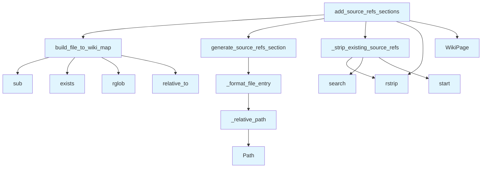

# Source References Generator

## File Overview

The `source_refs.py` module provides functionality for generating and managing source reference sections in wiki pages. It builds mappings between source files and wiki pages, and handles the automatic addition of source reference sections to wiki content.

## Functions

### build_file_to_wiki_map

Builds a mapping between source files and their corresponding wiki pages.

**Parameters:**
- Not visible in the provided code

**Returns:**
- Not visible in the provided code

### _relative_path

A private helper function that handles relative path calculations.

**Parameters:**
- Not visible in the provided code

**Returns:**
- Not visible in the provided code

### _format_file_entry

A private helper function that formats individual file entries for display in source reference sections.

**Parameters:**
- Not visible in the provided code

**Returns:**
- Not visible in the provided code

### generate_source_refs_section

Generates a complete source references section for inclusion in wiki pages.

**Parameters:**
- Not visible in the provided code

**Returns:**
- Not visible in the provided code

### _strip_existing_source_refs

A private helper function that removes existing source reference sections from content.

**Parameters:**
- Not visible in the provided code

**Returns:**
- Not visible in the provided code

### add_source_refs_sections

Adds source reference sections to wiki pages.

**Parameters:**
- Not visible in the provided code

**Returns:**
- Not visible in the provided code

## Related Components

This module works with the following components from the local_deepwiki system:

- **[WikiPage](../models.md)**: Used for representing wiki page data and metadata
- **[WikiPageStatus](../models.md)**: Used for tracking the status of wiki pages during processing

The module uses Python's built-in `re` module for regular expression operations and `pathlib.Path` for file path handling.

## Dependencies

- `re`: Python's regular expression module for pattern matching operations
- `pathlib.Path`: Python's object-oriented filesystem path handling
- [`local_deepwiki.models.WikiPage`](../models.md): Core wiki page model
- [`local_deepwiki.models.WikiPageStatus`](../models.md): Wiki page status enumeration

## API Reference

### Functions

#### `build_file_to_wiki_map`

```python
def build_file_to_wiki_map(pages: list[WikiPage], wiki_path: Path | None = None) -> dict[str, str]
```

Build a mapping from source file paths to wiki page paths.


| [Parameter](api_docs.md) | Type | Default | Description |
|-----------|------|---------|-------------|
| `pages` | `list[WikiPage]` | - | List of wiki pages. |
| `wiki_path` | `Path | None` | `None` | Optional path to wiki directory to scan for existing pages. |

**Returns:** `dict[str, str]`


<details>
<summary>View Source (lines 14-53) | <a href="https://github.com/UrbanDiver/local-deepwiki-mcp/blob/[main](../export/pdf.md)/src/local_deepwiki/generators/source_refs.py#L14-L53">GitHub</a></summary>

```python
def build_file_to_wiki_map(pages: list[WikiPage], wiki_path: Path | None = None) -> dict[str, str]:
    """Build a mapping from source file paths to wiki page paths.

    Args:
        pages: List of wiki pages.
        wiki_path: Optional path to wiki directory to scan for existing pages.

    Returns:
        Dictionary mapping source file path to wiki page path.
    """
    file_to_wiki: dict[str, str] = {}

    # First, add mappings from the pages list
    for page in pages:
        # Wiki paths like "files/src/local_deepwiki/core/chunker.md"
        # correspond to source files like "src/local_deepwiki/core/chunker.py"
        if page.path.startswith("files/"):
            # Remove "files/" prefix and change .md to .py
            source_path = page.path[6:]  # Remove "files/"
            source_path = re.sub(r"\.md$", ".py", source_path)
            file_to_wiki[source_path] = page.path

    # Also scan wiki_path for existing file pages not in the pages list
    if wiki_path and wiki_path.exists():
        files_dir = wiki_path / "files"
        if files_dir.exists():
            for md_file in files_dir.rglob("*.md"):
                # Skip index files
                if md_file.name == "index.md":
                    continue
                # Get relative path from wiki_path
                rel_path = str(md_file.relative_to(wiki_path))
                # Convert to source path
                source_path = rel_path[6:]  # Remove "files/"
                source_path = re.sub(r"\.md$", ".py", source_path)
                # Only add if not already in map
                if source_path not in file_to_wiki:
                    file_to_wiki[source_path] = rel_path

    return file_to_wiki
```

</details>

#### `generate_source_refs_section`

```python
def generate_source_refs_section(source_files: list[str], current_wiki_path: str, file_to_wiki: dict[str, str], file_line_info: dict[str, dict[str, int]] | None = None, max_items: int = 10) -> str | None
```

Generate a Relevant Source Files section for a wiki page.


| [Parameter](api_docs.md) | Type | Default | Description |
|-----------|------|---------|-------------|
| `source_files` | `list[str]` | - | List of source file paths that contributed to this page. |
| `current_wiki_path` | `str` | - | Path of the current wiki page. |
| `file_to_wiki` | `dict[str, str]` | - | Mapping of source files to wiki paths. |
| `file_line_info` | `dict[str, dict[str, int]] | None` | `None` | Optional mapping of file paths to line info dicts. |
| `max_items` | `int` | `10` | Maximum number of files to list. |

**Returns:** `str | None`


<details>
<summary>View Source (lines 115-169) | <a href="https://github.com/UrbanDiver/local-deepwiki-mcp/blob/[main](../export/pdf.md)/src/local_deepwiki/generators/source_refs.py#L115-L169">GitHub</a></summary>

```python
def generate_source_refs_section(
    source_files: list[str],
    current_wiki_path: str,
    file_to_wiki: dict[str, str],
    file_line_info: dict[str, dict[str, int]] | None = None,
    max_items: int = 10,
) -> str | None:
    """Generate a Relevant Source Files section for a wiki page.

    Args:
        source_files: List of source file paths that contributed to this page.
        current_wiki_path: Path of the current wiki page.
        file_to_wiki: Mapping of source files to wiki paths.
        file_line_info: Optional mapping of file paths to line info dicts.
        max_items: Maximum number of files to list.

    Returns:
        Markdown string for Relevant Source Files section, or None if no files.
    """
    if not source_files:
        return None

    # Filter and limit source files
    files_to_show = source_files[:max_items]

    # For pages with many source files (like overview/architecture),
    # we could show a summary instead
    if len(source_files) > max_items:
        summary_note = f"\n\n*Showing {max_items} of {len(source_files)} source files.*"
    else:
        summary_note = ""

    # Generate markdown
    lines = ["## Relevant Source Files", ""]

    if len(files_to_show) == 1:
        # Single file - simple format
        file_path = files_to_show[0]
        wiki_path = file_to_wiki.get(file_path)
        line_info = file_line_info.get(file_path) if file_line_info else None
        lines.append(_format_file_entry(file_path, wiki_path, current_wiki_path, line_info))
    else:
        # Multiple files - list format for overview/module pages
        lines.append("The following source files were used to generate this documentation:")
        lines.append("")

        for file_path in files_to_show:
            wiki_path = file_to_wiki.get(file_path)
            line_info = file_line_info.get(file_path) if file_line_info else None
            lines.append(_format_file_entry(file_path, wiki_path, current_wiki_path, line_info))

    if summary_note:
        lines.append(summary_note)

    return "\n".join(lines)
```

</details>

#### `add_source_refs_sections`

```python
def add_source_refs_sections(pages: list[WikiPage], page_statuses: dict[str, WikiPageStatus], wiki_path: Path | None = None) -> list[WikiPage]
```

Add Relevant Source Files sections to wiki pages.


| [Parameter](api_docs.md) | Type | Default | Description |
|-----------|------|---------|-------------|
| `pages` | `list[WikiPage]` | - | List of wiki pages. |
| `page_statuses` | `dict[str, WikiPageStatus]` | - | Dictionary mapping page paths to their status (with source_files). |
| `wiki_path` | `Path | None` | `None` | Optional path to wiki directory to [find](manifest.md) existing file pages. |

**Returns:** `list[WikiPage]`


<details>
<summary>View Source (lines 205-272) | <a href="https://github.com/UrbanDiver/local-deepwiki-mcp/blob/[main](../export/pdf.md)/src/local_deepwiki/generators/source_refs.py#L205-L272">GitHub</a></summary>

```python
def add_source_refs_sections(
    pages: list[WikiPage],
    page_statuses: dict[str, WikiPageStatus],
    wiki_path: Path | None = None,
) -> list[WikiPage]:
    """Add Relevant Source Files sections to wiki pages.

    Args:
        pages: List of wiki pages.
        page_statuses: Dictionary mapping page paths to their status (with source_files).
        wiki_path: Optional path to wiki directory to find existing file pages.

    Returns:
        List of wiki pages with Relevant Source Files sections added.
    """
    # Build file to wiki path mapping, including existing pages on disk
    file_to_wiki = build_file_to_wiki_map(pages, wiki_path)

    updated_pages = []
    for page in pages:
        # Get source files for this page
        status = page_statuses.get(page.path)
        if not status or not status.source_files:
            updated_pages.append(page)
            continue

        # Skip index pages (like files/index.md, modules/index.md)
        if page.path.endswith("/index.md") or page.path == "index.md":
            # For top-level index, don't add source refs (too many files)
            updated_pages.append(page)
            continue

        # Generate Relevant Source Files section with line info
        source_refs = generate_source_refs_section(
            status.source_files,
            page.path,
            file_to_wiki,
            file_line_info=status.source_line_info,
        )

        if source_refs:
            # First, strip any existing Relevant Source Files section
            content = _strip_existing_source_refs(page.content.rstrip())

            # Check if there's a See Also section to insert before
            see_also_marker = "\n## See Also"
            if see_also_marker in content:
                # Insert before See Also
                parts = content.split(see_also_marker, 1)
                new_content = (
                    parts[0].rstrip() + "\n\n" + source_refs + "\n" + see_also_marker + parts[1]
                )
            else:
                # Add at end
                new_content = content + "\n\n" + source_refs + "\n"

            updated_pages.append(
                WikiPage(
                    path=page.path,
                    title=page.title,
                    content=new_content,
                    generated_at=page.generated_at,
                )
            )
        else:
            updated_pages.append(page)

    return updated_pages
```

</details>

## Call Graph



## Used By

Functions and methods in this file and their callers:

- **`Path`**: called by `_relative_path`
- **[`WikiPage`](../models.md)**: called by `add_source_refs_sections`
- **`_format_file_entry`**: called by `generate_source_refs_section`
- **`_relative_path`**: called by `_format_file_entry`
- **`_strip_existing_source_refs`**: called by `add_source_refs_sections`
- **`build_file_to_wiki_map`**: called by `add_source_refs_sections`
- **`exists`**: called by `build_file_to_wiki_map`
- **`generate_source_refs_section`**: called by `add_source_refs_sections`
- **`relative_to`**: called by `build_file_to_wiki_map`
- **`rglob`**: called by `build_file_to_wiki_map`
- **`rstrip`**: called by `_strip_existing_source_refs`, `add_source_refs_sections`
- **`search`**: called by `_strip_existing_source_refs`
- **`start`**: called by `_strip_existing_source_refs`
- **`sub`**: called by `build_file_to_wiki_map`

## Usage Examples

*Examples extracted from test files*

### Test that file paths are correctly mapped to wiki paths

From `test_source_refs.py::TestBuildFileToWikiMap::test_builds_correct_mapping`:

```python
result = build_file_to_wiki_map(pages)

assert result == {
    "src/local_deepwiki/core/chunker.py": "files/src/local_deepwiki/core/chunker.md",
    "src/local_deepwiki/models.py": "files/src/local_deepwiki/models.md",
}
```

### Test with empty pages list

From `test_source_refs.py::TestBuildFileToWikiMap::test_empty_pages`:

```python
result = build_file_to_wiki_map([])
assert result == {}
```

### Test relative path in same directory

From `test_source_refs.py::TestRelativePath::test_same_directory`:

```python
result = _relative_path(
    "files/src/local_deepwiki/core/chunker.md",
    "files/src/local_deepwiki/core/parser.md",
)
assert result == "parser.md"
```

### Test relative path to parent directory

From `test_source_refs.py::TestRelativePath::test_parent_directory`:

```python
result = _relative_path(
    "files/src/local_deepwiki/core/chunker.md",
    "files/src/local_deepwiki/models.md",
)
assert result == "../models.md"
```

### Test generating section for single file with wiki page

From `test_source_refs.py::TestGenerateSourceRefsSection::test_single_file_with_wiki_link`:

```python
result = generate_source_refs_section(
    source_files=["src/local_deepwiki/core/parser.py"],
    current_wiki_path="files/src/local_deepwiki/core/chunker.md",
    file_to_wiki=file_to_wiki,
)

assert result is not None
assert "## Relevant Source Files" in result
```


## Last Modified

| Entity | Type | Author | Date | Commit |
|--------|------|--------|------|--------|
| `build_file_to_wiki_map` | function | Brian Breidenbach | today | `0d91a70` Apply Python best practices... |
| `generate_source_refs_section` | function | Brian Breidenbach | today | `0d91a70` Apply Python best practices... |
| `_strip_existing_source_refs` | function | Brian Breidenbach | today | `0d91a70` Apply Python best practices... |
| `add_source_refs_sections` | function | Brian Breidenbach | yesterday | `5f52f84` Fix source refs to link all... |
| `_format_file_entry` | function | Brian Breidenbach | yesterday | `42a9a7b` Fix dependencies page: loca... |
| `_relative_path` | function | Brian Breidenbach | 4 days ago | `21c533a` Add hierarchical TOC, sourc... |

## Additional Source Code

Source code for functions and methods not listed in the API Reference above.

#### `_relative_path`

<details>
<summary>View Source (lines 56-81) | <a href="https://github.com/UrbanDiver/local-deepwiki-mcp/blob/[main](../export/pdf.md)/src/local_deepwiki/generators/source_refs.py#L56-L81">GitHub</a></summary>

```python
def _relative_path(from_path: str, to_path: str) -> str:
    """Calculate relative path between two wiki pages.

    Args:
        from_path: Path of the source page.
        to_path: Path of the target page.

    Returns:
        Relative path from source to target.
    """
    from_parts = Path(from_path).parts[:-1]  # Directory parts only
    to_parts = Path(to_path).parts

    # Find common prefix
    common_length = 0
    for i in range(min(len(from_parts), len(to_parts) - 1)):
        if from_parts[i] == to_parts[i]:
            common_length = i + 1
        else:
            break

    # Build relative path
    ups = len(from_parts) - common_length
    rel_parts = [".."] * ups + list(to_parts[common_length:])

    return "/".join(rel_parts)
```

</details>


#### `_format_file_entry`

<details>
<summary>View Source (lines 84-112) | <a href="https://github.com/UrbanDiver/local-deepwiki-mcp/blob/[main](../export/pdf.md)/src/local_deepwiki/generators/source_refs.py#L84-L112">GitHub</a></summary>

```python
def _format_file_entry(
    file_path: str,
    wiki_path: str | None,
    current_wiki_path: str,
    line_info: dict[str, int] | None = None,
) -> str:
    """Format a single source file entry with optional line numbers.

    Args:
        file_path: Source file path.
        wiki_path: Wiki page path for this file (if exists).
        current_wiki_path: Path of the current wiki page.
        line_info: Optional dict with 'start_line' and 'end_line' keys.

    Returns:
        Formatted markdown list item.
    """
    # Build display text with line numbers if available
    if line_info:
        display = f"`{file_path}:{line_info['start_line']}-{line_info['end_line']}`"
    else:
        display = f"`{file_path}`"

    # Format the entry - prefer local wiki links to keep users on-site
    if wiki_path and wiki_path != current_wiki_path:
        rel_path = _relative_path(current_wiki_path, wiki_path)
        return f"- [{display}]({rel_path})"
    else:
        return f"- {display}"
```

</details>


#### `_strip_existing_source_refs`

<details>
<summary>View Source (lines 172-202) | <a href="https://github.com/UrbanDiver/local-deepwiki-mcp/blob/[main](../export/pdf.md)/src/local_deepwiki/generators/source_refs.py#L172-L202">GitHub</a></summary>

```python
def _strip_existing_source_refs(content: str) -> str:
    """Remove any existing Relevant Source Files section from content.

    Args:
        content: Wiki page content.

    Returns:
        Content with Relevant Source Files section removed.
    """
    # Pattern to match the section header and everything until the next ## header or end
    source_refs_marker = "\n## Relevant Source Files"
    if source_refs_marker not in content:
        return content

    # Split on the marker and find where the section ends
    parts = content.split(source_refs_marker)
    if len(parts) < 2:
        return content

    result = parts[0].rstrip()

    # For each subsequent part, find where the next section starts
    for part in parts[1:]:
        # Find the next ## header (if any)
        next_section = re.search(r"\n## ", part)
        if next_section:
            # Keep everything from the next section onwards
            result += part[next_section.start() :]
        # else: section goes to end, discard it

    return result
```

</details>

## Relevant Source Files

- `src/local_deepwiki/generators/source_refs.py:14-53`

## See Also

- [models](../models.md) - dependency
- [crosslinks](crosslinks.md) - shares 3 dependencies
- [see_also](see_also.md) - shares 3 dependencies
- [diagrams](diagrams.md) - shares 3 dependencies
