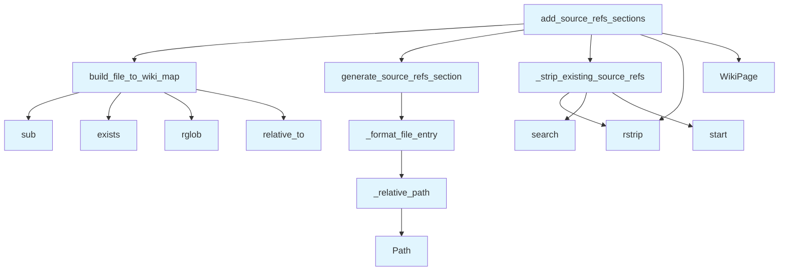

# source_refs.py

## File Overview

This module provides functionality for managing source file references in wiki pages. It handles the generation and addition of "Relevant Source Files" sections that link wiki pages to their corresponding source code files, creating bidirectional references between documentation and code.

## Functions

### build_file_to_wiki_map

Maps source files to their corresponding wiki page paths.

**Parameters:**
- Based on the function name and context, this function likely takes parameters related to pages and file mappings, but the specific signature is not shown in the provided code.

**Returns:**
- Returns a dictionary mapping source file paths to wiki page paths.

### _relative_path

Internal utility function for calculating relative paths between files.

**Parameters:**
- The specific parameters are not shown in the provided code.

**Returns:**
- Returns a relative path string.

### _format_file_entry

Internal utility function for formatting individual file entries in the source references section.

**Parameters:**
- The specific parameters are not shown in the provided code.

**Returns:**
- Returns a formatted string representation of a file entry.

### generate_source_refs_section

Generates a "Relevant Source Files" section for a wiki page.

**Parameters:**
- `source_files` (list[str]): List of source file paths that contributed to this page
- `current_wiki_path` (str): Path of the current wiki page
- `file_to_wiki` (dict[str, str]): Mapping of source files to wiki paths
- `file_line_info` (dict[str, dict[str, int]] | None): Optional mapping of file paths to line info dictionaries
- `max_items` (int): Maximum number of items to include (default: 10)

**Returns:**
- `str | None`: Generated section content as a string, or None if no section should be created

### _strip_existing_source_refs

Internal utility function for removing existing source reference sections from wiki content.

**Parameters:**
- The specific parameters are not shown in the provided code.

**Returns:**
- Returns modified content with existing source references removed.

### add_source_refs_sections

Adds "Relevant Source Files" sections to multiple wiki pages.

**Parameters:**
- `pages` (list[[WikiPage](../models.md)]): List of wiki pages to process
- `page_statuses` (dict[str, [WikiPageStatus](../models.md)]): Dictionary mapping page paths to their status objects, which contain source file information
- `wiki_path` (Path | None): Optional path to wiki directory for finding existing file pages

**Returns:**
- `list[WikiPage]`: List of wiki pages with "Relevant Source Files" sections added

## Usage Examples

```python
from pathlib import Path
from local_deepwiki.generators.source_refs import add_source_refs_sections, generate_source_refs_section

# Add source reference sections to multiple pages
updated_pages = add_source_refs_sections(
    pages=wiki_pages,
    page_statuses=status_dict,
    wiki_path=Path("docs/wiki")
)

# Generate a single source reference section
file_to_wiki_map = {"src/main.py": "wiki/main.md", "src/utils.py": "wiki/utils.md"}
section_content = generate_source_refs_section(
    source_files=["src/main.py", "src/utils.py"],
    current_wiki_path="wiki/overview.md",
    file_to_wiki=file_to_wiki_map,
    max_items=5
)
```

## Related Components

This module works with the following components from the codebase:

- **[WikiPage](../models.md)**: Model class representing individual wiki pages
- **[WikiPageStatus](../models.md)**: Model class containing status information and source file references for pages
- **Path**: Standard library Path class for file system operations

The module uses regular expressions (`re`) for text processing and path manipulation utilities for handling file system paths.

## API Reference

### Functions

#### `build_file_to_wiki_map`

```python
def build_file_to_wiki_map(pages: list[WikiPage], wiki_path: Path | None = None) -> dict[str, str]
```

Build a mapping from source file paths to wiki page paths.


| [Parameter](api_docs.md) | Type | Default | Description |
|-----------|------|---------|-------------|
| `pages` | `list[WikiPage]` | - | List of wiki pages. |
| `wiki_path` | `Path | None` | `None` | Optional path to wiki directory to scan for existing pages. |

**Returns:** `dict[str, str]`


#### `generate_source_refs_section`

```python
def generate_source_refs_section(source_files: list[str], current_wiki_path: str, file_to_wiki: dict[str, str], file_line_info: dict[str, dict[str, int]] | None = None, max_items: int = 10) -> str | None
```

Generate a Relevant Source Files section for a wiki page.


| [Parameter](api_docs.md) | Type | Default | Description |
|-----------|------|---------|-------------|
| `source_files` | `list[str]` | - | List of source file paths that contributed to this page. |
| `current_wiki_path` | `str` | - | Path of the current wiki page. |
| `file_to_wiki` | `dict[str, str]` | - | Mapping of source files to wiki paths. |
| `file_line_info` | `dict[str, dict[str, int]] | None` | `None` | Optional mapping of file paths to line info dicts. |
| `max_items` | `int` | `10` | Maximum number of files to list. |

**Returns:** `str | None`


#### `add_source_refs_sections`

```python
def add_source_refs_sections(pages: list[WikiPage], page_statuses: dict[str, WikiPageStatus], wiki_path: Path | None = None) -> list[WikiPage]
```

Add Relevant Source Files sections to wiki pages.


| [Parameter](api_docs.md) | Type | Default | Description |
|-----------|------|---------|-------------|
| `pages` | `list[WikiPage]` | - | List of wiki pages. |
| `page_statuses` | `dict[str, WikiPageStatus]` | - | Dictionary mapping page paths to their status (with source_files). |
| `wiki_path` | `Path | None` | `None` | Optional path to wiki directory to [find](manifest.md) existing file pages. |

**Returns:** `list[WikiPage]`


## Call Graph



## Usage Examples

*Examples extracted from test files*

### Test that file paths are correctly mapped to wiki paths

From `test_source_refs.py::test_builds_correct_mapping`:

```python
result = build_file_to_wiki_map(pages)

assert result == {
```

### Test with empty pages list

From `test_source_refs.py::test_empty_pages`:

```python
result = build_file_to_wiki_map([])
assert result == {}
```

### Test relative path in same directory

From `test_source_refs.py::test_same_directory`:

```python
result = _relative_path(
    "files/src/local_deepwiki/core/chunker.md",
    "files/src/local_deepwiki/core/parser.md",
)
assert result == "parser.md"
```

### Test relative path to parent directory

From `test_source_refs.py::test_parent_directory`:

```python
result = _relative_path(
    "files/src/local_deepwiki/core/chunker.md",
    "files/src/local_deepwiki/models.md",
)
assert result == "../models.md"
```

### Test generating section for single file with wiki page

From `test_source_refs.py::test_single_file_with_wiki_link`:

```python
result = generate_source_refs_section(
    source_files=["src/local_deepwiki/core/parser.py"],
    current_wiki_path="files/src/local_deepwiki/core/chunker.md",
    file_to_wiki=file_to_wiki,
)

assert result is not None
```

## Relevant Source Files

- `src/local_deepwiki/generators/source_refs.py:14-55`

## See Also

- [models](../models.md) - dependency
- [crosslinks](crosslinks.md) - shares 3 dependencies
- [diagrams](diagrams.md) - shares 3 dependencies
- [see_also](see_also.md) - shares 3 dependencies
