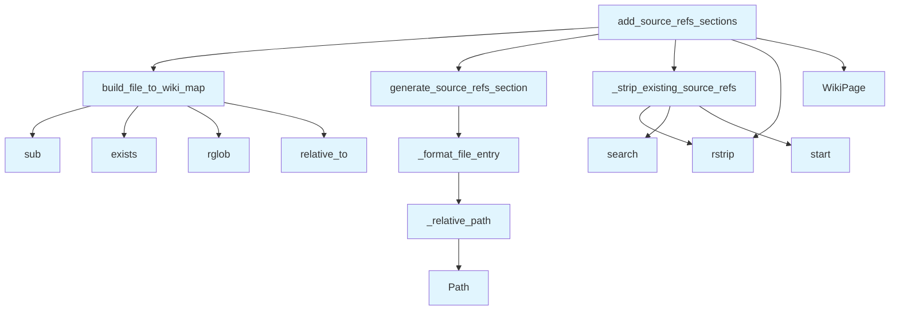

# Source References Generator

## File Overview

The `source_refs.py` module provides functionality for adding "Relevant Source Files" sections to wiki pages. It creates cross-references between wiki pages and the source code files that contributed to their content, helping users navigate from documentation back to the original source code.

## Functions

### add_source_refs_sections

```python
def add_source_refs_sections(
    pages: list[WikiPage],
    page_statuses: dict[str, WikiPageStatus],
    wiki_path: Path | None = None,
) -> list[WikiPage]
```

Adds "Relevant Source Files" sections to wiki pages based on their associated source files.

**Parameters:**
- `pages`: List of [WikiPage](../models.md) objects to process
- `page_statuses`: Dictionary mapping page paths to [WikiPageStatus](../models.md) objects containing source file information
- `wiki_path`: Optional path to wiki directory for finding existing file pages

**Returns:**
- List of [WikiPage](../models.md) objects with "Relevant Source Files" sections added

### generate_source_refs_section

```python
def generate_source_refs_section(
    source_files: list[str],
    current_wiki_path: str,
    file_to_wiki: dict[str, str],
    file_line_info: dict[str, dict[str, int]] | None = None,
    max_items: int = 10,
) -> str | None
```

Generates a "Relevant Source Files" section for a single wiki page.

**Parameters:**
- `source_files`: List of source file paths that contributed to the page
- `current_wiki_path`: Path of the current wiki page being processed
- `file_to_wiki`: Mapping of source file paths to their corresponding wiki page paths
- `file_line_info`: Optional mapping of file paths to line information dictionaries
- `max_items`: Maximum number of items to include in the section (default: 10)

**Returns:**
- String containing the formatted "Relevant Source Files" section, or None if no valid references found

### build_file_to_wiki_map

Creates a mapping between source files and their corresponding wiki pages.

### _relative_path

Calculates relative paths between files for generating proper cross-references.

### _format_file_entry

Formats individual file entries in the source references section.

### _strip_existing_source_refs

Removes existing "Relevant Source Files" sections from wiki page content to avoid duplication.

## Usage Examples

### Basic Usage

```python
from pathlib import Path
from local_deepwiki.models import WikiPage, WikiPageStatus
from local_deepwiki.generators.source_refs import add_source_refs_sections

# Prepare wiki pages and their status information
pages = [WikiPage(...), WikiPage(...)]
page_statuses = {
    "path/to/page.md": WikiPageStatus(...),
    # ... more page statuses
}

# Add source references sections
updated_pages = add_source_refs_sections(
    pages=pages,
    page_statuses=page_statuses,
    wiki_path=Path("wiki")
)
```

### Generating Individual Section

```python
from local_deepwiki.generators.source_refs import generate_source_refs_section

source_files = ["src/module.py", "tests/test_module.py"]
file_to_wiki = {
    "src/module.py": "wiki/module.md",
    "tests/test_module.py": "wiki/test_module.md"
}

section = generate_source_refs_section(
    source_files=source_files,
    current_wiki_path="wiki/overview.md",
    file_to_wiki=file_to_wiki,
    max_items=5
)
```

## Related Components

This module works closely with:

- **[WikiPage](../models.md)**: The primary data model for wiki pages that this module modifies
- **[WikiPageStatus](../models.md)**: Contains metadata about pages including their associated source files
- **Path**: Used for file system operations and path manipulation

The module uses regular expressions (`re`) for text processing and manipulation of existing wiki content.

## API Reference

### Functions

#### `build_file_to_wiki_map`

```python
def build_file_to_wiki_map(pages: list[WikiPage], wiki_path: Path | None = None) -> dict[str, str]
```

Build a mapping from source file paths to wiki page paths.


| [Parameter](api_docs.md) | Type | Default | Description |
|-----------|------|---------|-------------|
| `pages` | `list[WikiPage]` | - | List of wiki pages. |
| `wiki_path` | `Path | None` | `None` | Optional path to wiki directory to scan for existing pages. |

**Returns:** `dict[str, str]`


#### `generate_source_refs_section`

```python
def generate_source_refs_section(source_files: list[str], current_wiki_path: str, file_to_wiki: dict[str, str], file_line_info: dict[str, dict[str, int]] | None = None, max_items: int = 10) -> str | None
```

Generate a Relevant Source Files section for a wiki page.


| [Parameter](api_docs.md) | Type | Default | Description |
|-----------|------|---------|-------------|
| `source_files` | `list[str]` | - | List of source file paths that contributed to this page. |
| `current_wiki_path` | `str` | - | Path of the current wiki page. |
| `file_to_wiki` | `dict[str, str]` | - | Mapping of source files to wiki paths. |
| `file_line_info` | `dict[str, dict[str, int]] | None` | `None` | Optional mapping of file paths to line info dicts. |
| `max_items` | `int` | `10` | Maximum number of files to list. |

**Returns:** `str | None`


#### `add_source_refs_sections`

```python
def add_source_refs_sections(pages: list[WikiPage], page_statuses: dict[str, WikiPageStatus], wiki_path: Path | None = None) -> list[WikiPage]
```

Add Relevant Source Files sections to wiki pages.


| [Parameter](api_docs.md) | Type | Default | Description |
|-----------|------|---------|-------------|
| `pages` | `list[WikiPage]` | - | List of wiki pages. |
| `page_statuses` | `dict[str, WikiPageStatus]` | - | Dictionary mapping page paths to their status (with source_files). |
| `wiki_path` | `Path | None` | `None` | Optional path to wiki directory to [find](manifest.md) existing file pages. |

**Returns:** `list[WikiPage]`


## Call Graph



## Usage Examples

*Examples extracted from test files*

### Test that file paths are correctly mapped to wiki paths

From `test_source_refs.py::test_builds_correct_mapping`:

```python
result = build_file_to_wiki_map(pages)

assert result == {
```

### Test with empty pages list

From `test_source_refs.py::test_empty_pages`:

```python
result = build_file_to_wiki_map([])
assert result == {}
```

### Test relative path in same directory

From `test_source_refs.py::test_same_directory`:

```python
result = _relative_path(
    "files/src/local_deepwiki/core/chunker.md",
    "files/src/local_deepwiki/core/parser.md",
)
assert result == "parser.md"
```

### Test relative path to parent directory

From `test_source_refs.py::test_parent_directory`:

```python
result = _relative_path(
    "files/src/local_deepwiki/core/chunker.md",
    "files/src/local_deepwiki/models.md",
)
assert result == "../models.md"
```

### Test generating section for single file with wiki page

From `test_source_refs.py::test_single_file_with_wiki_link`:

```python
result = generate_source_refs_section(
    source_files=["src/local_deepwiki/core/parser.py"],
    current_wiki_path="files/src/local_deepwiki/core/chunker.md",
    file_to_wiki=file_to_wiki,
)

assert result is not None
```

## Relevant Source Files

- `src/local_deepwiki/generators/source_refs.py:14-55`

## See Also

- [test_source_refs](../../../tests/test_source_refs.md) - uses this
- [wiki](wiki.md) - uses this
- [models](../models.md) - dependency
- [crosslinks](crosslinks.md) - shares 3 dependencies
- [diagrams](diagrams.md) - shares 3 dependencies
