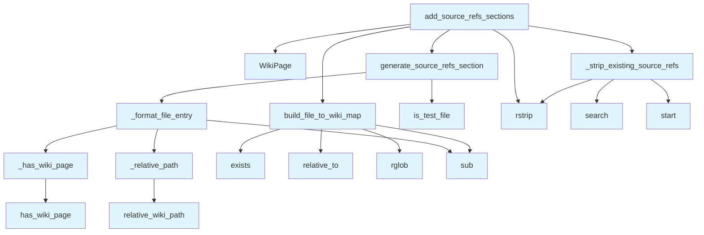

# File: `src/local_deepwiki/generators/source_refs.py`

## File Overview

This module is responsible for generating and inserting a "Relevant Source Files" section into wiki pages. The purpose of this section is to provide readers with direct links to the source code files that were used to generate the documentation for a given wiki page. This enhances traceability and helps users understand the origin of the information.

The module handles mapping source file paths to corresponding wiki page paths, formatting these entries in markdown, and inserting the section into existing wiki content while avoiding duplication.

## Key Concepts

### Mapping Source Files to Wiki Pages

The core abstraction is the `file_to_wiki` mapping, which resolves source file paths (like `src/local_deepwiki/core/chunker.py`) to their corresponding wiki page paths (like `files/src/local_deepwiki/core/chunker.md`). This mapping is built using:

- A list of [`WikiPage`](../export/streaming.md) objects provided during processing.
- An optional scan of a wiki directory for existing `.md` files under a `files/` directory.

This design ensures that both explicitly defined pages and existing wiki files are considered when creating links.

### Lazy Imports for Circular Dependency Avoidance

Two helper functions, `_relative_path` and `_has_wiki_page`, are defined to wrap imports from `local_deepwiki.generators.wiki.utils`. This avoids potential circular import issues by deferring the import until the function is actually called. This pattern is used to keep the module's dependencies clean and prevent runtime errors due to import order.

### Markdown Formatting and Link Generation

The `_format_file_entry` function handles the formatting of individual source file entries. It supports:

- Line number annotations (e.g., `src/file.py:10-20`)
- Local wiki path links using relative paths
- Fallback to plain text for files without corresponding wiki pages

This ensures that the output is consistent and user-friendly, promoting on-site navigation where possible.

### Section Insertion Logic

The `add_source_refs_sections` function orchestrates the process:

- It builds the file-to-wiki map.
- For each page, it retrieves associated source files from `page_statuses`.
- It generates the section content using `generate_source_refs_section`.
- It strips any pre-existing "Relevant Source Files" section to prevent duplication.
- It inserts the new section either before a "See Also" section or at the end of the content.

This ensures that the generated section is cleanly integrated into the existing wiki page structure.

## Integration

This module integrates with the broader `local_deepwiki` system through several key points:

- **Input**: It accepts [`WikiPage`](../export/streaming.md) objects and a `page_statuses` dictionary that contains metadata like `source_files` and `source_line_info`.
- **Dependencies**: It relies on utilities from `local_deepwiki.generators.wiki.utils` for relative path computation and checking for wiki pages, as well as [`is_test_file`](analysis/source_filter.md) to filter out test files.
- **Output**: It returns updated [`WikiPage`](../export/streaming.md) objects with the "Relevant Source Files" section inserted.

It is used by the main CLI or processing pipeline (as indicated by the callers `build_file_to_wiki_map`, `add_source_refs_sections`, etc.) to enrich wiki pages with source file references, improving documentation traceability.

## Design Notes

### Filtering Test Files

Test files are filtered out using [`is_test_file`](analysis/source_filter.md) to prevent broken links, as test files typically do not have corresponding wiki pages.

### Handling Missing Wiki Pages

When a source file does not have an associated wiki page, the module gracefully falls back to displaying just the file path without a link. This avoids broken links while still showing relevant information.

### Section Placement

The module attempts to place the "Relevant Source Files" section before any existing "See Also" section to maintain logical flow. If no "See Also" section exists, it appends the section at the end of the content.

### Maximum Item Limiting

The `generate_source_refs_section` function limits the number of listed files to `max_items` (default 10) to avoid overly long sections. A note is added if the list is truncated to inform users.

### Avoiding Duplicate Sections

The `_strip_existing_source_refs` function ensures that if a wiki page already contains a "Relevant Source Files" section, it is removed before the new one is added. This prevents duplication and ensures clean updates.

### Line Information Support

The module supports including line number information (via `file_line_info`) to provide more precise references, which enhances the utility of the source file listing.

## API Reference

### Functions

#### `build_file_to_wiki_map`

```python
def build_file_to_wiki_map(pages: list[WikiPage], wiki_path: Path | None = None) -> dict[str, str]
```

Build a mapping from source file paths to wiki page paths.


| Parameter | Type | Default | Description |
|-----------|------|---------|-------------|
| `pages` | `list[WikiPage]` | - | List of wiki pages. |
| `wiki_path` | `Path | None` | `None` | Optional path to wiki directory to scan for existing pages. |

**Returns:** `dict[str, str]`


<details>
<summary>View Source (lines 17-58) | <a href="https://github.com/UrbanDiver/local-deepwiki-mcp/blob/main/src/local_deepwiki/generators/source_refs.py#L17-L58">GitHub</a></summary>

```python
def build_file_to_wiki_map(
    pages: list[WikiPage], wiki_path: Path | None = None
) -> dict[str, str]:
    """Build a mapping from source file paths to wiki page paths.

    Args:
        pages: List of wiki pages.
        wiki_path: Optional path to wiki directory to scan for existing pages.

    Returns:
        Dictionary mapping source file path to wiki page path.
    """
    file_to_wiki: dict[str, str] = {}

    # First, add mappings from the pages list
    for page in pages:
        # Wiki paths like "files/src/local_deepwiki/core/chunker.md"
        # correspond to source files like "src/local_deepwiki/core/chunker.py"
        if page.path.startswith("files/"):
            # Remove "files/" prefix and change .md to .py
            source_path = page.path[6:]  # Remove "files/"
            source_path = re.sub(r"\.md$", ".py", source_path)
            file_to_wiki[source_path] = page.path

    # Also scan wiki_path for existing file pages not in the pages list
    if wiki_path and wiki_path.exists():
        files_dir = wiki_path / "files"
        if files_dir.exists():
            for md_file in files_dir.rglob("*.md"):
                # Skip index files
                if md_file.name == "index.md":
                    continue
                # Get relative path from wiki_path
                rel_path = str(md_file.relative_to(wiki_path))
                # Convert to source path
                source_path = rel_path[6:]  # Remove "files/"
                source_path = re.sub(r"\.md$", ".py", source_path)
                # Only add if not already in map
                if source_path not in file_to_wiki:
                    file_to_wiki[source_path] = rel_path

    return file_to_wiki
```

</details>

#### `generate_source_refs_section`

```python
def generate_source_refs_section(source_files: list[str], current_wiki_path: str, file_to_wiki: dict[str, str], file_line_info: dict[str, dict[str, int]] | None = None, max_items: int = 10) -> str | None
```

Generate a Relevant Source Files section for a wiki page.


| Parameter | Type | Default | Description |
|-----------|------|---------|-------------|
| `source_files` | `list[str]` | - | List of source file paths that contributed to this page. |
| `current_wiki_path` | `str` | - | Path of the current wiki page. |
| `file_to_wiki` | `dict[str, str]` | - | Mapping of source files to wiki paths. |
| `file_line_info` | `dict[str, dict[str, int]] | None` | `None` | Optional mapping of file paths to line info dicts. |
| `max_items` | `int` | `10` | Maximum number of files to list. |

**Returns:** `str | None`


<details>
<summary>View Source (lines 115-180) | <a href="https://github.com/UrbanDiver/local-deepwiki-mcp/blob/main/src/local_deepwiki/generators/source_refs.py#L115-L180">GitHub</a></summary>

```python
def generate_source_refs_section(
    source_files: list[str],
    current_wiki_path: str,
    file_to_wiki: dict[str, str],
    file_line_info: dict[str, dict[str, int]] | None = None,
    max_items: int = 10,
) -> str | None:
    """Generate a Relevant Source Files section for a wiki page.

    Args:
        source_files: List of source file paths that contributed to this page.
        current_wiki_path: Path of the current wiki page.
        file_to_wiki: Mapping of source files to wiki paths.
        file_line_info: Optional mapping of file paths to line info dicts.
        max_items: Maximum number of files to list.

    Returns:
        Markdown string for Relevant Source Files section, or None if no files.
    """
    if not source_files:
        return None

    # Filter out test files — they don't get wiki pages so links would break
    source_files = [f for f in source_files if not is_test_file(f)]
    if not source_files:
        return None

    # Filter and limit source files
    files_to_show = source_files[:max_items]

    # For pages with many source files (like overview/architecture),
    # we could show a summary instead
    if len(source_files) > max_items:
        summary_note = f"\n\n*Showing {max_items} of {len(source_files)} source files.*"
    else:
        summary_note = ""

    # Generate markdown
    lines = ["## Relevant Source Files", ""]

    if len(files_to_show) == 1:
        # Single file - simple format
        file_path = files_to_show[0]
        wiki_path = file_to_wiki.get(file_path)
        line_info = file_line_info.get(file_path) if file_line_info else None
        lines.append(
            _format_file_entry(file_path, wiki_path, current_wiki_path, line_info)
        )
    else:
        # Multiple files - list format for overview/module pages
        lines.append(
            "The following source files were used to generate this documentation:"
        )
        lines.append("")

        for file_path in files_to_show:
            wiki_path = file_to_wiki.get(file_path)
            line_info = file_line_info.get(file_path) if file_line_info else None
            lines.append(
                _format_file_entry(file_path, wiki_path, current_wiki_path, line_info)
            )

    if summary_note:
        lines.append(summary_note)

    return "\n".join(lines)
```

</details>

#### `add_source_refs_sections`

```python
def add_source_refs_sections(pages: list[WikiPage], page_statuses: dict[str, WikiPageStatus], wiki_path: Path | None = None) -> list[WikiPage]
```

Add Relevant Source Files sections to wiki pages.


| Parameter | Type | Default | Description |
|-----------|------|---------|-------------|
| `pages` | `list[WikiPage]` | - | List of wiki pages. |
| `page_statuses` | `dict[str, WikiPageStatus]` | - | Dictionary mapping page paths to their status (with source_files). |
| `wiki_path` | `Path | None` | `None` | Optional path to wiki directory to find existing file pages. |

**Returns:** `list[WikiPage]`


<details>
<summary>View Source (lines 216-288) | <a href="https://github.com/UrbanDiver/local-deepwiki-mcp/blob/main/src/local_deepwiki/generators/source_refs.py#L216-L288">GitHub</a></summary>

```python
def add_source_refs_sections(
    pages: list[WikiPage],
    page_statuses: dict[str, WikiPageStatus],
    wiki_path: Path | None = None,
) -> list[WikiPage]:
    """Add Relevant Source Files sections to wiki pages.

    Args:
        pages: List of wiki pages.
        page_statuses: Dictionary mapping page paths to their status (with source_files).
        wiki_path: Optional path to wiki directory to find existing file pages.

    Returns:
        List of wiki pages with Relevant Source Files sections added.
    """
    # Build file to wiki path mapping, including existing pages on disk
    file_to_wiki = build_file_to_wiki_map(pages, wiki_path)

    updated_pages = []
    for page in pages:
        # Get source files for this page
        status = page_statuses.get(page.path)
        if not status or not status.source_files:
            updated_pages.append(page)
            continue

        # Skip index pages (like files/index.md, modules/index.md)
        if page.path.endswith("/index.md") or page.path == "index.md":
            # For top-level index, don't add source refs (too many files)
            updated_pages.append(page)
            continue

        # Generate Relevant Source Files section with line info
        source_refs = generate_source_refs_section(
            status.source_files,
            page.path,
            file_to_wiki,
            file_line_info=status.source_line_info,
        )

        if source_refs:
            # First, strip any existing Relevant Source Files section
            content = _strip_existing_source_refs(page.content.rstrip())

            # Check if there's a See Also section to insert before
            see_also_marker = "\n## See Also"
            if see_also_marker in content:
                # Insert before See Also
                parts = content.split(see_also_marker, 1)
                new_content = (
                    parts[0].rstrip()
                    + "\n\n"
                    + source_refs
                    + "\n"
                    + see_also_marker
                    + parts[1]
                )
            else:
                # Add at end
                new_content = content + "\n\n" + source_refs + "\n"

            updated_pages.append(
                WikiPage(
                    path=page.path,
                    title=page.title,
                    content=new_content,
                    generated_at=page.generated_at,
                )
            )
        else:
            updated_pages.append(page)

    return updated_pages
```

</details>

## Call Graph


```mermaid
flowchart TD
    N0[WikiPage]
    N1[_format_file_entry]
    N2[_has_wiki_page]
    N3[_relative_path]
    N4[_strip_existing_source_refs]
    N5[add_source_refs_sections]
    N6[build_file_to_wiki_map]
    N7[exists]
    N8[generate_source_refs_section]
    N9[has_wiki_page]
    N10[is_test_file]
    N11[relative_to]
    N12[relative_wiki_path]
    N13[rglob]
    N14[rstrip]
    N15[search]
    N16[start]
    N17[sub]
    N6 --> N17
    N6 --> N7
    N6 --> N13
    N6 --> N11
    N3 --> N12
    N2 --> N9
    N1 --> N2
    N1 --> N17
    N1 --> N3
    N8 --> N10
    N8 --> N1
    N4 --> N14
    N4 --> N15
    N4 --> N16
    N5 --> N6
    N5 --> N8
    N5 --> N4
    N5 --> N14
    N5 --> N0
    classDef func fill:#e1f5fe
    class N0,N1,N2,N3,N4,N5,N6,N7,N8,N9,N10,N11,N12,N13,N14,N15,N16,N17 func
```

## Used By

Functions and methods in this file and their callers:

- **[`WikiPage`](../export/streaming.md)**: called by `add_source_refs_sections`
- **`_format_file_entry`**: called by `generate_source_refs_section`
- **`_has_wiki_page`**: called by `_format_file_entry`
- **`_relative_path`**: called by `_format_file_entry`
- **`_strip_existing_source_refs`**: called by `add_source_refs_sections`
- **`build_file_to_wiki_map`**: called by `add_source_refs_sections`
- **`exists`**: called by `build_file_to_wiki_map`
- **`generate_source_refs_section`**: called by `add_source_refs_sections`
- **[`has_wiki_page`](wiki/utils.md)**: called by `_has_wiki_page`
- **[`is_test_file`](analysis/source_filter.md)**: called by `generate_source_refs_section`
- **`relative_to`**: called by `build_file_to_wiki_map`
- **[`relative_wiki_path`](wiki/utils.md)**: called by `_relative_path`
- **`rglob`**: called by `build_file_to_wiki_map`
- **`rstrip`**: called by `_strip_existing_source_refs`, `add_source_refs_sections`
- **`search`**: called by `_strip_existing_source_refs`
- **`start`**: called by `_strip_existing_source_refs`
- **`sub`**: called by `_format_file_entry`, `build_file_to_wiki_map`

## Usage Examples

*Examples extracted from test files*

### Test that file paths are correctly mapped to wiki paths

From `test_source_refs.py::TestBuildFileToWikiMap::test_builds_correct_mapping`:

```python
result = build_file_to_wiki_map(pages)

assert result == {
    "src/local_deepwiki/core/chunker.py": "files/src/local_deepwiki/core/chunker.md",
    "src/local_deepwiki/models.py": "files/src/local_deepwiki/models.md",
}
```

### Test with empty pages list

From `test_source_refs.py::TestBuildFileToWikiMap::test_empty_pages`:

```python
result = build_file_to_wiki_map([])
assert result == {}
```

### Test relative path in same directory

From `test_source_refs.py::TestRelativePath::test_same_directory`:

```python
result = _relative_path(
    "files/src/local_deepwiki/core/chunker.md",
    "files/src/local_deepwiki/core/parser.md",
)
assert result == "parser.md"
```

### Test relative path to parent directory

From `test_source_refs.py::TestRelativePath::test_parent_directory`:

```python
result = _relative_path(
    "files/src/local_deepwiki/core/chunker.md",
    "files/src/local_deepwiki/models.md",
)
assert result == "../models.md"
```

### Test generating section for single file with wiki page

From `test_source_refs.py::TestGenerateSourceRefsSection::test_single_file_with_wiki_link`:

```python
result = generate_source_refs_section(
    source_files=["src/local_deepwiki/core/parser.py"],
    current_wiki_path="files/src/local_deepwiki/core/chunker.md",
    file_to_wiki=file_to_wiki,
)

assert result is not None
assert "## Relevant Source Files" in result
```


## Last Modified

| Entity | Type | Author | Date | Commit |
|--------|------|--------|------|--------|
| `_relative_path` | function | Brian Breidenbach | 2 weeks ago | `52ce097` fix: filter test files from... |
| `_has_wiki_page` | function | Brian Breidenbach | 2 weeks ago | `52ce097` fix: filter test files from... |
| `_format_file_entry` | function | Brian Breidenbach | 2 weeks ago | `52ce097` fix: filter test files from... |
| `generate_source_refs_section` | function | Brian Breidenbach | 2 weeks ago | `52ce097` fix: filter test files from... |
| `build_file_to_wiki_map` | function | Brian Breidenbach | Feb 18, 2026 | `88d5597` fix: make all relevant sour... |
| `add_source_refs_sections` | function | Brian Breidenbach | Feb 18, 2026 | `88d5597` fix: make all relevant sour... |
| `_strip_existing_source_refs` | function | Brian Breidenbach | Jan 16, 2026 | `0d91a70` Apply Python best practices... |

## Additional Source Code

Source code for functions and methods not listed in the API Reference above.

#### `_relative_path`

<details>
<summary>View Source (lines 61-65) | <a href="https://github.com/UrbanDiver/local-deepwiki-mcp/blob/main/src/local_deepwiki/generators/source_refs.py#L61-L65">GitHub</a></summary>

```python
def _relative_path(from_path: str, to_path: str) -> str:
    """Lazy-import wrapper to avoid circular dependency."""
    from local_deepwiki.generators.wiki.utils import relative_wiki_path  # noqa: PLC0415

    return relative_wiki_path(from_path, to_path)
```

</details>


#### `_has_wiki_page`

<details>
<summary>View Source (lines 68-72) | <a href="https://github.com/UrbanDiver/local-deepwiki-mcp/blob/main/src/local_deepwiki/generators/source_refs.py#L68-L72">GitHub</a></summary>

```python
def _has_wiki_page(file_path: str) -> bool:
    """Lazy-import wrapper to avoid circular dependency."""
    from local_deepwiki.generators.wiki.utils import has_wiki_page  # noqa: PLC0415

    return has_wiki_page(file_path)
```

</details>


#### `_format_file_entry`

<details>
<summary>View Source (lines 75-112) | <a href="https://github.com/UrbanDiver/local-deepwiki-mcp/blob/main/src/local_deepwiki/generators/source_refs.py#L75-L112">GitHub</a></summary>

```python
def _format_file_entry(
    file_path: str,
    wiki_path: str | None,
    current_wiki_path: str,
    line_info: dict[str, int] | None = None,
) -> str:
    """Format a single source file entry with optional line numbers.

    Args:
        file_path: Source file path.
        wiki_path: Wiki page path for this file (if exists).
        current_wiki_path: Path of the current wiki page.
        line_info: Optional dict with 'start_line' and 'end_line' keys.

    Returns:
        Formatted markdown list item.
    """
    # Build display text with line numbers if available
    if line_info:
        display = f"`{file_path}:{line_info['start_line']}-{line_info['end_line']}`"
    else:
        display = f"`{file_path}`"

    # Infer wiki path if not in the map (lazy generation will create on demand)
    if wiki_path is None:
        if _has_wiki_page(file_path):
            stem = re.sub(r"\.[^.]+$", "", file_path)
            wiki_path = f"files/{stem}.md"
        else:
            # No wiki page for this file — return plain text, no link
            return f"- {display}"

    # Format the entry - prefer local wiki links to keep users on-site
    if wiki_path != current_wiki_path:
        rel_path = _relative_path(current_wiki_path, wiki_path)
        return f"- [{display}]({rel_path})"
    else:
        return f"- {display}"
```

</details>


#### `_strip_existing_source_refs`

<details>
<summary>View Source (lines 183-213) | <a href="https://github.com/UrbanDiver/local-deepwiki-mcp/blob/main/src/local_deepwiki/generators/source_refs.py#L183-L213">GitHub</a></summary>

```python
def _strip_existing_source_refs(content: str) -> str:
    """Remove any existing Relevant Source Files section from content.

    Args:
        content: Wiki page content.

    Returns:
        Content with Relevant Source Files section removed.
    """
    # Pattern to match the section header and everything until the next ## header or end
    source_refs_marker = "\n## Relevant Source Files"
    if source_refs_marker not in content:
        return content

    # Split on the marker and find where the section ends
    parts = content.split(source_refs_marker)
    if len(parts) < 2:
        return content

    result = parts[0].rstrip()

    # For each subsequent part, find where the next section starts
    for part in parts[1:]:
        # Find the next ## header (if any)
        next_section = re.search(r"\n## ", part)
        if next_section:
            # Keep everything from the next section onwards
            result += part[next_section.start() :]
        # else: section goes to end, discard it

    return result
```

</details>

## Relevant Source Files

- `src/local_deepwiki/generators/source_refs.py:17-58`
