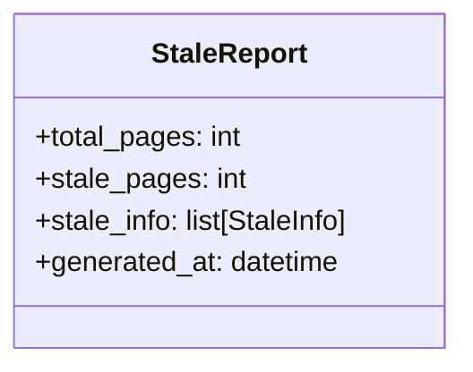
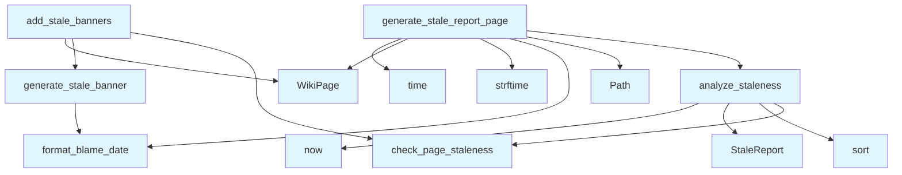

# Stale Detection Module

The stale detection module provides functionality to analyze wiki pages for staleness based on Git history and generate reports about potentially outdated documentation.

## File Overview

This module analyzes the freshness of generated wiki documentation by checking when the underlying source files were last modified using Git blame information. It can generate stale documentation reports and add warning banners to pages that haven't been updated recently.

## Classes

### StaleReport

A dataclass that contains the results of staleness analysis for wiki pages.

## Functions

### analyze_staleness

```python
def analyze_staleness(
    repo_path: Path,
    wiki_status: WikiGenerationStatus,
    stale_threshold_days: int = 0,
) -> StaleReport:
```

Analyzes all wiki pages for staleness by checking the last modification dates of their source files.

**Parameters:**
- `repo_path`: Path to the repository root
- `wiki_status`: Wiki generation status containing page information
- `stale_threshold_days`: Minimum number of days to consider a page stale (defaults to 0)

**Returns:**
- StaleReport containing analysis results with stale page information

### generate_stale_report_page

```python
def generate_stale_report_page(
    repo_path: Path,
    wiki_status: WikiGenerationStatus,
    stale_threshold_days: int = 0,
) -> WikiPage:
```

Generates a wiki page that reports potentially stale documentation.

**Parameters:**
- `repo_path`: Path to the repository root
- `wiki_status`: Wiki generation status containing page information
- `stale_threshold_days`: Minimum number of days to consider a page stale (defaults to 0)

**Returns:**
- [WikiPage](../models.md) containing the stale documentation report

### generate_stale_banner

Generates warning banners for stale pages based on their staleness information.

### add_stale_banners

Adds stale warning banners to wiki pages that exceed the staleness threshold.

## Usage Examples

### Analyzing Page Staleness

```python
from pathlib import Path
from local_deepwiki.generators.stale_detection import analyze_staleness

# Analyze staleness with a 30-day threshold
report = analyze_staleness(
    repo_path=Path("/path/to/repo"),
    wiki_status=wiki_status,
    stale_threshold_days=30
)
```

### Generating a Stale Report Page

```python
from local_deepwiki.generators.stale_detection import generate_stale_report_page

# Generate a report page for stale documentation
stale_page = generate_stale_report_page(
    repo_path=Path("/path/to/repo"),
    wiki_status=wiki_status,
    stale_threshold_days=30
)
```

## Related Components

This module works with several other components:

- **[StaleInfo](../core/git_utils.md)**: Data structure from git_utils containing staleness information
- **[WikiGenerationStatus](../models.md)**: Model tracking the status of wiki page generation
- **[WikiPage](../models.md)**: Model representing individual wiki pages
- **[check_page_staleness](../core/git_utils.md)**: Git utility function for checking page staleness
- **[format_blame_date](../core/git_utils.md)**: Git utility function for formatting blame dates

The module integrates with the Git utilities to determine when source files were last modified and uses the wiki models to generate appropriate reports and banners for stale content.

## API Reference

### class `StaleReport`

Summary of stale documentation analysis.

---


<details>
<summary>View Source (lines 24-30) | <a href="https://github.com/UrbanDiver/local-deepwiki-mcp/blob/[main](../export/pdf.md)/src/local_deepwiki/generators/stale_detection.py#L24-L30">GitHub</a></summary>

```python
class StaleReport:
    """Summary of stale documentation analysis."""

    total_pages: int
    stale_pages: int
    stale_info: list[StaleInfo]
    generated_at: datetime
```

</details>

### Functions

#### `analyze_staleness`

```python
def analyze_staleness(repo_path: Path, wiki_status: WikiGenerationStatus, stale_threshold_days: int = 0) -> StaleReport
```

Analyze all wiki pages for staleness.


| [Parameter](api_docs.md) | Type | Default | Description |
|-----------|------|---------|-------------|
| `repo_path` | `Path` | - | Path to the repository root. |
| `wiki_status` | [`WikiGenerationStatus`](../models.md) | - | Wiki generation status with page info. |
| `stale_threshold_days` | `int` | `0` | Minimum days to consider a page stale. |

**Returns:** `StaleReport`


<details>
<summary>View Source (lines 33-74) | <a href="https://github.com/UrbanDiver/local-deepwiki-mcp/blob/[main](../export/pdf.md)/src/local_deepwiki/generators/stale_detection.py#L33-L74">GitHub</a></summary>

```python
def analyze_staleness(
    repo_path: Path,
    wiki_status: WikiGenerationStatus,
    stale_threshold_days: int = 0,
) -> StaleReport:
    """Analyze all wiki pages for staleness.

    Args:
        repo_path: Path to the repository root.
        wiki_status: Wiki generation status with page info.
        stale_threshold_days: Minimum days to consider a page stale.

    Returns:
        StaleReport with analysis results.
    """
    stale_info: list[StaleInfo] = []

    for page_path, page_status in wiki_status.pages.items():
        # Skip non-file pages (overview, architecture, etc.)
        if not page_path.startswith("files/"):
            continue

        info = check_page_staleness(
            repo_path=repo_path,
            page_path=page_path,
            generated_at=page_status.generated_at,
            source_files=page_status.source_files,
            stale_threshold_days=stale_threshold_days,
        )

        if info:
            stale_info.append(info)

    # Sort by days stale (most stale first)
    stale_info.sort(key=lambda x: x.days_stale, reverse=True)

    return StaleReport(
        total_pages=len([p for p in wiki_status.pages if p.startswith("files/")]),
        stale_pages=len(stale_info),
        stale_info=stale_info,
        generated_at=datetime.now(),
    )
```

</details>

#### `generate_stale_report_page`

```python
def generate_stale_report_page(repo_path: Path, wiki_status: WikiGenerationStatus, stale_threshold_days: int = 0) -> WikiPage
```

Generate a wiki page reporting potentially stale documentation.


| [Parameter](api_docs.md) | Type | Default | Description |
|-----------|------|---------|-------------|
| `repo_path` | `Path` | - | Path to the repository root. |
| `wiki_status` | [`WikiGenerationStatus`](../models.md) | - | Wiki generation status with page info. |
| `stale_threshold_days` | `int` | `0` | Minimum days to consider a page stale. |

**Returns:** [`WikiPage`](../models.md)


<details>
<summary>View Source (lines 77-165) | <a href="https://github.com/UrbanDiver/local-deepwiki-mcp/blob/[main](../export/pdf.md)/src/local_deepwiki/generators/stale_detection.py#L77-L165">GitHub</a></summary>

```python
def generate_stale_report_page(
    repo_path: Path,
    wiki_status: WikiGenerationStatus,
    stale_threshold_days: int = 0,
) -> WikiPage:
    """Generate a wiki page reporting potentially stale documentation.

    Args:
        repo_path: Path to the repository root.
        wiki_status: Wiki generation status with page info.
        stale_threshold_days: Minimum days to consider a page stale.

    Returns:
        WikiPage with the stale documentation report.
    """
    report = analyze_staleness(repo_path, wiki_status, stale_threshold_days)

    lines = [
        "# Documentation Freshness Report",
        "",
        "This page identifies documentation that may be outdated compared to the source code.",
        "Pages are flagged when source files have been modified after the documentation was generated.",
        "",
    ]

    # Summary section
    if report.stale_pages == 0:
        lines.extend([
            "## ✅ All Documentation Up to Date",
            "",
            f"All {report.total_pages} file documentation pages are current with their source code.",
            "",
        ])
    else:
        freshness_pct = ((report.total_pages - report.stale_pages) / report.total_pages * 100) if report.total_pages > 0 else 100
        lines.extend([
            "## Summary",
            "",
            f"| Metric | Value |",
            f"|--------|-------|",
            f"| Total file pages | {report.total_pages} |",
            f"| Potentially stale | {report.stale_pages} |",
            f"| Up to date | {report.total_pages - report.stale_pages} |",
            f"| Freshness | {freshness_pct:.0f}% |",
            "",
        ])

        # Stale pages list
        lines.extend([
            "## ⚠️ Potentially Stale Documentation",
            "",
            "The following pages may need review. Source files were modified after documentation was generated.",
            "",
            "| Page | Days Stale | Last Doc Update | Source Modified |",
            "|------|------------|-----------------|-----------------|",
        ])

        for info in report.stale_info:
            # Create relative link to the page
            page_link = f"[{Path(info.page_path).stem}]({info.page_path})"
            doc_date = format_blame_date(info.generated_at)
            source_date = format_blame_date(info.newest_source_date)

            lines.append(
                f"| {page_link} | {info.days_stale} | {doc_date} | {source_date} |"
            )

        lines.append("")

    # Recommendations section
    lines.extend([
        "## Recommendations",
        "",
        "To refresh stale documentation:",
        "",
        "1. **Re-index the repository** with `force=True` to regenerate all pages",
        "2. **Incremental update** will automatically regenerate pages when source files change",
        "3. **Manual review** may be needed for pages where only comments or docstrings changed",
        "",
        "---",
        f"*Report generated: {report.generated_at.strftime('%Y-%m-%d %H:%M:%S')}*",
    ])

    return WikiPage(
        path="freshness.md",
        title="Documentation Freshness",
        content="\n".join(lines),
        generated_at=time.time(),
    )
```

</details>

#### `generate_stale_banner`

```python
def generate_stale_banner(stale_info: StaleInfo) -> str
```

Generate a warning banner for a stale page.


| [Parameter](api_docs.md) | Type | Default | Description |
|-----------|------|---------|-------------|
| `stale_info` | [`StaleInfo`](../core/git_utils.md) | - | Staleness information for the page. |

**Returns:** `str`


<details>
<summary>View Source (lines 168-184) | <a href="https://github.com/UrbanDiver/local-deepwiki-mcp/blob/[main](../export/pdf.md)/src/local_deepwiki/generators/stale_detection.py#L168-L184">GitHub</a></summary>

```python
def generate_stale_banner(stale_info: StaleInfo) -> str:
    """Generate a warning banner for a stale page.

    Args:
        stale_info: Staleness information for the page.

    Returns:
        Markdown banner string to prepend to the page.
    """
    source_date = format_blame_date(stale_info.newest_source_date)

    return f"""> ⚠️ **Documentation may be outdated**
>
> Source code was modified {source_date} ({stale_info.days_stale} days after this documentation was generated).
> Consider re-indexing to update this page.

"""
```

</details>

#### `add_stale_banners`

```python
def add_stale_banners(pages: list[WikiPage], repo_path: Path, wiki_status: WikiGenerationStatus, stale_threshold_days: int = 1) -> list[WikiPage]
```

Add stale warning banners to pages with outdated documentation.


| [Parameter](api_docs.md) | Type | Default | Description |
|-----------|------|---------|-------------|
| `pages` | `list[WikiPage]` | - | List of wiki pages to process. |
| `repo_path` | `Path` | - | Path to the repository root. |
| `wiki_status` | [`WikiGenerationStatus`](../models.md) | - | Wiki generation status with page info. |
| `stale_threshold_days` | `int` | `1` | Minimum days to show a banner (default: 1). |

**Returns:** `list[WikiPage]`


<details>
<summary>View Source (lines 187-230) | <a href="https://github.com/UrbanDiver/local-deepwiki-mcp/blob/[main](../export/pdf.md)/src/local_deepwiki/generators/stale_detection.py#L187-L230">GitHub</a></summary>

```python
def add_stale_banners(
    pages: list[WikiPage],
    repo_path: Path,
    wiki_status: WikiGenerationStatus,
    stale_threshold_days: int = 1,
) -> list[WikiPage]:
    """Add stale warning banners to pages with outdated documentation.

    Args:
        pages: List of wiki pages to process.
        repo_path: Path to the repository root.
        wiki_status: Wiki generation status with page info.
        stale_threshold_days: Minimum days to show a banner (default: 1).

    Returns:
        List of wiki pages with banners added where appropriate.
    """
    updated_pages: list[WikiPage] = []

    for page in pages:
        page_status = wiki_status.pages.get(page.path)

        if page_status and page.path.startswith("files/"):
            stale_info = check_page_staleness(
                repo_path=repo_path,
                page_path=page.path,
                generated_at=page_status.generated_at,
                source_files=page_status.source_files,
                stale_threshold_days=stale_threshold_days,
            )

            if stale_info:
                banner = generate_stale_banner(stale_info)
                updated_pages.append(WikiPage(
                    path=page.path,
                    title=page.title,
                    content=banner + page.content,
                    generated_at=page.generated_at,
                ))
                continue

        updated_pages.append(page)

    return updated_pages
```

</details>

## Class Diagram



## Call Graph



## Used By

Functions and methods in this file and their callers:

- **`Path`**: called by `generate_stale_report_page`
- **`StaleReport`**: called by `analyze_staleness`
- **[`WikiPage`](../models.md)**: called by `add_stale_banners`, `generate_stale_report_page`
- **`analyze_staleness`**: called by `generate_stale_report_page`
- **[`check_page_staleness`](../core/git_utils.md)**: called by `add_stale_banners`, `analyze_staleness`
- **[`format_blame_date`](../core/git_utils.md)**: called by `generate_stale_banner`, `generate_stale_report_page`
- **`generate_stale_banner`**: called by `add_stale_banners`
- **`now`**: called by `analyze_staleness`
- **`sort`**: called by `analyze_staleness`
- **`strftime`**: called by `generate_stale_report_page`
- **`time`**: called by `generate_stale_report_page`

## Usage Examples

*Examples extracted from test files*

### Test returns a StaleReport with correct counts

From `test_stale_detection.py::TestAnalyzeStaleness::test_returns_report_with_counts`:

```python
assert isinstance(result, StaleReport)
assert result.total_pages == 1  # Only files/ pages are counted
```

### Test returns a StaleReport with correct counts

From `test_stale_detection.py::TestAnalyzeStaleness::test_returns_report_with_counts`:

```python
result = analyze_staleness(tmp_path, wiki_status)

assert isinstance(result, StaleReport)
assert result.total_pages == 1  # Only files/ pages are counted
```

### Test generates a valid WikiPage

From `test_stale_detection.py::TestGenerateStaleReportPage::test_generates_wiki_page`:

```python
wiki_status = WikiGenerationStatus(
    repo_path=str(tmp_path),
    generated_at=time.time(),
    total_pages=1,
    pages={
        "files/test.md": WikiPageStatus(
            path="files/test.md",
            source_files=["test.py"],
            source_hashes={"test.py": "abc123"},
            content_hash="xyz789",
            generated_at=time.time(),
        ),
    },
)

result = generate_stale_report_page(tmp_path, wiki_status)

assert isinstance(result, WikiPage)
assert result.path == "freshness.md"
assert result.title == "Documentation Freshness"
assert "Documentation Freshness Report" in result.content
```

### Test shows success message when all docs are current

From `test_stale_detection.py::TestGenerateStaleReportPage::test_shows_all_up_to_date_when_no_stale`:

```python
wiki_status = WikiGenerationStatus(
    repo_path=str(tmp_path),
    generated_at=time.time(),
    total_pages=0,
    pages={},
)

result = generate_stale_report_page(tmp_path, wiki_status)

assert "All Documentation Up to Date" in result.content
```

### Test generates a markdown warning banner

From `test_stale_detection.py::TestGenerateStaleBanner::test_generates_warning_banner`:

```python
stale_info = StaleInfo(
    page_path="files/test.md",
    generated_at=datetime.now() - timedelta(days=5),
    source_files=["test.py"],
    newest_source_date=datetime.now(),
    days_stale=5,
)

result = generate_stale_banner(stale_info)

assert "⚠️" in result
assert "outdated" in result.lower()
assert "5 days" in result
```

## Relevant Source Files

- `src/local_deepwiki/generators/stale_detection.py:24-30`
