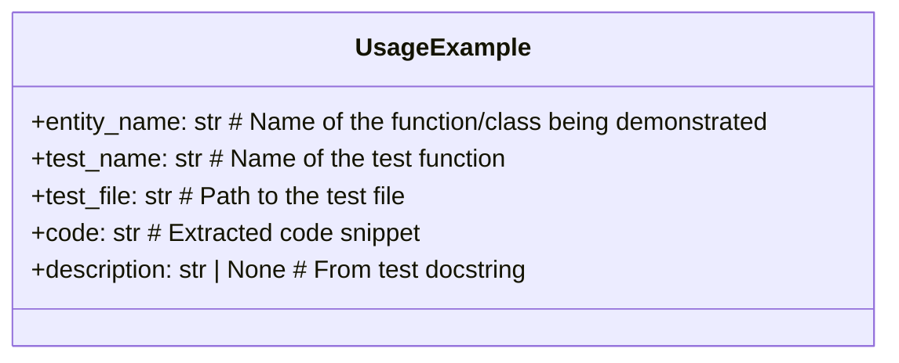
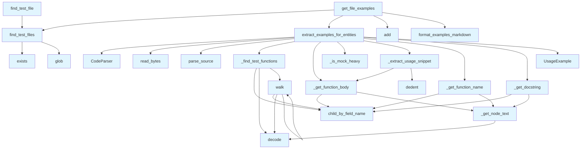

# test_examples.py

## File Overview

This module provides functionality for extracting usage examples from test files to include in documentation. It analyzes test code to [find](manifest.md) examples demonstrating how to use specific functions and classes, then formats them for inclusion in generated documentation.

## Classes

### UsageExample

A data class representing a usage example extracted from a test file.

**Attributes:**
- `entity_name` (str): Name of the function/class being demonstrated
- `test_name` (str): Name of the test function
- `test_file` (str): Path to the test file
- `code` (str): Extracted code snippet
- `description` (str | None): Description from test docstring

## Functions

### extract_examples_for_entities

```python
def extract_examples_for_entities(
    test_file: Path,
    entity_names: list[str],
    max_examples_per_entity: int = 2,
) -> list[UsageExample]:
```

Extracts usage examples from a test file for given entities.

**Parameters:**
- `test_file` (Path): Path to the test file
- `entity_names` (list[str]): Names of functions/classes to [find](manifest.md) examples for
- `max_examples_per_entity` (int): Maximum examples per entity (default: 2)

**Returns:**
- `list[UsageExample]`: List of UsageExample objects

### get_file_examples

```python
def get_file_examples(
    source_file: Path,
    repo_root: Path,
    entity_names: list[str],
    max_examples: int = 5,
) -> str | None:
```

Gets formatted usage examples for a source file. This is the [main](../export/pdf.md) entry point for the wiki generator, searching all matching test files for usage examples.

**Parameters:**
- `source_file` (Path): Path to the source file being documented
- `repo_root` (Path): Root directory of the repository
- `entity_names` (list[str]): Names of functions/classes in the source file
- `max_examples` (int): Maximum examples to include (default: 5)

**Returns:**
- `str | None`: Formatted markdown string containing examples, or None if no examples found

## Usage Examples

### Creating a UsageExample

```python
example = UsageExample()
example.entity_name = "my_function"
example.test_name = "test_my_function_basic"
example.test_file = "/path/to/test_file.py"
example.code = "result = my_function(input_data)"
example.description = "Tests basic functionality"
```

### Extracting Examples from Test Files

```python
from pathlib import Path

test_file = Path("tests/test_module.py")
entities = ["function1", "Class1"]
examples = extract_examples_for_entities(test_file, entities, max_examples_per_entity=3)
```

### Getting Formatted Examples for Documentation

```python
from pathlib import Path

source_file = Path("src/module.py")
repo_root = Path("/project/root")
entity_names = ["my_function", "MyClass"]
markdown_examples = get_file_examples(source_file, repo_root, entity_names, max_examples=10)
```

## Related Components

This module works with:
- [CodeParser](../core/parser.md): Used for parsing test file source code
- Path objects from pathlib for file system operations
- Logger for warning messages during file processing

## API Reference

### class `UsageExample`

A usage example extracted from a test file.

---


<details>
<summary>View Source (lines 22-29) | <a href="https://github.com/UrbanDiver/local-deepwiki-mcp/blob/[main](../export/pdf.md)/src/local_deepwiki/generators/test_examples.py#L22-L29">GitHub</a></summary>

```python
class UsageExample:
    """A usage example extracted from a test file."""

    entity_name: str  # Name of the function/class being demonstrated
    test_name: str  # Name of the test function
    test_file: str  # Path to the test file
    code: str  # Extracted code snippet
    description: str | None  # From test docstring
```

</details>

### Functions

#### `find_test_files`

```python
def find_test_files(source_file: Path, repo_root: Path) -> list[Path]
```

Find all corresponding test files for a source file.  Tries multiple strategies: 1. Direct match: src/.../foo.py -> tests/test_foo.py 2. Coverage tests: src/.../foo.py -> tests/test_foo_coverage.py 3. Suffix variants: tests/test_foo_*.py 4. Alternative naming: tests/foo_test.py


| [Parameter](api_docs.md) | Type | Default | Description |
|-----------|------|---------|-------------|
| `source_file` | `Path` | - | Path to the source file. |
| `repo_root` | `Path` | - | Root directory of the repository. |

**Returns:** `list[Path]`


<details>
<summary>View Source (lines 32-90) | <a href="https://github.com/UrbanDiver/local-deepwiki-mcp/blob/[main](../export/pdf.md)/src/local_deepwiki/generators/test_examples.py#L32-L90">GitHub</a></summary>

```python
def find_test_files(source_file: Path, repo_root: Path) -> list[Path]:
    """Find all corresponding test files for a source file.

    Tries multiple strategies:
    1. Direct match: src/.../foo.py -> tests/test_foo.py
    2. Coverage tests: src/.../foo.py -> tests/test_foo_coverage.py
    3. Suffix variants: tests/test_foo_*.py
    4. Alternative naming: tests/foo_test.py

    Args:
        source_file: Path to the source file.
        repo_root: Root directory of the repository.

    Returns:
        List of test file paths found (may be empty).
    """
    # Get base filename without extension
    base_name = source_file.stem  # e.g., "api_docs"

    # Skip test files themselves
    if base_name.startswith("test_"):
        return []

    test_files: list[Path] = []

    # Common test directories to check
    test_dirs = [
        repo_root / "tests",
        repo_root / "test",
    ]

    for test_dir in test_dirs:
        if not test_dir.exists():
            continue

        # Try direct match: test_<basename>.py
        test_file = test_dir / f"test_{base_name}.py"
        if test_file.exists():
            test_files.append(test_file)

        # Try coverage variant: test_<basename>_coverage.py
        coverage_file = test_dir / f"test_{base_name}_coverage.py"
        if coverage_file.exists():
            test_files.append(coverage_file)

        # Try glob for other variants: test_<basename>_*.py
        for variant in test_dir.glob(f"test_{base_name}_*.py"):
            if variant not in test_files:
                test_files.append(variant)

        # Try alternative naming: <basename>_test.py
        alt_file = test_dir / f"{base_name}_test.py"
        if alt_file.exists() and alt_file not in test_files:
            test_files.append(alt_file)

    if test_files:
        logger.debug(f"Found {len(test_files)} test file(s) for {source_file.name}")

    return test_files
```

</details>

#### `find_test_file`

```python
def find_test_file(source_file: Path, repo_root: Path) -> Path | None
```

Find the corresponding test file for a source file.  Legacy function for backwards compatibility. Returns the first test file found, or None.


| [Parameter](api_docs.md) | Type | Default | Description |
|-----------|------|---------|-------------|
| `source_file` | `Path` | - | Path to the source file. |
| `repo_root` | `Path` | - | Root directory of the repository. |

**Returns:** `Path | None`


<details>
<summary>View Source (lines 93-107) | <a href="https://github.com/UrbanDiver/local-deepwiki-mcp/blob/[main](../export/pdf.md)/src/local_deepwiki/generators/test_examples.py#L93-L107">GitHub</a></summary>

```python
def find_test_file(source_file: Path, repo_root: Path) -> Path | None:
    """Find the corresponding test file for a source file.

    Legacy function for backwards compatibility.
    Returns the first test file found, or None.

    Args:
        source_file: Path to the source file.
        repo_root: Root directory of the repository.

    Returns:
        Path to the test file if found, None otherwise.
    """
    test_files = find_test_files(source_file, repo_root)
    return test_files[0] if test_files else None
```

</details>

#### `walk`

```python
def walk(node: Node, current_class: str | None = None) -> None
```


| [Parameter](api_docs.md) | Type | Default | Description |
|-----------|------|---------|-------------|
| `node` | `Node` | - | - |
| `current_class` | `str | None` | `None` | - |

**Returns:** `None`


<details>
<summary>View Source (lines 129-151) | <a href="https://github.com/UrbanDiver/local-deepwiki-mcp/blob/[main](../export/pdf.md)/src/local_deepwiki/generators/test_examples.py#L129-L151">GitHub</a></summary>

```python
def walk(node: Node, current_class: str | None = None) -> None:
        if node.type == "class_definition":
            # Get class name
            name_node = node.child_by_field_name("name")
            if name_node:
                class_name = name_node.text.decode("utf-8") if name_node.text else ""
                # Check if it's a test class
                if class_name.startswith("Test"):
                    # Walk children with this class context
                    for child in node.children:
                        walk(child, class_name)
                    return

        if node.type == "function_definition":
            # Get the function name
            name_node = node.child_by_field_name("name")
            if name_node:
                name = name_node.text.decode("utf-8") if name_node.text else ""
                if name.startswith("test_"):
                    test_functions.append((node, current_class))

        for child in node.children:
            walk(child, current_class)
```

</details>

#### `extract_examples_for_entities`

```python
def extract_examples_for_entities(test_file: Path, entity_names: list[str], max_examples_per_entity: int = 2) -> list[UsageExample]
```

Extract usage examples from a test file for given entities.


| [Parameter](api_docs.md) | Type | Default | Description |
|-----------|------|---------|-------------|
| `test_file` | `Path` | - | Path to the test file. |
| `entity_names` | `list[str]` | - | Names of functions/classes to [find](manifest.md) examples for. |
| `max_examples_per_entity` | `int` | `2` | Maximum examples per entity. |

**Returns:** `list[UsageExample]`


<details>
<summary>View Source (lines 315-383) | <a href="https://github.com/UrbanDiver/local-deepwiki-mcp/blob/[main](../export/pdf.md)/src/local_deepwiki/generators/test_examples.py#L315-L383">GitHub</a></summary>

```python
def extract_examples_for_entities(
    test_file: Path,
    entity_names: list[str],
    max_examples_per_entity: int = 2,
) -> list[UsageExample]:
    """Extract usage examples from a test file for given entities.

    Args:
        test_file: Path to the test file.
        entity_names: Names of functions/classes to find examples for.
        max_examples_per_entity: Maximum examples per entity.

    Returns:
        List of UsageExample objects.
    """
    parser = CodeParser()

    try:
        source = test_file.read_bytes()
    except (OSError, IOError) as e:
        logger.warning(f"Failed to read test file {test_file}: {e}")
        return []

    root = parser.parse_source(source, Language.PYTHON)

    test_functions = _find_test_functions(root)
    examples: list[UsageExample] = []
    entity_counts: dict[str, int] = {}

    for func_node, class_name in test_functions:
        body = _get_function_body(func_node, source)

        # Skip mock-heavy tests
        if _is_mock_heavy(body):
            continue

        for entity_name in entity_names:
            # Check if we've hit the limit for this entity
            if entity_counts.get(entity_name, 0) >= max_examples_per_entity:
                continue

            # Check if entity is used in this test
            if entity_name not in body:
                continue

            # Extract the usage snippet
            snippet = _extract_usage_snippet(func_node, source, entity_name)
            if not snippet or len(snippet) < 10:
                continue

            test_name = _get_function_name(func_node, source)
            docstring = _get_docstring(func_node, source)

            # Format test name with class if from a test class
            full_test_name = f"{class_name}::{test_name}" if class_name else test_name

            examples.append(
                UsageExample(
                    entity_name=entity_name,
                    test_name=full_test_name,
                    test_file=str(test_file.name),
                    code=snippet,
                    description=docstring,
                )
            )

            entity_counts[entity_name] = entity_counts.get(entity_name, 0) + 1

    return examples
```

</details>

#### `format_examples_markdown`

```python
def format_examples_markdown(examples: list[UsageExample], max_examples: int = 5) -> str
```

Format usage examples as markdown.


| [Parameter](api_docs.md) | Type | Default | Description |
|-----------|------|---------|-------------|
| `examples` | `list[UsageExample]` | - | List of UsageExample objects. |
| `max_examples` | `int` | `5` | Maximum examples to include. |

**Returns:** `str`


<details>
<summary>View Source (lines 386-420) | <a href="https://github.com/UrbanDiver/local-deepwiki-mcp/blob/[main](../export/pdf.md)/src/local_deepwiki/generators/test_examples.py#L386-L420">GitHub</a></summary>

```python
def format_examples_markdown(
    examples: list[UsageExample],
    max_examples: int = 5,
) -> str:
    """Format usage examples as markdown.

    Args:
        examples: List of UsageExample objects.
        max_examples: Maximum examples to include.

    Returns:
        Formatted markdown string.
    """
    if not examples:
        return ""

    # Limit total examples
    examples = examples[:max_examples]

    sections = ["## Usage Examples\n"]
    sections.append("*Examples extracted from test files*\n")

    for example in examples:
        # Use docstring as title if available, otherwise use entity name
        if example.description:
            # Clean up docstring for use as title
            title = example.description.split("\n")[0].strip(".")
            sections.append(f"### {title}\n")
        else:
            sections.append(f"### Example: `{example.entity_name}`\n")

        sections.append(f"From `{example.test_file}::{example.test_name}`:\n")
        sections.append(f"```python\n{example.code}\n```\n")

    return "\n".join(sections)
```

</details>

#### `get_file_examples`

```python
def get_file_examples(source_file: Path, repo_root: Path, entity_names: list[str], max_examples: int = 5) -> str | None
```

Get formatted usage examples for a source file.  This is the [main](../export/pdf.md) entry point for the wiki generator. Searches all matching test files for usage examples.


| [Parameter](api_docs.md) | Type | Default | Description |
|-----------|------|---------|-------------|
| `source_file` | `Path` | - | Path to the source file being documented. |
| `repo_root` | `Path` | - | Root directory of the repository. |
| `entity_names` | `list[str]` | - | Names of functions/classes in the source file. |
| `max_examples` | `int` | `5` | Maximum examples to include. |

**Returns:** `str | None`


<details>
<summary>View Source (lines 423-484) | <a href="https://github.com/UrbanDiver/local-deepwiki-mcp/blob/[main](../export/pdf.md)/src/local_deepwiki/generators/test_examples.py#L423-L484">GitHub</a></summary>

```python
def get_file_examples(
    source_file: Path,
    repo_root: Path,
    entity_names: list[str],
    max_examples: int = 5,
) -> str | None:
    """Get formatted usage examples for a source file.

    This is the main entry point for the wiki generator.
    Searches all matching test files for usage examples.

    Args:
        source_file: Path to the source file being documented.
        repo_root: Root directory of the repository.
        entity_names: Names of functions/classes in the source file.
        max_examples: Maximum examples to include.

    Returns:
        Formatted markdown string with examples, or None if no examples found.
    """
    # Only support Python for now
    if not source_file.suffix == ".py":
        return None

    # Find all corresponding test files
    test_files = find_test_files(source_file, repo_root)
    if not test_files:
        logger.debug(f"No test files found for {source_file}")
        return None

    # Filter to meaningful entity names (skip short ones)
    entity_names = [name for name in entity_names if name and len(name) > 2]
    if not entity_names:
        return None

    # Extract examples from all test files
    all_examples: list[UsageExample] = []
    for test_file in test_files:
        examples = extract_examples_for_entities(
            test_file=test_file,
            entity_names=entity_names,
            max_examples_per_entity=2,
        )
        all_examples.extend(examples)

    if not all_examples:
        logger.debug(f"No examples found in {len(test_files)} test file(s)")
        return None

    # Deduplicate by entity_name + code (same example from different sources)
    seen: set[tuple[str, str]] = set()
    unique_examples: list[UsageExample] = []
    for ex in all_examples:
        key = (ex.entity_name, ex.code)
        if key not in seen:
            seen.add(key)
            unique_examples.append(ex)

    test_names = [tf.name for tf in test_files]
    logger.info(f"Found {len(unique_examples)} usage examples from {', '.join(test_names)}")

    return format_examples_markdown(unique_examples, max_examples=max_examples)
```

</details>

## Class Diagram



## Call Graph



## Used By

Functions and methods in this file and their callers:

- **[`CodeParser`](../core/parser.md)**: called by `extract_examples_for_entities`
- **`UsageExample`**: called by `extract_examples_for_entities`
- **`_extract_usage_snippet`**: called by `extract_examples_for_entities`
- **`_find_test_functions`**: called by `extract_examples_for_entities`
- **`_get_docstring`**: called by `extract_examples_for_entities`
- **`_get_function_body`**: called by `_extract_usage_snippet`, `extract_examples_for_entities`
- **`_get_function_name`**: called by `extract_examples_for_entities`
- **`_get_node_text`**: called by `_get_docstring`, `_get_function_body`, `_get_function_name`
- **`_is_mock_heavy`**: called by `extract_examples_for_entities`
- **`add`**: called by `get_file_examples`
- **`child_by_field_name`**: called by `_find_test_functions`, `_get_docstring`, `_get_function_body`, `_get_function_name`, `walk`
- **`decode`**: called by `_find_test_functions`, `_get_node_text`, `walk`
- **`dedent`**: called by `_extract_usage_snippet`
- **`exists`**: called by `find_test_files`
- **`extract_examples_for_entities`**: called by `get_file_examples`
- **`find_test_files`**: called by `find_test_file`, `get_file_examples`
- **`format_examples_markdown`**: called by `get_file_examples`
- **`glob`**: called by `find_test_files`
- **`parse_source`**: called by `extract_examples_for_entities`
- **`read_bytes`**: called by `extract_examples_for_entities`
- **`walk`**: called by `_find_test_functions`, `walk`

## Last Modified

| Entity | Type | Author | Date | Commit |
|--------|------|--------|------|--------|
| `find_test_files` | function | Brian Breidenbach | today | `216880e` Expand test example extract... |
| `find_test_file` | function | Brian Breidenbach | today | `216880e` Expand test example extract... |
| `_find_test_functions` | function | Brian Breidenbach | today | `216880e` Expand test example extract... |
| `walk` | function | Brian Breidenbach | today | `216880e` Expand test example extract... |
| `_extract_usage_snippet` | function | Brian Breidenbach | today | `216880e` Expand test example extract... |
| `extract_examples_for_entities` | function | Brian Breidenbach | today | `216880e` Expand test example extract... |
| `get_file_examples` | function | Brian Breidenbach | today | `216880e` Expand test example extract... |
| `UsageExample` | class | Brian Breidenbach | 2 days ago | `e579b0a` Add usage examples from tes... |
| `_get_node_text` | function | Brian Breidenbach | 2 days ago | `e579b0a` Add usage examples from tes... |
| `_get_function_name` | function | Brian Breidenbach | 2 days ago | `e579b0a` Add usage examples from tes... |
| `_get_docstring` | function | Brian Breidenbach | 2 days ago | `e579b0a` Add usage examples from tes... |
| `_get_function_body` | function | Brian Breidenbach | 2 days ago | `e579b0a` Add usage examples from tes... |
| `_is_mock_heavy` | function | Brian Breidenbach | 2 days ago | `e579b0a` Add usage examples from tes... |
| `format_examples_markdown` | function | Brian Breidenbach | 2 days ago | `e579b0a` Add usage examples from tes... |

## Additional Source Code

Source code for functions and methods not listed in the API Reference above.

#### `_get_node_text`

<details>
<summary>View Source (lines 110-112) | <a href="https://github.com/UrbanDiver/local-deepwiki-mcp/blob/[main](../export/pdf.md)/src/local_deepwiki/generators/test_examples.py#L110-L112">GitHub</a></summary>

```python
def _get_node_text(node: Node, source: bytes) -> str:
    """Get the text content of a tree-sitter node."""
    return source[node.start_byte : node.end_byte].decode("utf-8")
```

</details>


#### `_find_test_functions`

<details>
<summary>View Source (lines 115-154) | <a href="https://github.com/UrbanDiver/local-deepwiki-mcp/blob/[main](../export/pdf.md)/src/local_deepwiki/generators/test_examples.py#L115-L154">GitHub</a></summary>

```python
def _find_test_functions(root: Node) -> list[tuple[Node, str | None]]:
    """Find all test function definitions in the AST.

    Finds both standalone test functions and test methods in test classes.

    Args:
        root: Root node of the parsed test file.

    Returns:
        List of (function_definition_node, class_name) tuples.
        class_name is None for standalone functions.
    """
    test_functions: list[tuple[Node, str | None]] = []

    def walk(node: Node, current_class: str | None = None) -> None:
        if node.type == "class_definition":
            # Get class name
            name_node = node.child_by_field_name("name")
            if name_node:
                class_name = name_node.text.decode("utf-8") if name_node.text else ""
                # Check if it's a test class
                if class_name.startswith("Test"):
                    # Walk children with this class context
                    for child in node.children:
                        walk(child, class_name)
                    return

        if node.type == "function_definition":
            # Get the function name
            name_node = node.child_by_field_name("name")
            if name_node:
                name = name_node.text.decode("utf-8") if name_node.text else ""
                if name.startswith("test_"):
                    test_functions.append((node, current_class))

        for child in node.children:
            walk(child, current_class)

    walk(root)
    return test_functions
```

</details>


#### `_get_function_name`

<details>
<summary>View Source (lines 157-162) | <a href="https://github.com/UrbanDiver/local-deepwiki-mcp/blob/[main](../export/pdf.md)/src/local_deepwiki/generators/test_examples.py#L157-L162">GitHub</a></summary>

```python
def _get_function_name(func_node: Node, source: bytes) -> str:
    """Get the name of a function from its AST node."""
    name_node = func_node.child_by_field_name("name")
    if name_node:
        return _get_node_text(name_node, source)
    return "unknown"
```

</details>


#### `_get_docstring`

<details>
<summary>View Source (lines 165-183) | <a href="https://github.com/UrbanDiver/local-deepwiki-mcp/blob/[main](../export/pdf.md)/src/local_deepwiki/generators/test_examples.py#L165-L183">GitHub</a></summary>

```python
def _get_docstring(func_node: Node, source: bytes) -> str | None:
    """Extract docstring from a function node if present."""
    body = func_node.child_by_field_name("body")
    if not body or not body.children:
        return None

    # First statement in body might be a docstring
    first_stmt = body.children[0]
    if first_stmt.type == "expression_statement":
        expr = first_stmt.children[0] if first_stmt.children else None
        if expr and expr.type == "string":
            docstring = _get_node_text(expr, source)
            # Clean up the docstring
            docstring = docstring.strip("\"'")
            if docstring.startswith('""'):
                docstring = docstring[2:-2] if docstring.endswith('""') else docstring[2:]
            return docstring.strip()

    return None
```

</details>


#### `_get_function_body`

<details>
<summary>View Source (lines 186-191) | <a href="https://github.com/UrbanDiver/local-deepwiki-mcp/blob/[main](../export/pdf.md)/src/local_deepwiki/generators/test_examples.py#L186-L191">GitHub</a></summary>

```python
def _get_function_body(func_node: Node, source: bytes) -> str:
    """Get the body of a function as a string."""
    body = func_node.child_by_field_name("body")
    if body:
        return _get_node_text(body, source)
    return ""
```

</details>


#### `_is_mock_heavy`

<details>
<summary>View Source (lines 194-209) | <a href="https://github.com/UrbanDiver/local-deepwiki-mcp/blob/[main](../export/pdf.md)/src/local_deepwiki/generators/test_examples.py#L194-L209">GitHub</a></summary>

```python
def _is_mock_heavy(body: str) -> bool:
    """Check if a test body uses mocking extensively.

    We want to exclude heavily mocked tests as they don't show
    real usage patterns.
    """
    mock_indicators = [
        "MagicMock",
        "AsyncMock",
        "@patch",
        "patch(",
        "mock_",
        "mocker.",
    ]
    mock_count = sum(1 for indicator in mock_indicators if indicator in body)
    return mock_count >= 2
```

</details>


#### `_extract_usage_snippet`

<details>
<summary>View Source (lines 212-312) | <a href="https://github.com/UrbanDiver/local-deepwiki-mcp/blob/[main](../export/pdf.md)/src/local_deepwiki/generators/test_examples.py#L212-L312">GitHub</a></summary>

```python
def _extract_usage_snippet(
    func_node: Node,
    source: bytes,
    entity_name: str,
    max_lines: int = 25,
) -> str | None:
    """Extract a clean usage snippet from a test function.

    Looks for code that demonstrates usage of the entity,
    including setup, the call, and assertions.

    Args:
        func_node: The function AST node.
        source: Source code bytes.
        entity_name: Name of the entity to find usage of.
        max_lines: Maximum lines to include.

    Returns:
        Extracted code snippet or None if not suitable.
    """
    body = _get_function_body(func_node, source)
    lines = body.split("\n")

    # Skip the docstring if present
    start_idx = 0
    in_docstring = False
    for i, line in enumerate(lines):
        stripped = line.strip()
        if not stripped:
            continue
        # Detect docstring boundaries
        if stripped.startswith(('"""', "'''")):
            if in_docstring:
                in_docstring = False
                continue
            # Check for single-line docstring
            if stripped.count('"""') >= 2 or stripped.count("'''") >= 2:
                continue
            in_docstring = True
            continue
        if in_docstring:
            continue
        start_idx = i
        break

    lines = lines[start_idx:]

    # Find lines relevant to the entity
    relevant_lines: list[str] = []
    capturing = False
    dedent_block = False
    paren_depth = 0
    assertions_found = 0

    for line in lines:
        stripped = line.strip()

        # Track parentheses for multi-line calls
        paren_depth += line.count("(") - line.count(")")

        # Start capturing when we see dedent (common test pattern) or the entity
        if "dedent(" in line or 'dedent("""' in line:
            dedent_block = True
            capturing = True

        if entity_name in line and not capturing:
            capturing = True

        if capturing:
            relevant_lines.append(line)

            # Track assertions to capture a complete test
            if stripped.startswith("assert") and paren_depth <= 0:
                assertions_found += 1
                # Allow up to 2 assertions for better context
                if assertions_found >= 2:
                    break

            if len(relevant_lines) >= max_lines:
                break

        # End dedent block
        if dedent_block and '"""' in line and len(relevant_lines) > 1:
            dedent_block = False

    if not relevant_lines:
        return None

    # For short tests, include the full body (more useful)
    if len(relevant_lines) < 5 and len(lines) <= max_lines:
        result = "\n".join(lines)
    else:
        result = "\n".join(relevant_lines)

    # Clean up indentation
    try:
        result = dedent(result)
    except TypeError:
        pass

    return result.strip()
```

</details>

## Relevant Source Files

- `src/local_deepwiki/generators/test_examples.py:22-29`

## See Also

- [models](../models.md) - dependency
- [logging](../logging.md) - dependency
- [chunker](../core/chunker.md) - shares 5 dependencies
- [api_docs](api_docs.md) - shares 5 dependencies

## See Also

- [logging](../logging.md) - dependency
- [chunker](../core/chunker.md) - shares 5 dependencies
- [api_docs](api_docs.md) - shares 5 dependencies
