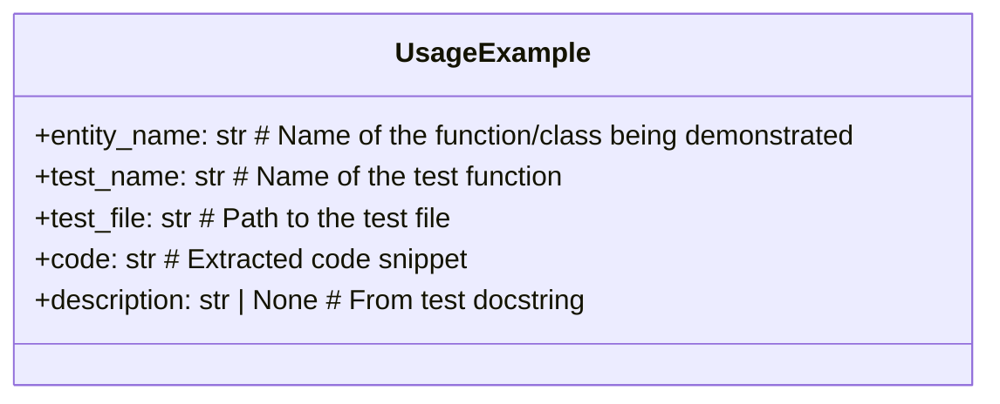
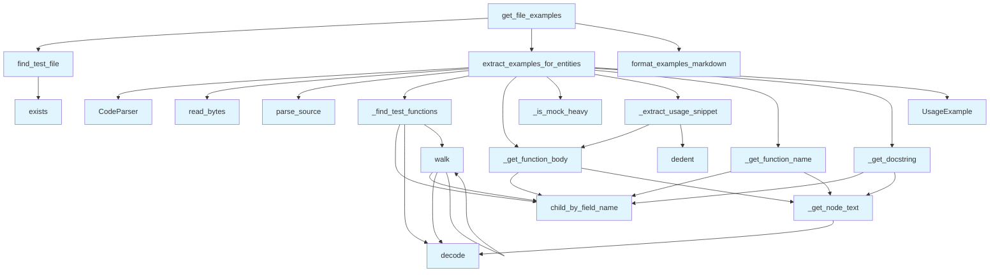

# test_examples.py

## File Overview

This module provides functionality for extracting usage examples from test files to enhance documentation. It parses test code to identify meaningful usage patterns and converts them into documentation-ready examples, while filtering out mock-heavy or low-value test code.

## Classes

### UsageExample

A dataclass that represents a usage example extracted from test code.

**Purpose**: Stores structured information about a code usage example, including the source function name, extracted code snippet, and descriptive text.

## Functions

### find_test_file

Locates the corresponding test file for a given source file.

**Parameters**:
- Takes a file path parameter to [find](manifest.md) the associated test file

**Returns**: Path to the test file if found

### _get_node_text

Extracts text content from a tree-sitter syntax tree node.

**Parameters**:
- `node`: Tree-sitter Node object

**Returns**: String content of the node

### _find_test_functions

Identifies test functions within parsed code.

**Parameters**: 
- Accepts parsed code structure to analyze

**Returns**: Collection of test function nodes

### walk

Traverses code structures, likely for syntax tree navigation.

**Parameters**:
- Takes a node or code structure to [traverse](manifest.md)

### _get_function_name

Extracts the name of a function from its syntax tree representation.

**Parameters**:
- Function node from syntax tree

**Returns**: String name of the function

### _get_docstring

Retrieves the docstring from a function node.

**Parameters**:
- Function node containing potential docstring

**Returns**: Docstring text if present

### _get_function_body

Extracts the body content of a function.

**Parameters**:
- Function node from syntax tree

**Returns**: Function body as text

### _is_mock_heavy

Determines if a code snippet contains excessive mocking that would make it unsuitable as a usage example.

**Parameters**:
- Code snippet to analyze

**Returns**: Boolean indicating if the code is mock-heavy

### _extract_usage_snippet

Processes function body text to extract meaningful usage examples.

**Parameters**:
- Function body text to process

**Returns**: Cleaned usage snippet suitable for documentation

### extract_examples_for_entities

Main function that extracts usage examples for specified code entities from their test files.

**Parameters**:
- Entity information to [find](manifest.md) examples for

**Returns**: Collection of UsageExample objects

### format_examples_markdown

Converts usage examples into markdown format for documentation.

**Parameters**:
- Collection of UsageExample objects

**Returns**: Formatted markdown string

### get_file_examples

Retrieves all usage examples from a specific file.

**Parameters**:
- File path to extract examples from

**Returns**: Examples found in the specified file

## Related Components

This module integrates with several other components:

- **[CodeParser](../core/parser.md)**: Used for parsing source code files to extract syntax information
- **[Language](../models.md)**: Enum for handling different programming language types
- **Logger**: Provides logging functionality through the [`get_logger`](../logging.md) function
- **Tree-sitter**: External library for syntax tree parsing and code analysis

The module works primarily with Python files but is designed to work within a language-agnostic parsing framework.

## API Reference

### class `UsageExample`

A usage example extracted from a test file.

---

### Functions

#### `find_test_file`

```python
def find_test_file(source_file: Path, repo_root: Path) -> Path | None
```

Find the corresponding test file for a source file.  Tries multiple strategies: 1. Direct match: src/.../foo.py -> tests/test_foo.py 2. Nested match: src/pkg/mod/foo.py -> tests/test_foo.py


| [Parameter](api_docs.md) | Type | Default | Description |
|-----------|------|---------|-------------|
| `source_file` | `Path` | - | Path to the source file. |
| `repo_root` | `Path` | - | Root directory of the repository. |

**Returns:** `Path | None`


#### `walk`

```python
def walk(node: Node) -> None
```


| [Parameter](api_docs.md) | Type | Default | Description |
|-----------|------|---------|-------------|
| `node` | `Node` | - | - |

**Returns:** `None`


#### `extract_examples_for_entities`

```python
def extract_examples_for_entities(test_file: Path, entity_names: list[str], max_examples_per_entity: int = 2) -> list[UsageExample]
```

Extract usage examples from a test file for given entities.


| [Parameter](api_docs.md) | Type | Default | Description |
|-----------|------|---------|-------------|
| `test_file` | `Path` | - | Path to the test file. |
| `entity_names` | `list[str]` | - | Names of functions/classes to [find](manifest.md) examples for. |
| `max_examples_per_entity` | `int` | `2` | Maximum examples per entity. |

**Returns:** `list[UsageExample]`


#### `format_examples_markdown`

```python
def format_examples_markdown(examples: list[UsageExample], max_examples: int = 5) -> str
```

Format usage examples as markdown.


| [Parameter](api_docs.md) | Type | Default | Description |
|-----------|------|---------|-------------|
| `examples` | `list[UsageExample]` | - | List of UsageExample objects. |
| `max_examples` | `int` | `5` | Maximum examples to include. |

**Returns:** `str`


#### `get_file_examples`

```python
def get_file_examples(source_file: Path, repo_root: Path, entity_names: list[str], max_examples: int = 5) -> str | None
```

Get formatted usage examples for a source file.  This is the [main](../export/html.md) entry point for the wiki generator.


| [Parameter](api_docs.md) | Type | Default | Description |
|-----------|------|---------|-------------|
| `source_file` | `Path` | - | Path to the source file being documented. |
| `repo_root` | `Path` | - | Root directory of the repository. |
| `entity_names` | `list[str]` | - | Names of functions/classes in the source file. |
| `max_examples` | `int` | `5` | Maximum examples to include. |

**Returns:** `str | None`


## Class Diagram



## Call Graph



## Relevant Source Files

- `src/local_deepwiki/generators/test_examples.py:22-29`

## See Also

- [test_test_examples](../../../tests/test_test_examples.md) - uses this
- [wiki](wiki.md) - uses this
- [models](../models.md) - dependency
- [logging](../logging.md) - dependency
- [chunker](../core/chunker.md) - shares 5 dependencies
