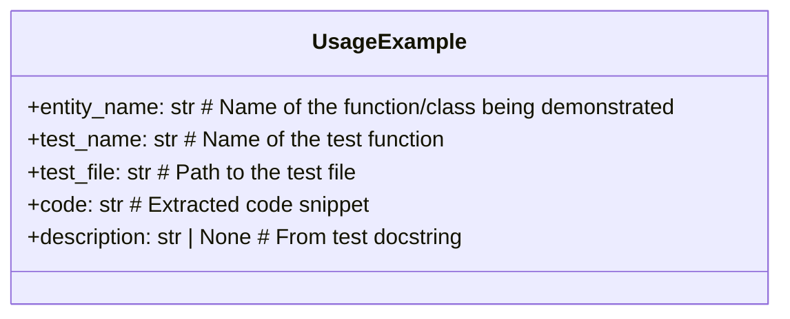
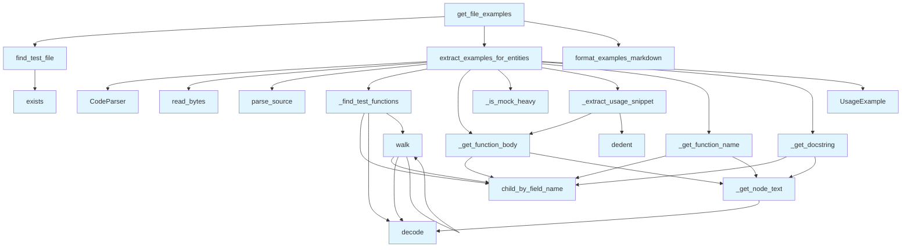

# Test Examples Generator

## File Overview

The `test_examples.py` module provides functionality to extract usage examples from test files to enhance documentation generation. It analyzes test code to [find](manifest.md) practical examples of how functions and classes are used, then formats these examples for inclusion in documentation.

## Classes

### UsageExample

A dataclass that represents a usage example extracted from test code.

```python
@dataclass
class UsageExample:
    # Structure based on dataclass definition in the code
```

## Functions

### find_test_file

Locates the corresponding test file for a given source file.

**Parameters:**
- Takes a source file path as input

**Returns:**
- Path to the corresponding test file

### extract_examples_for_entities

Extracts usage examples for specific code entities from test files.

**Parameters:**
- Accepts entities to [find](manifest.md) examples for

**Returns:**
- Collection of usage examples for the specified entities

### format_examples_markdown

Formats extracted usage examples into markdown format for documentation.

**Parameters:**
- Takes usage examples as input

**Returns:**
- Markdown-formatted string containing the examples

### get_file_examples

Retrieves all usage examples from a specific file.

**Parameters:**
- File path to extract examples from

**Returns:**
- Collection of usage examples found in the file

## Internal Helper Functions

The module includes several internal helper functions for processing test code:

- **_get_node_text**: Extracts text content from tree-sitter nodes
- **_find_test_functions**: Identifies test functions in the parsed code
- **walk**: Traverses the abstract syntax tree
- **_get_function_name**: Retrieves function names from nodes
- **_get_docstring**: Extracts docstrings from functions
- **_get_function_body**: Gets the body content of functions
- **_is_mock_heavy**: Determines if a test function relies heavily on mocking
- **_extract_usage_snippet**: Extracts clean usage snippets from test code

## Usage Examples

```python
from local_deepwiki.generators.test_examples import extract_examples_for_entities, format_examples_markdown

# Extract examples for specific entities
examples = extract_examples_for_entities(entities)

# Format examples as markdown
markdown_output = format_examples_markdown(examples)
```

## Related Components

This module integrates with several other components:

- **CodeParser**: Used for parsing source code files
- **[Language](../models.md)**: Specifies the programming language being processed  
- **Logger**: Provides logging functionality through the [`get_logger`](../logging.md) function

The module uses tree-sitter for syntax tree parsing and works with Path objects for file system operations.

## API Reference

### class `UsageExample`

A usage example extracted from a test file.

---

### Functions

#### `find_test_file`

```python
def find_test_file(source_file: Path, repo_root: Path) -> Path | None
```

Find the corresponding test file for a source file.  Tries multiple strategies: 1. Direct match: src/.../foo.py -> tests/test_foo.py 2. Nested match: src/pkg/mod/foo.py -> tests/test_foo.py


| [Parameter](api_docs.md) | Type | Default | Description |
|-----------|------|---------|-------------|
| `source_file` | `Path` | - | Path to the source file. |
| `repo_root` | `Path` | - | Root directory of the repository. |

**Returns:** `Path | None`


#### `walk`

```python
def walk(node: Node) -> None
```


| [Parameter](api_docs.md) | Type | Default | Description |
|-----------|------|---------|-------------|
| `node` | `Node` | - | - |

**Returns:** `None`


#### `extract_examples_for_entities`

```python
def extract_examples_for_entities(test_file: Path, entity_names: list[str], max_examples_per_entity: int = 2) -> list[UsageExample]
```

Extract usage examples from a test file for given entities.


| [Parameter](api_docs.md) | Type | Default | Description |
|-----------|------|---------|-------------|
| `test_file` | `Path` | - | Path to the test file. |
| `entity_names` | `list[str]` | - | Names of functions/classes to [find](manifest.md) examples for. |
| `max_examples_per_entity` | `int` | `2` | Maximum examples per entity. |

**Returns:** `list[UsageExample]`


#### `format_examples_markdown`

```python
def format_examples_markdown(examples: list[UsageExample], max_examples: int = 5) -> str
```

Format usage examples as markdown.


| [Parameter](api_docs.md) | Type | Default | Description |
|-----------|------|---------|-------------|
| `examples` | `list[UsageExample]` | - | List of UsageExample objects. |
| `max_examples` | `int` | `5` | Maximum examples to include. |

**Returns:** `str`


#### `get_file_examples`

```python
def get_file_examples(source_file: Path, repo_root: Path, entity_names: list[str], max_examples: int = 5) -> str | None
```

Get formatted usage examples for a source file.  This is the [main](../export/pdf.md) entry point for the wiki generator.


| [Parameter](api_docs.md) | Type | Default | Description |
|-----------|------|---------|-------------|
| `source_file` | `Path` | - | Path to the source file being documented. |
| `repo_root` | `Path` | - | Root directory of the repository. |
| `entity_names` | `list[str]` | - | Names of functions/classes in the source file. |
| `max_examples` | `int` | `5` | Maximum examples to include. |

**Returns:** `str | None`


## Class Diagram



## Call Graph



## Relevant Source Files

- `src/local_deepwiki/generators/test_examples.py:22-29`

## See Also

- [logging](../logging.md) - dependency
- [models](../models.md) - dependency
- [chunker](../core/chunker.md) - shares 5 dependencies
- [api_docs](api_docs.md) - shares 5 dependencies
