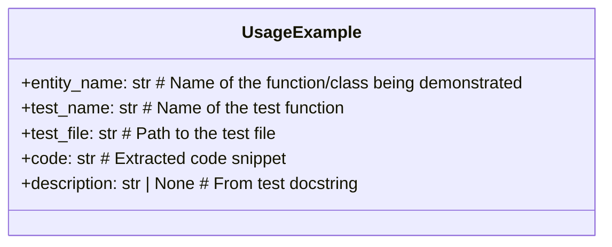
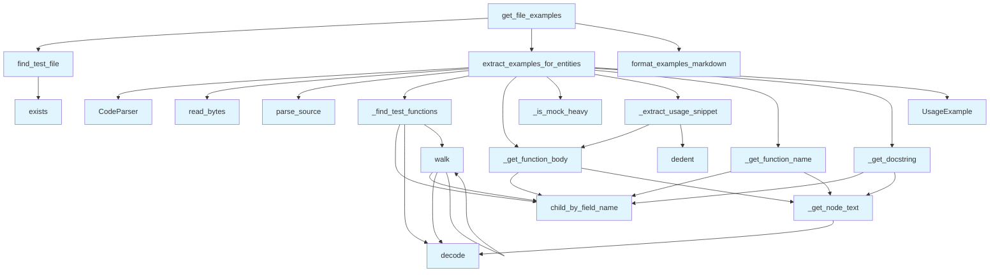

# test_examples.py

## File Overview

This file provides functionality for extracting usage examples from test files. It defines a data structure for representing test-based examples and a function to extract examples for specific entities from test code.

## Classes

### UsageExample

A data class that represents a usage example extracted from a test file.

**Attributes:**
- `entity_name` (str): Name of the function/class being demonstrated
- `test_name` (str): Name of the test function
- `test_file` (str): Path to the test file
- `code` (str): Extracted code snippet
- `description` (str | None): Description from test docstring

This class serves as a container for organizing test-based examples that demonstrate how specific entities are used in practice.

## Functions

### extract_examples_for_entities

```python
def extract_examples_for_entities(
    test_file: Path,
    entity_names: list[str],
    max_examples_per_entity: int = 2,
) -> list[UsageExample]:
```

Extracts usage examples from a test file for specified entities.

**Parameters:**
- `test_file` (Path): Path to the test file to analyze
- `entity_names` (list[str]): Names of functions/classes to [find](manifest.md) examples for
- `max_examples_per_entity` (int, optional): Maximum number of examples to extract per entity. Defaults to 2.

**Returns:**
- `list[UsageExample]`: List of UsageExample objects containing the extracted examples

The function uses a [CodeParser](../core/parser.md) to analyze the test file and extract relevant code snippets that demonstrate usage of the specified entities.

## Usage Examples

### Creating a UsageExample

```python
example = UsageExample()
example.entity_name = "my_function"
example.test_name = "test_my_function_basic"
example.test_file = "/path/to/test_file.py"
example.code = "result = my_function(arg1, arg2)"
example.description = "Tests basic functionality"
```

### Extracting Examples from Test Files

```python
from pathlib import Path

test_file = Path("tests/test_module.py")
entity_names = ["function_a", "ClassB"]
examples = extract_examples_for_entities(test_file, entity_names, max_examples_per_entity=3)

for example in examples:
    print(f"Example for {example.entity_name}: {example.test_name}")
```

## Related Components

This file works with:
- [CodeParser](../core/parser.md): Used by the extract_examples_for_entities function to parse test files
- Path objects from the pathlib module for file system operations

## API Reference

### class `UsageExample`

A usage example extracted from a test file.

---


<details>
<summary>View Source (lines 22-29)</summary>

```python
class UsageExample:
    """A usage example extracted from a test file."""

    entity_name: str  # Name of the function/class being demonstrated
    test_name: str  # Name of the test function
    test_file: str  # Path to the test file
    code: str  # Extracted code snippet
    description: str | None  # From test docstring
```

</details>

### Functions

#### `find_test_file`

```python
def find_test_file(source_file: Path, repo_root: Path) -> Path | None
```

Find the corresponding test file for a source file.  Tries multiple strategies: 1. Direct match: src/.../foo.py -> tests/test_foo.py 2. Nested match: src/pkg/mod/foo.py -> tests/test_foo.py


| [Parameter](api_docs.md) | Type | Default | Description |
|-----------|------|---------|-------------|
| `source_file` | `Path` | - | Path to the source file. |
| `repo_root` | `Path` | - | Root directory of the repository. |

**Returns:** `Path | None`


<details>
<summary>View Source (lines 32-69)</summary>

```python
def find_test_file(source_file: Path, repo_root: Path) -> Path | None:
    """Find the corresponding test file for a source file.

    Tries multiple strategies:
    1. Direct match: src/.../foo.py -> tests/test_foo.py
    2. Nested match: src/pkg/mod/foo.py -> tests/test_foo.py

    Args:
        source_file: Path to the source file.
        repo_root: Root directory of the repository.

    Returns:
        Path to the test file if found, None otherwise.
    """
    # Get base filename without extension
    base_name = source_file.stem  # e.g., "api_docs"

    # Skip test files themselves
    if base_name.startswith("test_"):
        return None

    # Common test directories to check
    test_dirs = [
        repo_root / "tests",
        repo_root / "test",
    ]

    for test_dir in test_dirs:
        if not test_dir.exists():
            continue

        # Try direct match: test_<basename>.py
        test_file = test_dir / f"test_{base_name}.py"
        if test_file.exists():
            logger.debug(f"Found test file: {test_file}")
            return test_file

    return None
```

</details>

#### `walk`

```python
def walk(node: Node) -> None
```


| [Parameter](api_docs.md) | Type | Default | Description |
|-----------|------|---------|-------------|
| `node` | `Node` | - | - |

**Returns:** `None`


<details>
<summary>View Source (lines 88-98)</summary>

```python
def walk(node: Node) -> None:
        if node.type == "function_definition":
            # Get the function name
            name_node = node.child_by_field_name("name")
            if name_node:
                name = name_node.text.decode("utf-8") if name_node.text else ""
                if name.startswith("test_"):
                    test_functions.append(node)

        for child in node.children:
            walk(child)
```

</details>

#### `extract_examples_for_entities`

```python
def extract_examples_for_entities(test_file: Path, entity_names: list[str], max_examples_per_entity: int = 2) -> list[UsageExample]
```

Extract usage examples from a test file for given entities.


| [Parameter](api_docs.md) | Type | Default | Description |
|-----------|------|---------|-------------|
| `test_file` | `Path` | - | Path to the test file. |
| `entity_names` | `list[str]` | - | Names of functions/classes to [find](manifest.md) examples for. |
| `max_examples_per_entity` | `int` | `2` | Maximum examples per entity. |

**Returns:** `list[UsageExample]`


<details>
<summary>View Source (lines 243-308)</summary>

```python
def extract_examples_for_entities(
    test_file: Path,
    entity_names: list[str],
    max_examples_per_entity: int = 2,
) -> list[UsageExample]:
    """Extract usage examples from a test file for given entities.

    Args:
        test_file: Path to the test file.
        entity_names: Names of functions/classes to find examples for.
        max_examples_per_entity: Maximum examples per entity.

    Returns:
        List of UsageExample objects.
    """
    parser = CodeParser()

    try:
        source = test_file.read_bytes()
    except (OSError, IOError) as e:
        logger.warning(f"Failed to read test file {test_file}: {e}")
        return []

    root = parser.parse_source(source, Language.PYTHON)

    test_functions = _find_test_functions(root)
    examples: list[UsageExample] = []
    entity_counts: dict[str, int] = {}

    for func_node in test_functions:
        body = _get_function_body(func_node, source)

        # Skip mock-heavy tests
        if _is_mock_heavy(body):
            continue

        for entity_name in entity_names:
            # Check if we've hit the limit for this entity
            if entity_counts.get(entity_name, 0) >= max_examples_per_entity:
                continue

            # Check if entity is used in this test
            if entity_name not in body:
                continue

            # Extract the usage snippet
            snippet = _extract_usage_snippet(func_node, source, entity_name)
            if not snippet or len(snippet) < 10:
                continue

            test_name = _get_function_name(func_node, source)
            docstring = _get_docstring(func_node, source)

            examples.append(
                UsageExample(
                    entity_name=entity_name,
                    test_name=test_name,
                    test_file=str(test_file.name),
                    code=snippet,
                    description=docstring,
                )
            )

            entity_counts[entity_name] = entity_counts.get(entity_name, 0) + 1

    return examples
```

</details>

#### `format_examples_markdown`

```python
def format_examples_markdown(examples: list[UsageExample], max_examples: int = 5) -> str
```

Format usage examples as markdown.


| [Parameter](api_docs.md) | Type | Default | Description |
|-----------|------|---------|-------------|
| `examples` | `list[UsageExample]` | - | List of UsageExample objects. |
| `max_examples` | `int` | `5` | Maximum examples to include. |

**Returns:** `str`


<details>
<summary>View Source (lines 311-345)</summary>

```python
def format_examples_markdown(
    examples: list[UsageExample],
    max_examples: int = 5,
) -> str:
    """Format usage examples as markdown.

    Args:
        examples: List of UsageExample objects.
        max_examples: Maximum examples to include.

    Returns:
        Formatted markdown string.
    """
    if not examples:
        return ""

    # Limit total examples
    examples = examples[:max_examples]

    sections = ["## Usage Examples\n"]
    sections.append("*Examples extracted from test files*\n")

    for example in examples:
        # Use docstring as title if available, otherwise use entity name
        if example.description:
            # Clean up docstring for use as title
            title = example.description.split("\n")[0].strip(".")
            sections.append(f"### {title}\n")
        else:
            sections.append(f"### Example: `{example.entity_name}`\n")

        sections.append(f"From `{example.test_file}::{example.test_name}`:\n")
        sections.append(f"```python\n{example.code}\n```\n")

    return "\n".join(sections)
```

</details>

#### `get_file_examples`

```python
def get_file_examples(source_file: Path, repo_root: Path, entity_names: list[str], max_examples: int = 5) -> str | None
```

Get formatted usage examples for a source file.  This is the [main](../export/html.md) entry point for the wiki generator.


| [Parameter](api_docs.md) | Type | Default | Description |
|-----------|------|---------|-------------|
| `source_file` | `Path` | - | Path to the source file being documented. |
| `repo_root` | `Path` | - | Root directory of the repository. |
| `entity_names` | `list[str]` | - | Names of functions/classes in the source file. |
| `max_examples` | `int` | `5` | Maximum examples to include. |

**Returns:** `str | None`


<details>
<summary>View Source (lines 348-395)</summary>

```python
def get_file_examples(
    source_file: Path,
    repo_root: Path,
    entity_names: list[str],
    max_examples: int = 5,
) -> str | None:
    """Get formatted usage examples for a source file.

    This is the main entry point for the wiki generator.

    Args:
        source_file: Path to the source file being documented.
        repo_root: Root directory of the repository.
        entity_names: Names of functions/classes in the source file.
        max_examples: Maximum examples to include.

    Returns:
        Formatted markdown string with examples, or None if no examples found.
    """
    # Only support Python for now
    if not source_file.suffix == ".py":
        return None

    # Find the corresponding test file
    test_file = find_test_file(source_file, repo_root)
    if test_file is None:
        logger.debug(f"No test file found for {source_file}")
        return None

    # Filter to meaningful entity names (skip short ones)
    entity_names = [name for name in entity_names if name and len(name) > 2]
    if not entity_names:
        return None

    # Extract examples
    examples = extract_examples_for_entities(
        test_file=test_file,
        entity_names=entity_names,
        max_examples_per_entity=2,
    )

    if not examples:
        logger.debug(f"No examples found in {test_file}")
        return None

    logger.info(f"Found {len(examples)} usage examples from {test_file.name}")

    return format_examples_markdown(examples, max_examples=max_examples)
```

</details>

## Class Diagram



## Call Graph



## Additional Source Code

Source code for functions and methods not listed in the API Reference above.

#### `_get_node_text`

<details>
<summary>View Source (lines 72-74)</summary>

```python
def _get_node_text(node: Node, source: bytes) -> str:
    """Get the text content of a tree-sitter node."""
    return source[node.start_byte : node.end_byte].decode("utf-8")
```

</details>


#### `_find_test_functions`

<details>
<summary>View Source (lines 77-101)</summary>

```python
def _find_test_functions(root: Node) -> list[Node]:
    """Find all test function definitions in the AST.

    Args:
        root: Root node of the parsed test file.

    Returns:
        List of function_definition nodes for test functions.
    """
    test_functions = []

    def walk(node: Node) -> None:
        if node.type == "function_definition":
            # Get the function name
            name_node = node.child_by_field_name("name")
            if name_node:
                name = name_node.text.decode("utf-8") if name_node.text else ""
                if name.startswith("test_"):
                    test_functions.append(node)

        for child in node.children:
            walk(child)

    walk(root)
    return test_functions
```

</details>


#### `_get_function_name`

<details>
<summary>View Source (lines 104-109)</summary>

```python
def _get_function_name(func_node: Node, source: bytes) -> str:
    """Get the name of a function from its AST node."""
    name_node = func_node.child_by_field_name("name")
    if name_node:
        return _get_node_text(name_node, source)
    return "unknown"
```

</details>


#### `_get_docstring`

<details>
<summary>View Source (lines 112-130)</summary>

```python
def _get_docstring(func_node: Node, source: bytes) -> str | None:
    """Extract docstring from a function node if present."""
    body = func_node.child_by_field_name("body")
    if not body or not body.children:
        return None

    # First statement in body might be a docstring
    first_stmt = body.children[0]
    if first_stmt.type == "expression_statement":
        expr = first_stmt.children[0] if first_stmt.children else None
        if expr and expr.type == "string":
            docstring = _get_node_text(expr, source)
            # Clean up the docstring
            docstring = docstring.strip("\"'")
            if docstring.startswith('""'):
                docstring = docstring[2:-2] if docstring.endswith('""') else docstring[2:]
            return docstring.strip()

    return None
```

</details>


#### `_get_function_body`

<details>
<summary>View Source (lines 133-138)</summary>

```python
def _get_function_body(func_node: Node, source: bytes) -> str:
    """Get the body of a function as a string."""
    body = func_node.child_by_field_name("body")
    if body:
        return _get_node_text(body, source)
    return ""
```

</details>


#### `_is_mock_heavy`

<details>
<summary>View Source (lines 141-156)</summary>

```python
def _is_mock_heavy(body: str) -> bool:
    """Check if a test body uses mocking extensively.

    We want to exclude heavily mocked tests as they don't show
    real usage patterns.
    """
    mock_indicators = [
        "MagicMock",
        "AsyncMock",
        "@patch",
        "patch(",
        "mock_",
        "mocker.",
    ]
    mock_count = sum(1 for indicator in mock_indicators if indicator in body)
    return mock_count >= 2
```

</details>


#### `_extract_usage_snippet`

<details>
<summary>View Source (lines 159-240)</summary>

```python
def _extract_usage_snippet(
    func_node: Node,
    source: bytes,
    entity_name: str,
    max_lines: int = 25,
) -> str | None:
    """Extract a clean usage snippet from a test function.

    Looks for code that demonstrates usage of the entity,
    including setup, the call, and assertions.

    Args:
        func_node: The function AST node.
        source: Source code bytes.
        entity_name: Name of the entity to find usage of.
        max_lines: Maximum lines to include.

    Returns:
        Extracted code snippet or None if not suitable.
    """
    body = _get_function_body(func_node, source)
    lines = body.split("\n")

    # Skip the docstring if present
    start_idx = 0
    for i, line in enumerate(lines):
        stripped = line.strip()
        if stripped and not stripped.startswith(('"""', "'''")):
            # Check if we're inside a docstring
            if '"""' in stripped or "'''" in stripped:
                continue
            start_idx = i
            break

    lines = lines[start_idx:]

    # Find lines relevant to the entity
    relevant_lines: list[str] = []
    capturing = False
    dedent_block = False
    paren_depth = 0

    for line in lines:
        stripped = line.strip()

        # Track parentheses for multi-line calls
        paren_depth += line.count("(") - line.count(")")

        # Start capturing when we see dedent (common test pattern) or the entity
        if "dedent(" in line or 'dedent("""' in line:
            dedent_block = True
            capturing = True

        if entity_name in line and not capturing:
            capturing = True

        if capturing:
            relevant_lines.append(line)

            # Stop after we complete an assertion or have enough context
            if stripped.startswith("assert") and paren_depth <= 0:
                # Include one more line if it's a continuation
                break

            if len(relevant_lines) >= max_lines:
                break

        # End dedent block
        if dedent_block and '"""' in line and len(relevant_lines) > 1:
            dedent_block = False

    if not relevant_lines:
        return None

    # Clean up indentation
    result = "\n".join(relevant_lines)
    try:
        result = dedent(result)
    except TypeError:
        pass

    return result.strip()
```

</details>

## Relevant Source Files

- `src/local_deepwiki/generators/test_examples.py:22-29`

## See Also

- [models](../models.md) - dependency
- [logging](../logging.md) - dependency
- [chunker](../core/chunker.md) - shares 5 dependencies
- [api_docs](api_docs.md) - shares 5 dependencies
