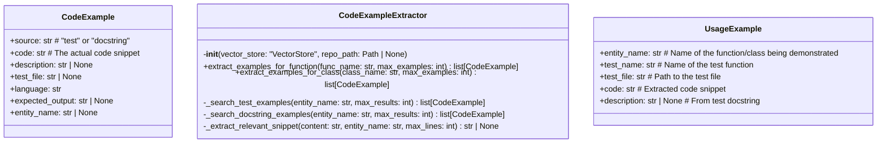
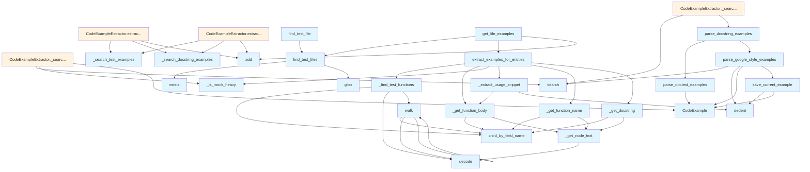

# File Overview

This file, `src/local_deepwiki/generators/test_examples.py`, provides functionality for extracting code examples from test files and docstrings. It supports identifying test functions that use specific entities (functions or classes) and extracting relevant code snippets from those tests. Additionally, it can extract examples from docstrings for functions and classes.

The module integrates with a vector store for semantic search and uses `tree_sitter` for parsing Python code. It also depends on core components like `CodeParser`, `ChunkType`, `Language`, and `VectorStore`.

---

# Classes

## `CodeExample`

A data class representing a code example extracted from either test files or docstrings.

### Fields

- `source`: Source of the example (`"test"` or `"docstring"`)
- `code`: The actual code snippet
- `description`: Description or context (optional)
- `test_file`: Path to the test file (for test examples, optional)
- `language`: Programming language (default: `"python"`)
- `expected_output`: Expected output (for doctest examples, optional)
- `entity_name`: Name of the function/class being demonstrated (optional)

## `UsageExample`

A data class representing a usage example extracted from a test file.

### Fields

- `entity_name`: Name of the function/class being demonstrated
- `test_name`: Name of the test function
- `test_file`: Path to the test file
- `code`: Extracted code snippet
- `description`: From test docstring (optional)

## `CodeExampleExtractor`

A class for finding and extracting code examples from test files and docstrings using a vector store.

### Methods

#### `__init__(self, vector_store: "VectorStore", repo_path: Path | None = None)`

Initialize the extractor.

**Parameters:**
- `vector_store`: VectorStore instance for semantic search.
- `repo_path`: Optional repository root path for test file discovery.

#### `extract_examples_for_function(self, func_name: str, max_examples: int = 3) -> list[CodeExample]`

Find test cases and docstring examples for a function.

**Parameters:**
- `func_name`: Name of the function to find examples for.
- `max_examples`: Maximum number of examples to return.

**Returns:**
- List of `CodeExample` objects.

#### `extract_examples_for_class(self, class_name: str, max_examples: int = 3) -> list[CodeExample]`

Find test cases and docstring examples for a class.

**Parameters:**
- `class_name`: Name of the class to find examples for.
- `max_examples`: Maximum number of examples to return.

**Returns:**
- List of `CodeExample` objects.

#### `_search_test_examples(self, entity_name: str, max_results: int = 5) -> list[CodeExample]`

Search for test functions that use the given entity.

**Parameters:**
- `entity_name`: Name of the function/class to search for.
- `max_results`: Maximum search results.

**Returns:**
- List of `CodeExample` objects from test files.

#### `_search_docstring_examples(self, entity_name: str, max_results: int = 3) -> list[CodeExample]`

Search for docstring examples for the given entity.

**Parameters:**
- `entity_name`: Name of the function/class to search for.
- `max_results`: Maximum results.

**Returns:**
- List of `CodeExample` objects from docstrings.

#### `_extract_relevant_snippet(self, content: str, entity_name: str, max_lines: int = 20) -> str | None`

Extract the most relevant code snippet from test content.

**Parameters:**
- `content`: Full test function content.
- `entity_name`: Entity to find usage of.
- `max_lines`: Maximum lines to include.

**Returns:**
- Extracted snippet or `None`.

---

# Functions

## `find_test_files(source_file: Path, repo_root: Path) -> list[Path]`

Find all corresponding test files for a source file.

**Strategies:**
1. Direct match: `src/.../foo.py` → `tests/test_foo.py`
2. Coverage tests: `src/.../foo.py` → `tests/test_foo_coverage.py`
3. Suffix variants: `tests/test_foo_*.py`
4. Alternative naming: `tests/foo_test.py`

**Parameters:**
- `source_file`: Path to the source file.
- `repo_root`: Root directory of the repository.

**Returns:**
- List of test file paths found (may be empty).

## `find_test_file(source_file: Path, repo_root: Path) -> Path | None`

Find the corresponding test file for a source file.

**Parameters:**
- `source_file`: Path to the source file.
- `repo_root`: Root directory of the repository.

**Returns:**
- Path to the test file if found, `None` otherwise.

## `_get_node_text(node: Node, source: bytes) -> str`

Get the text content of a tree-sitter node.

**Parameters:**
- `node`: Tree-sitter node.
- `source`: Source code bytes.

**Returns:**
- Text content of the node.

## `_find_test_functions(root: Node) -> list[tuple[Node, str | None]]`

Find all test function definitions in the AST.

**Parameters:**
- `root`: Root node of the parsed test file.

**Returns:**
- List of `(function_definition_node, class_name)` tuples.
  - `class_name` is `None` for standalone functions.

---

# Integration

This module integrates with:

- `local_deepwiki.core.parser.CodeParser` for parsing code.
- `local_deepwiki.core.vectorstore.VectorStore` for semantic search.
- `local_deepwiki.models.ChunkType`, `local_deepwiki.models.Language` for type definitions.
- `tree_sitter.Node` for AST traversal.

It is used by:

- `test_test_examples` in `tests/test_plugins.py`
- `test_code_examples` in `tests/test_plugins.py`
- `examples_plugin` in `tests/test_plugins.py`

The `CodeExampleExtractor` class is the main interface for extracting examples and relies on a vector store to find relevant test functions and docstrings.

---

# Usage Examples

### Using `CodeExampleExtractor`

```python
from local_deepwiki.core.vectorstore import VectorStore
from local_deepwiki.generators.test_examples import CodeExampleExtractor
from pathlib import Path

# Assume vector_store is initialized
extractor = CodeExampleExtractor(vector_store=vector_store, repo_path=Path("/path/to/repo"))

# Extract examples for a function
examples = await extractor.extract_examples_for_function("my_function", max_examples=5)
for example in examples:
    print(example.code)
```

### Finding Test Files

```python
from pathlib import Path
from local_deepwiki.generators.test_examples import find_test_files

source_file = Path("src/my_module.py")
repo_root = Path("/path/to/repo")
test_files = find_test_files(source_file, repo_root)
print(test_files)
```

### Extracting Code Snippets

```python
from local_deepwiki.generators.test_examples import _extract_relevant_snippet

content = """
def test_my_function():
    result = my_function(1, 2)
    assert result == 3
"""

snippet = _extract_relevant_snippet(content, "my_function")
print(snippet)
```

## API Reference

### class `CodeExample`

A code example extracted from tests or docstrings.  This is the unified data class for examples from any source.


<details>
<summary>View Source (lines 29-41) | <a href="https://github.com/UrbanDiver/local-deepwiki-mcp/blob/main/src/local_deepwiki/generators/test_examples.py#L29-L41">GitHub</a></summary>

```python
class CodeExample:
    """A code example extracted from tests or docstrings.

    This is the unified data class for examples from any source.
    """

    source: str  # "test" or "docstring"
    code: str  # The actual code snippet
    description: str | None = None  # Description or context
    test_file: str | None = None  # Path to test file (for test examples)
    language: str = "python"  # Programming language
    expected_output: str | None = None  # Expected output (for doctest examples)
    entity_name: str | None = None  # Name of the function/class being demonstrated
```

</details>

### class `UsageExample`

A usage example extracted from a test file.


<details>
<summary>View Source (lines 45-52) | <a href="https://github.com/UrbanDiver/local-deepwiki-mcp/blob/main/src/local_deepwiki/generators/test_examples.py#L45-L52">GitHub</a></summary>

```python
class UsageExample:
    """A usage example extracted from a test file."""

    entity_name: str  # Name of the function/class being demonstrated
    test_name: str  # Name of the test function
    test_file: str  # Path to the test file
    code: str  # Extracted code snippet
    description: str | None  # From test docstring
```

</details>

### class `CodeExampleExtractor`

Extract usage examples from tests and docstrings using vector search.  This class provides semantic search capabilities to find relevant test cases and docstring examples for functions and classes in a codebase.

**Methods:**


<details>
<summary>View Source (lines 772-1037) | <a href="https://github.com/UrbanDiver/local-deepwiki-mcp/blob/main/src/local_deepwiki/generators/test_examples.py#L772-L1037">GitHub</a></summary>

```python
class CodeExampleExtractor:
    # Methods: __init__, extract_examples_for_function, extract_examples_for_class, _search_test_examples, _search_docstring_examples, _extract_relevant_snippet
```

</details>

#### `__init__`

```python
def __init__(vector_store: "VectorStore", repo_path: Path | None = None)
```

Initialize the extractor.


| Parameter | Type | Default | Description |
|-----------|------|---------|-------------|
| `vector_store` | `"VectorStore"` | - | VectorStore instance for semantic search. |
| `repo_path` | `Path | None` | `None` | Optional repository root path for test file discovery. |


<details>
<summary>View Source (lines 785-793) | <a href="https://github.com/UrbanDiver/local-deepwiki-mcp/blob/main/src/local_deepwiki/generators/test_examples.py#L785-L793">GitHub</a></summary>

```python
def __init__(self, vector_store: "VectorStore", repo_path: Path | None = None):
        """Initialize the extractor.

        Args:
            vector_store: VectorStore instance for semantic search.
            repo_path: Optional repository root path for test file discovery.
        """
        self._store = vector_store
        self._repo_path = repo_path
```

</details>

#### `extract_examples_for_function`

```python
async def extract_examples_for_function(func_name: str, max_examples: int = 3) -> list[CodeExample]
```

Find test cases and docstring examples for a function.  Searches the vector store for: 1. Test functions that call or reference the target function 2. Docstrings containing examples for the function


| Parameter | Type | Default | Description |
|-----------|------|---------|-------------|
| `func_name` | `str` | - | Name of the function to find examples for. |
| `max_examples` | `int` | `3` | Maximum number of examples to return. |


<details>
<summary>View Source (lines 795-837) | <a href="https://github.com/UrbanDiver/local-deepwiki-mcp/blob/main/src/local_deepwiki/generators/test_examples.py#L795-L837">GitHub</a></summary>

```python
async def extract_examples_for_function(
        self,
        func_name: str,
        max_examples: int = 3,
    ) -> list[CodeExample]:
        """Find test cases and docstring examples for a function.

        Searches the vector store for:
        1. Test functions that call or reference the target function
        2. Docstrings containing examples for the function

        Args:
            func_name: Name of the function to find examples for.
            max_examples: Maximum number of examples to return.

        Returns:
            List of CodeExample objects.
        """
        if len(func_name) <= 2:
            return []

        examples: list[CodeExample] = []

        # Search for tests that use this function
        test_examples = await self._search_test_examples(func_name, max_examples)
        examples.extend(test_examples)

        # Search for docstring examples
        docstring_examples = await self._search_docstring_examples(func_name, max_examples)
        examples.extend(docstring_examples)

        # Deduplicate and limit
        seen_codes: set[str] = set()
        unique: list[CodeExample] = []
        for ex in examples:
            code_key = ex.code.strip()[:100]  # Compare first 100 chars
            if code_key not in seen_codes:
                seen_codes.add(code_key)
                unique.append(ex)
                if len(unique) >= max_examples:
                    break

        return unique
```

</details>

#### `extract_examples_for_class`

```python
async def extract_examples_for_class(class_name: str, max_examples: int = 3) -> list[CodeExample]
```

Find test cases and docstring examples for a class.  Searches for tests that instantiate or use the class, as well as docstring examples in the class definition.


| Parameter | Type | Default | Description |
|-----------|------|---------|-------------|
| `class_name` | `str` | - | Name of the class to find examples for. |
| `max_examples` | `int` | `3` | Maximum number of examples to return. |


---


<details>
<summary>View Source (lines 839-880) | <a href="https://github.com/UrbanDiver/local-deepwiki-mcp/blob/main/src/local_deepwiki/generators/test_examples.py#L839-L880">GitHub</a></summary>

```python
async def extract_examples_for_class(
        self,
        class_name: str,
        max_examples: int = 3,
    ) -> list[CodeExample]:
        """Find test cases and docstring examples for a class.

        Searches for tests that instantiate or use the class, as well as
        docstring examples in the class definition.

        Args:
            class_name: Name of the class to find examples for.
            max_examples: Maximum number of examples to return.

        Returns:
            List of CodeExample objects.
        """
        if len(class_name) <= 2:
            return []

        examples: list[CodeExample] = []

        # Search for tests that use this class
        test_examples = await self._search_test_examples(class_name, max_examples)
        examples.extend(test_examples)

        # Search for class docstring examples
        docstring_examples = await self._search_docstring_examples(class_name, max_examples)
        examples.extend(docstring_examples)

        # Deduplicate and limit
        seen_codes: set[str] = set()
        unique: list[CodeExample] = []
        for ex in examples:
            code_key = ex.code.strip()[:100]
            if code_key not in seen_codes:
                seen_codes.add(code_key)
                unique.append(ex)
                if len(unique) >= max_examples:
                    break

        return unique
```

</details>

### Functions

#### `find_test_files`

```python
def find_test_files(source_file: Path, repo_root: Path) -> list[Path]
```

Find all corresponding test files for a source file.  Tries multiple strategies: 1. Direct match: src/.../foo.py -> tests/test_foo.py 2. Coverage tests: src/.../foo.py -> tests/test_foo_coverage.py 3. Suffix variants: tests/test_foo_*.py 4. Alternative naming: tests/foo_test.py


| Parameter | Type | Default | Description |
|-----------|------|---------|-------------|
| `source_file` | `Path` | - | Path to the source file. |
| `repo_root` | `Path` | - | Root directory of the repository. |

**Returns:** `list[Path]`


<details>
<summary>View Source (lines 55-113) | <a href="https://github.com/UrbanDiver/local-deepwiki-mcp/blob/main/src/local_deepwiki/generators/test_examples.py#L55-L113">GitHub</a></summary>

```python
def find_test_files(source_file: Path, repo_root: Path) -> list[Path]:
    """Find all corresponding test files for a source file.

    Tries multiple strategies:
    1. Direct match: src/.../foo.py -> tests/test_foo.py
    2. Coverage tests: src/.../foo.py -> tests/test_foo_coverage.py
    3. Suffix variants: tests/test_foo_*.py
    4. Alternative naming: tests/foo_test.py

    Args:
        source_file: Path to the source file.
        repo_root: Root directory of the repository.

    Returns:
        List of test file paths found (may be empty).
    """
    # Get base filename without extension
    base_name = source_file.stem  # e.g., "api_docs"

    # Skip test files themselves
    if base_name.startswith("test_"):
        return []

    test_files: list[Path] = []

    # Common test directories to check
    test_dirs = [
        repo_root / "tests",
        repo_root / "test",
    ]

    for test_dir in test_dirs:
        if not test_dir.exists():
            continue

        # Try direct match: test_<basename>.py
        test_file = test_dir / f"test_{base_name}.py"
        if test_file.exists():
            test_files.append(test_file)

        # Try coverage variant: test_<basename>_coverage.py
        coverage_file = test_dir / f"test_{base_name}_coverage.py"
        if coverage_file.exists():
            test_files.append(coverage_file)

        # Try glob for other variants: test_<basename>_*.py
        for variant in test_dir.glob(f"test_{base_name}_*.py"):
            if variant not in test_files:
                test_files.append(variant)

        # Try alternative naming: <basename>_test.py
        alt_file = test_dir / f"{base_name}_test.py"
        if alt_file.exists() and alt_file not in test_files:
            test_files.append(alt_file)

    if test_files:
        logger.debug(f"Found {len(test_files)} test file(s) for {source_file.name}")

    return test_files
```

</details>

#### `find_test_file`

```python
def find_test_file(source_file: Path, repo_root: Path) -> Path | None
```

Find the corresponding test file for a source file.  Legacy function for backwards compatibility. Returns the first test file found, or None.


| Parameter | Type | Default | Description |
|-----------|------|---------|-------------|
| `source_file` | `Path` | - | Path to the source file. |
| `repo_root` | `Path` | - | Root directory of the repository. |

**Returns:** `Path | None`


<details>
<summary>View Source (lines 116-130) | <a href="https://github.com/UrbanDiver/local-deepwiki-mcp/blob/main/src/local_deepwiki/generators/test_examples.py#L116-L130">GitHub</a></summary>

```python
def find_test_file(source_file: Path, repo_root: Path) -> Path | None:
    """Find the corresponding test file for a source file.

    Legacy function for backwards compatibility.
    Returns the first test file found, or None.

    Args:
        source_file: Path to the source file.
        repo_root: Root directory of the repository.

    Returns:
        Path to the test file if found, None otherwise.
    """
    test_files = find_test_files(source_file, repo_root)
    return test_files[0] if test_files else None
```

</details>

#### `walk`

```python
def walk(node: Node, current_class: str | None = None) -> None
```


| Parameter | Type | Default | Description |
|-----------|------|---------|-------------|
| `node` | `Node` | - | - |
| `current_class` | `str | None` | `None` | - |

**Returns:** `None`


<details>
<summary>View Source (lines 152-174) | <a href="https://github.com/UrbanDiver/local-deepwiki-mcp/blob/main/src/local_deepwiki/generators/test_examples.py#L152-L174">GitHub</a></summary>

```python
def walk(node: Node, current_class: str | None = None) -> None:
        if node.type == "class_definition":
            # Get class name
            name_node = node.child_by_field_name("name")
            if name_node:
                class_name = name_node.text.decode("utf-8") if name_node.text else ""
                # Check if it's a test class
                if class_name.startswith("Test"):
                    # Walk children with this class context
                    for child in node.children:
                        walk(child, class_name)
                    return

        if node.type == "function_definition":
            # Get the function name
            name_node = node.child_by_field_name("name")
            if name_node:
                name = name_node.text.decode("utf-8") if name_node.text else ""
                if name.startswith("test_"):
                    test_functions.append((node, current_class))

        for child in node.children:
            walk(child, current_class)
```

</details>

#### `extract_examples_for_entities`

```python
def extract_examples_for_entities(test_file: Path, entity_names: list[str], max_examples_per_entity: int = 2) -> list[UsageExample]
```

Extract usage examples from a test file for given entities.


| Parameter | Type | Default | Description |
|-----------|------|---------|-------------|
| `test_file` | `Path` | - | Path to the test file. |
| `entity_names` | `list[str]` | - | Names of functions/classes to find examples for. |
| `max_examples_per_entity` | `int` | `2` | Maximum examples per entity. |

**Returns:** `list[UsageExample]`


<details>
<summary>View Source (lines 338-406) | <a href="https://github.com/UrbanDiver/local-deepwiki-mcp/blob/main/src/local_deepwiki/generators/test_examples.py#L338-L406">GitHub</a></summary>

```python
def extract_examples_for_entities(
    test_file: Path,
    entity_names: list[str],
    max_examples_per_entity: int = 2,
) -> list[UsageExample]:
    """Extract usage examples from a test file for given entities.

    Args:
        test_file: Path to the test file.
        entity_names: Names of functions/classes to find examples for.
        max_examples_per_entity: Maximum examples per entity.

    Returns:
        List of UsageExample objects.
    """
    parser = CodeParser()

    try:
        source = test_file.read_bytes()
    except (OSError, IOError) as e:
        logger.warning(f"Failed to read test file {test_file}: {e}")
        return []

    root = parser.parse_source(source, Language.PYTHON)

    test_functions = _find_test_functions(root)
    examples: list[UsageExample] = []
    entity_counts: dict[str, int] = {}

    for func_node, class_name in test_functions:
        body = _get_function_body(func_node, source)

        # Skip mock-heavy tests
        if _is_mock_heavy(body):
            continue

        for entity_name in entity_names:
            # Check if we've hit the limit for this entity
            if entity_counts.get(entity_name, 0) >= max_examples_per_entity:
                continue

            # Check if entity is used in this test
            if entity_name not in body:
                continue

            # Extract the usage snippet
            snippet = _extract_usage_snippet(func_node, source, entity_name)
            if not snippet or len(snippet) < 10:
                continue

            test_name = _get_function_name(func_node, source)
            docstring = _get_docstring(func_node, source)

            # Format test name with class if from a test class
            full_test_name = f"{class_name}::{test_name}" if class_name else test_name

            examples.append(
                UsageExample(
                    entity_name=entity_name,
                    test_name=full_test_name,
                    test_file=str(test_file.name),
                    code=snippet,
                    description=docstring,
                )
            )

            entity_counts[entity_name] = entity_counts.get(entity_name, 0) + 1

    return examples
```

</details>

#### `format_examples_markdown`

```python
def format_examples_markdown(examples: list[UsageExample], max_examples: int = 5) -> str
```

Format usage examples as markdown.


| Parameter | Type | Default | Description |
|-----------|------|---------|-------------|
| `examples` | `list[UsageExample]` | - | List of UsageExample objects. |
| `max_examples` | `int` | `5` | Maximum examples to include. |

**Returns:** `str`


<details>
<summary>View Source (lines 409-443) | <a href="https://github.com/UrbanDiver/local-deepwiki-mcp/blob/main/src/local_deepwiki/generators/test_examples.py#L409-L443">GitHub</a></summary>

```python
def format_examples_markdown(
    examples: list[UsageExample],
    max_examples: int = 5,
) -> str:
    """Format usage examples as markdown.

    Args:
        examples: List of UsageExample objects.
        max_examples: Maximum examples to include.

    Returns:
        Formatted markdown string.
    """
    if not examples:
        return ""

    # Limit total examples
    examples = examples[:max_examples]

    sections = ["## Usage Examples\n"]
    sections.append("*Examples extracted from test files*\n")

    for example in examples:
        # Use docstring as title if available, otherwise use entity name
        if example.description:
            # Clean up docstring for use as title
            title = example.description.split("\n")[0].strip(".")
            sections.append(f"### {title}\n")
        else:
            sections.append(f"### Example: `{example.entity_name}`\n")

        sections.append(f"From `{example.test_file}::{example.test_name}`:\n")
        sections.append(f"```python\n{example.code}\n```\n")

    return "\n".join(sections)
```

</details>

#### `get_file_examples`

```python
def get_file_examples(source_file: Path, repo_root: Path, entity_names: list[str], max_examples: int = 5) -> str | None
```

Get formatted usage examples for a source file.  This is the main entry point for the wiki generator. Searches all matching test files for usage examples.


| Parameter | Type | Default | Description |
|-----------|------|---------|-------------|
| `source_file` | `Path` | - | Path to the source file being documented. |
| `repo_root` | `Path` | - | Root directory of the repository. |
| `entity_names` | `list[str]` | - | Names of functions/classes in the source file. |
| `max_examples` | `int` | `5` | Maximum examples to include. |

**Returns:** `str | None`


<details>
<summary>View Source (lines 446-507) | <a href="https://github.com/UrbanDiver/local-deepwiki-mcp/blob/main/src/local_deepwiki/generators/test_examples.py#L446-L507">GitHub</a></summary>

```python
def get_file_examples(
    source_file: Path,
    repo_root: Path,
    entity_names: list[str],
    max_examples: int = 5,
) -> str | None:
    """Get formatted usage examples for a source file.

    This is the main entry point for the wiki generator.
    Searches all matching test files for usage examples.

    Args:
        source_file: Path to the source file being documented.
        repo_root: Root directory of the repository.
        entity_names: Names of functions/classes in the source file.
        max_examples: Maximum examples to include.

    Returns:
        Formatted markdown string with examples, or None if no examples found.
    """
    # Only support Python for now
    if not source_file.suffix == ".py":
        return None

    # Find all corresponding test files
    test_files = find_test_files(source_file, repo_root)
    if not test_files:
        logger.debug(f"No test files found for {source_file}")
        return None

    # Filter to meaningful entity names (skip short ones)
    entity_names = [name for name in entity_names if name and len(name) > 2]
    if not entity_names:
        return None

    # Extract examples from all test files
    all_examples: list[UsageExample] = []
    for test_file in test_files:
        examples = extract_examples_for_entities(
            test_file=test_file,
            entity_names=entity_names,
            max_examples_per_entity=2,
        )
        all_examples.extend(examples)

    if not all_examples:
        logger.debug(f"No examples found in {len(test_files)} test file(s)")
        return None

    # Deduplicate by entity_name + code (same example from different sources)
    seen: set[tuple[str, str]] = set()
    unique_examples: list[UsageExample] = []
    for ex in all_examples:
        key = (ex.entity_name, ex.code)
        if key not in seen:
            seen.add(key)
            unique_examples.append(ex)

    test_names = [tf.name for tf in test_files]
    logger.info(f"Found {len(unique_examples)} usage examples from {', '.join(test_names)}")

    return format_examples_markdown(unique_examples, max_examples=max_examples)
```

</details>

#### `parse_doctest_examples`

```python
def parse_doctest_examples(docstring: str) -> list[CodeExample]
```

Extract >>> doctest examples from a docstring.  Parses Python doctest-style examples with >>> prompts and expected output.


| Parameter | Type | Default | Description |
|-----------|------|---------|-------------|
| `docstring` | `str` | - | The docstring to parse. |

**Returns:** `list[CodeExample]`


<details>
<summary>View Source (lines 515-610) | <a href="https://github.com/UrbanDiver/local-deepwiki-mcp/blob/main/src/local_deepwiki/generators/test_examples.py#L515-L610">GitHub</a></summary>

```python
def parse_doctest_examples(docstring: str) -> list[CodeExample]:
    """Extract >>> doctest examples from a docstring.

    Parses Python doctest-style examples with >>> prompts and expected output.

    Args:
        docstring: The docstring to parse.

    Returns:
        List of CodeExample objects extracted from doctests.

    Example:
        >>> parse_doctest_examples('''
        ... >>> add(1, 2)
        ... 3
        ... >>> add(-1, 1)
        ... 0
        ... ''')
        [CodeExample(source='docstring', code='add(1, 2)', expected_output='3', ...)]
    """
    if not docstring:
        return []

    examples: list[CodeExample] = []
    lines = docstring.split("\n")

    current_code_lines: list[str] = []
    current_output_lines: list[str] = []
    in_code = False

    for line in lines:
        stripped = line.strip()

        # Check for >>> prompt (start of code)
        if stripped.startswith(">>>"):
            # If we have accumulated code from before, save it
            if current_code_lines:
                code = "\n".join(current_code_lines)
                output = "\n".join(current_output_lines) if current_output_lines else None
                examples.append(
                    CodeExample(
                        source="docstring",
                        code=code,
                        expected_output=output,
                        language="python",
                    )
                )
                current_code_lines = []
                current_output_lines = []

            # Start new code block
            code_part = stripped[3:].strip()  # Remove >>>
            if code_part:
                current_code_lines.append(code_part)
            in_code = True

        # Check for ... continuation
        elif stripped.startswith("...") and in_code:
            cont_part = stripped[3:].strip()  # Remove ...
            current_code_lines.append(cont_part)

        # Expected output (non-empty line after code, not starting with >>> or ...)
        elif in_code and stripped and not stripped.startswith((">>>", "...")):
            current_output_lines.append(stripped)

        # Empty line may end the example
        elif in_code and not stripped and current_code_lines:
            # Save the accumulated example
            code = "\n".join(current_code_lines)
            output = "\n".join(current_output_lines) if current_output_lines else None
            examples.append(
                CodeExample(
                    source="docstring",
                    code=code,
                    expected_output=output,
                    language="python",
                )
            )
            current_code_lines = []
            current_output_lines = []
            in_code = False

    # Don't forget the last example
    if current_code_lines:
        code = "\n".join(current_code_lines)
        output = "\n".join(current_output_lines) if current_output_lines else None
        examples.append(
            CodeExample(
                source="docstring",
                code=code,
                expected_output=output,
                language="python",
            )
        )

    return examples
```

</details>

#### `parse_google_style_examples`

```python
def parse_google_style_examples(docstring: str) -> list[CodeExample]
```

Extract examples from Google-style docstring Examples section.  Parses the Examples: section of a Google-style docstring, extracting code blocks and their descriptions.


| Parameter | Type | Default | Description |
|-----------|------|---------|-------------|
| `docstring` | `str` | - | The docstring to parse. |

**Returns:** `list[CodeExample]`


<details>
<summary>View Source (lines 613-735) | <a href="https://github.com/UrbanDiver/local-deepwiki-mcp/blob/main/src/local_deepwiki/generators/test_examples.py#L613-L735">GitHub</a></summary>

```python
def parse_google_style_examples(docstring: str) -> list[CodeExample]:
    """Extract examples from Google-style docstring Examples section.

    Parses the Examples: section of a Google-style docstring, extracting
    code blocks and their descriptions.

    Args:
        docstring: The docstring to parse.

    Returns:
        List of CodeExample objects from the Examples section.

    Example:
        >>> doc = '''
        ... Examples:
        ...     Basic usage:
        ...         result = process("input")
        ...         print(result)
        ...
        ...     With options:
        ...         result = process("input", verbose=True)
        ... '''
        >>> examples = parse_google_style_examples(doc)
        >>> len(examples)
        2
    """
    if not docstring:
        return []

    examples: list[CodeExample] = []

    # Find the Examples: section
    # Match "Examples:", "Example:", with optional leading whitespace
    example_pattern = re.compile(
        r"^\s*(Examples?)\s*:\s*$",
        re.MULTILINE | re.IGNORECASE,
    )

    match = example_pattern.search(docstring)
    if not match:
        return []

    # Extract from Examples: to end or next section
    start_idx = match.end()

    # Find the next section (Args:, Returns:, Raises:, etc.)
    section_pattern = re.compile(
        r"^\s*(Args?|Returns?|Raises?|Yields?|Attributes?|Note|Notes|Warning|Warnings|See Also|References?)\s*:",
        re.MULTILINE | re.IGNORECASE,
    )

    end_match = section_pattern.search(docstring, start_idx)
    if end_match:
        examples_text = docstring[start_idx : end_match.start()]
    else:
        examples_text = docstring[start_idx:]

    # Parse the examples section
    lines = examples_text.split("\n")
    current_description: str | None = None
    current_code_lines: list[str] = []
    base_indent: int | None = None

    def save_current_example() -> None:
        """Save the current accumulated example."""
        nonlocal current_description, current_code_lines
        if current_code_lines:
            code = dedent("\n".join(current_code_lines)).strip()
            if code:
                examples.append(
                    CodeExample(
                        source="docstring",
                        code=code,
                        description=current_description,
                        language="python",
                    )
                )
        current_description = None
        current_code_lines = []

    for line in lines:
        # Skip empty lines at the start
        if not line.strip() and not current_code_lines:
            continue

        # Calculate indentation
        stripped = line.lstrip()
        indent = len(line) - len(stripped)

        # Detect base indent level
        if base_indent is None and stripped:
            base_indent = indent

        if not stripped:
            # Empty line might separate examples
            if current_code_lines:
                current_code_lines.append("")
            continue

        # Line at base indent level might be a description
        if base_indent is not None and indent == base_indent:
            # Check if it looks like a description (ends with :)
            if stripped.endswith(":") and not stripped.startswith((">>>", "...")):
                # Save previous example if any
                save_current_example()
                current_description = stripped.rstrip(":")
                continue

        # Code line (more indented than base)
        if base_indent is not None and indent > base_indent:
            current_code_lines.append(line)
        elif stripped:
            # At base level, could be code if we're already collecting
            if current_code_lines:
                current_code_lines.append(line)
            else:
                # Could be description or start of code
                current_code_lines.append(line)

    # Save the last example
    save_current_example()

    return examples
```

</details>

#### `save_current_example`

```python
def save_current_example() -> None
```

Save the current accumulated example.

**Returns:** `None`


<details>
<summary>View Source (lines 676-691) | <a href="https://github.com/UrbanDiver/local-deepwiki-mcp/blob/main/src/local_deepwiki/generators/test_examples.py#L676-L691">GitHub</a></summary>

```python
def save_current_example() -> None:
        """Save the current accumulated example."""
        nonlocal current_description, current_code_lines
        if current_code_lines:
            code = dedent("\n".join(current_code_lines)).strip()
            if code:
                examples.append(
                    CodeExample(
                        source="docstring",
                        code=code,
                        description=current_description,
                        language="python",
                    )
                )
        current_description = None
        current_code_lines = []
```

</details>

#### `parse_docstring_examples`

```python
def parse_docstring_examples(docstring: str) -> list[CodeExample]
```

Extract all examples from a docstring (doctests and Google-style).  Combines doctest-style (>>>) examples and Google-style Examples section into a unified list.


| Parameter | Type | Default | Description |
|-----------|------|---------|-------------|
| `docstring` | `str` | - | The docstring to parse. |

**Returns:** `list[CodeExample]`


<details>
<summary>View Source (lines 738-764) | <a href="https://github.com/UrbanDiver/local-deepwiki-mcp/blob/main/src/local_deepwiki/generators/test_examples.py#L738-L764">GitHub</a></summary>

```python
def parse_docstring_examples(docstring: str) -> list[CodeExample]:
    """Extract all examples from a docstring (doctests and Google-style).

    Combines doctest-style (>>>) examples and Google-style Examples section
    into a unified list.

    Args:
        docstring: The docstring to parse.

    Returns:
        List of CodeExample objects from all sources.
    """
    if not docstring:
        return []

    examples: list[CodeExample] = []

    # Extract doctest examples
    doctest_examples = parse_doctest_examples(docstring)
    examples.extend(doctest_examples)

    # Extract Google-style examples (only if no doctests found, to avoid duplication)
    if not doctest_examples:
        google_examples = parse_google_style_examples(docstring)
        examples.extend(google_examples)

    return examples
```

</details>

#### `format_code_examples_markdown`

```python
def format_code_examples_markdown(examples: list[CodeExample], max_examples: int = 5) -> str
```

Format CodeExample objects as markdown.


| Parameter | Type | Default | Description |
|-----------|------|---------|-------------|
| `examples` | `list[CodeExample]` | - | List of CodeExample objects. |
| `max_examples` | `int` | `5` | Maximum examples to include. |

**Returns:** `str`


<details>
<summary>View Source (lines 1040-1083) | <a href="https://github.com/UrbanDiver/local-deepwiki-mcp/blob/main/src/local_deepwiki/generators/test_examples.py#L1040-L1083">GitHub</a></summary>

```python
def format_code_examples_markdown(
    examples: list[CodeExample],
    max_examples: int = 5,
) -> str:
    """Format CodeExample objects as markdown.

    Args:
        examples: List of CodeExample objects.
        max_examples: Maximum examples to include.

    Returns:
        Formatted markdown string.
    """
    if not examples:
        return ""

    examples = examples[:max_examples]

    sections = ["## Examples\n"]

    for i, example in enumerate(examples, 1):
        # Create section header
        if example.description:
            sections.append(f"### {example.description}\n")
        elif example.entity_name:
            sections.append(f"### Example {i}: `{example.entity_name}`\n")
        else:
            sections.append(f"### Example {i}\n")

        # Add source info
        if example.source == "test" and example.test_file:
            sections.append(f"*From test file: `{example.test_file}`*\n")
        elif example.source == "docstring":
            sections.append("*From docstring*\n")

        # Add code block
        lang = example.language or "python"
        sections.append(f"```{lang}\n{example.code}\n```\n")

        # Add expected output if available
        if example.expected_output:
            sections.append(f"Output:\n```\n{example.expected_output}\n```\n")

    return "\n".join(sections)
```

</details>

## Class Diagram


```mermaid
classDiagram
    class CodeExample {
        +source: str  # "test" or "docstring"
        +code: str  # The actual code snippet
        +description: str | None
        +test_file: str | None
        +language: str
        +expected_output: str | None
        +entity_name: str | None
    }
    class CodeExampleExtractor {
        -__init__(vector_store: "VectorStore", repo_path: Path | None)
        +extract_examples_for_function(func_name: str, max_examples: int) list[CodeExample]
        +extract_examples_for_class(class_name: str, max_examples: int) list[CodeExample]
        -_search_test_examples(entity_name: str, max_results: int) list[CodeExample]
        -_search_docstring_examples(entity_name: str, max_results: int) list[CodeExample]
        -_extract_relevant_snippet(content: str, entity_name: str, max_lines: int) str | None
    }
    class UsageExample {
        +entity_name: str  # Name of the function/class being demonstrated
        +test_name: str  # Name of the test function
        +test_file: str  # Path to the test file
        +code: str  # Extracted code snippet
        +description: str | None  # From test docstring
    }
```

## Call Graph


```mermaid
flowchart TD
    N0[CodeExample]
    N1[CodeExampleExtractor._searc...]
    N2[CodeExampleExtractor._searc...]
    N3[CodeExampleExtractor.extrac...]
    N4[CodeExampleExtractor.extrac...]
    N5[_extract_usage_snippet]
    N6[_find_test_functions]
    N7[_get_docstring]
    N8[_get_function_body]
    N9[_get_function_name]
    N10[_get_node_text]
    N11[_is_mock_heavy]
    N12[_search_docstring_examples]
    N13[_search_test_examples]
    N14[add]
    N15[child_by_field_name]
    N16[decode]
    N17[dedent]
    N18[exists]
    N19[extract_examples_for_entities]
    N20[find_test_file]
    N21[find_test_files]
    N22[get_file_examples]
    N23[glob]
    N24[parse_docstring_examples]
    N25[parse_doctest_examples]
    N26[parse_google_style_examples]
    N27[save_current_example]
    N28[search]
    N29[walk]
    N21 --> N18
    N21 --> N23
    N20 --> N21
    N10 --> N16
    N6 --> N15
    N6 --> N16
    N6 --> N29
    N29 --> N15
    N29 --> N16
    N29 --> N29
    N9 --> N15
    N9 --> N10
    N7 --> N15
    N7 --> N10
    N8 --> N15
    N8 --> N10
    N5 --> N8
    N5 --> N17
    N19 --> N6
    N19 --> N8
    N19 --> N11
    N19 --> N5
    N19 --> N9
    N19 --> N7
    N22 --> N21
    N22 --> N19
    N22 --> N14
    N25 --> N0
    N26 --> N28
    N26 --> N17
    N26 --> N0
    N26 --> N27
    N27 --> N17
    N27 --> N0
    N24 --> N25
    N24 --> N26
    N4 --> N13
    N4 --> N12
    N4 --> N14
    N3 --> N13
    N3 --> N12
    N3 --> N14
    N2 --> N28
    N2 --> N11
    N2 --> N0
    N1 --> N28
    N1 --> N24
    classDef func fill:#e1f5fe
    class N0,N5,N6,N7,N8,N9,N10,N11,N12,N13,N14,N15,N16,N17,N18,N19,N20,N21,N22,N23,N24,N25,N26,N27,N28,N29 func
    classDef method fill:#fff3e0
    class N1,N2,N3,N4 method
```

## Used By

Functions and methods in this file and their callers:

- **`CodeExample`**: called by `CodeExampleExtractor._search_test_examples`, `parse_doctest_examples`, `parse_google_style_examples`, `save_current_example`
- **`CodeParser`**: called by `extract_examples_for_entities`
- **`UsageExample`**: called by `extract_examples_for_entities`
- **`_extract_relevant_snippet`**: called by `CodeExampleExtractor._search_test_examples`
- **`_extract_usage_snippet`**: called by `extract_examples_for_entities`
- **`_find_test_functions`**: called by `extract_examples_for_entities`
- **`_get_docstring`**: called by `extract_examples_for_entities`
- **`_get_function_body`**: called by `_extract_usage_snippet`, `extract_examples_for_entities`
- **`_get_function_name`**: called by `extract_examples_for_entities`
- **`_get_node_text`**: called by `_get_docstring`, `_get_function_body`, `_get_function_name`
- **`_is_mock_heavy`**: called by `CodeExampleExtractor._search_test_examples`, `extract_examples_for_entities`
- **`_search_docstring_examples`**: called by `CodeExampleExtractor.extract_examples_for_class`, `CodeExampleExtractor.extract_examples_for_function`
- **`_search_test_examples`**: called by `CodeExampleExtractor.extract_examples_for_class`, `CodeExampleExtractor.extract_examples_for_function`
- **`add`**: called by `CodeExampleExtractor.extract_examples_for_class`, `CodeExampleExtractor.extract_examples_for_function`, `get_file_examples`
- **`child_by_field_name`**: called by `_find_test_functions`, `_get_docstring`, `_get_function_body`, `_get_function_name`, `walk`
- **`compile`**: called by `parse_google_style_examples`
- **`decode`**: called by `_find_test_functions`, `_get_node_text`, `walk`
- **`dedent`**: called by `CodeExampleExtractor._extract_relevant_snippet`, `_extract_usage_snippet`, `parse_google_style_examples`, `save_current_example`
- **`end`**: called by `parse_google_style_examples`
- **`exists`**: called by `find_test_files`
- **`extract_examples_for_entities`**: called by `get_file_examples`
- **`find_test_files`**: called by `find_test_file`, `get_file_examples`
- **`format_examples_markdown`**: called by `get_file_examples`
- **`glob`**: called by `find_test_files`
- **`lstrip`**: called by `parse_google_style_examples`
- **`parse_docstring_examples`**: called by `CodeExampleExtractor._search_docstring_examples`
- **`parse_doctest_examples`**: called by `parse_docstring_examples`
- **`parse_google_style_examples`**: called by `parse_docstring_examples`
- **`parse_source`**: called by `extract_examples_for_entities`
- **`read_bytes`**: called by `extract_examples_for_entities`
- **`rstrip`**: called by `parse_google_style_examples`
- **`save_current_example`**: called by `parse_google_style_examples`
- **`search`**: called by `CodeExampleExtractor._search_docstring_examples`, `CodeExampleExtractor._search_test_examples`, `parse_google_style_examples`
- **`start`**: called by `parse_google_style_examples`
- **`walk`**: called by `_find_test_functions`, `walk`

## Last Modified

| Entity | Type | Author | Date | Commit |
|--------|------|--------|------|--------|
| `CodeExample` | class | Brian Breidenbach | 1 week ago | `a64166a` Add seven medium-priority e... |
| `CodeExampleExtractor` | class | Brian Breidenbach | 1 week ago | `a64166a` Add seven medium-priority e... |
| `__init__` | method | Brian Breidenbach | 1 week ago | `a64166a` Add seven medium-priority e... |
| `extract_examples_for_function` | method | Brian Breidenbach | 1 week ago | `a64166a` Add seven medium-priority e... |
| `extract_examples_for_class` | method | Brian Breidenbach | 1 week ago | `a64166a` Add seven medium-priority e... |
| `_search_test_examples` | method | Brian Breidenbach | 1 week ago | `a64166a` Add seven medium-priority e... |
| `_search_docstring_examples` | method | Brian Breidenbach | 1 week ago | `a64166a` Add seven medium-priority e... |
| `_extract_relevant_snippet` | method | Brian Breidenbach | 1 week ago | `a64166a` Add seven medium-priority e... |
| `parse_doctest_examples` | function | Brian Breidenbach | 1 week ago | `a64166a` Add seven medium-priority e... |
| `parse_google_style_examples` | function | Brian Breidenbach | 1 week ago | `a64166a` Add seven medium-priority e... |
| `save_current_example` | function | Brian Breidenbach | 1 week ago | `a64166a` Add seven medium-priority e... |
| `parse_docstring_examples` | function | Brian Breidenbach | 1 week ago | `a64166a` Add seven medium-priority e... |
| `format_code_examples_markdown` | function | Brian Breidenbach | 1 week ago | `a64166a` Add seven medium-priority e... |
| `find_test_files` | function | Brian Breidenbach | 3 weeks ago | `216880e` Expand test example extract... |
| `find_test_file` | function | Brian Breidenbach | 3 weeks ago | `216880e` Expand test example extract... |
| `_find_test_functions` | function | Brian Breidenbach | 3 weeks ago | `216880e` Expand test example extract... |
| `walk` | function | Brian Breidenbach | 3 weeks ago | `216880e` Expand test example extract... |
| `_extract_usage_snippet` | function | Brian Breidenbach | 3 weeks ago | `216880e` Expand test example extract... |
| `extract_examples_for_entities` | function | Brian Breidenbach | 3 weeks ago | `216880e` Expand test example extract... |
| `get_file_examples` | function | Brian Breidenbach | 3 weeks ago | `216880e` Expand test example extract... |
| `UsageExample` | class | Brian Breidenbach | 3 weeks ago | `e579b0a` Add usage examples from tes... |
| `_get_node_text` | function | Brian Breidenbach | 3 weeks ago | `e579b0a` Add usage examples from tes... |
| `_get_function_name` | function | Brian Breidenbach | 3 weeks ago | `e579b0a` Add usage examples from tes... |
| `_get_docstring` | function | Brian Breidenbach | 3 weeks ago | `e579b0a` Add usage examples from tes... |
| `_get_function_body` | function | Brian Breidenbach | 3 weeks ago | `e579b0a` Add usage examples from tes... |
| `_is_mock_heavy` | function | Brian Breidenbach | 3 weeks ago | `e579b0a` Add usage examples from tes... |
| `format_examples_markdown` | function | Brian Breidenbach | 3 weeks ago | `e579b0a` Add usage examples from tes... |

## Additional Source Code

Source code for functions and methods not listed in the API Reference above.

#### `_get_node_text`

<details>
<summary>View Source (lines 133-135) | <a href="https://github.com/UrbanDiver/local-deepwiki-mcp/blob/main/src/local_deepwiki/generators/test_examples.py#L133-L135">GitHub</a></summary>

```python
def _get_node_text(node: Node, source: bytes) -> str:
    """Get the text content of a tree-sitter node."""
    return source[node.start_byte : node.end_byte].decode("utf-8")
```

</details>


#### `_find_test_functions`

<details>
<summary>View Source (lines 138-177) | <a href="https://github.com/UrbanDiver/local-deepwiki-mcp/blob/main/src/local_deepwiki/generators/test_examples.py#L138-L177">GitHub</a></summary>

```python
def _find_test_functions(root: Node) -> list[tuple[Node, str | None]]:
    """Find all test function definitions in the AST.

    Finds both standalone test functions and test methods in test classes.

    Args:
        root: Root node of the parsed test file.

    Returns:
        List of (function_definition_node, class_name) tuples.
        class_name is None for standalone functions.
    """
    test_functions: list[tuple[Node, str | None]] = []

    def walk(node: Node, current_class: str | None = None) -> None:
        if node.type == "class_definition":
            # Get class name
            name_node = node.child_by_field_name("name")
            if name_node:
                class_name = name_node.text.decode("utf-8") if name_node.text else ""
                # Check if it's a test class
                if class_name.startswith("Test"):
                    # Walk children with this class context
                    for child in node.children:
                        walk(child, class_name)
                    return

        if node.type == "function_definition":
            # Get the function name
            name_node = node.child_by_field_name("name")
            if name_node:
                name = name_node.text.decode("utf-8") if name_node.text else ""
                if name.startswith("test_"):
                    test_functions.append((node, current_class))

        for child in node.children:
            walk(child, current_class)

    walk(root)
    return test_functions
```

</details>


#### `_get_function_name`

<details>
<summary>View Source (lines 180-185) | <a href="https://github.com/UrbanDiver/local-deepwiki-mcp/blob/main/src/local_deepwiki/generators/test_examples.py#L180-L185">GitHub</a></summary>

```python
def _get_function_name(func_node: Node, source: bytes) -> str:
    """Get the name of a function from its AST node."""
    name_node = func_node.child_by_field_name("name")
    if name_node:
        return _get_node_text(name_node, source)
    return "unknown"
```

</details>


#### `_get_docstring`

<details>
<summary>View Source (lines 188-206) | <a href="https://github.com/UrbanDiver/local-deepwiki-mcp/blob/main/src/local_deepwiki/generators/test_examples.py#L188-L206">GitHub</a></summary>

```python
def _get_docstring(func_node: Node, source: bytes) -> str | None:
    """Extract docstring from a function node if present."""
    body = func_node.child_by_field_name("body")
    if not body or not body.children:
        return None

    # First statement in body might be a docstring
    first_stmt = body.children[0]
    if first_stmt.type == "expression_statement":
        expr = first_stmt.children[0] if first_stmt.children else None
        if expr and expr.type == "string":
            docstring = _get_node_text(expr, source)
            # Clean up the docstring
            docstring = docstring.strip("\"'")
            if docstring.startswith('""'):
                docstring = docstring[2:-2] if docstring.endswith('""') else docstring[2:]
            return docstring.strip()

    return None
```

</details>


#### `_get_function_body`

<details>
<summary>View Source (lines 209-214) | <a href="https://github.com/UrbanDiver/local-deepwiki-mcp/blob/main/src/local_deepwiki/generators/test_examples.py#L209-L214">GitHub</a></summary>

```python
def _get_function_body(func_node: Node, source: bytes) -> str:
    """Get the body of a function as a string."""
    body = func_node.child_by_field_name("body")
    if body:
        return _get_node_text(body, source)
    return ""
```

</details>


#### `_is_mock_heavy`

<details>
<summary>View Source (lines 217-232) | <a href="https://github.com/UrbanDiver/local-deepwiki-mcp/blob/main/src/local_deepwiki/generators/test_examples.py#L217-L232">GitHub</a></summary>

```python
def _is_mock_heavy(body: str) -> bool:
    """Check if a test body uses mocking extensively.

    We want to exclude heavily mocked tests as they don't show
    real usage patterns.
    """
    mock_indicators = [
        "MagicMock",
        "AsyncMock",
        "@patch",
        "patch(",
        "mock_",
        "mocker.",
    ]
    mock_count = sum(1 for indicator in mock_indicators if indicator in body)
    return mock_count >= 2
```

</details>


#### `_extract_usage_snippet`

<details>
<summary>View Source (lines 235-335) | <a href="https://github.com/UrbanDiver/local-deepwiki-mcp/blob/main/src/local_deepwiki/generators/test_examples.py#L235-L335">GitHub</a></summary>

```python
def _extract_usage_snippet(
    func_node: Node,
    source: bytes,
    entity_name: str,
    max_lines: int = 25,
) -> str | None:
    """Extract a clean usage snippet from a test function.

    Looks for code that demonstrates usage of the entity,
    including setup, the call, and assertions.

    Args:
        func_node: The function AST node.
        source: Source code bytes.
        entity_name: Name of the entity to find usage of.
        max_lines: Maximum lines to include.

    Returns:
        Extracted code snippet or None if not suitable.
    """
    body = _get_function_body(func_node, source)
    lines = body.split("\n")

    # Skip the docstring if present
    start_idx = 0
    in_docstring = False
    for i, line in enumerate(lines):
        stripped = line.strip()
        if not stripped:
            continue
        # Detect docstring boundaries
        if stripped.startswith(('"""', "'''")):
            if in_docstring:
                in_docstring = False
                continue
            # Check for single-line docstring
            if stripped.count('"""') >= 2 or stripped.count("'''") >= 2:
                continue
            in_docstring = True
            continue
        if in_docstring:
            continue
        start_idx = i
        break

    lines = lines[start_idx:]

    # Find lines relevant to the entity
    relevant_lines: list[str] = []
    capturing = False
    dedent_block = False
    paren_depth = 0
    assertions_found = 0

    for line in lines:
        stripped = line.strip()

        # Track parentheses for multi-line calls
        paren_depth += line.count("(") - line.count(")")

        # Start capturing when we see dedent (common test pattern) or the entity
        if "dedent(" in line or 'dedent("""' in line:
            dedent_block = True
            capturing = True

        if entity_name in line and not capturing:
            capturing = True

        if capturing:
            relevant_lines.append(line)

            # Track assertions to capture a complete test
            if stripped.startswith("assert") and paren_depth <= 0:
                assertions_found += 1
                # Allow up to 2 assertions for better context
                if assertions_found >= 2:
                    break

            if len(relevant_lines) >= max_lines:
                break

        # End dedent block
        if dedent_block and '"""' in line and len(relevant_lines) > 1:
            dedent_block = False

    if not relevant_lines:
        return None

    # For short tests, include the full body (more useful)
    if len(relevant_lines) < 5 and len(lines) <= max_lines:
        result = "\n".join(lines)
    else:
        result = "\n".join(relevant_lines)

    # Clean up indentation
    try:
        result = dedent(result)
    except TypeError:
        pass

    return result.strip()
```

</details>


#### `_search_test_examples`

<details>
<summary>View Source (lines 882-938) | <a href="https://github.com/UrbanDiver/local-deepwiki-mcp/blob/main/src/local_deepwiki/generators/test_examples.py#L882-L938">GitHub</a></summary>

```python
async def _search_test_examples(
        self,
        entity_name: str,
        max_results: int = 5,
    ) -> list[CodeExample]:
        """Search for test functions that use the given entity.

        Args:
            entity_name: Name of the function/class to search for.
            max_results: Maximum search results.

        Returns:
            List of CodeExample objects from test files.
        """
        examples: list[CodeExample] = []

        # Search for test functions mentioning this entity
        query = f"test {entity_name}"
        results = await self._store.search(
            query=query,
            limit=max_results * 2,  # Get extra to filter
            chunk_type="function",
        )

        for result in results:
            chunk = result.chunk

            # Only consider test functions
            if not chunk.name or not chunk.name.startswith("test"):
                continue

            # Check if entity is actually used in the code
            if entity_name not in chunk.content:
                continue

            # Skip mock-heavy tests
            if _is_mock_heavy(chunk.content):
                continue

            # Extract relevant snippet
            snippet = self._extract_relevant_snippet(chunk.content, entity_name)
            if snippet and len(snippet) >= 10:
                examples.append(
                    CodeExample(
                        source="test",
                        code=snippet,
                        description=chunk.docstring,
                        test_file=chunk.file_path,
                        language=chunk.language.value if chunk.language else "python",
                        entity_name=entity_name,
                    )
                )

            if len(examples) >= max_results:
                break

        return examples
```

</details>


#### `_search_docstring_examples`

<details>
<summary>View Source (lines 940-979) | <a href="https://github.com/UrbanDiver/local-deepwiki-mcp/blob/main/src/local_deepwiki/generators/test_examples.py#L940-L979">GitHub</a></summary>

```python
async def _search_docstring_examples(
        self,
        entity_name: str,
        max_results: int = 3,
    ) -> list[CodeExample]:
        """Search for docstring examples for the given entity.

        Args:
            entity_name: Name of the function/class to search for.
            max_results: Maximum results.

        Returns:
            List of CodeExample objects from docstrings.
        """
        examples: list[CodeExample] = []

        # Search for the entity's definition
        results = await self._store.search(
            query=entity_name,
            limit=5,
        )

        for result in results:
            chunk = result.chunk

            # Look for the exact entity
            if chunk.name != entity_name:
                continue

            # Parse docstring examples
            if chunk.docstring:
                docstring_examples = parse_docstring_examples(chunk.docstring)
                for doc_ex in docstring_examples[:max_results]:
                    doc_ex.entity_name = entity_name
                    examples.append(doc_ex)

            if len(examples) >= max_results:
                break

        return examples
```

</details>


#### `_extract_relevant_snippet`

<details>
<summary>View Source (lines 981-1037) | <a href="https://github.com/UrbanDiver/local-deepwiki-mcp/blob/main/src/local_deepwiki/generators/test_examples.py#L981-L1037">GitHub</a></summary>

```python
def _extract_relevant_snippet(
        self,
        content: str,
        entity_name: str,
        max_lines: int = 20,
    ) -> str | None:
        """Extract the most relevant code snippet from test content.

        Args:
            content: Full test function content.
            entity_name: Entity to find usage of.
            max_lines: Maximum lines to include.

        Returns:
            Extracted snippet or None.
        """
        lines = content.split("\n")
        relevant: list[str] = []
        capturing = False
        paren_depth = 0
        assertions_found = 0

        for line in lines:
            stripped = line.strip()

            # Skip docstrings
            if stripped.startswith(('"""', "'''")):
                continue

            # Track parentheses
            paren_depth += line.count("(") - line.count(")")

            # Start capturing at entity usage
            if entity_name in line and not capturing:
                capturing = True

            if capturing:
                relevant.append(line)

                # Stop after assertions
                if stripped.startswith("assert") and paren_depth <= 0:
                    assertions_found += 1
                    if assertions_found >= 2:
                        break

                if len(relevant) >= max_lines:
                    break

        if not relevant:
            return None

        try:
            result = dedent("\n".join(relevant)).strip()
        except Exception:
            result = "\n".join(relevant).strip()

        return result if len(result) >= 10 else None
```

</details>

