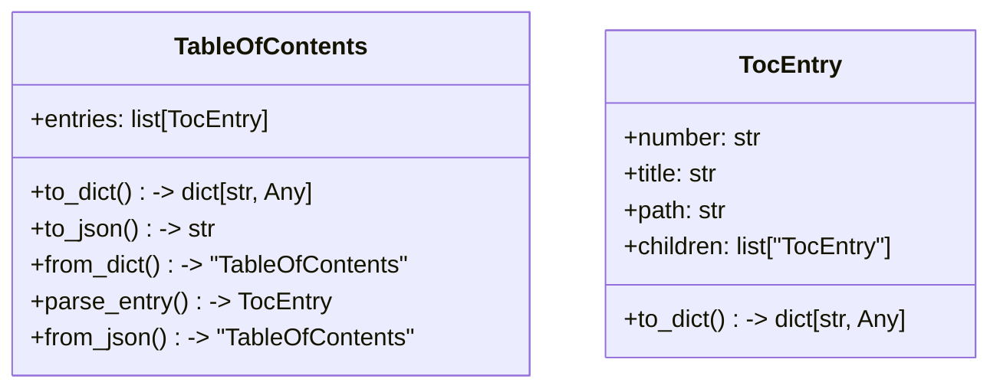
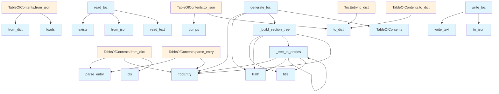

# File Overview

This file, `src/local_deepwiki/generators/toc.py`, provides functionality for generating, serializing, and deserializing a hierarchical table of contents (TOC) for a wiki. It defines the structure of TOC entries and the overall TOC, and includes functions to build a TOC from a list of wiki pages, as well as to read and write the TOC to/from a JSON file.

## Classes

### TocEntry

A single entry in the table of contents.

**Fields:**
- `number`: The section number (e.g., "1.1").
- `title`: The title of the entry.
- `path`: The path to the entry's markdown file.
- `children`: A list of child `TocEntry` objects (default is an empty list).

**Methods:**
- `to_dict()`: Converts the entry to a dictionary for JSON serialization.

### TableOfContents

Hierarchical table of contents with numbered sections.

**Fields:**
- `entries`: A list of `TocEntry` objects representing the top-level entries.

**Methods:**
- `to_dict()`: Converts the table of contents to a dictionary for JSON serialization.
- `to_json(indent: int = 2)`: Converts the table of contents to a JSON string with the specified indentation.
- `from_dict(cls, data: dict[str, Any])`: Creates a `TableOfContents` instance from a dictionary.
- `from_json(cls, data: str)`: Creates a `TableOfContents` instance from a JSON string.

## Functions

### generate_toc

Generates a hierarchical numbered table of contents from a list of wiki pages.

**Parameters:**
- `pages`: A list of dictionaries, each with 'path' and 'title' keys.

**Returns:**
- A `TableOfContents` object with numbered entries.

### write_toc

Writes the table of contents to a `toc.json` file.

**Parameters:**
- `toc`: The `TableOfContents` to write.
- `wiki_path`: The path to the wiki directory.

**Returns:**
- None

### read_toc

Reads the table of contents from a `toc.json` file.

**Parameters:**
- `wiki_path`: The path to the wiki directory.

**Returns:**
- A `TableOfContents` object if the file exists and is valid, otherwise `None`.

## Integration

This file is used by test functions in `test_toc` and is part of the `local_deepwiki` package. It is responsible for managing the structure and persistence of a wiki's table of contents. The `TableOfContents` and `TocEntry` classes are used to represent the TOC data, while `generate_toc`, `write_toc`, and `read_toc` provide the necessary I/O operations.

## Usage Examples

### Generating a TOC

```python
pages = [
    {"path": "index.md", "title": "Overview"},
    {"path": "architecture.md", "title": "Architecture"},
]
toc = generate_toc(pages)
```

### Writing a TOC to File

```python
write_toc(toc, Path("/path/to/wiki"))
```

### Reading a TOC from File

```python
toc = read_toc(Path("/path/to/wiki"))
```

## API Reference

### class `TocEntry`

A single entry in the table of contents.

**Methods:**


<details>
<summary>View Source (lines 10-27) | <a href="https://github.com/UrbanDiver/local-deepwiki-mcp/blob/[main](../export/pdf.md)/src/local_deepwiki/generators/toc.py#L10-L27">GitHub</a></summary>

```python
class TocEntry:
    """A single entry in the table of contents."""

    number: str
    title: str
    path: str
    children: list["TocEntry"] = field(default_factory=list)

    def to_dict(self) -> dict[str, Any]:
        """Convert to dictionary for JSON serialization."""
        result: dict[str, Any] = {
            "number": self.number,
            "title": self.title,
            "path": self.path,
        }
        if self.children:
            result["children"] = [child.to_dict() for child in self.children]
        return result
```

</details>

#### `to_dict`

```python
def to_dict() -> dict[str, Any]
```

Convert to dictionary for JSON serialization.


<details>
<summary>View Source (lines 10-27) | <a href="https://github.com/UrbanDiver/local-deepwiki-mcp/blob/[main](../export/pdf.md)/src/local_deepwiki/generators/toc.py#L10-L27">GitHub</a></summary>

```python
class TocEntry:
    """A single entry in the table of contents."""

    number: str
    title: str
    path: str
    children: list["TocEntry"] = field(default_factory=list)

    def to_dict(self) -> dict[str, Any]:
        """Convert to dictionary for JSON serialization."""
        result: dict[str, Any] = {
            "number": self.number,
            "title": self.title,
            "path": self.path,
        }
        if self.children:
            result["children"] = [child.to_dict() for child in self.children]
        return result
```

</details>

### class `TableOfContents`

Hierarchical table of contents with numbered sections.

**Methods:**


<details>
<summary>View Source (lines 31-63) | <a href="https://github.com/UrbanDiver/local-deepwiki-mcp/blob/[main](../export/pdf.md)/src/local_deepwiki/generators/toc.py#L31-L63">GitHub</a></summary>

```python
class TableOfContents:
    """Hierarchical table of contents with numbered sections."""

    entries: list[TocEntry] = field(default_factory=list)

    def to_dict(self) -> dict[str, Any]:
        """Convert to dictionary for JSON serialization."""
        return {"entries": [entry.to_dict() for entry in self.entries]}

    def to_json(self, indent: int = 2) -> str:
        """Convert to JSON string."""
        return json.dumps(self.to_dict(), indent=indent)

    @classmethod
    def from_dict(cls, data: dict[str, Any]) -> "TableOfContents":
        """Create from dictionary."""

        def parse_entry(entry_data: dict[str, Any]) -> TocEntry:
            children = [parse_entry(child) for child in entry_data.get("children", [])]
            return TocEntry(
                number=entry_data["number"],
                title=entry_data["title"],
                path=entry_data["path"],
                children=children,
            )

        entries = [parse_entry(e) for e in data.get("entries", [])]
        return cls(entries=entries)

    @classmethod
    def from_json(cls, json_str: str) -> "TableOfContents":
        """Create from JSON string."""
        return cls.from_dict(json.loads(json_str))
```

</details>

#### `to_dict`

```python
def to_dict() -> dict[str, Any]
```

Convert to dictionary for JSON serialization.


<details>
<summary>View Source (lines 31-63) | <a href="https://github.com/UrbanDiver/local-deepwiki-mcp/blob/[main](../export/pdf.md)/src/local_deepwiki/generators/toc.py#L31-L63">GitHub</a></summary>

```python
class TableOfContents:
    """Hierarchical table of contents with numbered sections."""

    entries: list[TocEntry] = field(default_factory=list)

    def to_dict(self) -> dict[str, Any]:
        """Convert to dictionary for JSON serialization."""
        return {"entries": [entry.to_dict() for entry in self.entries]}

    def to_json(self, indent: int = 2) -> str:
        """Convert to JSON string."""
        return json.dumps(self.to_dict(), indent=indent)

    @classmethod
    def from_dict(cls, data: dict[str, Any]) -> "TableOfContents":
        """Create from dictionary."""

        def parse_entry(entry_data: dict[str, Any]) -> TocEntry:
            children = [parse_entry(child) for child in entry_data.get("children", [])]
            return TocEntry(
                number=entry_data["number"],
                title=entry_data["title"],
                path=entry_data["path"],
                children=children,
            )

        entries = [parse_entry(e) for e in data.get("entries", [])]
        return cls(entries=entries)

    @classmethod
    def from_json(cls, json_str: str) -> "TableOfContents":
        """Create from JSON string."""
        return cls.from_dict(json.loads(json_str))
```

</details>

#### `to_json`

```python
def to_json(indent: int = 2) -> str
```

Convert to JSON string.


| [Parameter](api_docs.md) | Type | Default | Description |
|-----------|------|---------|-------------|
| `indent` | `int` | `2` | - |


<details>
<summary>View Source (lines 31-63) | <a href="https://github.com/UrbanDiver/local-deepwiki-mcp/blob/[main](../export/pdf.md)/src/local_deepwiki/generators/toc.py#L31-L63">GitHub</a></summary>

```python
class TableOfContents:
    """Hierarchical table of contents with numbered sections."""

    entries: list[TocEntry] = field(default_factory=list)

    def to_dict(self) -> dict[str, Any]:
        """Convert to dictionary for JSON serialization."""
        return {"entries": [entry.to_dict() for entry in self.entries]}

    def to_json(self, indent: int = 2) -> str:
        """Convert to JSON string."""
        return json.dumps(self.to_dict(), indent=indent)

    @classmethod
    def from_dict(cls, data: dict[str, Any]) -> "TableOfContents":
        """Create from dictionary."""

        def parse_entry(entry_data: dict[str, Any]) -> TocEntry:
            children = [parse_entry(child) for child in entry_data.get("children", [])]
            return TocEntry(
                number=entry_data["number"],
                title=entry_data["title"],
                path=entry_data["path"],
                children=children,
            )

        entries = [parse_entry(e) for e in data.get("entries", [])]
        return cls(entries=entries)

    @classmethod
    def from_json(cls, json_str: str) -> "TableOfContents":
        """Create from JSON string."""
        return cls.from_dict(json.loads(json_str))
```

</details>

#### `from_dict`

```python
def from_dict(data: dict[str, Any]) -> "TableOfContents"
```

Create from dictionary.


| [Parameter](api_docs.md) | Type | Default | Description |
|-----------|------|---------|-------------|
| `data` | `dict[str, Any]` | - | - |


<details>
<summary>View Source (lines 31-63) | <a href="https://github.com/UrbanDiver/local-deepwiki-mcp/blob/[main](../export/pdf.md)/src/local_deepwiki/generators/toc.py#L31-L63">GitHub</a></summary>

```python
class TableOfContents:
    """Hierarchical table of contents with numbered sections."""

    entries: list[TocEntry] = field(default_factory=list)

    def to_dict(self) -> dict[str, Any]:
        """Convert to dictionary for JSON serialization."""
        return {"entries": [entry.to_dict() for entry in self.entries]}

    def to_json(self, indent: int = 2) -> str:
        """Convert to JSON string."""
        return json.dumps(self.to_dict(), indent=indent)

    @classmethod
    def from_dict(cls, data: dict[str, Any]) -> "TableOfContents":
        """Create from dictionary."""

        def parse_entry(entry_data: dict[str, Any]) -> TocEntry:
            children = [parse_entry(child) for child in entry_data.get("children", [])]
            return TocEntry(
                number=entry_data["number"],
                title=entry_data["title"],
                path=entry_data["path"],
                children=children,
            )

        entries = [parse_entry(e) for e in data.get("entries", [])]
        return cls(entries=entries)

    @classmethod
    def from_json(cls, json_str: str) -> "TableOfContents":
        """Create from JSON string."""
        return cls.from_dict(json.loads(json_str))
```

</details>

#### `parse_entry`

```python
def parse_entry(entry_data: dict[str, Any]) -> TocEntry
```


| [Parameter](api_docs.md) | Type | Default | Description |
|-----------|------|---------|-------------|
| `entry_data` | `dict[str, Any]` | - | - |


<details>
<summary>View Source (lines 31-63) | <a href="https://github.com/UrbanDiver/local-deepwiki-mcp/blob/[main](../export/pdf.md)/src/local_deepwiki/generators/toc.py#L31-L63">GitHub</a></summary>

```python
class TableOfContents:
    """Hierarchical table of contents with numbered sections."""

    entries: list[TocEntry] = field(default_factory=list)

    def to_dict(self) -> dict[str, Any]:
        """Convert to dictionary for JSON serialization."""
        return {"entries": [entry.to_dict() for entry in self.entries]}

    def to_json(self, indent: int = 2) -> str:
        """Convert to JSON string."""
        return json.dumps(self.to_dict(), indent=indent)

    @classmethod
    def from_dict(cls, data: dict[str, Any]) -> "TableOfContents":
        """Create from dictionary."""

        def parse_entry(entry_data: dict[str, Any]) -> TocEntry:
            children = [parse_entry(child) for child in entry_data.get("children", [])]
            return TocEntry(
                number=entry_data["number"],
                title=entry_data["title"],
                path=entry_data["path"],
                children=children,
            )

        entries = [parse_entry(e) for e in data.get("entries", [])]
        return cls(entries=entries)

    @classmethod
    def from_json(cls, json_str: str) -> "TableOfContents":
        """Create from JSON string."""
        return cls.from_dict(json.loads(json_str))
```

</details>

#### `from_json`

```python
def from_json(json_str: str) -> "TableOfContents"
```

Create from JSON string.


| [Parameter](api_docs.md) | Type | Default | Description |
|-----------|------|---------|-------------|
| `json_str` | `str` | - | - |


---


<details>
<summary>View Source (lines 31-63) | <a href="https://github.com/UrbanDiver/local-deepwiki-mcp/blob/[main](../export/pdf.md)/src/local_deepwiki/generators/toc.py#L31-L63">GitHub</a></summary>

```python
class TableOfContents:
    """Hierarchical table of contents with numbered sections."""

    entries: list[TocEntry] = field(default_factory=list)

    def to_dict(self) -> dict[str, Any]:
        """Convert to dictionary for JSON serialization."""
        return {"entries": [entry.to_dict() for entry in self.entries]}

    def to_json(self, indent: int = 2) -> str:
        """Convert to JSON string."""
        return json.dumps(self.to_dict(), indent=indent)

    @classmethod
    def from_dict(cls, data: dict[str, Any]) -> "TableOfContents":
        """Create from dictionary."""

        def parse_entry(entry_data: dict[str, Any]) -> TocEntry:
            children = [parse_entry(child) for child in entry_data.get("children", [])]
            return TocEntry(
                number=entry_data["number"],
                title=entry_data["title"],
                path=entry_data["path"],
                children=children,
            )

        entries = [parse_entry(e) for e in data.get("entries", [])]
        return cls(entries=entries)

    @classmethod
    def from_json(cls, json_str: str) -> "TableOfContents":
        """Create from JSON string."""
        return cls.from_dict(json.loads(json_str))
```

</details>

### Functions

#### `generate_toc`

```python
def generate_toc(pages: list[dict[str, str]]) -> TableOfContents
```

Generate hierarchical numbered table of contents from wiki pages.


| [Parameter](api_docs.md) | Type | Default | Description |
|-----------|------|---------|-------------|
| `pages` | `list[dict[str, str]]` | - | List of dicts with 'path' and 'title' keys. |

**Returns:** `TableOfContents`


<details>
<summary>View Source (lines 66-134) | <a href="https://github.com/UrbanDiver/local-deepwiki-mcp/blob/[main](../export/pdf.md)/src/local_deepwiki/generators/toc.py#L66-L134">GitHub</a></summary>

```python
def generate_toc(pages: list[dict[str, str]]) -> TableOfContents:
    """Generate hierarchical numbered table of contents from wiki pages.

    Args:
        pages: List of dicts with 'path' and 'title' keys.

    Returns:
        TableOfContents with numbered entries.
    """
    # Define the fixed order for root pages
    ROOT_PAGE_ORDER = [
        ("index.md", "Overview"),
        ("architecture.md", "Architecture"),
        ("dependencies.md", "Dependencies"),
        ("glossary.md", "Glossary"),
        ("inheritance.md", "Inheritance"),
        ("changelog.md", "Changelog"),
        ("freshness.md", "Freshness Report"),
    ]

    # Define the fixed order for sections
    SECTION_ORDER = ["modules", "files"]

    entries: list[TocEntry] = []
    current_number = 1

    # First, add root pages in defined order
    root_pages = {p["path"]: p["title"] for p in pages if "/" not in p["path"]}

    for page_path, default_title in ROOT_PAGE_ORDER:
        if page_path in root_pages:
            title = root_pages[page_path]
            # Clean up title if needed
            if title == page_path.replace(".md", ""):
                title = default_title
            entries.append(
                TocEntry(
                    number=str(current_number),
                    title=title,
                    path=page_path,
                )
            )
            current_number += 1

    # Now handle sections (modules, files)
    section_pages: dict[str, list[dict[str, str]]] = {}
    for page in pages:
        if "/" in page["path"]:
            parts = Path(page["path"]).parts
            section = parts[0]
            if section not in section_pages:
                section_pages[section] = []
            section_pages[section].append(page)

    # Process sections in defined order
    for section_name in SECTION_ORDER:
        if section_name not in section_pages:
            continue

        section_entry = _build_section_tree(
            section_name,
            section_pages[section_name],
            str(current_number),
        )
        if section_entry:
            entries.append(section_entry)
            current_number += 1

    return TableOfContents(entries=entries)
```

</details>

#### `write_toc`

```python
def write_toc(toc: TableOfContents, wiki_path: Path) -> None
```

Write table of contents to toc.json file.


| [Parameter](api_docs.md) | Type | Default | Description |
|-----------|------|---------|-------------|
| `toc` | `TableOfContents` | - | The TableOfContents to write. |
| `wiki_path` | `Path` | - | Path to the wiki directory. |

**Returns:** `None`


<details>
<summary>View Source (lines 247-255) | <a href="https://github.com/UrbanDiver/local-deepwiki-mcp/blob/[main](../export/pdf.md)/src/local_deepwiki/generators/toc.py#L247-L255">GitHub</a></summary>

```python
def write_toc(toc: TableOfContents, wiki_path: Path) -> None:
    """Write table of contents to toc.json file.

    Args:
        toc: The TableOfContents to write.
        wiki_path: Path to the wiki directory.
    """
    toc_path = wiki_path / "toc.json"
    toc_path.write_text(toc.to_json())
```

</details>

#### `read_toc`

```python
def read_toc(wiki_path: Path) -> TableOfContents | None
```

Read table of contents from toc.json file.


| [Parameter](api_docs.md) | Type | Default | Description |
|-----------|------|---------|-------------|
| `wiki_path` | `Path` | - | Path to the wiki directory. |

**Returns:** `TableOfContents | None`


<details>
<summary>View Source (lines 258-274) | <a href="https://github.com/UrbanDiver/local-deepwiki-mcp/blob/[main](../export/pdf.md)/src/local_deepwiki/generators/toc.py#L258-L274">GitHub</a></summary>

```python
def read_toc(wiki_path: Path) -> TableOfContents | None:
    """Read table of contents from toc.json file.

    Args:
        wiki_path: Path to the wiki directory.

    Returns:
        TableOfContents if file exists, None otherwise.
    """
    toc_path = wiki_path / "toc.json"
    if not toc_path.exists():
        return None

    try:
        return TableOfContents.from_json(toc_path.read_text())
    except (json.JSONDecodeError, KeyError):
        return None
```

</details>

## Class Diagram



## Call Graph



## Used By

Functions and methods in this file and their callers:

- **`Path`**: called by `_build_section_tree`, `_tree_to_entries`, `generate_toc`
- **`TableOfContents`**: called by `generate_toc`
- **`TocEntry`**: called by `TableOfContents.from_dict`, `TableOfContents.parse_entry`, `_build_section_tree`, `_tree_to_entries`, `generate_toc`
- **`_build_section_tree`**: called by `generate_toc`
- **`_tree_to_entries`**: called by `_build_section_tree`, `_tree_to_entries`
- **`cls`**: called by `TableOfContents.from_dict`
- **`dumps`**: called by `TableOfContents.to_json`
- **`exists`**: called by `read_toc`
- **`from_dict`**: called by `TableOfContents.from_json`
- **`from_json`**: called by `read_toc`
- **`loads`**: called by `TableOfContents.from_json`
- **`parse_entry`**: called by `TableOfContents.from_dict`, `TableOfContents.parse_entry`
- **`read_text`**: called by `read_toc`
- **`title`**: called by `_build_section_tree`, `_tree_to_entries`
- **`to_dict`**: called by `TableOfContents.to_dict`, `TableOfContents.to_json`, `TocEntry.to_dict`
- **`to_json`**: called by `write_toc`
- **`write_text`**: called by `write_toc`

## Usage Examples

*Examples extracted from test files*

### Example: `TocEntry`

From `test_toc.py::TestTocEntry::test_to_dict_simple`:

```python
entry = TocEntry(number="1", title="Overview", path="index.md")
        result = entry.to_dict()
        assert result == {
            "number": "1",
            "title": "Overview",
            "path": "index.md",
        }
```

### Example: `TocEntry`

From `test_toc.py::TestTocEntry::test_to_dict_with_children`:

```python
child = TocEntry(number="1.1", title="Getting Started", path="start.md")
        entry = TocEntry(
            number="1",
            title="Overview",
            path="index.md",
            children=[child],
        )
        result = entry.to_dict()
        assert result == {
            "number": "1",
            "title": "Overview",
            "path": "index.md",
            "children": [{"number": "1.1", "title": "Getting Started", "path": "start.md"}],
        }
```

### Example: `toc`

From `test_toc.py::TestTableOfContents::test_to_json`:

```python
entry = TocEntry(number="1", title="Overview", path="index.md")
        toc = TableOfContents(entries=[entry])
        json_str = toc.to_json()
        data = json.loads(json_str)
        assert data == {"entries": [{"number": "1", "title": "Overview", "path": "index.md"}]}
```

### Example: `TableOfContents`

From `test_toc.py::TestTableOfContents::test_to_json`:

```python
entry = TocEntry(number="1", title="Overview", path="index.md")
        toc = TableOfContents(entries=[entry])
        json_str = toc.to_json()
        data = json.loads(json_str)
        assert data == {"entries": [{"number": "1", "title": "Overview", "path": "index.md"}]}
```

### Example: `toc`

From `test_toc.py::TestTableOfContents::test_from_dict`:

```python
data = {
            "entries": [
                {
                    "number": "1",
                    "title": "Overview",
                    "path": "index.md",
                    "children": [{"number": "1.1", "title": "Start", "path": "start.md"}],
                }
            ]
        }
        toc = TableOfContents.from_dict(data)
        assert len(toc.entries) == 1
        assert toc.entries[0].number == "1"
        assert toc.entries[0].title == "Overview"
        assert len(toc.entries[0].children) == 1
        assert toc.entries[0].children[0].number == "1.1"
```


## Last Modified

| Entity | Type | Author | Date | Commit |
|--------|------|--------|------|--------|
| `generate_toc` | function | Brian Breidenbach | today | `8aaf4bf` Improve web UI search and a... |
| `TableOfContents` | class | Brian Breidenbach | 3 days ago | `c568951` Add input validation, type ... |
| `_build_section_tree` | function | Brian Breidenbach | 3 days ago | `c568951` Add input validation, type ... |
| `_tree_to_entries` | function | Brian Breidenbach | 3 days ago | `c568951` Add input validation, type ... |
| `TocEntry` | class | Brian Breidenbach | 4 days ago | `21c533a` Add hierarchical TOC, sourc... |
| `write_toc` | function | Brian Breidenbach | 4 days ago | `21c533a` Add hierarchical TOC, sourc... |
| `read_toc` | function | Brian Breidenbach | 4 days ago | `21c533a` Add hierarchical TOC, sourc... |

## Additional Source Code

Source code for functions and methods not listed in the API Reference above.

#### `_build_section_tree`

<details>
<summary>View Source (lines 137-190) | <a href="https://github.com/UrbanDiver/local-deepwiki-mcp/blob/[main](../export/pdf.md)/src/local_deepwiki/generators/toc.py#L137-L190">GitHub</a></summary>

```python
def _build_section_tree(
    section_name: str,
    pages: list[dict[str, str]],
    base_number: str,
) -> TocEntry | None:
    """Build a hierarchical tree for a section (modules or files).

    Args:
        section_name: Name of the section (e.g., "modules", "files").
        pages: List of pages in this section.
        base_number: The base number for this section (e.g., "4").

    Returns:
        TocEntry for the section with nested children.
    """
    if not pages:
        return None

    # Find the index page for this section
    index_path = f"{section_name}/index.md"
    index_page = next((p for p in pages if p["path"] == index_path), None)

    section_title = section_name.replace("_", " ").title()

    # Build tree structure from file paths
    # Group pages by their immediate parent directory within the section
    tree: dict[str, Any] = {"_pages": [], "_dirs": {}}

    for page in pages:
        if page["path"] == index_path:
            continue  # Skip index page, it's the section root

        # Get path relative to section
        rel_path = page["path"][len(section_name) + 1 :]  # Remove "section/"
        parts = Path(rel_path).parts

        current = tree
        for part in parts[:-1]:
            if part not in current["_dirs"]:
                current["_dirs"][part] = {"_pages": [], "_dirs": {}}
            current = current["_dirs"][part]

        # Add page at current level
        current["_pages"].append(page)

    # Convert tree to TocEntry hierarchy
    children = _tree_to_entries(tree, base_number)

    return TocEntry(
        number=base_number,
        title=section_title,
        path=index_path if index_page else "",
        children=children,
    )
```

</details>


#### `_tree_to_entries`

<details>
<summary>View Source (lines 193-244) | <a href="https://github.com/UrbanDiver/local-deepwiki-mcp/blob/[main](../export/pdf.md)/src/local_deepwiki/generators/toc.py#L193-L244">GitHub</a></summary>

```python
def _tree_to_entries(
    tree: dict[str, Any],
    parent_number: str,
) -> list[TocEntry]:
    """Convert a tree structure to TocEntry list with proper numbering.

    Args:
        tree: Tree dict with "_pages" and "_dirs" keys.
        parent_number: Parent's number for prefixing (e.g., "4").

    Returns:
        List of TocEntry objects with hierarchical numbering.
    """
    entries: list[TocEntry] = []
    child_num = 1

    # First add direct pages at this level (sorted by path)
    for page in sorted(tree["_pages"], key=lambda p: p["path"]):
        number = f"{parent_number}.{child_num}"
        entries.append(
            TocEntry(
                number=number,
                title=page["title"],
                path=page["path"],
            )
        )
        child_num += 1

    # Then add subdirectories (sorted by name)
    for dir_name in sorted(tree["_dirs"].keys()):
        subtree = tree["_dirs"][dir_name]
        number = f"{parent_number}.{child_num}"

        # Check if this directory has an index page
        dir_index = next((p for p in subtree["_pages"] if Path(p["path"]).stem == "index"), None)

        # Get children for this directory
        children = _tree_to_entries(subtree, number)

        # Create entry for directory
        dir_title = dir_name.replace("_", " ").replace("-", " ").title()
        entries.append(
            TocEntry(
                number=number,
                title=dir_title,
                path=dir_index["path"] if dir_index else "",
                children=children,
            )
        )
        child_num += 1

    return entries
```

</details>

## Relevant Source Files

- `src/local_deepwiki/generators/toc.py:10-27`

## See Also

- [vectorstore](../core/vectorstore.md) - shares 3 dependencies
- [crosslinks](crosslinks.md) - shares 2 dependencies
- [see_also](see_also.md) - shares 2 dependencies
