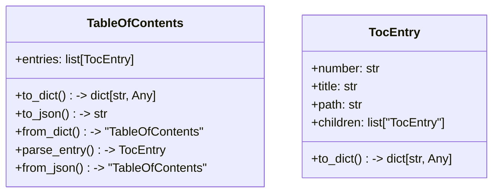
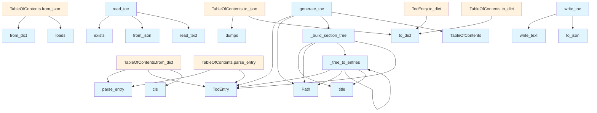

# Table of Contents Generator (toc.py)

## File Overview

This file provides functionality for writing table of contents data to the wiki filesystem. It contains utilities for serializing TableOfContents objects to JSON format and saving them to the appropriate location within a wiki directory structure.

## Functions

### write_toc

```python
def write_toc(toc: TableOfContents, wiki_path: Path) -> None
```

Writes a table of contents to a JSON file in the specified wiki directory.

**Parameters:**
- `toc` (TableOfContents): The TableOfContents object to serialize and write
- `wiki_path` (Path): Path to the wiki directory where the table of contents file will be created

**Returns:**
- None

**Behavior:**
- Creates a `toc.json` file in the specified wiki directory
- Serializes the TableOfContents object using its `to_json()` method
- Overwrites any existing `toc.json` file

## Usage Examples

### Writing a Table of Contents

```python
from pathlib import Path

# Assuming you have a TableOfContents object
wiki_directory = Path("/path/to/wiki")
write_toc(my_toc, wiki_directory)
```

This will create or update a `toc.json` file at `/path/to/wiki/toc.json`.

## Related Components

This file works with:
- TableOfContents class (referenced as parameter type)
- Path objects from the pathlib module for filesystem operations

The function expects the TableOfContents class to have a `to_json()` method that returns a JSON string representation of the table of contents data.

## API Reference

### class `TocEntry`

A single entry in the table of contents.

**Methods:**

#### `to_dict`

```python
def to_dict() -> dict[str, Any]
```

Convert to dictionary for JSON serialization.


### class `TableOfContents`

Hierarchical table of contents with numbered sections.

**Methods:**

#### `to_dict`

```python
def to_dict() -> dict[str, Any]
```

Convert to dictionary for JSON serialization.

#### `to_json`

```python
def to_json(indent: int = 2) -> str
```

Convert to JSON string.


| [Parameter](api_docs.md) | Type | Default | Description |
|-----------|------|---------|-------------|
| `indent` | `int` | `2` | - |

#### `from_dict`

```python
def from_dict(data: dict[str, Any]) -> "TableOfContents"
```

Create from dictionary.


| [Parameter](api_docs.md) | Type | Default | Description |
|-----------|------|---------|-------------|
| `data` | `dict[str, Any]` | - | - |

#### `parse_entry`

```python
def parse_entry(entry_data: dict[str, Any]) -> TocEntry
```


| [Parameter](api_docs.md) | Type | Default | Description |
|-----------|------|---------|-------------|
| `entry_data` | `dict[str, Any]` | - | - |

#### `from_json`

```python
def from_json(json_str: str) -> "TableOfContents"
```

Create from JSON string.


| [Parameter](api_docs.md) | Type | Default | Description |
|-----------|------|---------|-------------|
| `json_str` | `str` | - | - |


---

### Functions

#### `generate_toc`

```python
def generate_toc(pages: list[dict[str, str]]) -> TableOfContents
```

Generate hierarchical numbered table of contents from wiki pages.


| [Parameter](api_docs.md) | Type | Default | Description |
|-----------|------|---------|-------------|
| `pages` | `list[dict[str, str]]` | - | List of dicts with 'path' and 'title' keys. |

**Returns:** `TableOfContents`


#### `write_toc`

```python
def write_toc(toc: TableOfContents, wiki_path: Path) -> None
```

Write table of contents to toc.json file.


| [Parameter](api_docs.md) | Type | Default | Description |
|-----------|------|---------|-------------|
| `toc` | `TableOfContents` | - | The TableOfContents to write. |
| `wiki_path` | `Path` | - | Path to the wiki directory. |

**Returns:** `None`


#### `read_toc`

```python
def read_toc(wiki_path: Path) -> TableOfContents | None
```

Read table of contents from toc.json file.


| [Parameter](api_docs.md) | Type | Default | Description |
|-----------|------|---------|-------------|
| `wiki_path` | `Path` | - | Path to the wiki directory. |

**Returns:** `TableOfContents | None`


## Class Diagram



## Call Graph



## Usage Examples

*Examples extracted from test files*

### Example: `TocEntry`

From `test_toc.py::test_to_dict_simple`:

```python
entry = TocEntry(number="1", title="Overview", path="index.md")
        result = entry.to_dict()
        assert result == {
```

### Example: `TocEntry`

From `test_toc.py::test_to_dict_with_children`:

```python
child = TocEntry(number="1.1", title="Getting Started", path="start.md")
        entry = TocEntry(
            number="1",
            title="Overview",
            path="index.md",
            children=[child],
        )
        result = entry.to_dict()
        assert result == {
```

### Example: `toc`

From `test_toc.py::test_to_json`:

```python
toc = TableOfContents(entries=[entry])
json_str = toc.to_json()
data = json.loads(json_str)
assert data == {"entries": [{"number": "1", "title": "Overview", "path": "index.md"}]}
```

### Example: `TableOfContents`

From `test_toc.py::test_to_json`:

```python
toc = TableOfContents(entries=[entry])
json_str = toc.to_json()
data = json.loads(json_str)
assert data == {"entries": [{"number": "1", "title": "Overview", "path": "index.md"}]}
```

### Example: `toc`

From `test_toc.py::test_from_dict`:

```python
toc = TableOfContents.from_dict(data)
assert len(toc.entries) == 1
```

## Relevant Source Files

- `src/local_deepwiki/generators/toc.py:10-27`

## See Also

- [test_toc](../../../tests/test_toc.md) - uses this
- [wiki](wiki.md) - uses this
- [diagrams](diagrams.md) - shares 3 dependencies
- [vectorstore](../core/vectorstore.md) - shares 3 dependencies
- [models](../models.md) - shares 3 dependencies
