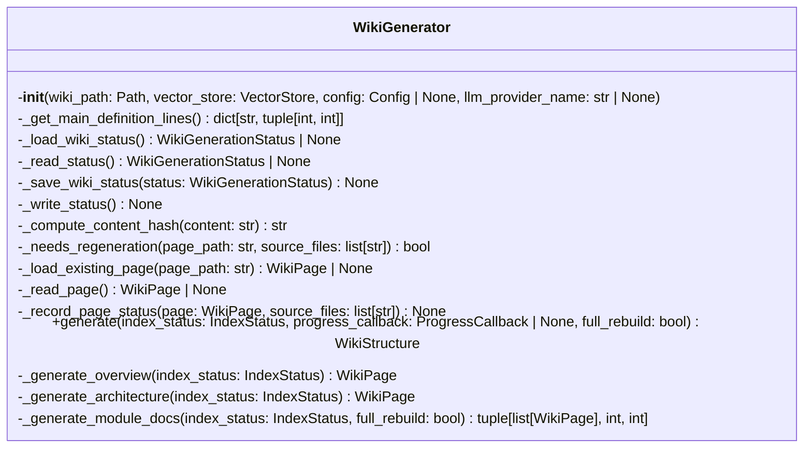

# wiki.py

## File Overview

The `wiki.py` file contains the core wiki generation functionality for the local_deepwiki system. It provides the WikiGenerator class and supporting functions to generate comprehensive documentation wikis from code repositories using vector stores and LLM providers.

## Classes

### WikiGenerator

The primary class responsible for generating wiki documentation from indexed code repositories.

**Purpose**: Orchestrates the generation of various wiki pages including overview, architecture, module documentation, dependencies, and changelog pages.

**Key Methods**:

- `__init__`: Initializes the wiki generator with a wiki output path, vector store, optional configuration, and LLM provider name override
- `_generate_changelog`: Generates a changelog page from git history, returning a [WikiPage](../models.md) or None if not a git repository
- `_load_wiki_status`: Loads existing wiki generation status for incremental updates
- `_save_wiki_status`: Saves the current wiki generation status
- `_compute_content_hash`: Computes hash of content for change detection
- `_needs_regeneration`: Determines if a page needs to be regenerated based on content changes
- `_load_existing_page`: Loads an existing wiki page from disk
- `_record_page_status`: Records the generation status of a wiki page
- `generate`: Main method to generate the complete wiki documentation
- `_generate_overview`: Generates the [main](../web/app.md) overview page
- `_generate_architecture`: Generates architecture documentation
- `_generate_module_docs`: Generates documentation for code modules
- `_generate_modules_index`: Generates an index page of all modules
- `_generate_single_file_doc`: Generates documentation for a single file
- `_generate_file_docs`: Generates documentation for multiple files
- `_generate_files_index`: Generates an index page of all files
- `_generate_dependencies`: Generates dependency documentation
- `_write_page`: Writes a wiki page to disk
- `_sync_write`: Synchronously writes content to a file

## Functions

### generate_wiki

A convenience function that creates and runs a WikiGenerator to generate complete wiki documentation.

**Parameters**:
- `repo_path`: Path to the repository
- `wiki_path`: Path for wiki output
- `vector_store`: Indexed vector store
- `index_status`: Index status object
- `config`: Optional configuration (defaults to None)
- `llm_provider`: Optional LLM provider name override (defaults to None)
- [`progress_callback`](../server.md): Optional progress callback function (defaults to None)
- `full_rebuild`: Whether to perform a full rebuild (defaults to False)

**Returns**: [WikiStructure](../models.md) object containing the generated wiki structure

## Usage Examples

### Basic Wiki Generation

```python
from pathlib import Path
from local_deepwiki.generators.wiki import generate_wiki

# Generate wiki documentation
wiki_structure = await generate_wiki(
    repo_path=Path("/path/to/repo"),
    wiki_path=Path("/path/to/wiki/output"),
    vector_store=vector_store,
    index_status=index_status
)
```

### Using WikiGenerator Directly

```python
from local_deepwiki.generators.wiki import WikiGenerator

# Initialize generator
generator = WikiGenerator(
    wiki_path=Path("/path/to/wiki"),
    vector_store=vector_store,
    config=config,
    llm_provider_name="ollama"
)

# Generate wiki
wiki_structure = await generator.generate()
```

### With Custom Configuration

```python
# Generate with custom LLM provider and full rebuild
wiki_structure = await generate_wiki(
    repo_path=repo_path,
    wiki_path=wiki_path,
    vector_store=vector_store,
    index_status=index_status,
    llm_provider="anthropic",
    full_rebuild=True
)
```

## Related Components

This file integrates with several other components in the local_deepwiki system:

- **[Config](../config.md)**: Uses configuration management for wiki generation settings
- **VectorStore**: Retrieves indexed code information for documentation generation
- **[EntityRegistry](crosslinks.md)**: Works with cross-linking functionality to connect related documentation
- **API docs generators**: Integrates with `get_file_api_docs` for API documentation
- **Call graph generators**: Uses `get_file_call_graph` for code relationship visualization
- **Test examples**: Incorporates `get_file_examples` for usage examples
- **Diagram generators**: Uses various diagram generation functions for visual documentation
- **Changelog generators**: Integrates with changelog generation functionality

The WikiGenerator class serves as the central orchestrator that coordinates these various documentation generation components to produce comprehensive wiki documentation.

## API Reference

### class `WikiGenerator`

Generate wiki documentation from indexed code.

**Methods:**

#### `__init__`

```python
def __init__(wiki_path: Path, vector_store: VectorStore, config: Config | None = None, llm_provider_name: str | None = None)
```

Initialize the wiki generator.


| Parameter | Type | Default | Description |
|-----------|------|---------|-------------|
| `wiki_path` | `Path` | - | Path to wiki output directory. |
| `vector_store` | `VectorStore` | - | Vector store with indexed code. |
| `config` | `Config | None` | `None` | Optional configuration. |
| `llm_provider_name` | `str | None` | `None` | Override LLM provider ("ollama", "anthropic", "openai"). |

#### `generate`

```python
async def generate(index_status: IndexStatus, progress_callback: ProgressCallback | None = None, full_rebuild: bool = False) -> WikiStructure
```

Generate wiki documentation for the indexed repository.


| Parameter | Type | Default | Description |
|-----------|------|---------|-------------|
| `index_status` | [`IndexStatus`](../models.md) | - | The index status with file information. |
| [`progress_callback`](../server.md) | `ProgressCallback | None` | `None` | Optional progress callback. |
| `full_rebuild` | `bool` | `False` | If True, regenerate all pages. Otherwise, only regenerate changed pages. |

#### `generate_with_semaphore`

```python
async def generate_with_semaphore(file_info: FileInfo) -> tuple[WikiPage | None, bool]
```


| Parameter | Type | Default | Description |
|-----------|------|---------|-------------|
| `file_info` | [`FileInfo`](../models.md) | - | - |


---

### Functions

#### `generate_wiki`

```python
async def generate_wiki(repo_path: Path, wiki_path: Path, vector_store: VectorStore, index_status: IndexStatus, config: Config | None = None, llm_provider: str | None = None, progress_callback: ProgressCallback | None = None, full_rebuild: bool = False) -> WikiStructure
```

Convenience function to generate wiki documentation.


| Parameter | Type | Default | Description |
|-----------|------|---------|-------------|
| `repo_path` | `Path` | - | Path to the repository. |
| `wiki_path` | `Path` | - | Path for wiki output. |
| `vector_store` | `VectorStore` | - | Indexed vector store. |
| `index_status` | [`IndexStatus`](../models.md) | - | Index status. |
| `config` | `Config | None` | `None` | Optional configuration. |
| `llm_provider` | `str | None` | `None` | Optional LLM provider override. |
| [`progress_callback`](../server.md) | `ProgressCallback | None` | `None` | Optional progress callback. |
| `full_rebuild` | `bool` | `False` | If True, regenerate all pages. Otherwise, only regenerate changed pages. |

**Returns:** [`WikiStructure`](../models.md)


## Class Diagram



## Call Graph

```mermaid
flowchart TD
    N0[Path]
    N1[WikiGenerator.__init__]
    N2[WikiGenerator._compute_cont...]
    N3[WikiGenerator._generate_arc...]
    N4[WikiGenerator._generate_cha...]
    N5[WikiGenerator._generate_dep...]
    N6[WikiGenerator._generate_fil...]
    N7[WikiGenerator._generate_mod...]
    N8[WikiGenerator._generate_ove...]
    N9[WikiGenerator._generate_sin...]
    N10[WikiGenerator._get_main_def...]
    N11[WikiGenerator._load_existin...]
    N12[WikiGenerator._load_wiki_st...]
    N13[WikiGenerator._read_status]
    N14[WikiGenerator._save_wiki_st...]
    N15[WikiGenerator._write_page]
    N16[WikiGenerator.generate]
    N17[WikiPage]
    N18[_load_existing_page]
    N19[_needs_regeneration]
    N20[_record_page_status]
    N21[exists]
    N22[generate]
    N23[generate_wiki]
    N24[get_config]
    N25[load]
    N26[model_validate]
    N27[search]
    N28[time]
    N29[to_thread]
    N23 --> N24
    N23 --> N22
    N1 --> N24
    N12 --> N21
    N12 --> N25
    N12 --> N26
    N12 --> N29
    N13 --> N25
    N13 --> N26
    N14 --> N29
    N11 --> N21
    N11 --> N0
    N11 --> N28
    N11 --> N17
    N11 --> N29
    N16 --> N0
    N16 --> N19
    N16 --> N18
    N16 --> N20
    N16 --> N27
    N16 --> N28
    N8 --> N0
    N8 --> N27
    N8 --> N22
    N8 --> N17
    N8 --> N28
    N3 --> N27
    N3 --> N22
    N3 --> N17
    N3 --> N28
    N7 --> N0
    N7 --> N19
    N7 --> N18
    N7 --> N20
    N7 --> N27
    N7 --> N22
    N7 --> N17
    N7 --> N28
    N9 --> N0
    N9 --> N19
    N9 --> N18
    N9 --> N20
    N9 --> N27
    N9 --> N22
    N9 --> N21
    N9 --> N17
    N9 --> N28
    N6 --> N17
    N6 --> N28
    N6 --> N20
    N5 --> N27
    N5 --> N22
    N5 --> N17
    N5 --> N28
    N4 --> N17
    N4 --> N28
    N15 --> N29
    classDef func fill:#e1f5fe
    class N0,N17,N18,N19,N20,N21,N22,N23,N24,N25,N26,N27,N28,N29 func
    classDef method fill:#fff3e0
    class N1,N2,N3,N4,N5,N6,N7,N8,N9,N10,N11,N12,N13,N14,N15,N16 method
```



## Relevant Source Files

- `src/local_deepwiki/generators/wiki.py:69-1276`

## See Also

- [config](../config.md) - dependency
- [diagrams](diagrams.md) - dependency
- [crosslinks](crosslinks.md) - dependency
- [models](../models.md) - dependency
