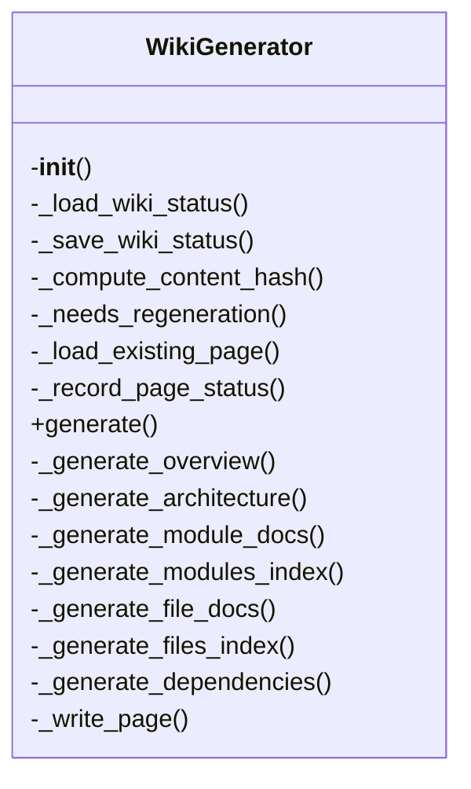

# Wiki Generator Module

## File Overview

The `wiki.py` module is responsible for generating wiki documentation from a codebase. It orchestrates the creation of various documentation components including module-level documentation, architecture overviews, dependency graphs, and cross-links between related code elements.

This module works with the [`VectorStore`](../core/vectorstore.md) to access indexed code information, and integrates with other generators like `api_docs`, `callgraph`, and `crosslinks` to produce comprehensive documentation. The [main](../web/app.md) entry point is the `WikiGenerator` class which handles the full wiki generation workflow.

## Classes

### WikiGenerator

The WikiGenerator class is the core component for generating wiki documentation. It manages the overall process of creating documentation pages, tracking generation status, and coordinating with other documentation generators.

**Key Methods:**

- `__init__`: Initializes the generator with paths, vector store, and configuration
- `_load_wiki_status`: Loads previous generation status from disk
- `_save_wiki_status`: Saves current generation status to disk
- `_needs_regeneration`: Determines if a page needs to be regenerated
- `_load_existing_page`: Loads an existing page from disk
- `_record_page_status`: Records status information for generated pages
- `generate`: Main method to execute wiki generation
- `_generate_overview`: Creates the [main](../web/app.md) overview page
- `_generate_architecture`: Creates architecture documentation
- `_generate_module_docs`: Generates documentation for individual modules
- `_generate_modules_index`: Creates index of all modules
- `_generate_file_docs`: Generates documentation for individual files
- `_generate_files_index`: Creates index of all files
- `_generate_dependencies`: Creates dependency documentation
- `_write_page`: Writes a page to disk

**Usage Example:**
```python
from local_deepwiki.generators.wiki import WikiGenerator
from local_deepwiki.core.vectorstore import VectorStore
from pathlib import Path

# Initialize generator
vector_store = VectorStore()
wiki_gen = WikiGenerator(
    wiki_path=Path("wiki_output"),
    vector_store=vector_store
)

# Generate wiki
wiki_gen.generate()
```

## Functions

### generate_wiki

A convenience function that provides a simplified interface for generating wiki documentation.

**Parameters:**
- `repo_path`: Path to the repository
- `wiki_path`: Path for wiki output
- `vector_store`: Indexed vector store
- `index_status`: Index status
- `config`: Optional configuration
- `llm_provider`: Optional LLM provider name
- [`progress_callback`](../server.md): Optional callback for progress updates
- `full_rebuild`: Whether to perform a full rebuild

**Returns:**
- [`WikiStructure`](../models.md): The generated wiki structure

**Usage Example:**
```python
from local_deepwiki.generators.wiki import generate_wiki
from pathlib import Path

# Generate wiki documentation
wiki_structure = await generate_wiki(
    repo_path=Path("my_repo"),
    wiki_path=Path("wiki_output"),
    vector_store=vector_store,
    index_status=index_status
)
```

### generate_class_diagram

Generates a class diagram for a given file path.

**Parameters:**
- `file_path`: Path to the file to generate diagram for

**Returns:**
- String containing the class diagram

### sanitize

Sanitizes input text for use in wiki pages.

**Parameters:**
- `text`: Input text to sanitize

**Returns:**
- Sanitized text

### generate_dependency_graph

Generates a dependency graph for a given file path.

**Parameters:**
- `file_path`: Path to the file to generate graph for

**Returns:**
- String containing the dependency graph

### _path_to_module

Converts a file path to a Python module name.

**Parameters:**
- `path`: File path to convert

**Returns:**
- Module name string

### _parse_import_line

Parses an import line to extract module information.

**Parameters:**
- `line`: Import line to parse

**Returns:**
- Parsed import information

## Usage Examples

### Basic Wiki Generation

```python
from local_deepwiki.generators.wiki import WikiGenerator
from local_deepwiki.core.vectorstore import VectorStore
from pathlib import Path

# Create vector store and wiki generator
vector_store = VectorStore()
wiki_gen = WikiGenerator(
    wiki_path=Path("wiki_output"),
    vector_store=vector_store
)

# Generate the wiki
wiki_gen.generate()
```

### Using the Convenience Function

```python
from local_deepwiki.generators.wiki import generate_wiki
from pathlib import Path

# Generate wiki using convenience function
wiki_structure = await generate_wiki(
    repo_path=Path("my_project"),
    wiki_path=Path("docs/wiki"),
    vector_store=vector_store,
    index_status=index_status
)
```

## Related Components

This module works with the [VectorStore](../core/vectorstore.md) to access indexed code information and metadata. It integrates with the api_docs generator to extract API documentation, the callgraph generator to create call graphs, and the crosslinks generator to establish relationships between documentation elements. The [EntityRegistry](crosslinks.md) and [RelationshipAnalyzer](see_also.md) classes are used for managing cross-links and see-also sections. The search generator is used to create search indexes for the generated wiki.

## API Reference

### class `WikiGenerator`

Generate wiki documentation from indexed code.

**Methods:**

#### `__init__`

```python
def __init__(wiki_path: Path, vector_store: VectorStore, config: Config | None = None, llm_provider_name: str | None = None)
```

Initialize the wiki generator.


| [Parameter](api_docs.md) | Type | Default | Description |
|-----------|------|---------|-------------|
| `wiki_path` | `Path` | - | Path to wiki output directory. |
| `vector_store` | [`VectorStore`](../core/vectorstore.md) | - | Vector store with indexed code. |
| `config` | `Config | None` | `None` | Optional configuration. |
| `llm_provider_name` | `str | None` | `None` | Override LLM provider ("ollama", "anthropic", "openai"). |

#### `generate`

```python
async def generate(index_status: IndexStatus, progress_callback: Any = None, full_rebuild: bool = False) -> WikiStructure
```

Generate wiki documentation for the indexed repository.


| [Parameter](api_docs.md) | Type | Default | Description |
|-----------|------|---------|-------------|
| `index_status` | [`IndexStatus`](../models.md) | - | The index status with file information. |
| [`progress_callback`](../server.md) | `Any` | `None` | Optional progress callback. |
| `full_rebuild` | `bool` | `False` | If True, regenerate all pages. Otherwise, only regenerate changed pages. |


---

### Functions

#### `generate_class_diagram`

```python
def generate_class_diagram(chunks: list) -> str | None
```

Generate a Mermaid class diagram from code chunks.


| [Parameter](api_docs.md) | Type | Default | Description |
|-----------|------|---------|-------------|
| `chunks` | `list` | - | List of [CodeChunk](../models.md) objects. |

**Returns:** `str | None`


#### `sanitize`

```python
def sanitize(name: str) -> str
```


| [Parameter](api_docs.md) | Type | Default | Description |
|-----------|------|---------|-------------|
| `name` | `str` | - | - |

**Returns:** `str`


#### `generate_dependency_graph`

```python
def generate_dependency_graph(chunks: list, project_name: str = "project") -> str | None
```

Generate a Mermaid flowchart showing module dependencies.


| [Parameter](api_docs.md) | Type | Default | Description |
|-----------|------|---------|-------------|
| `chunks` | `list` | - | List of [CodeChunk](../models.md) objects (should include IMPORT chunks). |
| `project_name` | `str` | `"project"` | Name of the project for filtering internal imports. |

**Returns:** `str | None`


#### `generate_wiki`

```python
async def generate_wiki(repo_path: Path, wiki_path: Path, vector_store: VectorStore, index_status: IndexStatus, config: Config | None = None, llm_provider: str | None = None, progress_callback: Any = None, full_rebuild: bool = False) -> WikiStructure
```

Convenience function to generate wiki documentation.


| [Parameter](api_docs.md) | Type | Default | Description |
|-----------|------|---------|-------------|
| `repo_path` | `Path` | - | Path to the repository. |
| `wiki_path` | `Path` | - | Path for wiki output. |
| `vector_store` | [`VectorStore`](../core/vectorstore.md) | - | Indexed vector store. |
| `index_status` | [`IndexStatus`](../models.md) | - | Index status. |
| `config` | `Config | None` | `None` | Optional configuration. |
| `llm_provider` | `str | None` | `None` | Optional LLM provider override. |
| [`progress_callback`](../server.md) | `Any` | `None` | Optional progress callback. |
| `full_rebuild` | `bool` | `False` | If True, regenerate all pages. Otherwise, only regenerate changed pages. |

**Returns:** [`WikiStructure`](../models.md)


## Class Diagram



## Call Graph

```mermaid
flowchart TD
    N0[Path]
    N1[WikiGenerator.__init__]
    N2[WikiGenerator._compute_cont...]
    N3[WikiGenerator._generate_arc...]
    N4[WikiGenerator._generate_dep...]
    N5[WikiGenerator._generate_fil...]
    N6[WikiGenerator._generate_mod...]
    N7[WikiGenerator._generate_ove...]
    N8[WikiGenerator._load_existin...]
    N9[WikiGenerator._load_wiki_st...]
    N10[WikiGenerator._record_page_...]
    N11[WikiGenerator._save_wiki_st...]
    N12[WikiGenerator.generate]
    N13[WikiPage]
    N14[_load_existing_page]
    N15[_needs_regeneration]
    N16[_path_to_module]
    N17[_record_page_status]
    N18[encode]
    N19[exists]
    N20[generate]
    N21[generate_class_diagram]
    N22[generate_dependency_graph]
    N23[generate_wiki]
    N24[hexdigest]
    N25[model_dump]
    N26[search]
    N27[setdefault]
    N28[sha256]
    N29[time]
    N22 --> N16
    N16 --> N0
    N23 --> N20
    N9 --> N19
    N11 --> N25
    N2 --> N24
    N2 --> N28
    N2 --> N18
    N8 --> N19
    N8 --> N0
    N8 --> N29
    N8 --> N13
    N12 --> N15
    N12 --> N14
    N12 --> N17
    N12 --> N26
    N12 --> N29
    N12 --> N24
    N12 --> N28
    N12 --> N18
    N12 --> N25
    N7 --> N0
    N7 --> N20
    N7 --> N13
    N7 --> N29
    N3 --> N26
    N3 --> N20
    N3 --> N13
    N3 --> N29
    N6 --> N0
    N6 --> N27
    N6 --> N15
    N6 --> N14
    N6 --> N17
    N6 --> N26
    N6 --> N20
    N6 --> N13
    N6 --> N29
    N5 --> N0
    N5 --> N15
    N5 --> N14
    N5 --> N17
    N5 --> N26
    N5 --> N20
    N5 --> N19
    N5 --> N21
    N5 --> N13
    N5 --> N29
    N4 --> N26
    N4 --> N20
    N4 --> N22
    N4 --> N13
    N4 --> N29
    classDef func fill:#e1f5fe
    class N0,N13,N14,N15,N16,N17,N18,N19,N20,N21,N22,N23,N24,N25,N26,N27,N28,N29 func
    classDef method fill:#fff3e0
    class N1,N2,N3,N4,N5,N6,N7,N8,N9,N10,N11,N12 method
```



## See Also

- [server](../server.md) - uses this
- [watcher](../watcher.md) - uses this
- [test_incremental_wiki](../../../tests/test_incremental_wiki.md) - uses this
- [models](../models.md) - dependency
- [config](../config.md) - dependency
