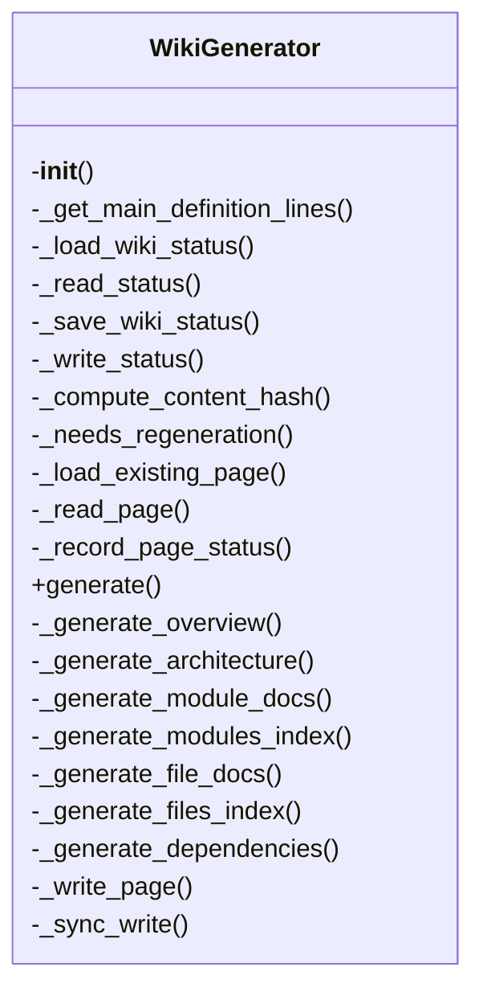

# Wiki Generator Documentation

## File Overview

This file contains the core logic for generating wiki documentation from a codebase. It defines the `WikiGenerator` class and a convenience function `generate_wiki` that orchestrates the wiki generation process. The generator uses a vector store to index code and LLMs to create documentation.

## Classes

### WikiGenerator

The WikiGenerator class is responsible for generating wiki documentation from a codebase using a vector store and LLMs.

#### Constructor

```python
def __init__(
    self,
    wiki_path: Path,
    vector_store: VectorStore,
    config: Config | None = None,
    llm_provider_name: str | None = None,
)
```

Initialize the wiki generator.

**Parameters:**
- `wiki_path`: Path to wiki output directory.
- `vector_store`: Vector store with indexed code.
- `config`: Optional configuration.
- `llm_provider_name`: Override LLM provider ("ollama", "anthropic", "openai").

#### Key Methods

- `_get_main_definition_lines`: Extracts [main](../watcher.md) definition lines from a file.
- `_load_wiki_status`: Loads the wiki status from disk.
- `_read_status`: Reads the status file.
- `_save_wiki_status`: Saves the wiki status to disk.
- `_write_status`: Writes the status file.
- `_compute_content_hash`: Computes a hash of file content.
- `_needs_regeneration`: Determines if a page needs regeneration.
- `_load_existing_page`: Loads an existing wiki page.
- `_read_page`: Reads a wiki page.
- `_record_page_status`: Records the status of a page.
- `generate`: Main method to generate the wiki.
- `_generate_overview`: Generates an overview page.
- `_generate_architecture`: Generates an architecture page.
- `_generate_module_docs`: Generates documentation for modules.
- `_generate_modules_index`: Generates an index of modules.
- `_generate_file_docs`: Generates documentation for individual files.
- `_generate_files_index`: Generates an index of files.
- `_generate_dependencies`: Generates dependency information.
- `_write_page`: Writes a wiki page to disk.
- `_sync_write`: Synchronous write operation.

## Functions

### generate_wiki

```python
async def generate_wiki(
    repo_path: Path,
    wiki_path: Path,
    vector_store: VectorStore,
    index_status: IndexStatus,
    config: Config | None = None,
    llm_provider: str | None = None,
    progress_callback: ProgressCallback | None = None,
    full_rebuild: bool = False,
) -> WikiStructure:
```

Convenience function to generate wiki documentation.

**Parameters:**
- `repo_path`: Path to the repository.
- `wiki_path`: Path for wiki output.
- `vector_store`: Indexed vector store.
- `index_status`: Index status.
- `config`: Optional configuration.
- `llm_provider`: LLM provider name ("ollama", "anthropic", "openai").
- [`progress_callback`](../watcher.md): Optional callback for progress updates.
- `full_rebuild`: Whether to perform a full rebuild.

**Returns:**
- `WikiStructure`: The generated wiki structure.

## Usage Examples

### Basic Usage

```python
from local_deepwiki.generators.wiki import generate_wiki
from local_deepwiki.core.vectorstore import VectorStore
from local_deepwiki.config import Config
from pathlib import Path

# Assuming you have a vector store and config ready
vector_store = VectorStore()
config = Config()

# Generate wiki
wiki_structure = await generate_wiki(
    repo_path=Path("path/to/repo"),
    wiki_path=Path("path/to/wiki"),
    vector_store=vector_store,
    index_status=index_status,
    config=config,
    llm_provider="openai"
)
```

## Related Components

This file works with the following components:

- [`VectorStore`](../core/vectorstore.md): Used for indexing code and retrieving relevant information.
- [`Config`](../config.md): Configuration settings for the wiki generation.
- [`get_config`](../config.md): Function to retrieve configuration.
- `get_logger`: Function to get logger instance.
- [`get_file_api_docs`](api_docs.md): Function to extract API documentation from files.
- `get_file_call_graph`: Function to generate call graphs.
- [`EntityRegistry`](crosslinks.md): Registry for cross-linking entities.
- [`add_cross_links`](crosslinks.md): Function to add cross-links to documentation.
- [`generate_class_diagram`](diagrams.md): Function to generate class diagrams.
- [`generate_dependency_graph`](diagrams.md): Function to generate dependency graphs.
- [`generate_language_pie_chart`](diagrams.md): Function to generate language distribution charts.
- `IndexStatus`: Status tracking for code indexing.
- `ProgressCallback`: Callback for progress updates.
- `WikiStructure`: Structure representing the generated wiki.

## API Reference

### class `WikiGenerator`

Generate wiki documentation from indexed code.

**Methods:**

#### `__init__`

```python
def __init__(wiki_path: Path, vector_store: VectorStore, config: Config | None = None, llm_provider_name: str | None = None)
```

Initialize the wiki generator.


| [Parameter](api_docs.md) | Type | Default | Description |
|-----------|------|---------|-------------|
| `wiki_path` | `Path` | - | Path to wiki output directory. |
| `vector_store` | [`VectorStore`](../core/vectorstore.md) | - | Vector store with indexed code. |
| `config` | `Config | None` | `None` | Optional configuration. |
| `llm_provider_name` | `str | None` | `None` | Override LLM provider ("ollama", "anthropic", "openai"). |

#### `generate`

```python
async def generate(index_status: IndexStatus, progress_callback: ProgressCallback | None = None, full_rebuild: bool = False) -> WikiStructure
```

Generate wiki documentation for the indexed repository.


| [Parameter](api_docs.md) | Type | Default | Description |
|-----------|------|---------|-------------|
| `index_status` | `IndexStatus` | - | The index status with file information. |
| [`progress_callback`](../watcher.md) | `ProgressCallback | None` | `None` | Optional progress callback. |
| `full_rebuild` | `bool` | `False` | If True, regenerate all pages. Otherwise, only regenerate changed pages. |


---

### Functions

#### `generate_wiki`

```python
async def generate_wiki(repo_path: Path, wiki_path: Path, vector_store: VectorStore, index_status: IndexStatus, config: Config | None = None, llm_provider: str | None = None, progress_callback: ProgressCallback | None = None, full_rebuild: bool = False) -> WikiStructure
```

Convenience function to generate wiki documentation.


| [Parameter](api_docs.md) | Type | Default | Description |
|-----------|------|---------|-------------|
| `repo_path` | `Path` | - | Path to the repository. |
| `wiki_path` | `Path` | - | Path for wiki output. |
| `vector_store` | [`VectorStore`](../core/vectorstore.md) | - | Indexed vector store. |
| `index_status` | `IndexStatus` | - | Index status. |
| `config` | `Config | None` | `None` | Optional configuration. |
| `llm_provider` | `str | None` | `None` | Optional LLM provider override. |
| [`progress_callback`](../watcher.md) | `ProgressCallback | None` | `None` | Optional progress callback. |
| `full_rebuild` | `bool` | `False` | If True, regenerate all pages. Otherwise, only regenerate changed pages. |

**Returns:** `WikiStructure`


## Class Diagram



## Call Graph

```mermaid
flowchart TD
    N0[Path]
    N1[WikiGenerator.__init__]
    N2[WikiGenerator._compute_cont...]
    N3[WikiGenerator._generate_arc...]
    N4[WikiGenerator._generate_dep...]
    N5[WikiGenerator._generate_fil...]
    N6[WikiGenerator._generate_mod...]
    N7[WikiGenerator._generate_ove...]
    N8[WikiGenerator._get_main_def...]
    N9[WikiGenerator._load_existin...]
    N10[WikiGenerator._load_wiki_st...]
    N11[WikiGenerator._read_status]
    N12[WikiGenerator._save_wiki_st...]
    N13[WikiGenerator._write_page]
    N14[WikiGenerator.generate]
    N15[WikiPage]
    N16[_load_existing_page]
    N17[_needs_regeneration]
    N18[_record_page_status]
    N19[dump]
    N20[exists]
    N21[generate]
    N22[generate_wiki]
    N23[hexdigest]
    N24[load]
    N25[model_dump]
    N26[model_validate]
    N27[search]
    N28[time]
    N29[to_thread]
    N22 --> N21
    N10 --> N20
    N10 --> N24
    N10 --> N26
    N10 --> N29
    N11 --> N24
    N11 --> N26
    N12 --> N25
    N12 --> N19
    N12 --> N29
    N2 --> N23
    N9 --> N20
    N9 --> N0
    N9 --> N28
    N9 --> N15
    N9 --> N29
    N14 --> N0
    N14 --> N17
    N14 --> N16
    N14 --> N18
    N14 --> N27
    N14 --> N28
    N14 --> N23
    N14 --> N25
    N7 --> N0
    N7 --> N27
    N7 --> N21
    N7 --> N15
    N7 --> N28
    N3 --> N27
    N3 --> N21
    N3 --> N15
    N3 --> N28
    N6 --> N0
    N6 --> N17
    N6 --> N16
    N6 --> N18
    N6 --> N27
    N6 --> N21
    N6 --> N15
    N6 --> N28
    N5 --> N0
    N5 --> N17
    N5 --> N16
    N5 --> N18
    N5 --> N27
    N5 --> N21
    N5 --> N20
    N5 --> N15
    N5 --> N28
    N4 --> N27
    N4 --> N21
    N4 --> N15
    N4 --> N28
    N13 --> N29
    classDef func fill:#e1f5fe
    class N0,N15,N16,N17,N18,N19,N20,N21,N22,N23,N24,N25,N26,N27,N28,N29 func
    classDef method fill:#fff3e0
    class N1,N2,N3,N4,N5,N6,N7,N8,N9,N10,N11,N12,N13,N14 method
```



## Relevant Source Files

- `src/local_deepwiki/generators/wiki.py:66-1160`

## See Also

- [test_incremental_wiki](../../../tests/test_incremental_wiki.md) - uses this
- [server](../server.md) - uses this
